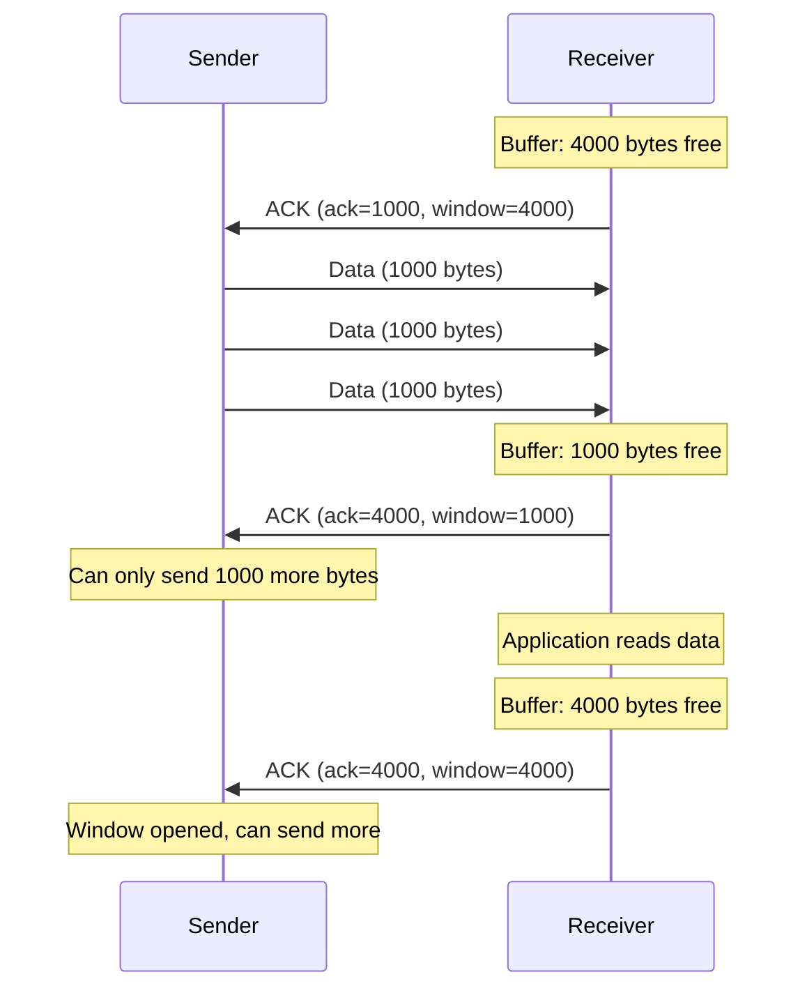

## Flow Control

Flow control prevents a fast sender from overwhelming a slow receiver's buffer.

### Sliding Window Protocol

The receiver advertises its available buffer space in the **window** field of every ACK. The sender limits unacknowledged data to this amount.

### Window Size Zero

When the receiver's buffer fills completely:

1. Receiver advertises **window = 0**
2. Sender stops transmitting data
3. Sender periodically sends **window probe** packets
4. When receiver has space, it advertises window > 0
5. Sender resumes transmission

This mechanism prevents buffer overflow and data loss at the receiver.
