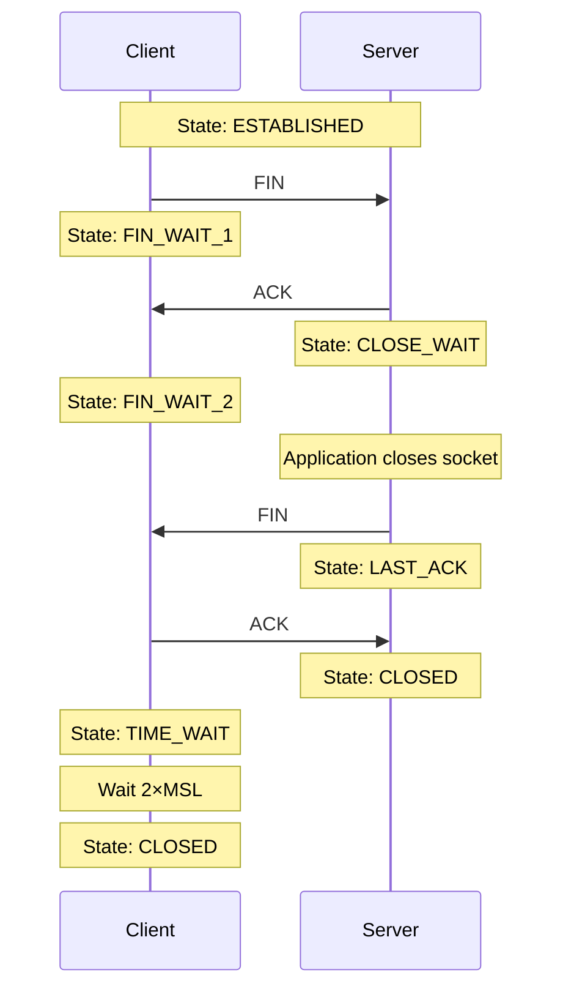
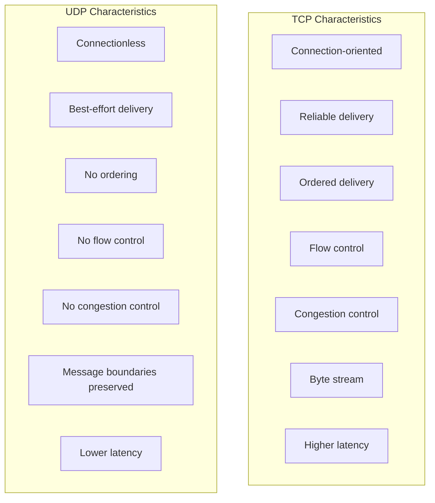
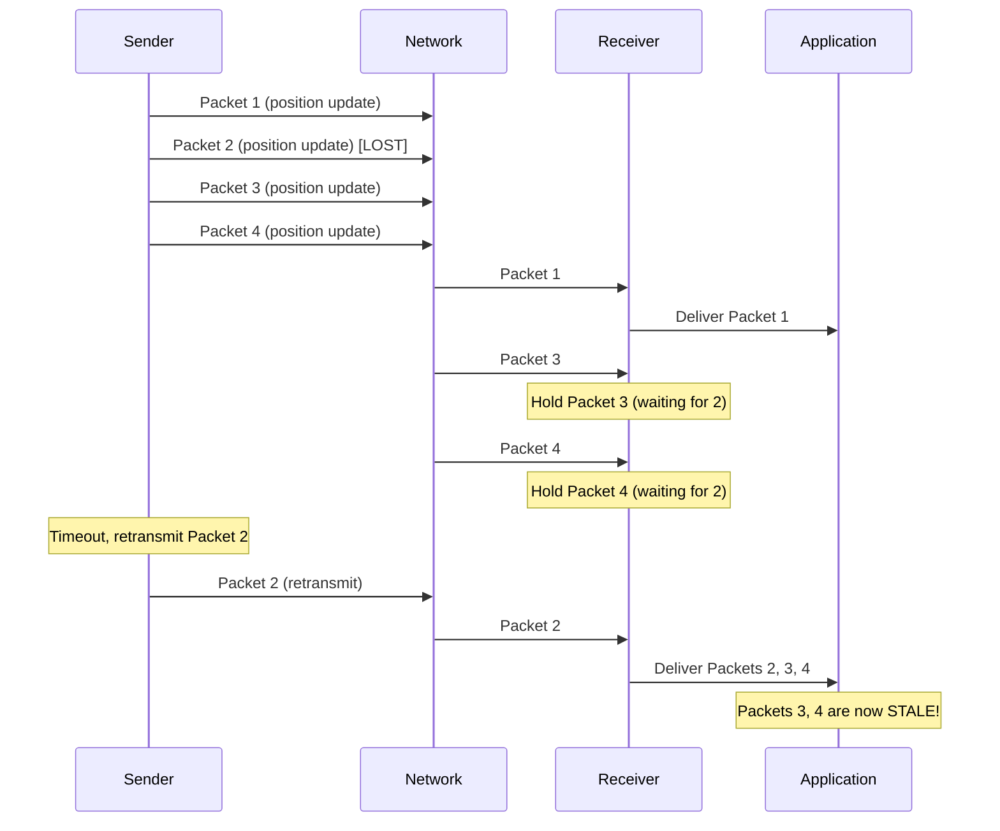

# TCP Connection Termination and Protocol Comparison

## Connection Termination

TCP uses a four-way handshake to close connections gracefully:

### Why Four Steps?

Unlike the handshake, termination is **asymmetric**:

- Each side independently closes its sending direction
- A connection can be **half-closed** (one direction closed, other open)
- This allows one side to signal "I'm done sending" while still receiving

### Graceful vs Abortive Close

| Close Type | Mechanism    | Effect                                     |
| ---------- | ------------ | ------------------------------------------ |
| Graceful   | FIN exchange | All buffered data delivered before close   |
| Abortive   | RST packet   | Immediate close, buffered data may be lost |

---

## TCP vs UDP Comparison

### Head-of-Line Blocking

A critical TCP limitation for real-time applications:

In games, stale position updates are worse than missing ones. This is why game state updates often use UDP.

### When to Choose Each Protocol

| TCP              | UDP                               |
| ---------------- | --------------------------------- |
| Chat messages    | Real-time game state              |
| File transfers   | Voice/video streaming             |
| Web browsing     | DNS queries                       |
| Email            | Live broadcasts                   |
| Database queries | Multiplayer game position updates |
