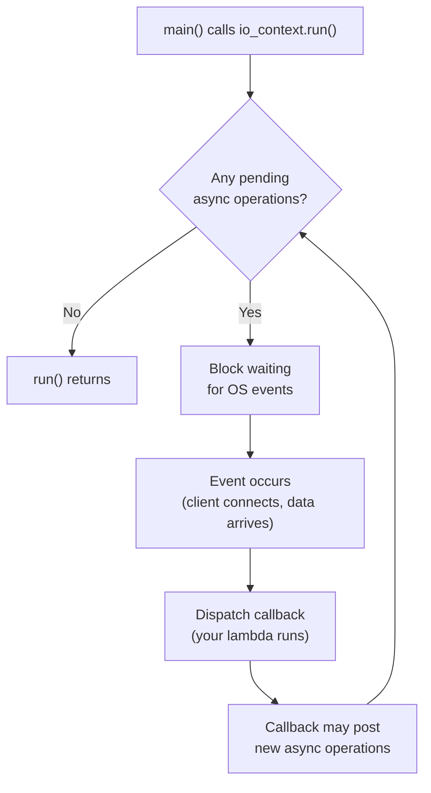
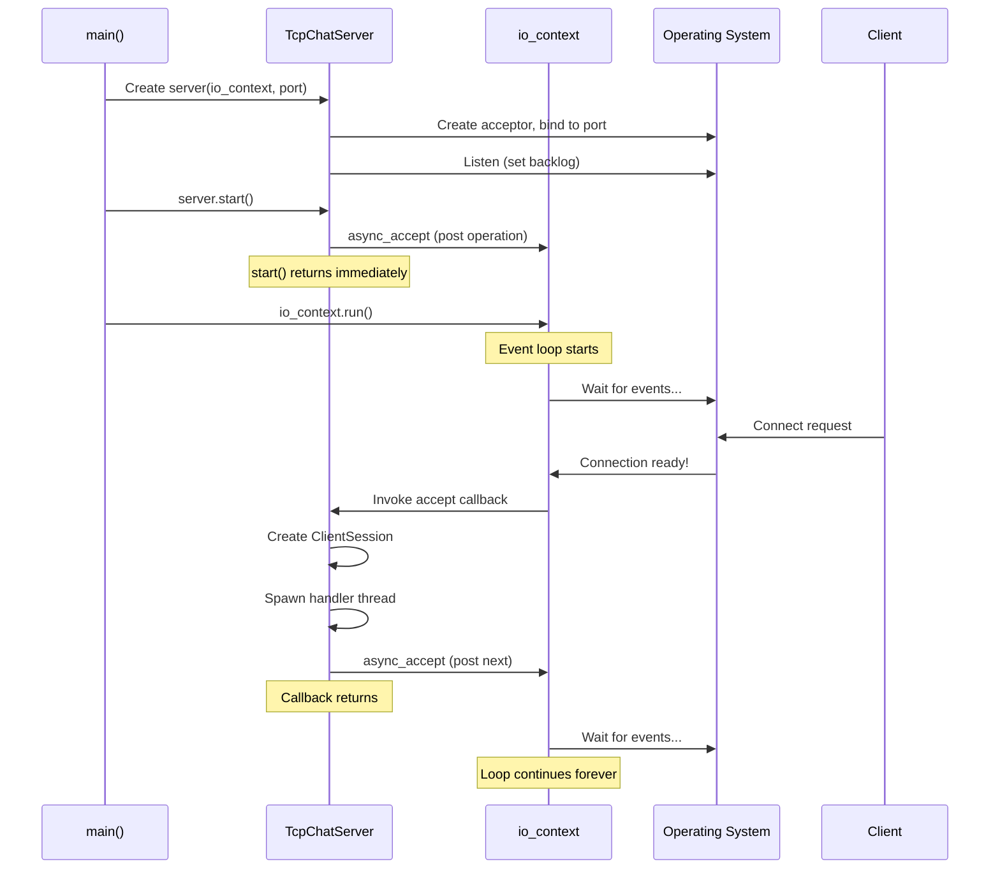
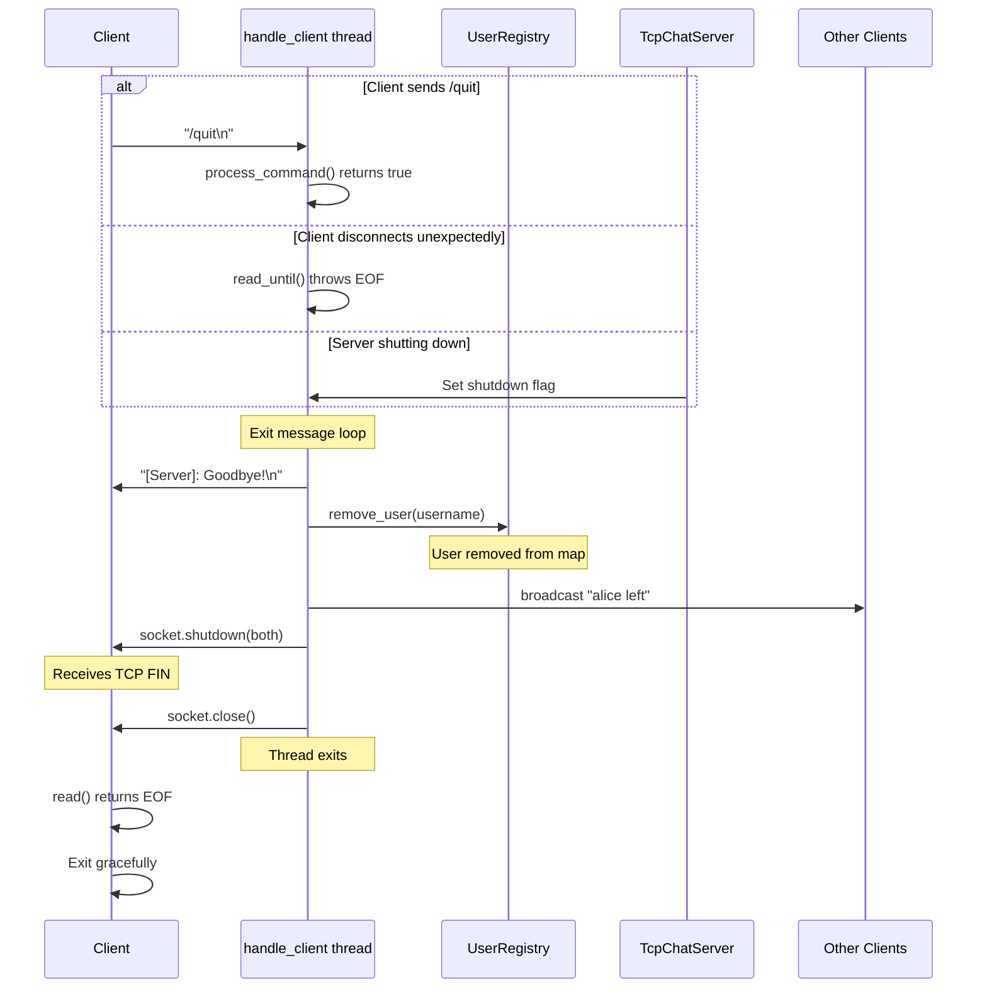
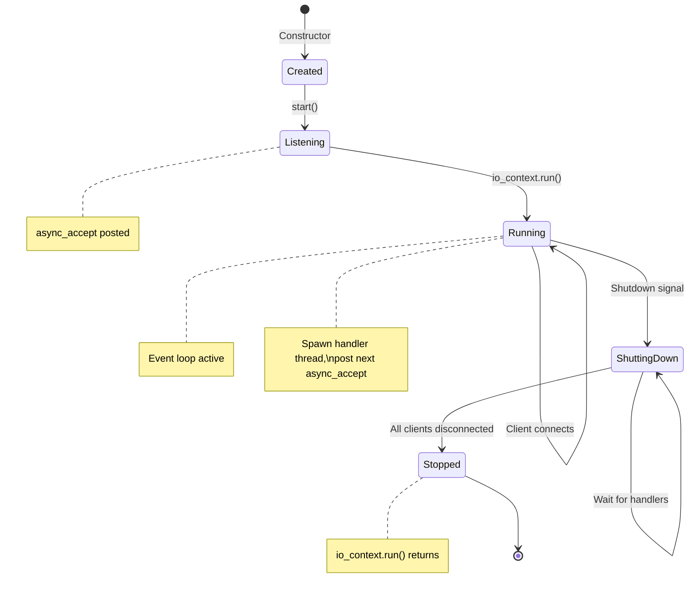
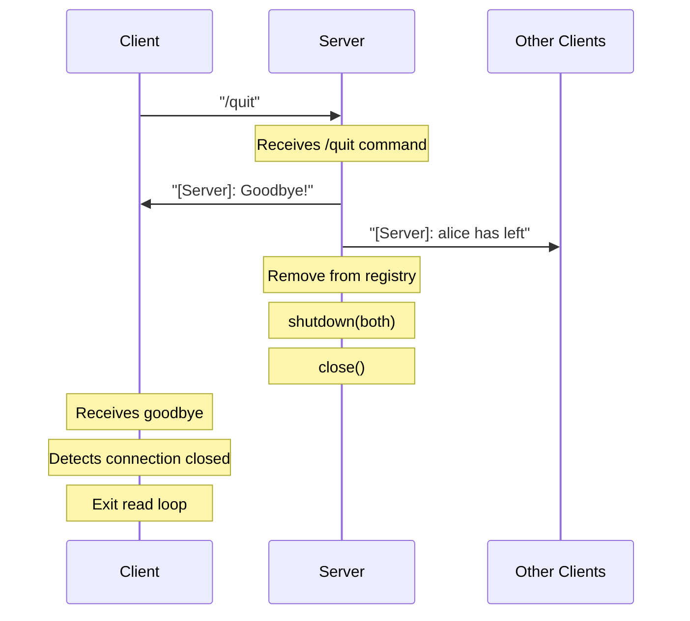

## Multi-Client Connection Management

Building a chatroom or multi-user server requires tracking multiple connected clients. This section shows modern C++ techniques that make concurrent programming easier for beginners.

### Server Architecture: start() and accept_connection()

A multi-client server has two main responsibilities:

1. **Accept Loop** — Continuously wait for new clients to connect
2. **Client Handlers** — Process messages from each connected client

These must happen **concurrently** — you can't stop accepting new clients while handling an existing one.

**The `start()` Function:**

The `start()` method initiates the accept loop. There are two common patterns:

**Pattern 1: Blocking Accept Loop**

```cpp
void start() {
    // Set socket options before accepting
    m_acceptor.set_option(tcp::acceptor::reuse_address(true));

    // Run the accept loop (blocks forever, accepting clients)
    accept_connection();
}

void accept_connection() {
    while (true) {
        // Create a new socket for this client
        tcp::socket socket(m_io_context);

        // Block until a client connects
        m_acceptor.accept(socket);

        // Create a session object (use std::move since sockets can't be copied)
        auto client = std::make_shared<ClientSession>(std::move(socket));

        std::cout << "[Server] New connection from: "
                  << client->socket().remote_endpoint() << "\n";

        // Spawn a thread to handle this client
        // The thread runs handle_client() independently
        std::thread([this, client]() {
            handle_client(client);
        }).detach();

        // Loop continues, ready to accept next client
    }
}
```

**Pattern 2: Async Accept (More Advanced)**

```cpp
void start() {
    m_acceptor.set_option(tcp::acceptor::reuse_address(true));
    accept_connection();  // Start the async chain
}

void accept_connection() {
    m_acceptor.async_accept(
        [this](boost::system::error_code ec, tcp::socket socket) {
            if (!ec) {
                auto client = std::make_shared<ClientSession>(std::move(socket));
                std::thread([this, client]() {
                    handle_client(client);
                }).detach();
            }
            accept_connection();  // Accept next client (async chain continues)
        });
}
```

::: tip "Which Pattern to Use?"

**Pattern 1 (blocking).** It's simpler to understand and debug.

`accept()` blocks until a client connects, then returns the new socket. You immediately spawn a thread for that client, then loop back to accept the next one.

**Common Mistake:** Don't call `io_context.run()` if you're using the blocking pattern, it's only needed for async operations.

:::

### Understanding `io_context.run()` for Async Operations

When using **Pattern 2 (async)**, you **must** call `io_context.run()` — this is the event loop that drives all async operations.

**What `io_context.run()` Does:**

1. **Blocks** the calling thread
2. **Waits** for async operations to complete (accepts, reads, writes)
3. **Dispatches** callbacks when events occur
4. **Returns** only when there's no more work (all sockets closed, no pending operations)

```cpp
int main() {
    boost::asio::io_context io_context;
    TcpChatServer server(io_context, 12345);

    server.start();  // Posts async_accept — returns immediately!

    // Without this, the program would exit immediately.
    // run() blocks and processes all async events.
    io_context.run();  // <-- Event loop starts here

    // Only reaches here when io_context has no more work
    return 0;
}
```

**The Event Loop Explained:**



**Key Insight:** The "recursion" in async accept isn't really recursion:

```cpp
void accept_connection() {
    m_acceptor.async_accept([this](error_code ec, tcp::socket socket) {
        // ... handle connection ...
        accept_connection();  // Posts new operation, returns immediately
    });
    // Returns here immediately — stack unwinds
}
```

When the lambda calls `accept_connection()` again:

- It **posts** a new async operation to the io_context
- The lambda **returns** (stack unwinds completely)
- `io_context.run()` then dispatches the next event

Each callback runs with a **fresh stack frame** — no stack growth!

::: warning "Common Async Mistakes"

1. **Forgetting `io_context.run()`** — Program exits immediately
2. **Calling `run()` with blocking operations** — Defeats the purpose
3. **Letting `io_context` run out of work** — `run()` returns, program may exit

To keep the server running forever, ensure there's always at least one pending async operation (like `async_accept`).

:::

### Server Lifecycle: Startup and Graceful Shutdown

Here's the complete flow for a chat server:

**Server Startup Flow:**



**Graceful Shutdown Flow (Server-Initiated or /quit):**



**Complete Server Lifecycle State Diagram:**



**The `handle_client()` Function:**

This runs in its own thread for each client:

```cpp
void handle_client(ClientPtr client) {
    try {
        // 1. Read username (first message from client)
        boost::asio::streambuf buffer;
        boost::asio::read_until(client->socket(), buffer, '\n');
        std::istream is(&buffer);
        std::string username;
        std::getline(is, username);

        client->set_username(username);

        // 2. Try to register (reject if name taken)
        if (!m_registry.add_user(username, client)) {
            boost::asio::write(client->socket(),
                boost::asio::buffer("[Server]: Username taken!\n"));
            return;  // End this handler
        }

        // 3. Announce join
        m_registry.broadcast("[Server]: " + username + " joined the chat\n", username);

        // 4. Message loop
        while (true) {
            boost::asio::read_until(client->socket(), buffer, '\n');
            std::istream msg_stream(&buffer);
            std::string message;
            std::getline(msg_stream, message);

            if (message.empty()) continue;

            // Check for commands
            if (message[0] == '/') {
                if (process_command(client, message)) {
                    break;  // /quit returns true
                }
            } else {
                // Regular message — broadcast to all
                m_registry.broadcast("[" + username + "]: " + message + "\n", username);
            }
        }

    } catch (std::exception& e) {
        // Client disconnected unexpectedly
    }

    // 5. Cleanup (always runs)
    std::string username = client->username();
    m_registry.remove_user(username);
    m_registry.broadcast("[Server]: " + username + " left the chat\n");

    boost::system::error_code ec;
    client->socket().shutdown(tcp::socket::shutdown_both, ec);
    client->socket().close(ec);
}
```

### User Registry with Modern C++

```cpp
#include <boost/asio.hpp>
#include <map>
#include <memory>
#include <shared_mutex>  // C++17
#include <atomic>
#include <thread>
#include <string>

using boost::asio::ip::tcp;

// Represents a connected user
struct User {
    std::string username;
    std::shared_ptr<tcp::socket> socket;
    std::atomic<bool> is_connected{true};  // Lock-free status flag
};

// Registry to track all connected users by username
class UserRegistry {
private:
    std::map<std::string, std::shared_ptr<User>> users;
    mutable std::shared_mutex registry_lock;  // Reader-writer lock (C++17)

public:
    // Add a new user to the registry
    bool add_user(const std::string& username,
                  std::shared_ptr<tcp::socket> socket) {
        std::unique_lock lock(registry_lock);  // Exclusive (write) lock

        if (users.contains(username)) {  // C++20 contains()
            return false;  // Username taken
        }

        auto user = std::make_shared<User>();
        user->username = username;
        user->socket = socket;
        users[username] = user;

        return true;
    }

    // Remove a user from the registry
    bool remove_user(const std::string& username) {
        std::unique_lock lock(registry_lock);
        return users.erase(username) > 0;
    }

    // Get a user by username (read-only, allows concurrent access)
    std::shared_ptr<User> get_user(const std::string& username) {
        std::shared_lock lock(registry_lock);  // Shared (read) lock

        auto it = users.find(username);
        return (it != users.end()) ? it->second : nullptr;
    }

    // Broadcast message to all users
    void broadcast_message(const std::string& from_user,
                          const std::string& message) {
        std::string formatted = from_user + ": " + message + "\n";

        std::shared_lock lock(registry_lock);  // Read lock for iteration

        for (auto& [username, user] : users) {
            if (username != from_user && user->is_connected) {
                try {
                    boost::asio::write(*user->socket,
                        boost::asio::buffer(formatted));
                } catch (...) {
                    // Handle write errors gracefully
                }
            }
        }
    }

    // Get list of all connected usernames
    std::vector<std::string> get_user_list() {
        std::shared_lock lock(registry_lock);

        std::vector<std::string> usernames;
        usernames.reserve(users.size());
        for (auto& [username, user] : users) {
            usernames.push_back(username);
        }
        return usernames;
    }

    // Get all connected users (returns the User objects, not just names)
    // Useful when you need access to sockets for direct messaging
    std::vector<std::shared_ptr<User>> get_all_users() {
        std::shared_lock lock(registry_lock);

        std::vector<std::shared_ptr<User>> all_users;
        all_users.reserve(users.size());
        for (auto& [username, user] : users) {
            all_users.push_back(user);
        }
        return all_users;
    }

    // Get count of connected users
    size_t user_count() {
        std::shared_lock lock(registry_lock);
        return users.size();
    }
};
```

### Modern Multi-Client Server with std::jthread

```cpp
// Forward declaration
void handle_client(std::shared_ptr<tcp::socket> socket,
                   std::string username,
                   UserRegistry& registry);

int main() {
    boost::asio::io_context io_context;
    UserRegistry registry;
    std::vector<std::jthread> client_threads;  // C++20: auto-joins on destruction

    tcp::acceptor acceptor(io_context,
        tcp::endpoint(tcp::v4(), 12345));
    acceptor.set_option(tcp::acceptor::reuse_address(true));
    acceptor.listen(128);

    std::cout << "Chatroom server listening on port 12345..." << std::endl;

    while (true) {
        auto socket = std::make_shared<tcp::socket>(io_context);
        acceptor.accept(*socket);

        std::cout << "New connection from: "
                  << socket->remote_endpoint() << std::endl;

        // Read username from client
        boost::asio::streambuf buffer;
        boost::asio::read_until(*socket, buffer, '\n');

        std::istream is(&buffer);
        std::string username;
        std::getline(is, username);

        // Try to register user
        if (!registry.add_user(username, socket)) {
            std::string error_msg = "ERROR: Username already taken\n";
            boost::asio::write(*socket,
                boost::asio::buffer(error_msg));
            socket->close();
            continue;
        }

        std::cout << "User '" << username << "' connected. "
                  << "Total users: " << registry.user_count() << std::endl;

        // Notify others
        registry.broadcast_message("SERVER",
            username + " joined the chatroom");

        // std::jthread automatically joins on destruction - no .detach() needed!
        client_threads.emplace_back([socket, username, &registry] () {
            handle_client(socket, username, registry);
        });
    }

    return 0;
}

// Handle individual client with cooperative cancellation support
void handle_client(std::shared_ptr<tcp::socket> socket,
                   std::string username,
                   UserRegistry& registry) {
    try {
        boost::asio::streambuf buffer;

        while (true) {
            // Read message from client
            boost::asio::read_until(*socket, buffer, '\n');

            std::istream is(&buffer);
            std::string message;
            std::getline(is, message);

            if (message == "QUIT") {
                break;
            }

            // Broadcast message to all users
            registry.broadcast_message(username, message);
        }
    } catch (std::exception& e) {
        std::cerr << "Error handling client " << username << ": "
                  << e.what() << std::endl;
    }

    // Mark as disconnected (atomic, no lock needed)
    if (auto user = registry.get_user(username)) {
        user->is_connected = false;
    }

    // Clean up
    registry.remove_user(username);
    try {
        socket->shutdown(tcp::socket::shutdown_both);
        socket->close();
    } catch (...) {}

    std::cout << "User '" << username << "' disconnected. "
              << "Remaining users: " << registry.user_count() << std::endl;

    registry.broadcast_message("SERVER",
        username + " left the chatroom");
}
```

### Processing Chat Commands

Chat applications often support **commands** that start with `/`. The server must distinguish between regular messages and commands, then dispatch to the appropriate handler.

**Command Detection Pattern:**

```cpp
void process_message(const std::string& username,
                     const std::string& message,
                     UserRegistry& registry,
                     tcp::socket& socket) {
    if (message.empty()) return;

    if (message[0] == '/') {
        // It's a command - parse and handle it
        handle_command(username, message, registry, socket);
    } else {
        // Regular message - broadcast to all users
        registry.broadcast_message(username, message);
    }
}
```

**Command Parsing:**

Commands typically follow the pattern: `/command [arguments...]`

```cpp
// Extract command name and arguments
std::string command_line = message.substr(1);  // Remove leading '/'
std::istringstream iss(command_line);

std::string command;
iss >> command;  // First word is the command name

// Remaining text is the arguments
std::string args;
std::getline(iss >> std::ws, args);  // Skip whitespace, get rest of line
```

**Common Command Structure:**

| Command | Arguments          | Action                                 |
| ------- | ------------------ | -------------------------------------- |
| `/quit` | None               | Disconnect gracefully                  |
| `/list` | None               | Send list of online users to requester |
| `/help` | None               | Send available commands to requester   |
| `/msg`  | `username message` | Send private message to one user       |
| `/nick` | `newname`          | Change the user's display name         |

### Graceful Disconnect with `/quit`

The `/quit` command requires coordination between client and server. Here's the complete flow:



**Server-Side `/quit` Handler:**

```cpp
// In your command handler or message loop
if (command == "quit") {
    // 1. Send acknowledgment to the quitting client
    std::string goodbye = "[Server]: Goodbye, " + username + "!\n";
    boost::asio::write(client->socket(), boost::asio::buffer(goodbye));

    // 2. Signal that we should exit the message loop
    return true;  // Caller checks this and breaks the loop
}

// After the message loop exits:
void cleanup_client(const std::string& username,
                    tcp::socket& socket,
                    UserRegistry& registry) {
    // 3. Remove from registry BEFORE announcing (avoid race conditions)
    registry.remove_user(username);

    // 4. Announce departure to remaining users
    registry.broadcast("[Server]: " + username + " has left the chat\n");

    // 5. Graceful TCP shutdown sequence
    boost::system::error_code ec;
    socket.shutdown(tcp::socket::shutdown_both, ec);  // Send FIN
    socket.close(ec);
}
```

**Client-Side `/quit` Handler:**

The client needs to:

1. Detect when user types `/quit`
2. Send it to the server
3. Wait for server's goodbye (optional)
4. Close its own socket

```cpp
// Client main loop (pseudocode)
void client_main_loop(tcp::socket& socket) {
    // Start a thread to read from server
    std::jthread reader([&socket]() {
        try {
            boost::asio::streambuf buffer;
            while (true) {
                boost::asio::read_until(socket, buffer, '\n');
                std::istream is(&buffer);
                std::string line;
                std::getline(is, line);
                std::cout << line << std::endl;
            }
        } catch (boost::system::system_error& e) {
            // Connection closed by server - this is expected after /quit
            if (e.code() != boost::asio::error::eof) {
                std::cerr << "Read error: " << e.what() << std::endl;
            }
        }
    });

    // Main thread reads user input
    std::string input;
    while (std::getline(std::cin, input)) {
        // Send to server
        boost::asio::write(socket, boost::asio::buffer(input + "\n"));

        if (input == "/quit") {
            break;  // Exit input loop
        }
    }

    // Clean shutdown
    boost::system::error_code ec;
    socket.shutdown(tcp::socket::shutdown_both, ec);
    socket.close(ec);

    // Reader thread will exit when it gets EOF from closed socket
}
```

**Key Points for Graceful Disconnect:**

1. **Server sends goodbye first** — Client receives confirmation before connection drops

2. **Remove from registry before broadcast** — Prevents the leaving user from receiving their own departure message

3. **Always use `shutdown()` before `close()`** — Sends TCP FIN to notify peer cleanly

4. **Handle EOF on both sides** — When one side closes, the other receives `boost::asio::error::eof`

5. **Use error_code overload** — Don't throw exceptions during cleanup:
   ```cpp
   boost::system::error_code ec;
   socket.shutdown(tcp::socket::shutdown_both, ec);  // Won't throw
   socket.close(ec);  // Won't throw
   ```

**Common Mistake: Double-Close**

If you call `close()` on an already-closed socket, it may throw. Always check or use error_code:

```cpp
// Safe close pattern
if (socket.is_open()) {
    boost::system::error_code ec;
    socket.shutdown(tcp::socket::shutdown_both, ec);
    socket.close(ec);
}
```

**Sending Responses to Command Sender Only:**

Some commands (like `/list` or `/help`) should only respond to the user who sent them, not broadcast:

```cpp
void send_to_client(tcp::socket& socket, const std::string& message) {
    try {
        boost::asio::write(socket, boost::asio::buffer(message + "\n"));
    } catch (const std::exception& e) {
        // Handle write failure (client disconnected)
    }
}

// In command handler:
if (command == "help") {
    std::string help_text = "[Server]: Available commands: /quit, /list, /help\n";
    send_to_client(socket, help_text);
    return false;  // Don't disconnect
}
```

**Private Messages (`/msg`):**

Private messaging requires:

1. Parsing the target username and message content
2. Looking up the target user in the registry
3. Sending only to that user's socket

```cpp
if (command == "msg") {
    // Parse: first word is username, rest is message
    std::string target_user, private_message;
    iss >> target_user;
    iss >> std::ws;  // Skip whitespace before message
    std::getline(iss, private_message);

    if (target_user.empty() || private_message.empty()) {
        send_to_client(socket, "[Server]: Usage: /msg <username> <message>\n");
        return false;
    }

    // Look up target - you need get_user() that returns the session/socket
    // Then send only to that user
    // ...
}
```

::: tip "Command Handler Return Value"

A common pattern is for the command handler to return a `bool`:

- `true` = client should disconnect (e.g., `/quit`)
- `false` = continue processing messages

```cpp
bool handle_command(/* ... */) {
    if (command == "quit") return true;   // Exit loop
    if (command == "list") { /* ... */ return false; }
    if (command == "msg")  { /* ... */ return false; }
    // Unknown command
    send_to_client(socket, "[Server]: Unknown command. Try /help\n");
    return false;
}
```

:::

### Modern C++ Features Used

| Feature            | Benefit                                        |
| ------------------ | ---------------------------------------------- |
| `std::jthread`     | Automatic thread joining on scope exit (C++20) |
| `std::shared_lock` | Multiple readers can access simultaneously     |
| `std::unique_lock` | Exclusive access for writers                   |
| `std::atomic<>`    | Lock-free flag for connection status           |
| `std::shared_ptr`  | Automatic lifetime management across threads   |

### Why These Features Matter

**std::jthread (C++20)**

- Joins automatically when destroyed - no `.detach()` or manual joins
- Built-in cancellation with `stop_token`
- Much safer than `std::thread`

**std::shared_mutex / std::shared_lock (C++17)**

- Multiple threads can read simultaneously
- Only one thread can write at a time
- Better performance for read-heavy workloads (like broadcasting)

::: note "Simpler Alternative: std::mutex"

If you find `std::shared_mutex` confusing, you can use plain `std::mutex` with `std::lock_guard`:

```cpp
class SimpleRegistry {
    std::unordered_map<std::string, ClientPtr> users_;
    std::mutex mutex_;  // Simple exclusive lock

public:
    bool add_user(const std::string& username, ClientPtr client) {
        std::lock_guard<std::mutex> lock(mutex_);  // Auto-unlocks on scope exit
        if (users_.count(username)) return false;
        users_[username] = client;
        return true;
    }

    void remove_user(const std::string& username) {
        std::lock_guard<std::mutex> lock(mutex_);
        users_.erase(username);
    }
};
```

This is simpler but allows only one thread at a time (no concurrent reads). For small chatrooms (< 100 users), the performance difference is negligible.

:::

**std::atomic<bool>**

- Lock-free flag for checking connection status
- No mutex needed for simple boolean flags
- Extremely fast

**std::shared_ptr**

- Sockets survive even if thread exits unexpectedly
- Automatic cleanup when last reference is released
- No memory leaks from dangling pointers

### Move Semantics with Sockets

::: tip "Use std::move() When Passing Sockets"

If you're facing compilation errors when creating a `shared_ptr` to wrap a socket or session, you likely need **move semantics**.

**Problem:**

```cpp
tcp::socket socket(io_context);
acceptor.accept(socket);

// ERROR: tcp::socket is not copyable!
auto client = std::make_shared<ClientSession>(socket);
```

**Solution:**

```cpp
tcp::socket socket(io_context);
acceptor.accept(socket);

// CORRECT: Move the socket into the shared_ptr
auto client = std::make_shared<ClientSession>(std::move(socket));
```

**Why?** Sockets (and many I/O objects) own unique resources (file descriptors, handles). They **cannot be copied**, but they **can be moved**. `std::move()` transfers ownership without copying.

Move semantics can seem complex at first, but they're incredibly powerful for resource management. For a deeper understanding, watch: [Move Semantics in C++](https://www.youtube.com/watch?v=ehMg6zvXuMY)

:::

### Beginner-Friendly Pattern: Request-Response

For even simpler multi-client handling, consider a request-response pattern:

```cpp
// Simplified version - handle one message at a time
void handle_client_simple(std::shared_ptr<tcp::socket> socket,
                          std::string username,
                          UserRegistry& registry) {
    try {
        while (true) {
            // Read one message
            std::string message = read_message(socket);  // Your framing function

            if (message == "QUIT") break;

            // Broadcast immediately (fire-and-forget)
            registry.broadcast_message(username, message);
        }
    } catch (...) {}

    registry.remove_user(username);
    socket->close();
}
```
