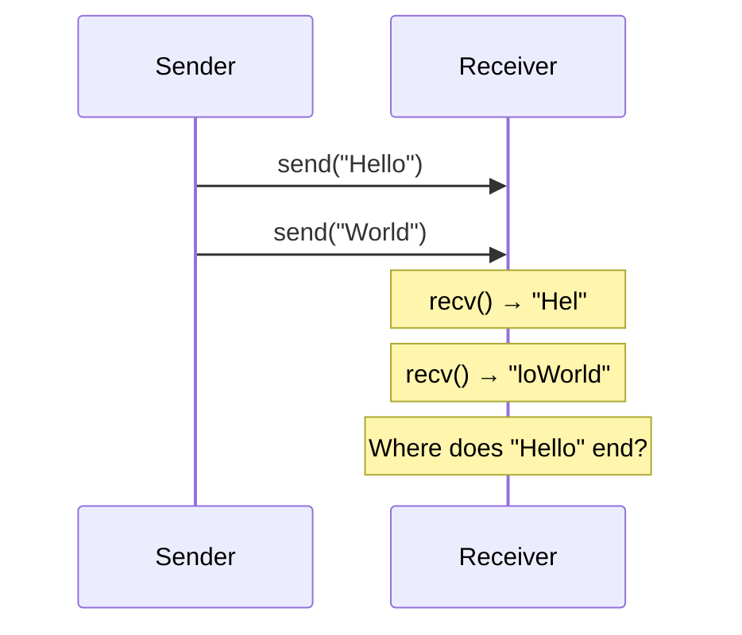
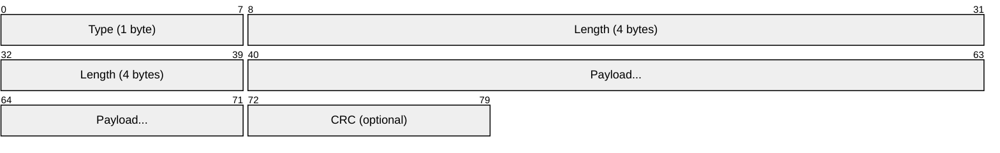
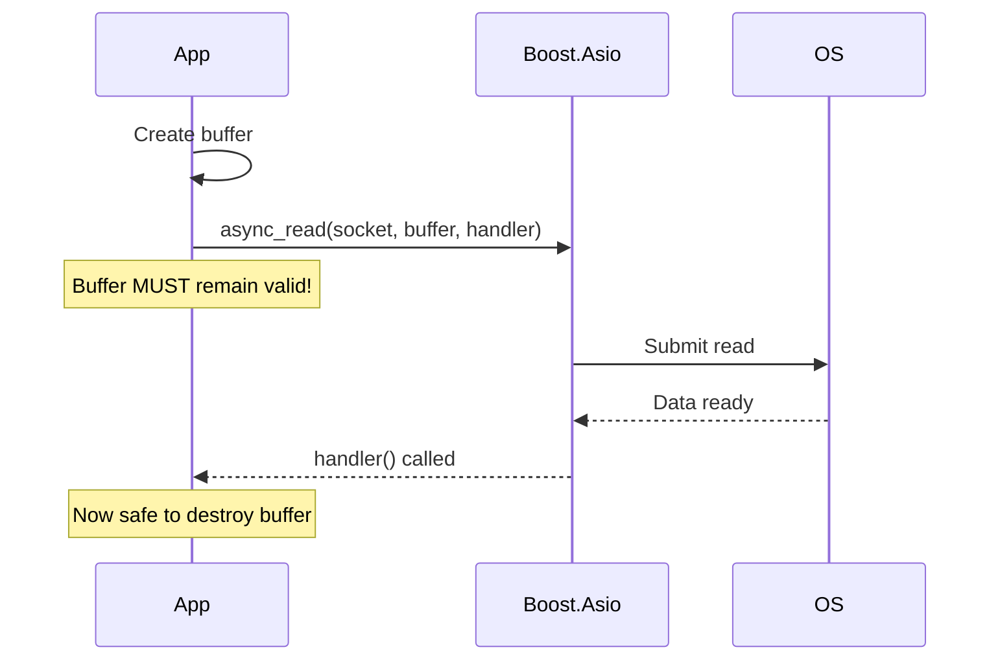
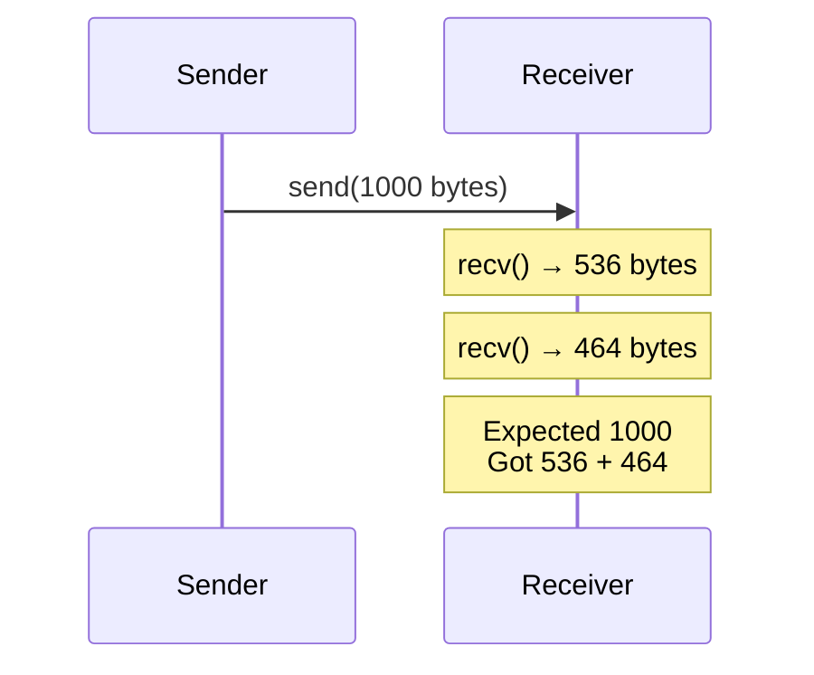
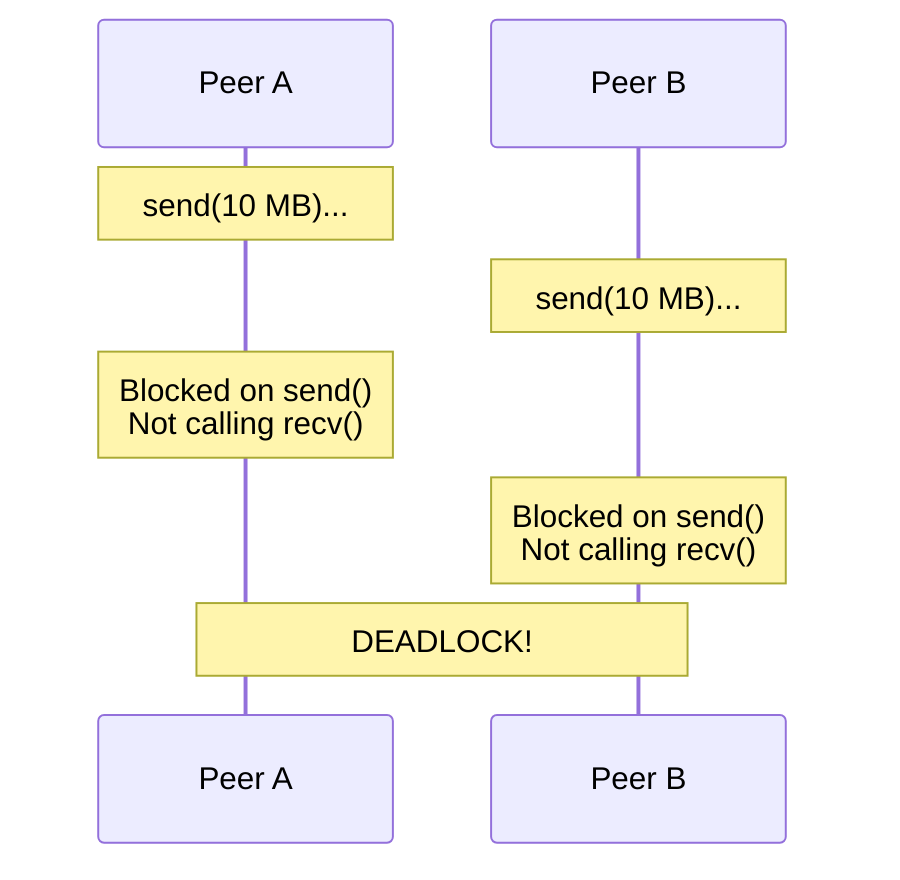
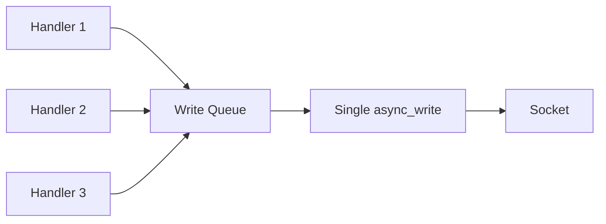
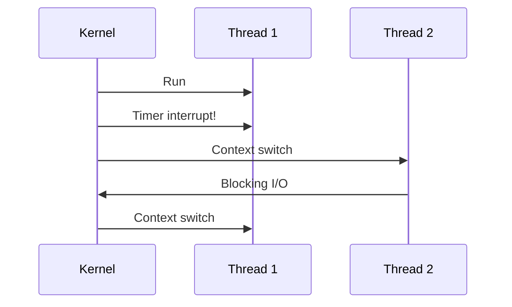
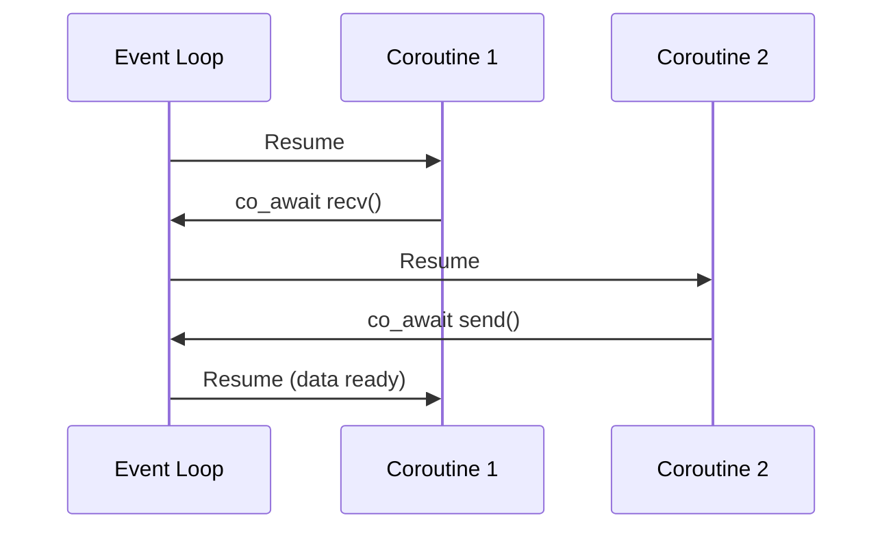
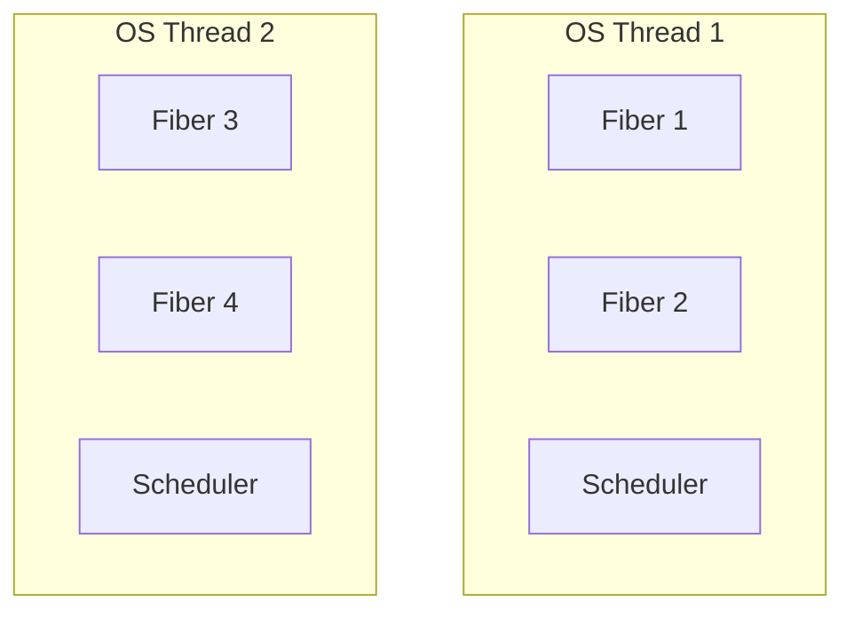
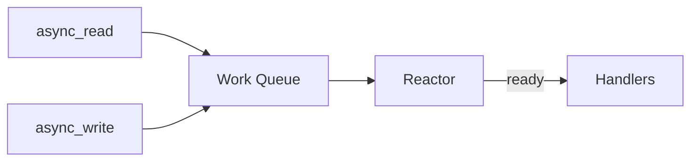

# Week 05: Message Framing, Buffering, and Concurrency

---

## Today's Agenda

1. The TCP Framing Problem
2. Framing Strategies
3. Buffer Management
4. Partial Reads & Writes
5. Deadlock Prevention
6. Concurrency Models

---

## Recap: TCP is a Byte Stream

TCP guarantees bytes arrive **in order**

TCP does **NOT** preserve message boundaries

Your application must implement **framing**

---

## The Framing Problem



---

## What Receiver Might Get

If sender calls `send("Hello")` then `send("World")`:

| Possibility | Chunks received              |
| ----------- | ---------------------------- |
| 1           | `"HelloWorld"` (one chunk)   |
| 2           | `"Hel"` + `"loWorld"`        |
| 3           | `"H"` + `"ello"` + `"World"` |
| 4           | Ten separate characters      |

**This is not a bug—it's how TCP works!**

---

## Why Does This Happen?

- **Nagle's algorithm** batches small writes
- **Network MTU** fragments large writes
- **TCP segmentation** splits by congestion window
- **Receiver buffering** coalesces segments

---

## Four Framing Strategies

1. **Length-Prefix** — prepend message length
2. **Delimiter** — end with special byte(s)
3. **Combined (TLV)** — type + length + value
4. **Fixed-Length** — all messages same size

---

## Strategy 1: Length-Prefix


**Best for:** Binary protocols, games, Protobuf, gRPC

---

## Length-Prefix: Wire Format

```
┌────────────────┬──────────────────────────────────┐
│  Header (4 B)  │         Payload (N bytes)        │
├────────────────┼──────────────────────────────────┤
│  N (uint32 BE) │  Application data (N bytes)      │
└────────────────┴──────────────────────────────────┘
```

O(1) to find message boundary

Binary-safe (any payload content allowed)

---

## Length-Prefix: Sender

```cpp
#include <boost/endian/conversion.hpp>

void send_message(tcp::socket& socket,
                  const std::vector<uint8_t>& payload) {
    uint32_t net_len = boost::endian::native_to_big(
        static_cast<uint32_t>(payload.size()));

    std::array<boost::asio::const_buffer, 2> buffers = {
        boost::asio::buffer(&net_len, sizeof(net_len)),
        boost::asio::buffer(payload)
    };
    boost::asio::write(socket, buffers);
}
```

---

## Length-Prefix: Receiver

```cpp
std::vector<uint8_t> recv_message(tcp::socket& socket) {
    uint32_t net_len;
    boost::asio::read(socket,
        boost::asio::buffer(&net_len, sizeof(net_len)));

    uint32_t len = boost::endian::big_to_native(net_len);
    if (len > MAX_MESSAGE_SIZE) throw std::runtime_error("Too large");

    std::vector<uint8_t> payload(len);
    boost::asio::read(socket, boost::asio::buffer(payload));
    return payload;
}
```

---

## Strategy 2: Delimiter-Based

```
┌──────────────────────────────┬─────┐
│      Payload (variable)      │ \n  │
└──────────────────────────────┴─────┘
```

**Common delimiters:**

- `\n` — IRC, Redis
- `\r\n` — HTTP headers, SMTP
- `\0` — C strings

---

## Delimiter: Pros & Cons

**Pros:**

- Simple for text protocols
- No header overhead

**Cons:**

- Payload cannot contain delimiter (must escape)
- O(N) scanning to find boundary
- Not binary-safe without escaping

---

## Strategy 3: Type-Length-Value



**HTTP/1.1 uses both:**

- Headers: `\r\n` delimiters
- Body: `Content-Length` header

---

## Strategy 4: Fixed-Length

```
┌────────────────────────────────────────┐
│         Message (exactly 64 bytes)     │
└────────────────────────────────────────┘
```

**Best for:**

- Fixed-rate game state (60 ticks/sec)
- Hardware protocols
- Simplest parser

---

## Framing Comparison

| Strategy      | Parsing | Binary-safe | Use case     |
| ------------- | ------- | ----------- | ------------ |
| Length-prefix | O(1)    | Yes         | Games, gRPC  |
| Delimiter     | O(N)    | No\*        | HTTP headers |
| Combined      | O(1)    | Yes         | HTTP body    |
| Fixed-length  | O(1)    | Yes         | Game ticks   |

\*Binary-safe with escaping (e.g., COBS)

---

## Buffer Types in Boost.Asio

| Type             | Use case              |
| ---------------- | --------------------- |
| `const_buffer`   | Sending data          |
| `mutable_buffer` | Receiving data        |
| `streambuf`      | Delimiter-based, HTTP |
| `dynamic_buffer` | Length-prefix framing |

---

## Buffer Pattern: Fixed-Size

```cpp
std::array<char, 1024> buffer;
size_t n = socket.read_some(boost::asio::buffer(buffer));
// Problem: What if message > 1024 bytes?
```

Simple but limited

---

## Buffer Pattern: Streambuf

```cpp
boost::asio::streambuf buffer;
boost::asio::read_until(socket, buffer, '\n');

std::istream is(&buffer);
std::string line;
std::getline(is, line);
// Buffer grows automatically; leftovers preserved
```

**Best for delimiter-based framing**

---

## Buffer Pattern: Pre-allocated Vector

```cpp
uint32_t net_len;
boost::asio::read(socket, boost::asio::buffer(&net_len, 4));
uint32_t len = boost::endian::big_to_native(net_len);

if (len > MAX_MESSAGE_SIZE) throw std::runtime_error("Too large");

std::vector<uint8_t> payload(len);
boost::asio::read(socket, boost::asio::buffer(payload));
```

**Best for length-prefix framing**

---

## Security: Validate Length Headers!

```cpp
if (len > MAX_MESSAGE_SIZE) {
    // Reject or disconnect
    // Attacker could send len = 4GB!
}
```

**Never** allocate based on untrusted input without checking

---

## Buffer Lifetime Rule



---

## The Partial Read Problem



TCP segments limited by MSS (~1460 bytes)

---

## The Partial Write Problem

```cpp
// WRONG: May only send partial data!
socket.write_some(boost::asio::buffer(data, length));

// CORRECT: Loops internally until ALL bytes sent
boost::asio::write(socket, boost::asio::buffer(data, length));
```

Boost.Asio handles retry loops for you

---

## Composed Operations

```cpp
// Reads EXACTLY the requested bytes (or throws)
boost::asio::read(socket, boost::asio::buffer(data, length));

// Writes ALL bytes (or throws)
boost::asio::write(socket, boost::asio::buffer(data, length));

// Reads until delimiter found
boost::asio::read_until(socket, streambuf, '\n');
```

These loop internally—use them!

---

## The TCP Deadlock Scenario



---

## Deadlock Mechanics

1. Peer A's `send()` blocks (send buffer full)
2. Buffer full because B isn't reading
3. B isn't reading because B is blocked on `send()`
4. B's `send()` blocked because A isn't reading
5. **Circular dependency = deadlock**

---

## Solution 1: Async I/O (Recommended)

```cpp
boost::asio::async_read(socket, read_buffer,
    [](boost::system::error_code ec, size_t len) {
        // Called when data ready
    });

boost::asio::async_write(socket, write_buffer,
    [](boost::system::error_code ec, size_t len) {
        // Called when write completes
    });

io_context.run();  // Event loop handles both
```

---

## Boost.Asio Under the Hood

No manual `select()` or `poll()` needed!

| Platform  | Mechanism |
| --------- | --------- |
| Linux     | `epoll`   |
| macOS/BSD | `kqueue`  |
| Windows   | `IOCP`    |

Boost.Asio picks the best automatically

---

## Solution 2: Separate Threads

```cpp
std::jthread read_thread([&socket]() {
    while (running) {
        auto msg = recv_message(socket);
        process(msg);
    }
});

std::jthread write_thread([&socket, &queue]() {
    while (running) {
        auto msg = queue.pop();
        send_message(socket, msg);
    }
});
```

---

## Solution 3: Write Queue



Prevents message interleaving

---

## Parallelism vs Concurrency

| Concept     | Definition                               |
| ----------- | ---------------------------------------- |
| Parallelism | Tasks run **simultaneously** (multi-CPU) |
| Concurrency | Tasks **interleave** (may be 1 CPU)      |

Network I/O is **I/O-bound**, not CPU-bound

Concurrency often matters more than parallelism

---

## Three Concurrency Models

1. **OS Threads** — kernel-scheduled, preemptive
2. **Coroutines** — library-scheduled, cooperative
3. **Fibers** — userspace threads, cooperative

---

## OS Threads



Kernel can interrupt at any time (preemptive)

---

## Thread Context Switch

**What happens during a context switch:**

1. Save CPU registers to memory
2. Save stack pointer + instruction pointer
3. Load next thread's registers
4. Resume execution

**Cost:** ~1-10 μs per switch

---

## Thread-Per-Connection

```cpp
void handle_client(tcp::socket socket) {
    while (true) {
        auto msg = recv_message(socket);  // Blocks THIS thread only
        auto response = process(msg);
        send_message(socket, response);
    }
}

int main() {
    while (true) {
        tcp::socket socket = acceptor.accept();
        std::thread(handle_client, std::move(socket)).detach();
    }
}
```

Simple but doesn't scale beyond thousands

---

## OS Threads: Pros & Cons

**Pros:**

- Simple mental model
- True parallelism on multi-core
- Can use blocking I/O

**Cons:**

- Context switch: ~1-10 μs
- Memory: 1-8 MB per thread
- Scales poorly (thousands = problems)
- Requires mutexes/atomics

---

## Coroutines



Programmer explicitly yields (cooperative)

---

## How co_await Works

1. Check if result is ready
2. If not: save state to heap (coroutine frame)
3. Return control to event loop
4. Later: resume when I/O completes
5. Continue from suspension point

**Key:** Only suspends at explicit `co_await` points

---

## Callbacks vs Coroutines

```cpp
// Callback hell:
async_read(socket, buf, [](auto ec, auto n) {
    async_write(socket, buf, [](auto ec, auto n) {
        async_read(socket, buf, [](auto ec, auto n) {
            // Deeply nested...
        });
    });
});

// Coroutine:
co_await async_read(socket, buf, use_awaitable);
co_await async_write(socket, buf, use_awaitable);
co_await async_read(socket, buf, use_awaitable);
// Flat, readable!
```

---

## Coroutines: Pros & Cons

**Pros:**

- ~100 bytes per coroutine
- No context switch cost
- No synchronization needed
- Scales to millions

**Cons:**

- Cannot use blocking calls
- CPU-bound work blocks all
- Requires C++20 or library

---

## Fibers (Userspace Threads)



Like threads, but scheduled in userspace

---

## Concurrency Comparison

| Aspect         | Threads     | Coroutines     | Fibers      |
| -------------- | ----------- | -------------- | ----------- |
| Scheduling     | Kernel      | Library        | Library     |
| Memory         | 1-8 MB      | ~100 bytes     | 4-64 KB     |
| Context switch | ~1-10 μs    | ~10-100 ns     | ~100 ns     |
| Scalability    | Thousands   | Millions       | 100K+       |
| Blocking I/O   | OK          | Blocks all     | Fiber only  |
| C++ support    | std::thread | C++20 co_await | Boost.Fiber |

---

## std::jthread (C++20)

```cpp
#include <thread>
#include <stop_token>

void handler(tcp::socket socket, std::stop_token stop) {
    while (!stop.stop_requested()) {
        auto msg = recv_message(socket);
        process(msg);
    }
}

// Automatically joins on destruction
std::jthread thread(handler, std::move(socket));
```

---

## jthread vs thread

| Feature      | std::thread    | std::jthread        |
| ------------ | -------------- | ------------------- |
| Destructor   | std::terminate | Joins automatically |
| Cancellation | Manual flag    | Built-in stop_token |
| Request stop | Manual         | request_stop()      |

**Use std::jthread** unless you need C++11/14/17 compatibility

---

## Cooperative Cancellation

```cpp
void handler(tcp::socket socket, std::stop_token stop) {
    // Register cleanup callback
    std::stop_callback cb(stop, [&socket]() {
        socket.cancel();  // Cancel pending I/O
    });

    while (!stop.stop_requested()) {
        auto msg = recv_message(socket);
        process(msg);
    }
}

// Request graceful shutdown:
thread.request_stop();
// Destructor waits for thread to finish
```

---

## io_context: The Event Loop



- `io_context.run()` blocks until all work done
- One thread can handle thousands of connections
- Handlers execute one at a time (per thread)

---

## Boost.Asio Callbacks

```cpp
class Session : public std::enable_shared_from_this<Session> {
    void do_read() {
        auto self = shared_from_this();
        socket_.async_read_some(boost::asio::buffer(buffer_),
            [this, self](auto ec, size_t len) {
                if (!ec) {
                    process(buffer_.data(), len);
                    do_read();  // Continue
                }
            });
    }
};
```

---

## Why shared_from_this?

```cpp
auto self = shared_from_this();
```

**Problem:** Handler runs later, Session may be destroyed

**Solution:** Capture `self` (shared_ptr) in lambda

- Keeps Session alive until handler runs
- When error occurs, self released, Session destroyed

---

## Multi-threaded io_context

```cpp
boost::asio::io_context io;
Server server(io, 12345);

std::vector<std::jthread> threads;
for (size_t i = 0; i < num_cores; ++i) {
    threads.emplace_back([&io]() {
        io.run();  // Multiple threads process handlers
    });
}
```

Use **strand** to serialize handlers when needed

---

## C++20 Coroutines

```cpp
awaitable<void> handle_client(tcp::socket socket) {
    try {
        while (true) {
            uint32_t net_len;
            co_await async_read(socket,
                buffer(&net_len, 4), use_awaitable);

            uint32_t len = big_to_native(net_len);
            std::vector<uint8_t> payload(len);
            co_await async_read(socket,
                buffer(payload), use_awaitable);

            process(payload);
        }
    } catch (std::exception&) {
        // Connection closed
    }
}
```

---

## Spawning Coroutines

```cpp
awaitable<void> accept_loop(tcp::acceptor& acceptor) {
    while (true) {
        auto socket = co_await acceptor.async_accept(use_awaitable);

        // Spawn new coroutine for this client
        co_spawn(acceptor.get_executor(),
            handle_client(std::move(socket)),
            detached);  // Fire and forget
    }
}

int main() {
    io_context io;
    tcp::acceptor acceptor(io, {tcp::v4(), 12345});
    co_spawn(io, accept_loop(acceptor), detached);
    io.run();
}
```

---

## Coroutine Error Handling

```cpp
awaitable<void> client_handler(tcp::socket socket) {
    try {
        // ... main loop ...
    } catch (boost::system::system_error& e) {
        if (e.code() == error::eof) {
            // Clean disconnect
        } else if (e.code() == error::operation_aborted) {
            // Cancelled
        } else {
            // Real error
        }
    }
}
```

Exceptions replace error codes in coroutines

````

---

## Choosing a Model

| Scenario                  | Recommendation              |
| ------------------------- | --------------------------- |
| Learning / prototypes     | std::jthread per connection |
| Production < 1000 clients | Boost.Asio coroutines       |
| High-scale > 10k clients  | Boost.Asio callbacks        |
| Game server (low latency) | Coroutines or callbacks     |
| Legacy (no C++20)         | Callbacks or Boost.Fiber    |

---

## Edge Case: EOF Mid-Message

```cpp
try {
    auto msg = recv_message(socket);
} catch (boost::system::system_error& e) {
    if (e.code() == boost::asio::error::eof) {
        // Client disconnected cleanly
    } else {
        // Error during transfer
    }
}
````

---

## Edge Case: Byte Order

**Boost.Asio does NOT handle byte order!**

```cpp
// WRONG: Platform-dependent!
uint32_t len = 256;
boost::asio::write(socket, boost::asio::buffer(&len, 4));

// CORRECT: Convert to network byte order (big-endian)
uint32_t net_len = boost::endian::native_to_big(len);
boost::asio::write(socket, boost::asio::buffer(&net_len, 4));

// On receive:
uint32_t received = boost::endian::big_to_native(net_len);
```

---

## Boost.Endian Functions

| Boost.Endian Function  | Use Case        |
| ---------------------- | --------------- |
| `native_to_big(value)` | Before sending  |
| `big_to_native(value)` | After receiving |

Works with `uint16_t`, `uint32_t`, `uint64_t` automatically.

**LSB** = Least Significant Byte (rightmost digit)

**MSB** = Most Significant Byte (leftmost digit)

---

## Common Pitfalls

| Mistake                          | Consequence                 |
| -------------------------------- | --------------------------- |
| `read_some()` not `read()`       | Partial messages            |
| Forgetting byte order conversion | Works locally, fails remote |
| No length validation             | OOM, security hole          |
| Assuming one send = one recv     | Message corruption          |
| No EOF handling                  | Hang or crash               |

---

## Key Takeaways

1. **TCP is byte stream** — implement framing
2. **Length-prefix** for binary, **delimiter** for text
3. **Validate** length headers before allocating
4. Use composed operations (`boost::asio::read`, `boost::asio::write`)
5. Convert byte order for multi-byte integers
6. Choose concurrency model by scale

---

## For Next Time

**Readings:** Beej's Guide (framing concepts), Boost.Asio docs

**Assignment:** Length-prefixed echo server + client

**Remember:**

- `native_to_big()` / `big_to_native()` for byte order
- `boost::asio::read()` not `socket.read_some()`
- `boost::asio::write()` not `socket.write_some()`
- Validate all length headers!

---

## Questions?
