# Lecture 05: Message Framing, Buffering, and Concurrency

## Overview

- How to reconstruct message boundaries from TCP's raw byte stream
- The **concurrency models** used to handle network I/O efficiently.

We'll explore framing strategies, buffer management, partial read/write handling, deadlock prevention, and the spectrum from threads to coroutines to fibers.

---

## 1. The TCP Framing Problem

TCP is a **byte stream** protocol. It guarantees bytes arrive in order, but it does NOT preserve message boundaries.

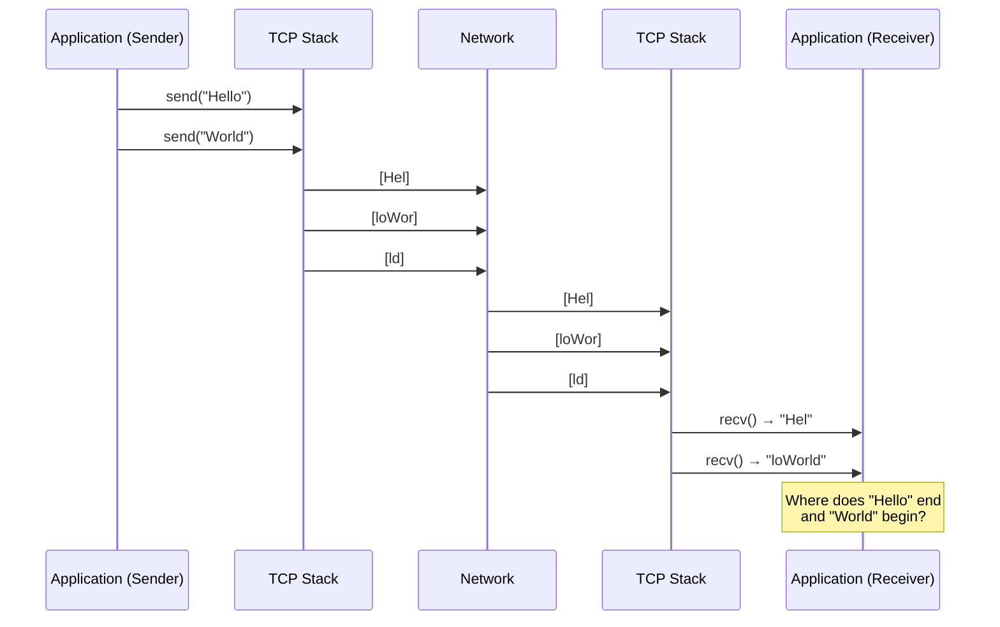

::: warning "The fundamental problem"

If sender calls `send("Hello")` then `send("World")`, the receiver might get:

- `"HelloWorld"` (one chunk)
- `"Hel"` + `"loWorld"` (two chunks)
- `"H"` + `"e"` + `"l"` + `"l"` + `"o"` + `"W"` + `"o"` + `"r"` + `"l"` + `"d"` (ten chunks)

This is not a bug—it's how TCP works. **Your application must implement framing.**

:::

### Why Does This Happen?

1. **Nagle's algorithm** batches small writes into larger segments
2. **Network MTU** fragments large writes into multiple packets
3. **TCP segmentation** splits data based on congestion window
4. **Receiver buffering** coalesces arriving segments before `recv()`

---

## 2. Framing Strategies

There are four main approaches to delimiting messages in a byte stream:

### 2.1 Length-Prefix Framing

Prepend each message with its length in bytes.


**Wire format:**

```
┌────────────────┬──────────────────────────────────────────┐
│  Header (4 B)  │              Payload (N bytes)           │
├────────────────┼──────────────────────────────────────────┤
│  N (uint32 BE) │  Application data (exactly N bytes)      │
└────────────────┴──────────────────────────────────────────┘
```

**Sender algorithm:**

1. Serialize message to buffer
2. Compute length N = buffer.size()
3. Convert N to network byte order: `boost::endian::native_to_big(N)`
4. Send `[4-byte length][N-byte payload]`

**Receiver algorithm:**

1. Read exactly 4 bytes → N (in network byte order)
2. Convert to host byte order: `boost::endian::big_to_native(N)`
3. Validate N against maximum allowed size
4. Read exactly N bytes → payload
5. Deserialize payload

::: tip "When to use length-prefix"

- Binary protocols (games, Protobuf, gRPC)
- Messages with arbitrary binary content
- When you know message size before sending
- High-performance scenarios (O(1) to find message boundary)

:::

### 2.2 Delimiter-Based Framing

End each message with a special byte sequence.

```
┌──────────────────────────────┬─────┐
│      Payload (variable)      │ \n  │
└──────────────────────────────┴─────┘
```

**Common delimiters:**

- `\n` (newline) — IRC, Redis
- `\r\n` (CRLF) — HTTP headers, SMTP
- `\0` (null byte) — C strings, some binary protocols

**Sender algorithm:**

1. Ensure payload does NOT contain delimiter (escape or reject)
2. Send `[payload][delimiter]`

**Receiver algorithm:**

1. Read bytes into buffer until delimiter found
2. Everything before delimiter = one message
3. Keep leftover bytes for next message

::: warning "Delimiter pitfalls"

- Payload must not contain the delimiter (or must escape it)
- Cannot send arbitrary binary data without escaping
- Scanning for delimiter is O(N) per message

:::

### 2.3 Combined Framing (Type-Length-Value)

Use both a header AND optional delimiters for flexibility.

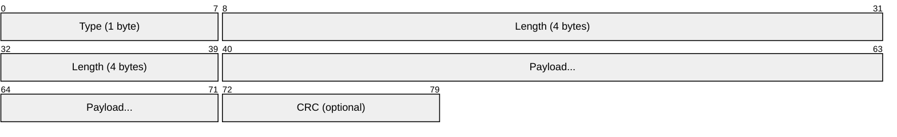

**HTTP/1.1 example:**

- Headers use `\r\n` delimiters
- Body uses `Content-Length` (length-prefix)
- Chunked encoding uses both: `[hex-length]\r\n[chunk]\r\n`

### 2.4 Fixed-Length Framing

All messages are exactly N bytes (pad shorter messages).

```
┌────────────────────────────────────────┐
│         Message (exactly 64 bytes)     │
└────────────────────────────────────────┘
```

::: tip "When to use fixed-length"

- Fixed-rate game state updates (e.g., 60 ticks/second)
- Hardware protocols with fixed packet sizes
- Simplest parser—no length field, no scanning

:::

### Framing Strategy Comparison

| Strategy      | Header                     | Delimiter | Parsing | Binary-safe | Use case                     |
| ------------- | -------------------------- | --------- | ------- | ----------- | ---------------------------- |
| Length-prefix | `[4-byte len][payload]`    | None      | O(1)    | Yes         | gRPC, Protobuf, game packets |
| Delimiter     | None                       | `\r\n`    | O(N)    | No\*        | HTTP headers, IRC, Redis     |
| Combined      | `[type][len][payload]\r\n` | Optional  | O(1)    | Yes         | HTTP body, custom protocols  |
| Fixed-length  | None                       | None      | O(1)    | Yes         | Fixed-rate game ticks        |

\*Delimiter-based can be binary-safe with escaping (e.g., COBS encoding)

---

## 3. Buffer Management

Buffers are memory regions that hold data in transit. Proper buffer management is critical for correctness and performance.

### 3.1 Buffer Types in Boost.Asio

| Type             | Description                                | Use case                      |
| ---------------- | ------------------------------------------ | ----------------------------- |
| `const_buffer`   | Read-only view of contiguous memory        | Sending data                  |
| `mutable_buffer` | Writable view of contiguous memory         | Receiving data                |
| `streambuf`      | Dynamic buffer that grows automatically    | Delimiter-based framing, HTTP |
| `dynamic_buffer` | Adapter for `std::vector` or `std::string` | Length-prefix framing         |

### 3.2 Receive Buffer Patterns

**Pattern 1: Fixed-size buffer (simple but limited)**

```cpp
std::array<char, 1024> buffer;
size_t n = socket.read_some(boost::asio::buffer(buffer));
// Problem: What if message is larger than 1024 bytes?
```

**Pattern 2: Streambuf (dynamic, recommended for delimiters)**

```cpp
boost::asio::streambuf buffer;
boost::asio::read_until(socket, buffer, '\n');
std::istream is(&buffer);
std::string line;
std::getline(is, line);
// Buffer automatically grows; leftover data preserved
```

**Pattern 3: Pre-allocated vector (recommended for length-prefix)**

```cpp
#include <boost/endian/conversion.hpp>

// Read header first
uint32_t net_len;
boost::asio::read(socket, boost::asio::buffer(&net_len, 4));
uint32_t len = boost::endian::big_to_native(net_len);

// Validate before allocating!
if (len > MAX_MESSAGE_SIZE) throw std::runtime_error("Message too large");

// Allocate exact size needed
std::vector<uint8_t> payload(len);
boost::asio::read(socket, boost::asio::buffer(payload));
```

::: warning "Security: Always validate length headers"

Never allocate a buffer based on untrusted input without checking:

```cpp
if (len > MAX_MESSAGE_SIZE) {
    // Reject or disconnect—attacker could send len=4GB
}
```

:::

### 3.3 Buffer Lifetime Rules

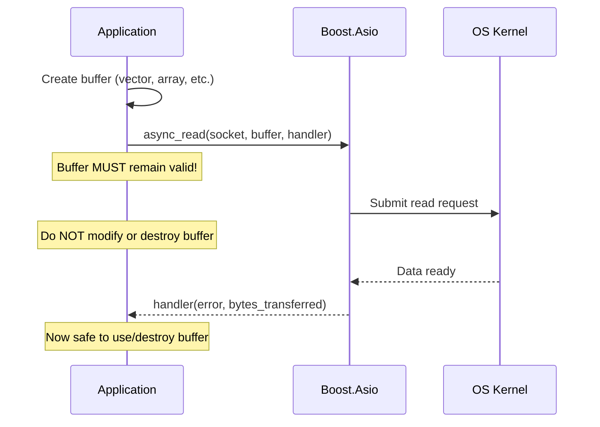

::: danger "Critical rule"

The buffer passed to `async_read` or `async_write` must remain valid and unmodified until the completion handler is called. Use `std::shared_ptr` or member variables to ensure lifetime.

:::

---

## 4. Handling Partial Reads and Writes

### 4.1 The Partial Read Problem

A single `socket.read_some()` call may return fewer bytes than requested:

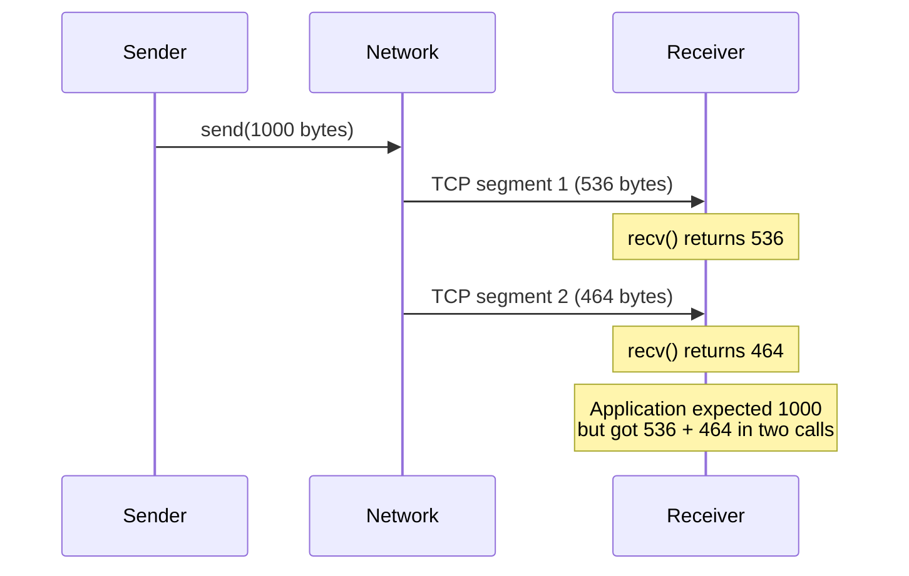

**Why this happens:**

- TCP segments are limited by MSS (Maximum Segment Size, ~1460 bytes)
- Network fragmentation and reassembly
- OS receive buffer availability
- Timing of when application calls `recv()`

### 4.2 The Partial Write Problem

A single write operation may also send fewer bytes than requested:

```cpp
// WRONG: Assumes write_some() transmits all bytes
socket.write_some(boost::asio::buffer(data, length));
// May only send partial data!

// CORRECT: Use boost::asio::write() which loops internally
boost::asio::write(socket, boost::asio::buffer(data, length));
// Guaranteed to send ALL bytes or throw an exception
```

::: tip "Composed operations handle partial I/O"

`boost::asio::write()` and `boost::asio::async_write()` automatically retry until all bytes are sent. No manual looping needed.

:::

### 4.3 Boost.Asio Composed Operations

Boost.Asio provides `read()` and `write()` functions that automatically loop:

```cpp
// boost::asio::read - reads EXACTLY the requested bytes (or fails)
boost::asio::read(socket, boost::asio::buffer(data, length));

// boost::asio::write - writes ALL bytes (or fails)
boost::asio::write(socket, boost::asio::buffer(data, length));

// boost::asio::read_until - reads until delimiter found
boost::asio::read_until(socket, streambuf, '\n');
```

These are **composed operations**—they call the underlying `read_some()`/`write_some()` in a loop.

### 4.4 Implementing Length-Prefix with Boost.Asio

**Synchronous version:**

```cpp
#include <boost/endian/conversion.hpp>

void send_message(tcp::socket& socket, const std::vector<uint8_t>& payload) {
    // Prepare length header in network byte order (big-endian)
    uint32_t net_len = boost::endian::native_to_big(static_cast<uint32_t>(payload.size()));

    // Scatter-gather write: header + payload in one call
    std::array<boost::asio::const_buffer, 2> buffers = {
        boost::asio::buffer(&net_len, sizeof(net_len)),
        boost::asio::buffer(payload)
    };
    boost::asio::write(socket, buffers);
}

std::vector<uint8_t> recv_message(tcp::socket& socket) {
    // Read 4-byte header
    uint32_t net_len;
    boost::asio::read(socket, boost::asio::buffer(&net_len, sizeof(net_len)));
    uint32_t len = boost::endian::big_to_native(net_len);

    // Validate length
    if (len > MAX_MESSAGE_SIZE) {
        throw std::runtime_error("Message exceeds maximum size");
    }

    // Read payload
    std::vector<uint8_t> payload(len);
    boost::asio::read(socket, boost::asio::buffer(payload));
    return payload;
}
```

**Asynchronous version (simplified):**

```cpp
void async_send_message(tcp::socket& socket,
                        std::shared_ptr<std::vector<uint8_t>> payload,
                        std::function<void(boost::system::error_code)> handler) {
    // Header must outlive the async operation
    auto header = std::make_shared<uint32_t>(
        boost::endian::native_to_big(static_cast<uint32_t>(payload->size())));

    std::array<boost::asio::const_buffer, 2> buffers = {
        boost::asio::buffer(header.get(), sizeof(*header)),
        boost::asio::buffer(*payload)
    };

    boost::asio::async_write(socket, buffers,
        [header, payload, handler](boost::system::error_code ec, size_t) {
            handler(ec);
        });
}
```

---

## 5. Deadlock Prevention

### 5.1 The TCP Deadlock Scenario

When both peers try to send large amounts of data without reading, they can deadlock:

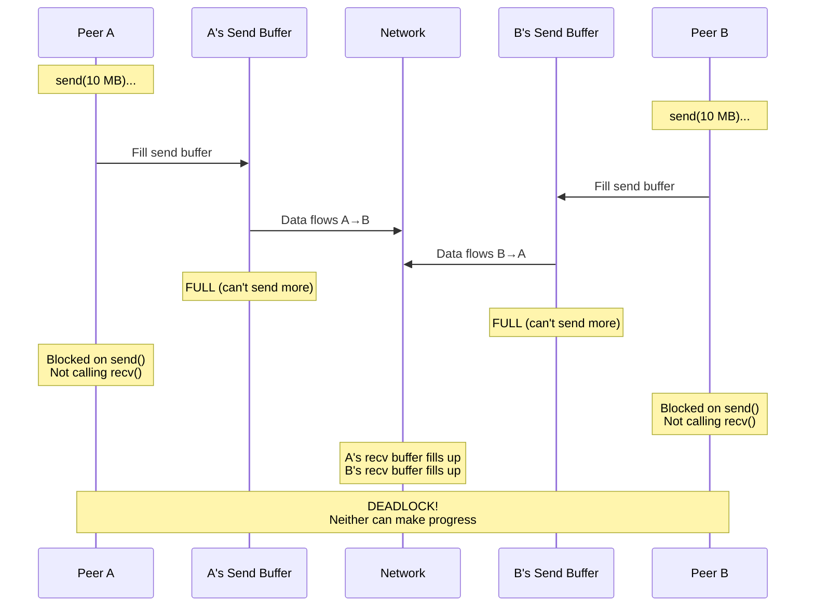

**The mechanics:**

1. Peer A's `send()` blocks because its send buffer is full
2. Send buffer is full because Peer B isn't reading (B's recv buffer is full)
3. B isn't reading because B is blocked on its own `send()`
4. B's `send()` is blocked because A isn't reading
5. **Circular dependency = deadlock**

### 5.2 Solutions to Deadlock

**Solution 1: Async I/O with Boost.Asio (Recommended)**

Boost.Asio's `io_context` handles read/write readiness internally—no manual `select()` needed:

```cpp
// Both operations are submitted to the event loop
// io_context handles them concurrently without blocking
boost::asio::async_read(socket, read_buffer,
    [](boost::system::error_code ec, size_t len) {
        // Called when data is ready to read
    });

boost::asio::async_write(socket, write_buffer,
    [](boost::system::error_code ec, size_t len) {
        // Called when write completes
    });

io_context.run();  // Event loop processes both operations
```

::: note "Under the hood"

Boost.Asio uses the most efficient mechanism available on each platform: `epoll` on Linux, `kqueue` on macOS/BSD, `IOCP` on Windows. You don't need to call `select()` or `poll()` directly.

:::

**Solution 2: Separate threads for read and write**

```cpp
std::jthread read_thread([&socket]() {
    while (running) {
        auto msg = recv_message(socket);  // Blocks waiting for data
        process(msg);
    }
});

std::jthread write_thread([&socket, &queue]() {
    while (running) {
        auto msg = queue.pop();           // Blocks waiting for outgoing message
        send_message(socket, msg);
    }
});
```

**Solution 3: Async I/O with Boost.Asio (recommended)**

```cpp
// Both operations run concurrently on io_context
boost::asio::async_read(socket, read_buffer, on_read_complete);
boost::asio::async_write(socket, write_buffer, on_write_complete);

io_context.run();  // Event loop processes both
```

**Solution 4: Bounded write queues with backpressure**

```cpp
void queue_message(const Message& msg) {
    if (write_queue.size() >= MAX_QUEUE_SIZE) {
        // Apply backpressure: drop, compress, or block sender
        return;  // or throw
    }
    write_queue.push(msg);
}
```

### 5.3 Write Queue Pattern

For async servers, maintain a per-connection write queue to prevent interleaving:

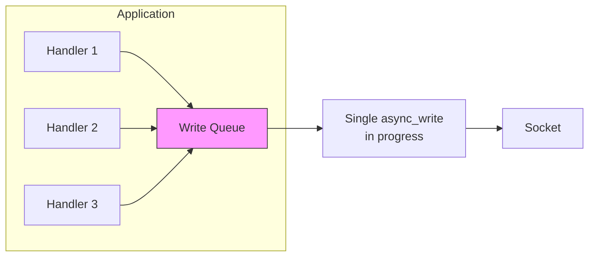

```cpp
class Connection {
    std::deque<std::vector<uint8_t>> write_queue_;
    bool write_in_progress_ = false;

    void queue_write(std::vector<uint8_t> data) {
        write_queue_.push_back(std::move(data));
        if (!write_in_progress_) {
            do_write();
        }
    }

    void do_write() {
        write_in_progress_ = true;
        boost::asio::async_write(socket_,
            boost::asio::buffer(write_queue_.front()),
            [this](auto ec, auto) {
                write_queue_.pop_front();
                if (!write_queue_.empty()) {
                    do_write();  // Continue with next message
                } else {
                    write_in_progress_ = false;
                }
            });
    }
};
```

---

## 6. Concurrency Models: Threads vs Coroutines vs Fibers

Handling multiple connections requires concurrency. There are three main approaches:

### 6.1 Parallelism vs Concurrency

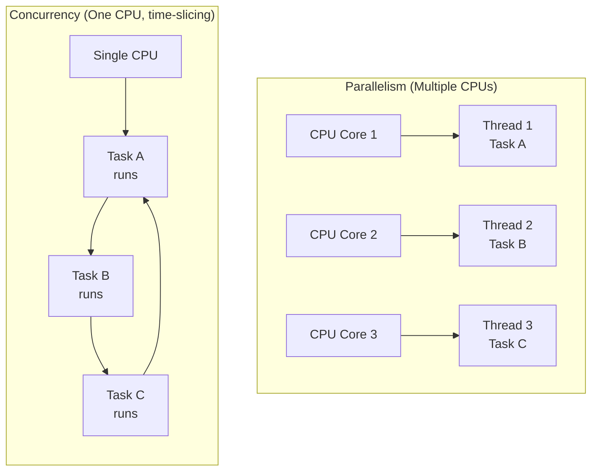

| Concept     | Definition                                                  | Example                     |
| ----------- | ----------------------------------------------------------- | --------------------------- |
| Parallelism | Multiple tasks execute **simultaneously** on multiple cores | 4 threads on 4 CPU cores    |
| Concurrency | Multiple tasks make progress by **interleaving** execution  | 100 connections on 1 thread |

::: tip "Key insight"

Parallelism requires multiple CPUs. Concurrency is a programming model that works even on a single CPU. Network I/O is mostly **I/O-bound**, not CPU-bound, so concurrency (not parallelism) is often the bottleneck.

:::

### 6.2 OS Threads (Preemptive Multitasking)

**How they work:**

- OS kernel schedules threads on CPU cores
- Preemptive: kernel can interrupt a thread at any time
- Each thread has its own stack (typically 1-8 MB)

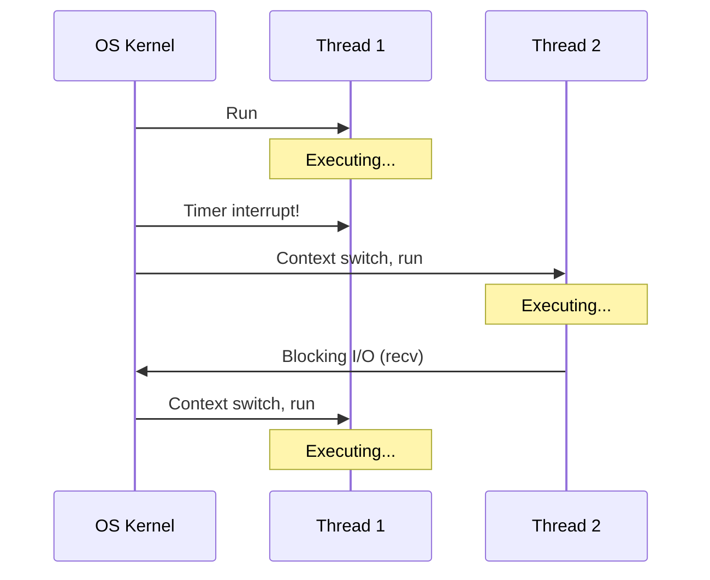

**Pros:**

- Simple mental model (sequential code)
- True parallelism on multi-core
- Can use blocking I/O

**Cons:**

- Context switch cost (~1-10 μs)
- High memory overhead per thread
- Scales poorly (thousands of threads = problems)
- Requires synchronization (mutexes, atomics)

### 6.3 Coroutines (Cooperative Multitasking)

**How they work:**

- Function that can **suspend** and **resume** execution
- Programmer explicitly yields control (cooperative)
- All coroutines share the same thread's stack
- State is saved on the heap

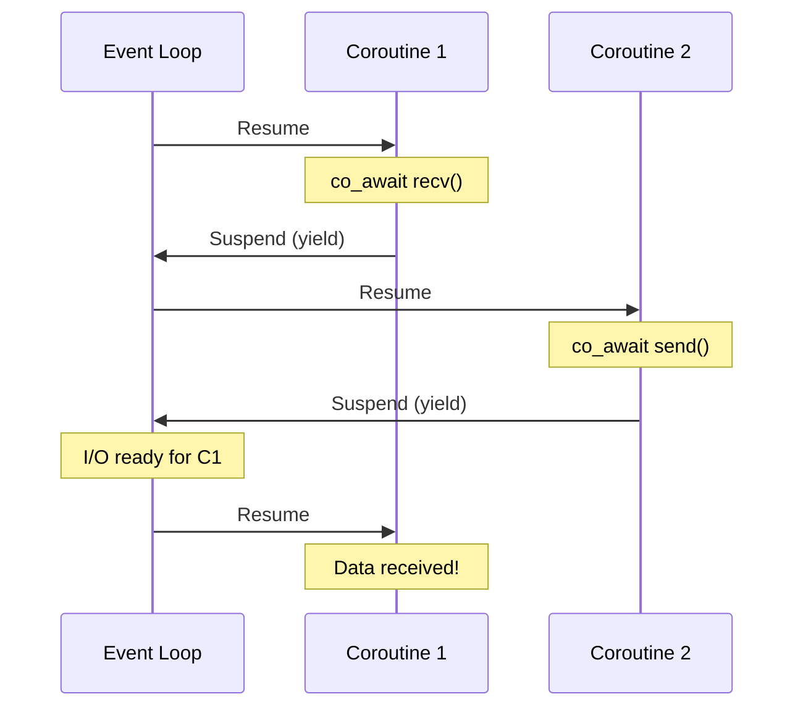

**Pros:**

- Very low overhead (~100 bytes per coroutine vs MB per thread)
- No context switch cost (just function calls)
- No synchronization needed (single-threaded)
- Scales to millions of concurrent operations

**Cons:**

- Cannot use blocking calls (would block ALL coroutines)
- More complex mental model
- CPU-bound work blocks all coroutines
- Requires language/library support

### 6.4 Fibers (Userspace Threads)

**How they work:**

- Like threads, but scheduled by a userspace library (not kernel)
- Each fiber has its own stack (smaller than OS threads)
- Cooperative: fiber must yield explicitly

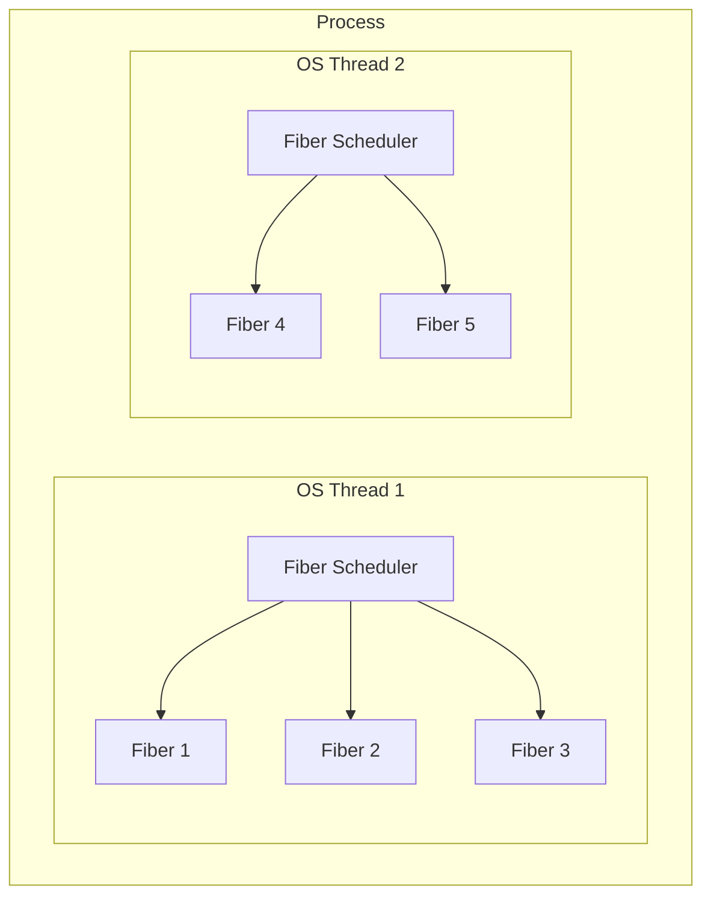

**Pros:**

- Stack-based (familiar programming model)
- Cheaper than OS threads
- Can migrate between OS threads (work stealing)

**Cons:**

- Still has stack overhead (though smaller)
- Blocking calls still problematic
- Less portable than coroutines

### 6.5 Comparison Table

| Aspect           | OS Threads          | Coroutines            | Fibers                |
| ---------------- | ------------------- | --------------------- | --------------------- |
| Scheduling       | Kernel (preemptive) | Library (cooperative) | Library (cooperative) |
| Memory per unit  | 1-8 MB (stack)      | ~100-1000 bytes       | 4-64 KB (stack)       |
| Context switch   | ~1-10 μs            | ~10-100 ns            | ~100 ns-1 μs          |
| Scalability      | Thousands           | Millions              | Hundreds of thousands |
| Blocking I/O     | OK                  | Blocks everything     | Blocks fiber only\*   |
| True parallelism | Yes                 | No (single thread)    | Yes (multi-thread)    |
| Synchronization  | Required            | Not needed            | Sometimes needed      |
| C++ support      | `std::thread`       | C++20 `co_await`      | Boost.Fiber           |

\*With fiber-aware I/O libraries

---

## 7. C++ Concurrency Implementation

### 7.1 OS Threads with std::jthread (C++20)

```cpp
#include <thread>
#include <stop_token>

void client_handler(tcp::socket socket, std::stop_token stop) {
    while (!stop.stop_requested()) {
        auto msg = recv_message(socket);
        process(msg);
    }
}

int main() {
    // std::jthread automatically joins on destruction
    std::vector<std::jthread> threads;

    while (accepting) {
        tcp::socket socket = acceptor.accept();
        threads.emplace_back(client_handler, std::move(socket));
    }
    // Threads automatically joined when vector destroyed
}
```

::: tip "std::jthread vs std::thread"

- `std::jthread` (C++20) joins automatically on destruction
- Built-in cooperative cancellation via `std::stop_token`
- No need for `.detach()` or manual `.join()`

:::

### 7.2 Async I/O with Boost.Asio Callbacks

The callback-based model uses lambdas for completion handlers:

```cpp
class Session : public std::enable_shared_from_this<Session> {
    tcp::socket socket_;
    std::array<char, 1024> buffer_;

public:
    void start() {
        do_read();
    }

private:
    void do_read() {
        auto self = shared_from_this();
        socket_.async_read_some(boost::asio::buffer(buffer_),
            [this, self](boost::system::error_code ec, size_t len) {
                if (!ec) {
                    process(buffer_.data(), len);
                    do_read();  // Continue reading
                }
            });
    }
};

int main() {
    boost::asio::io_context io;
    // ... setup acceptor ...
    io.run();  // Single thread handles all connections
}
```

### 7.3 C++20 Coroutines with Boost.Asio

Coroutines make async code look sequential:

```cpp
#include <boost/asio/co_spawn.hpp>
#include <boost/asio/use_awaitable.hpp>

boost::asio::awaitable<void> handle_client(tcp::socket socket) {
    try {
        while (true) {
            // Read header
            uint32_t net_len;
            co_await boost::asio::async_read(socket,
                boost::asio::buffer(&net_len, 4),
                boost::asio::use_awaitable);

            uint32_t len = boost::endian::big_to_native(net_len);

            // Read payload
            std::vector<uint8_t> payload(len);
            co_await boost::asio::async_read(socket,
                boost::asio::buffer(payload),
                boost::asio::use_awaitable);

            // Process (looks synchronous!)
            process(payload);

            // Echo back
            co_await boost::asio::async_write(socket,
                boost::asio::buffer(payload),
                boost::asio::use_awaitable);
        }
    } catch (std::exception& e) {
        // Connection closed or error
    }
}

boost::asio::awaitable<void> accept_connections(tcp::acceptor& acceptor) {
    while (true) {
        tcp::socket socket = co_await acceptor.async_accept(
            boost::asio::use_awaitable);

        // Spawn new coroutine for this client
        boost::asio::co_spawn(acceptor.get_executor(),
            handle_client(std::move(socket)),
            boost::asio::detached);
    }
}

int main() {
    boost::asio::io_context io;
    tcp::acceptor acceptor(io, {tcp::v4(), 12345});

    boost::asio::co_spawn(io, accept_connections(acceptor), boost::asio::detached);

    io.run();  // Still single-threaded!
}
```

::: note "Coroutine syntax"

- `co_await` suspends until the async operation completes
- `co_return` returns a value from a coroutine
- `boost::asio::awaitable<T>` is the coroutine return type
- `boost::asio::use_awaitable` adapts async ops for coroutines

:::

### 7.4 Boost.Fiber (Userspace Threads)

Fibers let you write blocking-style code that's actually cooperative:

```cpp
#include <boost/fiber/all.hpp>

void fiber_client_handler(tcp::socket& socket) {
    // Looks like blocking code, but fiber yields internally
    while (true) {
        auto msg = recv_message(socket);  // Fiber-aware I/O
        process(msg);
    }
}

int main() {
    boost::fibers::use_scheduling_algorithm<
        boost::fibers::algo::round_robin>();

    std::vector<boost::fibers::fiber> fibers;

    while (accepting) {
        tcp::socket socket = acceptor.accept();
        fibers.emplace_back(fiber_client_handler, std::ref(socket));
    }

    for (auto& f : fibers) {
        f.join();
    }
}
```

### 7.5 Choosing a Concurrency Model

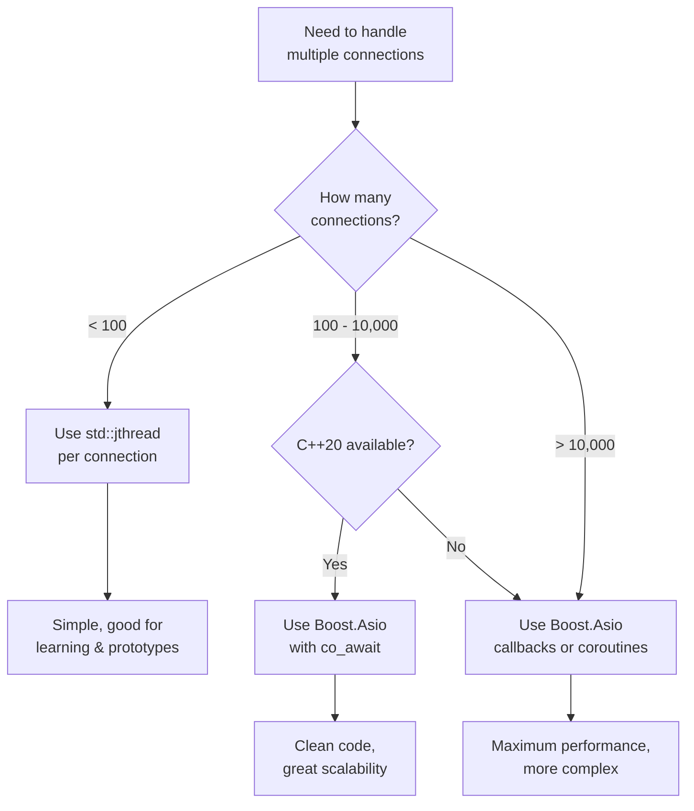

| Scenario                          | Recommended approach                |
| --------------------------------- | ----------------------------------- |
| Learning / class assignments      | `std::jthread` per connection       |
| Production server, < 1000 clients | Boost.Asio coroutines (C++20)       |
| High-scale server, > 10k clients  | Boost.Asio callbacks                |
| Game server (low latency)         | Boost.Asio coroutines or callbacks  |
| Legacy codebase (no C++20)        | Boost.Asio callbacks or Boost.Fiber |

---

## 8. Edge Cases and Transmission Issues

### 8.1 Connection Termination During Read

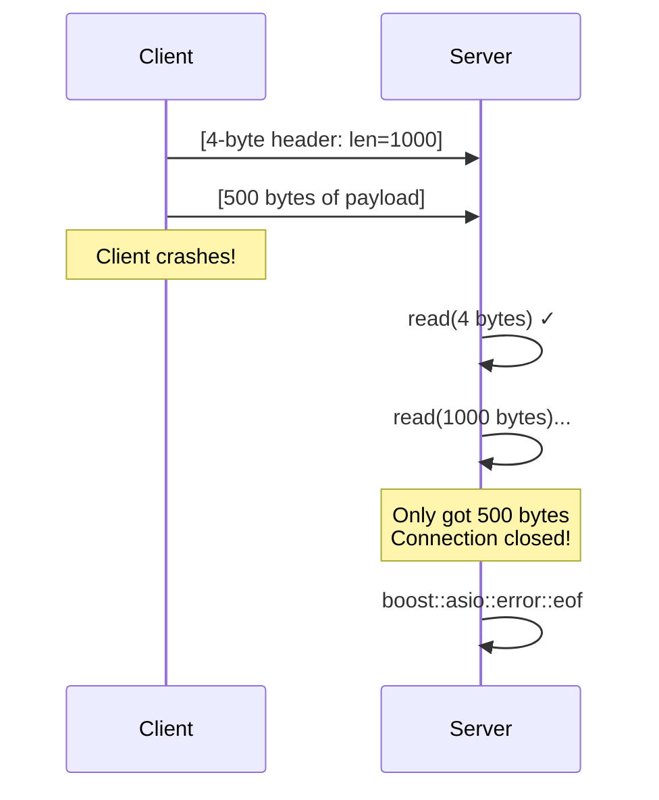

**Handling:**

```cpp
try {
    auto msg = recv_message(socket);
} catch (boost::system::system_error& e) {
    if (e.code() == boost::asio::error::eof) {
        // Clean disconnect
    } else {
        // Error during transfer
    }
}
```

### 8.2 Message Interleaving (Write Corruption)

If multiple handlers write concurrently without coordination:

```
Handler 1 writes: [HDR1][PAYLOAD1]
Handler 2 writes: [HDR2][PAYLOAD2]

Wire might be:   [HDR1][HDR2][PAYLOAD1][PAYLOAD2]  ← CORRUPTED!
```

**Solution:** Use write queue or strand (see Section 5.3)

### 8.3 Slow Consumer Problem

Fast producer, slow consumer:


**Solutions:**

- Bounded queue with backpressure
- Drop old messages (acceptable for game state)
- Compress/batch messages
- Disconnect slow clients

### 8.4 Byte Order (Endianness)

::: danger "Boost.Asio does NOT handle byte order!"

Boost.Asio transports raw bytes—it has no knowledge of your data types. **You must manually convert multi-byte integers** before sending and after receiving.

:::

Different CPU architectures store multi-byte integers differently:

| Architecture     | Byte Order    | Example: `0x12345678`     | Memory Layout                            |
| ---------------- | ------------- | ------------------------- | ---------------------------------------- |
| x86, x64, ARM    | Little-endian | `78 56 34 12` (LSB first) | Least significant byte at lowest address |
| PowerPC, SPARC   | Big-endian    | `12 34 56 78` (MSB first) | Most significant byte at lowest address  |
| Network standard | Big-endian    | `12 34 56 78` (always)    | Defined by RFC 1700                      |

**Terminology:**

- **LSB** = **L**east **S**ignificant **B**yte — the byte containing the smallest place values (the "ones" place)
- **MSB** = **M**ost **S**ignificant **B**yte — the byte containing the largest place values

For `0x12345678`:

- MSB = `0x12` (most significant, leftmost digit in hex notation)
- LSB = `0x78` (least significant, rightmost digit in hex notation)


::: note "Etymology: Big-endian vs Little-endian"

These terms come from Jonathan Swift's _Gulliver's Travels_ (1726), where a war breaks out over which end of a boiled egg to crack open. Computer scientists borrowed the terms in 1980 to describe the "religious wars" over byte ordering.

:::

::: warning "The endianness bug"

If you send a raw `uint32_t` from a little-endian machine, a big-endian machine will interpret it incorrectly:

- Sender (x86) sends `256` as bytes: `00 01 00 00`
- Receiver (big-endian) interprets as: `16777216` (0x00010000)

This is why network protocols standardize on big-endian ("network byte order").

:::

### 8.5 Byte Order Conversion

**Header:** `#include <boost/endian/conversion.hpp>`

| Function                  | Use Case                    |
| ------------------------- | --------------------------- |
| `native_to_big(value)`    | Convert before sending      |
| `big_to_native(value)`    | Convert after receiving     |
| `native_to_little(value)` | For little-endian protocols |
| `little_to_native(value)` | For little-endian protocols |

**Complete send/receive example:**

```cpp
#include <boost/endian/conversion.hpp>
#include <boost/asio.hpp>

void send_message(tcp::socket& socket, const std::vector<uint8_t>& payload) {
    uint32_t host_len = static_cast<uint32_t>(payload.size());

    // Convert to network byte order (big-endian)
    uint32_t net_len = boost::endian::native_to_big(host_len);

    boost::asio::write(socket, boost::asio::buffer(&net_len, 4));
    boost::asio::write(socket, boost::asio::buffer(payload));
}

std::vector<uint8_t> recv_message(tcp::socket& socket) {
    uint32_t net_len;
    boost::asio::read(socket, boost::asio::buffer(&net_len, 4));

    // Convert from network byte order
    uint32_t host_len = boost::endian::big_to_native(net_len);

    if (host_len > MAX_MESSAGE_SIZE) {
        throw std::runtime_error("Message too large");
    }

    std::vector<uint8_t> payload(host_len);
    boost::asio::read(socket, boost::asio::buffer(payload));

    return payload;
}
```

### 8.6 When is Byte Order Conversion Needed?

| Data type                          | Need conversion? | Example                           |
| ---------------------------------- | ---------------- | --------------------------------- |
| Multi-byte integers (uint16/32/64) | ✅ YES           | Length headers, sequence numbers  |
| Port numbers in socket addresses   | ✅ YES           | Already handled by Boost.Asio     |
| Single bytes (uint8_t, char)       | ❌ NO            | No byte order in a single byte    |
| Byte arrays (strings, payloads)    | ❌ NO            | Sent as-is, byte by byte          |
| Floating point                     | ⚠️ Complex       | Use serialization library instead |

::: warning "Common bug: 'It works on my machine'"

Your code may work perfectly when testing on localhost (same machine = same byte order). The bug only appears when communicating between different architectures. Always use byte order conversion even if testing locally—it's a no-op on big-endian systems, so there's no performance cost.

:::

:::

---

## Summary

### Framing

- TCP is a byte stream—it does NOT preserve message boundaries
- **Length-prefix**: `[4-byte len][payload]` — best for binary protocols
- **Delimiter**: `[payload][\n]` — best for text protocols
- **Fixed-length**: Simple but wastes bandwidth
- Always validate length headers before allocating buffers

### Buffering

- Use `boost::asio::streambuf` for delimiter-based framing
- Use pre-sized `std::vector` for length-prefix framing
- Buffer lifetime must exceed async operation lifetime
- Never trust untrusted length headers

### Partial I/O

- `read_some()` and `write_some()` may return fewer bytes than requested
- Use `boost::asio::read()` and `boost::asio::write()` for complete transfers
- Boost.Asio handles retry loops internally—no manual looping needed

### Deadlock Prevention

- Never block on write without also reading
- Use `boost::asio::async_read()` + `boost::asio::async_write()` concurrently
- Implement write queues for async servers (see Section 5.3)

### Concurrency Models

| Model            | Use when                                        |
| ---------------- | ----------------------------------------------- |
| std::jthread     | Learning, prototypes, < 100 connections         |
| Boost.Asio async | Production servers, high scale                  |
| C++20 coroutines | Clean async code with C++20                     |
| Boost.Fiber      | Legacy code, stack-based programming preference |

---

## Assignment Preparation: Framed Messenger

This week you'll implement a **length-prefixed message protocol**:

### Requirements

1. **Server**: Accept connections, receive framed messages, echo them back
2. **Client**: Connect, send framed messages, receive echoes
3. **Framing**: 4-byte big-endian length header + payload
4. **Multi-message**: Handle multiple messages in rapid succession
5. **Partial I/O**: Use `boost::asio::read()` and `boost::asio::write()`

### Implementation Checklist

```
□ Use native_to_big() / big_to_native() for length header byte order
□ Validate length header against MAX_MESSAGE_SIZE before allocating
□ Use boost::asio::read() to ensure complete header read
□ Use boost::asio::read() to ensure complete payload read
□ Use boost::asio::write() to ensure complete message write
□ Handle boost::asio::error::eof for clean disconnect
□ Test with multiple rapid messages
□ Test with messages larger than typical MTU (> 1500 bytes)
```

### Common Pitfalls

| Mistake                                 | Consequence                               |
| --------------------------------------- | ----------------------------------------- |
| Using `read_some()` instead of `read()` | Partial messages, parsing errors          |
| Forgetting byte order conversion        | Works locally, fails across architectures |
| No length validation                    | OOM crash, security vulnerability         |
| Assuming one send = one recv            | Message corruption                        |
| Not handling EOF mid-message            | Hang or crash                             |

---

```

```
