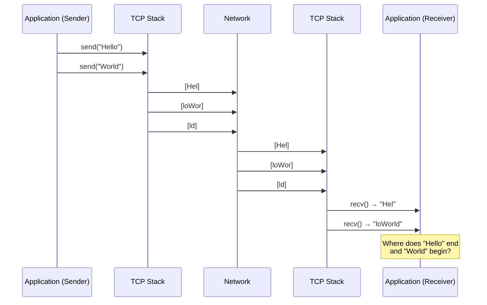

# The TCP Framing Problem

TCP is a **byte stream** protocol. It guarantees bytes arrive in order, but it does NOT preserve message boundaries.

::: warning "The fundamental problem"

If sender calls `send("Hello")` then `send("World")`, the receiver might get:

- `"HelloWorld"` (one chunk)
- `"Hel"` + `"loWorld"` (two chunks)
- `"H"` + `"e"` + `"l"` + `"l"` + `"o"` + `"W"` + `"o"` + `"r"` + `"l"` + `"d"` (ten chunks)

This is not a bug—it's how TCP works. **Your application must implement framing.**

:::

## Why Does This Happen?

1. **Nagle's algorithm** batches small writes into larger segments
2. **Network MTU** fragments large writes into multiple packets
3. **TCP segmentation** splits data based on congestion window
4. **Receiver buffering** coalesces arriving segments before `recv()`
