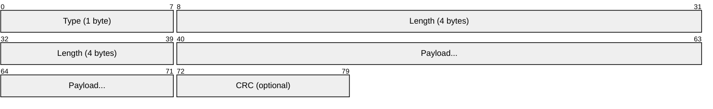

# Framing Strategies

There are four main approaches to delimiting messages in a byte stream:

## Length-Prefix Framing

Prepend each message with its length in bytes.


**Wire format:**

```
┌────────────────┬──────────────────────────────────────────┐
│  Header (4 B)  │              Payload (N bytes)           │
├────────────────┼──────────────────────────────────────────┤
│  N (uint32 BE) │  Application data (exactly N bytes)      │
└────────────────┴──────────────────────────────────────────┘
```

**Sender algorithm:**

1. Serialize message to buffer
2. Compute length N = buffer.size()
3. Convert N to network byte order: `boost::endian::native_to_big(N)`
4. Send `[4-byte length][N-byte payload]`

**Receiver algorithm:**

1. Read exactly 4 bytes → N (in network byte order)
2. Convert to host byte order: `boost::endian::big_to_native(N)`
3. Validate N against maximum allowed size
4. Read exactly N bytes → payload
5. Deserialize payload

::: tip "When to use length-prefix"

- Binary protocols (games, Protobuf, gRPC)
- Messages with arbitrary binary content
- When you know message size before sending
- High-performance scenarios (O(1) to find message boundary)

:::

## Delimiter-Based Framing

End each message with a special byte sequence.

```
┌──────────────────────────────┬─────┐
│      Payload (variable)      │ \n  │
└──────────────────────────────┴─────┘
```

**Common delimiters:**

- `\n` (newline) — IRC, Redis
- `\r\n` (CRLF) — HTTP headers, SMTP
- `\0` (null byte) — C strings, some binary protocols

**Sender algorithm:**

1. Ensure payload does NOT contain delimiter (escape or reject)
2. Send `[payload][delimiter]`

**Receiver algorithm:**

1. Read bytes into buffer until delimiter found
2. Everything before delimiter = one message
3. Keep leftover bytes for next message

::: warning "Delimiter pitfalls"

- Payload must not contain the delimiter (or must escape it)
- Cannot send arbitrary binary data without escaping
- Scanning for delimiter is O(N) per message

:::

## Combined Framing (Type-Length-Value)

Use both a header AND optional delimiters for flexibility.



**HTTP/1.1 example:**

- Headers use `\r\n` delimiters
- Body uses `Content-Length` (length-prefix)
- Chunked encoding uses both: `[hex-length]\r\n[chunk]\r\n`

## Fixed-Length Framing

All messages are exactly N bytes (pad shorter messages).

```
┌────────────────────────────────────────┐
│         Message (exactly 64 bytes)     │
└────────────────────────────────────────┘
```

::: tip "When to use fixed-length"

- Fixed-rate game state updates (e.g., 60 ticks/second)
- Hardware protocols with fixed packet sizes
- Simplest parser—no length field, no scanning

:::

## Framing Strategy Comparison

| Strategy      | Header                     | Delimiter | Parsing | Binary-safe | Use case                     |
| ------------- | -------------------------- | --------- | ------- | ----------- | ---------------------------- |
| Length-prefix | `[4-byte len][payload]`    | None      | O(1)    | Yes         | gRPC, Protobuf, game packets |
| Delimiter     | None                       | `\r\n`    | O(N)    | No\*        | HTTP headers, IRC, Redis     |
| Combined      | `[type][len][payload]\r\n` | Optional  | O(1)    | Yes         | HTTP body, custom protocols  |
| Fixed-length  | None                       | None      | O(1)    | Yes         | Fixed-rate game ticks        |

\*Delimiter-based can be binary-safe with escaping (e.g., COBS encoding)
