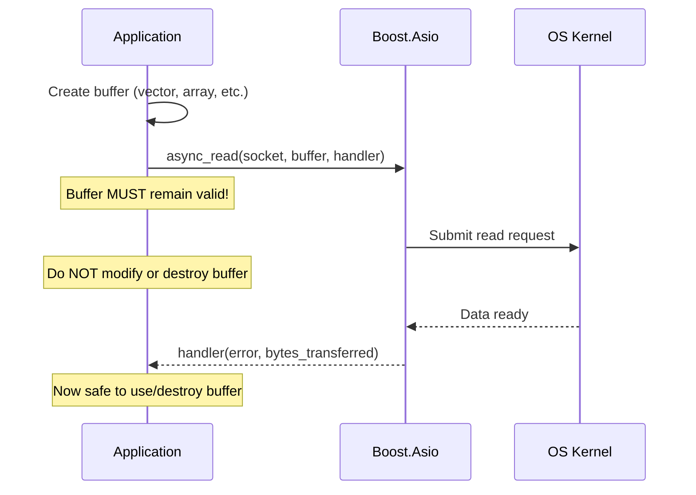

# Buffer Management

Buffers are memory regions that hold data in transit. Proper buffer management is critical for correctness and performance.

## Buffer Types in Boost.Asio

| Type             | Description                                | Use case                      |
| ---------------- | ------------------------------------------ | ----------------------------- |
| `const_buffer`   | Read-only view of contiguous memory        | Sending data                  |
| `mutable_buffer` | Writable view of contiguous memory         | Receiving data                |
| `streambuf`      | Dynamic buffer that grows automatically    | Delimiter-based framing, HTTP |
| `dynamic_buffer` | Adapter for `std::vector` or `std::string` | Length-prefix framing         |

## Receive Buffer Patterns

**Pattern 1: Fixed-size buffer (simple but limited)**

```cpp
std::array<char, 1024> buffer;
size_t n = socket.read_some(boost::asio::buffer(buffer));
// Problem: What if message is larger than 1024 bytes?
```

**Pattern 2: Streambuf (dynamic, recommended for delimiters)**

```cpp
boost::asio::streambuf buffer;
boost::asio::read_until(socket, buffer, '\n');
std::istream is(&buffer);
std::string line;
std::getline(is, line);
// Buffer automatically grows; leftover data preserved
```

**Pattern 3: Pre-allocated vector (recommended for length-prefix)**

```cpp
#include <boost/endian/conversion.hpp>

// Read header first
uint32_t net_len;
boost::asio::read(socket, boost::asio::buffer(&net_len, 4));
uint32_t len = boost::endian::big_to_native(net_len);

// Validate before allocating!
if (len > MAX_MESSAGE_SIZE) throw std::runtime_error("Message too large");

// Allocate exact size needed
std::vector<uint8_t> payload(len);
boost::asio::read(socket, boost::asio::buffer(payload));
```

::: warning "Security: Always validate length headers"

Never allocate a buffer based on untrusted input without checking:

```cpp
if (len > MAX_MESSAGE_SIZE) {
    // Reject or disconnect—attacker could send len=4GB
}
```

:::

## Buffer Lifetime Rules



::: danger "Critical rule"

The buffer passed to `async_read` or `async_write` must remain valid and unmodified until the completion handler is called. Use `std::shared_ptr` or member variables to ensure lifetime.

:::
