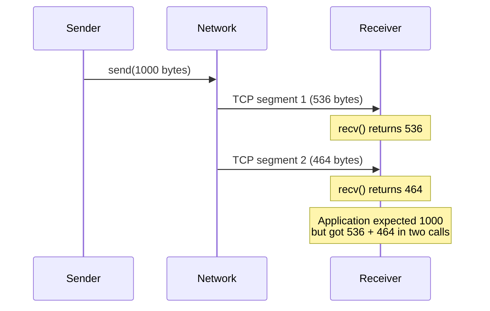

# Handling Partial Reads and Writes

## The Partial Read Problem

A single `socket.read_some()` call may return fewer bytes than requested:



**Why this happens:**

- TCP segments are limited by MSS (Maximum Segment Size, ~1460 bytes)
- Network fragmentation and reassembly
- OS receive buffer availability
- Timing of when application calls `recv()`

## The Partial Write Problem

A single write operation may also send fewer bytes than requested:

```cpp
// WRONG: Assumes write_some() transmits all bytes
socket.write_some(boost::asio::buffer(data, length));
// May only send partial data!

// CORRECT: Use boost::asio::write() which loops internally
boost::asio::write(socket, boost::asio::buffer(data, length));
// Guaranteed to send ALL bytes or throw an exception
```

::: tip "Composed operations handle partial I/O"

`boost::asio::write()` and `boost::asio::async_write()` automatically retry until all bytes are sent. No manual looping needed.

:::

## Boost.Asio Composed Operations

Boost.Asio provides `read()` and `write()` functions that automatically loop:

```cpp
// boost::asio::read - reads EXACTLY the requested bytes (or fails)
boost::asio::read(socket, boost::asio::buffer(data, length));

// boost::asio::write - writes ALL bytes (or fails)
boost::asio::write(socket, boost::asio::buffer(data, length));

// boost::asio::read_until - reads until delimiter found
boost::asio::read_until(socket, streambuf, '\n');
```

These are **composed operations**—they call the underlying `read_some()`/`write_some()` in a loop.

## Implementing Length-Prefix with Boost.Asio

**Synchronous version:**

```cpp
#include <boost/endian/conversion.hpp>

void send_message(tcp::socket& socket, const std::vector<uint8_t>& payload) {
    // Prepare length header in network byte order (big-endian)
    uint32_t net_len = boost::endian::native_to_big(static_cast<uint32_t>(payload.size()));

    // Scatter-gather write: header + payload in one call
    std::array<boost::asio::const_buffer, 2> buffers = {
        boost::asio::buffer(&net_len, sizeof(net_len)),
        boost::asio::buffer(payload)
    };
    boost::asio::write(socket, buffers);
}

std::vector<uint8_t> recv_message(tcp::socket& socket) {
    // Read 4-byte header
    uint32_t net_len;
    boost::asio::read(socket, boost::asio::buffer(&net_len, sizeof(net_len)));
    uint32_t len = boost::endian::big_to_native(net_len);

    // Validate length
    if (len > MAX_MESSAGE_SIZE) {
        throw std::runtime_error("Message exceeds maximum size");
    }

    // Read payload
    std::vector<uint8_t> payload(len);
    boost::asio::read(socket, boost::asio::buffer(payload));
    return payload;
}
```

**Asynchronous version (simplified):**

```cpp
void async_send_message(tcp::socket& socket,
                        std::shared_ptr<std::vector<uint8_t>> payload,
                        std::function<void(boost::system::error_code)> handler) {
    // Header must outlive the async operation
    auto header = std::make_shared<uint32_t>(
        boost::endian::native_to_big(static_cast<uint32_t>(payload->size())));

    std::array<boost::asio::const_buffer, 2> buffers = {
        boost::asio::buffer(header.get(), sizeof(*header)),
        boost::asio::buffer(*payload)
    };

    boost::asio::async_write(socket, buffers,
        [header, payload, handler](boost::system::error_code ec, size_t) {
            handler(ec);
        });
}
```
