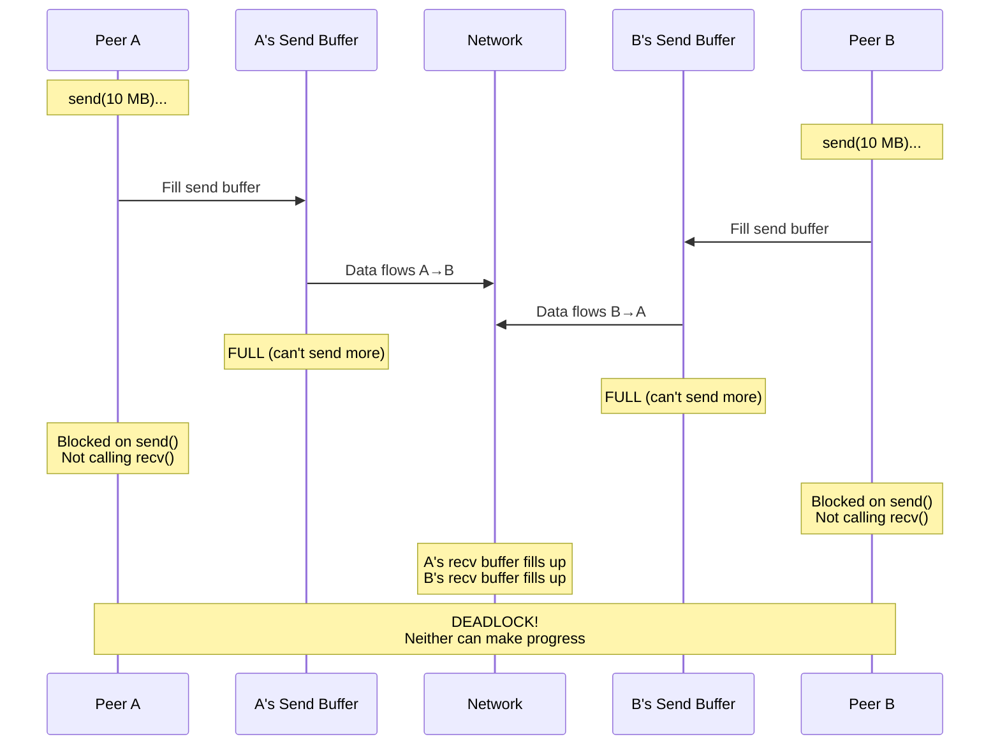
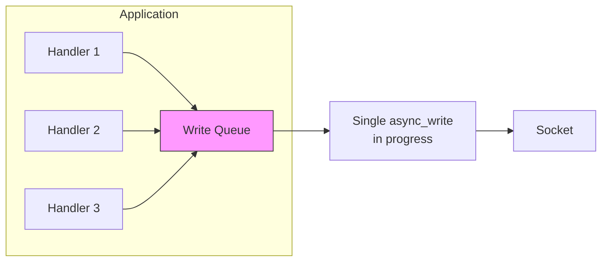

# Deadlock Prevention

## The TCP Deadlock Scenario

When both peers try to send large amounts of data without reading, they can deadlock:



**The mechanics:**

1. Peer A's `send()` blocks because its send buffer is full
2. Send buffer is full because Peer B isn't reading (B's recv buffer is full)
3. B isn't reading because B is blocked on its own `send()`
4. B's `send()` is blocked because A isn't reading
5. **Circular dependency = deadlock**

## Solutions to Deadlock

**Solution 1: Async I/O with Boost.Asio (Recommended)**

Boost.Asio's `io_context` handles read/write readiness internally—no manual `select()` needed:

```cpp
// Both operations are submitted to the event loop
// io_context handles them concurrently without blocking
boost::asio::async_read(socket, read_buffer,
    [](boost::system::error_code ec, size_t len) {
        // Called when data is ready to read
    });

boost::asio::async_write(socket, write_buffer,
    [](boost::system::error_code ec, size_t len) {
        // Called when write completes
    });

io_context.run();  // Event loop processes both operations
```

::: note "Under the hood"

Boost.Asio uses the most efficient mechanism available on each platform: `epoll` on Linux, `kqueue` on macOS/BSD, `IOCP` on Windows. You don't need to call `select()` or `poll()` directly.

:::

**Solution 2: Separate threads for read and write**

```cpp
std::jthread read_thread([&socket]() {
    while (running) {
        auto msg = recv_message(socket);  // Blocks waiting for data
        process(msg);
    }
});

std::jthread write_thread([&socket, &queue]() {
    while (running) {
        auto msg = queue.pop();           // Blocks waiting for outgoing message
        send_message(socket, msg);
    }
});
```

**Solution 3: Bounded write queues with backpressure**

```cpp
void queue_message(const Message& msg) {
    if (write_queue.size() >= MAX_QUEUE_SIZE) {
        // Apply backpressure: drop, compress, or block sender
        return;  // or throw
    }
    write_queue.push(msg);
}
```

## Write Queue Pattern

For async servers, maintain a per-connection write queue to prevent interleaving:



```cpp
class Connection {
    std::deque<std::vector<uint8_t>> write_queue_;
    bool write_in_progress_ = false;

    void queue_write(std::vector<uint8_t> data) {
        write_queue_.push_back(std::move(data));
        if (!write_in_progress_) {
            do_write();
        }
    }

    void do_write() {
        write_in_progress_ = true;
        boost::asio::async_write(socket_,
            boost::asio::buffer(write_queue_.front()),
            [this](auto ec, auto) {
                write_queue_.pop_front();
                if (!write_queue_.empty()) {
                    do_write();  // Continue with next message
                } else {
                    write_in_progress_ = false;
                }
            });
    }
};
```
