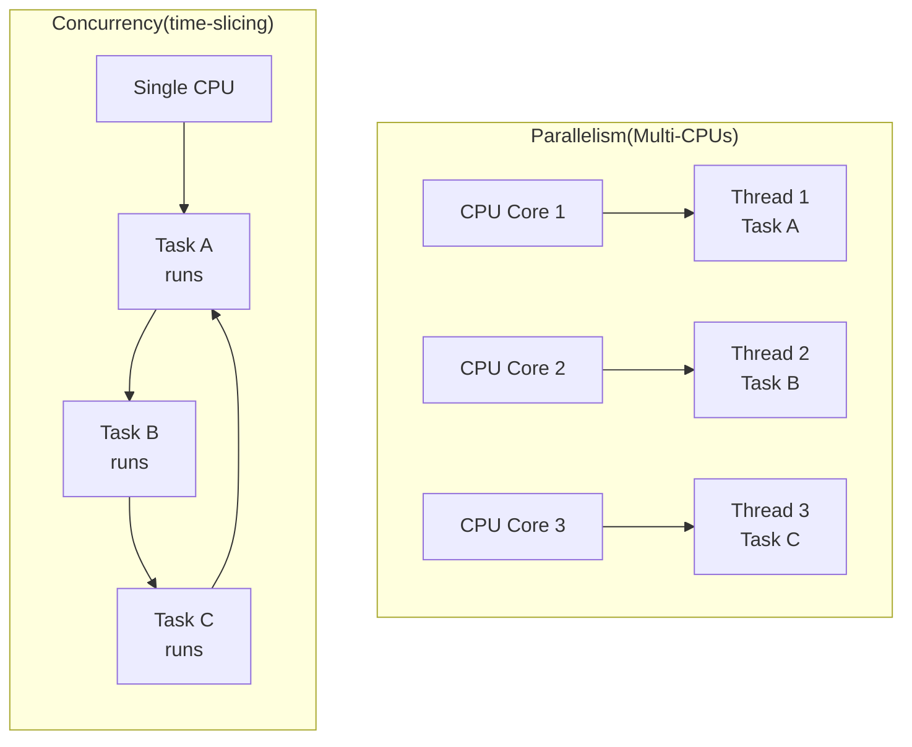
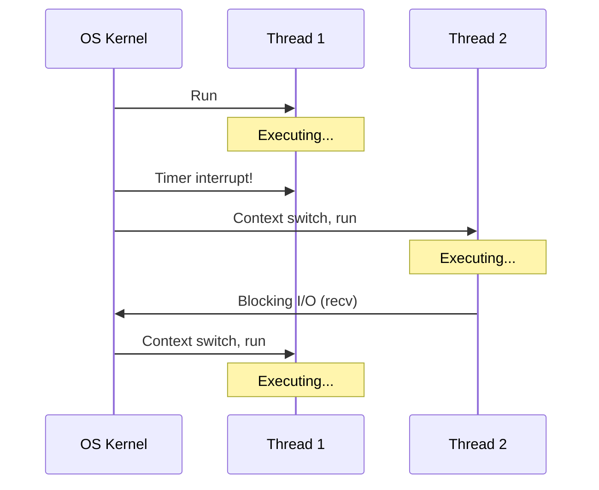
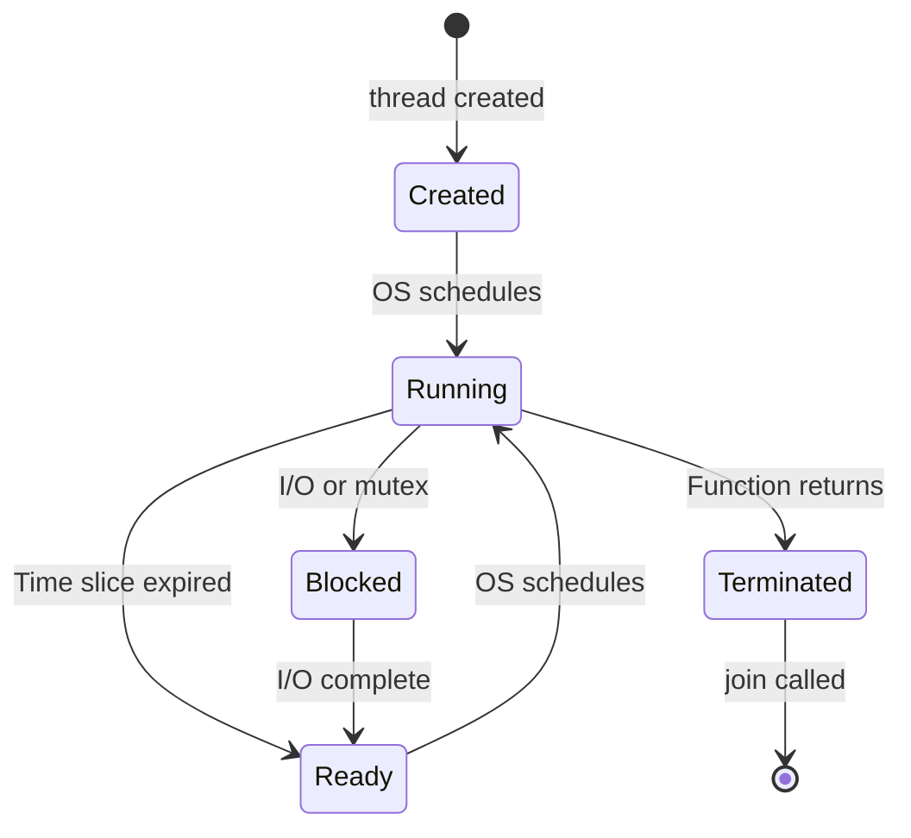
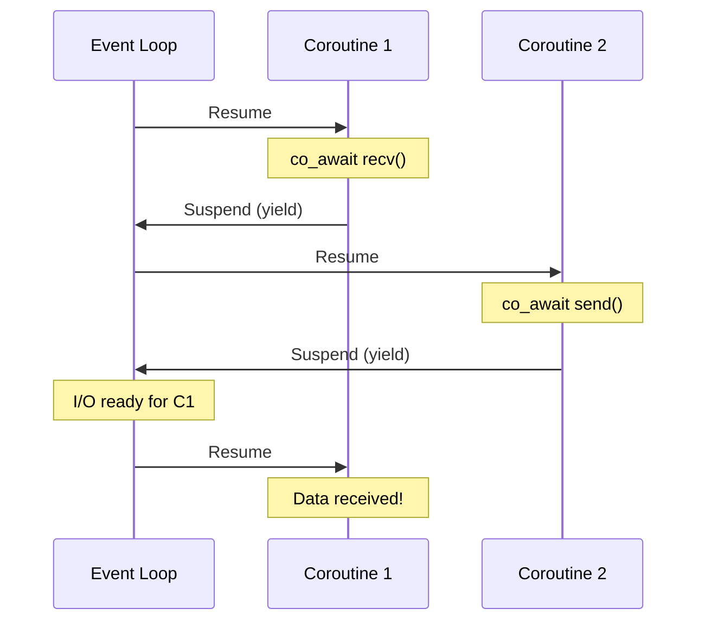
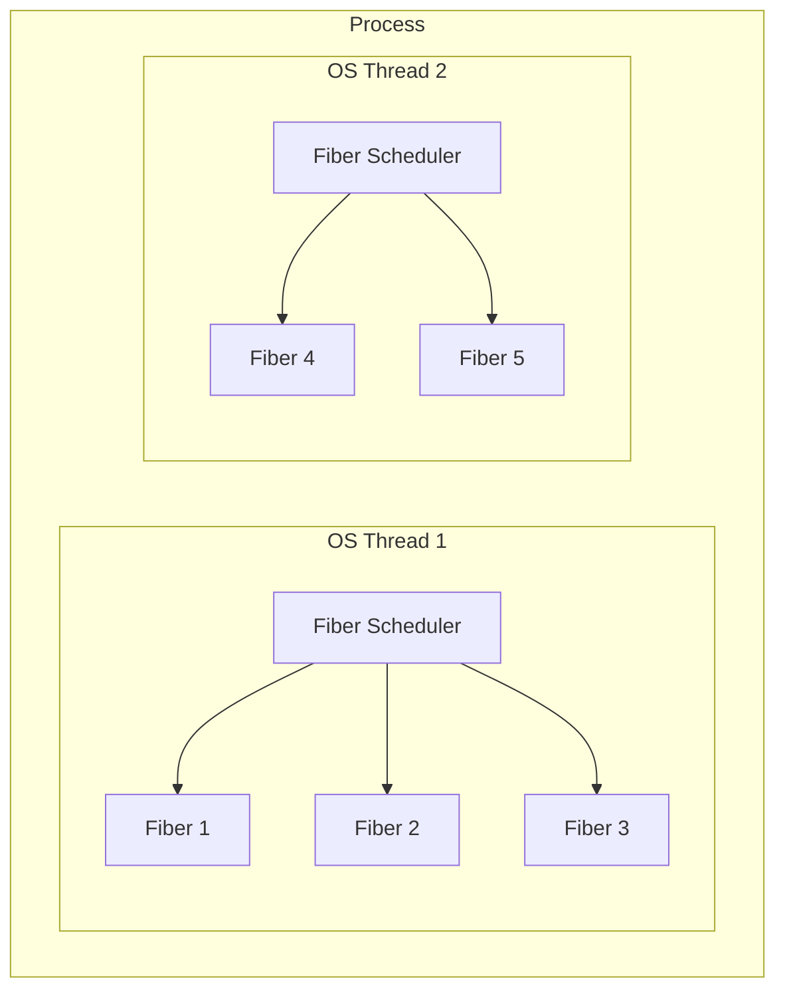
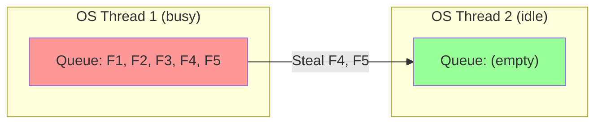
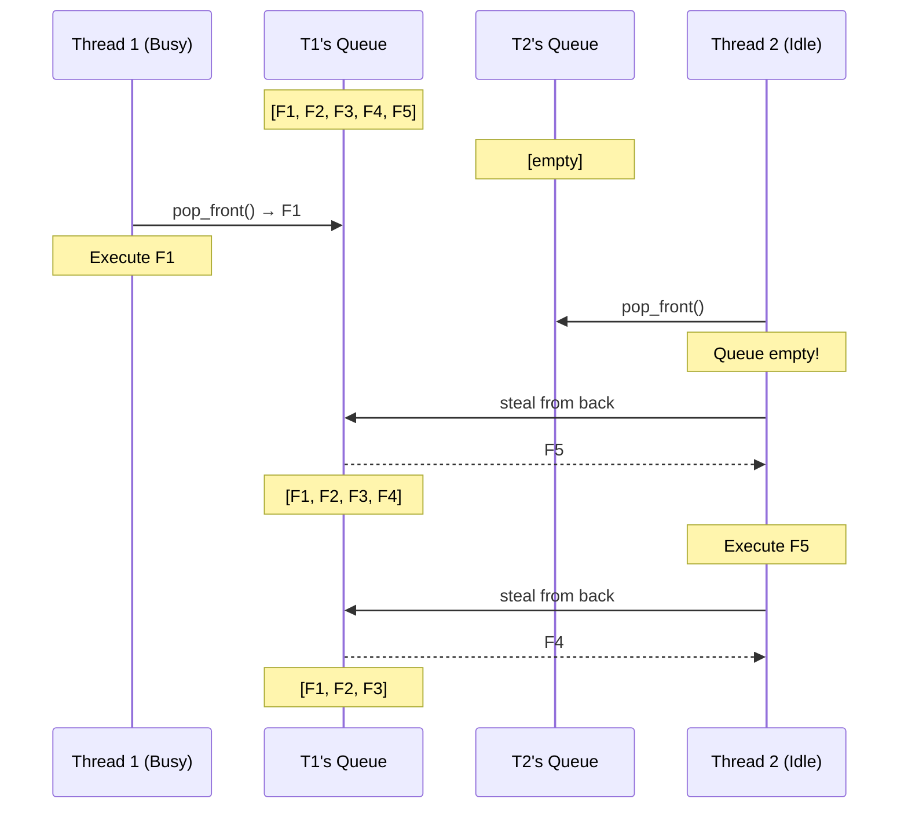

# Concurrency Models: Threads vs Coroutines vs Fibers

Handling multiple connections requires concurrency. There are three main approaches:

## Parallelism vs Concurrency



| Concept     | Definition                                                  | Example                     |
| ----------- | ----------------------------------------------------------- | --------------------------- |
| Parallelism | Multiple tasks execute **simultaneously** on multiple cores | 4 threads on 4 CPU cores    |
| Concurrency | Multiple tasks make progress by **interleaving** execution  | 100 connections on 1 thread |

::: tip "Key insight"

Parallelism requires multiple CPUs. Concurrency is a programming model that works even on a single CPU. Network I/O is mostly **I/O-bound**, not CPU-bound, so concurrency (not parallelism) is often the bottleneck.

:::

## OS Threads (Preemptive Multitasking)

**How they work:**

- OS kernel schedules threads on CPU cores
- Preemptive: kernel can interrupt a thread at any time
- Each thread has its own stack (typically 1-8 MB)
- Threads share the same address space (heap, globals)



**Thread lifecycle:**



**What happens during context switch:**

1. Save current thread's registers (CPU state) to memory
2. Save stack pointer and instruction pointer
3. Switch page tables (if different process)
4. Load next thread's registers from memory
5. Resume execution at saved instruction pointer

This takes **1-10 microseconds**—cheap for humans, expensive for CPUs doing millions of operations per second.

**Thread-per-connection model:**

```cpp
void handle_client(tcp::socket socket) {
    // Each thread handles one client
    // Blocking calls are fine—only this thread blocks
    while (true) {
        auto msg = recv_message(socket);  // Blocks this thread
        auto response = process(msg);
        send_message(socket, response);   // Blocks this thread
    }
}

int main() {
    tcp::acceptor acceptor(io, {tcp::v4(), 12345});

    while (true) {
        tcp::socket socket = acceptor.accept();
        // Create new thread for each connection
        std::thread(handle_client, std::move(socket)).detach();
    }
}
```

**Pros:**

- Simple mental model (sequential code)
- True parallelism on multi-core
- Can use blocking I/O freely
- Each thread isolated—one blocking doesn't affect others
- Easy debugging (stack traces make sense)

**Cons:**

- Context switch cost (~1-10 μs)
- High memory overhead (1-8 MB stack per thread)
- Scales poorly (thousands of threads = problems)
- Requires synchronization (mutexes, atomics) for shared data
- Thread creation overhead (~50-100 μs)

**When threads become a problem:**

| Clients | Threads | Memory (8MB stack) | Context switches/sec |
| ------- | ------- | ------------------ | -------------------- |
| 100     | 100     | 800 MB             | ~10,000              |
| 1,000   | 1,000   | 8 GB               | ~100,000             |
| 10,000  | 10,000  | 80 GB              | ~1,000,000           |

At 10,000 clients, you're spending more time switching contexts than doing actual work.

## Coroutines (Cooperative Multitasking)

**How they work:**

- Function that can **suspend** and **resume** execution
- Programmer explicitly yields control at `co_await` points (cooperative)
- All coroutines share the same thread's stack
- Coroutine state (local variables) is saved on the heap in a **coroutine frame**
- No kernel involvement—just function pointer manipulation



**Coroutine anatomy in C++20:**

```cpp
// Coroutine function - returns awaitable<T>
boost::asio::awaitable<std::string> fetch_data(tcp::socket& socket) {
    // co_await = suspension point
    // Coroutine suspends here, event loop runs other coroutines
    std::array<char, 1024> buffer;
    size_t n = co_await socket.async_read_some(
        boost::asio::buffer(buffer),
        boost::asio::use_awaitable);

    // Resumed here when data arrives
    // Local variables (buffer, n) preserved in coroutine frame
    co_return std::string(buffer.data(), n);
}
```

**What `co_await` actually does:**

1. Check if result is ready (if yes, continue immediately)
2. Save current execution state to heap (coroutine frame)
3. Return control to caller (event loop)
4. Later: Event loop resumes coroutine when I/O completes
5. Restore state and continue from suspension point

**Key insight:** Unlike threads, coroutines only suspend at explicit `co_await` points. Between suspension points, code runs without interruption.

**Coroutine frame vs thread stack:**

| Aspect       | Thread Stack      | Coroutine Frame     |
| ------------ | ----------------- | ------------------- |
| Size         | 1-8 MB (fixed)    | ~100-1000 bytes     |
| Allocation   | OS allocates      | Heap allocated      |
| Grows        | Downward, limited | Only what's needed  |
| Contains     | All call frames   | Only suspended vars |
| Can overflow | Stack overflow    | std::bad_alloc      |

**Pros:**

- Very low overhead (~100-1000 bytes per coroutine vs MB per thread)
- No context switch cost (just function calls, no kernel)
- No synchronization needed (single-threaded execution)
- Scales to millions of concurrent operations
- Sequential-looking code (easy to read and maintain)

**Cons:**

- Cannot use blocking calls (would block ALL coroutines and the event loop)
- CPU-bound work blocks all coroutines (no preemption)
- Requires C++20 or library support (Boost.Coroutine2)
- Debugging can be tricky (stack traces don't show full context)
- Must be careful about object lifetimes across suspension points

::: warning "The blocking call trap"

```cpp
boost::asio::awaitable<void> bad_handler(tcp::socket& socket) {
    // WRONG: This blocks the entire event loop!
    std::this_thread::sleep_for(std::chrono::seconds(5));

    // WRONG: Blocking file I/O
    std::ifstream file("data.txt");

    // CORRECT: Use async version
    co_await boost::asio::steady_timer(io, 5s).async_wait(use_awaitable);
}
```

Any blocking call freezes ALL coroutines on that thread.

:::

## Fibers (Userspace Threads)

**How they work:**

- Like threads, but scheduled by a userspace library (not kernel)
- Each fiber has its own stack (smaller than OS threads, typically 4-64 KB)
- Cooperative: fiber must yield explicitly at synchronization points
- Can migrate between OS threads via **work stealing**



**Fibers vs coroutines:**

| Aspect        | Coroutines                | Fibers                  |
| ------------- | ------------------------- | ----------------------- |
| Stack         | Stackless (heap frame)    | Has own stack (4-64 KB) |
| Deep calls    | Each level needs co_await | Works naturally         |
| Existing code | Must be rewritten         | Often works as-is       |
| Migration     | No (single thread)        | Yes (work stealing)     |
| Memory        | ~100-1000 bytes           | 4-64 KB per fiber       |

**Why fibers have stacks:**

Coroutines are "stackless"—they only save the current function's state. If a coroutine calls a regular function that needs to suspend, you need `co_await` at every level:

```cpp
// Coroutine: co_await must propagate up the call stack
boost::asio::awaitable<void> outer() {
    co_await inner();  // Must co_await
}

boost::asio::awaitable<void> inner() {
    co_await innermost();  // Must co_await
}
```

Fibers have a real stack, so nested calls "just work":

```cpp
// Fiber: suspension happens transparently
void outer() {
    inner();  // No special syntax
}

void inner() {
    innermost();  // Suspension handled by scheduler
}
```

### Work Stealing

**Work stealing** is a load-balancing strategy where idle threads "steal" work from busy threads.



**How work stealing works:**

1. Each OS thread has a **local work queue** (double-ended queue / deque)
2. When a fiber spawns new work, it's pushed to the local queue
3. Thread processes work from its own queue (fast, no contention)
4. When a thread's queue is empty, it **steals** from another thread's queue
5. Stealing happens from the **opposite end** (reduces contention)



**Why steal from the opposite end?**

- Owner pushes/pops from **front** (LIFO for cache locality)
- Thieves steal from **back** (FIFO for fairness, less contention)
- Only the owner modifies the front (no locking needed for common case)
- Stealing is rare, so occasional locking is acceptable

**Work stealing with Boost.Fiber:**

```cpp
#include <boost/fiber/all.hpp>
#include <boost/fiber/algo/work_stealing.hpp>

int main() {
    // Create thread pool with work stealing
    constexpr size_t num_threads = 4;

    // Install work-stealing scheduler on main thread
    boost::fibers::use_scheduling_algorithm<
        boost::fibers::algo::work_stealing>(num_threads);

    // Worker threads also use work stealing
    std::vector<std::thread> workers;
    for (size_t i = 1; i < num_threads; ++i) {
        workers.emplace_back([]() {
            boost::fibers::use_scheduling_algorithm<
                boost::fibers::algo::work_stealing>(num_threads);

            // This thread participates in work stealing
            // Fibers can migrate here when this thread is idle
            boost::this_fiber::sleep_for(std::chrono::hours(24));
        });
    }

    // Spawn fibers - they'll be distributed across threads
    for (int i = 0; i < 1000; ++i) {
        boost::fibers::fiber([i]() {
            // This fiber may run on any thread
            process_work(i);
        }).detach();
    }

    // Join workers...
}
```

**Advantages of work stealing:**

- **Automatic load balancing**: No need to manually distribute work
- **Cache efficiency**: Fibers tend to stay on their original thread (good locality)
- **Scalability**: Minimal contention—threads mostly work independently
- **Adaptive**: Naturally handles uneven workloads

**Pros:**

- Stack-based (familiar programming model, deep call stacks work)
- Cheaper than OS threads (smaller stacks, no kernel involvement)
- Work stealing enables multi-core parallelism
- Can wrap existing blocking-style code more easily

**Cons:**

- Still has stack overhead (4-64 KB per fiber)
- Blocking OS calls still problematic (need fiber-aware alternatives)
- Less portable than coroutines
- More complex than single-threaded coroutines

## Comparison Table

| Aspect           | OS Threads          | Coroutines            | Fibers                |
| ---------------- | ------------------- | --------------------- | --------------------- |
| Scheduling       | Kernel (preemptive) | Library (cooperative) | Library (cooperative) |
| Memory per unit  | 1-8 MB (stack)      | ~100-1000 bytes       | 4-64 KB (stack)       |
| Context switch   | ~1-10 μs            | ~10-100 ns            | ~100 ns-1 μs          |
| Scalability      | Thousands           | Millions              | Hundreds of thousands |
| Blocking I/O     | OK                  | Blocks everything     | Blocks fiber only\*   |
| True parallelism | Yes                 | No (single thread)    | Yes (multi-thread)    |
| Synchronization  | Required            | Not needed            | Sometimes needed      |
| C++ support      | `std::thread`       | C++20 `co_await`      | Boost.Fiber           |

\*With fiber-aware I/O libraries
