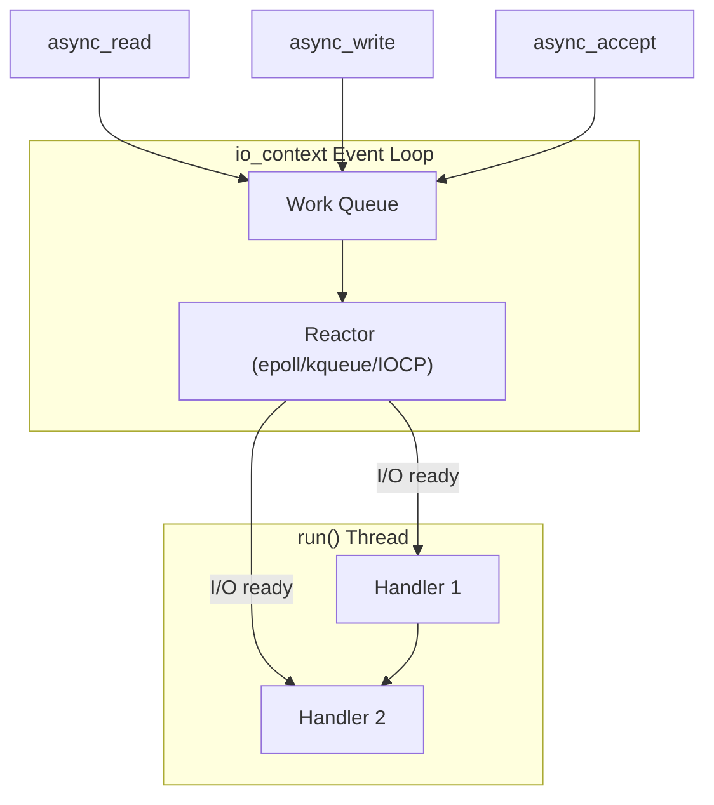
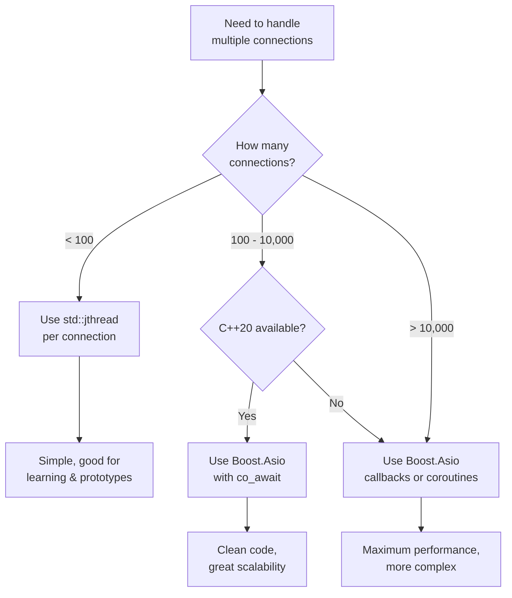

# C++ Concurrency Implementation

## OS Threads with std::jthread (C++20)

**std::jthread** is an improved thread class that automatically joins on destruction and supports cooperative cancellation.

```cpp
#include <thread>
#include <stop_token>

void client_handler(tcp::socket socket, std::stop_token stop) {
    while (!stop.stop_requested()) {
        auto msg = recv_message(socket);
        process(msg);
    }
}

int main() {
    // std::jthread automatically joins on destruction
    std::vector<std::jthread> threads;

    while (accepting) {
        tcp::socket socket = acceptor.accept();
        threads.emplace_back(client_handler, std::move(socket));
    }
    // Threads automatically joined when vector destroyed
}
```

**std::jthread vs std::thread:**

| Feature             | std::thread          | std::jthread (C++20) |
| ------------------- | -------------------- | -------------------- |
| Destructor behavior | Calls std::terminate | Joins automatically  |
| Cancellation        | Manual (shared flag) | Built-in stop_token  |
| Request stop        | Manual               | request_stop()       |
| Check if stopping   | Manual               | stop_requested()     |
| Callback on stop    | Not available        | stop_callback        |

**Cooperative cancellation with stop_token:**

```cpp
void client_handler(tcp::socket socket, std::stop_token stop) {
    // Register callback - called when stop requested
    std::stop_callback callback(stop, [&socket]() {
        // Cancel any pending operations
        socket.cancel();
    });

    while (!stop.stop_requested()) {
        try {
            auto msg = recv_message(socket);
            if (stop.stop_requested()) break;  // Check after blocking call
            process(msg);
        } catch (boost::system::system_error& e) {
            if (e.code() == boost::asio::error::operation_aborted) {
                break;  // Cancelled via stop_callback
            }
            throw;
        }
    }
}

int main() {
    std::jthread handler(client_handler, std::move(socket));

    // Later, request graceful shutdown:
    handler.request_stop();  // Triggers stop_callback, sets stop_requested

    // Destructor waits for thread to finish
}
```

**Thread pool pattern for servers:**

```cpp
class ThreadPool {
    std::vector<std::jthread> workers_;
    std::queue<std::function<void()>> tasks_;
    std::mutex mutex_;
    std::condition_variable cv_;

public:
    ThreadPool(size_t num_threads) {
        for (size_t i = 0; i < num_threads; ++i) {
            workers_.emplace_back([this](std::stop_token stop) {
                while (!stop.stop_requested()) {
                    std::function<void()> task;
                    {
                        std::unique_lock lock(mutex_);
                        cv_.wait(lock, [this, &stop]() {
                            return stop.stop_requested() || !tasks_.empty();
                        });
                        if (stop.stop_requested()) return;
                        task = std::move(tasks_.front());
                        tasks_.pop();
                    }
                    task();
                }
            });
        }
    }

    void submit(std::function<void()> task) {
        {
            std::lock_guard lock(mutex_);
            tasks_.push(std::move(task));
        }
        cv_.notify_one();
    }

    ~ThreadPool() {
        // Request all threads to stop
        for (auto& w : workers_) {
            w.request_stop();
        }
        cv_.notify_all();
        // jthreads join automatically
    }
};
```

**Thread safety considerations:**

When multiple threads access shared data, you need synchronization.

### `shared_lock` vs `unique_lock`

C++ provides two lock types for `std::shared_mutex`, implementing a **readers-writer lock** pattern:

| Lock Type          | Access                | Concurrent with other...         | Use for               |
| ------------------ | --------------------- | -------------------------------- | --------------------- |
| `std::unique_lock` | **Exclusive** (write) | Nothing — blocks all other locks | Modifying shared data |
| `std::shared_lock` | **Shared** (read)     | Other `shared_lock`s only        | Reading shared data   |

**How it works:**

- Multiple threads can hold a `shared_lock` **simultaneously** (many readers)
- A `unique_lock` waits until **all** shared locks are released, then blocks everyone else (single writer)
- This is optimal when reads are much more frequent than writes

```cpp
class SharedState {
    std::unordered_map<int, std::string> data_;
    mutable std::shared_mutex mutex_;  // Readers-writer lock

public:
    void write(int key, std::string value) {
        // unique_lock: exclusive access — no other thread can read or write
        std::unique_lock lock(mutex_);
        data_[key] = std::move(value);
    }

    std::optional<std::string> read(int key) const {
        // shared_lock: multiple threads can read simultaneously
        std::shared_lock lock(mutex_);
        auto it = data_.find(key);
        if (it != data_.end()) return it->second;
        return std::nullopt;
    }
};
```

::: warning "When to use which mutex"

- Use `std::mutex` + `std::lock_guard` when all access is write (simplest, lowest overhead)
- Use `std::shared_mutex` + `shared_lock`/`unique_lock` when you have many readers and few writers
- Don't use `shared_mutex` if writes are frequent — the overhead of the readers-writer protocol isn't worth it

:::

::: tip "std::jthread vs std::thread"

- `std::jthread` (C++20) joins automatically on destruction
- Built-in cooperative cancellation via `std::stop_token`
- No need for `.detach()` or manual `.join()`
- Use stop_callback for cleanup when stop is requested

:::

## Async I/O with Boost.Asio Callbacks

The callback-based model is the most flexible and performant, but requires careful attention to object lifetimes and execution context.

**io_context: The event loop**



**How io_context.run() works:**

1. Blocks until there's work to do
2. Waits for I/O events (using OS-specific mechanism)
3. When I/O completes, queues the completion handler
4. Executes handlers one at a time (on the thread calling run())
5. Repeats until no more work (all operations complete)

```cpp
boost::asio::io_context io;

// Submit async work
socket.async_read_some(buffer, handler1);
socket.async_write(buffer, handler2);

// run() processes ALL submitted work
io.run();  // Blocks until handler1 and handler2 complete

// After run() returns, io_context is empty
// Can submit more work and call run() again
```

**Session management with shared_ptr:**

```cpp
class Session : public std::enable_shared_from_this<Session> {
    tcp::socket socket_;
    std::array<char, 1024> buffer_;

public:
    static std::shared_ptr<Session> create(tcp::socket socket) {
        // Can't use make_shared with private constructor
        return std::shared_ptr<Session>(new Session(std::move(socket)));
    }

    void start() {
        do_read();
    }

private:
    Session(tcp::socket socket) : socket_(std::move(socket)) {}

    void do_read() {
        // shared_from_this() keeps Session alive until handler runs
        auto self = shared_from_this();
        socket_.async_read_some(boost::asio::buffer(buffer_),
            [this, self](boost::system::error_code ec, size_t len) {
                if (!ec) {
                    do_write(len);
                }
                // If error, 'self' destroyed, Session cleaned up
            });
    }

    void do_write(size_t len) {
        auto self = shared_from_this();
        boost::asio::async_write(socket_,
            boost::asio::buffer(buffer_, len),
            [this, self](boost::system::error_code ec, size_t) {
                if (!ec) {
                    do_read();  // Continue the read/write cycle
                }
            });
    }
};
```

**Acceptor loop:**

```cpp
class Server {
    tcp::acceptor acceptor_;

public:
    Server(boost::asio::io_context& io, uint16_t port)
        : acceptor_(io, {tcp::v4(), port}) {
        do_accept();
    }

private:
    void do_accept() {
        acceptor_.async_accept(
            [this](boost::system::error_code ec, tcp::socket socket) {
                if (!ec) {
                    auto session = Session::create(std::move(socket));
                    session->start();
                }
                do_accept();  // Accept next connection
            });
    }
};

int main() {
    boost::asio::io_context io;
    Server server(io, 12345);
    io.run();  // Single thread handles ALL connections
}
```

**Multi-threaded io_context:**

For CPU-bound handlers or to utilize multiple cores:

```cpp
int main() {
    boost::asio::io_context io;
    Server server(io, 12345);

    // Multiple threads can call run() on the same io_context
    std::vector<std::jthread> threads;
    for (size_t i = 0; i < std::thread::hardware_concurrency(); ++i) {
        threads.emplace_back([&io]() {
            io.run();  // Each thread processes handlers
        });
    }

    // All threads will exit when work is done
}
```

**Strand: Serializing handlers**

When multiple threads run io_context, handlers may run concurrently. Use **strand** to serialize:

```cpp
class Session : public std::enable_shared_from_this<Session> {
    tcp::socket socket_;
    boost::asio::strand<boost::asio::io_context::executor_type> strand_;
    std::deque<std::vector<uint8_t>> write_queue_;

public:
    Session(tcp::socket socket)
        : socket_(std::move(socket))
        , strand_(boost::asio::make_strand(socket_.get_executor())) {}

    void write(std::vector<uint8_t> data) {
        // Post to strand ensures serialization
        boost::asio::post(strand_, [this, self = shared_from_this(),
                                    data = std::move(data)]() mutable {
            bool write_in_progress = !write_queue_.empty();
            write_queue_.push_back(std::move(data));
            if (!write_in_progress) {
                do_write();
            }
        });
    }

private:
    void do_write() {
        // All handlers bound to strand_ run serially
        boost::asio::async_write(socket_,
            boost::asio::buffer(write_queue_.front()),
            boost::asio::bind_executor(strand_,
                [this, self = shared_from_this()]
                (boost::system::error_code ec, size_t) {
                    if (!ec) {
                        write_queue_.pop_front();
                        if (!write_queue_.empty()) {
                            do_write();
                        }
                    }
                }));
    }
};
```

::: tip "When to use strands"

Use a strand when:

- Multiple threads call `io_context.run()`
- Handlers access shared mutable state
- You need to serialize a sequence of operations (e.g., write queue)

You don't need strands if:

- Only one thread calls `run()` (handlers are already serialized)
- Handlers are independent (no shared state)

:::

## C++20 Coroutines with Boost.Asio

Coroutines combine the readability of synchronous code with the efficiency of async I/O.

**The magic of co_await:**

```cpp
// This async code:
boost::asio::async_read(socket, buffer, [](auto ec, auto len) {
    if (!ec) {
        boost::asio::async_write(socket, buffer, [](auto ec, auto len) {
            // Nested callback hell...
        });
    }
});

// Becomes this with coroutines:
co_await boost::asio::async_read(socket, buffer, use_awaitable);
co_await boost::asio::async_write(socket, buffer, use_awaitable);
// Sequential, readable, still async!
```

**Complete coroutine server:**

```cpp
#include <boost/asio/co_spawn.hpp>
#include <boost/asio/use_awaitable.hpp>
#include <boost/asio/awaitable.hpp>
#include <boost/asio/steady_timer.hpp>

using boost::asio::ip::tcp;
using boost::asio::use_awaitable;
using boost::asio::awaitable;

awaitable<void> handle_client(tcp::socket socket) {
    try {
        std::array<char, 1024> buffer;

        while (true) {
            // Read some data
            size_t n = co_await socket.async_read_some(
                boost::asio::buffer(buffer),
                use_awaitable);

            // Echo it back
            co_await boost::asio::async_write(
                socket,
                boost::asio::buffer(buffer, n),
                use_awaitable);
        }
    } catch (std::exception& e) {
        // Connection closed or error - coroutine ends
    }
}

awaitable<void> accept_connections(tcp::acceptor& acceptor) {
    while (true) {
        tcp::socket socket = co_await acceptor.async_accept(use_awaitable);

        // Spawn new coroutine for this client
        boost::asio::co_spawn(
            acceptor.get_executor(),
            handle_client(std::move(socket)),
            boost::asio::detached);  // Fire and forget
    }
}

int main() {
    boost::asio::io_context io;
    tcp::acceptor acceptor(io, {tcp::v4(), 12345});

    boost::asio::co_spawn(io, accept_connections(acceptor), boost::asio::detached);

    io.run();  // Still single-threaded!
}
```

**Using timers with coroutines:**

```cpp
awaitable<void> timeout_handler(tcp::socket& socket) {
    boost::asio::steady_timer timer(socket.get_executor());

    // Wait for 5 seconds
    timer.expires_after(std::chrono::seconds(5));
    co_await timer.async_wait(use_awaitable);

    // Timer expired
    socket.cancel();  // Cancel pending operations
}

awaitable<void> read_with_timeout(tcp::socket& socket) {
    std::array<char, 1024> buffer;

    // Create timer
    boost::asio::steady_timer timer(socket.get_executor());
    timer.expires_after(std::chrono::seconds(30));

    // Race: read vs timeout
    using namespace boost::asio::experimental::awaitable_operators;

    auto result = co_await (
        socket.async_read_some(boost::asio::buffer(buffer), use_awaitable)
        || timer.async_wait(use_awaitable)
    );

    if (result.index() == 0) {
        // Read completed first
        size_t bytes_read = std::get<0>(result);
        // Process data...
    } else {
        // Timeout occurred
        socket.cancel();
        throw std::runtime_error("Read timeout");
    }
}
```

**Exception handling in coroutines:**

```cpp
awaitable<void> handle_client(tcp::socket socket) {
    try {
        // Main loop
        while (true) {
            auto msg = co_await recv_framed_message(socket);
            auto response = process(msg);
            co_await send_framed_message(socket, response);
        }
    } catch (boost::system::system_error& e) {
        if (e.code() == boost::asio::error::eof) {
            // Clean disconnect - not an error
            std::cout << "Client disconnected\n";
        } else if (e.code() == boost::asio::error::operation_aborted) {
            // Cancelled (e.g., server shutdown)
            std::cout << "Operation cancelled\n";
        } else {
            // Real error
            std::cerr << "Error: " << e.what() << "\n";
        }
    } catch (std::exception& e) {
        std::cerr << "Exception: " << e.what() << "\n";
    }
    // Coroutine ends, resources cleaned up
}

// co_spawn with error handler:
boost::asio::co_spawn(io, accept_connections(acceptor),
    [](std::exception_ptr ep) {
        if (ep) {
            try {
                std::rethrow_exception(ep);
            } catch (std::exception& e) {
                std::cerr << "Accept loop died: " << e.what() << "\n";
            }
        }
    });
```

**Returning values from coroutines:**

```cpp
awaitable<std::vector<uint8_t>> recv_framed_message(tcp::socket& socket) {
    uint32_t net_len;
    co_await boost::asio::async_read(
        socket,
        boost::asio::buffer(&net_len, 4),
        use_awaitable);

    uint32_t len = boost::endian::big_to_native(net_len);

    std::vector<uint8_t> payload(len);
    co_await boost::asio::async_read(
        socket,
        boost::asio::buffer(payload),
        use_awaitable);

    co_return payload;  // Return value from coroutine
}

// Using the returned value:
awaitable<void> client_loop(tcp::socket& socket) {
    auto message = co_await recv_framed_message(socket);
    process(message);
}
```

::: note "Coroutine syntax"

- `co_await` suspends until the async operation completes
- `co_return` returns a value from a coroutine
- `boost::asio::awaitable<T>` is the coroutine return type
- `boost::asio::use_awaitable` adapts async ops for coroutines
- `boost::asio::detached` means fire-and-forget (no completion token)

:::

## Boost.Fiber (Userspace Threads)

Fibers let you write blocking-style code that's actually cooperative:

```cpp
#include <boost/fiber/all.hpp>

void fiber_client_handler(tcp::socket& socket) {
    // Looks like blocking code, but fiber yields internally
    while (true) {
        auto msg = recv_message(socket);  // Fiber-aware I/O
        process(msg);
    }
}

int main() {
    boost::fibers::use_scheduling_algorithm<
        boost::fibers::algo::round_robin>();

    std::vector<boost::fibers::fiber> fibers;

    while (accepting) {
        tcp::socket socket = acceptor.accept();
        fibers.emplace_back(fiber_client_handler, std::ref(socket));
    }

    for (auto& f : fibers) {
        f.join();
    }
}
```

## Choosing a Concurrency Model



| Scenario                          | Recommended approach                |
| --------------------------------- | ----------------------------------- |
| Learning / class assignments      | `std::jthread` per connection       |
| Production server, < 1000 clients | Boost.Asio coroutines (C++20)       |
| High-scale server, > 10k clients  | Boost.Asio callbacks                |
| Game server (low latency)         | Boost.Asio coroutines or callbacks  |
| Legacy codebase (no C++20)        | Boost.Asio callbacks or Boost.Fiber |
