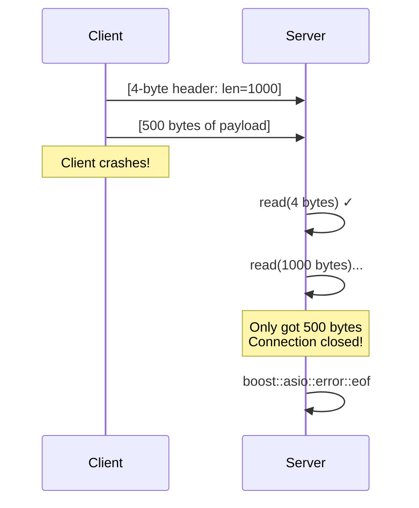
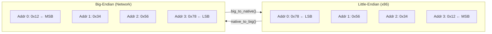

# Edge Cases and Transmission Issues

## Connection Termination During Read



**Handling:**

```cpp
try {
    auto msg = recv_message(socket);
} catch (boost::system::system_error& e) {
    if (e.code() == boost::asio::error::eof) {
        // Clean disconnect
    } else {
        // Error during transfer
    }
}
```

## Message Interleaving (Write Corruption)

If multiple handlers write concurrently without coordination:

```
Handler 1 writes: [HDR1][PAYLOAD1]
Handler 2 writes: [HDR2][PAYLOAD2]

Wire might be:   [HDR1][HDR2][PAYLOAD1][PAYLOAD2]  ← CORRUPTED!
```

**Solution:** Use write queue or strand (see Deadlock Prevention)

## Slow Consumer Problem

Fast producer, slow consumer:


**Solutions:**

- Bounded queue with backpressure
- Drop old messages (acceptable for game state)
- Compress/batch messages
- Disconnect slow clients

## Byte Order (Endianness)

::: danger "Boost.Asio does NOT handle byte order!"

Boost.Asio transports raw bytes—it has no knowledge of your data types. **You must manually convert multi-byte integers** before sending and after receiving.

:::

Different CPU architectures store multi-byte integers differently:

| Architecture     | Byte Order    | Example: `0x12345678`     | Memory Layout                            |
| ---------------- | ------------- | ------------------------- | ---------------------------------------- |
| x86, x64, ARM    | Little-endian | `78 56 34 12` (LSB first) | Least significant byte at lowest address |
| PowerPC, SPARC   | Big-endian    | `12 34 56 78` (MSB first) | Most significant byte at lowest address  |
| Network standard | Big-endian    | `12 34 56 78` (always)    | Defined by RFC 1700                      |

**Terminology:**

- **LSB** = **L**east **S**ignificant **B**yte — the byte containing the smallest place values (the "ones" place)
- **MSB** = **M**ost **S**ignificant **B**yte — the byte containing the largest place values

For `0x12345678`:

- MSB = `0x12` (most significant, leftmost digit in hex notation)
- LSB = `0x78` (least significant, rightmost digit in hex notation)



::: note "Etymology: Big-endian vs Little-endian"

These terms come from Jonathan Swift's _Gulliver's Travels_ (1726), where a war breaks out over which end of a boiled egg to crack open. Computer scientists borrowed the terms in 1980 to describe the "religious wars" over byte ordering.

:::

::: warning "The endianness bug"

If you send a raw `uint32_t` from a little-endian machine, a big-endian machine will interpret it incorrectly:

- Sender (x86) sends `256` as bytes: `00 01 00 00`
- Receiver (big-endian) interprets as: `16777216` (0x00010000)

This is why network protocols standardize on big-endian ("network byte order").

:::

::: info "Why do byte orders differ, and why not tag each message?"

**Why do different CPUs use different byte orders?**

It comes down to hardware design trade-offs made in the 1970s–80s that became permanently baked into instruction-set architectures:

- **Little-endian** (x86, ARM in default mode): the least-significant byte sits at the lowest memory address. This simplifies multi-precision arithmetic — an ADD instruction can start reading at address 0 and let carries propagate upward without knowing the total width of the integer in advance.
- **Big-endian** (PowerPC, SPARC, network protocols): the most-significant byte comes first, matching left-to-right human notation. Comparing and sorting numbers can begin at the first byte, and hex dumps read naturally.

Neither representation is inherently superior; each optimizes for a different operation. Once millions of chips and their software ecosystems existed, backwards compatibility locked the choice in.

**Why not include a flag that says "this message is little-endian" or "big-endian"?**

Some formats actually do this:

- **Unicode BOM** (`U+FEFF`): the reader checks whether the first two bytes are `FE FF` or `FF FE` to determine byte order.
- **TIFF** image files: the header begins with `II` (Intel / little-endian) or `MM` (Motorola / big-endian).

But network protocols took a different, simpler path — **standardize on one byte order**:

- An endianness tag adds overhead to every message (even a 1-bit flag must be parsed).
- Every receiver would need to branch on every multi-byte read, doubling parser complexity.
- A per-message negotiation opens the door to mismatches if one side gets the flag wrong.
- RFC 1700 settled the question decades ago: **network byte order is big-endian**.

Standardizing once at the protocol level is simpler, faster, and less error-prone than negotiating per-message. The practical rule is: **convert at the boundary** using `native_to_big()` / `big_to_native()`, and the rest of your code never has to think about it.

:::

## Byte Order Conversion

**Header:** `#include <boost/endian/conversion.hpp>`

| Function                  | Use Case                    |
| ------------------------- | --------------------------- |
| `native_to_big(value)`    | Convert before sending      |
| `big_to_native(value)`    | Convert after receiving     |
| `native_to_little(value)` | For little-endian protocols |
| `little_to_native(value)` | For little-endian protocols |

**Complete send/receive example:**

```cpp
#include <boost/endian/conversion.hpp>
#include <boost/asio.hpp>

void send_message(tcp::socket& socket, const std::vector<uint8_t>& payload) {
    uint32_t host_len = static_cast<uint32_t>(payload.size());

    // Convert to network byte order (big-endian)
    uint32_t net_len = boost::endian::native_to_big(host_len);

    boost::asio::write(socket, boost::asio::buffer(&net_len, 4));
    boost::asio::write(socket, boost::asio::buffer(payload));
}

std::vector<uint8_t> recv_message(tcp::socket& socket) {
    uint32_t net_len;
    boost::asio::read(socket, boost::asio::buffer(&net_len, 4));

    // Convert from network byte order
    uint32_t host_len = boost::endian::big_to_native(net_len);

    if (host_len > MAX_MESSAGE_SIZE) {
        throw std::runtime_error("Message too large");
    }

    std::vector<uint8_t> payload(host_len);
    boost::asio::read(socket, boost::asio::buffer(payload));

    return payload;
}
```

## When is Byte Order Conversion Needed?

| Data type                          | Need conversion? | Example                           |
| ---------------------------------- | ---------------- | --------------------------------- |
| Multi-byte integers (uint16/32/64) | ✅ YES           | Length headers, sequence numbers  |
| Port numbers in socket addresses   | ✅ YES           | Already handled by Boost.Asio     |
| Single bytes (uint8_t, char)       | ❌ NO            | No byte order in a single byte    |
| Byte arrays (strings, payloads)    | ❌ NO            | Sent as-is, byte by byte          |
| Floating point                     | ⚠️ Complex       | Use serialization library instead |

::: warning "Common bug: 'It works on my machine'"

Your code may work perfectly when testing on localhost (same machine = same byte order). The bug only appears when communicating between different architectures. Always use byte order conversion even if testing locally—it's a no-op on big-endian systems, so there's no performance cost.

:::

---

# Summary

## Framing

- TCP is a byte stream—it does NOT preserve message boundaries
- **Length-prefix**: `[4-byte len][payload]` — best for binary protocols
- **Delimiter**: `[payload][\n]` — best for text protocols
- **Fixed-length**: Simple but wastes bandwidth
- Always validate length headers before allocating buffers

## Buffering

- Use `boost::asio::streambuf` for delimiter-based framing
- Use pre-sized `std::vector` for length-prefix framing
- Buffer lifetime must exceed async operation lifetime
- Never trust untrusted length headers

## Partial I/O

- `read_some()` and `write_some()` may return fewer bytes than requested
- Use `boost::asio::read()` and `boost::asio::write()` for complete transfers
- Boost.Asio handles retry loops internally—no manual looping needed

## Deadlock Prevention

- Never block on write without also reading
- Use `boost::asio::async_read()` + `boost::asio::async_write()` concurrently
- Implement write queues for async servers

## Concurrency Models

| Model            | Use when                                        |
| ---------------- | ----------------------------------------------- |
| std::jthread     | Learning, prototypes, < 100 connections         |
| Boost.Asio async | Production servers, high scale                  |
| C++20 coroutines | Clean async code with C++20                     |
| Boost.Fiber      | Legacy code, stack-based programming preference |

---

# Assignment Preparation: Framed Messenger

This week you'll implement a **length-prefixed message protocol**:

## Requirements

1. **Server**: Accept connections, receive framed messages, echo them back
2. **Client**: Connect, send framed messages, receive echoes
3. **Framing**: 4-byte big-endian length header + payload
4. **Multi-message**: Handle multiple messages in rapid succession
5. **Partial I/O**: Use `boost::asio::read()` and `boost::asio::write()`

## Implementation Checklist

```
□ Use native_to_big() / big_to_native() for length header byte order
□ Validate length header against MAX_MESSAGE_SIZE before allocating
□ Use boost::asio::read() to ensure complete header read
□ Use boost::asio::read() to ensure complete payload read
□ Use boost::asio::write() to ensure complete message write
□ Handle boost::asio::error::eof for clean disconnect
□ Test with multiple rapid messages
□ Test with messages larger than typical MTU (> 1500 bytes)
```

## Common Pitfalls

| Mistake                                 | Consequence                               |
| --------------------------------------- | ----------------------------------------- |
| Using `read_some()` instead of `read()` | Partial messages, parsing errors          |
| Forgetting byte order conversion        | Works locally, fails across architectures |
| No length validation                    | OOM crash, security vulnerability         |
| Assuming one send = one recv            | Message corruption                        |
| Not handling EOF mid-message            | Hang or crash                             |
