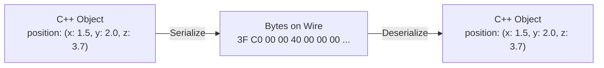
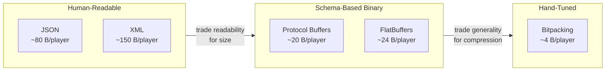
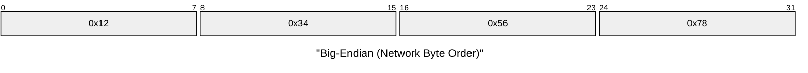
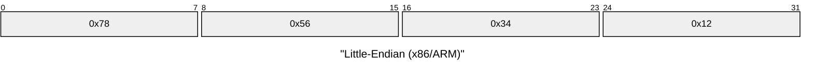
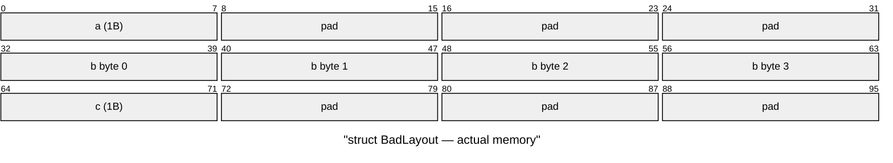
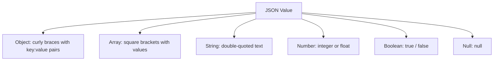
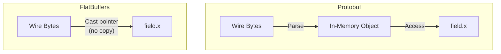
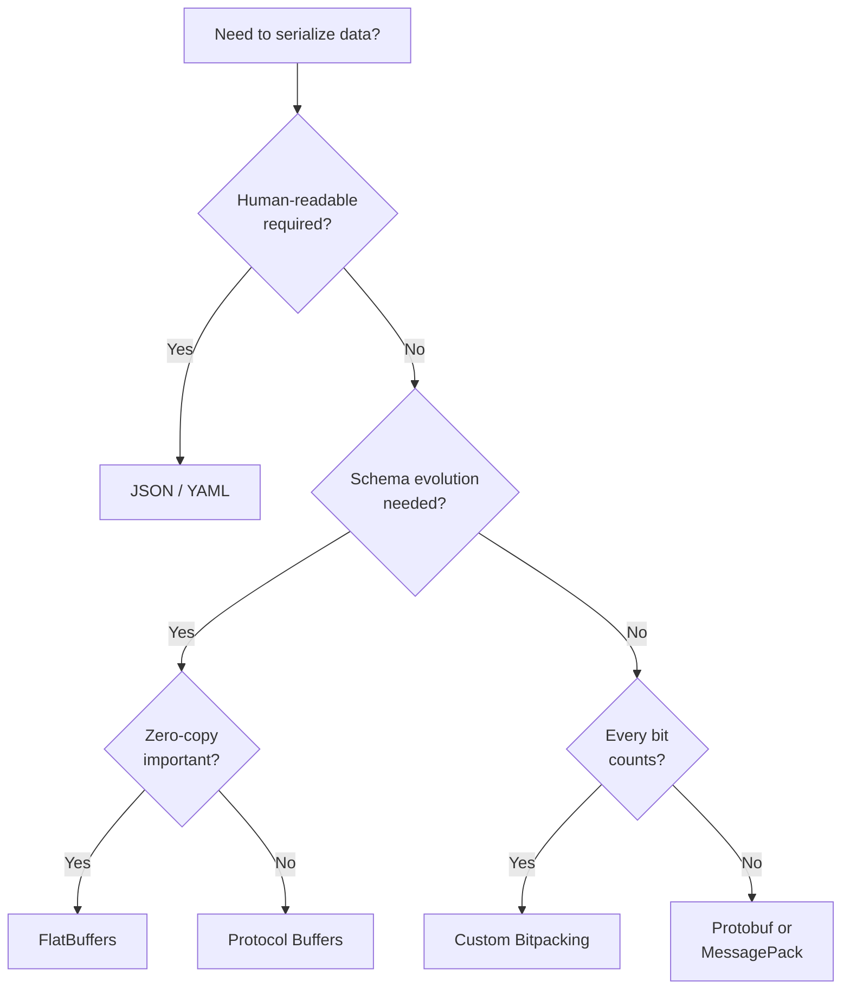

# Week 06: Serialization

---

## Today's Agenda

1. Why Serialization Matters
2. Endianness and Byte Order
3. Struct Packing and Alignment
4. Text Formats (JSON)
5. Binary Formats (Protobuf, FlatBuffers)
6. Custom Bitpacking
7. Compression Techniques
8. Performance Comparison

---

## Recap: Framing Tells Us Where Messages End

Last week we solved **message boundaries** with length-prefix framing.

Now we need to solve: **what goes inside the payload?**

How do we convert C++ objects into bytes and back?

---

## The Serialization Problem



**Serialization** = converting structured data to a flat byte sequence

**Deserialization** = reconstructing structured data from bytes

---

## Why Not Just memcpy the Struct?

```cpp
struct Player {
    uint32_t id;
    float x, y, z;
    uint16_t health;
};

// WRONG: Don't do this!
send(socket, &player, sizeof(Player));
```

Three problems:

1. **Endianness** differs between CPUs
2. **Padding** differs between compilers
3. **No versioning** — can't add fields later

---

## Problem 1: Endianness

Sender stores `uint32_t id = 42` as bytes `2A 00 00 00` (little-endian).

Receiver's CPU expects `00 00 00 2A` (big-endian).

**Receiver reads 704,643,072 instead of 42.**

Same bits, completely wrong number.

---

## Problem 2: Struct Padding

Compilers insert invisible padding bytes between struct fields.

Different compilers (or the same compiler with different flags) produce different layouts.

A 64-bit GCC sender writes 24 bytes. A 32-bit MSVC receiver expects 16.

**The receiver reads corrupted data.**

---

## Problem 3: No Versioning

You add a `uint8_t team;` field to `Player`.

Every existing client breaks immediately — they read the old format and get garbage.

There's no way to handle old-format messages gracefully with raw `memcpy`.

---

## The Serialization Spectrum



---

## The Solution: Explicit Serialization

Instead of `memcpy`, write explicit serialize/deserialize functions:

```cpp
std::vector<uint8_t> serialize(const Player& p) {
    std::vector<uint8_t> buf;
    buf.reserve(18); // 4 + 4 + 4 + 4 + 2

    auto append = [&buf](auto value) {
        auto net = boost::endian::native_to_big(value);
        const auto* ptr = reinterpret_cast<const uint8_t*>(&net);
        buf.insert(buf.end(), ptr, ptr + sizeof(net));
    };

    append(p.id);
    // *(uint32_t*)&p.x reads the float's raw bits as a uint32_t:
    //   &p.x       → address of the float
    //   (uint32_t*)→ treat that address as a pointer to uint32_t
    //   *          → dereference: read the 4 bytes as a uint32_t
    append(*(uint32_t*)&p.x);
    append(*(uint32_t*)&p.y);
    append(*(uint32_t*)&p.z);
    append(p.health);
    return buf;
}
```

C++20 alternative, less cryptic:

- `std::bit_cast<uint32_t>(my_float)`
- `std::bit_cast<float>(bits)`

---

## The Read/Write Mismatch Problem

Separate serialize and deserialize functions must stay perfectly in sync:

```cpp
// serialize.cpp — writes id, x, y, z, health
void write(Buffer& buf, const Player& p) {
    write_u32(buf, p.id);
    write_f32(buf, p.x);
    write_f32(buf, p.y);
    write_f32(buf, p.z);
    write_u16(buf, p.health);
}

// deserialize.cpp — OOPS: forgot to read y!
void read(Buffer& buf, Player& p) {
    p.id     = read_u32(buf);
    p.x      = read_f32(buf);
    // p.y   = read_f32(buf);  ← MISSING!
    p.z      = read_f32(buf);  // reads y's bytes → wrong
    p.health = read_u16(buf);  // reads z's bytes → wrong
}
```

Every field you add, remove, or reorder must be mirrored **exactly** in both functions. This is the #1 source of serialization bugs.

---

## Glenn Fiedler's Unified Pattern

Write **one** function that works for both reading and writing using C++ templates:

```cpp
template <typename Stream>
bool serialize(Stream& stream, Player& player) {
    serialize_uint32(stream, player.id);
    serialize_float(stream, player.x);
    serialize_float(stream, player.y);
    serialize_float(stream, player.z);
    serialize_uint16(stream, player.health);
    return true;
}
```

The **same code path** handles both directions — mismatch is impossible:

```cpp
WriteStream writer(buffer, bufferSize);
serialize(writer, player);  // template instantiates write version

ReadStream reader(buffer, bytesReceived);
serialize(reader, player);  // template instantiates read version
```

---

## How Does One Function Do Both?

`WriteStream` and `ReadStream` implement the same interface but do opposite things:

```cpp
class WriteStream {
public:
    void serialize_uint32(uint32_t& value) {
        write_bytes(&value, 4);  // writes value to buffer
    }
};

class ReadStream {
public:
    void serialize_uint32(uint32_t& value) {
        read_bytes(&value, 4);   // reads buffer into value
    }
};
```

The `serialize()` function calls `stream.serialize_uint32(player.id)`. When `Stream = WriteStream`, it writes. When `Stream = ReadStream`, it reads. **Same field order, guaranteed.**

This is the core pattern behind netcode in Overwatch, Rocket League, and Glenn Fiedler's [gaffer.on.games](https://gafferongames.com/) articles.

---

## Endianness: The Byte Order Problem

The integer `0x12345678` in memory:

| Byte Order    | Address 0 | Address 1 | Address 2 | Address 3 |
| ------------- | --------- | --------- | --------- | --------- |
| Big-endian    | `12`      | `34`      | `56`      | `78`      |
| Little-endian | `78`      | `56`      | `34`      | `12`      |

x86/x64/ARM = little-endian

Network standard = big-endian

---

## Endianness: Visual Layout





---

## Which Architectures Use What?

| Architecture       | Byte Order    | Examples                            |
| ------------------ | ------------- | ----------------------------------- |
| x86, x64           | Little-endian | Intel, AMD desktop/server CPUs      |
| ARM (default mode) | Little-endian | Mobile devices, Apple Silicon, RPi  |
| Network standard   | Big-endian    | TCP/IP headers (RFC 1700)           |
| PowerPC, SPARC     | Big-endian    | Older game consoles (PS3, Xbox 360) |

If a LE machine sends `uint32_t value = 1` as raw bytes, a BE machine reads **16,777,216**.

---

## Boost.Endian: Modern C++ Solution

```cpp
#include <boost/endian/conversion.hpp>

uint32_t value = 0x12345678;

// Convert to network byte order (big-endian)
uint32_t net = boost::endian::native_to_big(value);

// Convert back to host byte order
uint32_t host = boost::endian::big_to_native(net);
```

Alternatively, use `htonl`/`ntohl` for 32-bit integers, but Boost.Endian is more flexible and modern.

---

## Handling Floats: The Tricky Part

Floats also have endianness. Reinterpret as `uint32_t`, swap, transmit:

```cpp
void write_float(uint8_t* dest, float value) {
    *(uint32_t*)dest = boost::endian::native_to_big(*(uint32_t*)&value);
}

float read_float(const uint8_t* src) {
    uint32_t bits = boost::endian::big_to_native(*(const uint32_t*)src);
    return *(float*)&bits;
}
```

---

## Endianness: Common Mistakes

| Mistake                                   | Consequence                            |
| ----------------------------------------- | -------------------------------------- |
| Forgetting to convert before sending      | Receiver reads garbage values          |
| Converting twice (send + receive swap)    | Double-swap = correct only by accident |
| Using `htonl` on a `float`                | Wrong — `htonl` takes `uint32_t`       |
| Assuming all platforms are little-endian  | Breaks on PowerPC, big-endian ARM mode |
| Not converting length-prefix header bytes | Framing logic reads wrong message size |

---

## Struct Padding: The Hidden Bytes

```cpp
struct BadLayout {
    char a;      // 1 byte
    // 3 bytes padding!
    int32_t b;   // 4 bytes
    char c;      // 1 byte
    // 3 bytes padding!
};
// sizeof = 12, not 6!
```

The compiler inserts invisible bytes to satisfy CPU alignment requirements.

---

## Struct Padding: Memory Layout



6 bytes of data, 6 bytes of invisible padding = 12 bytes total.

---

## Alignment Rules

| Type      | Size    | Alignment | Rule                                 |
| --------- | ------- | --------- | ------------------------------------ |
| `char`    | 1 byte  | 1         | Can be placed anywhere               |
| `int16_t` | 2 bytes | 2         | Must start at even address           |
| `int32_t` | 4 bytes | 4         | Must start at address divisible by 4 |
| `int64_t` | 8 bytes | 8         | Must start at address divisible by 8 |
| `float`   | 4 bytes | 4         | Must start at address divisible by 4 |
| `double`  | 8 bytes | 8         | Must start at address divisible by 8 |

Rule of thumb: order fields from **largest to smallest** to minimize padding.

---

## Padding Varies Across Platforms

```cpp
struct CrossPlatform {
    char a;
    double b;
    char c;
};
```

| Platform          | sizeof | Layout                               |
| ----------------- | ------ | ------------------------------------ |
| x86-64 GCC/Clang  | 24     | a(1) + pad(7) + b(8) + c(1) + pad(7) |
| x86 MSVC (32-bit) | 16     | a(1) + pad(3) + b(8) + c(1) + pad(3) |
| ARM (packed mode) | 10     | a(1) + b(8) + c(1)                   |

Same struct definition, three different sizes. **`memcpy` breaks.**

---

## Optimizing Struct Layout

```cpp
// BAD: 24 bytes (wasted padding)
struct Bad {
    char a;       // 1 + 7 pad
    double b;     // 8
    char c;       // 1 + 7 pad
};

// GOOD: 16 bytes (minimal padding)
struct Good {
    double b;     // 8
    char a;       // 1
    char c;       // 1 + 6 pad
};
```

Order fields from **largest alignment to smallest**: `double` → `int64_t` → `float`/`int32_t` → `int16_t` → `char`.

---

## Don't Use `#pragma pack` for Networking

```cpp
#pragma pack(push, 1)
struct Packed {
    char a;       // 1 byte
    int32_t b;    // 4 bytes (NO padding before)
    char c;       // 1 byte
};
#pragma pack(pop)
// sizeof(Packed) == 6
```

Problems:

- **Slower** on x86 (unaligned access penalty)
- **Hardware fault** on some ARM configurations
- **Still doesn't fix endianness**

Use explicit serialization functions instead.

**Never send raw structs over the network.**

---

## Text Formats: JSON

```json
{
  "id": 42,
  "position": { "x": 1.5, "y": 2.0, "z": 3.7 },
  "health": 100
}
```

**Pros:** Human-readable, self-describing, universal

**Cons:** Verbose (~2-10× larger than binary), slow to parse, no fixed schema

**Use for:** Config files, REST APIs, debugging

**Avoid for:** 60 Hz game state updates

---

## JSON Value Types



Six types total. No comments, no trailing commas, must be UTF-8 (RFC 8259).

---

## JSON in C++: nlohmann/json

```cpp
#include <nlohmann/json.hpp>
using json = nlohmann::json;

// Serialize
json j;
j["id"] = 42;
j["position"] = {{"x", 1.5}, {"y", 2.0}, {"z", 3.7}};
j["health"] = 100;
std::string wire = j.dump();  // compact JSON

// Deserialize
json parsed = json::parse(wire);
uint32_t id = parsed["id"];
float x = parsed["position"]["x"];
```

---

## JSON: Size Problem

```
{"x":1.5,"y":2.0,"z":3.7}  = 27 bytes (text)
3 raw floats                = 12 bytes (binary)
3 × 10-bit bitpacked       =  4 bytes (bitpacked)
```

JSON is **7× larger** than bitpacked for the same data.

At 64 Hz with 20 players, that's the difference between 125 KB/s and 2 MB/s.

---

## Other Text Formats

| Format | Nesting | Types    | Readability | Use Case             |
| ------ | ------- | -------- | ----------- | -------------------- |
| JSON   | Yes     | 6 types  | Good        | APIs, interchange    |
| CSV    | No      | Strings  | Excellent   | Tabular data, export |
| XML    | Yes     | Strings  | Poor        | Legacy, SOAP         |
| YAML   | Yes     | Rich     | Excellent   | Config files         |
| TOML   | Limited | Explicit | Excellent   | Config files         |

- **Data interchange:** JSON
- **Config files:** TOML (simple) or YAML (complex)
- **Real-time network data:** None — use binary formats

---

## Binary Formats: Protocol Buffers

```protobuf
message Player {
    uint32 id = 1;
    float x = 2;
    float y = 3;
    float z = 4;
    uint32 health = 5;
}
```

- The numbers (`= 1`, `= 2`) are **field tags**, not default values
- They identify fields on the wire and must never change once deployed
- Schema evolution: add fields without breaking old clients

---

## Protobuf: Varints

Variable-length integer encoding, small values use fewer bytes (little-endian varint):

```
Value 1:       0_0000001                          → 1 byte
Value 127:     0_1111111                          → 1 byte
Value 128:     1_0000000  0_0000001               → 2 bytes
Value 300:     1_0101100  0_0000010               → 2 bytes
Value 16384:   1_0000000  1_0000000  0_0000001    → 3 bytes
               ↑                     ↑
               MSB=1: more           MSB=0: last byte
```

Each byte: 7 data bits + 1 continuation bit (MSB).

**MSB** = **Most Significant Bit** — the highest-order (leftmost) bit in a byte.

MSB = 1 → "more bytes follow." MSB = 0 → "last byte."

---

## Why Little-Endian Varint Order?

Varints send the **least significant** 7-bit group first. This lets the decoder accumulate the result with a simple shift-and-OR as bytes arrive — no need to know the total length in advance:

```cpp
uint32_t result = 0;
int shift = 0;
for (;;) {
    uint8_t byte = *ptr++;
    result |= (uint32_t(byte & 0x7F) << shift);  // OR into position
    if ((byte & 0x80) == 0) break;                // MSB=0 → done
    shift += 7;
}
```

Each new byte's 7 data bits slot into the **next higher** bit position. No buffering, no backtracking, no second pass — you build the integer incrementally as you read.

Big-endian varint order would require knowing the total byte count first (to compute the initial shift), or buffering all bytes before decoding. Little-endian order is simpler for both hardware and software decoders.

---

## Protobuf: Encoding 300 as a Varint

```
300 in binary:   0b100101100

Split into 7-bit groups:
    0000010    0101100

Add continuation bits:
  0_0000010  1_0101100

Reverse (little-endian varint order):
  1_0101100  0_0000010

Wire bytes: 0xAC  0x02
```

Only 2 bytes instead of 4 for a `uint32_t`.

---

## Varint Overhead: The 7/8 Tax

Each varint byte carries only 7 data bits (the 8th is the continuation flag). This means large values need **more** bytes than their fixed-width counterparts:

| Type       | Fixed Size | Max Value Varint Size   | Breakeven Point                        |
| ---------- | ---------- | ----------------------- | -------------------------------------- |
| `uint8_t`  | 1 byte     | 2 bytes (255)           | Values > 127 cost more                 |
| `uint16_t` | 2 bytes    | 3 bytes (65 535)        | Values > 16 383 cost more              |
| `uint32_t` | 4 bytes    | 5 bytes (4 294 967 295) | Values > 2 097 151 (21 bits) cost more |
| `uint64_t` | 8 bytes    | 10 bytes                | Values > 2^56 − 1 cost more            |

At the extremes, varints are **worse** — a `uint32_t` max value costs 5 bytes instead of 4.

---

## Why Varints Win Anyway

In practice, most integers are small:

```
 Value Range     │ Varint Bytes │ Fixed uint32 │ Savings  │ Typical Game Probability
─────────────────┼──────────────┼──────────────┼──────────┼─────────────────────────
 0     – 127     │ 1 byte       │ 4 bytes      │  75%     │ ~70%  (IDs, health, flags)
 128   – 16383   │ 2 bytes      │ 4 bytes      │  50%     │ ~20%  (positions, scores)
 16384 – 2097151 │ 3 bytes      │ 4 bytes      │  25%     │  ~8%  (timestamps, large coords)
 2097152+        │ 4-5 bytes    │ 4 bytes      │ 0 to -25%│  ~2%  (globally unique IDs)
```

Real-world data is heavily skewed toward small values:

- **Entity IDs** in a 100-player game: 0–99 → 1 byte (75% savings)
- **Array lengths**: usually < 100 → 1 byte
- **Health, ammo, team**: all < 128 → 1 byte
- **Deltas between frames**: usually ±small → 1-2 bytes (with ZigZag)

You pay 1 extra byte on rare max-value cases to save 2-3 bytes on the **common** case. Over thousands of fields per second, the savings compound massively.

---

## Protobuf: Tag-Value Encoding

Tag encodes field number + wire type: `tag = (field_number << 3) | wire_type`

The wire type tells the decoder how to read the value — **no separate length field** is needed for most types:

| Wire Type | Meaning | Size Known From            | Used For                       |
| --------- | ------- | -------------------------- | ------------------------------ |
| 0         | VARINT  | Self-delimiting (MSB=0)    | int32, uint32, bool, enum      |
| 1         | I64     | Always 8 bytes             | fixed64, double                |
| 2         | LEN     | **Length prefix (varint)** | string, bytes, nested messages |
| 5         | I32     | Always 4 bytes             | fixed32, float                 |

Only wire type 2 (LEN) uses the full Tag + Length + Value pattern. The others are just **Tag + Value** — the wire type itself tells the decoder how many bytes to consume.

---

## The Problem: Signed Integers in Varints

Varints encode **unsigned** integers efficiently: small values use few bytes.

But `int32 = -1` in two's complement is `0xFFFFFFFF` (all bits set) — varint treats this as a huge unsigned number:

```
-1 as uint32 = 4,294,967,295 → varint needs 5 bytes!
-2 as uint32 = 4,294,967,294 → varint needs 5 bytes!
```

Every negative `int32` costs **5 bytes** (the maximum for 32-bit varints) because the sign bit sets all upper bits to 1, leaving zero leading zeros for the encoder to skip.

Varints are an encoding — they don't know about signs. We need a **preprocessing step**.

---

## Why Negative Numbers Are Expensive

In two's complement, the sign bit fills all upper bits with 1s:

```
 Value   │ 32-bit Binary                          │ Leading 0s
─────────┼────────────────────────────────────────┼──────────
   1     │ 00000000 00000000 00000000 00000001    │ 31
   5     │ 00000000 00000000 00000000 00000101    │ 29
  -1     │ 11111111 11111111 11111111 11111111    │  0
  -2     │ 11111111 11111111 11111111 11111110    │  0
  -5     │ 11111111 11111111 11111111 11111011    │  0
```

Varints stop encoding when the remaining bits are all zero. Leading 0s = free compression.

**Negative numbers have zero leading 0s** → varint always uses the maximum 5-10 bytes.

---

## ZigZag: Maximizing Leading Zeros

ZigZag transforms signed values so that **small magnitudes** (positive or negative) always have many leading zeros:

```
 Value │ Two's Compl. (32-bit)               │ ZigZag │ ZigZag Binary                       │ Leading 0s
───────┼─────────────────────────────────────┼────────┼─────────────────────────────────────┼──────────
   0   │ 00000000 00000000 00000000 00000000 │    0   │ 00000000 00000000 00000000 00000000 │ 32
  -1   │ 11111111 11111111 11111111 11111111 │    1   │ 00000000 00000000 00000000 00000001 │ 31
   1   │ 00000000 00000000 00000000 00000001 │    2   │ 00000000 00000000 00000000 00000010 │ 30
  -2   │ 11111111 11111111 11111111 11111110 │    3   │ 00000000 00000000 00000000 00000011 │ 30
   2   │ 00000000 00000000 00000000 00000010 │    4   │ 00000000 00000000 00000000 00000100 │ 29
  -3   │ 11111111 11111111 11111111 11111101 │    5   │ 00000000 00000000 00000000 00000101 │ 29
   3   │ 00000000 00000000 00000000 00000011 │    6   │ 00000000 00000000 00000000 00000110 │ 29
```

The key insight: **small magnitude → small unsigned → many leading zeros → fewer varint bytes**.

Formula: `zigzag(n) = (n << 1) ^ (n >> 31)` (for 32-bit)

Reverse: `original(z) = (z >> 1) ^ -(z & 1)`

**Varint size caveat:** ZigZag maps `int32` → `uint32`, so the output can be up to $2^{32}-1$, which needs **5 varint bytes** ($\lceil 32/7 \rceil = 5$). To stay within 4 varint bytes (same cost as fixed `uint32`), you only get $4 \times 7 = 28$ data bits — max ZigZag output $2^{28}-1 = 268\,435\,455$. That covers signed values **−134,217,728 to +134,217,727** ($\pm 2^{27}$). Beyond that range, ZigZag + varint costs 5 bytes — one more than a fixed `uint32`.

---

## ZigZag + Varint: The Full Pipeline

```
Signed value → ZigZag transform → Varint encode → Wire bytes
```

| Signed Value | Without ZigZag (raw varint) | With ZigZag → Varint |
| ------------ | --------------------------- | -------------------- |
| `0`          | 1 byte                      | 1 byte               |
| `1`          | 1 byte                      | 1 byte               |
| `-1`         | **5 bytes**                 | 1 byte               |
| `63`         | 1 byte                      | 1 byte               |
| `-64`        | **5 bytes**                 | 1 byte               |
| `300`        | 2 bytes                     | 2 bytes              |
| `-300`       | **5 bytes**                 | 2 bytes              |

ZigZag saves **4 bytes per negative value** when magnitudes are small.

Protobuf uses `sint32`/`sint64` types for ZigZag; plain `int32` uses raw varint (wasteful for negatives).

---

## Protobuf: Encoded Size Example

```
Player { id=42, x=1.5, y=2.0, z=3.7, health=100 }
```

| Field     | Tag (1B) | Wire Type | Value Bytes | Total   |
| --------- | -------- | --------- | ----------- | ------- |
| id        | 0x08     | VARINT    | 0x2A (1B)   | 2B      |
| x         | 0x15     | I32       | 4 bytes     | 5B      |
| y         | 0x1D     | I32       | 4 bytes     | 5B      |
| z         | 0x25     | I32       | 4 bytes     | 5B      |
| health    | 0x28     | VARINT    | 0x64 (1B)   | 2B      |
| **Total** |          |           |             | **19B** |

No length field here — all fields are VARINT or I32, so the decoder knows the size from the wire type alone.

JSON `{"id":42,"x":1.5,"y":2.0,"z":3.7,"health":100}` = **49 bytes**. Protobuf = 2.6× smaller.

---

## Schema Evolution

Add fields without breaking old clients:

```protobuf
// Version 2
message Player {
    uint32 id     = 1;
    float  x      = 2;
    float  y      = 3;
    float  z      = 4;
    uint32 health = 5;
    string name   = 6;  // NEW — old clients skip unknown tag 6
}
```

Rules:

- **Never reuse** a field number
- **Never change** a field's wire type
- New fields must have default values (proto3: all do)

---

## FlatBuffers: Zero-Copy Reads

Protobuf requires a deserialization step. FlatBuffers reads **directly from the buffer**:



- No allocation during deserialization
- No parse time — just a pointer cast
- Buffer can be memory-mapped from a file
- Slightly larger than Protobuf for small messages (~36B vs ~19B)

---

## Self-Describing Binary Formats

| Format      | Description                       | Size vs JSON |
| ----------- | --------------------------------- | ------------ |
| MessagePack | "JSON but binary," maps directly  | ~30% smaller |
| CBOR        | RFC 8949, for IoT/constrained     | ~40% smaller |
| BSON        | MongoDB wire format, extends JSON | Similar size |

These include field names in the data (like JSON) but encode values in binary.

No schema required, but less compact than Protobuf.

---

## Custom Bitpacking: The Core Insight

If you know a value's range, you can calculate the minimum bits required:

$$\text{bits\_required}(\min, \max) = \lceil \log_2(\max - \min + 1) \rceil$$

| Value               | Range       | Bits Required | vs `float` (32 bits) |
| ------------------- | ----------- | ------------- | -------------------- |
| Health (0–100)      | 101 values  | 7 bits        | 4.6× savings         |
| Position X (0–1023) | 1024 values | 10 bits       | 3.2× savings         |
| Heading (0–359°)    | 360 values  | 9 bits        | 3.6× savings         |
| Team (0–3)          | 4 values    | 2 bits        | 16× savings          |
| Alive (bool)        | 2 values    | 1 bit         | 32× savings          |

---

## Bitpacking: Maximum Compression

Instead of 3 × `int` (96 bits) for position:

```
Position range: 0–1023 → needs 10 bits each
Total: 30 bits vs 96 bits = 3.2× compression
```

```cpp
void serialize(BitWriter& writer, const Position& pos) {
    writer.write_bits(pos.x, 10);  // 0–1023
    writer.write_bits(pos.y, 10);  // 0–1023
    writer.write_bits(pos.z, 10);  // 0–1023
}
```

Used by AAA games: Overwatch, Rocket League, Mortal Kombat

---

## The Problem: Bits Don't Fit Neatly Into Bytes

We want to write 10 bits, then 7 bits, then 9 bits — but we can only send **whole bytes**.

Naive approach: one byte per field → wastes the unused bits.

We need a way to **accumulate bits** across field boundaries and **emit bytes** only when we have 8+.

Solution: a **scratch register** — a 64-bit integer that acts as a staging area.

---

## The Scratch Register Technique

A `uint64_t` scratch holds pending bits. A counter tracks how many bits are live:

```
 scratch_ (64 bits)
┌──────────────────────────────────────────────────────┐
│  unused high bits  │  pending bits (scratch_bits_)   │
└──────────────────────────────────────────────────────┘
                     ↑ LSB side
```

**Write:** shift new value to `scratch_bits_` position, OR it in, bump counter.

**Drain:** while ≥ 8 bits pending, extract lowest byte → push to buffer, shift right by 8.

**Why 64 bits?** We may have up to 7 leftover bits + 32 new bits = 39 bits. A 64-bit register handles this without overflow.

---

## Scratch Register: Step-by-Step

Write `health = 42` (7 bits), then `heading = 180` (9 bits):

```
Step 1: write_bits(42, 7)     42 = 0b0101010
  scratch_ = 00000000 ... 00_0101010      scratch_bits_ = 7
  (7 < 8, no byte emitted yet)

Step 2: write_bits(180, 9)    180 = 0b010110100
  scratch_ = 00000000 ... 010110100_0101010  scratch_bits_ = 16
  (16 ≥ 8 → emit byte)
  emit 0x2A (0101010_0 from LSB)    scratch_ >>= 8   bits = 8
  (8 ≥ 8 → emit byte)
  emit 0x5A (01011010 from LSB)     scratch_ >>= 8   bits = 0
```

2 bytes emitted. 16 bits of data packed with **zero** wasted bits between fields.

---

## BitWriter: The Serializer

```cpp
class BitWriter {
public:
    void write_bits(uint32_t value, int bits) {
        assert(bits > 0 && bits <= 32);
        scratch_ |= (uint64_t(value) << scratch_bits_);
        scratch_bits_ += bits;
        while (scratch_bits_ >= 8) {
            buffer_.push_back(uint8_t(scratch_ & 0xFF));
            scratch_ >>= 8;
            scratch_bits_ -= 8;
        }
    }
    void write_bool(bool v) { write_bits(v ? 1 : 0, 1); }
    void flush() { /* push remaining scratch bits */ }

private:
    std::vector<uint8_t> buffer_;
    uint64_t scratch_ = 0;
    int scratch_bits_ = 0;
};
```

---

## BitReader: The Deserializer

```cpp
class BitReader {
public:
    BitReader(const uint8_t* data, size_t size)
        : data_(data), size_(size) {}

    uint32_t read_bits(int bits) {
        while (scratch_bits_ < bits && byte_offset_ < size_) {
            scratch_ |= uint64_t(data_[byte_offset_++])
                        << scratch_bits_;
            scratch_bits_ += 8;
        }
        uint32_t value = scratch_ & ((1ULL << bits) - 1);
        scratch_ >>= bits;
        scratch_bits_ -= bits;
        return value;
    }
    bool read_bool() { return read_bits(1) != 0; }

private:
    const uint8_t* data_;
    size_t size_, byte_offset_ = 0;
    uint64_t scratch_ = 0;
    int scratch_bits_ = 0;
};
```

---

## Bitpacking: Full Example

```cpp
// Serialize: 49 bits = 7 bytes
BitWriter writer;
writer.write_bits(player.x,       10);  // 0–1023
writer.write_bits(player.y,       10);  // 0–1023
writer.write_bits(player.z,       10);  // 0–1023
writer.write_bits(player.health,   7);  // 0–100
writer.write_bits(player.heading,  9);  // 0–359
writer.write_bits(player.team,     2);  // 0–3
writer.write_bool(player.alive);        // 1 bit
writer.flush();

// Deserialize: read in the SAME ORDER
BitReader reader(writer.data(), writer.size());
player.x       = reader.read_bits(10);
player.y       = reader.read_bits(10);
player.z       = reader.read_bits(10);
player.health  = reader.read_bits(7);
player.heading = reader.read_bits(9);
player.team    = reader.read_bits(2);
player.alive   = reader.read_bool();
```

---

## Glenn Fiedler's Unified Bitpacking

The same unified pattern, but now with **bit-level precision** — each field specifies its exact bit count:

```cpp
template <typename Stream>
bool serialize_player(Stream& stream, Player& player) {
    serialize_bits(stream, player.x,       10);  // 0–1023
    serialize_bits(stream, player.y,       10);  // 0–1023
    serialize_bits(stream, player.z,       10);  // 0–1023
    serialize_bits(stream, player.health,   7);  // 0–100
    serialize_bits(stream, player.heading,  9);  // 0–359
    serialize_bits(stream, player.team,     2);  // 0–3
    serialize_bool(stream, player.alive);         // 1 bit
    return true;  // total: 49 bits = 7 bytes
}
```

Usage is identical to the byte-level version:

```cpp
BitWriter writer(buffer, size);
serialize_player(writer, player);  // writes 49 bits

BitReader reader(buffer, received);
serialize_player(reader, player);  // reads 49 bits
```

Add a new field? **One line, one place.** No read/write mismatch possible.

---

## Compressed Floats

Full IEEE-754 floats use 32 bits, but game values have known ranges. **Quantize** the float to an integer:

```cpp
uint32_t compress_float(float value,
        float min_val, float max_val, int bits) {
    float normalized = (value - min_val)
                     / (max_val - min_val);  // [0, 1]
    uint32_t max_int = (1u << bits) - 1;
    return uint32_t(normalized * max_int + 0.5f);
}

float decompress_float(uint32_t compressed,
        float min_val, float max_val, int bits) {
    uint32_t max_int = (1u << bits) - 1;
    float normalized = float(compressed) / float(max_int);
    return min_val + normalized * (max_val - min_val);
}
```

Position in 100m × 100m: 10 bits per axis → $100 / (2^{10}-1) = 100/1023 \approx 9.8\text{cm}$ step size. 30 bits total vs 96 bits for 3 raw floats.

---

## Compressed Quaternions: Smallest Three

Quaternions: `(w, x, y, z)` where `w² + x² + y² + z² = 1`. Exploit the constraint:

1. Find the component with the largest absolute value
2. Store which component (2 bits — one of w, x, y, z)
3. Store the other three (they're in \[-0.707, 0.707\])
4. Reconstruct the largest from `w² + x² + y² + z² = 1`

**Size: 2 + 3 × 9 = 29 bits** vs 4 × 32 = 128 bits. **4.4× compression.**

Overwatch uses 9 bits per component. Precision error: ~0.06° — imperceptible in gameplay.

---

## Smallest Three: Worked Example (Encode)

Quaternion representing a 45° rotation around the Y axis:

$$q = (w, x, y, z) = (0.924, 0.0, 0.383, 0.0)$$

**Step 1 — Find the largest component:** $|w| = 0.924$ is the largest → store index `0` (2 bits).

**Step 2 — Drop `w`, keep the other three:** $x = 0.0,\; y = 0.383,\; z = 0.0$

Each is in $[-\frac{1}{\sqrt{2}}, \frac{1}{\sqrt{2}}] \approx [-0.707, 0.707]$.

**Step 3 — Quantize each to 9 bits** (512 steps over the range 1.414):

$$\text{encoded} = \left\lfloor \frac{v + 0.707}{1.414} \times 511 + 0.5 \right\rfloor$$

| Component | Value | Encoded (9 bits) | Binary      |
| --------- | ----- | ---------------- | ----------- |
| x         | 0.0   | 256              | `100000000` |
| y         | 0.383 | 394              | `110001010` |
| z         | 0.0   | 256              | `100000000` |

**Step 4 — Pack:** `[00][100000000][110001010][100000000]` = **29 bits total**.

**Step 5 — Reconstruct `w`:** $w = \sqrt{1 - x^2 - y^2 - z^2} = \sqrt{1 - 0 - 0.147 - 0} \approx 0.924$

---

## CRC32 Integrity Checksums

Append a 4-byte checksum after serialization to detect corruption:

```cpp
#include <boost/crc.hpp>

void append_crc(std::vector<uint8_t>& buffer) {
    boost::crc_32_type crc;
    crc.process_bytes(buffer.data(), buffer.size());
    uint32_t checksum = crc.checksum();
    const auto* p = reinterpret_cast<const uint8_t*>(&checksum);
    buffer.insert(buffer.end(), p, p + 4);
}

bool verify_crc(const uint8_t* data, size_t total_size) {
    if (total_size < 4) return false;
    boost::crc_32_type crc;
    crc.process_bytes(data, total_size - 4);
    uint32_t expected;
    std::memcpy(&expected, data + total_size - 4, 4);
    return crc.checksum() == expected;
}
```

CRC detects accidental corruption, **not** malicious tampering (use HMAC for that).

---

## Compression: The Pipeline


| Stage          | 100 players × 3 floats | Size   |
| -------------- | ---------------------- | ------ |
| Raw            | 100 × 12 bytes         | 1200 B |
| Delta encoding | ~30 changed × 12 bytes | 360 B  |
| Quantization   | 30 × 6 bytes           | 180 B  |
| Bitpacking     | 30 × 30 bits           | 113 B  |
| LZ4            | ~90 B                  | ~90 B  |

---

## Delta Encoding

Send the **difference** from the previous value, not the absolute:

```cpp
// Full state: position = {500, 300, 100}
// Previous:   position = {498, 300, 101}
// Delta:      position = {  2,   0,  -1}
```

Deltas are typically much smaller:

- Varints use fewer bytes (small deltas → 1-2 bytes)
- Many deltas are zero (unchanged → skip entirely)
- Overwatch: ~80% of fields unchanged per frame

---

## Delta Encoding: Code

```cpp
void serialize_delta(BitWriter& writer,
                     const Player& current,
                     const Player& previous) {
    uint32_t mask = 0;
    if (current.x != previous.x)           mask |= (1 << 0);
    if (current.y != previous.y)           mask |= (1 << 1);
    if (current.z != previous.z)           mask |= (1 << 2);
    if (current.health != previous.health) mask |= (1 << 3);

    writer.write_bits(mask, 4);  // which fields changed

    if (mask & (1 << 0)) writer.write_bits(current.x, 10);
    if (mask & (1 << 1)) writer.write_bits(current.y, 10);
    if (mask & (1 << 2)) writer.write_bits(current.z, 10);
    if (mask & (1 << 3)) writer.write_bits(current.health, 7);
}
```

If nothing changed: only 4 bits sent (the zero mask).

---

## Quantization

Reduce precision to use fewer bits. **Lossy** — you sacrifice precision for bandwidth:

```cpp
// 0.0–100.0 meters with 1cm precision
// 10,000 steps → 14 bits (vs 32 for float)
uint16_t quantize(float pos) {
    return uint16_t(pos * 100.0f + 0.5f);
}
float dequantize(uint16_t q) {
    return float(q) / 100.0f;
}
```

| Value        | Range      | Precision | Bits | vs Float |
| ------------ | ---------- | --------- | ---- | -------- |
| Map position | 0–4096m    | 10 cm     | 16   | 2×       |
| Velocity     | -50–50 m/s | 0.1 m/s   | 10   | 3.2×     |
| Angle        | 0–360°     | ~0.35°    | 10   | 3.2×     |
| Health       | 0–100      | 1 HP      | 7    | 4.6×     |

---

## Variable-Length Quantities (VLQ)

Same concept as protobuf varints, generalized:

| Value     | VLQ Bytes | uint32_t Bytes | Savings |
| --------- | --------- | -------------- | ------- |
| 0–127     | 1         | 4              | 75%     |
| 128–16383 | 2         | 4              | 50%     |
| 16384+    | 3+        | 4              | varies  |

Ideal for values that are **usually small** but occasionally large (array lengths, entity counts).

---

## General-Purpose Compressors

### LZ4: Speed-Optimized

```
Compression:   ~780 MB/s
Decompression: ~4,200 MB/s
Ratio:         ~2.1×
```

Decompression is nearly free. Ideal for real-time data.

### Zstandard (zstd): Ratio-Optimized

```
Compression:   ~500 MB/s (L1) – ~10 MB/s (L19)
Decompression: ~1,700 MB/s
Ratio:         ~2.8× (L1) – ~4.5× (L19)
```

Use lower levels for real-time data, higher for replays and asset bundles.

---

## When to Compress

| Use Case                     | Compressor    | Why                                       |
| ---------------------------- | ------------- | ----------------------------------------- |
| Real-time game packets       | LZ4 or none   | Decompression must be < 1ms               |
| Replay files                 | Zstandard     | Ratio > speed                             |
| Asset bundles / downloads    | Zstandard L19 | Best ratio, one-time decompression        |
| Already-bitpacked game state | Usually none  | Bitpacked data has little redundancy left |

If you've done thorough bitpacking, LZ4 may **increase** size (framing overhead on high-entropy data).

---

## Format Comparison

| Format           | Size (Player) | Parse Speed | Schema? | Human-Readable? |
| ---------------- | ------------- | ----------- | ------- | --------------- |
| JSON             | ~80 bytes     | Slow        | No      | Yes             |
| Protocol Buffers | ~20 bytes     | Fast        | Yes     | No              |
| FlatBuffers      | ~24 bytes     | Zero-copy   | Yes     | No              |
| Custom bitpack   | ~4 bytes      | Fastest     | Manual  | No              |

---

## Bandwidth at Scale

What does each format cost across 60-tick, 100-player server?

| Format    | Per-Player | Per-Tick (100p) | Per-Second (60 Hz) | Per-Minute |
| --------- | ---------- | --------------- | ------------------ | ---------- |
| JSON      | 80 B       | 8 KB            | 480 KB/s           | 28.1 MB    |
| Protobuf  | 20 B       | 2 KB            | 120 KB/s           | 7.0 MB     |
| FlatBuf   | 24 B       | 2.4 KB          | 144 KB/s           | 8.4 MB     |
| Bitpacked | 4 B        | 400 B           | 24 KB/s            | 1.4 MB     |

**20× bandwidth difference** between JSON and bitpacked. That difference defines your server costs.

---

## Decision Flowchart



---

## Deserialization Is an Attack Surface

Every byte from the network is **untrusted input**. A malicious or buggy peer can send:

- A varint that never terminates (MSB always 1) → infinite loop
- A string length of 2 GB → out-of-memory crash
- `health = 255` when max is 100 → game logic corruption
- A truncated message → read past buffer end → undefined behavior

Deserialization bugs are the #1 source of network security vulnerabilities (CVEs) in game servers.

---

## Defensive Deserialization: The Rules

1. **Bound every read** — never read past the buffer:

```cpp
uint32_t read_bits(int bits) {
    if (bits_read_ + bits > total_bits_)
        throw std::runtime_error("buffer overrun");
    // ... normal read ...
}
```

2. **Validate ranges** — reject values outside expected bounds:

```cpp
player.health = reader.read_bits(7);  // 0-127 raw
if (player.health > 100)
    return false;  // invalid: health max is 100
```

3. **Cap varint length** — stop after 5 bytes for uint32, 10 for uint64:

```cpp
for (int i = 0; i < 5; i++) {  // max 5 bytes for uint32
    uint8_t byte = *ptr++;
    result |= (uint32_t(byte & 0x7F) << shift);
    if ((byte & 0x80) == 0) return result;
    shift += 7;
}
throw std::runtime_error("varint too long");
```

4. **Cap string/array lengths** — reject before allocating.

---

## Fuzz Testing Your Deserializer

Feed random bytes to your deserializer. It should **never crash** — only return errors:

```cpp
// Fuzz test: 10,000 random buffers
std::mt19937 rng(42);
for (int i = 0; i < 10000; i++) {
    size_t len = rng() % 256;
    std::vector<uint8_t> garbage(len);
    for (auto& b : garbage) b = rng() % 256;

    BitReader reader(garbage.data(), garbage.size());
    PlayerState player{};
    // Must not crash — returning false is fine
    serialize_player(reader, player);
}
```

If any random input causes a crash, segfault, or infinite loop — you have a **security bug**.

Professional tools: [AFL](https://lcamtuf.coredump.cx/afl/), [libFuzzer](https://llvm.org/docs/LibFuzzer.html), [Honggfuzz](https://honggfuzz.dev/).

---

## Common Serialization Mistakes

| Mistake                              | Consequence               | Fix                            |
| ------------------------------------ | ------------------------- | ------------------------------ |
| `memcpy` struct to socket            | Padding/endian mismatches | Explicit serialize each field  |
| Trust deserialized data              | Crash, exploit            | Validate after deserialize     |
| Ignore version field                 | Can't update protocol     | Always include version/magic   |
| Float equality for delta compression | Missed updates            | Use epsilon or integer compare |
| Over-compress already-bitpacked data | Size increases (overhead) | Measure before adding LZ4      |
| Send full state every tick           | Bandwidth explosion       | Delta + change mask            |

---

## Serialization Checklist

Before shipping your netcode, verify:

- [ ] **Byte order:** All multibyte values converted (Boost.Endian)
- [ ] **No struct padding:** Fields serialized individually
- [ ] **Version field:** Magic number + version in packet header
- [ ] **Validation:** Bounds-check every deserialized value
- [ ] **Delta encoding:** Only send what changed
- [ ] **Quantization:** Precision matched to gameplay needs
- [ ] **Bit budget:** Measured bits per entity per tick
- [ ] **Compression:** Measured whether LZ4 actually helps _your_ data
- [ ] **Checksums:** CRC32 on all packets
- [ ] **Fuzz testing:** Random bytes don't crash deserializer

---

## Key Takeaways

1. **Never `memcpy` structs** to the network — padding and endianness break portability
2. **Boost.Endian** for byte order conversion — replaces legacy `htonl`/`ntohl`
3. **JSON** for human-readable interchange; **binary** for performance
4. **Protocol Buffers** when you need schema evolution and industry tooling
5. **Custom bitpacking** when every bit counts (real-time games)
6. **Always validate** deserialized data — never trust the wire

---

## The Serialization Spectrum


**Human-Friendly** &larr;&mdash;&mdash;&mdash;&mdash;&mdash;&mdash;&mdash;&mdash;&mdash;&rarr; **Machine-Friendly**

Choose the **simplest format** that meets your bandwidth and latency requirements.
Move right only when measurements prove you must.
