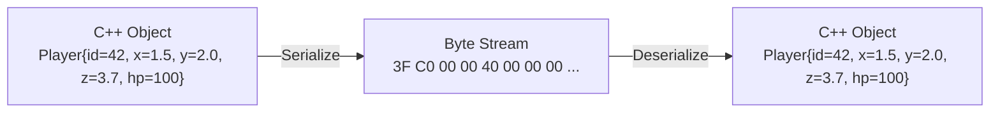
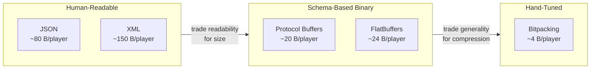

# Why Serialization Matters

Last week we solved **message framing** — how to find message boundaries in TCP's byte stream. Now we face the next question: **what goes inside the payload?**

Serialization is the process of converting in-memory data structures into a flat sequence of bytes suitable for transmission (or storage), and deserialization is the reverse.



## The Naive Approach: Why memcpy Fails

The tempting shortcut is to treat a struct as raw bytes:

```cpp
struct Player {
    uint32_t id;
    float x, y, z;
    uint16_t health;
};

Player player{42, 1.5f, 2.0f, 3.7f, 100};

// WRONG: Don't do this!
send(socket, &player, sizeof(Player));
```

This seems to work when sender and receiver are the same machine, but it has **three fatal problems**:

### Problem 1: Endianness

The sender's CPU might store `uint32_t id = 42` as `2A 00 00 00` (little-endian), but the receiver's CPU expects `00 00 00 2A` (big-endian). The receiver reads 704,643,072 instead of 42.

### Problem 2: Struct Padding

Compilers insert invisible padding bytes to satisfy CPU alignment requirements. Different compilers (or the same compiler with different flags) produce different layouts for the same struct definition.

### Problem 3: No Versioning

If you add a field to the struct, every existing client breaks immediately. There's no way to handle old-format messages gracefully.

::: danger "Never send raw structs over the network"

Even if sender and receiver use the same platform today, your protocol will break when:

- You compile for a different architecture (x86 → ARM)
- You upgrade the compiler or change optimization flags
- You add, remove, or reorder struct fields
- A client runs an older version of your software

Always use **explicit serialization** that handles byte order, ignores padding, and supports versioning.

:::

## The Serialization Spectrum

There's no single "best" serialization format. The right choice depends on your requirements:



| Requirement           | Best Fit                           |
| --------------------- | ---------------------------------- |
| Human debugging       | JSON, YAML                         |
| Cross-language RPC    | Protocol Buffers, gRPC             |
| Zero-copy performance | FlatBuffers, Cap'n Proto           |
| Minimum bandwidth     | Custom bitpacking                  |
| Schema evolution      | Protocol Buffers, Avro             |
| Config files          | JSON, TOML, YAML                   |
| 60 Hz game state      | Custom bitpacking + delta encoding |

## Explicit Serialization Pattern

Instead of `memcpy`, write explicit serialize/deserialize functions:

```cpp
#include <boost/endian/conversion.hpp>
#include <vector>
#include <cstdint>
#include <cstring>

struct Player {
    uint32_t id;
    float x, y, z;
    uint16_t health;
};

// Serialize: C++ object → bytes
std::vector<uint8_t> serialize(const Player& p) {
    std::vector<uint8_t> buf;
    buf.reserve(18); // 4 + 4 + 4 + 4 + 2

    // Helper: append value in network byte order
    auto append = [&buf](auto value) {
        auto net = boost::endian::native_to_big(value);
        const auto* ptr = reinterpret_cast<const uint8_t*>(&net);
        buf.insert(buf.end(), ptr, ptr + sizeof(net));
    };

    append(p.id);
    // *(uint32_t*)&p.x reads the float's raw bits as a uint32_t:
    //   &p.x       → address of the float
    //   (uint32_t*)→ treat that address as a pointer to uint32_t
    //   *          → dereference: read the 4 bytes as a uint32_t
    append(*(uint32_t*)&p.x);
    append(*(uint32_t*)&p.y);
    append(*(uint32_t*)&p.z);
    append(p.health);
    return buf;
}

// Deserialize: bytes → C++ object
Player deserialize(const uint8_t* data) {
    Player p;
    size_t offset = 0;

    auto read = [&data, &offset](auto& value) {
        std::memcpy(&value, data + offset, sizeof(value));
        value = boost::endian::big_to_native(value);
        offset += sizeof(value);
    };

    read(p.id);

    uint32_t fx, fy, fz;
    read(fx); read(fy); read(fz);
    p.x = *(float*)&fx;
    p.y = *(float*)&fy;
    p.z = *(float*)&fz;

    read(p.health);
    return p;
}
```

::: tip "Key properties of explicit serialization"

1. **Deterministic layout** — byte positions are defined by your code, not the compiler
2. **Portable byte order** — always big-endian on the wire (network byte order)
3. **No padding** — you write exactly the fields you need, no gaps
4. **Extensible** — add version tags or field counts to support evolution

:::

## Unified Read/Write Functions (Glenn Fiedler's Pattern)

Glenn Fiedler's key insight: write **one** serialize function that works for both reading and writing. A `Stream` object abstracts the direction:

```cpp
template <typename Stream>
bool serialize(Stream& stream, Player& player) {
    serialize_uint32(stream, player.id);
    serialize_float(stream, player.x);
    serialize_float(stream, player.y);
    serialize_float(stream, player.z);
    serialize_uint16(stream, player.health);
    return true;
}

// Usage:
WriteStream writer(buffer, bufferSize);
serialize(writer, player);  // writes to buffer

ReadStream reader(buffer, bytesReceived);
serialize(reader, player);  // reads from buffer
```

This eliminates the most common serialization bug: **read/write mismatch** where the serialize and deserialize functions get out of sync.
