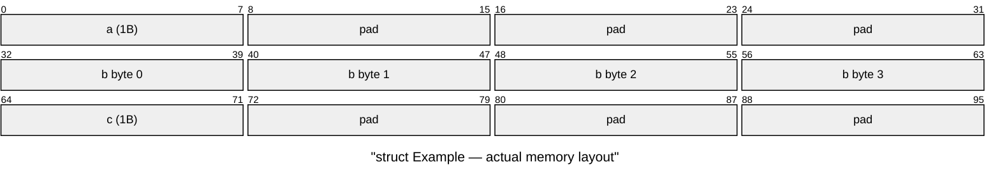

# Struct Packing and Alignment

## The Alignment Problem

CPUs access memory most efficiently when data is **naturally aligned** — a 4-byte `int` at an address divisible by 4, an 8-byte `double` at an address divisible by 8. To enforce this, compilers insert invisible **padding bytes** between struct fields.

```cpp
struct Example {
    char a;       // 1 byte  (offset 0)
    // 3 bytes padding!       (offset 1-3)
    int32_t b;    // 4 bytes (offset 4)
    char c;       // 1 byte  (offset 8)
    // 3 bytes padding!       (offset 9-11)
};
// sizeof(Example) == 12, not 6!
```



## Alignment Rules

Each type has a **natural alignment** equal to its size (with some exceptions):

| Type      | Size    | Alignment    | Rule                                        |
| --------- | ------- | ------------ | ------------------------------------------- |
| `char`    | 1 byte  | 1            | Can be placed anywhere                      |
| `int16_t` | 2 bytes | 2            | Must start at even address                  |
| `int32_t` | 4 bytes | 4            | Must start at address divisible by 4        |
| `int64_t` | 8 bytes | 8            | Must start at address divisible by 8        |
| `float`   | 4 bytes | 4            | Must start at address divisible by 4        |
| `double`  | 8 bytes | 8            | Must start at address divisible by 8        |
| `struct`  | varies  | max(members) | Struct alignment = largest member alignment |

The compiler also adds **tail padding** so that arrays of structs maintain alignment:

```cpp
struct Tail {
    int32_t a;   // 4 bytes (offset 0)
    char b;      // 1 byte  (offset 4)
    // 3 bytes tail padding   (offset 5-7)
};
// sizeof(Tail) == 8 — ensures Tail[1].a is aligned
```

## Why Padding Varies Across Platforms

Different compilers and platforms produce different layouts for the **same** struct definition:

```cpp
struct CrossPlatform {
    char a;
    double b;
    char c;
};
```

| Platform          | sizeof | Layout                               |
| ----------------- | ------ | ------------------------------------ |
| x86-64 GCC/Clang  | 24     | a(1) + pad(7) + b(8) + c(1) + pad(7) |
| x86 MSVC (32-bit) | 16     | a(1) + pad(3) + b(8) + c(1) + pad(3) |
| ARM (packed mode) | 10     | a(1) + b(8) + c(1)                   |

::: danger "This is why memcpy of structs breaks networking"

If you `memcpy` a struct from a 64-bit GCC sender (24 bytes) and the receiver is 32-bit MSVC (16 bytes), the receiver reads corrupted data. Even same-platform serialization breaks if you recompile with different flags.

:::

## Inspecting Struct Layout

### Using `offsetof` and `sizeof`

```cpp
#include <cstddef>
#include <cstdint>
#include <iostream>

struct Player {
    uint32_t id;
    float x, y, z;
    uint16_t health;
};

int main() {
    std::cout << "sizeof(Player): " << sizeof(Player) << "\n";
    std::cout << "offsetof(id):     " << offsetof(Player, id) << "\n";
    std::cout << "offsetof(x):      " << offsetof(Player, x) << "\n";
    std::cout << "offsetof(y):      " << offsetof(Player, y) << "\n";
    std::cout << "offsetof(z):      " << offsetof(Player, z) << "\n";
    std::cout << "offsetof(health): " << offsetof(Player, health) << "\n";
}
```

Typical x86-64 output:

```
sizeof(Player): 20
offsetof(id):     0
offsetof(x):      4
offsetof(y):      8
offsetof(z):      12
offsetof(health): 16
```

Note: `sizeof(Player)` is 20, not 18 (4+4+4+4+2). The compiler adds 2 bytes of tail padding after `health` to satisfy 4-byte alignment of the struct.

### Using `xxd` to See Real Bytes

Write a struct to a file and inspect with `xxd`:

```cpp
#include <fstream>

Player p{42, 1.5f, 2.0f, 3.7f, 100};
std::ofstream out("player.bin", std::ios::binary);
out.write(reinterpret_cast<const char*>(&p), sizeof(p));
```

```bash
$ xxd player.bin
00000000: 2a00 0000 0000 c03f 0000 0040 cdcc 6c40  *......?...@..l@
00000010: 6400 0000                                  d...
```

Notice the `0000` bytes after `2a` — that's the little-endian representation of `42` and the padding.

## C++11: `alignof` and `alignas`

```cpp
// Query alignment requirement
static_assert(alignof(int32_t) == 4);
static_assert(alignof(double) == 8);

// Force custom alignment
struct alignas(16) SimdFriendly {
    float data[4];
};
// sizeof(SimdFriendly) == 16, aligned to 16-byte boundary
```

## Optimizing Struct Layout

Reorder fields from largest to smallest alignment to minimize padding:

```cpp
// BAD: 24 bytes (wasted padding)
struct Bad {
    char a;       // 1 + 7 pad
    double b;     // 8
    char c;       // 1 + 7 pad
};

// GOOD: 16 bytes (minimal padding)
struct Good {
    double b;     // 8
    char a;       // 1
    char c;       // 1 + 6 pad
};
```

::: tip "Rule of thumb for struct layout"

Order fields from **largest alignment to smallest**: `double` → `int64_t` → `float`/`int32_t` → `int16_t` → `char`. This minimizes internal padding.

:::

## `#pragma pack` — Force-Removing Padding

You can tell the compiler to eliminate padding:

```cpp
#pragma pack(push, 1)
struct Packed {
    char a;       // 1 byte
    int32_t b;    // 4 bytes (NO padding before)
    char c;       // 1 byte
};
#pragma pack(pop)
// sizeof(Packed) == 6
```

::: warning "Don't use #pragma pack for networking"

While `#pragma pack(1)` removes padding, it creates **unaligned access** which is:

- Slower on x86 (up to 2× penalty)
- A **hardware fault** on some ARM configurations
- Still doesn't fix endianness

Use explicit serialization functions instead.

:::

## The Correct Approach: Explicit Serialization

Instead of fighting the compiler's layout rules, **ignore them entirely** and write/read fields explicitly:

```cpp
// Wire format: exactly 18 bytes, always, on every platform
// [id: 4B BE][x: 4B BE][y: 4B BE][z: 4B BE][health: 2B BE]

size_t serialize_player(uint8_t* dest, const Player& p) {
    size_t offset = 0;

    auto write = [&](auto val) {
        auto be = boost::endian::native_to_big(val);
        std::memcpy(dest + offset, &be, sizeof(be));
        offset += sizeof(be);
    };

    write(p.id);
    write(std::bit_cast<uint32_t>(p.x));
    write(std::bit_cast<uint32_t>(p.y));
    write(std::bit_cast<uint32_t>(p.z));
    write(p.health);

    return offset; // always 18
}
```

This produces the **same 18 bytes** regardless of compiler, platform, or optimization flags.
