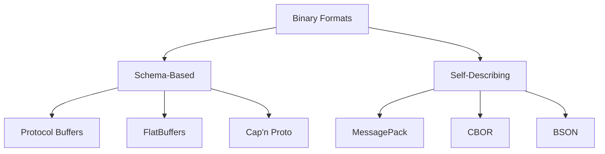
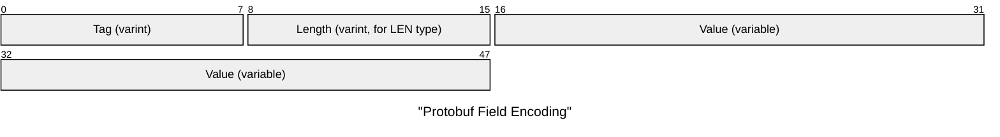
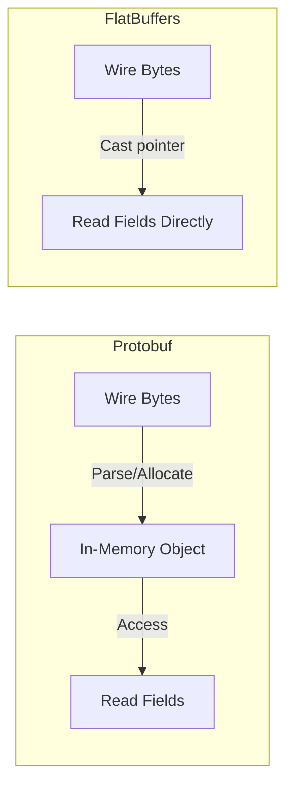

# Binary Serialization Formats

Binary formats encode data as compact byte sequences rather than human-readable text. They fall into two categories:



| Category        | Requires `.proto` / `.fbs`? | Includes field names? | Compact? |
| --------------- | --------------------------- | --------------------- | -------- |
| Schema-based    | Yes                         | No (field tags only)  | Very     |
| Self-describing | No                          | Yes (keys in data)    | Moderate |

## Protocol Buffers (Protobuf)

Google's schema-based format, the most widely used binary serialization in industry.

### Defining a Schema

```protobuf
syntax = "proto3";

message Player {
    uint32 id     = 1;  // field tag 1
    float  x      = 2;  // field tag 2
    float  y      = 3;
    float  z      = 4;
    uint32 health = 5;
}
```

The numbers (`= 1`, `= 2`) are **field tags**, not default values. They identify fields on the wire and must never change once deployed.

### Wire Encoding: Varints

Protobuf's core innovation is **variable-length integer encoding** (varints). Small values use fewer bytes:

```
Value 1:    0x01                    → 1 byte
Value 127:  0x7F                    → 1 byte
Value 128:  0x80 0x01               → 2 bytes
Value 300:  0xAC 0x02               → 2 bytes
Value 16383: 0xFF 0x7F              → 2 bytes
Value 16384: 0x80 0x80 0x01         → 3 bytes
```

**How varints work:**

- Each byte uses 7 bits for data and 1 bit (MSB) as a continuation flag
- MSB = 1 means "more bytes follow"; MSB = 0 means "this is the last byte"

```
300 in binary: 100101100
Split into 7-bit groups: 0000010  0101100
Add continuation bits:   00000010 10101100
Reverse (little-endian): 10101100 00000010
Wire bytes:              0xAC     0x02
```

### Wire Encoding: Tag-Length-Value (TLV)

Each field is encoded as:



The **tag** encodes both the field number and the wire type:

```
tag = (field_number << 3) | wire_type
```

| Wire Type | Meaning | Used For                       |
| --------- | ------- | ------------------------------ |
| 0         | VARINT  | int32, uint32, bool, enum      |
| 1         | I64     | fixed64, double                |
| 2         | LEN     | string, bytes, nested messages |
| 5         | I32     | fixed32, float                 |

### ZigZag Encoding for Signed Integers

Negative numbers as varints would always use 10 bytes (max varint length). ZigZag maps signed integers to unsigned:

```
 0 → 0
-1 → 1
 1 → 2
-2 → 3
 2 → 4
...
```

Formula: `zigzag(n) = (n << 1) ^ (n >> 31)` (for 32-bit)

This ensures small negative values also use few bytes: `-1` → `1` → 1 byte.

### Protobuf Example: Encoded Size

```protobuf
Player { id=42, x=1.5, y=2.0, z=3.7, health=100 }
```

| Field     | Tag  | Wire Type | Value Bytes | Total   |
| --------- | ---- | --------- | ----------- | ------- |
| id        | 0x08 | VARINT    | 0x2A (1B)   | 2B      |
| x         | 0x15 | I32       | 4 bytes     | 5B      |
| y         | 0x1D | I32       | 4 bytes     | 5B      |
| z         | 0x25 | I32       | 4 bytes     | 5B      |
| health    | 0x28 | VARINT    | 0x64 (1B)   | 2B      |
| **Total** |      |           |             | **19B** |

Compare: JSON `{"id":42,"x":1.5,"y":2.0,"z":3.7,"health":100}` = **49 bytes**.

### Schema Evolution

Protobuf's key advantage: you can add fields without breaking old clients.

```protobuf
// Version 2 — add a name field
message Player {
    uint32 id     = 1;
    float  x      = 2;
    float  y      = 3;
    float  z      = 4;
    uint32 health = 5;
    string name   = 6;  // NEW — old clients simply skip unknown tag 6
}
```

Rules for safe evolution:

- **Never reuse** a field number
- **Never change** a field's wire type
- New fields must have default values (proto3: all fields have defaults)

## FlatBuffers

Google's zero-copy serialization format, designed for game engines.

### Key Difference from Protobuf

Protobuf requires a **deserialization step** — parsing wire bytes into an in-memory object. FlatBuffers data can be read **directly from the buffer** without parsing:



This means:

- **No allocation** during deserialization
- **No parse time** — just a pointer cast
- Buffer can be memory-mapped from a file
- Ideal for large data with selective field access

### FlatBuffers Schema

```flatbuffers
table Player {
    id:uint;
    x:float;
    y:float;
    z:float;
    health:ushort;
}
```

### FlatBuffers Internal Structure

Data is accessed via **vtables** and **offsets**:

```
Buffer layout:
┌──────────┬──────────┬───────────────────┐
│  vtable  │ offsets  │    field data      │
└──────────┴──────────┴───────────────────┘

vtable maps field_id → offset into data region
Reading field: buffer[vtable[field_id] + object_offset]
```

The vtable overhead means FlatBuffers is slightly larger than Protobuf for small messages, but the zero-copy access makes it faster for large or frequently-accessed data.

## Self-Describing Binary Formats

These formats include type information in the data itself, similar to JSON but in binary:

### MessagePack

"Like JSON, but binary." Maps directly to JSON types:

```
JSON:        {"id": 42, "health": 100}
MessagePack: 82 A2 69 64 2A A6 68 65 61 6C 74 68 64
             ^^                                       (map with 2 entries)
                ^^ ^^^^                               ("id" as fixstr)
                         ^^                            (42 as positive fixint)
```

~30% smaller than JSON, much faster to parse, but field names are still in the data.

### CBOR (RFC 8949)

Concise Binary Object Representation — designed for constrained environments (IoT):

- Self-describing like JSON
- More compact than MessagePack
- Supports binary data, tags, and indefinite-length items
- IETF standard (RFC 8949)

### BSON

Binary JSON — MongoDB's wire format:

- Extends JSON with types: binary data, dates, ObjectId, regex
- Not more compact than JSON (includes field names + type bytes)
- Optimized for fast traversal, not minimal size

## Format Comparison

| Format           | Schema | Field Names on Wire | Zero-Copy | Schema Evolution | Best For                  |
| ---------------- | ------ | ------------------- | --------- | ---------------- | ------------------------- |
| Protocol Buffers | Yes    | No (tags only)      | No        | Excellent        | RPC, microservices        |
| FlatBuffers      | Yes    | No (vtable)         | **Yes**   | Good             | Games, mobile, large data |
| Cap'n Proto      | Yes    | No                  | **Yes**   | Good             | High-perf IPC             |
| MessagePack      | No     | Yes                 | No        | N/A              | JSON replacement          |
| CBOR             | No     | Yes                 | No        | N/A              | IoT, constrained devices  |
| BSON             | No     | Yes                 | No        | N/A              | MongoDB                   |

::: tip "Choosing a binary format"

- **Cross-language microservices:** Protocol Buffers + gRPC
- **Game engine data:** FlatBuffers (zero-copy, fast access)
- **Drop-in JSON replacement:** MessagePack
- **IoT / embedded:** CBOR
- **Real-time game state at 60 Hz:** Custom bitpacking (next section)

:::
