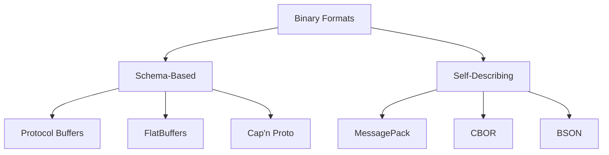
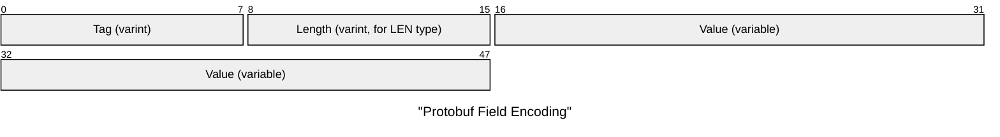
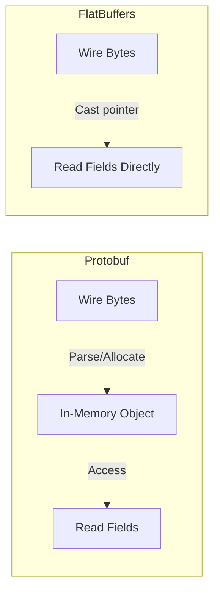

# Binary Serialization Formats

Binary formats encode data as compact byte sequences rather than human-readable text. They fall into two categories:



| Category        | Requires `.proto` / `.fbs`? | Includes field names? | Compact? |
| --------------- | --------------------------- | --------------------- | -------- |
| Schema-based    | Yes                         | No (field tags only)  | Very     |
| Self-describing | No                          | Yes (keys in data)    | Moderate |

## Protocol Buffers (Protobuf)

Google's schema-based format, the most widely used binary serialization in industry.

### Defining a Schema

```protobuf
syntax = "proto3";

message Player {
    uint32 id     = 1;  // field tag 1
    float  x      = 2;  // field tag 2
    float  y      = 3;
    float  z      = 4;
    uint32 health = 5;
}
```

The numbers (`= 1`, `= 2`) are **field tags**, not default values. They identify fields on the wire and must never change once deployed.

### Wire Encoding: Varints

Protobuf's core innovation is **variable-length integer encoding** (varints). Small values use fewer bytes (little-endian varint):

```
Value 1:       0_0000001                          → 1 byte
Value 127:     0_1111111                          → 1 byte
Value 128:     1_0000000  0_0000001               → 2 bytes
Value 300:     1_0101100  0_0000010               → 2 bytes
Value 16384:   1_0000000  1_0000000  0_0000001    → 3 bytes
               ↑                     ↑
               MSB=1: more           MSB=0: last byte
```

**How varints work:**

- Each byte uses 7 bits for data and 1 bit (MSB) as a continuation flag
- **MSB** = **Most Significant Bit** — the highest-order (leftmost) bit in a byte
- MSB = 1 means "more bytes follow"; MSB = 0 means "this is the last byte"

```
300 in binary:   0b100101100

Split into 7-bit groups:
  0000010   0101100

Add continuation bits:
  00000010  10101100

Reverse (little-endian varint order):
  10101100  00000010

Wire bytes: 0xAC  0x02
```

#### Varint Encoding (C++)

The encoder extracts 7 bits at a time from the least-significant end, sets MSB = 1 on every byte except the last:

```cpp
// buff points to the buffer at the position where the varint should be written
// this asumes uint32_t, if you need to encode uint64_t, you know what to do
int encode_varint(uint32_t value, uint8_t* buf) {
    int len = 0;
    // this assumes the buffer is large enough to hold the varint (up to 5 bytes for uint32_t)
    // this assumption may lead to buffer overflow if the caller does not ensure sufficient space
    while (value > 0x7F) {
        buf[len++] = (value & 0x7F) | 0x80;  // 7 data bits + MSB=1 (more follow)
        value >>= 7;
    }
    buf[len++] = value & 0x7F;               // last byte: MSB=0 (done)
    return len;
}
```

Step-by-step for `value = 300` (`0b100101100`):

```
Iteration 1:  value = 300 (> 127, so emit with MSB=1)
  300 & 0x7F = 0x2C  →  0x2C | 0x80 = 0xAC  →  buf[0] = 0xAC
  300 >> 7   = 2
Iteration 2:  value = 2   (≤ 127, so emit with MSB=0)
  buf[1] = 0x02
Result: [0xAC, 0x02]  →  2 bytes
```

### Why Little-Endian Varint Order?

Varints send the **least significant** 7-bit group first. This lets the decoder accumulate the result with a simple shift-and-OR as bytes arrive — no need to know the total length in advance:

#### Varint Decoding (C++)

```cpp
// buf points to the buffer at the position where the varint should be read
// the buf pointer is incremented, so the caller will have the pointer advanced past the varint after decoding
// this assumes uint32_t, if you need to decode uint64_t, eat your vegetables
uint32_t decode_varint(const uint8_t*& buf) {
    uint32_t result = 0;
    int shift = 0;
    // this has potential to keep reading ad infinitum if the data arriving always has MSB=1
    for (;;) {
        uint8_t byte = *buf++;
        result |= (uint32_t(byte & 0x7F) << shift);  // OR into position
        if ((byte & 0x80) == 0) break;                // MSB=0 → done
        shift += 7;
    }
    return result;
}
```

Each new byte's 7 data bits slot into the **next higher** bit position. No buffering, no backtracking, no second pass — you build the integer incrementally as you read.

Big-endian varint order would require knowing the total byte count first (to compute the initial shift), or buffering all bytes before decoding. Little-endian order is simpler for both hardware and software decoders.

### Varint Overhead: The 7/8 Tax

Each varint byte carries only 7 data bits (the 8th is the continuation flag). This means large values need **more** bytes than their fixed-width counterparts:

| Type       | Fixed Size | Max Value Varint Size         | Breakeven Point                        |
| ---------- | ---------- | ----------------------------- | -------------------------------------- |
| `uint8_t`  | 1 byte     | 2 bytes (255)                 | Values > 127 cost more                 |
| `uint16_t` | 2 bytes    | 3 bytes (65 535)              | Values > 16 383 cost more              |
| `uint32_t` | 4 bytes    | 5 bytes (4 294 967 295)       | Values > 2 097 151 (21 bits) cost more |
| `uint64_t` | 8 bytes    | 10 bytes                      | Values > 2^56 − 1 cost more            |
| `int32_t`  | 4 bytes    | 10 bytes (−1 without ZigZag!) | Any negative without ZigZag costs more |

At the extremes, varints are **worse** — a `uint32_t` max value costs 5 bytes instead of 4.

### Why Varints Win Anyway

In practice, most integers are small:

| Value Range        | Varint Bytes | Fixed uint32 | Savings |
| ------------------ | ------------ | ------------ | ------- |
| 0 – 127            | 1 byte       | 4 bytes      | 75%     |
| 128 – 16 383       | 2 bytes      | 4 bytes      | 50%     |
| 16 384 – 2 097 151 | 3 bytes      | 4 bytes      | 25%     |
| 2 097 152+         | 4-5 bytes    | 4 bytes      | -0–25%  |

Real-world data is heavily skewed toward small values:

- **Entity IDs** in a 100-player game: 0–99 → 1 byte (75% savings)
- **Array lengths**: usually < 100 → 1 byte
- **Health, ammo, team**: all < 128 → 1 byte
- **Deltas between frames**: usually ±small → 1-2 bytes (with ZigZag)

You pay 1 extra byte on rare max-value cases to save 2-3 bytes on the **common** case. Over thousands of fields per second, the savings compound massively.

### Wire Encoding: Tag-Length-Value (TLV)

Each field is encoded as:



The **tag** encodes both the field number and the wire type:

```
tag = (field_number << 3) | wire_type
```

| Wire Type | Meaning    | Used For                                        |
| --------- | ---------- | ----------------------------------------------- |
| 0         | VARINT     | int32, uint32, sint32, bool, enum               |
| 1         | I64        | fixed64, sfixed64, double                       |
| 2         | LEN        | string, bytes, nested messages, packed repeated |
| 3         | ~~SGROUP~~ | ~~start group~~ (deprecated in proto3)          |
| 4         | ~~EGROUP~~ | ~~end group~~ (deprecated in proto3)            |
| 5         | I32        | fixed32, sfixed32, float                        |
| 6-7       | Reserved   | Not used                                        |

Since the wire type occupies the **3 least-significant bits** of the tag, and the field number fills the remaining upper bits, the tag byte packs both values into a single varint:

```
tag byte (binary):  [ field_number ][ wire_type ]
                     ─── upper ────  ── 3 bits ──
```

#### Worked Example: Deriving Every Tag in the Player Message

```protobuf
message Player {
    uint32 id     = 1;  // VARINT  (wire type 0)
    float  x      = 2;  // I32     (wire type 5)
    float  y      = 3;  // I32     (wire type 5)
    float  z      = 4;  // I32     (wire type 5)
    uint32 health = 5;  // VARINT  (wire type 0)
}
```

| Field  | Field # | Wire Type  | `(field# << 3) \| wire_type`  | Tag (binary) | Tag (hex) |
| ------ | ------- | ---------- | ----------------------------- | ------------ | --------- |
| id     | 1       | 0 (VARINT) | `(1 << 3) \| 0 = 0b00001_000` | `00001 000`  | `0x08`    |
| x      | 2       | 5 (I32)    | `(2 << 3) \| 5 = 0b00010_101` | `00010 101`  | `0x15`    |
| y      | 3       | 5 (I32)    | `(3 << 3) \| 5 = 0b00011_101` | `00011 101`  | `0x1D`    |
| z      | 4       | 5 (I32)    | `(4 << 3) \| 5 = 0b00100_101` | `00100 101`  | `0x25`    |
| health | 5       | 0 (VARINT) | `(5 << 3) \| 0 = 0b00101_000` | `00101 000`  | `0x28`    |

Step-by-step for **field `x`** (field number 2, wire type 5):

```
field_number = 2           →  binary: 00010
wire_type    = 5  (I32)    →  binary:   101

Shift field number left by 3:
  00010 << 3  =  00010_000  =  16

OR with wire type:
  00010_000
| 00000_101
───────────
  00010_101  =  21  =  0x15
```

The decoder reverses this with two operations:

```
wire_type    = tag & 0x07          // mask lowest 3 bits  → 5 (I32)
field_number = tag >> 3            // shift right by 3    → 2
```

This is why wire types 3 and 4 are deprecated — only values 0, 1, 2, 5 are used, and they all fit in 3 bits. Field numbers up to 15 keep the tag in a single byte (since `15 << 3 | 7 = 127`, which is the largest value a 1-byte varint can hold). Field numbers 16+ cause the tag itself to spill into a 2-byte varint — so **assign your most frequently used fields to numbers 1–15**.

### ZigZag Encoding for Signed Integers

Negative numbers as varints would always use 5 bytes (the maximum for 32-bit varints, $\lceil 32/7 \rceil = 5$) because varints encode **unsigned** integers — `int32 = -1` in two's complement is `0xFFFFFFFF` (all bits set), which varint treats as a huge unsigned number.

#### Why Negative Numbers Are Expensive

In two's complement, the sign bit fills all upper bits with 1s:

```
 Value   │ 32-bit Binary                          │ Leading 0s
─────────┼────────────────────────────────────────┼──────────
   1     │ 00000000 00000000 00000000 00000001    │ 31
   5     │ 00000000 00000000 00000000 00000101    │ 29
  -1     │ 11111111 11111111 11111111 11111111    │  0
  -2     │ 11111111 11111111 11111111 11111110    │  0
  -5     │ 11111111 11111111 11111111 11111011    │  0
```

Varints stop encoding when the remaining bits are all zero. Leading 0s = free compression. **Negative numbers have zero leading 0s** → varint always uses the maximum 5-10 bytes.

#### ZigZag: Maximizing Leading Zeros

ZigZag transforms signed values so that **small magnitudes** (positive or negative) always have many leading zeros:

| Value | Two's Compl. (32-bit)               | Leading 0s |
| ----- | ----------------------------------- | ---------- |
| 0     | 00000000 00000000 00000000 00000000 | 32         |
| -1    | 11111111 11111111 11111111 11111111 | 31         |
| 1     | 00000000 00000000 00000000 00000001 | 30         |
| -2    | 11111111 11111111 11111111 11111110 | 30         |
| 2     | 00000000 00000000 00000000 00000010 | 29         |

| Value | ZigZag | ZigZag Binary                       | Leading 0s |
| ----- | ------ | ----------------------------------- | ---------- |
| 0     | 0      | 00000000 00000000 00000000 00000000 | 32         |
| -1    | 1      | 00000000 00000000 00000000 00000001 | 31         |
| 1     | 2      | 00000000 00000000 00000000 00000010 | 30         |
| -2    | 3      | 00000000 00000000 00000000 00000011 | 30         |
| 2     | 4      | 00000000 00000000 00000000 00000100 | 29         |

The key insight: **small magnitude → small unsigned → many leading zeros → fewer varint bytes**.

Formula: `zigzag(n) = (n << 1) ^ (n >> 31)` (for 32-bit)

Reverse: `original(z) = (z >>> 1) ^ -(z & 1)`

This ensures small negative values also use few bytes: `-1` → `1` → 1 byte.

#### ZigZag + Varint: The Full Pipeline

```
Signed value → ZigZag transform → Varint encode → Wire bytes
```

| Signed Value | Without ZigZag (raw varint) | With ZigZag → Varint |
| ------------ | --------------------------- | -------------------- |
| `0`          | 1 byte                      | 1 byte               |
| `1`          | 1 byte                      | 1 byte               |
| `-1`         | **5 bytes**                 | 1 byte               |
| `63`         | 1 byte                      | 1 byte               |
| `-64`        | **5 bytes**                 | 1 byte               |
| `300`        | 2 bytes                     | 2 bytes              |
| `-300`       | **5 bytes**                 | 2 bytes              |

ZigZag saves **4 bytes per negative value** when magnitudes are small.

Notice the 1-byte boundary: a single varint byte has MSB = 0 and 7 data bits, so the maximum encodable value is `0_1111111` = 127. What that **means** depends on the type:

| Protobuf type | Wire byte `0_1111111` decodes to | 1-byte range |
| ------------- | -------------------------------- | ------------ |
| `uint32`      | **127**                          | 0 to 127     |
| `sint32`      | ZigZag 127 → **−64**             | −64 to +63   |

The unsigned variant maps the 7 data bits directly to 0–127. The signed (ZigZag) variant interleaves positive and negative values, so 7 bits cover −64 to +63 — the same range as a 7-bit two's complement integer, but without the wasted leading 1s.

Protobuf uses `sint32`/`sint64` types for ZigZag; plain `int32` uses raw varint (wasteful for negatives).

### Protobuf Example: Encoded Size

```protobuf
Player {
  id=42,
  x=1.5,
  y=2.0,
  z=3.7,
  health=100
}
```

| Field     | Tag  | Wire Type | Value Bytes | Total   |
| --------- | ---- | --------- | ----------- | ------- |
| id        | 0x08 | VARINT    | 0x2A (1B)   | 2B      |
| x         | 0x15 | I32       | 4 bytes     | 5B      |
| y         | 0x1D | I32       | 4 bytes     | 5B      |
| z         | 0x25 | I32       | 4 bytes     | 5B      |
| health    | 0x28 | VARINT    | 0x64 (1B)   | 2B      |
| **Total** |      |           |             | **19B** |

Compare: JSON `{"id":42,"x":1.5,"y":2.0,"z":3.7,"health":100}` = **49 bytes**.

### Schema Evolution

Protobuf's key advantage: you can add fields without breaking old clients.

```protobuf
// Version 2 — add a name field
message Player {
    uint32 id     = 1;
    float  x      = 2;
    float  y      = 3;
    float  z      = 4;
    uint32 health = 5;
    string name   = 6;  // NEW — old clients simply skip unknown tag 6
}
```

Rules for safe evolution:

- **Never reuse** a field number
- **Never change** a field's wire type
- New fields must have default values (proto3: all fields have defaults)

### Nested Messages

Messages can contain other messages. This is how you represent structured game data:

```protobuf
message Vec3 {
    float x = 1;
    float y = 2;
    float z = 3;
}

message Player {
    uint32 id       = 1;
    Vec3   position = 2;  // nested message
    Vec3   velocity = 3;  // reuse the same type
    uint32 health   = 4;
}
```

#### How Nested Messages Are Encoded

A nested message uses **wire type 2 (LEN)** — the same wire type as strings and bytes. The outer message encodes it as:

```
Tag (field_number << 3 | 2)  →  Length (varint)  →  Inner message bytes
```

For `Player { id=42, position={x:1.5, y:2.0, z:3.7}, health=100 }`:

| Field     | Tag  | Wire Type | Encoding                             | Bytes   |
| --------- | ---- | --------- | ------------------------------------ | ------- |
| id        | 0x08 | VARINT    | 0x2A                                 | 2B      |
| position  | 0x12 | LEN       | length=12, then 3×(tag+float) inside | 14B     |
| health    | 0x20 | VARINT    | 0x64                                 | 2B      |
| **Total** |      |           |                                      | **18B** |

The nested `Vec3` is serialized independently, then embedded with a length prefix. The decoder reads the length, then recursively decodes the inner bytes as a `Vec3` message.

#### Why Not Inline the Fields?

You might wonder why not just flatten `x`, `y`, `z` directly into `Player`. Nesting gives you:

- **Reuse** — `Vec3` appears in `position`, `velocity`, `acceleration`, etc.
- **Optional presence** — a missing `position` field means "not set" (no bytes on wire). With flattened fields, you can't distinguish "position is (0,0,0)" from "position was not sent."
- **Independent evolution** — add `w` to `Vec3` without touching every message that uses it.

### Repeated Fields (Arrays)

Game state often contains lists — entity arrays, inventory items, buff lists. Protobuf handles these with `repeated` fields:

```protobuf
message GameState {
    uint32          tick    = 1;
    repeated Player players = 2;  // array of Player messages
}

message Player {
    uint32 id     = 1;
    float  x      = 2;
    float  y      = 3;
    float  z      = 4;
    uint32 health = 5;
}
```

#### Wire Encoding: Non-Packed vs Packed

There are two ways repeated fields appear on the wire, depending on the element type:

**Non-packed** (messages, strings): each element is a separate Tag + LEN + Value entry:

```
Tag(2, LEN) Length PlayerBytes   ← players[0]
Tag(2, LEN) Length PlayerBytes   ← players[1]
Tag(2, LEN) Length PlayerBytes   ← players[2]
```

The same field tag appears multiple times. The decoder collects all entries with that tag into the array.

**Packed** (scalar types — integers, floats, bools): all values are concatenated into a single LEN-delimited blob:

```protobuf
message Inventory {
    repeated uint32 item_ids = 1 [packed = true];  // default in proto3
}
```

```
// Non-packed: 3 items × (1B tag + 1B value) = 6 bytes
Tag(1, VARINT) 10   Tag(1, VARINT) 20   Tag(1, VARINT) 30

// Packed: 1B tag + 1B length + 3B values = 5 bytes
Tag(1, LEN)  Length=3  [10, 20, 30]
```

In proto3, scalar repeated fields are packed by default. The savings grow with array size — for 100 items you save ~100 bytes of redundant tags.

#### Packed Encoding: Worked Example

`Inventory { item_ids: [1, 150, 300] }`

| Component         | Encoding                          | Bytes  |
| ----------------- | --------------------------------- | ------ |
| Tag               | field 1, wire type 2 (LEN) = 0x0A | 1B     |
| Length            | 4 (total varint bytes below)      | 1B     |
| item_ids[0] = 1   | varint: `0x01`                    | 1B     |
| item_ids[1] = 150 | varint: `0x96 0x01`               | 2B     |
| item_ids[2] = 300 | varint: `0xAC 0x02`               | 2B     |
| **Total**         |                                   | **7B** |

Non-packed would be: 3 × (1B tag + varint) = 3 + 5 = **8B**. Small savings here, but with 100 items the tag overhead dominates.

#### Empty Arrays

An empty repeated field sends **zero bytes** on the wire — no tag, no length, nothing. The decoder initializes it as an empty list. This is why you can't distinguish "field was never set" from "field is an empty array" in proto3.

## FlatBuffers

Google's zero-copy serialization format, designed for game engines.

### Key Difference from Protobuf

Protobuf requires a **deserialization step** — parsing wire bytes into an in-memory object. FlatBuffers data can be read **directly from the buffer** without parsing:



This means:

- **No allocation** during deserialization
- **No parse time** — just a pointer cast
- Buffer can be memory-mapped from a file
- Ideal for large data with selective field access

### FlatBuffers Schema

```flatbuffers
table Player {
    id:uint;
    x:float;
    y:float;
    z:float;
    health:ushort;
}
```

### FlatBuffers Internal Structure

Data is accessed via **vtables** and **offsets**:

```
Buffer layout:
┌──────────┬──────────┬───────────────────┐
│  vtable  │ offsets  │    field data     │
└──────────┴──────────┴───────────────────┘

vtable maps field_id → offset into data region
Reading field: buffer[vtable[field_id] + object_offset]
```

The vtable overhead means FlatBuffers is slightly larger than Protobuf for small messages, but the zero-copy access makes it faster for large or frequently-accessed data.

## Self-Describing Binary Formats

These formats include type information in the data itself, similar to JSON but in binary:

### MessagePack

"Like JSON, but binary." Maps directly to JSON types:

```
JSON:        {"id": 42, "health": 100}
MessagePack: 82 A2 69 64 2A A6 68 65 61 6C 74 68 64
             ^^                                       (map with 2 entries)
                ^^ ^^^^                               ("id" as fixstr)
                         ^^                            (42 as positive fixint)
```

~30% smaller than JSON, much faster to parse, but field names are still in the data.

### CBOR (RFC 8949)

Concise Binary Object Representation — designed for constrained environments (IoT):

- Self-describing like JSON
- More compact than MessagePack
- Supports binary data, tags, and indefinite-length items
- IETF standard (RFC 8949)

### BSON

Binary JSON — MongoDB's wire format:

- Extends JSON with types: binary data, dates, ObjectId, regex
- Not more compact than JSON (includes field names + type bytes)
- Optimized for fast traversal, not minimal size

## Format Comparison

| Format           | Schema | Field Names on Wire | Zero-Copy | Schema Evolution | Best For                  |
| ---------------- | ------ | ------------------- | --------- | ---------------- | ------------------------- |
| Protocol Buffers | Yes    | No (tags only)      | No        | Excellent        | RPC, microservices        |
| FlatBuffers      | Yes    | No (vtable)         | **Yes**   | Good             | Games, mobile, large data |
| Cap'n Proto      | Yes    | No                  | **Yes**   | Good             | High-perf IPC             |
| MessagePack      | No     | Yes                 | No        | N/A              | JSON replacement          |
| CBOR             | No     | Yes                 | No        | N/A              | IoT, constrained devices  |
| BSON             | No     | Yes                 | No        | N/A              | MongoDB                   |

::: tip "Choosing a binary format"

- **Cross-language microservices:** Protocol Buffers + gRPC
- **Game engine data:** FlatBuffers (zero-copy, fast access)
- **Drop-in JSON replacement:** MessagePack
- **IoT / embedded:** CBOR
- **Real-time game state at 60 Hz:** Custom bitpacking (next section)

:::
