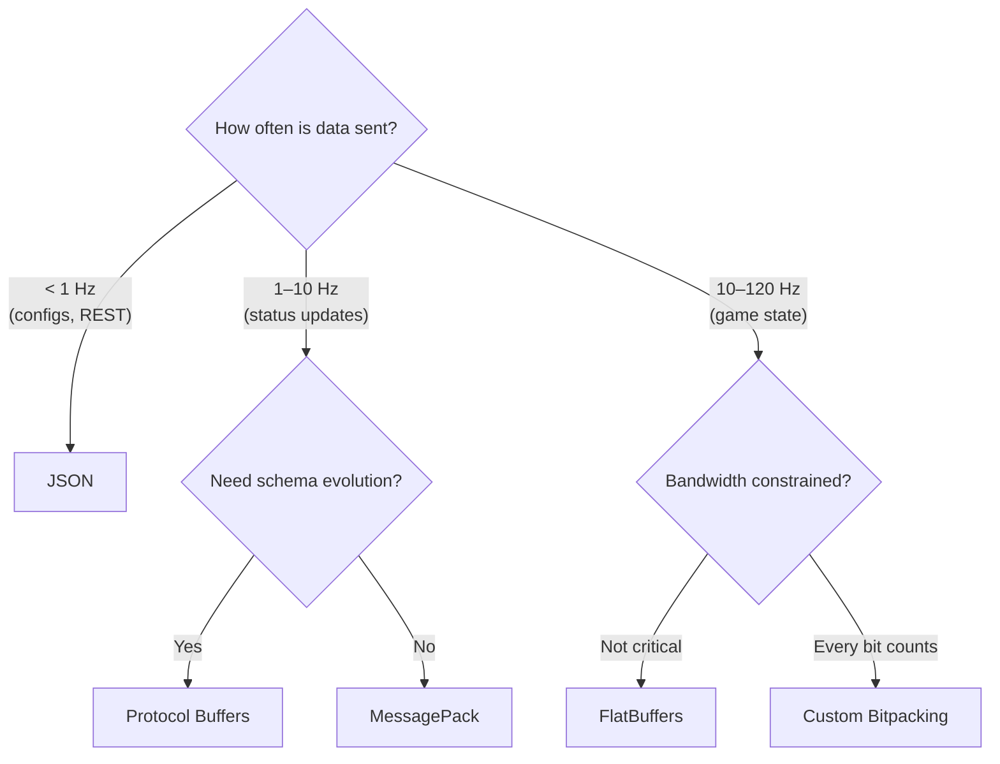

# Performance Comparison and Summary

## Head-to-Head: Serializing a Player

Consider a `Player` struct with `id` (uint32), `x`, `y`, `z` (float), and `health` (uint16):

| Format             | Wire Size | Encode Time | Decode Time | Schema Required |
| ------------------ | --------- | ----------- | ----------- | --------------- |
| JSON (text)        | ~80 B     | ~500 ns     | ~800 ns     | No              |
| MessagePack        | ~30 B     | ~100 ns     | ~120 ns     | No              |
| Protocol Buffers   | ~19 B     | ~50 ns      | ~60 ns      | Yes (.proto)    |
| FlatBuffers        | ~36 B     | ~40 ns      | ~5 ns       | Yes (.fbs)      |
| Manual binary (BE) | 18 B      | ~20 ns      | ~20 ns      | Manual          |
| Custom bitpacking  | 5 B       | ~15 ns      | ~15 ns      | Manual          |

::: tip "Approximate figures"

These numbers are order-of-magnitude estimates for a modern x86-64 CPU. Actual performance depends on schema complexity, compiler optimizations, and data patterns. The relative ordering is consistent across benchmarks.

:::

## Bandwidth Impact at Scale

For a 64-tick game server with 20 players, each frame sends one player state to every other player:

```
Packets per second = 20 players × 64 ticks = 1,280 packets/s
```

| Format           | Per Packet | Bandwidth (1,280 pkt/s) | With 20 Players (upstream) |
| ---------------- | ---------- | ----------------------- | -------------------------- |
| JSON             | 80 B       | 100 KB/s                | 2.0 MB/s                   |
| Protocol Buffers | 19 B       | 24 KB/s                 | 475 KB/s                   |
| Custom bitpack   | 5 B        | 6.4 KB/s                | 125 KB/s                   |

On a typical home connection (10 Mbps upstream = 1.25 MB/s), JSON can't even handle 20 players. Custom bitpacking leaves 90%+ bandwidth headroom.

## When to Use Each Format



### Decision Matrix

| Scenario                               | Recommended Format      | Why                                            |
| -------------------------------------- | ----------------------- | ---------------------------------------------- |
| REST API / web service                 | JSON                    | Universal, debuggable, standard tooling        |
| Config files, save data                | JSON / TOML             | Human-editable, version-controllable           |
| Microservice RPC                       | Protocol Buffers + gRPC | Schema evolution, cross-language, industry std |
| Game asset loading                     | FlatBuffers             | Zero-copy, fast random access                  |
| Real-time game state (< 20 players)    | Protocol Buffers        | Good balance of size and development speed     |
| Real-time game state (competitive/AAA) | Custom bitpacking       | Minimum bandwidth, maximum control             |
| IoT / constrained devices              | CBOR                    | Standard, compact, self-describing             |
| Database wire format                   | BSON                    | MongoDB ecosystem                              |

## Common Mistakes

| Mistake                                                 | Consequence                                       |
| ------------------------------------------------------- | ------------------------------------------------- |
| Using JSON at 60 Hz for game state                      | 10-20× bandwidth waste, CPU overhead              |
| Using custom bitpacking for REST APIs                   | Undebuggable, no tooling, maintenance nightmare   |
| Ignoring endianness in manual binary serialization      | Garbage data on cross-platform communication      |
| `memcpy` of structs to the network                      | Padding, endianness, versioning all break         |
| Not validating deserialized ranges                      | Security vulnerability (buffer overflow, crashes) |
| Using `reinterpret_cast` instead of `memcpy`/`bit_cast` | Undefined behavior (strict aliasing violation)    |
| Confusing schema-based and self-describing formats      | Wrong choice: Protobuf has tags, not field names  |
| Compressing already-bitpacked data with LZ4             | Wastes CPU, may increase size                     |

## Serialization Checklist

Before sending data over the network, verify:

- [ ] **Byte order:** All multi-byte integers converted to big-endian (network byte order)
- [ ] **No raw structs:** Using explicit serialize/deserialize functions, not `memcpy`
- [ ] **Range validation:** Deserialized values checked against expected bounds
- [ ] **Versioning strategy:** Can add fields without breaking old clients
- [ ] **Integrity check:** CRC32 or similar for corruption detection
- [ ] **Size budget:** Format fits within bandwidth constraints at target tick rate
- [ ] **Error handling:** Graceful handling of malformed/truncated data

## Summary: The Serialization Spectrum

| ← Simple (Development Speed) |                    | Complex (Wire Efficiency) → |
| ---------------------------- | ------------------ | --------------------------- |
| JSON                         | Protocol Buffers   | Custom Bitpacking           |
| Human-readable               | Schema + codegen   | Manual bit manipulation     |
| Self-describing              | Compact varints    | Range-based compression     |
| 80 B/player                  | 19 B/player        | 5 B/player                  |
| REST APIs, configs           | RPC, microservices | AAA game state              |

The right choice depends on your **bandwidth budget**, **development velocity**, and **debugging needs**. Start with the simplest format that meets your requirements, and optimize only when measurements show you need to.
