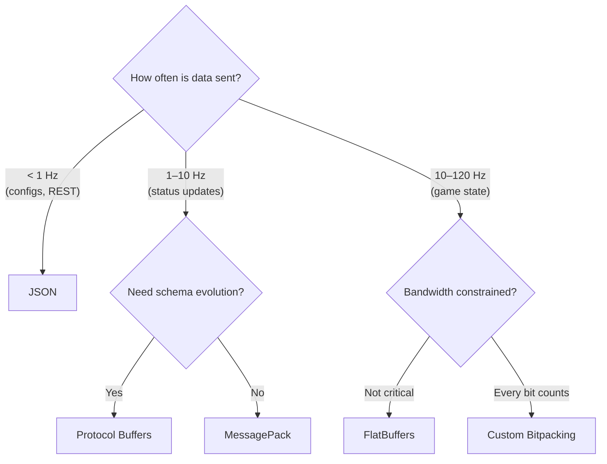

# Performance Comparison and Summary

## Head-to-Head: Serializing a Player

Consider a `Player` struct with `id` (uint32), `x`, `y`, `z` (float), and `health` (uint16):

| Format             | Wire Size | Encode Time | Decode Time | Schema Required |
| ------------------ | --------- | ----------- | ----------- | --------------- |
| JSON (text)        | ~80 B     | ~500 ns     | ~800 ns     | No              |
| MessagePack        | ~30 B     | ~100 ns     | ~120 ns     | No              |
| Protocol Buffers   | ~19 B     | ~50 ns      | ~60 ns      | Yes (.proto)    |
| FlatBuffers        | ~36 B     | ~40 ns      | ~5 ns       | Yes (.fbs)      |
| Manual binary (BE) | 18 B      | ~20 ns      | ~20 ns      | Manual          |
| Custom bitpacking  | 5 B       | ~15 ns      | ~15 ns      | Manual          |

::: tip "Approximate figures"

These numbers are order-of-magnitude estimates for a modern x86-64 CPU. Actual performance depends on schema complexity, compiler optimizations, and data patterns. The relative ordering is consistent across benchmarks.

:::

## Bandwidth Impact at Scale

For a 64-tick game server with 20 players, each frame sends one player state to every other player:

```
Packets per second = 20 players × 64 ticks = 1,280 packets/s
```

| Format           | Per Packet | Bandwidth (1,280 pkt/s) | With 20 Players (upstream) |
| ---------------- | ---------- | ----------------------- | -------------------------- |
| JSON             | 80 B       | 100 KB/s                | 2.0 MB/s                   |
| Protocol Buffers | 19 B       | 24 KB/s                 | 475 KB/s                   |
| Custom bitpack   | 5 B        | 6.4 KB/s                | 125 KB/s                   |

On a typical home connection (10 Mbps upstream = 1.25 MB/s), JSON can't even handle 20 players. Custom bitpacking leaves 90%+ bandwidth headroom.

## When to Use Each Format



### Decision Matrix

| Scenario                               | Recommended Format      | Why                                            |
| -------------------------------------- | ----------------------- | ---------------------------------------------- |
| REST API / web service                 | JSON                    | Universal, debuggable, standard tooling        |
| Config files, save data                | JSON / TOML             | Human-editable, version-controllable           |
| Microservice RPC                       | Protocol Buffers + gRPC | Schema evolution, cross-language, industry std |
| Game asset loading                     | FlatBuffers             | Zero-copy, fast random access                  |
| Real-time game state (< 20 players)    | Protocol Buffers        | Good balance of size and development speed     |
| Real-time game state (competitive/AAA) | Custom bitpacking       | Minimum bandwidth, maximum control             |
| IoT / constrained devices              | CBOR                    | Standard, compact, self-describing             |
| Database wire format                   | BSON                    | MongoDB ecosystem                              |

## Common Mistakes

| Mistake                                                 | Consequence                                       |
| ------------------------------------------------------- | ------------------------------------------------- |
| Using JSON at 60 Hz for game state                      | 10-20× bandwidth waste, CPU overhead              |
| Using custom bitpacking for REST APIs                   | Undebuggable, no tooling, maintenance nightmare   |
| Ignoring endianness in manual binary serialization      | Garbage data on cross-platform communication      |
| `memcpy` of structs to the network                      | Padding, endianness, versioning all break         |
| Not validating deserialized ranges                      | Security vulnerability (buffer overflow, crashes) |
| Using `reinterpret_cast` instead of `memcpy`/`bit_cast` | Undefined behavior (strict aliasing violation)    |
| Confusing schema-based and self-describing formats      | Wrong choice: Protobuf has tags, not field names  |
| Compressing already-bitpacked data with LZ4             | Wastes CPU, may increase size                     |

## Serialization Checklist

Before sending data over the network, verify:

- [ ] **Byte order:** All multi-byte integers converted to big-endian (network byte order)
- [ ] **No raw structs:** Using explicit serialize/deserialize functions, not `memcpy`
- [ ] **Range validation:** Deserialized values checked against expected bounds
- [ ] **Versioning strategy:** Can add fields without breaking old clients
- [ ] **Integrity check:** CRC32 or similar for corruption detection
- [ ] **Size budget:** Format fits within bandwidth constraints at target tick rate
- [ ] **Error handling:** Graceful handling of malformed/truncated data

## Deserialization Safety

Every byte from the network is **untrusted input**. A malicious or buggy peer can craft payloads that exploit your deserializer. Deserialization bugs are the #1 source of network security vulnerabilities (CVEs) in game servers and networked applications.

### Common Attack Vectors

| Attack                  | How It Works                            | Consequence                                   |
| ----------------------- | --------------------------------------- | --------------------------------------------- |
| Non-terminating varint  | MSB is always 1 — decoder loops forever | Infinite loop, server hang                    |
| Oversized length prefix | String/array length = 2 GB              | Out-of-memory crash                           |
| Out-of-range values     | `health = 255` when max is 100          | Game logic corruption, cheating               |
| Truncated message       | Message ends mid-field                  | Read past buffer → undefined behavior         |
| Deeply nested messages  | 1000 levels of nesting                  | Stack overflow                                |
| Non-minimal varint      | Value 1 encoded as 5 bytes              | Canonicalization issues (hashing, signatures) |

### Defensive Deserialization Rules

**Rule 1: Bound every read.** Never read past the buffer boundary.

```cpp
uint32_t BitReader::read_bits(int bits) {
    if (bits_read_ + bits > total_bits_)
        throw std::runtime_error("buffer overrun");
    // ... normal read logic ...
}
```

Every `read_bits`, `read_bool`, and `read_bytes` call must check remaining capacity first.

**Rule 2: Validate ranges after deserialization.** Raw bit values may be in-range for the bit width but out-of-range for the game logic.

```cpp
player.health = reader.read_bits(7);  // can read 0-127
if (player.health > 100)
    return false;  // reject: health max is 100

player.team = reader.read_bits(2);    // can read 0-3
if (player.team > 3)
    return false;  // reject: only 4 teams
```

This is especially important for enum-like fields — a 2-bit field can hold values 0–3, but your game may only define 3 teams (0–2).

**Rule 3: Cap varint byte count.** A uint32 varint should never exceed 5 bytes. Reject early:

```cpp
size_t decode_varint(const uint8_t* buffer, uint32_t& out) {
    uint32_t result = 0;
    int shift = 0;
    for (int i = 0; i < 5; i++) {  // max 5 iterations for uint32
        uint8_t byte = buffer[i];
        result |= (uint32_t(byte & 0x7F) << shift);
        if ((byte & 0x80) == 0) {
            out = result;
            return i + 1;
        }
        shift += 7;
    }
    return 0;  // error: varint too long
}
```

**Rule 4: Cap string and array lengths before allocating.** A length prefix of 1,000,000 should not cause a 1 MB allocation without checking that the buffer actually contains that many bytes:

```cpp
uint32_t len = decode_varint(...);
if (len > MAX_STRING_LENGTH || len > remaining_bytes)
    return false;  // reject before allocating
str.resize(len);
std::memcpy(str.data(), ptr, len);
```

**Rule 5: Limit nesting depth** for recursive message structures. Set a hard cap (e.g., 64 levels) and reject deeper messages.

### Fuzz Testing

The best way to find deserialization bugs is to feed **random bytes** to your deserializer and verify it never crashes:

```cpp
#include <random>

void fuzz_test_deserializer() {
    std::mt19937 rng(42);  // fixed seed for reproducibility
    for (int trial = 0; trial < 100000; trial++) {
        // Generate random buffer (0-255 bytes)
        size_t len = rng() % 256;
        std::vector<uint8_t> garbage(len);
        for (auto& b : garbage) b = rng() % 256;

        // Must never crash — returning false/error is fine
        BitReader reader(garbage.data(), garbage.size());
        PlayerState player{};
        bool ok = serialize_player(reader, player);
        // ok can be true or false — but no crash, no UB, no hang
    }
}
```

If any random input causes a crash, segmentation fault, or infinite loop, you have a **security vulnerability**.

Professional fuzzing tools automate this with coverage-guided mutation:

- **[AFL++](https://aflplus.plus/)** — coverage-guided fuzzer, finds edge cases humans miss
- **[libFuzzer](https://llvm.org/docs/LibFuzzer.html)** — LLVM's built-in fuzzer, integrates with sanitizers
- **[Honggfuzz](https://honggfuzz.dev/)** — multi-process, supports hardware-assisted coverage

Combine with **AddressSanitizer** (`-fsanitize=address`) to catch buffer overflows and use-after-free during fuzzing.

::: danger "Never trust the wire"

Treat every deserialized message as potentially adversarial. Validate, bound, and reject — **before** the data reaches game logic. A remote code execution vulnerability in your deserializer means an attacker can take over your game server by sending a single crafted packet.

:::

## Summary: The Serialization Spectrum

| ← Simple (Development Speed) |                    | Complex (Wire Efficiency) → |
| ---------------------------- | ------------------ | --------------------------- |
| JSON                         | Protocol Buffers   | Custom Bitpacking           |
| Human-readable               | Schema + codegen   | Manual bit manipulation     |
| Self-describing              | Compact varints    | Range-based compression     |
| 80 B/player                  | 19 B/player        | 5 B/player                  |
| REST APIs, configs           | RPC, microservices | AAA game state              |

The right choice depends on your **bandwidth budget**, **development velocity**, and **debugging needs**. Start with the simplest format that meets your requirements, and optimize only when measurements show you need to.
