# Week 07: Distributed State and Synchronization

---

## Today's Agenda

1. State Synchronization Models
2. CAP Theorem
3. State Sync vs Input Sync
4. P2P State Sync
5. Authoritative Server & Never Trust the Client
6. Server Reconciliation
7. Delta Compression

---

## Recap: Serialization Tells Us How to Encode Data

Last week we solved **how to encode data** for the wire: endianness, struct packing, Protobuf, bitpacking.

Now we need to solve: **what data do we send, and who decides what's true?**

How do we keep shared state consistent across multiple machines?

---

## The Core Problem

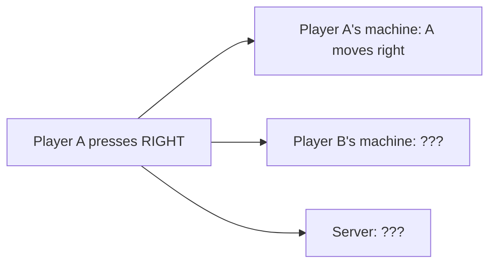

Three machines, one action. How do they all agree on the result?

This is the **distributed state synchronization** problem.

---

## Two Fundamental Architectures

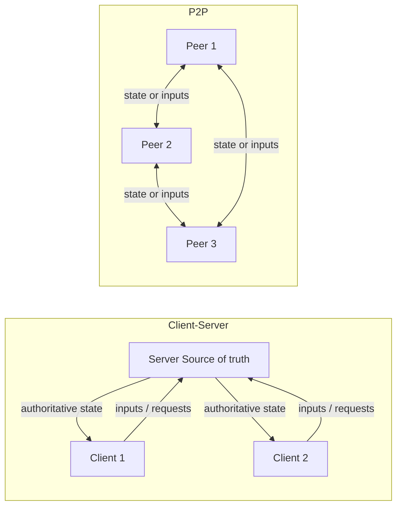

---

## Client-Server vs P2P: Comparison

| Aspect      | Client-Server                      | P2P                                |
| ----------- | ---------------------------------- | ---------------------------------- |
| Authority   | Single server is source of truth   | Distributed; may have host or none |
| Scalability | Server can bottleneck              | Peers share load; discovery harder |
| Consistency | Server enforces strong consistency | Often eventual consistency         |
| Security    | Server validates everything        | No central validator; trust harder |
| Latency     | Client RTT to server               | Varies per peer pair               |
| Cost        | Server hardware required           | Players provide compute            |

---

## Client-Server: How It Works

1. Clients send **inputs** (not state) to the server
2. Server **validates** inputs and runs the simulation
3. Server broadcasts **authoritative state** to all clients
4. Clients render based on server state

The server is the **single source of truth**. Clients are just input devices and renderers.

---

## P2P: How It Works

No central server. Peers communicate directly.

But who decides what's true?

Three strategies:

- **Lockstep** — everyone simulates; agree on inputs
- **Host authority** — one peer acts as server
- **State broadcast** — each peer owns some objects

---

## Real-World Examples

| Game / System                       | Architecture                   | Why                                               |
| ----------------------------------- | ------------------------------ | ------------------------------------------------- |
| Counter-Strike, Valorant, Overwatch | Dedicated server               | Competitive; anti-cheat requires server authority |
| Age of Empires, StarCraft (classic) | P2P lockstep                   | RTS with many units; inputs cheaper than state    |
| Halo (co-op), many console games    | Listen server (host authority) | One player hosts; no server cost                  |
| BitTorrent, IPFS                    | Full P2P mesh                  | File sharing; no central server needed            |
| Most web apps, REST APIs            | Client-server                  | Browser is client; server owns data               |

---

## Network Topologies in P2P

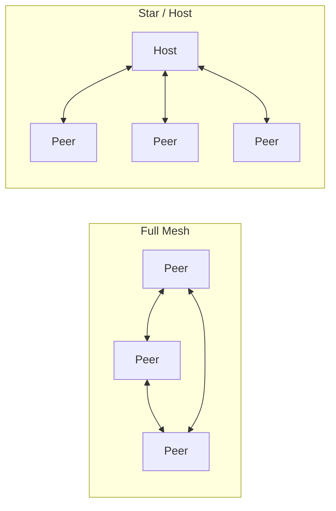

---

## Full Mesh vs Star

- **Full mesh:** Every peer connects to every other. \(N\) peers = \(N(N-1)/2\) connections. Scales poorly beyond ~8 peers.
- **Star (host):** One peer connects to all others. \(N-1\) connections. Scales better; host is bottleneck.
- **Hybrid:** Mesh for some data (e.g., voice), star for authoritative state.

| Peers | Mesh connections | Star connections |
| ----- | ---------------- | ---------------- |
| 4     | 6                | 3                |
| 8     | 28               | 7                |
| 16    | 120              | 15               |
| 64    | 2,016            | 63               |

---

## The CAP Theorem

The **CAP theorem** (Brewer, 2000) says that in a distributed system, when a **network partition** occurs, you cannot guarantee all three of:

- **C (Consistency):** Every read sees the latest write
- **A (Availability):** Every request gets a response
- **P (Partition tolerance):** System works even if network splits

---

## CAP: The Real Choice

**P is unavoidable** — networks partition. So the real choice is:

| Choice | Meaning                                                          | Example                                   |
| ------ | ---------------------------------------------------------------- | ----------------------------------------- |
| **CP** | When partitioned, block or refuse writes to preserve consistency | Centralized DB, authoritative game server |
| **AP** | When partitioned, keep serving; accept temporary inconsistency   | P2P games, caches, NoSQL                  |

---

## CAP in Practice: Per-Operation Tradeoffs

Real systems don't sit neatly in one box:

- A game server might be **CP for scoring** (block until confirmed) but **AP for movement** (predict locally, reconcile later)
- A web app might be **CP for payments** (reject if uncertain) but **AP for user profiles** (show stale data)
- A P2P game might be **AP for most state** but use **host authority (CP)** for contested events

---

## CAP and Sync Models

- **Client-server** → can enforce **CP**: server is single source of truth; during partition, clients get errors or stale data
- **P2P** → often favors **AP**: peers stay available, accept eventual consistency, reconcile when network recovers

This is why P2P often uses conflict resolution (last-writer-wins, CRDTs) instead of strong consistency.

---

## State Sync vs Input Sync

Two families of keeping the world in sync:

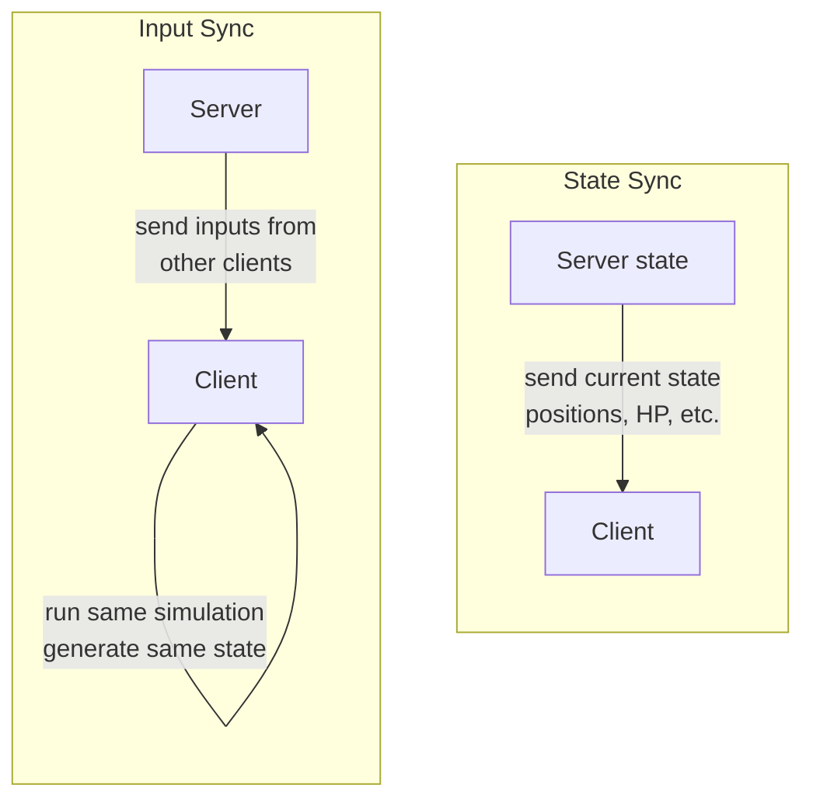

---

## State Sync vs Input Sync: Comparison

|             | State sync                           | Input sync                         |
| ----------- | ------------------------------------ | ---------------------------------- |
| Wire        | State (positions, velocities, flags) | Inputs (move left, jump, shoot)    |
| Determinism | Not required                         | Required (same result everywhere)  |
| Bandwidth   | Higher (full or delta state)         | Lower (small input stream)         |
| Desync      | Can correct next tick                | Hard to fix; rollback or resync    |
| Late join   | Easy: send full snapshot             | Hard: replay all inputs from start |
| Spectating  | Easy: just receive state             | Easy if deterministic              |

---

## Worked Example: Two Players Moving

Player A moves right, Player B moves up, same tick.

**State sync:**

1. Server simulates: A at (11, 5), B at (3, 6)
2. Server sends: `{A: {x:11, y:5}, B: {x:3, y:6}}`
3. Clients overwrite local state
4. Bandwidth ∝ **objects × state size**

**Input sync:**

1. A sends "right"; B sends "up"
2. Server broadcasts: `{tick: 42, inputs: [A: RIGHT, B: UP]}`
3. Every client applies same inputs → same result
4. Bandwidth ∝ **players × input size** (much smaller)

---

## Determinism: Why It Matters for Input Sync

For input sync, every machine must produce **exactly the same result**:

- **Floating-point:** IEEE 754 doesn't guarantee identical results across CPUs/compilers. Use **fixed-point math**.
- **Random numbers:** Same seed + same PRNG on all machines.
- **Iteration order:** Hash maps may iterate differently. Use ordered containers.
- **Multithreading:** Non-deterministic scheduling. Use single-threaded sim.

---

## Determinism Is Hard

Even **one bit** of difference per tick will compound.

After 1000 ticks, the game worlds can be completely different.

```
Tick 0:   Machine A: x = 10.000000    Machine B: x = 10.000000
Tick 1:   Machine A: x = 10.100000    Machine B: x = 10.100001  ← 1 ULP off
Tick 100: Machine A: x = 20.000000    Machine B: x = 20.000100
Tick 1000: Machine A: x = 110.00000   Machine B: x = 110.01000  ← visibly wrong
```

This is why many games prefer **state sync** — it's self-correcting.

---

## P2P State Sync: Three Strategies

When there's no dedicated server, P2P needs a strategy:

1. **Lockstep** — deterministic, input-only
2. **Host authority** — one peer acts as server
3. **State broadcast** — each peer owns objects

---

## Lockstep (Deterministic, Input-Only)

All peers run the **same simulation**; only **inputs** are exchanged.

**How it works:**

1. Each peer collects local input
2. Peer sends input to all other peers
3. Peer **waits** until all inputs received for this turn
4. All peers apply all inputs in same order
5. Advance simulation by one tick
6. Repeat

---

## Lockstep: Pros and Cons

**Pros:**

- Very low bandwidth (only inputs)
- No central point of failure
- All peers have identical state

**Cons:**

- Game speed limited by **slowest** peer (everyone waits)
- Requires **strict determinism**
- Cheating peer can send fake inputs
- Late join requires replaying all inputs from start

**Examples:** Age of Empires, StarCraft

---

## Host Authority (Listen Server)

One peer acts as the **server** (host). Others are clients.

**How it works:**

1. Clients send inputs to the host
2. Host validates inputs, runs authoritative simulation
3. Host broadcasts authoritative state to all clients
4. Clients render based on host state

Same as client-server, but the server is a player's machine.

---

## Host Authority: Pros and Cons

**Pros:**

- Single source of truth
- "Never trust the client" applies to non-host peers
- Easier to implement than full P2P
- Late join is easy (send snapshot)

**Cons:**

- Host has advantage (zero latency to "server")
- Host migration is complex
- Host can cheat
- Host's upload bandwidth is the bottleneck

**Examples:** Halo co-op, many console games

---

## State Broadcast

Peers send **state** to each other. No single authority.

**How it works:**

1. Each peer owns some objects (e.g., its own avatar)
2. Peer sends state updates for owned objects to all others
3. Conflicts resolved by rules (last-writer-wins, host decides)

**Pros:** No single point of failure; each peer only sends its own state

**Cons:** Conflict resolution is hard; "never trust the client" is hardest here

---

## P2P Models: Comparison

|             | Lockstep                | Host Authority           | State Broadcast               |
| ----------- | ----------------------- | ------------------------ | ----------------------------- |
| Authority   | All peers (consensus)   | Host peer                | Per-object owner              |
| Bandwidth   | Very low (inputs only)  | Medium (state from host) | Medium (state from each peer) |
| Determinism | Required                | Not required             | Not required                  |
| Latency     | Slowest peer limits all | Host has advantage       | Varies per peer pair          |
| Late join   | Hard                    | Easy (snapshot)          | Medium                        |
| Anti-cheat  | Hard (no validator)     | Host validates           | Hardest                       |

---

## Choosing a Model

- **Client-server:** Default for competitive or cheat-sensitive games
- **P2P lockstep:** Good for small, trusted groups (RTS)
- **P2P host authority:** Good for casual or co-op
- **State broadcast:** Rare in games; more common in distributed apps

---

## Part 2: Authoritative Server and Never Trust the Client

---

## Why the Server Must Be the Source of Truth

If clients could set their own position, health, or score, cheaters would win every time.

The only robust approach:

1. **Server runs the game logic** (movement, collision, damage, scoring)
2. **Clients send inputs only**; server applies them
3. **Server validates every action** (range checks, rate limits, rules)

---

## The Authority Flow

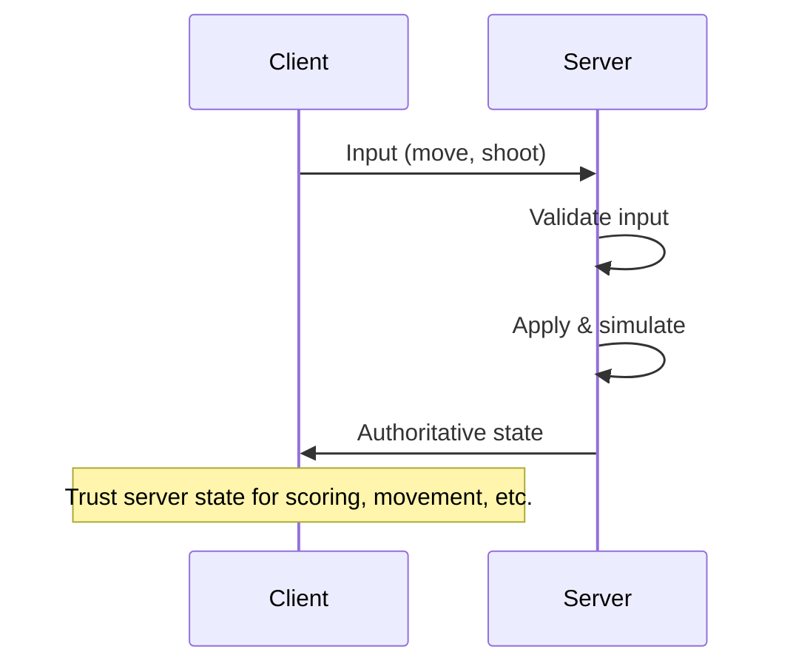

Clients **suggest** actions. The server **decides**.

---

## Never Trust the Client

The client is **untrusted code running on someone else's machine**.

Assume it has been modified, instrumented, or replaced entirely.

Do **not** accept client-reported:

- Position, velocity, or rotation
- Health, ammo, or score
- "I hit player X"
- Timestamps
- "I have item Y"

---

## What the Server Should Validate

| Check                   | Example                         | Prevents                |
| ----------------------- | ------------------------------- | ----------------------- |
| **Range / bounds**      | Movement speed <= max           | Speed hacks, teleport   |
| **Rate limiting**       | Max 10 shots/sec                | Rapid-fire hacks        |
| **Cooldown**            | Ability not usable for 5s       | Cooldown bypass         |
| **State precondition**  | Must be alive to shoot          | Dead-player exploits    |
| **Physics / collision** | Path doesn't pass through walls | Noclip                  |
| **Resource check**      | Has enough ammo / mana          | Infinite resource hacks |
| **Ownership**           | Can only move own character     | Impersonation           |

---

## Server Input Validation: Pseudocode

```
function handleClientInput(clientId, input):
    player = getPlayer(clientId)

    if player.isDead():
        reject("dead players cannot act")
        return

    if input.type == MOVE:
        newPos = player.position + input.direction * MOVE_SPEED * dt
        if not isWalkable(newPos):
            reject("invalid move: collision")
            return
        if distance(player.position, newPos) > MAX_MOVE_PER_TICK:
            reject("move too fast")
            return
        player.position = newPos

    if input.type == SHOOT:
        if player.lastShotTime + SHOOT_COOLDOWN > now():
            reject("shooting too fast")
            return
        if player.ammo <= 0:
            reject("no ammo")
            return
        player.ammo -= 1
        player.lastShotTime = now()
        performServerSideHitDetection(player, input.aimDirection)

    broadcastState()
```

---

## Common Cheats and Server-Side Prevention

| Cheat                | How it works                         | Prevention                                     |
| -------------------- | ------------------------------------ | ---------------------------------------------- |
| **Speed hack**       | Client moves faster than allowed     | Server enforces max speed per tick             |
| **Teleport**         | Client reports far position          | Server checks distance from last known         |
| **Aimbot**           | Client auto-aims                     | Server does hit detection; can detect patterns |
| **Wallhack**         | Client renders enemies through walls | Server only sends visible enemies              |
| **Infinite health**  | Client reports full health           | Health is server-authoritative                 |
| **Item duplication** | Client claims items                  | Inventory is server-authoritative              |

---

## Information Hiding

Server authority isn't just about validating inputs — it's about **limiting what the client knows**:

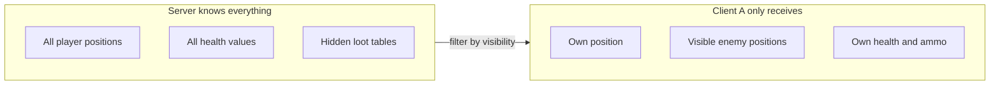

---

## Information Hiding: Why It Matters

- **Fog of war:** Only send positions of entities the player can see. Wallhack has nothing to render.
- **Hidden state:** Don't send other players' health, ammo, cooldowns unless needed.
- **Server-side secrets:** Random seeds, spawn locations, AI decisions — never sent before revealed.

Large-scale games (MMOs, battle royale) use **area of interest** (AOI): only send updates about nearby entities.

This reduces bandwidth **and** limits cheating.

---

## CSI: Zero-Trust and Input Validation

The same principle applies beyond games:

- **Zero-trust architecture:** Treat every request as untrusted. Authenticate and authorize every call.
- **APIs / microservices:** Validate payloads against schema. Check permissions. Rate-limit. Sanitize inputs.
- **Distributed systems:** The "server" is whichever component **owns** the data; others must not set truth.

---

## CSI ↔ GPR Parallels

| Game concept                        | CSI equivalent                          |
| ----------------------------------- | --------------------------------------- |
| Server validates player input       | API validates request payload           |
| Server rejects invalid moves        | API returns 400 Bad Request             |
| Server rate-limits shooting         | API rate-limits requests (429)          |
| Server doesn't send hidden state    | API enforces authorization (403)        |
| Server is source of truth for score | Database is source of truth for balance |
| "Never trust the client"            | "Never trust the caller" / zero-trust   |

---

## GPR: Anti-Cheat and Server Authority

Server authority is the foundation of anti-cheat:

- **Movement:** Server checks speed, collision, terrain
- **Combat:** Server performs hit detection
- **Inventory / economy:** Server grants items and currency
- **Matchmaking / ranking:** Server calculates ELO/MMR

Clients only **suggest** actions; the server **decides** and broadcasts.

---

## Defense in Depth

Server authority is necessary but not always sufficient:

1. **Server-side validation** — the foundation (this week)
2. **Server-side anti-cheat detection** — statistical analysis of behavior
3. **Client-side anti-cheat** (EasyAntiCheat, BattlEye) — detects memory modification, injected DLLs
4. **Replay / audit systems** — record inputs for post-hoc analysis and ban waves

---

## Host Authority in P2P (Listen Server)

One peer acts as the **host** (listen server):

- Runs authoritative game logic
- Validates other peers' inputs
- Sends authoritative state to other peers

**The host advantage problem:** Host has zero latency to "server."

Mitigations:

- **Artificial delay:** Add fake latency to host's own inputs
- **Matchmaking:** Prefer hosts with good connections

---

## Host Migration

When the host leaves, another peer must take over:

1. Detect host disconnection (timeout or explicit leave)
2. Elect a new host (lowest latency, longest connected, or deterministic order)
3. Transfer full authoritative state to new host
4. Possibly pause the game during migration

This is complex and error-prone — plan for it up front.

---

## "Never Trust the Client" in Full P2P

In full P2P with no host, there's no central validator:

**Lockstep:** Cheating = sending fake inputs. Detection:

- **State hash comparison:** Peers share state hashes periodically
- **Social trust:** Small groups self-police
- **Replay verification:** Record inputs for third-party verification

**State broadcast:** Anyone can send state. Need rules:

- **Ownership:** "Only the owner updates their avatar"
- **Last-writer-wins:** Simple but exploitable
- **CRDTs:** Auto-converge without coordination

---

## Part 3: Server Reconciliation

---

## The Problem: Latency

RTT can be 50–200 ms or more. Without prediction:

| RTT    | Perceived delay | Player experience           |
| ------ | --------------- | --------------------------- |
| 20 ms  | 10 ms           | Imperceptible (LAN)         |
| 80 ms  | 40 ms           | Noticeable in fast games    |
| 150 ms | 75 ms           | Clearly sluggish            |
| 300 ms | 150 ms          | Unplayable for action games |

Pressing "move right" and waiting 75 ms to see it feels broken.

---

## The Idea: Predict Locally, Correct Later

1. **Client** sends input to server and **immediately** applies it locally
2. **Server** validates, simulates, sends back authoritative state + last processed input ID
3. **Client** receives update: if it matches prediction, done; if not, **correct** and **reapply** unprocessed inputs

---

## The Reconciliation Flow

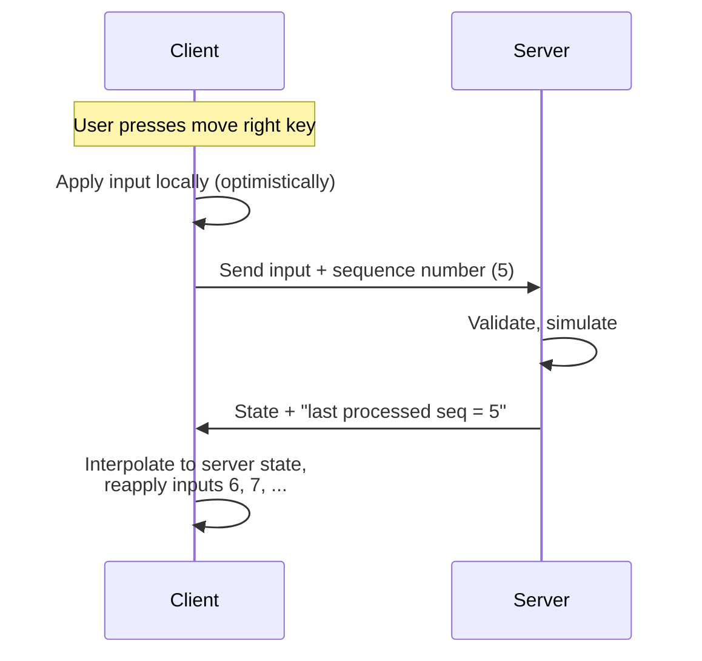

---

## Input Sequence Numbers

The client tags each input with a **sequence number**.

The server includes "last processed sequence number" in its updates.

The client can then:

- **Discard** predictions for inputs already processed
- **Reapply** only unprocessed inputs on top of server state

Without sequence numbers, the client wouldn't know which inputs the server has seen.

---

## The Algorithm: Client Side

```
inputQueue = []
seqNum = 0

every tick:
    input = getPlayerInput()
    seqNum += 1
    input.seq = seqNum

    localState = applyInput(localState, input)  // predict
    inputQueue.push(input)                       // save
    send(input)                                  // send

on serverUpdate(serverState, lastProcessedSeq):
    // discard acknowledged inputs
    while inputQueue[0].seq <= lastProcessedSeq:
        inputQueue.shift()

    localState = serverState  // accept server truth

    // re-predict unprocessed inputs
    for each input in inputQueue:
        localState = applyInput(localState, input)
```

---

## The Algorithm: Server Side

```
every tick:
    for each client:
        while client has pending inputs:
            input = client.nextInput()
            if validate(input):
                gameState = applyInput(gameState, input)
                client.lastProcessedSeq = input.seq

    for each client:
        send(client, gameState, client.lastProcessedSeq)
```

---

## Worked Example: Prediction Is Correct

1D game, player at x=10, speed = 1 unit per input.

| Time | Client action                    | Server action        | Client x | Server x |
| ---- | -------------------------------- | -------------------- | -------- | -------- |
| t=0  | Send seq=1 (right), predict x=11 | —                    | 11       | 10       |
| t=1  | Send seq=2 (right), predict x=12 | Receives seq=1: x=11 | 12       | 11       |
| t=2  | Send seq=3 (right), predict x=13 | Receives seq=2: x=12 | 13       | 12       |
| t=3  | Receives update: x=11, lastSeq=1 | —                    | —        | —        |

---

## Reconciliation at t=3 (Correct Prediction)

1. Server says x=11 after processing seq=1
2. Discard seq=1. Remaining: [seq=2, seq=3]
3. Set state to server state: x=11
4. Reapply seq=2: x=12
5. Reapply seq=3: x=13
6. Predicted x=13 matches what we had — **no visible correction**

The player sees smooth movement the entire time.

---

## Worked Example: Prediction Is Wrong

Same setup, but there's a **wall at x=12** that only the server knows:

| Time | Client action                    | Server action                  | Client x | Server x |
| ---- | -------------------------------- | ------------------------------ | -------- | -------- |
| t=0  | Send seq=1 (right), predict x=11 | —                              | 11       | 10       |
| t=1  | Send seq=2 (right), predict x=12 | Receives seq=1: x=11           | 12       | 11       |
| t=2  | Send seq=3 (right), predict x=13 | Receives seq=2: **wall!** x=11 | 13       | 11       |
| t=3  | Receives update: x=11, lastSeq=2 | —                              | —        | —        |

---

## Reconciliation at t=3 (Wrong Prediction)

1. Server says x=11 after processing seq=2 (rejected due to wall)
2. Discard seq=1, seq=2. Remaining: [seq=3]
3. Set state to server state: x=11
4. Reapply seq=3 (right): **wall again** → x stays 11
5. Client corrects from predicted x=13 to x=11

The player **snaps back** to the wall. This is the cost of misprediction.

---

## Correction Strategies: Snap vs Blend

When server state differs from prediction:

### Snap (immediate)

```
localState = serverState
```

Simple. Can cause visible "teleporting."

### Blend (smooth)

```
every render frame:
    displayState = lerp(displayState, serverState, blendFactor)
```

Smooth. A blend factor of 0.1–0.3 per frame works well for position.

---

## Threshold-Based Correction

Most games combine both:

```
error = distance(predictedState, serverState)
if error > SNAP_THRESHOLD:
    localState = serverState          // too far, snap
else if error > BLEND_THRESHOLD:
    localState = lerp(localState, serverState, BLEND_RATE)
else:
    // close enough, keep prediction
```

Typical: snap if > 2 meters, blend if > 1 cm, ignore if smaller.

---

## The Input Buffer

The client maintains a **buffer of unacknowledged inputs**:

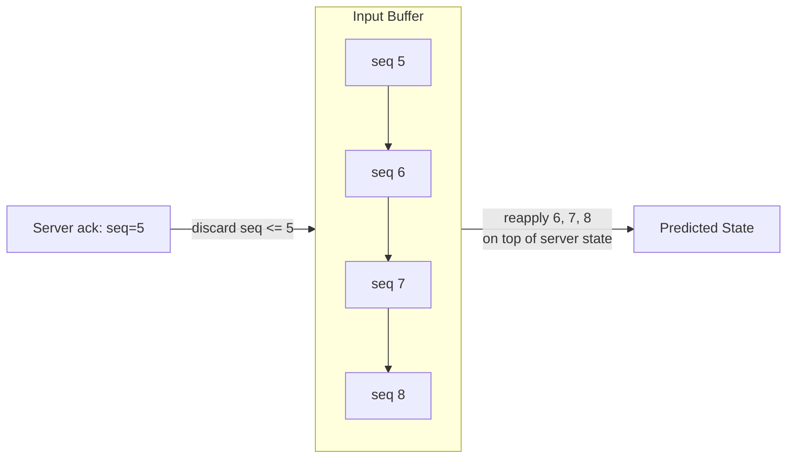

- **Size:** ~RTT / tick_rate inputs (e.g., 6 inputs at 60 Hz, 100 ms RTT)
- **Overflow:** Throttle input if server is too far behind
- **Empty:** Prediction was perfect — no correction needed

---

## GPR: Correction Flow

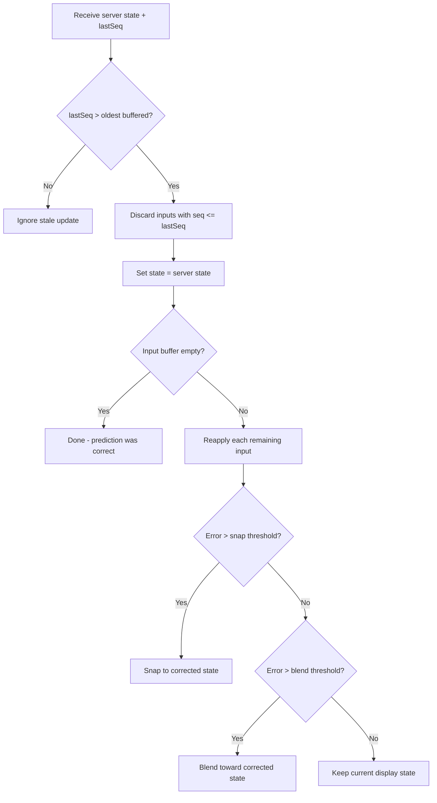

---

## Common Reconciliation Pitfalls

| Pitfall                          | Consequence                                 |
| -------------------------------- | ------------------------------------------- |
| Forgetting to reapply inputs     | Player "teleports back" every server update |
| Reapplying with wrong delta time | Result differs from original prediction     |
| Not handling rejected inputs     | Client keeps predicting through walls       |
| Accumulating float error         | Client and server drift apart over time     |

---

## CSI: Optimistic Concurrency Control

The same pattern in distributed systems:

- **Proceed as if the operation will succeed** (client predicts)
- **If the server disagrees, reconcile** (rollback, merge, retry)
- Used in databases (optimistic locking), version control (git merge), collaborative editing

---

## CSI ↔ GPR: Reconciliation Parallels

| Concept              | Game networking        | Distributed systems             |
| -------------------- | ---------------------- | ------------------------------- |
| Client predicts      | Client-side prediction | Optimistic write                |
| Server validates     | Server reconciliation  | Conflict detection              |
| Reapply unprocessed  | Replay input queue     | Rebase / retry                  |
| Snap to server state | Correction             | Rollback                        |
| Sequence numbers     | Input seq numbers      | Version numbers / vector clocks |

---

## Conflict Resolution Strategies

When two nodes disagree:

| Strategy              | How it works                    | Tradeoff                              |
| --------------------- | ------------------------------- | ------------------------------------- |
| **Last-writer-wins**  | Highest timestamp wins          | Simple; can lose data                 |
| **Vector clocks**     | Track causal ordering           | Complex; may need manual merge        |
| **CRDTs**             | Data structures that auto-merge | Limited types; mathematically correct |
| **Application merge** | Custom logic per data type      | Most flexible; most work              |

---

## P2P Conflict Resolution

When peers disagree (e.g., both picked up the same item):

- **Host decides:** Host is authority; others accept. Simplest.
- **Last-writer-wins:** Latest timestamp wins. Simple but favors low-latency peers.
- **Application merge:** Rules per data type:
  - "Only owner sets their position"
  - "Health is min of all reported"
  - "Item pickup goes to first requester at host"
- **Deterministic tiebreaker:** Lower player ID wins. Fair and predictable.

Design conflict resolution **up front**.

---

## Part 4: Delta Compression

---

## The Bandwidth Problem

Full game state = 1 KB. 20 Hz tick rate. 64 players.

| Approach            | Per-client/tick | Per-client/sec | 64 clients/sec |
| ------------------- | --------------- | -------------- | -------------- |
| Full state          | 1,000 B         | 20,000 B       | 1,280,000 B    |
| Delta (10% changed) | ~100 B          | ~2,000 B       | 128,000 B      |
| Delta + compression | ~50 B           | ~1,000 B       | 64,000 B       |

**10–20× bandwidth reduction.** For MMOs and battle royale, deltas are essential.

---

## Full State vs Delta

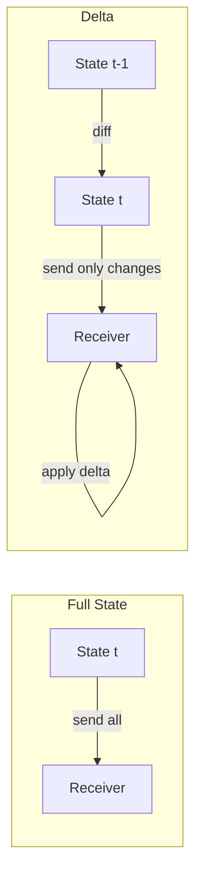

Only send what **changed** since the last acknowledged state.

---

## Selective Updates (Fiedler)

The simplest form of delta: **only send changed objects**.

```
for each entity in world:
    if entity.hasChanged():
        changedEntities.add(entity)

packet = createPacket()
for each entity in changedEntities:
    packet.write(entity.id, entity.changedFields)

send(packet)
```

Track a **dirty flag** per entity. Send only dirty entities. Clear after sending.

---

## Selective Updates: Key Ideas

From Glenn Fiedler's State Synchronization:

- **Send state** (position, velocity, orientation) so receivers can extrapolate
- **Send only what changed:** Skip objects at rest or unchanged
- **Prioritize:** Send nearby/important objects more often than distant ones

This alone can cut bandwidth dramatically — most objects don't change every tick.

---

## Delta Encoding: Send Differences

Instead of the full value, send the **difference** from previous:

| Tick | Full value | Delta         |
| ---- | ---------- | ------------- |
| 0    | 1000       | — (baseline)  |
| 1    | 1003       | +3            |
| 2    | 1005       | +2            |
| 3    | 1005       | 0 (unchanged) |
| 4    | 1008       | +3            |

Full value: 16 bits. Delta: 4–8 bits. **2–4× saving per field.**

Use variable-length encoding for small deltas in fewer bytes.

---

## Floating-Point Delta

Floats are trickier — subtraction introduces noise. Options:

- **Quantize first, then delta:** Convert to fixed-point integer (e.g., millimeters), then delta-encode integers
- **Threshold:** If delta < 0.001, treat as unchanged (send nothing)

```
// Quantize to millimeters, then delta
int32_t current_mm = (int32_t)(position * 1000.0f);
int32_t previous_mm = (int32_t)(prev_position * 1000.0f);
int32_t delta = current_mm - previous_mm;
// delta is small integer → few bits with varint
```

---

## The XOR Trick for Binary State

If state is a fixed-size block of bytes:

```
delta = state_new XOR state_old
```

On the receiver:

```
state_new = state_old XOR delta
```

When few bits change, `delta` is mostly zeros → compresses extremely well.

---

## XOR Trick: Worked Example

```
state_old = [0x41, 0x42, 0x43, 0x44, 0x45]  // "ABCDE"
state_new = [0x41, 0x42, 0x63, 0x44, 0x45]  // "ABcDE"

delta     = [0x00, 0x00, 0x20, 0x00, 0x00]  // only byte 2 differs
```

Delta is 80% zeros. After compression: 3–5 bytes instead of 5.

For a 1 KB state block with 10% changed, the XOR delta compresses to ~100–200 bytes.

---

## Priority Accumulator

Not all entities are equally important. A **priority accumulator** decides what to send:

1. Each entity has a **priority** (distance, visibility, importance)
2. Each tick, accumulate priority for entities **not sent** last tick
3. Sort by accumulated priority; send top N that fit in packet
4. Reset accumulator for sent entities

---

## Priority Accumulator: Flow

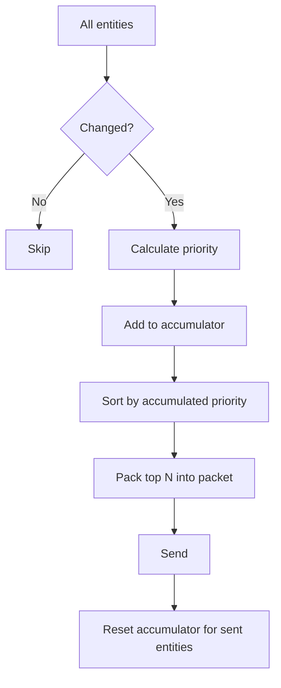

---

## Priority Factors

| Factor                 | Weight         | Rationale                                 |
| ---------------------- | -------------- | ----------------------------------------- |
| Distance to player     | High (inverse) | Nearby objects matter most                |
| Velocity / change rate | Medium         | Fast-moving objects need frequent updates |
| Gameplay importance    | High           | The ball, the flag, the bomb              |
| Time since last sent   | Accumulates    | Prevents starvation                       |
| Visibility             | High           | Off-screen objects updated less often     |

This ensures bandwidth stays within budget regardless of entity count.

---

## Baseline Management

Delta encoding requires sender and receiver to agree on a **baseline** (the "old" state).

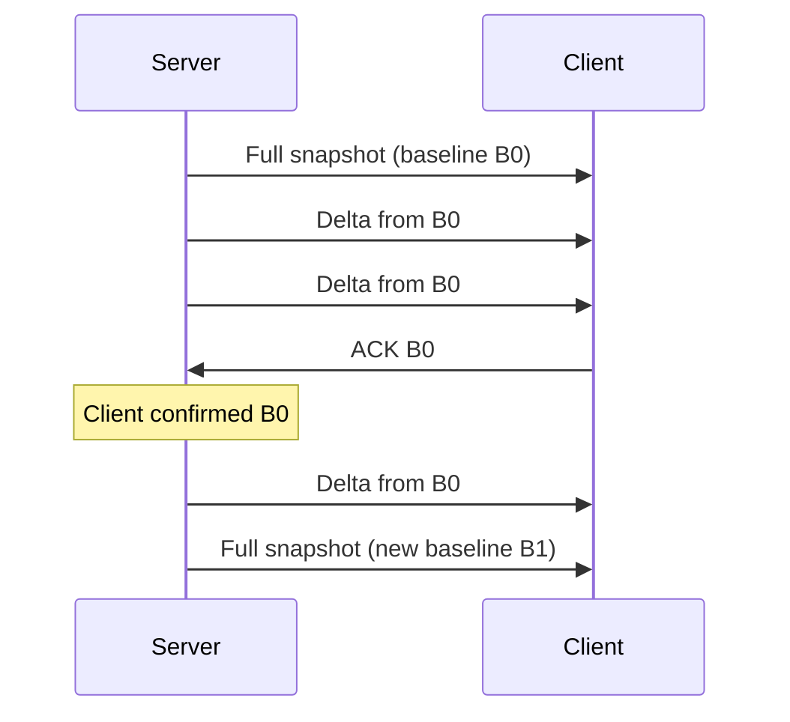

---

## Baseline Management: The Problem

- Server must remember what baseline each client has acknowledged
- If a delta packet is **lost** (UDP), client's state diverges

**Solutions:**

- Resend delta from last acked baseline (safe but may be large)
- Send periodic full snapshots (expensive but guarantees recovery)
- Redundant deltas from last 2–3 baselines (client uses whichever it has)

---

## The Quake 3 Approach

Clean and widely copied:

1. Server sends full snapshot as baseline
2. Each subsequent packet is a delta from the **last acknowledged snapshot**
3. Client ACKs each received snapshot
4. Server always deltas from **last ACKed** snapshot

Lost packets don't cause divergence — the next delta is just larger.

Simple, robust, and the foundation of most modern game networking.

---

## Snapshot + Delta Architecture

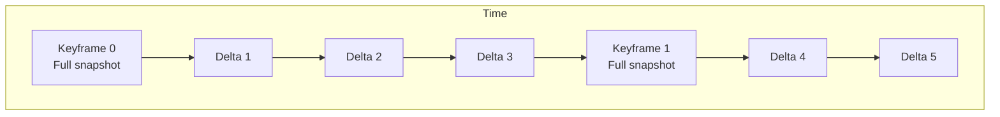

Analogous to **video compression**:

- Keyframes = I-frames (full picture)
- Deltas = P-frames (differences from previous)

Periodic keyframes limit worst-case delta size and enable late join.

---

## CSI: Incremental Replication

In distributed systems, "delta" shows up as:

- **Row-level replication:** Only replicate changed rows (MySQL binlog, PostgreSQL WAL)
- **Byte-level replication:** Only replicate changed bytes (rsync)
- **Change data capture (CDC):** Stream changes from DB to consumers

---

## CSI: Log-Based Sync

- **Write-ahead log (WAL):** DB writes operations to log before applying. Replicas apply same entries.
- **Event sourcing:** Store events, not current state. Derive state by replaying.
- **Kafka / message queues:** Producers write events; consumers read and apply.

Same pattern: "server sends deltas, client applies them."

---

## CSI ↔ GPR: Delta Parallels

| Game networking                    | Distributed systems                        |
| ---------------------------------- | ------------------------------------------ |
| Full snapshot                      | Full database dump / pg_dump               |
| Delta update                       | WAL entry / binlog event                   |
| Baseline (last acked snapshot)     | Replication offset / consumer offset       |
| Lost packet → resend from baseline | Consumer falls behind → replay from offset |
| Periodic keyframe                  | Periodic checkpoint / snapshot             |

---

## GPR: Bandwidth vs Accuracy

| Approach              | Bandwidth | Accuracy                 | Complexity | When to use                    |
| --------------------- | --------- | ------------------------ | ---------- | ------------------------------ |
| Full state every tick | Highest   | Perfect                  | Lowest     | Prototyping, < 4 players       |
| Selective updates     | Medium    | Perfect                  | Low        | Most games                     |
| Delta encoding        | Low       | Perfect                  | Medium     | Many entities, tight bandwidth |
| Delta + quantization  | Lowest    | Approximate              | High       | Competitive, 64+ players       |
| Input sync            | Minimal   | Perfect if deterministic | High       | RTS, fighting games            |

---

## Quantization Recap (from Week 06)

Reduce bits per value. Often combined with deltas:

- **Position:** 10 bits per axis instead of 32-bit float
- **Rotation:** Smallest-three quaternion (29 bits instead of 128)
- **Health:** 7 bits (0–127) instead of 32-bit int

Quantization and delta encoding are **complementary**:

quantize → delta-encode → compress

---

## The Full Send Pipeline

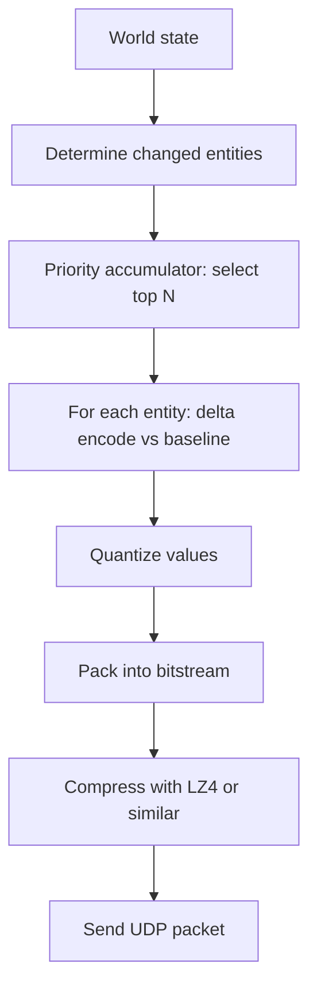

---

## Pipeline: Each Step Reduces Data

- **Changed entities:** 1000 entities → 100 changed
- **Priority:** Select top 30 that fit in packet
- **Delta:** 20 bytes/entity → 5 bytes
- **Quantize:** Fewer bits per value
- **Compress:** Exploit remaining redundancy

Result: 1000 entities synchronized in a few hundred bytes per tick.

---

## Part 5: Putting It All Together

---

## The Complete Picture

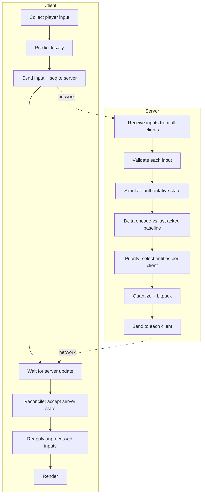

---

## Key Takeaways

1. **Client-server** is the default for competitive games; P2P for casual/co-op
2. **CAP theorem:** You can't have consistency + availability during partition; choose per operation
3. **State sync** sends state (forgiving); **input sync** sends inputs (requires determinism)
4. **Never trust the client** — validate all inputs on the server
5. **Server reconciliation** = predict locally + correct when server replies
6. **Delta compression** = send only changes; 10–20× bandwidth reduction
7. **Priority accumulator** = bandwidth budget regardless of entity count

---

## Quick Reference

| Topic                    | Key Takeaway                                                        |
| ------------------------ | ------------------------------------------------------------------- |
| State sync vs input sync | State: send state; Input: send inputs, require determinism          |
| Client-server vs P2P     | Client-server: single authority; P2P: distributed, harder to secure |
| P2P lockstep             | Deterministic sim; peers send only inputs; common in RTS            |
| Host authority in P2P    | Listen server: one peer hosts; host migration when host leaves      |
| CAP and P2P              | P2P often favors AP; eventual consistency when partitioned          |
| Never trust the client   | Server validates all inputs; harder in full P2P                     |
| Server reconciliation    | Client predicts; server decides; client corrects                    |
| Delta compression        | Send only changes; reduces bandwidth dramatically                   |
| Priority accumulator     | Budget-aware entity selection per packet                            |
| Baseline management      | Delta from last ACKed snapshot (Quake 3 approach)                   |


---

## Interactive Practice

- [Gambetta: Client-Side Prediction Live Demo](https://www.gabrielgambetta.com/client-side-prediction-live-demo.html) — See prediction + reconciliation in action
- Trace one "move" through: client input → server validation → authoritative update → client correction

---

## Questions?
