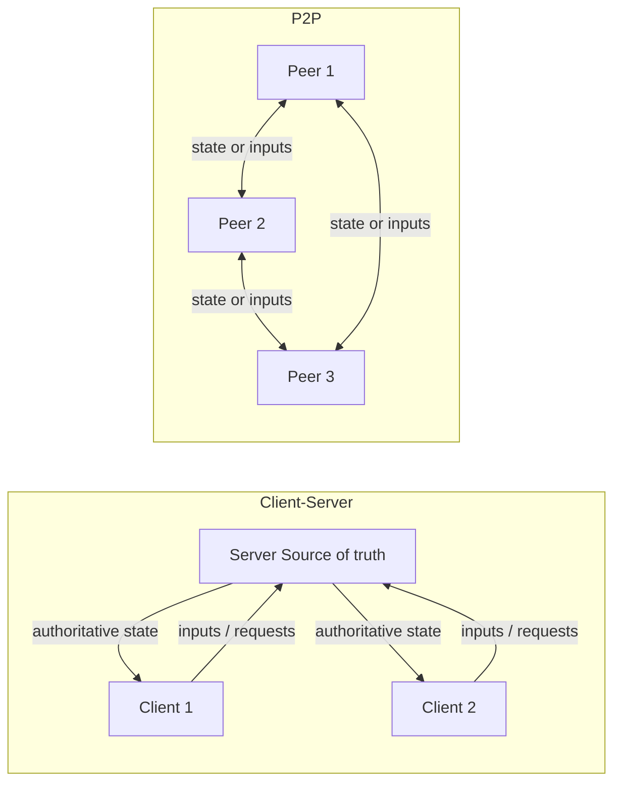
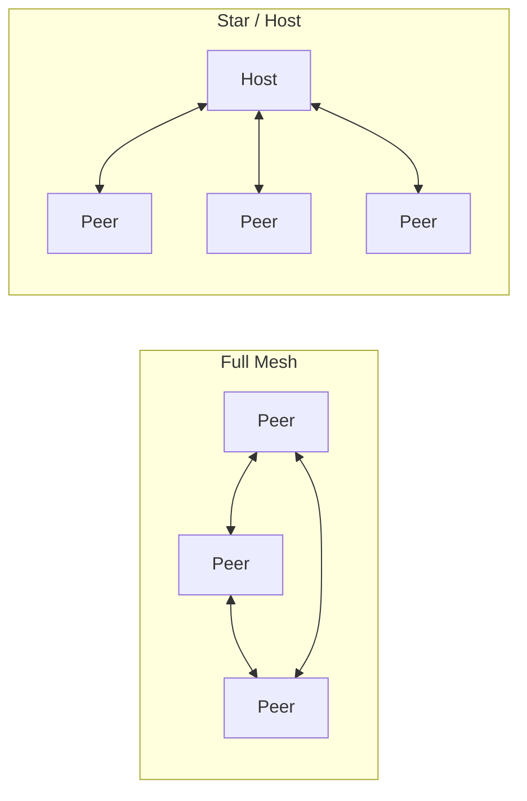
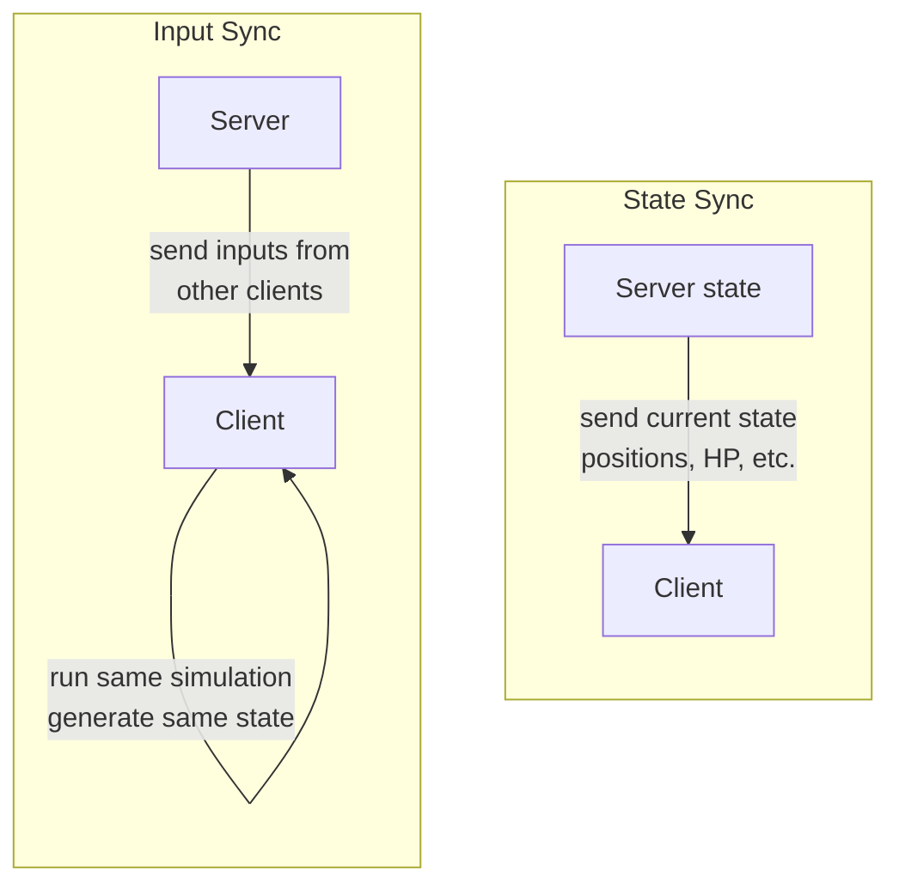

# State Synchronization Models

Keeping shared state consistent across the network is the core challenge of distributed applications and multiplayer games. This section covers **client-server vs P2P**, the **CAP theorem**, **state sync vs input sync**, and **P2P-specific state sync** (lockstep, host authority, state broadcast).

## Client-Server vs P2P

Two fundamental architectures govern who holds authority and how data flows:

| Aspect      | Client-Server                                     | P2P                                                                    |
| ----------- | ------------------------------------------------- | ---------------------------------------------------------------------- |
| Authority   | Single server is source of truth                  | Distributed; may have host or none                                     |
| Scalability | Server can bottleneck                             | Peers share load; discovery harder                                     |
| Consistency | Server can enforce strong consistency             | Often eventual consistency (CAP: AP)                                   |
| Security    | Server validates; "never trust the client" easier | No central validator; trust harder                                     |
| Latency     | Client RTT to server; server has zero latency     | Varies per peer pair; host has advantage in listen server              |
| Cost        | Server hardware and hosting required              | Players provide compute; no server cost                                |
| **CSI**     | Centralized authority, replication from one node  | Distributed systems patterns, replication across peers                 |
| **GPR**     | Dedicated or listen server; anti-cheat at server  | Listen server = one peer hosts; full P2P = lockstep or state broadcast |

### Real-World Examples

| Game / System                       | Architecture                     | Why                                                       |
| ----------------------------------- | -------------------------------- | --------------------------------------------------------- |
| Counter-Strike, Valorant, Overwatch | Dedicated server (client-server) | Competitive; anti-cheat requires server authority         |
| Age of Empires, StarCraft (classic) | P2P lockstep                     | RTS with many units; sending inputs is cheaper than state |
| Halo (co-op), many console games    | Listen server (host authority)   | One player hosts; no dedicated server cost                |
| BitTorrent, IPFS                    | Full P2P mesh                    | File sharing; no central server needed                    |
| Most web apps, REST APIs            | Client-server                    | Browser is client; server owns data                       |

### Network Topologies in P2P

P2P doesn't mean "everyone talks to everyone." The topology matters:

- **Full mesh:** Every peer connects to every other peer. \(N\) peers = \(N(N-1)/2\) connections. Scales poorly beyond ~8 peers.
- **Star (host):** One peer (host) connects to all others. \(N-1\) connections. Scales better; host is bottleneck.
- **Hybrid:** Mesh for some data (e.g., voice), star for authoritative state. Common in practice.

## CAP Theorem

The **CAP theorem** (Brewer, 2000) says that in a distributed system, when a **network partition** occurs (nodes cannot communicate), you cannot guarantee all three of:

- **C (Consistency):** Every read sees the latest write; all nodes agree on the same data.
- **A (Availability):** Every request receives a response (no node refuses to serve).
- **P (Partition tolerance):** The system keeps working even if the network splits.

You must choose at most two. In practice **P is unavoidable** (networks partition), so the real choice is between **CP** and **AP**:

| Choice | Meaning                                                                               | Example                                                                                                |
| ------ | ------------------------------------------------------------------------------------- | ------------------------------------------------------------------------------------------------------ |
| **CP** | When partitioned, refuse writes or block so that consistency is preserved.            | Centralized DB, client-server with strong consistency; may return errors or time out during partition. |
| **AP** | When partitioned, keep serving; allow temporary inconsistency (eventual consistency). | P2P, caches, many NoSQL systems; nodes keep accepting reads/writes and reconcile later.                |

### CAP in Practice

Real systems don't sit neatly in one box. They make **per-operation** tradeoffs:

- A game server might be **CP for scoring** (block until server confirms) but **AP for movement** (predict locally, reconcile later).
- A web app might be **CP for payments** (reject if uncertain) but **AP for user profiles** (show stale data, sync later).
- A P2P game might be **AP for most state** (eventual consistency) but use **host authority (CP)** for contested events (item pickups, kills).

::: tip "CAP and sync models"

- **Client-server** can enforce strong consistency (CP): the server is the single source of truth; during a partition clients may get errors or stale data until the partition heals.
- **P2P** often favors **AP**: peers stay available and partition-tolerant and accept **eventual consistency** — state may diverge during a partition and converge when the network recovers. This is why P2P and "state broadcast" sync often use conflict resolution (last-writer-wins, CRDTs) instead of strong consistency.

:::

## State Sync vs Input Sync

How you keep the world in sync divides into two families:

- **State sync:** Send **current state** (position, health, etc.). Receivers overwrite or blend. No need for determinism; bandwidth can be high if state is large.
- **Input sync:** Send **inputs only** (keys, commands). Receiver runs the same simulation. Requires **determinism**; bandwidth is low; one desync can diverge forever (or force resync, rollback, or other reconciliation).

|             | State sync                                   | Input sync                                            |
| ----------- | -------------------------------------------- | ----------------------------------------------------- |
| Wire        | State (positions, velocities, flags)         | Inputs (move left, jump, shoot)                       |
| Determinism | Not required                                 | Required (same result everywhere)                     |
| Bandwidth   | Higher (full or delta state)                 | Lower (small input stream)                            |
| Desync      | Can correct next tick with new state         | Hard to fix; rollback or resync                       |
| Late join   | Easy: send full snapshot                     | Hard: must replay all inputs from start or checkpoint |
| Spectating  | Easy: just receive state                     | Easy if deterministic; otherwise same as late join    |
| **Fiedler** | Selective updates; send only changed objects | Lockstep; used in RTS (Age of Empires)                |

### Worked Example: Two Players Moving

Consider a simple 2D game where Player A moves right and Player B moves up, both at the same tick:

**State sync approach:**

1. Server simulates: A is now at (11, 5), B is now at (3, 6).
2. Server sends to both clients: `{A: {x:11, y:5}, B: {x:3, y:6}}`.
3. Clients overwrite local state with server state.
4. Bandwidth: proportional to **number of objects x state size**.

**Input sync approach:**

1. A sends input "move right"; B sends input "move up".
2. Server (or all peers in P2P) collects inputs for this tick.
3. Server broadcasts: `{tick: 42, inputs: [{player: A, input: RIGHT}, {player: B, input: UP}]}`.
4. Every client applies the same inputs to the same simulation and arrives at the same result.
5. Bandwidth: proportional to **number of players x input size** (much smaller).

### Determinism: Why It Matters for Input Sync

For input sync to work, every machine must produce **exactly the same result** from the same inputs. This means:

- **Floating-point:** IEEE 754 doesn't guarantee identical results across compilers, CPUs, or optimization levels. Many lockstep games use **fixed-point math** instead.
- **Random numbers:** Must use the same seed and same PRNG on all machines.
- **Iteration order:** Hash maps, sets, and other unordered containers may iterate differently. Use ordered containers or sort before iterating.
- **Multithreading:** Non-deterministic scheduling. Lockstep simulations are typically single-threaded (or use deterministic job systems).

::: warning "Determinism is hard"

Even one bit of difference per tick will compound. After 1000 ticks, the game worlds on different machines can be completely different. This is why many games prefer **state sync** — it's more forgiving and self-correcting.

:::

## P2P State Sync: Lockstep, Host Authority, State Broadcast

When there is **no dedicated server**, P2P still needs a strategy for who decides and what is sent:

### Lockstep (deterministic, input-only)

All peers run the **same simulation**; only **inputs** are exchanged. Everyone advances one "turn" when everyone has received everyone else's input. Common in RTS (e.g., Age of Empires, StarCraft).

**How it works:**

1. Each peer collects local input for the current turn.
2. Peer sends its input to all other peers.
3. Peer waits until it has received inputs from **all** peers for this turn.
4. All peers apply all inputs in the same order and advance the simulation by one tick.
5. Repeat.

- **Pros:** Very low bandwidth (only inputs); no central point of failure; all peers have identical state.
- **Cons:** Game speed limited by the **slowest** peer (everyone waits); requires strict determinism; one cheating peer can send fake inputs; no natural "host" to kick bad peers; late join requires replaying all inputs from the start.

### Host authority (listen server)

One peer acts as the **server** (host). Others are clients. Same as client-server but the server is a player's machine. Host migration is needed when the host leaves.

**How it works:**

1. Clients send inputs to the host.
2. Host validates inputs, runs authoritative simulation.
3. Host broadcasts authoritative state to all clients.
4. Clients render based on host state (with optional prediction).

- **Pros:** Single source of truth; "never trust the client" applies to non-host peers; easier to implement than full P2P; late join is easy (send snapshot).
- **Cons:** Host has advantage (zero latency to server); host migration is complex; host can cheat; host's upload bandwidth is the bottleneck.

### State broadcast

Peers send **state** to each other (mesh or star). No single authority; conflicts resolved by rules (e.g., last-writer-wins, or host decides for contested fields).

**How it works:**

1. Each peer owns some objects (e.g., its own avatar).
2. Peer sends state updates for its owned objects to all other peers.
3. When two peers claim conflicting state (e.g., both picked up an item), a resolution rule applies.

- **Pros:** No single point of failure; can scale; each peer only sends its own state.
- **Cons:** Conflict resolution and consistency are hard; "never trust the client" is hardest here; no central validator.

### Comparison Table

|             | Lockstep                    | Host Authority                 | State Broadcast                    |
| ----------- | --------------------------- | ------------------------------ | ---------------------------------- |
| Authority   | All peers (consensus)       | Host peer                      | Per-object owner                   |
| Bandwidth   | Very low (inputs only)      | Medium (state from host)       | Medium (state from each peer)      |
| Determinism | Required                    | Not required                   | Not required                       |
| Latency     | Slowest peer limits all     | Host has advantage             | Varies per peer pair               |
| Late join   | Hard (replay or checkpoint) | Easy (snapshot)                | Medium (collect from all)          |
| Anti-cheat  | Hard (no validator)         | Host validates                 | Hardest (no validator)             |
| Examples    | Age of Empires, StarCraft   | Halo co-op, many console games | Some co-op games, distributed apps |

::: warning "Choosing a model"

- **Client-server:** Default for competitive or cheat-sensitive games; server validates everything.
- **P2P lockstep:** Good for small, trusted groups (e.g., RTS); keep inputs small and sim deterministic.
- **P2P host authority:** Good for casual or co-op; plan host migration and trust model.
- **State broadcast:** Rare in games; more common in distributed apps (eventual consistency, CRDTs).

:::
