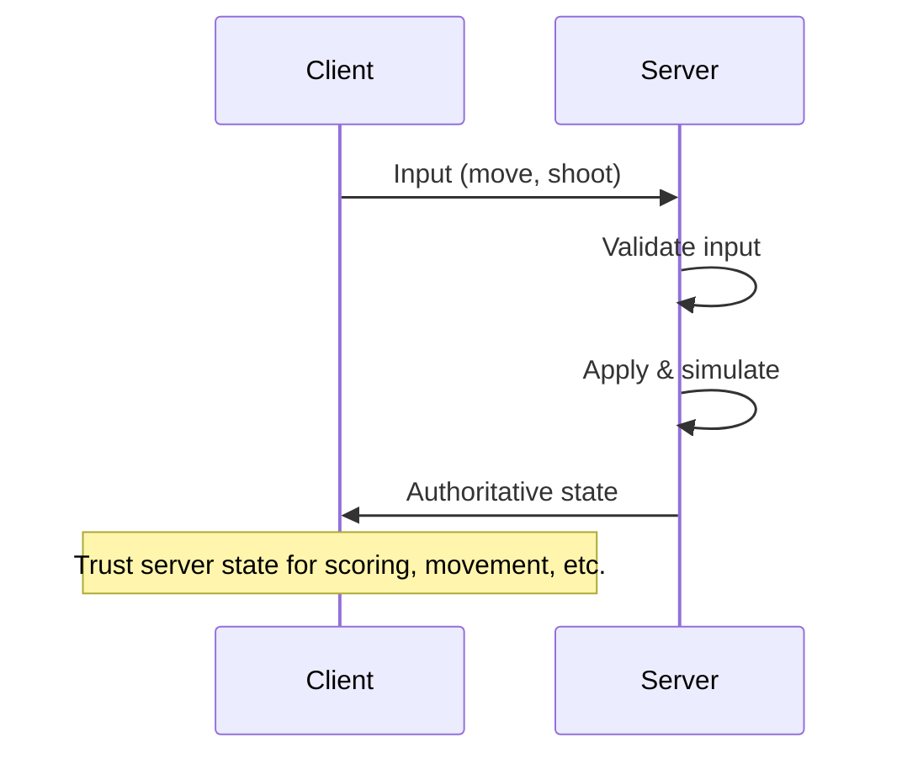
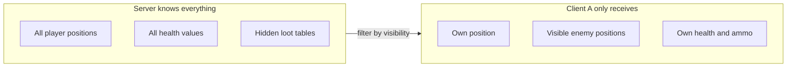

# Authoritative Server and Never Trust the Client

The server (or in P2P, the host) must be the **source of truth** for critical state. This section covers why, the kinds of cheats server authority prevents, how **"never trust the client"** applies in both client-server and P2P, and what the server should and shouldn't reveal to each client.

## Why the Server Must Be the Source of Truth

If clients could set their own position, health, or score, cheaters would win every time. The only robust approach is:

1. **Server runs the game logic** (movement, collision, damage, scoring).
2. **Clients send inputs only** (or requests); server applies them and broadcasts authoritative state.
3. **Server validates every action** (range checks, rate limits, rules).



## What "Never Trust the Client" Means

The client is **untrusted code running on someone else's machine**. Assume it has been modified, instrumented, or replaced entirely. Concretely:

::: danger "Never trust the client"

Do **not** accept client-reported:

- **Position, velocity, or rotation** — can be spoofed for speed hacks or teleport.
- **Health, ammo, or score** — can be set to max or infinite.
- **"I hit player X"** — server must do hit detection from authoritative state (or lag-compensated history in later weeks).
- **Timestamps** — client clocks can be manipulated; use server-side timing.
- **"I have item Y"** — inventory must be server-authoritative.

Validate **all** inputs and derive **all** critical state on the server.

:::

### What the Server Should Validate

Every input from the client should pass through a validation pipeline:

| Check                   | Example                                  | What it prevents           |
| ----------------------- | ---------------------------------------- | -------------------------- |
| **Range / bounds**      | Movement speed <= max speed              | Speed hacks, teleportation |
| **Rate limiting**       | Max 10 shots per second                  | Rapid-fire hacks           |
| **Cooldown**            | Ability not usable for 5s after last use | Cooldown bypass            |
| **State precondition**  | Player must be alive to shoot            | Dead-player exploits       |
| **Physics / collision** | Movement path doesn't pass through walls | Noclip, wallhack movement  |
| **Resource check**      | Player has enough ammo / mana            | Infinite resource hacks    |
| **Ownership**           | Player can only move their own character | Impersonation              |

### Pseudocode: Server Input Validation

```
function handleClientInput(clientId, input):
    player = getPlayer(clientId)

    if player.isDead():
        reject("dead players cannot act")
        return

    if input.type == MOVE:
        newPos = player.position + input.direction * MOVE_SPEED * dt
        if not isWalkable(newPos):
            reject("invalid move: collision")
            return
        if distance(player.position, newPos) > MAX_MOVE_PER_TICK:
            reject("move too fast")
            return
        player.position = newPos

    if input.type == SHOOT:
        if player.lastShotTime + SHOOT_COOLDOWN > now():
            reject("shooting too fast")
            return
        if player.ammo <= 0:
            reject("no ammo")
            return
        player.ammo -= 1
        player.lastShotTime = now()
        performServerSideHitDetection(player, input.aimDirection)

    broadcastState()
```

## Common Cheats and How Server Authority Prevents Them

| Cheat                   | How it works                               | Server-side prevention                                                                        |
| ----------------------- | ------------------------------------------ | --------------------------------------------------------------------------------------------- |
| **Speed hack**          | Client reports moving faster than allowed  | Server enforces max speed per tick; rejects or clamps movement                                |
| **Teleport**            | Client reports position far from current   | Server checks distance from last known position                                               |
| **Aimbot**              | Client auto-aims at enemies                | Server does hit detection; aimbot still works but server can detect inhuman accuracy patterns |
| **Wallhack**            | Client renders enemies through walls       | Server only sends data for visible enemies (see information hiding below)                     |
| **Infinite health**     | Client reports full health after being hit | Health is server-authoritative; client never sets it                                          |
| **Item duplication**    | Client claims to have items it doesn't     | Inventory is server-authoritative                                                             |
| **Packet manipulation** | Client sends crafted packets               | Server validates all fields; rejects malformed or out-of-range data                           |

## Information Hiding: What the Server Should NOT Send

Server authority isn't just about validating inputs — it's also about **limiting what the client knows**:

- **Fog of war:** Only send positions of entities the player can actually see. If the client never receives enemy positions behind walls, a wallhack has nothing to render.
- **Hidden state:** Don't send other players' health, ammo, or cooldowns unless the game design requires it.
- **Server-side secrets:** Random seeds for loot drops, spawn locations, or AI decisions should never be sent to clients before they're revealed.



::: tip "Area of interest"

Large-scale games (MMOs, battle royale) use **area of interest** (AOI) or **relevance filtering**: the server only sends updates about entities near the player or within line of sight. This reduces bandwidth **and** limits cheating.

:::

## CSI: Zero-Trust and Input Validation

The same principle applies beyond games:

- **Zero-trust architecture:** Treat every request as untrusted, regardless of source. Authenticate and authorize every call. Validate all inputs. Encrypt in transit.
- **APIs / microservices:** Validate payloads against a schema. Check permissions (RBAC, ABAC). Rate-limit. Sanitize inputs to prevent injection. Never trust the caller to send correct or safe data.
- **Distributed systems:** The "server" is whichever component **owns** the data; others are "clients" that must not be trusted to set truth. This maps directly to the game model.

### Parallels

| Game concept                        | CSI equivalent                                   |
| ----------------------------------- | ------------------------------------------------ |
| Server validates player input       | API validates request payload                    |
| Server rejects invalid moves        | API returns 400 Bad Request                      |
| Server rate-limits shooting         | API rate-limits requests (429 Too Many Requests) |
| Server doesn't send hidden state    | API enforces authorization (403 Forbidden)       |
| Server is source of truth for score | Database is source of truth for account balance  |
| "Never trust the client"            | "Never trust the caller" / zero-trust            |

## GPR: Anti-Cheat and Server Authority

In games, server authority is the foundation of anti-cheat:

- **Movement:** Server checks speed, collision, and terrain; rejects invalid moves. May also check for impossible paths (e.g., through walls).
- **Combat:** Server performs hit detection (or lag-compensated checks in later weeks). Even with client-side prediction, the server has final say.
- **Inventory / economy:** Server is the only one that can grant items or currency. Client requests "buy item X"; server checks balance and inventory.
- **Matchmaking / ranking:** Server calculates ELO or MMR; clients cannot set their own rank.

Clients only **suggest** actions; the server **decides** and broadcasts the result.

### Defense in Depth

Server authority is necessary but not always sufficient. Many games add layers:

1. **Server-side validation** (this week's topic) — the foundation.
2. **Server-side anti-cheat detection** — statistical analysis of player behavior (e.g., inhuman reaction times, impossible accuracy).
3. **Client-side anti-cheat** (e.g., EasyAntiCheat, BattlEye) — detects memory modification, injected DLLs, debuggers. Not a substitute for server authority, but an additional layer.
4. **Replay / audit systems** — record inputs for post-hoc analysis and ban waves.

## Host Authority in P2P (Listen Server)

In P2P, one peer often acts as the **host** (listen server): that peer runs the same role as a dedicated server for this session. The host:

- Runs authoritative game logic.
- Validates other peers' inputs.
- Sends authoritative state to other peers.

**The host advantage problem:** The host has zero latency to the "server" (itself), giving it a significant advantage in fast-paced games. Mitigations:

- **Artificial delay:** Add fake latency to the host's own inputs to match average client RTT.
- **Cosmetic-only hosting:** Host runs logic but plays with the same delay as clients (rare, complex).
- **Matchmaking:** Prefer hosts with good connections to minimize the gap.

**Host migration:** When the host leaves, another peer must become host and take over authority. This requires:

1. Detecting host disconnection (timeout or explicit leave).
2. Electing a new host (e.g., lowest latency, longest connected, or deterministic order).
3. Transferring the full authoritative state to the new host.
4. Possibly pausing the game during migration.

::: tip "Listen server = player-hosted server"

Glossary: **Listen server** (GPR) = **Player-hosted server** = one peer has **host authority** in a P2P setup. The host's machine is both client and server.

:::

## "Never Trust the Client" in Full P2P

In **full** P2P with no designated host (e.g., pure state broadcast or lockstep), there is no central validator. Then:

- **Lockstep:** Everyone runs the same sim; cheating = sending fake inputs. Detection options:
  - **State hash comparison:** Periodically, all peers compute a hash of their game state and share it. If hashes diverge, someone is cheating (or desynced).
  - **Social trust:** In small groups (friends), cheating is self-policing.
  - **Replay verification:** Record all inputs; a trusted third party can replay and verify.

- **State broadcast:** Anyone can send state; you need application-level rules:
  - **Ownership:** "Only the owner can update their avatar's position."
  - **Last-writer-wins with timestamps:** Simple but exploitable if clocks are manipulated.
  - **Conflict-free replicated data types (CRDTs):** Data structures that automatically converge without coordination. More complex but mathematically correct.

So "never trust the client" is **easiest** with a dedicated or listen server; in full P2P you still minimize trust and validate what you can (e.g., input ranges, rate limits, state hashes).

