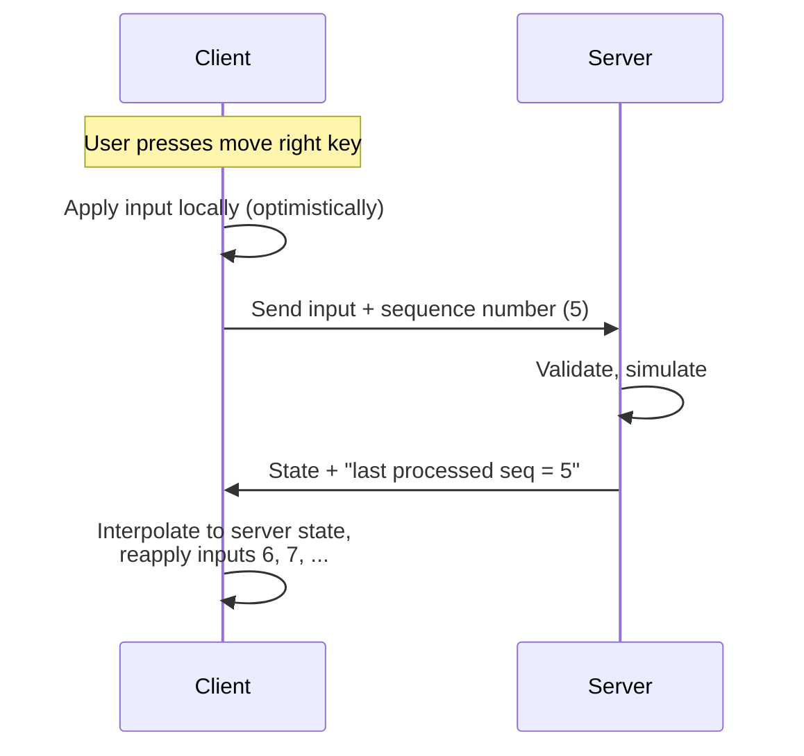
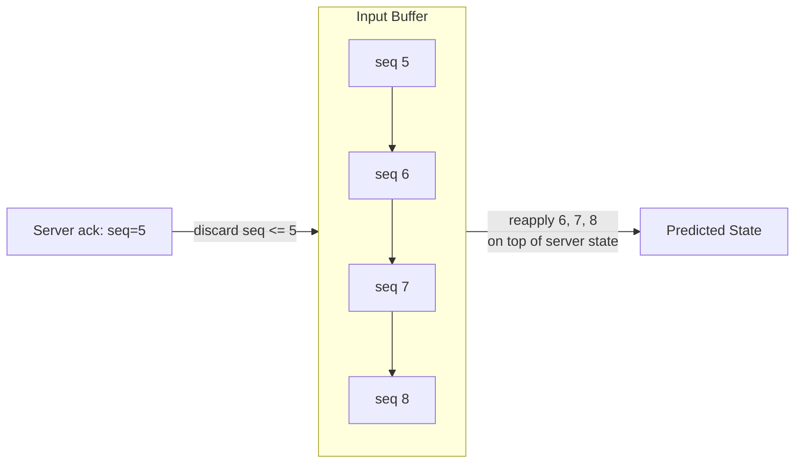
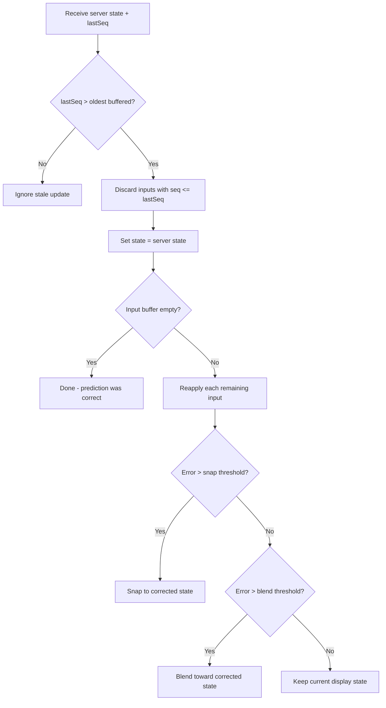

# Server Reconciliation

If the client waited for the server's reply before moving the player, the game would feel laggy. **Client-side prediction** plus **server reconciliation** keeps the game responsive while the server remains authoritative. This section covers the problem, the algorithm, a worked example, correction strategies, and how **P2P conflict resolution** fits in.

## The Problem: Latency

Round-trip time (RTT) can be 50–200 ms or more. If the client only moved after receiving the server's answer, every action would feel delayed by RTT/2 or more.

### How Bad Is It?

| RTT    | Perceived delay (one-way) | Player experience           |
| ------ | ------------------------- | --------------------------- |
| 20 ms  | 10 ms                     | Imperceptible; LAN          |
| 80 ms  | 40 ms                     | Noticeable in fast games    |
| 150 ms | 75 ms                     | Clearly sluggish            |
| 300 ms | 150 ms                    | Unplayable for action games |

Without prediction, pressing "move right" and seeing the character move 75 ms later feels broken. Players expect **instant** feedback.

## The Idea: Predict Locally, Correct When Server Replies

The core algorithm:

1. **Client** sends input to the server and **immediately** applies it locally (predicts the result).
2. **Server** receives input, validates it, runs authoritative simulation, and sends back the authoritative state plus the **last processed input sequence number**.
3. **Client** receives the update: if it matches the prediction, nothing to do; if not, it **corrects** to server state and **reapplies** any inputs the server hasn't yet processed.



## The Algorithm Step by Step

Here's the full reconciliation loop:

### Client Side

```
inputQueue = []  // unacknowledged inputs
seqNum = 0

every tick:
    input = getPlayerInput()
    seqNum += 1
    input.seq = seqNum

    // predict locally
    localState = applyInput(localState, input)

    // save for possible replay
    inputQueue.push(input)

    // send to server
    send(input)

on serverUpdate(serverState, lastProcessedSeq):
    // discard inputs the server has already processed
    while inputQueue.length > 0 and inputQueue[0].seq <= lastProcessedSeq:
        inputQueue.shift()

    // start from server's authoritative state
    localState = serverState

    // re-predict unprocessed inputs
    for each input in inputQueue:
        localState = applyInput(localState, input)
```

### Server Side

```
every tick:
    for each client:
        while client has pending inputs:
            input = client.nextInput()
            if validate(input):
                gameState = applyInput(gameState, input)
                client.lastProcessedSeq = input.seq

    for each client:
        send(client, gameState, client.lastProcessedSeq)
```

::: tip "Input sequence numbers"

The client tags each input with a **sequence number**. The server includes "last processed sequence number" in its updates. The client can then:

- Discard predictions for inputs already processed (they're reflected in server state).
- Reapply only **unprocessed** inputs on top of the server state to get a corrected predicted state.

Without sequence numbers, the client wouldn't know which of its inputs the server has already seen.

:::

## Worked Example with Numbers

Consider a 1D game where the player moves along the X axis. Movement speed is 1 unit per input.

**Initial state:** Player at x = 10.

| Time | Client action                               | Server action                            | Client predicted x | Server authoritative x |
| ---- | ------------------------------------------- | ---------------------------------------- | ------------------ | ---------------------- |
| t=0  | Send input seq=1 (move right), predict x=11 | —                                        | 11                 | 10                     |
| t=1  | Send input seq=2 (move right), predict x=12 | Receives seq=1, validates, applies: x=11 | 12                 | 11                     |
| t=2  | Send input seq=3 (move right), predict x=13 | Receives seq=2, validates, applies: x=12 | 13                 | 12                     |
| t=3  | Receives server update: x=11, lastSeq=1     | —                                        | —                  | —                      |

**Reconciliation at t=3:**

1. Server says x=11 after processing seq=1.
2. Client discards seq=1 from input queue. Remaining: [seq=2, seq=3].
3. Client sets state to server state: x=11.
4. Client reapplies seq=2: x=12.
5. Client reapplies seq=3: x=13.
6. Predicted state (x=13) matches what we already had — no visible correction needed.

### When Prediction Is Wrong

Now suppose at t=2 the player tried to move right but there's a wall at x=12 that only the server knows about:

| Time | Client action                           | Server action                        | Client predicted x | Server authoritative x |
| ---- | --------------------------------------- | ------------------------------------ | ------------------ | ---------------------- |
| t=0  | Send seq=1 (right), predict x=11        | —                                    | 11                 | 10                     |
| t=1  | Send seq=2 (right), predict x=12        | Receives seq=1: x=11                 | 12                 | 11                     |
| t=2  | Send seq=3 (right), predict x=13        | Receives seq=2: **wall!** x stays 11 | 13                 | 11                     |
| t=3  | Receives server update: x=11, lastSeq=2 | —                                    | —                  | —                      |

**Reconciliation at t=3:**

1. Server says x=11 after processing seq=2 (rejected seq=2 due to wall).
2. Client discards seq=1, seq=2. Remaining: [seq=3].
3. Client sets state to server state: x=11.
4. Client reapplies seq=3 (move right): **wall again** → x stays 11.
5. Client corrects from predicted x=13 to x=11. The player "snaps back" to the wall.

## Correction Strategies: Snap vs Blend

When the server state differs from the predicted state, the client must correct. There are two main approaches:

### Snap (immediate correction)

Set the local state to the server state instantly. Simple but can cause visible "teleporting" or jitter.

```
localState = serverState  // instant correction
```

**When to use:** Small corrections, non-visual state (health, ammo), or when accuracy matters more than smoothness.

### Blend / Interpolation (smooth correction)

Gradually move from the predicted state toward the server state over several frames.

```
correctionTarget = serverState
every render frame:
    displayState = lerp(displayState, correctionTarget, blendFactor)
```

**When to use:** Position, rotation — anything the player can see. A blend factor of 0.1–0.3 per frame smooths out small corrections without noticeable lag.

### Threshold-Based Approach

Many games combine both:

```
error = distance(predictedState, serverState)
if error > SNAP_THRESHOLD:
    localState = serverState  // too far off, snap
else if error > BLEND_THRESHOLD:
    localState = lerp(localState, serverState, BLEND_RATE)
else:
    // close enough, keep prediction
```

Typical thresholds: snap if error > 2 meters, blend if error > 0.01 meters, ignore if smaller.

## The Input Buffer

The client maintains a **buffer of unacknowledged inputs** (the input queue). This buffer is central to reconciliation:

- **Size:** Typically RTT / tick_rate inputs. At 60 ticks/s and 100 ms RTT, the buffer holds ~6 inputs.
- **Overflow:** If the buffer grows too large (server is very behind), the client may need to throttle input or wait.
- **Empty:** If the buffer is empty when a server update arrives, prediction matched perfectly — no correction needed.



## CSI: Optimistic Concurrency and Conflict Resolution

The same pattern appears throughout distributed systems:

### Optimistic Concurrency Control

- **Proceed as if the operation will succeed** (like the client predicting movement).
- **If the server (or another node) disagrees, reconcile** — rollback, merge, or retry.
- Used in databases (optimistic locking), version control (git merge), and collaborative editing.

### Comparison

| Concept              | Game networking        | Distributed systems             |
| -------------------- | ---------------------- | ------------------------------- |
| Client predicts      | Client-side prediction | Optimistic write                |
| Server validates     | Server reconciliation  | Conflict detection              |
| Reapply unprocessed  | Replay input queue     | Rebase / retry                  |
| Snap to server state | Correction             | Rollback                        |
| Sequence numbers     | Input seq numbers      | Version numbers / vector clocks |

### Conflict Resolution Strategies

When two nodes have different views (e.g., two writes to the same key), you need a rule:

| Strategy                   | How it works                            | Tradeoff                                   |
| -------------------------- | --------------------------------------- | ------------------------------------------ |
| **Last-writer-wins (LWW)** | Highest timestamp wins                  | Simple; can lose data                      |
| **Vector clocks**          | Track causal ordering; detect conflicts | Complex; may need manual merge             |
| **CRDTs**                  | Data structures that auto-merge         | Limited data types; mathematically correct |
| **Application merge**      | Custom logic per data type              | Most flexible; most work                   |

Server reconciliation is the **client-side** of optimistic concurrency: the client optimistically applies its action, then accepts the server's decision and reconciles.

## GPR: Correction Flow in Detail

The full correction flow in a game client:



### Common Pitfalls

- **Forgetting to reapply inputs:** If you snap to server state without reapplying unprocessed inputs, the player will "teleport back" every server update.
- **Reapplying with wrong delta time:** Inputs must be reapplied with the same dt they were originally applied with, or the result will differ.
- **Not handling rejected inputs:** If the server rejects an input (e.g., wall collision), the client must accept the rejection and not keep predicting through the wall.
- **Accumulating error:** Small floating-point differences between client and server simulation can accumulate. Periodic full state corrections prevent drift.

## P2P Conflict Resolution

In P2P, when peers disagree (e.g., two peers think they picked up the same item), you need a rule:

- **Host decides:** The host (listen server) is the authority; others accept the host's state. Same as client-server from the clients' perspective. Simplest and most common in P2P games.

- **Last-writer-wins:** Attach a timestamp or version; the latest update wins. Simple but can feel unfair (favors lower-latency peers). Vulnerable to clock manipulation.

- **Application merge:** Define rules per data type:
  - "Only the owner can set their position" (ownership-based).
  - "Health is min of all reported" (conservative merge).
  - "Item pickup goes to first requester at the host" (host arbitration).
  - More work, more control, better player experience.

- **Deterministic resolution:** Use a deterministic tiebreaker (e.g., lower player ID wins). Fair and predictable but may not match game design intent.

Design conflict resolution up front; don't assume "everyone will have the same state" without a clear strategy.
