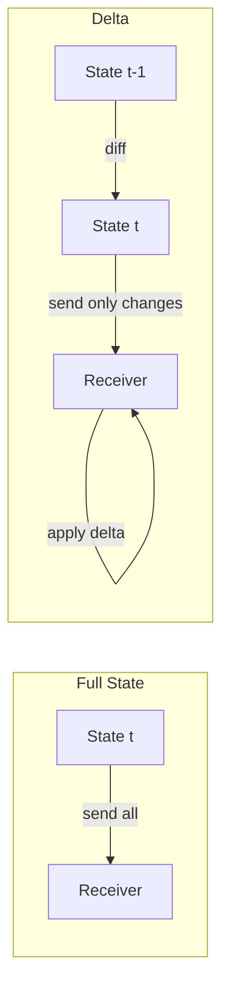
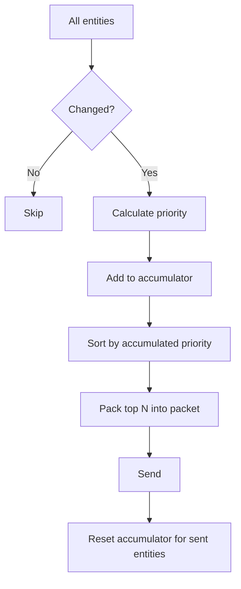
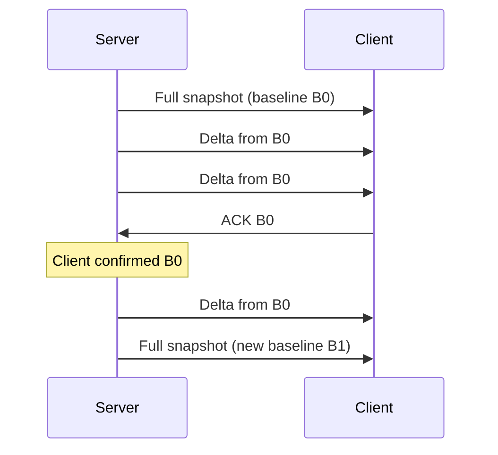
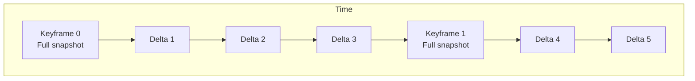
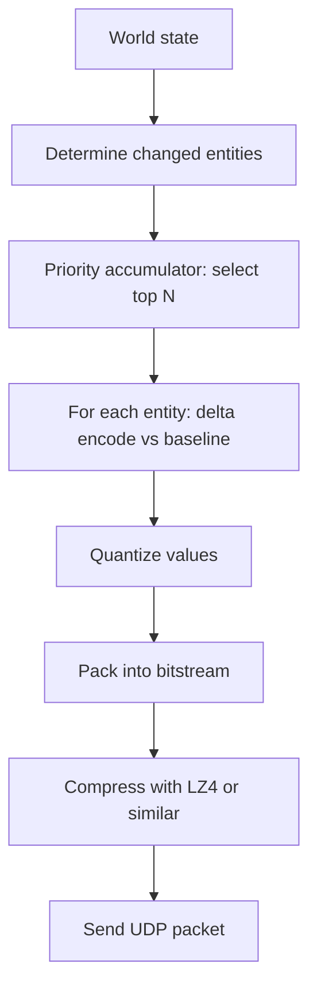

# Delta Compression

Sending the **full state** every tick wastes bandwidth when only a small part of the world changes. **Delta compression** means sending only **changes** (deltas) relative to a previous state or a baseline. This section covers the motivation, techniques (selective updates, delta encoding, XOR trick, priority accumulator), baseline management, and ties it to **CSI** (incremental replication, log-based sync) and **GPR** (selective updates, bandwidth vs accuracy).

## Why Deltas?

If the full game state is 1 KB and you send it 20 times per second, that's 20 KB/s per client. With 64 players, that's 1.28 MB/s of upload from the server — just for state. If only 10% of the state changes per tick on average, sending **deltas** can reduce that to a small fraction.

### The Numbers

| Approach            | Per-client per tick   | Per-client per second (20 Hz) | 64 clients per second |
| ------------------- | --------------------- | ----------------------------- | --------------------- |
| Full state (1 KB)   | 1,000 bytes           | 20,000 bytes                  | 1,280,000 bytes       |
| Delta (10% changed) | ~100 bytes + overhead | ~2,000 bytes                  | 128,000 bytes         |
| Delta + compression | ~50 bytes             | ~1,000 bytes                  | 64,000 bytes          |

That's a **10–20x** bandwidth reduction. For large worlds (MMOs, battle royale with 100 players), deltas are essential.



## Selective Updates (Fiedler)

Glenn Fiedler's [State Synchronization](https://gafferongames.com/post/state_synchronization/) emphasizes:

- **Send state** (position, velocity, orientation) so receivers can extrapolate between updates.
- **Send only what changed:** Per object, send updates only when the object moved or changed; skip objects at rest or unchanged.
- **Prioritize:** Send the most important or most visible objects more often (e.g., nearby players vs distant ones).

That's **selective updates** — a form of delta in the sense of "only changed objects" and often "only changed fields."

### How Selective Updates Work

```
for each entity in world:
    if entity.hasChanged():
        changedEntities.add(entity)

packet = createPacket()
for each entity in changedEntities:
    packet.write(entity.id, entity.changedFields)

send(packet)
```

The server tracks a **dirty flag** per entity (or per field). When an entity changes, it's marked dirty. At send time, only dirty entities are included. After sending, flags are cleared.

## Delta Encoding: Send Differences

**Delta encoding** in the strict sense: store or send the **difference** between current and previous value, not the full value.

### Integer Delta

For a position that changes slowly:

| Tick | Full value | Delta from previous |
| ---- | ---------- | ------------------- |
| 0    | 1000       | — (baseline)        |
| 1    | 1003       | +3                  |
| 2    | 1005       | +2                  |
| 3    | 1005       | 0 (unchanged)       |
| 4    | 1008       | +3                  |

Full value needs 16 bits (range 0–65535). Delta needs only 4–8 bits (range -128 to +127) — a 2–4x saving per field.

Use **variable-length encoding** (like Protocol Buffers' varint) to encode small deltas in fewer bytes and large deltas in more bytes.

### Floating-Point Delta

For floats, delta encoding is trickier because subtraction introduces floating-point noise. Options:

- **Quantize first, then delta:** Convert float to fixed-point integer (e.g., position in millimeters as int32), then delta-encode the integers.
- **Threshold:** If the delta is below a threshold (e.g., 0.001), send nothing (treat as unchanged).

## The XOR Trick for Binary State

If state is a fixed-size block of bytes:

```
delta = state_new XOR state_old
```

On the receiver:

```
state_new = state_old XOR delta
```

When few bits change, `delta` is mostly zeros and compresses extremely well with any standard compression algorithm (zlib, LZ4, etc.).

### Worked Example

```
state_old = [0x41, 0x42, 0x43, 0x44, 0x45]  // "ABCDE"
state_new = [0x41, 0x42, 0x63, 0x44, 0x45]  // "ABcDE" (one byte changed)

delta     = [0x00, 0x00, 0x20, 0x00, 0x00]  // XOR: only byte 2 differs
```

The delta is 80% zeros. After compression, this might be just 3–5 bytes instead of 5.

::: tip "XOR trick for networked state"

If state is a fixed-size block of bytes, then `delta = state_new XOR state_old`. On the receiver: `state_new = state_old XOR delta`. When few bits change, `delta` is sparse and compresses very well. See [Demofox: Compressing Networked State Data](https://blog.demofox.org/2018/06/04/a-neat-trick-for-compressing-networked-state-data/).

:::

## Priority Accumulator

Not all entities are equally important. A **priority accumulator** (Fiedler) decides which entities to include in each packet:

1. Each entity has a **priority** (based on distance, visibility, importance).
2. Each tick, accumulate priority for entities that were **not** sent last tick.
3. Sort by accumulated priority; send the top N that fit in the packet.
4. Reset accumulator for sent entities.

This ensures:

- **Nearby / important** entities are sent almost every tick.
- **Distant / less important** entities are sent less often but still eventually.
- **Bandwidth stays within budget** regardless of entity count.



### Priority Factors

| Factor                 | Weight         | Rationale                                    |
| ---------------------- | -------------- | -------------------------------------------- |
| Distance to player     | High (inverse) | Nearby objects matter most                   |
| Velocity / change rate | Medium         | Fast-moving objects need frequent updates    |
| Gameplay importance    | High           | The ball in a sports game, the flag in CTF   |
| Time since last sent   | Accumulates    | Prevents starvation of low-priority entities |
| Visibility             | High           | Off-screen objects can be updated less often |

## Baseline Management

Delta encoding requires both sender and receiver to agree on a **baseline** (the "old" state to diff against). This creates challenges:

### The Baseline Problem



- **Server** must remember what baseline each client has acknowledged.
- **If a delta packet is lost** (UDP), the client's state diverges. Options:
  - **Resend delta from last acked baseline:** Safe but may be large if many ticks passed.
  - **Send periodic full snapshots:** Expensive but guarantees recovery.
  - **Redundant deltas:** Include deltas from the last 2–3 baselines; client uses whichever it has.

### Quake 3 Approach

Quake 3 Arena used a clean baseline system:

1. Server sends full snapshot as baseline.
2. Each subsequent packet is a delta from the **last acknowledged snapshot**.
3. Client ACKs each received snapshot.
4. Server always deltas from the **last ACKed** snapshot, so lost packets don't cause divergence — the next delta is just larger.

This is simple, robust, and widely copied.

## Snapshot + Delta Architecture

Many games use a hybrid approach:

1. **Full snapshot** sent to new clients (or periodically for recovery).
2. **Delta updates** sent every tick, referencing the last acknowledged snapshot.
3. **Periodic key frames:** Full snapshots at regular intervals (e.g., every 5 seconds) to limit worst-case delta size and enable late join.



This is analogous to **video compression** (I-frames and P-frames): keyframes are I-frames (full picture), deltas are P-frames (differences from previous).

## CSI: Incremental Replication and Log-Based Sync

In distributed systems, "delta" shows up as:

### Incremental Replication

- **Row-level replication:** Only replicate changed rows (e.g., MySQL binlog, PostgreSQL WAL).
- **Byte-level replication:** Only replicate changed bytes (e.g., rsync algorithm).
- **Change data capture (CDC):** Stream a log of changes from a database to downstream consumers.

### Log-Based Sync

- **Write-ahead log (WAL):** Database writes operations to a log before applying. Replicas apply the same log entries in order.
- **Event sourcing:** Store a log of **events** (not current state). Current state is derived by replaying events. Deltas are the events themselves.
- **Kafka / message queues:** Producers write events; consumers read and apply them. Same pattern as "server sends deltas, client applies them."

### Comparison

| Game networking                    | Distributed systems                        |
| ---------------------------------- | ------------------------------------------ |
| Full snapshot                      | Full database dump / pg_dump               |
| Delta update                       | WAL entry / binlog event                   |
| Baseline (last acked snapshot)     | Replication offset / consumer offset       |
| Lost packet → resend from baseline | Consumer falls behind → replay from offset |
| Periodic keyframe                  | Periodic checkpoint / snapshot             |

Same idea: avoid resending unchanged data; send changes or operations.

## GPR: Bandwidth vs Accuracy

Game developers face a constant tradeoff:

### Approaches Compared

| Approach                         | Bandwidth | Accuracy                  | Complexity         | When to use                    |
| -------------------------------- | --------- | ------------------------- | ------------------ | ------------------------------ |
| Full state every tick            | Highest   | Perfect                   | Lowest             | Prototyping, < 4 players       |
| Selective updates (changed only) | Medium    | Perfect for sent entities | Low                | Most games                     |
| Delta encoding (field diffs)     | Low       | Perfect                   | Medium             | Many entities, tight bandwidth |
| Delta + quantization             | Lowest    | Approximate               | High               | Competitive, 64+ players       |
| Input sync (no state)            | Minimal   | Perfect if deterministic  | High (determinism) | RTS, fighting games            |

### Quantization Recap (from Week 06)

Reduce bits per value to save bandwidth. Often combined with deltas:

- **Position:** 10 bits per axis instead of 32-bit float (1024 values in a range).
- **Rotation:** Smallest-three quaternion encoding (29 bits instead of 128).
- **Health:** 7 bits (0–127) instead of 32-bit int.

Quantization and delta encoding are **complementary**: quantize first (fewer bits per value), then delta-encode (fewer non-zero bits), then compress (fewer bytes on the wire).

## Putting It All Together

A typical modern game server's send pipeline:



Each step reduces the data:

- **Changed entities:** Skip unchanged (e.g., 1000 entities → 100 changed).
- **Priority:** Select top 30 that fit in packet.
- **Delta:** Only changed fields (e.g., 20 bytes per entity → 5 bytes).
- **Quantize:** Fewer bits per value.
- **Compress:** Exploit remaining redundancy.

Result: a world with 1000 entities can be synchronized in a few hundred bytes per tick.
