# Week 10: HTTP — The Application-Layer Protocol

---

## Today's Agenda

1. HTTP Fundamentals — where HTTP sits in the stack
2. HTTP Messages — request and response anatomy
3. Methods and Status Codes — the verbs and outcomes
4. URLs, Headers, and Content Negotiation
5. REST Architectural Constraints
6. HTTP Caching — freshness, validation, ETags
7. HTTP Evolution — 1.0 → 1.1 → 2 → 3
8. HTTP in C++ with Boost.Beast

---

## Recap: Distributed State Sync

Last week we solved **who decides what's true** — server authority, client prediction, reconciliation, delta compression.

Now we need the **protocol** that carries all of that data between client and server.

Everything around real-time gameplay — authentication, matchmaking, leaderboards, inventory — uses **HTTP**.

---

## Part 1: HTTP Fundamentals

---

## What is HTTP?

**HyperText Transfer Protocol** — a stateless, text-based, client-server protocol at the application layer.

- Created by Tim Berners-Lee in 1991 for the World Wide Web
- Now used for **everything**: APIs, mobile apps, IoT, game backends
- The most widely used application-layer protocol on the internet

---

## HTTP in the Network Stack

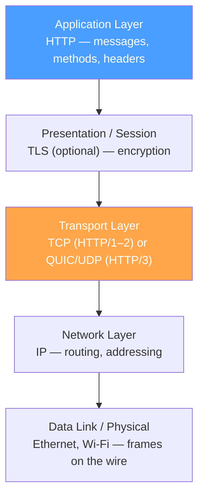

HTTP doesn't deal with bytes on the wire. It relies on **TCP** (or QUIC) to deliver a reliable byte stream.

---

## Where Does HTTP Fit in Our Course?

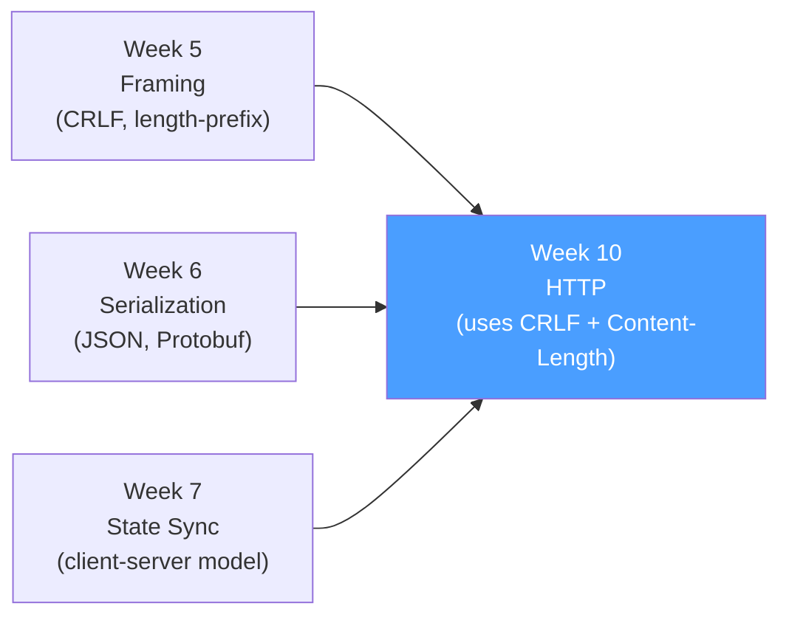

HTTP is a **concrete application** of everything we've studied:

- **Framing**: CRLF delimiters for headers, Content-Length for body
- **Serialization**: JSON is the dominant body format
- **Client-Server**: HTTP defines the request/response pattern

---

## The Request/Response Cycle

Every HTTP interaction follows one pattern: **client sends request → server returns response**.

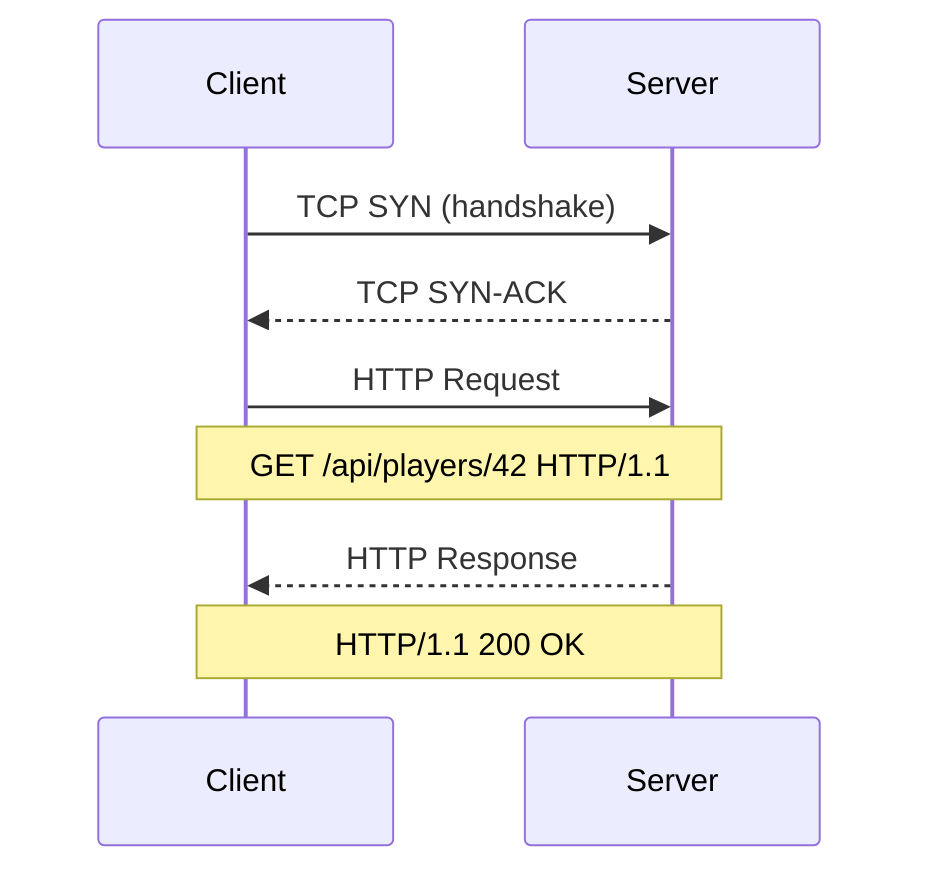

---

## Request/Response — Key Rules

1. **TCP connection first** — HTTP requires a transport connection before any application data flows

2. **Client always initiates** — the server cannot push unsolicited messages

3. **One request → one response** — each request maps to exactly one response

4. **Text-based** (HTTP/1.x) — you can read the protocol with your eyes

---

## Statelessness

HTTP is **stateless**: the server does not remember anything about previous requests.

Each request must carry **all the context** the server needs.

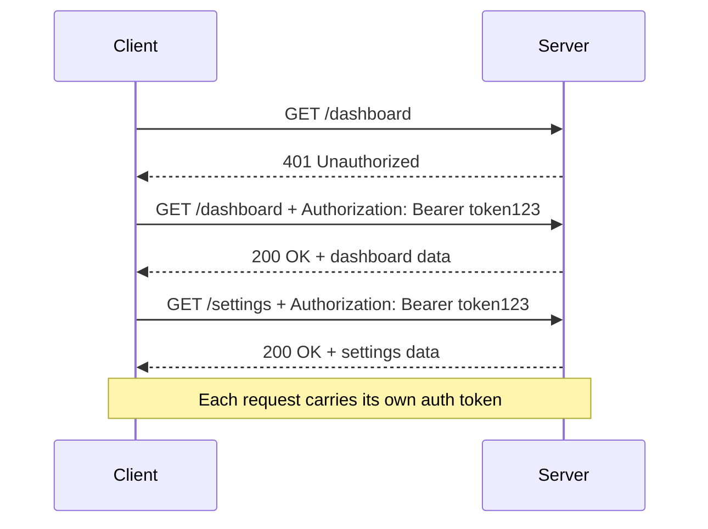

---

## Why Statelessness?

| Benefit          | Explanation                                                         |
| ---------------- | ------------------------------------------------------------------- |
| **Scalability**  | Any server in a pool can handle any request — no session affinity   |
| **Reliability**  | If a server crashes, retry on another server without losing context |
| **Cacheability** | Responses don't depend on server-side session state                 |
| **Simplicity**   | Server doesn't need session storage infrastructure                  |

---

## Stateless Protocol ≠ No Application State

Applications need state (shopping carts, login sessions, game lobbies).

HTTP pushes state into the **request itself**:

| Mechanism        | Header / Location       | Example                               |
| ---------------- | ----------------------- | ------------------------------------- |
| **Cookies**      | `Set-Cookie` / `Cookie` | `Cookie: session=abc123`              |
| **Tokens**       | `Authorization`         | `Authorization: Bearer eyJ...`        |
| **URL params**   | Query string            | `/api/games?page=2&sort=rating`       |
| **Request body** | POST/PUT body           | `{"player_id": 42, "action": "move"}` |

The **protocol** is stateless; the **application** manages state on top of it.

---

## How HTTP Uses Framing (Week 5 Connection)

In Week 5, we studied four framing strategies. HTTP uses a **combination**:

| HTTP Component      | Framing Strategy       | Details                                            |
| ------------------- | ---------------------- | -------------------------------------------------- |
| Request/Status line | Delimiter (`\r\n`)     | `GET /path HTTP/1.1\r\n`                           |
| Headers             | Delimiter (`\r\n`)     | `Host: example.com\r\n` — blank line ends them     |
| Body (fixed)        | Length-prefix          | `Content-Length: 42` then exactly 42 bytes         |
| Body (chunked)      | Combined               | `[hex-length]\r\n[chunk]\r\n` — delimiter + length |
| HTTP/2 frames       | Length-prefix (binary) | 9-byte frame header with 24-bit length field       |

This is the **TLV pattern** from Week 5 — text delimiters for human-readable parts, binary length-prefix for performance-critical parts.

---

## CSI ↔ GPR: Where HTTP Applies

| CSI (Distributed Systems)    | GPR (Game Programming)                        |
| ---------------------------- | --------------------------------------------- |
| REST APIs for microservices  | Game backend APIs (auth, matchmaking, scores) |
| CDN content delivery         | Asset downloads, patch distribution           |
| Web application frontends    | Web-based game clients, admin dashboards      |
| Webhook notifications        | Server-to-server event notifications          |
| Health checks and monitoring | Server status endpoints                       |

---

## The Client-Server Model

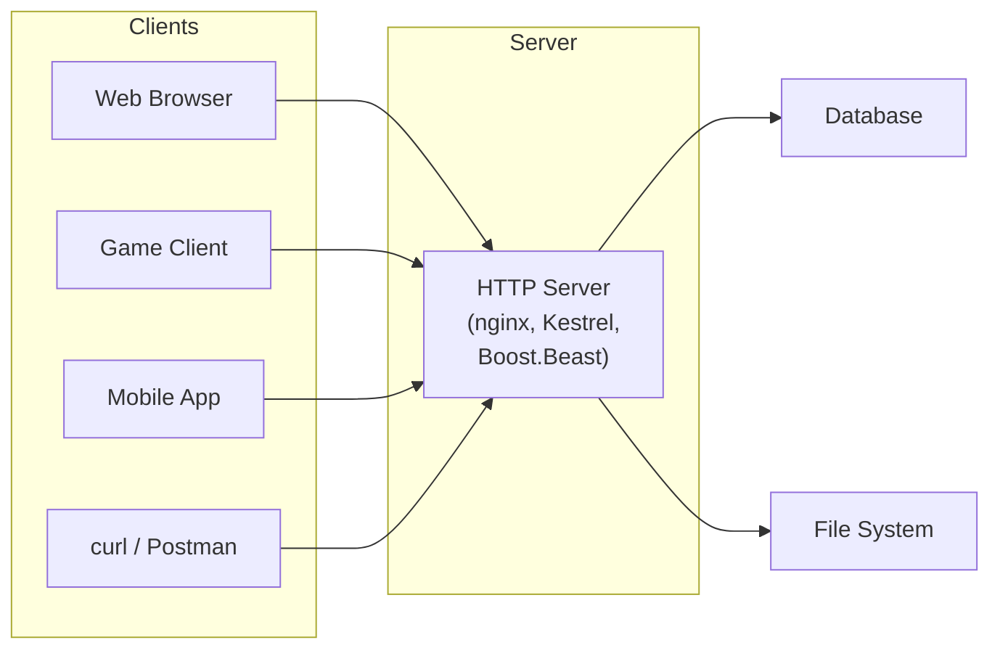

---

## HTTP for Game Backends

Game backends expose HTTP APIs for everything **around** real-time gameplay:

```
POST   /auth/login              → Authentication
POST   /matchmaking/queue       → Join a match queue
GET    /leaderboards/global     → Fetch leaderboard
GET    /players/42/inventory    → Player inventory
POST   /players/42/purchase     → Buy an item
PATCH  /players/42/settings     → Update settings
```

Real-time gameplay uses UDP or WebSocket. Everything else uses HTTP.

---

## Part 2: HTTP Messages

---

## Message Structure Overview

Both requests and responses share the same structure:

```
┌──────────────────────────────────────┐
│          Start Line                  │  ← Request-line or Status-line
├──────────────────────────────────────┤
│          Headers                     │  ← Key: Value pairs
│          (zero or more)              │
├──────────────────────────────────────┤
│          Empty Line (\r\n)           │  ← Separator
├──────────────────────────────────────┤
│          Body (optional)             │  ← Payload data
└──────────────────────────────────────┘
```

The entire header section uses **CRLF delimiters** (`\r\n`) — the delimiter-based framing from Week 5.

---

## The Request Message


---

## Request Line Anatomy

The first line of a request has three parts separated by spaces:

```
GET /api/players/42 HTTP/1.1\r\n
│    │                │
│    │                └─ Protocol version
│    └─ Request target (URI path + query)
└─ HTTP method (verb)
```

- **Method**: What operation (GET, POST, PUT, DELETE)
- **Target**: Which resource (`/api/players/42`)
- **Version**: Which HTTP version (`HTTP/1.1`)

---

## Raw GET Request

What actually goes over TCP when you `curl http://api.example.com/players/42`:

```http
GET /players/42 HTTP/1.1\r\n
Host: api.example.com\r\n
User-Agent: curl/8.4.0\r\n
Accept: */*\r\n
\r\n
```

- Four lines of text, each ending with `\r\n`
- Blank line signals "headers are done"
- **No body** — GET requests typically don't have one

---

## Raw POST Request

A POST with a JSON body:

```http
POST /players HTTP/1.1\r\n
Host: api.example.com\r\n
Content-Type: application/json\r\n
Content-Length: 27\r\n
\r\n
{"name":"Alice","score":99}
```

- `Content-Type` tells the server **how** to parse the body
- `Content-Length` tells the server **how many bytes** to read
- Body follows the blank line

---

## Try It Yourself

```bash
# See the raw HTTP conversation
curl -v http://httpbin.org/get

# Lines starting with > are YOUR request
# Lines starting with < are the RESPONSE
```

```
> GET /get HTTP/1.1
> Host: httpbin.org
> User-Agent: curl/8.4.0
> Accept: */*
>
< HTTP/1.1 200 OK
< Content-Type: application/json
< Content-Length: 256
```

---

## The Response Message


---

## Status Line Anatomy

The first line of a response:

```
HTTP/1.1 200 OK\r\n
│        │   │
│        │   └─ Reason phrase (human-readable)
│        └─ Status code (3-digit integer)
└─ Protocol version
```

- **Version**: Which HTTP version the server speaks
- **Status code**: Machine-readable outcome (200, 404, 500)
- **Reason phrase**: Human-readable label (optional in HTTP/2+)

---

## Raw Response Example

```http
HTTP/1.1 200 OK\r\n
Content-Type: application/json\r\n
Content-Length: 51\r\n
Cache-Control: max-age=60\r\n
\r\n
{"id":42,"name":"Alice","score":1500}
```

Same structure: status line → headers → blank line → body.

---

## Headers: Key-Value Metadata

Headers carry metadata. Format: `Name: Value\r\n`

**Names are case-insensitive** (`Content-Type` = `content-type` = `CONTENT-TYPE`).

---

## Common Request Headers

| Header           | Purpose                              | Example                          |
| ---------------- | ------------------------------------ | -------------------------------- |
| `Host`           | Target server (required in HTTP/1.1) | `Host: api.example.com`          |
| `Accept`         | Content types client understands     | `Accept: application/json`       |
| `Content-Type`   | Media type of the request body       | `Content-Type: application/json` |
| `Content-Length` | Size of the body in bytes            | `Content-Length: 27`             |
| `Authorization`  | Authentication credentials           | `Authorization: Bearer eyJ...`   |
| `User-Agent`     | Client software identifier           | `User-Agent: GameClient/1.0`     |

---

## Common Response Headers

| Header           | Purpose                         | Example                          |
| ---------------- | ------------------------------- | -------------------------------- |
| `Content-Type`   | Media type of the response body | `Content-Type: application/json` |
| `Content-Length` | Size of the response body       | `Content-Length: 51`             |
| `Set-Cookie`     | Store state on the client       | `Set-Cookie: session=abc123`     |
| `Location`       | Redirect target URL             | `Location: /players/42`          |
| `Cache-Control`  | Caching directives              | `Cache-Control: max-age=3600`    |
| `ETag`           | Resource version identifier     | `ETag: "v1-abc123"`              |

---

## The Body

The body is separated from headers by an **empty line** (`\r\n\r\n`).

Not all messages have a body:

| Has Body?         | Requests          | Responses                        |
| ----------------- | ----------------- | -------------------------------- |
| **Typically yes** | POST, PUT, PATCH  | 200 OK, 201 Created              |
| **Typically no**  | GET, HEAD, DELETE | 204 No Content, 304 Not Modified |

---

## How Does the Receiver Know Body Length?

This is a **framing problem** — exactly what we studied in Week 5!

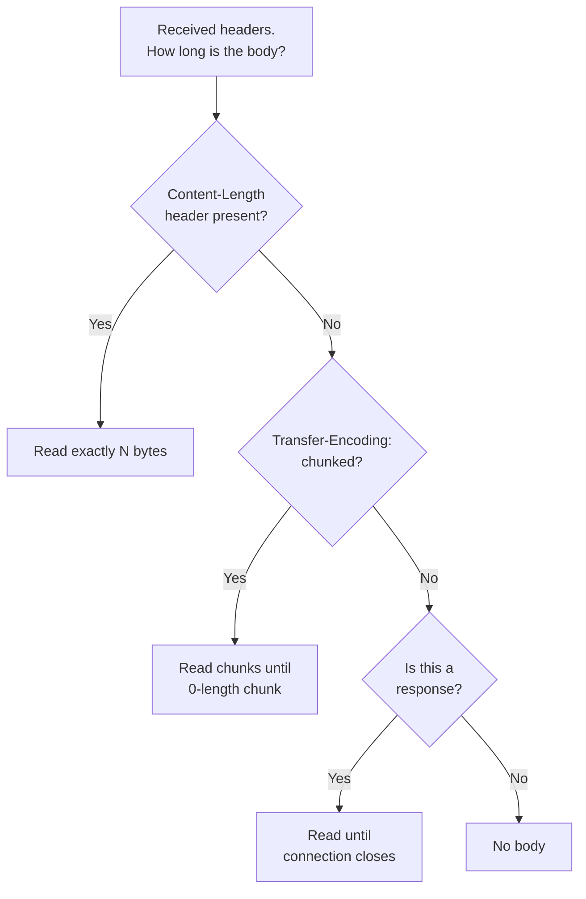

---

## Chunked Transfer Encoding

When the server doesn't know the body size in advance:

```http
HTTP/1.1 200 OK
Transfer-Encoding: chunked

1a\r\n
This is the first chunk\r\n
1c\r\n
And this is the second one\r\n
0\r\n
\r\n
```

- Each chunk: `[hex-length]\r\n[data]\r\n`
- Final chunk: `0\r\n\r\n`
- This is **delimiter + length-prefix** — combined framing from Week 5!

---

## Message Parsing Flow

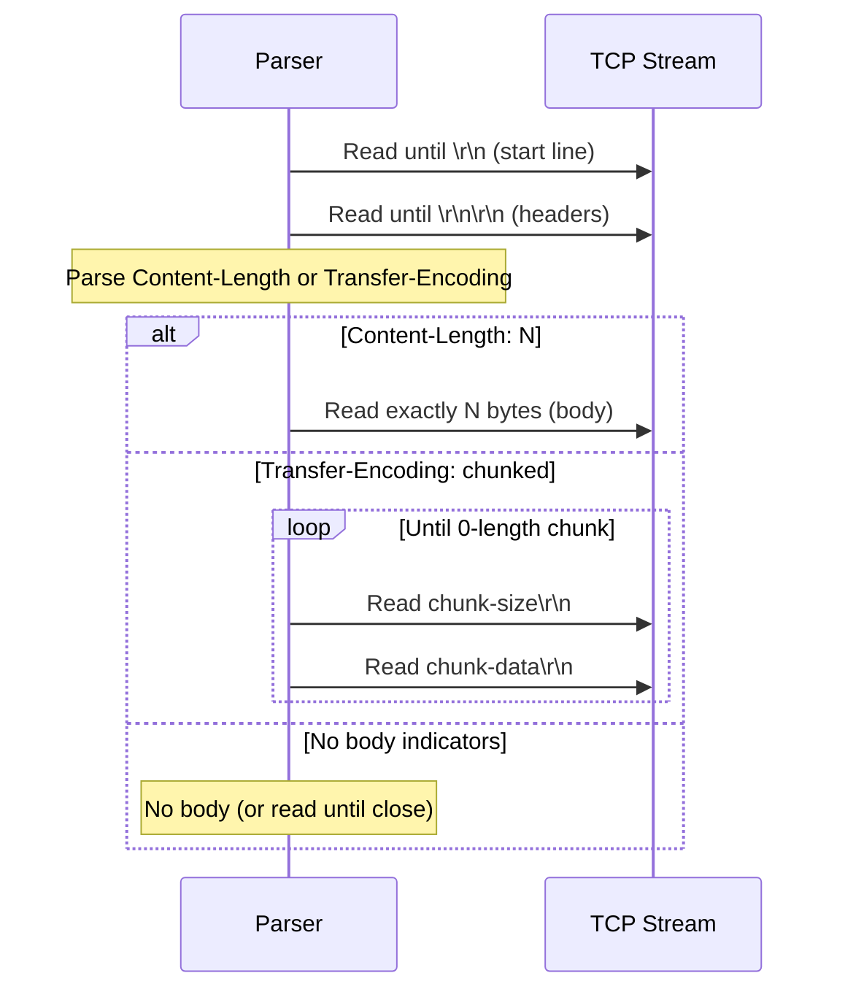

---

## Part 3: Methods and Status Codes

---

## HTTP Methods: The Verbs of HTTP

Methods define **what operation** the client wants to perform on a resource.

Think of them as the **verbs** in a sentence:

- `GET /players/42` → "**Read** player 42"
- `POST /players` → "**Create** a new player"
- `DELETE /players/42` → "**Delete** player 42"

---

## The Core Five Methods (CRUD)

| Method   | CRUD    | Semantics                   | Body?  | Idempotent? | Safe? |
| -------- | ------- | --------------------------- | ------ | ----------- | ----- |
| `GET`    | Read    | Retrieve a resource         | No     | Yes         | Yes   |
| `POST`   | Create  | Submit data for processing  | Yes    | **No**      | No    |
| `PUT`    | Replace | Replace a resource entirely | Yes    | Yes         | No    |
| `PATCH`  | Update  | Partially modify a resource | Yes    | **No**      | No    |
| `DELETE` | Delete  | Remove a resource           | Rarely | Yes         | No    |

---

## Safe vs Idempotent

Two critical properties for understanding HTTP methods:

**Safe**: The request doesn't change server state.

- `GET` and `HEAD` are safe — calling them has no side effects
- You can `GET /players` a million times without changing anything

**Idempotent**: Calling it N times = calling it once.

- `PUT` and `DELETE` are idempotent
- `DELETE /players/42` twice → player 42 is still deleted
- `PUT /players/42` twice with same body → same result

---

## POST Is Neither Safe Nor Idempotent

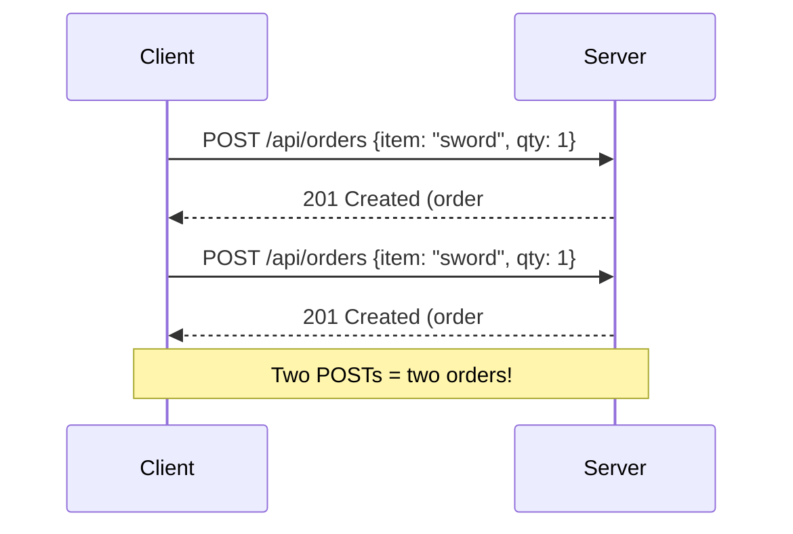

Each `POST` creates a **new** resource. This is why payment APIs use idempotency keys.

---

## CRUD Mapping: Player API Example

```
POST   /api/players          → Create a new player
GET    /api/players           → List all players
GET    /api/players/42        → Get player 42
PUT    /api/players/42        → Replace player 42 entirely
PATCH  /api/players/42        → Update player 42's score
DELETE /api/players/42        → Delete player 42
```

The **resource** (`/api/players/42`) is the noun.  
The **method** (`GET`, `PUT`, `DELETE`) is the verb.

---

## Method Decision Flowchart

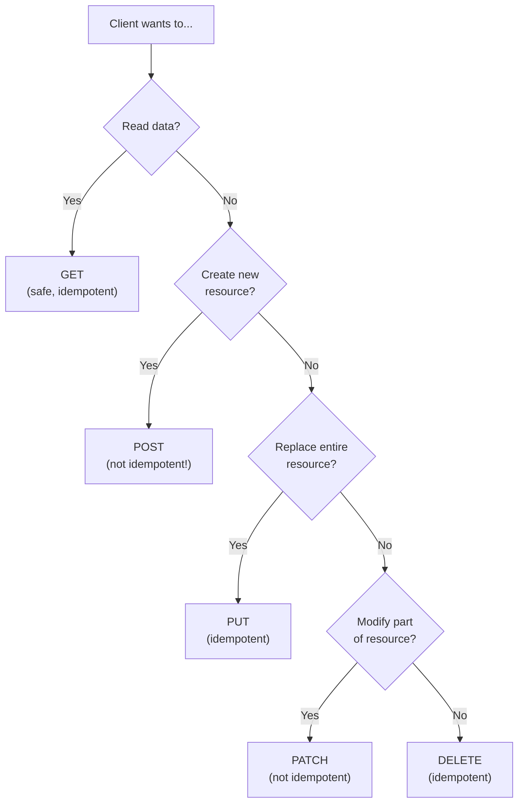

---

## Diagnostic Methods

| Method    | Purpose                                                          |
| --------- | ---------------------------------------------------------------- |
| `HEAD`    | Same as GET but **no body** — check if resource exists, get size |
| `OPTIONS` | What methods does the server support? Used in CORS preflight     |
| `TRACE`   | Echo the request back — debug proxy chains (usually disabled)    |

---

## Status Codes: The Server's Answer

Status codes are **3-digit integers** grouped into five families by their first digit.

---

## The Five Families

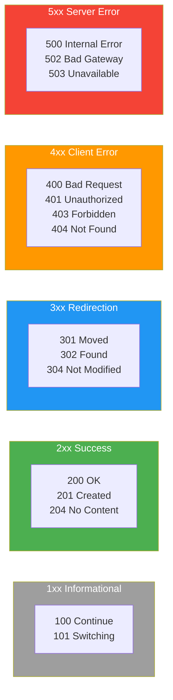

---

## 2xx: Success

| Code  | Name       | When to Use                                             |
| ----- | ---------- | ------------------------------------------------------- |
| `200` | OK         | Request succeeded, response has a body                  |
| `201` | Created    | POST created a new resource — include `Location` header |
| `204` | No Content | Success, but no body (e.g., after DELETE)               |

```http
HTTP/1.1 201 Created
Location: /api/players/42
Content-Type: application/json

{"id": 42, "name": "Alice"}
```

---

## 3xx: Redirection

| Code  | Name              | When to Use                                           |
| ----- | ----------------- | ----------------------------------------------------- |
| `301` | Moved Permanently | Resource has a new permanent URI — update bookmarks   |
| `302` | Found             | Temporary redirect — keep using original URI          |
| `304` | Not Modified      | Cached version is still valid (ETags — covered later) |

```http
HTTP/1.1 301 Moved Permanently
Location: https://api.newdomain.com/players/42
```

---

## 4xx: Client Error

| Code  | Name                 | When to Use                                     |
| ----- | -------------------- | ----------------------------------------------- |
| `400` | Bad Request          | Malformed syntax or invalid parameters          |
| `401` | Unauthorized         | Authentication required (you're not logged in)  |
| `403` | Forbidden            | Authenticated but not authorized                |
| `404` | Not Found            | Resource doesn't exist                          |
| `409` | Conflict             | Conflicts with current state (duplicate name)   |
| `422` | Unprocessable Entity | Well-formed but semantic errors (invalid email) |
| `429` | Too Many Requests    | Rate limit exceeded                             |

---

## 401 vs 403: The Classic Confusion

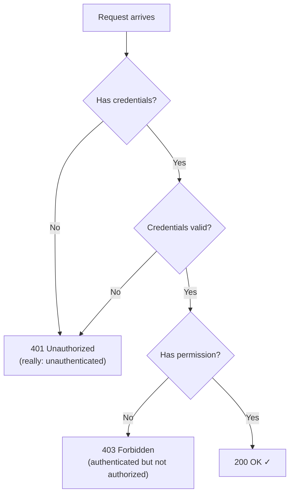

- **401** = "I don't know who you are" → send credentials
- **403** = "I know who you are, but you can't do this" → no amount of auth helps

---

## 5xx: Server Error

| Code  | Name                  | When to Use                             |
| ----- | --------------------- | --------------------------------------- |
| `500` | Internal Server Error | Server bug — unhandled exception        |
| `502` | Bad Gateway           | Proxy/LB got bad response from upstream |
| `503` | Service Unavailable   | Server overloaded or in maintenance     |

These are **never the client's fault**. If you see 5xx, the server has a bug.

---

## CSI ↔ GPR: Status Code Use Cases

| Scenario           | CSI Context                 | GPR Context         | Status Code |
| ------------------ | --------------------------- | ------------------- | ----------- |
| Resource found     | Database record returned    | Player data fetched | 200         |
| New record created | User registered             | Character created   | 201         |
| Duplicate detected | Unique constraint violation | Username taken      | 409         |
| Permission denied  | Insufficient role           | Not guild leader    | 403         |
| Service overloaded | Load spike                  | Server full         | 503         |

---

## Anti-Patterns to Avoid

```http
# ❌ Using 200 for errors (hiding the real status)
HTTP/1.1 200 OK
{"error": true, "message": "Player not found"}

# ✅ Using the right status code
HTTP/1.1 404 Not Found
{"message": "Player 42 not found"}
```

```http
# ❌ Using POST for everything
POST /api/getPlayer
{"id": 42}

# ✅ Using GET for reads
GET /api/players/42
```

---

## Part 4: URLs, Headers, and Content Negotiation

---

## URL Structure

A URL (Uniform Resource Locator) identifies **what** we're talking about:

```
https://api.example.com:8080/players/42?fields=name,score#profile
└─┬──┘ └──────┬───────┘└─┬─┘└────┬────┘└───────┬────────┘└──┬───┘
scheme    authority    port    path           query       fragment
```

---

## URL Components

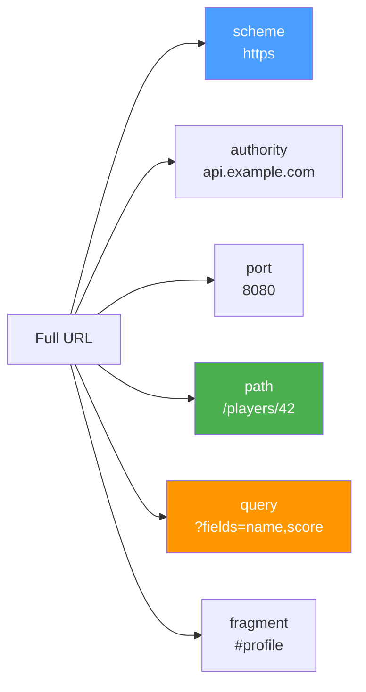

---

## Component Details

| Component     | Purpose                    | Example              | Sent to Server?       |
| ------------- | -------------------------- | -------------------- | --------------------- |
| **Scheme**    | Protocol to use            | `https`, `http`      | Implied by connection |
| **Authority** | Server hostname            | `api.example.com`    | Via `Host` header     |
| **Port**      | TCP port (default: 80/443) | `:8080`              | Via `Host` header     |
| **Path**      | Resource identifier        | `/players/42`        | Yes, in request line  |
| **Query**     | Parameters / filters       | `?page=2&sort=score` | Yes, in request line  |
| **Fragment**  | Client-side anchor         | `#section-3`         | **No** — never sent   |

**Key insight**: The fragment (`#profile`) is **never sent to the server**. It's processed entirely by the client.

---

## URL Encoding

URLs can only contain ASCII characters. Special characters must be **percent-encoded**:

| Character | Encoded      | When to Encode                                 |
| --------- | ------------ | ---------------------------------------------- |
| space     | `%20` or `+` | Always in paths, `+` common in query values    |
| `/`       | `%2F`        | Only when it's data, not a path separator      |
| `?`       | `%3F`        | Only when it's data, not the query delimiter   |
| `&`       | `%26`        | Only when it's data, not a parameter separator |
| `#`       | `%23`        | Always (otherwise starts a fragment)           |
| `+`       | `%2B`        | When literal `+` is needed in query values     |

Example: `GET /search?q=C%2B%2B+games&lang=en` → searches for "C++ games"

---

## URLs in C++ with Boost.URL

```cpp
#include <boost/url.hpp>

int main() {
    // Parse a URL
    auto r = boost::urls::parse_uri(
        "https://api.example.com/players/42?fields=name,score"
    );
    auto url = r.value();

    std::cout << "Scheme: " << url.scheme()    << "\n"; // https
    std::cout << "Host:   " << url.host()      << "\n"; // api.example.com
    std::cout << "Path:   " << url.path()      << "\n"; // /players/42
    std::cout << "Query:  " << url.query()     << "\n"; // fields=name,score

    // Build a URL programmatically
    boost::urls::url u;
    u.set_scheme("https");
    u.set_host("api.example.com");
    u.set_path("/players");
    u.set_query("page=2&sort=score");
    // Result: https://api.example.com/players?page=2&sort=score
}
```

---

## Header Categories

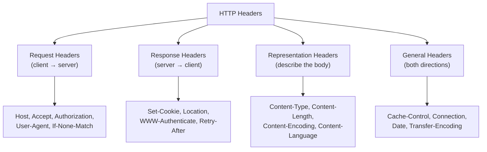

---

## Essential Request Headers

```http
Host: api.example.com           ← Required in HTTP/1.1 (virtual hosting)
Accept: application/json        ← "I want JSON back"
Authorization: Bearer eyJ...    ← Authentication token
Content-Type: application/json  ← "My body is JSON"
Content-Length: 42              ← Body size in bytes
User-Agent: GameClient/1.0      ← Who is calling
X-Tenant-Id: org-123            ← Custom app header
```

---

## Essential Response Headers

```http
Content-Type: application/json; charset=utf-8  ← Body format
Content-Length: 512                             ← Body size
Location: /api/players/42                      ← New resource URI
Cache-Control: max-age=3600, public            ← Caching rules
ETag: "v2-abc123"                              ← Version fingerprint
Set-Cookie: session=xyz; HttpOnly; Secure      ← State management
```

---

## Custom Headers and the X- Prefix

Historically, custom headers used `X-` prefix:

```http
X-Tenant-Id: org-123          ← Multi-tenant context
X-Request-Id: abc-def-123     ← Request tracing
X-RateLimit-Remaining: 42     ← Rate limit info
```

RFC 6648 deprecated the `X-` convention, but it's still widely used.

The `X-Tenant-Id` header in the GameGuild API follows this pattern.

---

## Content Negotiation

Client and server **agree on the format** of a resource:

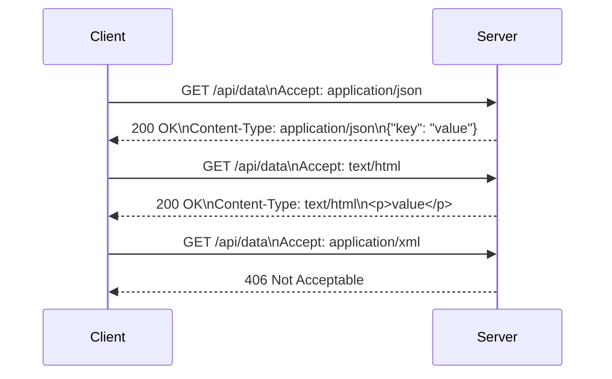

---

## Accept Header with Quality Weights

```http
Accept: application/json, text/html;q=0.9, */*;q=0.1
```

- `application/json` — quality 1.0 (default, highest priority)
- `text/html;q=0.9` — quality 0.9 (acceptable fallback)
- `*/*;q=0.1` — anything else at quality 0.1 (last resort)

The server picks the highest-quality format it supports.

---

## Common MIME Types

| MIME Type                           | Used For                 |
| ----------------------------------- | ------------------------ |
| `application/json`                  | REST APIs, config data   |
| `text/html`                         | Web pages                |
| `text/plain`                        | Plain text, logs         |
| `application/octet-stream`          | Raw binary data          |
| `multipart/form-data`               | File uploads             |
| `application/x-www-form-urlencoded` | HTML form submissions    |
| `application/protobuf`              | Protocol Buffer payloads |

---

## CSI ↔ GPR: Header Use Cases

| Header          | CSI Use                        | GPR Use                                   |
| --------------- | ------------------------------ | ----------------------------------------- |
| `Authorization` | Service-to-service JWT         | Player session token                      |
| `Content-Type`  | JSON for REST APIs             | JSON for game state, protobuf for updates |
| `Accept`        | Content negotiation            | Request JSON or binary format             |
| `X-Tenant-Id`   | Multi-tenant SaaS isolation    | Game server / organization ID             |
| `Cache-Control` | CDN caching for static content | Leaderboard caching                       |
| `ETag`          | API versioning                 | Asset version checking                    |

---

## Part 5: REST Architectural Constraints

---

## What is REST?

**Representational State Transfer** — an architectural style, NOT a protocol.

- Defined by Roy Fielding in his 2000 PhD dissertation
- HTTP is the most common protocol for implementing REST
- REST is a set of **constraints** that guide system design
- A system that satisfies all constraints is called **RESTful**

---

## The Six REST Constraints

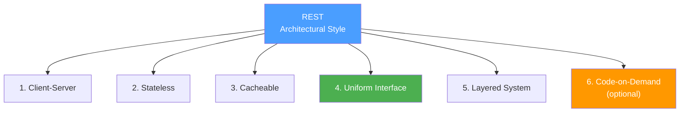

---

## 1. Client-Server Separation

Client and server are **independent**. They evolve separately.

- Server doesn't know how the client renders data
- Client doesn't know how the server stores data
- Either side can be rewritten without affecting the other

```
Game Client (Unity/Unreal)  ←→  HTTP  ←→  Game Backend (.NET/Go)
Web Dashboard (React)       ←→  HTTP  ←→  Same Backend
Mobile App (Swift/Kotlin)   ←→  HTTP  ←→  Same Backend
```

Three clients, one server. Each evolves independently.

---

## 2. Statelessness

Every request contains **all the information** the server needs.

The server doesn't store session state between requests.

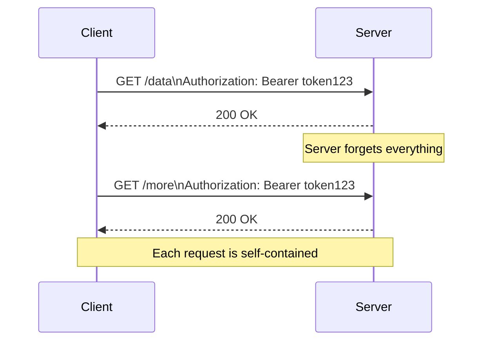

---

## 3. Cacheability

Every response must declare whether it can be cached.

```http
HTTP/1.1 200 OK
Cache-Control: public, max-age=3600
ETag: "v1-abc"
```

This enables CDNs, browser caches, and reverse proxies to serve requests without hitting the origin server.

We'll cover caching in detail in Part 6.

---

## 4. Uniform Interface (Most Important)

The most important — and most violated — constraint. Four sub-constraints:

| Sub-constraint                       | Meaning                                     |
| ------------------------------------ | ------------------------------------------- |
| **Resource identification**          | Resources identified by URIs                |
| **Manipulation via representations** | Modify resources by sending representations |
| **Self-descriptive messages**        | Content-Type tells how to parse the body    |
| **HATEOAS**                          | Responses contain links to related actions  |

---

## Resources, NOT Actions

REST models **nouns** (resources), not **verbs** (actions). The HTTP method is the verb.

```http
✅  GET    /api/players/42        → Resource = player 42
✅  DELETE /api/players/42        → Resource = player 42
❌  POST   /api/deletePlayer      → Action as noun (not RESTful)
❌  GET    /api/getPlayerById/42  → Verb in the path (not RESTful)
```

---

## HATEOAS: Hypermedia Links

Responses include links to available actions:

```json
{
  "id": 42,
  "name": "Alice",
  "score": 1500,
  "_links": {
    "self": { "href": "/api/players/42" },
    "inventory": { "href": "/api/players/42/inventory" },
    "guild": { "href": "/api/guilds/7" },
    "update": { "href": "/api/players/42", "method": "PATCH" },
    "delete": { "href": "/api/players/42", "method": "DELETE" }
  }
}
```

The client discovers URIs from responses — no hardcoded paths.

---

## 5. Layered System

The client shouldn't know whether it's talking to the server directly or through intermediaries:

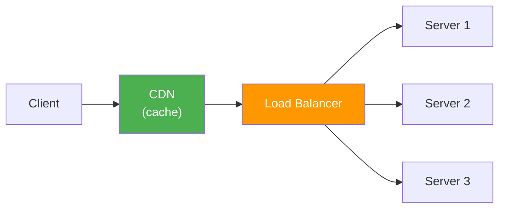

Each layer only sees its neighbors. CDN caches. LB distributes. Servers process.

---

## 6. Code-on-Demand (Optional)

Server can send executable code (JavaScript) to extend client functionality.

- Common in web browsers (every website sends JS)
- Rare in API clients or game backends
- The only **optional** REST constraint

---

## Richardson Maturity Model

Martin Fowler's classification of API maturity:

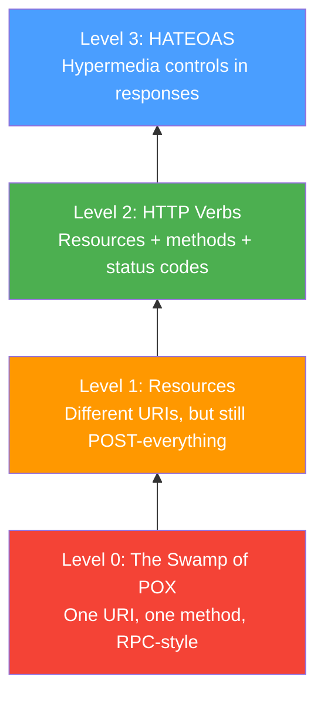

---

## Level 0: RPC over HTTP

One endpoint, one method, everything in the body:

```http
POST /api HTTP/1.1
Content-Type: application/json

{"action": "getPlayer", "id": 42}
```

HTTP is just a **transport tunnel**. This is SOAP, XML-RPC, or ad-hoc JSON-RPC.

---

## Level 1: Resources

Different URIs for different resources, but everything is still POST:

```http
POST /api/players/42
{"action": "get"}

POST /api/players/42
{"action": "delete"}
```

The URI identifies a resource, but the method doesn't carry semantics.

---

## Level 2: HTTP Verbs (Most APIs Stop Here)

Resources + proper methods + proper status codes:

```http
GET    /api/players/42         → 200 OK
POST   /api/players            → 201 Created
DELETE /api/players/42         → 204 No Content
GET    /api/players/99         → 404 Not Found
```

Most production APIs (PlayFab, Steam Web API, GameGuild) sit at Level 2.

---

## Level 3: HATEOAS

Responses include links to available actions. The client navigates the API like a web browser navigates hyperlinks.

Powerful but adds complexity. Rarely implemented fully.

---

## REST vs RPC: Comparison

| Aspect          | REST (Level 2+)                  | RPC (Level 0)                     |
| --------------- | -------------------------------- | --------------------------------- |
| Focus           | Resources (nouns)                | Actions (verbs)                   |
| URI design      | `/players/42`                    | `/getPlayer`                      |
| Methods         | GET, POST, PUT, DELETE           | Usually just POST                 |
| Status codes    | Semantic (201, 404, 409)         | Usually 200 + error in body       |
| Cacheability    | Built-in via GET + Cache-Control | Manual — difficult to cache POSTs |
| Discoverability | Uniform interface                | Requires documentation            |

---

## CSI ↔ GPR: REST in Practice

| CSI (Enterprise/Web)              | GPR (Game Development)               |
| --------------------------------- | ------------------------------------ |
| Microservice REST APIs            | Game backend REST APIs               |
| Richardson Level 2 is standard    | Level 2 is standard for game APIs    |
| HATEOAS for public APIs           | Rarely used in games                 |
| REST for CRUD, gRPC for streaming | REST for meta-game, UDP for gameplay |
| OpenAPI/Swagger documentation     | Auto-generated clients from spec     |

---

## Part 6: HTTP Caching

---

## Why Caching Matters

```mermaid
flowchart LR
    subgraph Without ["Without Caching"]
        C1["Client"] -->|"GET /lb"| S1["Server"]
        S1 -->|"200 + 50KB"| C1
        C1 -->|"GET /lb"| S1
        S1 -->|"200 + 50KB"| C1
    end

    subgraph With ["With Caching"]
        C2["Client"] -->|"GET /lb"| Cache["Cache"]
        Cache -->|"200 + 50KB"| C2
        C2 -->|"GET /lb"| Cache
        Cache -->|"200 (cached)"| C2
    end

    style Cache fill:#4caf50,color:#fff
```

- Without caching: 2 requests × 100ms = **200ms**, 100KB transferred
- With caching: 1 request + 1 cache hit = **100ms**, 50KB transferred

---

## Cache-Control Header

The primary mechanism for controlling caching behavior.

```http
Cache-Control: public, max-age=3600
```

This single header tells **every cache** between client and server how to behave.

---

## Key Cache-Control Directives

| Directive         | Meaning                                                   |
| ----------------- | --------------------------------------------------------- |
| `max-age=N`       | Fresh for N seconds                                       |
| `no-cache`        | May store, but must **revalidate** before using           |
| `no-store`        | Must **not store** at all (sensitive data)                |
| `public`          | Any cache (browser, CDN, proxy) may store                 |
| `private`         | Only **browser cache** may store (user-specific data)     |
| `must-revalidate` | After max-age expires, must revalidate (no stale serving) |
| `immutable`       | Never changes — don't even bother revalidating            |

---

## Common Cache Patterns

```http
# Static assets (CSS, JS, images) — 1 year, never revalidate
Cache-Control: public, max-age=31536000, immutable

# API response — 60 seconds, anyone can cache
Cache-Control: public, max-age=60

# User-specific data — browser only, 5 minutes
Cache-Control: private, max-age=300

# Sensitive data — NEVER cache
Cache-Control: no-store

# Dynamic content — cache ok, but always check first
Cache-Control: no-cache
```

---

## The no-cache Trap

```mermaid
flowchart LR
    NC["no-cache"] -->|"Does NOT mean"| X["Don't cache ❌"]
    NC -->|"Actually means"| Y["Cache it, but\nvalidate before using ✅"]
    NS["no-store"] -->|"Means"| Z["Don't cache at all ✅"]
```

`no-cache` = "you CAN cache this, but MUST validate with the server before using it"

`no-store` = "do NOT store this response at all"

---

## ETags: Content Fingerprints

An **ETag** (Entity Tag) is a fingerprint of a resource's content:

```http
HTTP/1.1 200 OK
ETag: "abc123"
Content-Type: application/json

{"leaderboard": [...]}
```

The ETag changes when the content changes. It enables **conditional requests**.

---

## Conditional Requests

The client sends the ETag back to ask "has this changed?"

```mermaid
sequenceDiagram
    participant C as Client
    participant S as Server

    C->>S: GET /leaderboard
    S-->>C: 200 OK\nETag: "abc123"\n(50KB body)

    Note over C: Time passes... cache expires

    C->>S: GET /leaderboard\nIf-None-Match: "abc123"
    S-->>C: 304 Not Modified\n(no body!)

    Note over C,S: Saved 50KB! Client uses cached copy.
```

---

## Conditional Request Headers

| Request Header            | Response Header       | Purpose                      |
| ------------------------- | --------------------- | ---------------------------- |
| `If-None-Match: "etag"`   | `ETag: "etag"`        | Compare content fingerprints |
| `If-Modified-Since: date` | `Last-Modified: date` | Compare modification times   |

**ETag-based** validation is more precise (content hash) and is preferred.

---

## Practical Example with curl

```bash
# First request — get the ETag
$ curl -v https://api.example.com/leaderboard
< HTTP/1.1 200 OK
< ETag: "abc123"
< Cache-Control: max-age=60

# After max-age expires — conditional request
$ curl -v -H 'If-None-Match: "abc123"' \
    https://api.example.com/leaderboard
< HTTP/1.1 304 Not Modified
# No body! Saved bandwidth.
```

---

## Freshness vs Validation

HTTP caching has two phases:

```mermaid
flowchart TD
    A["Client wants /resource"] --> B{"Cached copy\nexists?"}
    B -->|No| C["Send request to server"]
    B -->|Yes| D{"Still fresh?\n(within max-age)"}
    D -->|Yes| E["✅ Use cached copy\n(no network!)"]
    D -->|No| F["Send conditional request\n(If-None-Match)"]
    F --> G{"Server says\n304 Not Modified?"}
    G -->|Yes| H["✅ Use cached copy\n(saved body transfer)"]
    G -->|No| I["✅ Use new response\n(update cache)"]

    style E fill:#4caf50,color:#fff
    style H fill:#4caf50,color:#fff
    style I fill:#4caf50,color:#fff
```

**Freshness** avoids the network entirely. **Validation** avoids re-transferring the body.

---

## Where Caches Live

```mermaid
flowchart LR
    C["Client"] --> BC["Browser\nCache\n(private)"]
    BC --> CDN["CDN\n(public)"]
    CDN --> RP["Reverse\nProxy\n(public)"]
    RP --> S["Origin\nServer"]

    style BC fill:#4a9eff,color:#fff
    style CDN fill:#4caf50,color:#fff
    style RP fill:#ff9800,color:#fff
```

| Cache Type            | `Cache-Control`       | Serves              |
| --------------------- | --------------------- | ------------------- |
| **Browser cache**     | `private` or `public` | Single user         |
| **CDN / Proxy cache** | `public` only         | Many users          |
| **Reverse proxy**     | `public` only         | All users of origin |

---

## Never Cache Auth Data Publicly

```http
# ❌ DANGEROUS — serves one user's data to another
GET /api/players/me/inventory
Cache-Control: public, max-age=30

# ✅ SAFE — only the user's browser caches
GET /api/players/me/inventory
Cache-Control: private, max-age=30

# ✅ SAFEST — never store session tokens
GET /api/auth/session
Cache-Control: no-store
```

---

## Caching in Game APIs

| Endpoint                        | Cache Strategy                     | Why                                 |
| ------------------------------- | ---------------------------------- | ----------------------------------- |
| `GET /leaderboard`              | `public, max-age=60`               | Shared data, can be slightly stale  |
| `GET /players/me/inventory`     | `private, max-age=30`              | User-specific, browser-only         |
| `GET /assets/manifest.json`     | `public, max-age=86400, immutable` | Versioned assets never change       |
| `GET /game-config`              | `public, max-age=300`              | Config updates every ~5 min         |
| `POST /auth/login`              | `no-store`                         | Never cache credentials             |
| `GET /players/me/notifications` | `no-cache`                         | Cache but always check for new ones |

---

## CSI ↔ GPR: Caching Patterns

| Aspect           | CSI Context           | GPR Context               |
| ---------------- | --------------------- | ------------------------- |
| CDN caching      | Static website assets | Game asset downloads      |
| ETag validation  | API versioning        | Leaderboard freshness     |
| Private caching  | User dashboard data   | Player inventory/profile  |
| Immutable assets | Hashed CSS/JS bundles | Versioned game patches    |
| no-store         | Banking/medical data  | Auth tokens, session data |

---

## Part 7: Evolution of HTTP

---

## HTTP Version Timeline

```mermaid
flowchart LR
    H09["HTTP/0.9\n1991\nOne-line protocol"] --> H10["HTTP/1.0\n1996\nHeaders, methods,\nstatus codes"]
    H10 --> H11["HTTP/1.1\n1997\nPersistent connections,\nchunked encoding"]
    H11 --> H2["HTTP/2\n2015\nBinary framing,\nmultiplexing"]
    H2 --> H3["HTTP/3\n2022\nQUIC/UDP,\n0-RTT"]

    style H09 fill:#9e9e9e,color:#fff
    style H10 fill:#ff9800,color:#fff
    style H11 fill:#4caf50,color:#fff
    style H2 fill:#4a9eff,color:#fff
    style H3 fill:#9c27b0,color:#fff
```

Each version solved performance problems from the previous one.

---

## HTTP/1.0 (1996): The Foundation

Introduced the request/response model: methods, headers, status codes, content types.

**The problem**: every request required a **new TCP connection**.

---

## HTTP/1.0: Connection-Per-Request

```mermaid
sequenceDiagram
    participant C as Client
    participant S as Server

    C->>S: TCP handshake #1
    C->>S: GET /index.html
    S-->>C: 200 OK + HTML
    Note over C,S: Connection closed

    C->>S: TCP handshake #2
    C->>S: GET /style.css
    S-->>C: 200 OK + CSS
    Note over C,S: Connection closed

    C->>S: TCP handshake #3
    C->>S: GET /app.js
    S-->>C: 200 OK + JS
    Note over C,S: Connection closed
```

3 resources = 3 TCP handshakes = **~300ms wasted** on handshakes alone.

---

## HTTP/1.1 (1997): Persistent Connections

HTTP/1.1 solved connection-per-request with **keep-alive** (persistent connections by default).

```mermaid
sequenceDiagram
    participant C as Client
    participant S as Server

    C->>S: TCP handshake (once!)
    C->>S: GET /index.html
    S-->>C: 200 OK + HTML
    C->>S: GET /style.css
    S-->>C: 200 OK + CSS
    C->>S: GET /app.js
    S-->>C: 200 OK + JS
    Note over C,S: 3 resources, 1 handshake!
```

---

## Key HTTP/1.1 Features

| Feature                       | What It Solved                                       |
| ----------------------------- | ---------------------------------------------------- |
| **Persistent connections**    | No more connection-per-request overhead              |
| **`Host` header** (required)  | Virtual hosting — multiple domains on one IP         |
| **Chunked transfer encoding** | Stream responses of unknown length                   |
| **Pipelining**                | Send multiple requests without waiting for responses |
| **`100 Continue`**            | Ask "should I send this body?" before committing     |

---

## HTTP/1.1 Pipelining: Great Idea, Broken in Practice

Pipelining lets the client send multiple requests without waiting. But the server must respond **in order** (FIFO).

```
Client sends:  GET /fast.css  GET /slow-query  GET /tiny.js
Server queue:  [fast.css ✓]  [slow-query ⏳]  [tiny.js ⏸ waiting]
                                                  ↑ BLOCKED!
```

A slow response blocks all subsequent ones. This is **Head-of-Line (HoL) blocking**.

---

## Head-of-Line Blocking Visualized

```mermaid
flowchart TD
    subgraph Pipeline ["HTTP/1.1 Pipeline"]
        R1["Request 1\n(fast)"] --> Res1["Response 1 ✓"]
        R2["Request 2\n(SLOW)"] --> Res2["Response 2 ⏳"]
        R3["Request 3\n(fast)"] --> Res3["Response 3 ⏸\n(blocked by #2)"]
    end

    style Res2 fill:#f44336,color:#fff
    style Res3 fill:#ff9800,color:#fff
```

Browsers worked around this by opening **6–8 parallel TCP connections** per server. But each connection has its own TLS handshake and congestion window.

---

## HTTP/2 (2015): Binary Framing and Multiplexing

HTTP/2 kept the same semantics (methods, headers, status codes) but replaced text with **binary framing**.

---

## HTTP/2 Binary Frame Structure

```mermaid
packet-beta
0-23: "Length (24 bits)"
24-31: "Type (8 bits)"
32-39: "Flags (8 bits)"
40: "R"
41-71: "Stream Identifier (31 bits)"
72-103: "Frame Payload..."
```

Every piece of data is wrapped in a **frame** — this is length-prefixed binary framing from Week 5!

---

## HTTP/2 Frame Types

| Frame Type      | Purpose                                     |
| --------------- | ------------------------------------------- |
| `HEADERS`       | Request/response headers (HPACK compressed) |
| `DATA`          | Request/response body                       |
| `SETTINGS`      | Connection configuration                    |
| `PUSH_PROMISE`  | Server push (deprecated)                    |
| `GOAWAY`        | Graceful connection shutdown                |
| `RST_STREAM`    | Cancel a single stream                      |
| `WINDOW_UPDATE` | Flow control                                |

---

## Multiplexing: The Key Innovation

Multiple **streams** share a single TCP connection. Frames from different streams can be **interleaved**.

```mermaid
sequenceDiagram
    participant C as Client
    participant S as Server

    C->>S: HEADERS (stream 1): GET /style.css
    C->>S: HEADERS (stream 3): GET /app.js
    C->>S: HEADERS (stream 5): GET /data.json

    S-->>C: DATA (stream 3): app.js chunk 1
    S-->>C: DATA (stream 1): style.css (complete)
    S-->>C: DATA (stream 5): data.json (complete)
    S-->>C: DATA (stream 3): app.js chunk 2

    Note over C,S: No head-of-line blocking at HTTP level!
```

---

## HPACK Header Compression

HTTP/1.1 headers are verbose and repetitive. HPACK compresses them:

1. **Static table**: 61 common header-value pairs (`:method: GET`, `:status: 200`)
2. **Dynamic table**: previously seen headers indexed by number
3. **Huffman encoding**: compress header values

| Format   | Typical Header Size | Compression Ratio |
| -------- | ------------------- | ----------------- |
| HTTP/1.1 | 500–800 bytes       | 1x (baseline)     |
| HTTP/2   | 20–50 bytes         | ~10–15x           |

---

## HTTP/2 Solves HoL at HTTP Level...

With multiplexing, a slow response on stream 3 doesn't block streams 1 and 5.

**...but NOT at the TCP level.**

If a single TCP packet is lost, **ALL streams** on that connection stall until TCP retransmits it.

```mermaid
flowchart TD
    P["TCP Packet Lost!"] --> S1["Stream 1 ⏸"]
    P --> S3["Stream 3 ⏸"]
    P --> S5["Stream 5 ⏸"]
    Note["All streams blocked\nuntil TCP retransmits"] --> P

    style P fill:#f44336,color:#fff
```

This is **TCP-level HoL blocking** — and it's what HTTP/3 fixes.

---

## HTTP/3 (2022): QUIC and UDP

HTTP/3 replaces TCP with **QUIC** — a transport protocol built on UDP.

---

## Protocol Stack Comparison

```mermaid
flowchart TB
    subgraph HTTP2 ["HTTP/2 Stack"]
        H2A["HTTP/2"] --> H2T["TLS 1.2/1.3"]
        H2T --> H2TCP["TCP"]
        H2TCP --> H2U["IP"]
    end

    subgraph HTTP3 ["HTTP/3 Stack"]
        H3A["HTTP/3"] --> H3Q["QUIC\n(includes TLS 1.3)"]
        H3Q --> H3U["UDP"]
        H3U --> H3IP["IP"]
    end

    style H2TCP fill:#ff9800,color:#fff
    style H3Q fill:#4caf50,color:#fff
```

QUIC integrates TLS 1.3 directly — encryption is mandatory and built-in.

---

## Why QUIC?

| Problem                | TCP (HTTP/2)                             | QUIC (HTTP/3)                                     |
| ---------------------- | ---------------------------------------- | ------------------------------------------------- |
| HoL blocking           | TCP packet loss blocks ALL streams       | Each stream independent — loss affects one stream |
| Connection setup       | TCP handshake + TLS handshake = 2–3 RTTs | Combined handshake = **1 RTT** (0-RTT on resume)  |
| Connection migration   | IP change = new connection               | Connection ID survives IP changes (Wi-Fi → cell)  |
| Encryption             | Optional (TLS is separate layer)         | **Mandatory** — TLS 1.3 built-in                  |
| Middlebox interference | Middleboxes can inspect/modify TCP       | Encrypted — middleboxes can't interfere           |

---

## 0-RTT Connection Resumption

```mermaid
sequenceDiagram
    participant C as Client
    participant S as Server

    Note over C,S: First connection: 1-RTT
    C->>S: QUIC Initial + TLS ClientHello
    S-->>C: QUIC Handshake + TLS ServerHello
    C->>S: HTTP Request (ready!)

    Note over C,S: Subsequent connection: 0-RTT
    C->>S: QUIC Initial + TLS + HTTP Request
    S-->>C: HTTP Response
    Note over C,S: Data sent immediately!
```

---

## Per-Stream Loss Recovery

```mermaid
flowchart TD
    subgraph TCP ["TCP (HTTP/2)"]
        L1["Packet lost in\nStream 3"] --> B1["ALL streams\nblocked ⏸"]
    end

    subgraph QUIC ["QUIC (HTTP/3)"]
        L2["Packet lost in\nStream 3"] --> B2["Stream 3\nblocked ⏸"]
        L2 --> B3["Stream 1 ✓"]
        L2 --> B4["Stream 5 ✓"]
    end

    style B1 fill:#f44336,color:#fff
    style B2 fill:#ff9800,color:#fff
    style B3 fill:#4caf50,color:#fff
    style B4 fill:#4caf50,color:#fff
```

QUIC provides **independent loss recovery per stream** — no more TCP-level HoL blocking.

---

## HTTP Version Comparison

| Feature            | HTTP/1.0    | HTTP/1.1   | HTTP/2          | HTTP/3            |
| ------------------ | ----------- | ---------- | --------------- | ----------------- |
| Year               | 1996        | 1997       | 2015            | 2022              |
| Transport          | TCP         | TCP        | TCP             | **QUIC (UDP)**    |
| Connections        | One per req | Persistent | Multiplexed     | Multiplexed       |
| Wire format        | Text        | Text       | **Binary**      | **Binary**        |
| Header compression | None        | None       | **HPACK**       | **QPACK**         |
| HoL blocking       | N/A         | HTTP-level | TCP-level       | **None**          |
| Encryption         | Optional    | Optional   | Practically req | **Mandatory**     |
| Connection setup   | 1 RTT+      | 1 RTT      | 2-3 RTTs        | **1 RTT / 0-RTT** |

---

## CSI ↔ GPR: HTTP Versions

| Aspect                    | CSI Context                          | GPR Context                              |
| ------------------------- | ------------------------------------ | ---------------------------------------- |
| HTTP/1.1                  | Legacy APIs, simple services         | Basic game API integration               |
| HTTP/2                    | Modern web services, gRPC            | Asset delivery, API multiplexing         |
| HTTP/3                    | CDN edge delivery, mobile-first apps | Low-latency game services, mobile gaming |
| QUIC connection migration | Mobile users switching networks      | Players switching Wi-Fi ↔ cellular       |

---

## Part 8: HTTP in C++ with Boost.Beast

---

## Why Boost.Beast?

We've been using Boost.Asio for TCP all semester. **Boost.Beast** adds HTTP on top of Asio.

```mermaid
flowchart TB
    App["Your Application"] --> Beast["Boost.Beast\nHTTP messages, parsers,\nserializers"]
    Beast --> Asio["Boost.Asio\nSockets, I/O, async"]
    Asio --> OS["Operating System\nTCP/UDP sockets"]

    style Beast fill:#4a9eff,color:#fff
    style Asio fill:#ff9800,color:#fff
```

Beast doesn't manage connections — it provides the **HTTP layer** on top of Asio streams.

---

## HTTP Message Types

```cpp
#include <boost/beast/http.hpp>
namespace http = boost::beast::http;

// Request
http::request<http::string_body> req;
req.method(http::verb::get);
req.target("/api/players/42");
req.version(11); // HTTP/1.1
req.set(http::field::host, "api.example.com");
req.set(http::field::accept, "application/json");

// Response
http::response<http::string_body> res;
res.result(http::status::ok); // 200
res.set(http::field::content_type, "application/json");
res.body() = R"({"id":42,"name":"Alice"})";
res.prepare_payload(); // Sets Content-Length
```

---

## Body Types

| Body Type            | Use Case                                          |
| -------------------- | ------------------------------------------------- |
| `http::string_body`  | JSON, text — body is `std::string`                |
| `http::file_body`    | Serve files from disk without loading into memory |
| `http::empty_body`   | No body (GET, HEAD, 204 responses)                |
| `http::dynamic_body` | Streaming — body is `beast::multi_buffer`         |
| `http::buffer_body`  | Manual control — you manage the buffer            |

---

## Synchronous HTTP Client

```cpp
#include <boost/beast/core.hpp>
#include <boost/beast/http.hpp>
#include <boost/asio/connect.hpp>
#include <boost/asio/ip/tcp.hpp>

namespace beast = boost::beast;
namespace http  = beast::http;
namespace net   = boost::asio;
using tcp       = net::ip::tcp;
```

Same Asio includes we've used since Week 4!

---

## HTTP Client: Setup and Connect

```cpp
int main() {
    std::string host = "api.example.com";
    std::string port = "80";
    std::string target = "/api/players/42";

    // 1. Create I/O context and resolve hostname
    net::io_context ioc;
    tcp::resolver resolver(ioc);
    auto results = resolver.resolve(host, port);

    // 2. Connect (using Beast's tcp_stream)
    beast::tcp_stream stream(ioc);
    stream.connect(results);
```

---

## HTTP Client: Send Request and Read Response

```cpp
    // 3. Build the HTTP request
    http::request<http::empty_body> req{
        http::verb::get, target, 11
    };
    req.set(http::field::host, host);
    req.set(http::field::user_agent, "GameClient/1.0");

    // 4. Send the request
    http::write(stream, req);

    // 5. Read the response
    beast::flat_buffer buffer;
    http::response<http::string_body> res;
    http::read(stream, buffer, res);

    // 6. Use the response
    std::cout << res.result_int() << " "
              << res.reason() << "\n";
    std::cout << res.body() << "\n";
```

---

## Compare with Raw TCP (Week 4)

| Step          | Raw TCP (Week 4)           | Beast HTTP (Week 10)              |
| ------------- | -------------------------- | --------------------------------- |
| Create socket | `tcp::socket`              | `beast::tcp_stream`               |
| Connect       | `socket.connect()`         | `stream.connect()`                |
| Send data     | `asio::write(socket, ...)` | `http::write(stream, req)`        |
| Receive data  | `asio::read(socket, ...)`  | `http::read(stream, buffer, res)` |
| Parse data    | **Manual** (you do it!)    | **Automatic** (Beast does it!)    |

Beast adds HTTP parsing on top of the same Asio primitives.

---

## Synchronous HTTP Server

```cpp
http::response<http::string_body>
handle_request(http::request<http::string_body> const& req)
{
    // Route: GET /api/players
    if (req.method() == http::verb::get
        && req.target() == "/api/players")
    {
        http::response<http::string_body> res{
            http::status::ok, req.version()
        };
        res.set(http::field::content_type,
                "application/json");
        res.body() = R"([
            {"id":1,"name":"Alice","score":1500},
            {"id":2,"name":"Bob","score":1200}
        ])";
        res.prepare_payload();
        return res;
    }
```

---

## Server: More Routes

```cpp
    // Route: POST /api/players
    if (req.method() == http::verb::post
        && req.target() == "/api/players")
    {
        // In production: parse JSON body, validate, insert
        http::response<http::string_body> res{
            http::status::created, req.version()
        };
        res.set(http::field::content_type,
                "application/json");
        res.set(http::field::location,
                "/api/players/3");
        res.body() = R"({"id":3,"name":"Charlie"})";
        res.prepare_payload();
        return res;
    }

    // 404 for everything else
    http::response<http::string_body> res{
        http::status::not_found, req.version()
    };
    res.body() = "Not Found";
    res.prepare_payload();
    return res;
}
```

---

## Server: Accept Loop

```cpp
int main() {
    net::io_context ioc;
    tcp::acceptor acceptor{
        ioc, tcp::endpoint(tcp::v4(), 8080)
    };

    while (true) {
        tcp::socket socket(ioc);
        acceptor.accept(socket);

        beast::flat_buffer buffer;
        http::request<http::string_body> req;
        http::read(socket, buffer, req);

        auto res = handle_request(req);
        http::write(socket, res);

        socket.shutdown(tcp::socket::shutdown_send);
    }
}
```

This is single-threaded. Production servers use async or coroutines.

---

## Working with Headers

```cpp
// Setting headers
req.set(http::field::host, "api.example.com");
req.set(http::field::authorization, "Bearer eyJ...");
req.set("X-Tenant-Id", "org-123"); // Custom header

// Reading headers
auto ct = res[http::field::content_type]; // string_view
auto custom = res["X-Request-Id"];        // Custom header

// Iterating all headers
for (auto const& field : res) {
    std::cout << field.name_string() << ": "
              << field.value() << "\n";
}

// Check if header exists
if (res.count(http::field::etag) > 0) {
    auto etag = res[http::field::etag];
}
```

---

## POST with JSON Body

```cpp
http::request<http::string_body> req{
    http::verb::post, "/api/players", 11
};
req.set(http::field::host, "api.example.com");
req.set(http::field::content_type, "application/json");

req.body() = R"({
    "name": "Charlie",
    "score": 0
})";

req.prepare_payload(); // Sets Content-Length

http::write(stream, req);

beast::flat_buffer buffer;
http::response<http::string_body> res;
http::read(stream, buffer, res);

if (res.result() == http::status::created) {
    std::cout << "Created! Location: "
              << res[http::field::location] << "\n";
}
```

---

## URL Parsing with Boost.URL

```cpp
#include <boost/url.hpp>

auto r = boost::urls::parse_uri(
    "https://api.example.com/players?page=2&sort=score"
);
auto url = r.value();

url.scheme();  // "https"
url.host();    // "api.example.com"
url.path();    // "/players"
url.query();   // "page=2&sort=score"

// Iterate query parameters
for (auto param : url.params()) {
    std::cout << param.key << " = "
              << param.value << "\n";
}
// Output: page = 2
//         sort = score
```

---

## Beast vs cpp-httplib

| Feature       | Boost.Beast                     | cpp-httplib                      |
| ------------- | ------------------------------- | -------------------------------- |
| Dependencies  | Boost (Asio, Beast)             | Header-only, no dependencies     |
| Complexity    | More code, more control         | Simple API, less control         |
| Async support | Full (coroutines, callbacks)    | Threading only                   |
| HTTP/2        | No (HTTP/1.1 only)              | No (HTTP/1.1 only)               |
| TLS           | Via Boost.Asio SSL              | Via OpenSSL                      |
| Best for      | Production, existing Boost code | Small projects, quick prototypes |

---

## cpp-httplib: Quick Comparison

```cpp
// cpp-httplib client (much simpler!)
#include "httplib.h"

httplib::Client cli("api.example.com", 80);
auto res = cli.Get("/api/players/42");

if (res && res->status == 200) {
    std::cout << res->body << "\n";
}

// cpp-httplib server
httplib::Server svr;
svr.Get("/api/players", [](auto& req, auto& res) {
    res.set_content("[{\"id\":1}]", "application/json");
});
svr.listen("0.0.0.0", 8080);
```

Much less code, but less control over the connection lifecycle.

---

## When to Use Which?

```mermaid
flowchart TD
    A["Need HTTP in C++?"] --> B{"Already using\nBoost.Asio?"}
    B -->|Yes| C["Boost.Beast\n(same ecosystem)"]
    B -->|No| D{"Need async/\ncoroutines?"}
    D -->|Yes| C
    D -->|No| E{"Quick prototype?"}
    E -->|Yes| F["cpp-httplib\n(header-only, simple)"]
    E -->|No| G{"Production\nperformance?"}
    G -->|Yes| C
    G -->|No| F
```

---

## CSI ↔ GPR: C++ HTTP Libraries

| Aspect             | CSI Context                       | GPR Context                        |
| ------------------ | --------------------------------- | ---------------------------------- |
| Boost.Beast        | High-performance API servers      | Game server HTTP endpoints         |
| cpp-httplib        | Internal tooling, prototypes      | Game tools, quick API integrations |
| Async Beast        | Handling thousands of connections | Game server accepting API and game |
| URL parsing        | REST API routing                  | Dynamic endpoint construction      |
| JSON body handling | RESTful CRUD operations           | Player data, game config endpoints |

---

## Key Takeaways

1. HTTP is a **stateless, text-based, client-server** protocol at the application layer
2. Messages have a **start line → headers → blank line → body** structure
3. Methods define the **verb** (GET, POST, PUT, DELETE); status codes report the **outcome**
4. URLs identify resources; headers carry metadata; content negotiation agrees on format
5. REST is an **architectural style** with 6 constraints — most APIs target Richardson Level 2
6. Caching uses **Cache-Control**, **ETags**, and **conditional requests** to save bandwidth
7. HTTP evolved from 1.0 (connection-per-request) to HTTP/3 (QUIC, 0-RTT, no HoL blocking)
8. Boost.Beast adds HTTP parsing on top of the Boost.Asio primitives we've used all semester

---

## Quick Reference

| Concept                | Key Detail                                             |
| ---------------------- | ------------------------------------------------------ |
| **Request structure**  | `METHOD path HTTP/1.1\r\n` + headers + `\r\n` + body   |
| **Response structure** | `HTTP/1.1 STATUS reason\r\n` + headers + `\r\n` + body |
| **Safe methods**       | GET, HEAD — no side effects                            |
| **Idempotent methods** | GET, HEAD, PUT, DELETE — N calls = 1 call              |
| **2xx**                | Success (200 OK, 201 Created, 204 No Content)          |
| **4xx**                | Client error (400, 401, 403, 404, 429)                 |
| **5xx**                | Server error (500, 502, 503)                           |
| **Cache-Control**      | `max-age`, `no-cache`, `no-store`, `public`, `private` |
| **ETag**               | Content fingerprint for conditional requests (304)     |
| **HTTP/2**             | Binary framing, multiplexing, HPACK compression        |
| **HTTP/3**             | QUIC/UDP, 0-RTT, per-stream loss recovery              |
| **Beast request**      | `http::request<http::string_body>`                     |
| **Beast response**     | `http::response<http::string_body>`                    |
| **Beast send**         | `http::write(stream, req)`                             |
| **Beast receive**      | `http::read(stream, buffer, res)`                      |

---

## Interactive Practice

1. **curl exploration**: Run `curl -v http://httpbin.org/get` — identify request line, headers, status line, response headers

2. **POST request**: `curl -v -X POST http://httpbin.org/post -H "Content-Type: application/json" -d '{"name":"test"}'`

3. **Conditional request**: `curl -v -H 'If-None-Match: "fake-etag"' http://httpbin.org/etag/fake-etag`

4. **Wireshark**: Capture HTTP traffic, filter with `http`, inspect message structure

---

## What's Next?

- **Week 11**: WebSockets — persistent bidirectional connections
- **Week 12**: Security — TLS, HTTPS, authentication protocols
- **Weeks 13–16**: Final project — build a networked application

HTTP gives us the foundation. WebSockets will add the real-time channel on top.

---

## Questions?
