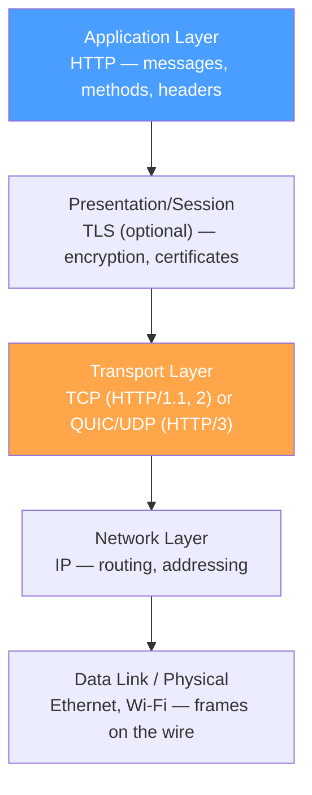
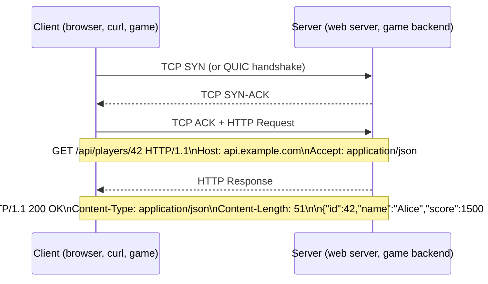
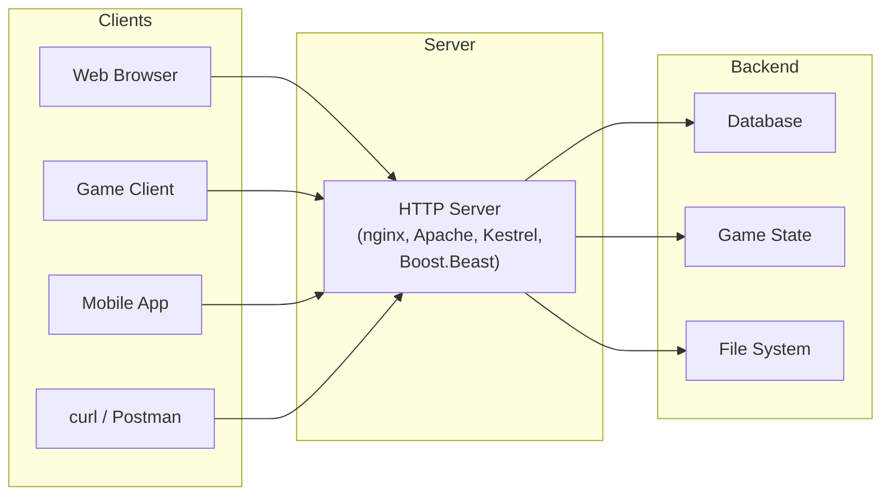

# HTTP Fundamentals

HTTP (HyperText Transfer Protocol) is a **stateless, text-based, client-server** protocol at the application layer. Understanding where HTTP sits in the network stack — and how it leverages the layers we've already built — is essential before diving into message structure and methods.

## HTTP in the Network Stack

HTTP doesn't deal with bytes on the wire. It relies on **TCP** (or QUIC for HTTP/3) to deliver a reliable byte stream, and on your **framing and serialization layers** (Weeks 5–6) to structure that stream. HTTP adds its own framing on top — request lines, headers, and body delimiters — which we'll examine in the next section.

## The Request/Response Cycle

Every HTTP interaction follows the same pattern: the **client** sends a request, and the **server** returns a response.

Key observations:

1. **TCP connection first** — HTTP requires a transport connection before any application data flows
2. **Client always initiates** — the server cannot push unsolicited messages (HTTP/2 server push is an exception, and it's being deprecated)
3. **One request → one response** — each request maps to exactly one response (unlike WebSocket, which we'll cover later)

## Statelessness

HTTP is **stateless**: the server does not remember anything about previous requests. Each request must carry all the context the server needs.

::: tip "Why statelessness?"

- **Scalability**: any server in a pool can handle any request — no session affinity required
- **Reliability**: if a server crashes, the client can retry on a different server without losing context
- **Cacheability**: stateless responses are easier to cache because they don't depend on server-side session state

:::

::: warning "Stateless doesn't mean no state"

Applications need state (shopping carts, login sessions, game lobbies). HTTP solves this by pushing state into the **request itself** via:

- **Cookies**: `Set-Cookie` / `Cookie` headers carry session tokens
- **Tokens**: `Authorization: Bearer <JWT>` headers carry authentication state
- **URL parameters**: `/api/games?page=2&sort=rating` encodes query state

The protocol is stateless; the application manages state on top of it.

:::

## How HTTP Uses Framing (Connection to Week 5)

In Week 5, we studied four framing strategies. HTTP uses a **combination** of them:

| HTTP Component      | Framing Strategy       | Details                                            |
| ------------------- | ---------------------- | -------------------------------------------------- |
| Request/Status line | Delimiter (`\r\n`)     | `GET /path HTTP/1.1\r\n`                           |
| Headers             | Delimiter (`\r\n`)     | `Host: example.com\r\n` ends with blank `\r\n`     |
| Body (fixed)        | Length-prefix          | `Content-Length: 42` then exactly 42 bytes         |
| Body (chunked)      | Combined               | `[hex-length]\r\n[chunk]\r\n` — delimiter + length |
| HTTP/2 frames       | Length-prefix (binary) | 9-byte frame header with 24-bit length field       |

This is exactly the **Type-Length-Value (TLV)** pattern from Week 5 — HTTP just uses text delimiters for the human-readable parts and binary length-prefix for the performance-critical parts.

## The Client-Server Model

The client-server split means:

- **Clients** are concerned with sending requests and rendering responses (UI, display, input)
- **Servers** are concerned with processing requests, accessing data, and building responses
- Either side can be replaced independently — your game client doesn't care if the backend switches from nginx to Boost.Beast

::: tip "Why this matters for games"

Game backends (Nakama, PlayFab, custom servers) expose HTTP APIs for:

- **Authentication**: `POST /auth/login` with credentials
- **Matchmaking**: `POST /matchmaking/queue` to join a queue
- **Leaderboards**: `GET /leaderboards/global?limit=10`
- **Player data**: `GET /players/42/inventory`

Real-time gameplay uses UDP or WebSocket, but everything around it — lobbies, accounts, persistence — often uses HTTP.

:::
