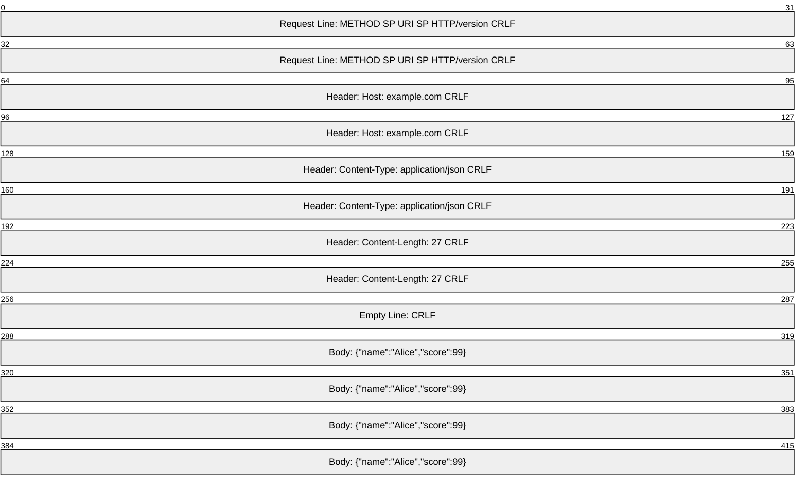
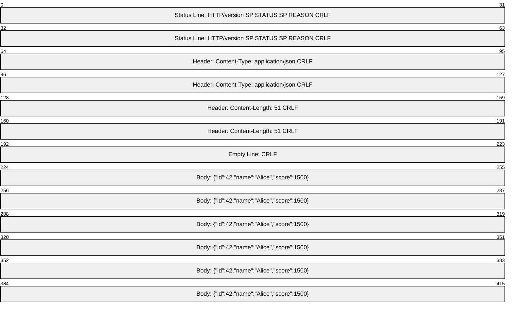
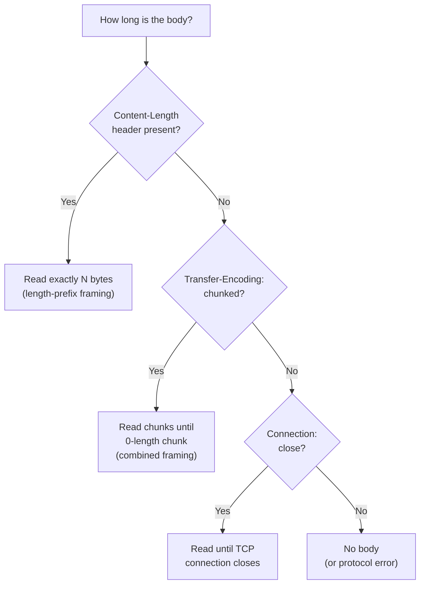
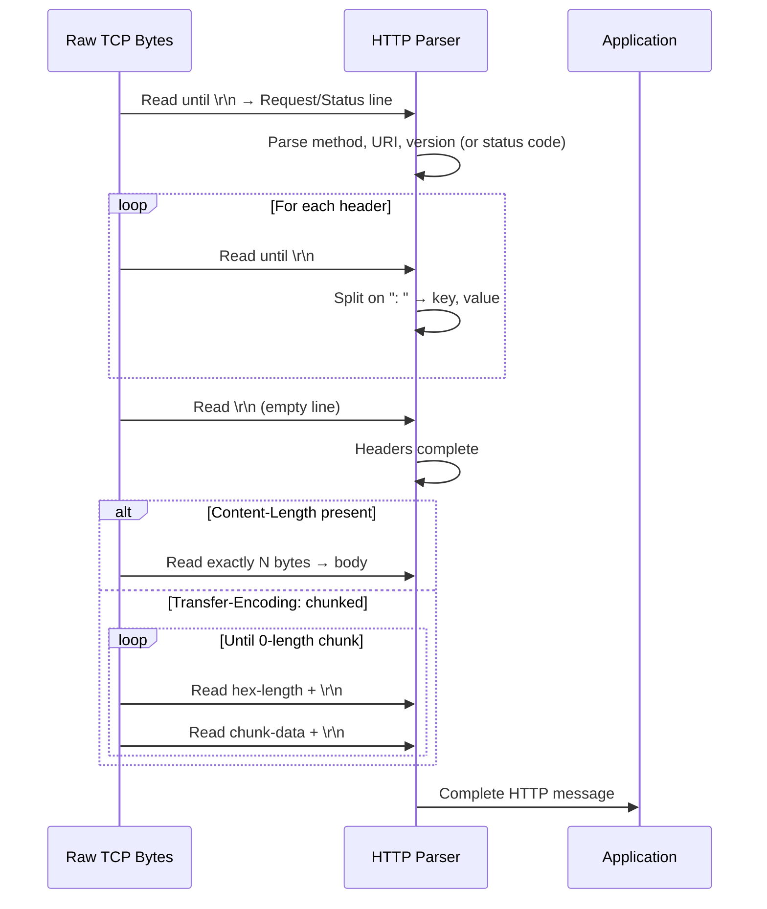

# HTTP Messages: Requests and Responses

Every HTTP interaction consists of exactly two messages: one **request** and one **response**. Understanding the anatomy of these messages is fundamental — they're the packets of the application layer.

## Message Structure Overview

Both requests and responses share the same general structure:

```
┌──────────────────────────────────────┐
│          Start Line                  │  ← Request-line or Status-line
├──────────────────────────────────────┤
│          Headers                     │  ← Key: Value pairs, one per line
│          (zero or more)              │
├──────────────────────────────────────┤
│          Empty Line (\r\n)           │  ← Separates headers from body
├──────────────────────────────────────┤
│          Body (optional)             │  ← Payload data
└──────────────────────────────────────┘
```

The entire header section uses **CRLF delimiters** (`\r\n`) — exactly the delimiter-based framing from Week 5.

## The Request Message



### Request Line

The first line of a request has three parts separated by spaces:

```
GET /api/players/42 HTTP/1.1\r\n
│    │                │
│    │                └─ Protocol version
│    └─ Request target (URI path + query)
└─ HTTP method (verb)
```

### Raw Request Example

Here's what actually goes over TCP when you `curl -X GET http://api.example.com/players/42`:

```http
GET /players/42 HTTP/1.1\r\n
Host: api.example.com\r\n
User-Agent: curl/8.4.0\r\n
Accept: */*\r\n
\r\n
```

And a POST with a body:

```http
POST /players HTTP/1.1\r\n
Host: api.example.com\r\n
Content-Type: application/json\r\n
Content-Length: 27\r\n
\r\n
{"name":"Alice","score":99}
```

::: tip "Try it yourself"

Run `curl -v http://httpbin.org/get` to see the raw request and response. The `-v` flag shows the actual HTTP messages:

- Lines starting with `>` are the request you sent
- Lines starting with `<` are the response you received

:::

## The Response Message



### Status Line

The first line of a response also has three parts:

```
HTTP/1.1 200 OK\r\n
│        │   │
│        │   └─ Reason phrase (human-readable, optional in HTTP/2+)
│        └─ Status code (3-digit integer)
└─ Protocol version
```

### Raw Response Example

```http
HTTP/1.1 200 OK\r\n
Content-Type: application/json\r\n
Content-Length: 51\r\n
Cache-Control: max-age=60\r\n
\r\n
{"id":42,"name":"Alice","score":1500}
```

## Headers

Headers are **key-value pairs** that carry metadata about the request or response. They follow the format `Name: Value\r\n` and are case-insensitive in the name.

### Common Request Headers

| Header           | Purpose                              | Example                          |
| ---------------- | ------------------------------------ | -------------------------------- |
| `Host`           | Target server (required in HTTP/1.1) | `Host: api.example.com`          |
| `Accept`         | Content types the client understands | `Accept: application/json`       |
| `Content-Type`   | Media type of the request body       | `Content-Type: application/json` |
| `Content-Length` | Size of the body in bytes            | `Content-Length: 27`             |
| `Authorization`  | Authentication credentials           | `Authorization: Bearer eyJ...`   |
| `User-Agent`     | Client software identifier           | `User-Agent: GameClient/1.0`     |

### Common Response Headers

| Header           | Purpose                         | Example                          |
| ---------------- | ------------------------------- | -------------------------------- |
| `Content-Type`   | Media type of the response body | `Content-Type: application/json` |
| `Content-Length` | Size of the response body       | `Content-Length: 51`             |
| `Set-Cookie`     | Store state on the client       | `Set-Cookie: session=abc123`     |
| `Location`       | Redirect target URL             | `Location: /players/42`          |
| `Cache-Control`  | Caching directives              | `Cache-Control: max-age=3600`    |
| `ETag`           | Resource version identifier     | `ETag: "v1-abc123"`              |

## The Body

The body is separated from headers by an **empty line** (`\r\n\r\n`). Not all messages have a body:

- **GET**, **HEAD**, **DELETE** requests typically have **no body**
- **POST**, **PUT**, **PATCH** requests typically **have a body**
- Responses with status **204 No Content** or **304 Not Modified** have **no body**

### How the Receiver Knows Body Length

This is a framing problem! HTTP uses three strategies:



### Chunked Transfer Encoding

When the server doesn't know the total body size upfront (streaming, dynamic content):

```http
HTTP/1.1 200 OK\r\n
Transfer-Encoding: chunked\r\n
\r\n
1a\r\n
{"status":"processing",...}\r\n
0\r\n
\r\n
```

Each chunk follows the pattern: `[hex-length]\r\n[data]\r\n`. A zero-length chunk signals the end.

::: warning "HTTP/2 changes the framing"

HTTP/2 replaces the text-based framing with **binary frames**. Headers are compressed (HPACK), and the body is sent as DATA frames with explicit length fields. The logical structure (method, headers, body) stays the same — only the wire encoding changes.

:::

## Parsing Sequence Diagram



This is why HTTP parsers are more complex than simple length-prefix parsers — they combine multiple framing strategies in a single protocol.
