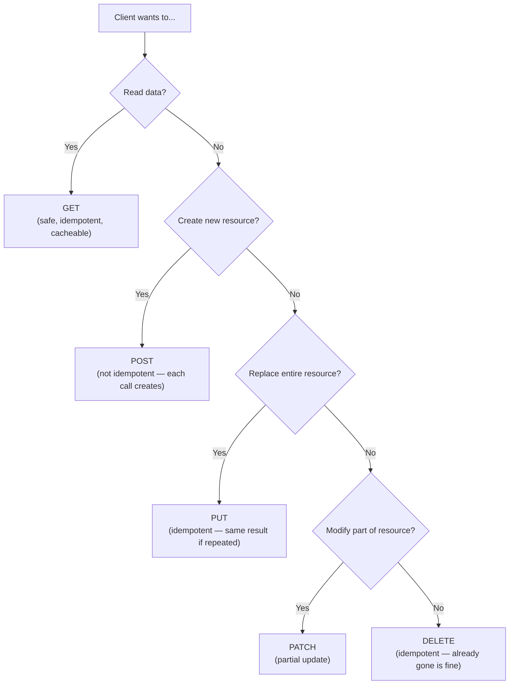
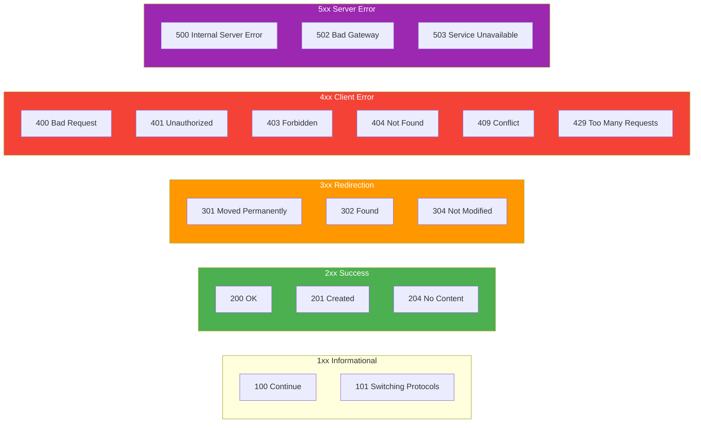

# HTTP Methods and Status Codes

HTTP methods define **what operation** the client wants to perform. Status codes tell the client **what happened**. Together, they form the vocabulary of every HTTP conversation.

## HTTP Methods

### The Core Five (CRUD)

| Method   | CRUD Operation | Semantics                   | Has Body? | Idempotent? | Safe? |
| -------- | -------------- | --------------------------- | --------- | ----------- | ----- |
| `GET`    | Read           | Retrieve a resource         | No        | Yes         | Yes   |
| `POST`   | Create         | Submit data for processing  | Yes       | **No**      | No    |
| `PUT`    | Replace        | Replace a resource entirely | Yes       | Yes         | No    |
| `PATCH`  | Update         | Partially modify a resource | Yes       | **No**      | No    |
| `DELETE` | Delete         | Remove a resource           | Rarely    | Yes         | No    |

::: tip "Safe vs Idempotent"

- **Safe**: The request doesn't change server state. `GET` and `HEAD` are safe — calling them has no side effects.
- **Idempotent**: Calling the method N times has the same effect as calling it once. `PUT` and `DELETE` are idempotent — deleting a player twice still results in that player being deleted.
- `POST` is **neither** safe nor idempotent — each `POST /orders` creates a new order.

:::

### CRUD Mapping Example

A player management API:

```
POST   /api/players          → Create a new player
GET    /api/players           → List all players
GET    /api/players/42        → Get player 42's details
PUT    /api/players/42        → Replace player 42 entirely
PATCH  /api/players/42        → Update player 42's score
DELETE /api/players/42        → Delete player 42
```

### Diagnostic Methods

| Method    | Purpose                                                                                                    |
| --------- | ---------------------------------------------------------------------------------------------------------- |
| `HEAD`    | Same as `GET`, but returns **only headers** (no body). Used to check if a resource exists or get its size. |
| `OPTIONS` | Returns the methods the server supports for a given URI. Used in CORS preflight requests.                  |
| `TRACE`   | Echoes the request back. Used for debugging proxy chains. Usually disabled for security.                   |

### Method Semantics in Practice



## Status Codes

Status codes are **3-digit integers** grouped into five families by their first digit.

### The Five Families



### Key Status Codes You Must Know

| Code    | Name                  | When to Use                                                                      |
| ------- | --------------------- | -------------------------------------------------------------------------------- |
| **200** | OK                    | Request succeeded, response has a body                                           |
| **201** | Created               | `POST` created a new resource (include `Location` header with new URI)           |
| **204** | No Content            | Success, but no body to return (e.g., after `DELETE`)                            |
| **301** | Moved Permanently     | Resource has a new permanent URI (client should update bookmarks)                |
| **302** | Found                 | Temporary redirect (client should keep using original URI)                       |
| **304** | Not Modified          | Cached version is still valid (used with ETags, covered in caching section)      |
| **400** | Bad Request           | Malformed request syntax or invalid parameters                                   |
| **401** | Unauthorized          | Authentication required (misleading name — means "unauthenticated")              |
| **403** | Forbidden             | Authenticated but not authorized (you know who they are, but they can't do this) |
| **404** | Not Found             | Resource doesn't exist                                                           |
| **409** | Conflict              | Request conflicts with current state (e.g., duplicate username)                  |
| **422** | Unprocessable Entity  | Well-formed request but semantic errors (e.g., invalid email format)             |
| **429** | Too Many Requests     | Rate limit exceeded                                                              |
| **500** | Internal Server Error | Server bug — unhandled exception                                                 |
| **502** | Bad Gateway           | Proxy/LB got a bad response from upstream                                        |
| **503** | Service Unavailable   | Server temporarily overloaded or in maintenance                                  |

::: warning "401 vs 403"

This is a common source of confusion:

- **401 Unauthorized** = "I don't know who you are" → send credentials
- **403 Forbidden** = "I know who you are, but you can't do that" → no amount of authentication helps

Despite the name, 401 really means **unauthenticated**, not unauthorized.

:::

### Status Codes in API Responses

```http
HTTP/1.1 201 Created
Location: /api/players/42
Content-Type: application/json

{"id": 42, "name": "Alice", "score": 0}
```

```http
HTTP/1.1 404 Not Found
Content-Type: application/json

{"error": "Player not found", "id": 99}
```

```http
HTTP/1.1 422 Unprocessable Entity
Content-Type: application/json

{"errors": [{"field": "email", "message": "Invalid email format"}]}
```

## Methods + Status Codes: The Complete Picture

| Method + Scenario                      | Expected Status          | Response Body                  |
| -------------------------------------- | ------------------------ | ------------------------------ |
| `GET /players/42` — found              | 200 OK                   | Player JSON                    |
| `GET /players/99` — not found          | 404 Not Found            | Error message                  |
| `POST /players` — success              | 201 Created              | New player + `Location` header |
| `POST /players` — validation fails     | 422 Unprocessable Entity | Validation errors              |
| `PUT /players/42` — success            | 200 OK                   | Updated player                 |
| `DELETE /players/42` — success         | 204 No Content           | (empty)                        |
| `DELETE /players/42` — already deleted | 404 Not Found            | Error message                  |
| `GET /players` — no auth token         | 401 Unauthorized         | Auth required message          |
| `DELETE /admin/reset` — not admin      | 403 Forbidden            | Permission denied              |

::: danger "Don't use 200 for everything"

A common anti-pattern is returning `200 OK` with an error in the body:

```json
{ "status": "error", "message": "Player not found" } // 200 OK ← WRONG
```

Use proper status codes. Clients (and caches, proxies, monitoring tools) rely on them.

:::
