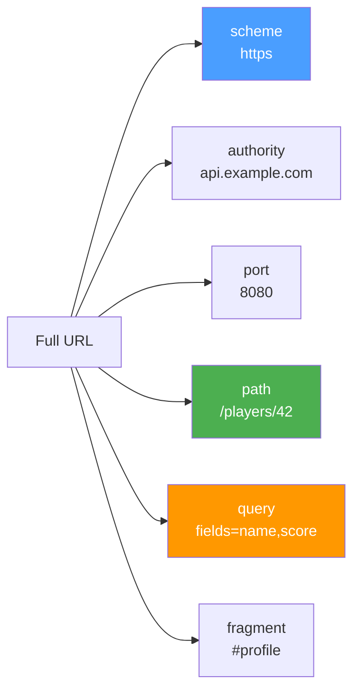
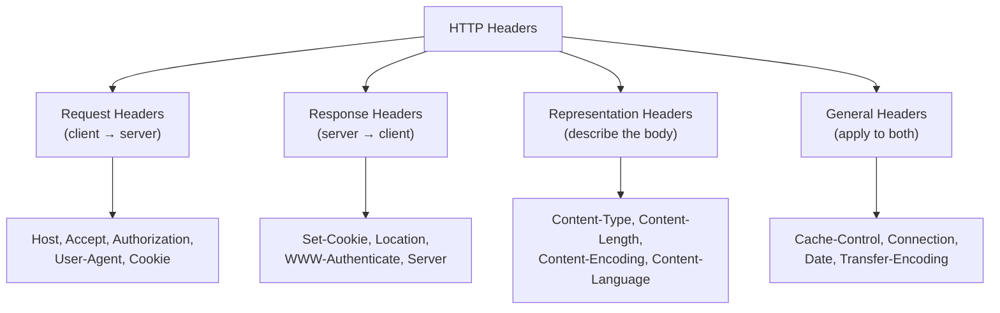
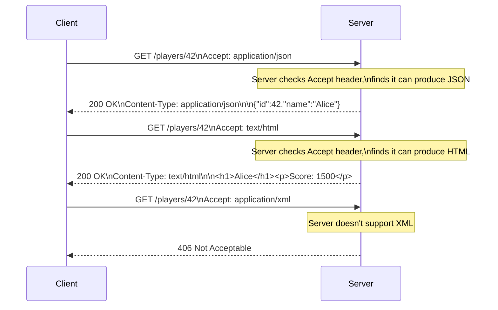

# URLs, Headers, and Content Negotiation

URLs identify **what** we're talking about. Headers carry **metadata** about the conversation. Content negotiation lets client and server **agree on the format**.

## URL Structure

A URL (Uniform Resource Locator) is a structured string that identifies a resource:

```
  https://api.example.com:8080/players/42?fields=name,score#profile
  └─┬──┘ └──────┬───────┘└┬─┘└────┬────┘└────────┬───────┘└──┬───┘
  scheme    authority    port    path           query       fragment
```



### Component Details

| Component     | Purpose                    | Example              | Sent to Server?       |
| ------------- | -------------------------- | -------------------- | --------------------- |
| **Scheme**    | Protocol to use            | `https`, `http`      | Implied by connection |
| **Authority** | Server hostname            | `api.example.com`    | Via `Host` header     |
| **Port**      | TCP port (default: 80/443) | `:8080`              | Via `Host` header     |
| **Path**      | Resource identifier        | `/players/42`        | Yes, in request line  |
| **Query**     | Parameters / filters       | `?page=2&sort=score` | Yes, in request line  |
| **Fragment**  | Client-side anchor         | `#section-3`         | **No** — never sent   |

::: warning "Fragments are client-only"

The fragment (`#profile`) is never sent to the server. It's processed entirely by the client (browser scrolls to that element). If you need the server to know about a section, put it in the path or query.

:::

### URL Encoding

URLs can only contain ASCII characters. Special characters must be **percent-encoded**:

| Character | Encoded      | When to Encode                                 |
| --------- | ------------ | ---------------------------------------------- |
| space     | `%20` or `+` | Always in paths, `+` is common in query values |
| `/`       | `%2F`        | Only when it's data, not a path separator      |
| `?`       | `%3F`        | Only when it's data, not the query delimiter   |
| `&`       | `%26`        | Only when it's data, not a parameter separator |
| `#`       | `%23`        | Always (otherwise it starts a fragment)        |

Example: `GET /search?q=C%2B%2B+games&lang=en` searches for "C++ games".

### URLs in C++ with Boost.URL

```cpp
#include <boost/url.hpp>
#include <iostream>

int main() {
    // Parse a URL
    auto url = boost::urls::parse_uri(
        "https://api.example.com:8080/players/42?fields=name,score"
    ).value();

    std::cout << "Scheme: "   << url.scheme()         << "\n"; // https
    std::cout << "Host: "     << url.host()            << "\n"; // api.example.com
    std::cout << "Port: "     << url.port()            << "\n"; // 8080
    std::cout << "Path: "     << url.path()            << "\n"; // /players/42
    std::cout << "Query: "    << url.query()           << "\n"; // fields=name,score

    // Build a URL
    boost::urls::url builder;
    builder.set_scheme("https");
    builder.set_host("api.example.com");
    builder.set_path("/players");
    builder.set_query("page=2&sort=score");

    std::cout << "Built: " << builder.buffer() << "\n";
    // https://api.example.com/players?page=2&sort=score
}
```

## Header Categories

HTTP headers are grouped by their purpose:



### Essential Headers for API Development

**Request headers you'll use constantly:**

```http
Host: api.example.com           ← Required in HTTP/1.1 (virtual hosting)
Accept: application/json        ← "I want JSON back"
Authorization: Bearer eyJ...    ← Authentication token
Content-Type: application/json  ← "My body is JSON"
Content-Length: 42              ← Body size in bytes
X-Tenant-Id: org-123            ← Custom header (application-specific)
```

**Response headers to understand:**

```http
Content-Type: application/json; charset=utf-8  ← Body format + encoding
Content-Length: 512                             ← Exact body size
Location: /api/players/42                      ← Where the new resource lives
Cache-Control: max-age=3600, public            ← Caching rules
ETag: "v2-abc123"                              ← Version fingerprint
Set-Cookie: session=xyz; HttpOnly; Secure      ← State management
```

::: tip "Custom headers and X- prefix"

Historically, custom headers used the `X-` prefix (e.g., `X-Tenant-Id`, `X-Request-Id`). RFC 6648 deprecated this convention, but it's still widely used. The `X-Tenant-Id` header in the GameGuild API follows this pattern.

:::

## Content Negotiation

Content negotiation is the mechanism by which client and server agree on the **representation format** of a resource.

### How It Works



### Accept Header Syntax

The `Accept` header can specify multiple types with quality weights:

```http
Accept: application/json, text/html;q=0.9, */*;q=0.1
```

- `application/json` — quality 1.0 (default, highest priority)
- `text/html;q=0.9` — quality 0.9 (acceptable fallback)
- `*/*;q=0.1` — anything else at quality 0.1 (last resort)

### Common MIME Types

| MIME Type                           | Used For                        |
| ----------------------------------- | ------------------------------- |
| `application/json`                  | REST API responses, config data |
| `text/html`                         | Web pages                       |
| `text/plain`                        | Plain text, logs                |
| `application/octet-stream`          | Raw binary data                 |
| `multipart/form-data`               | File uploads                    |
| `application/x-www-form-urlencoded` | HTML form submissions           |
| `application/xml`                   | XML data (SOAP, RSS)            |
| `image/png`, `image/jpeg`           | Images                          |

### Other Negotiation Dimensions

Content negotiation isn't limited to format. The same mechanism works for:

| Header            | Negotiates    | Example                           |
| ----------------- | ------------- | --------------------------------- |
| `Accept`          | Content type  | `application/json` vs `text/html` |
| `Accept-Encoding` | Compression   | `gzip, deflate, br`               |
| `Accept-Language` | Language      | `en-US, pt-BR;q=0.9`              |
| `Accept-Charset`  | Character set | `utf-8` (rarely used now)         |

::: tip "Compression negotiation"

```http
GET /api/leaderboard HTTP/1.1
Accept-Encoding: gzip, br

HTTP/1.1 200 OK
Content-Encoding: gzip
Content-Length: 1024
```

The client says "I understand gzip and Brotli," the server picks one and declares it in `Content-Encoding`. The body is compressed, saving 60–90% bandwidth.

:::
