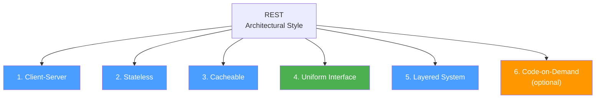
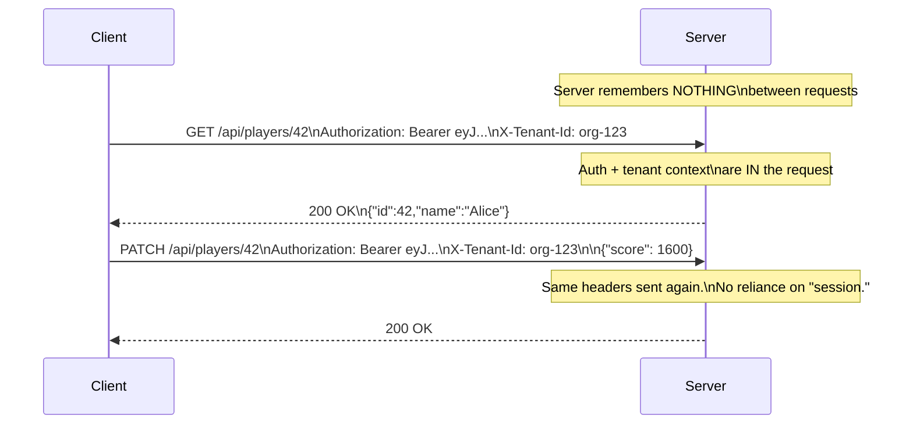
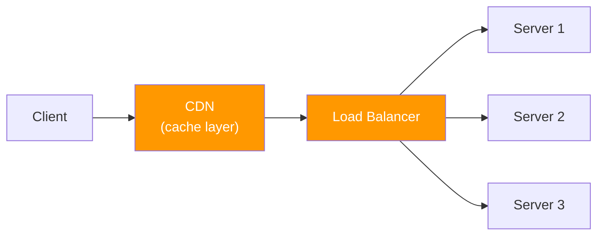
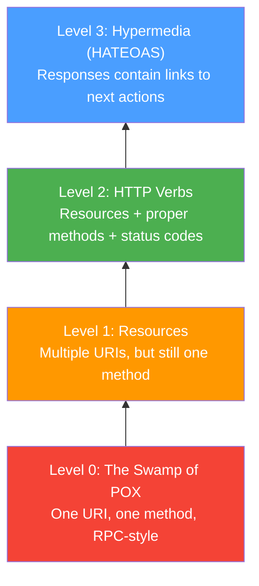

# REST Architectural Constraints

REST (Representational State Transfer) is not a protocol — it's an **architectural style** defined by Roy Fielding in his 2000 PhD dissertation. HTTP happens to be the protocol most commonly used to implement REST, but REST is a set of constraints that guide system design.

## The Six REST Constraints

Fielding defined six constraints. A system that satisfies all six is called **RESTful**.



### 1. Client-Server Separation

The client (UI, game) and server (data, logic) are **independent**. They evolve separately and communicate through a defined interface.

- The server doesn't know or care how the client renders data
- The client doesn't know or care how the server stores data
- Either side can be rewritten without affecting the other

### 2. Statelessness

Every request contains **all the information** the server needs. The server doesn't store session state between requests.



### 3. Cacheability

Every response must declare whether it can be cached. This enables **intermediary caches** (CDNs, browser cache, reverse proxies) to serve requests without hitting the origin server.

```http
HTTP/1.1 200 OK
Cache-Control: public, max-age=3600
ETag: "v1-abc"
```

This response can be cached for 1 hour. We'll cover caching in detail in the next section.

### 4. Uniform Interface

The most important (and most violated) constraint. It has four sub-constraints:

| Sub-constraint                       | Meaning                                             | Example                                                                 |
| ------------------------------------ | --------------------------------------------------- | ----------------------------------------------------------------------- |
| **Resource identification**          | Resources are identified by URIs                    | `/api/players/42` identifies player 42                                  |
| **Manipulation via representations** | Clients modify resources by sending representations | `PUT /players/42` with JSON body replaces the player                    |
| **Self-descriptive messages**        | Each message contains enough info to process it     | `Content-Type: application/json` tells the server how to parse the body |
| **HATEOAS**                          | Responses contain links to related actions          | `{"next": "/api/players?page=2"}`                                       |

::: tip "Resources, NOT actions"

REST models **nouns** (resources), not **verbs** (actions). The HTTP method is the verb.

```
✅  GET    /api/players/42        (resource = player 42)
✅  DELETE /api/players/42        (resource = player 42)
❌  POST   /api/deletePlayer      (action as noun — not RESTful)
❌  GET    /api/getPlayerById/42   (verb in the path — not RESTful)
```

:::

### 5. Layered System

The client shouldn't know (or care) whether it's talking directly to the server or through intermediaries:



Each layer only sees the layer it communicates with. The CDN caches responses. The load balancer distributes requests. The servers process them. The client just sends HTTP to one endpoint.

### 6. Code-on-Demand (Optional)

Servers can send executable code (JavaScript) to extend client functionality. This is the only optional constraint and is common in web browsers but rare in API clients or games.

## Richardson Maturity Model

Martin Fowler popularized Leonard Richardson's model for classifying API maturity:



### Level 0: RPC over HTTP

One endpoint, one method, everything in the body:

```http
POST /api HTTP/1.1
Content-Type: application/json

{"action": "getPlayer", "id": 42}
```

HTTP is just a transport tunnel. This is XML-RPC, SOAP, or ad-hoc JSON-RPC.

### Level 1: Resources

Different URIs for different resources, but everything is still `POST`:

```http
POST /api/players/42
{"action": "get"}

POST /api/players/42
{"action": "delete"}
```

### Level 2: HTTP Verbs (Most APIs Stop Here)

Resources + proper methods + proper status codes:

```http
GET    /api/players/42         → 200 OK
POST   /api/players            → 201 Created
DELETE /api/players/42         → 204 No Content
GET    /api/players/99         → 404 Not Found
```

::: tip "Level 2 is the practical target"

Most production APIs (including game backends like PlayFab, Steam Web API) sit at Level 2. This is considered "good enough" for nearly all use cases.

:::

### Level 3: HATEOAS (Hypermedia)

Responses include links to available actions:

```json
{
  "id": 42,
  "name": "Alice",
  "score": 1500,
  "_links": {
    "self": "/api/players/42",
    "inventory": "/api/players/42/inventory",
    "achievements": "/api/players/42/achievements",
    "delete": "/api/players/42"
  }
}
```

The client doesn't hardcode URIs — it discovers them from responses. This is powerful but adds complexity and is rarely implemented fully.

## REST vs RPC: A Practical Comparison

| Aspect              | REST (Level 2)                            | RPC (gRPC, JSON-RPC)                     |
| ------------------- | ----------------------------------------- | ---------------------------------------- |
| **Interface**       | Uniform (resources + HTTP verbs)          | Custom (function names)                  |
| **Caching**         | Built-in (HTTP caching works naturally)   | Manual (must implement yourself)         |
| **Discoverability** | URIs are predictable                      | Requires documentation                   |
| **Performance**     | Text-based (JSON), higher overhead        | Binary (Protobuf), lower overhead        |
| **Streaming**       | Limited (chunked, SSE, WebSocket upgrade) | Native bidirectional streaming           |
| **Best for**        | CRUD APIs, public APIs, web services      | Internal services, real-time, game state |

::: warning "REST is not always the answer"

For game state synchronization at 60 Hz, REST's request/response model and text overhead are too slow. Use UDP with custom binary protocols (as we've been building) for real-time gameplay. REST is excellent for everything around the game: authentication, matchmaking, leaderboards, player profiles, purchases.

:::
