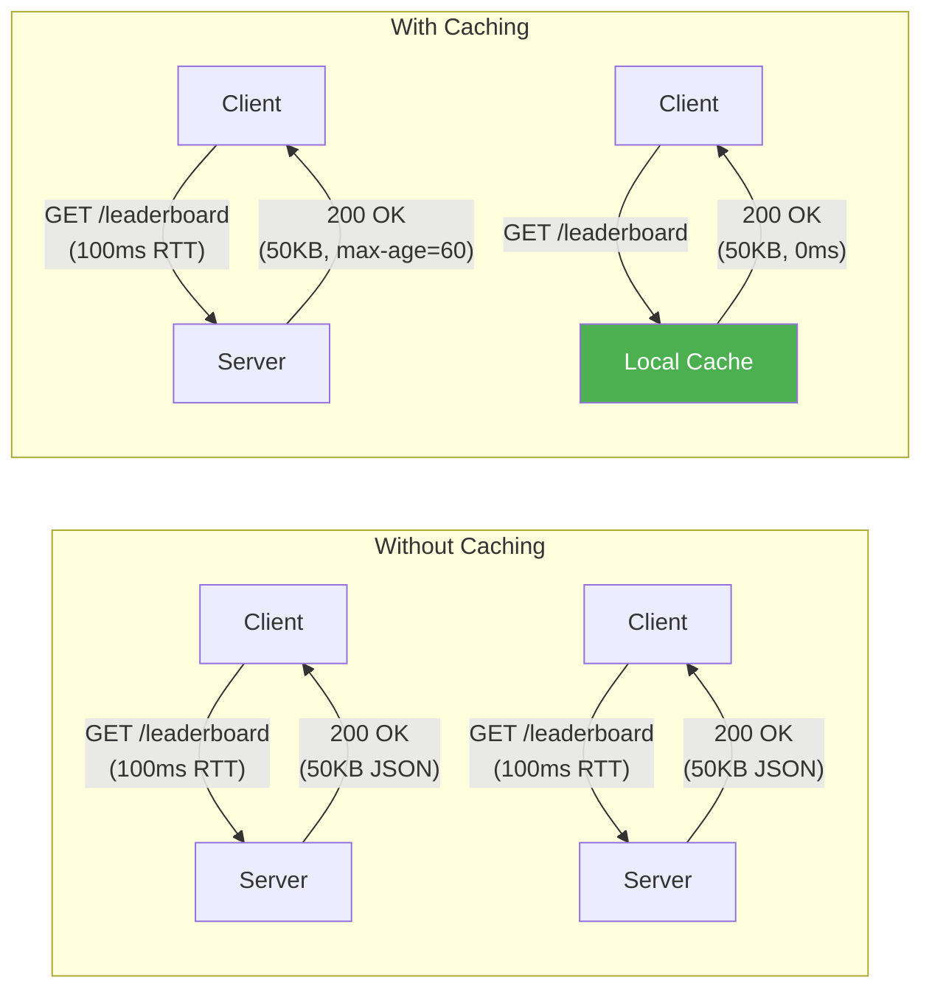
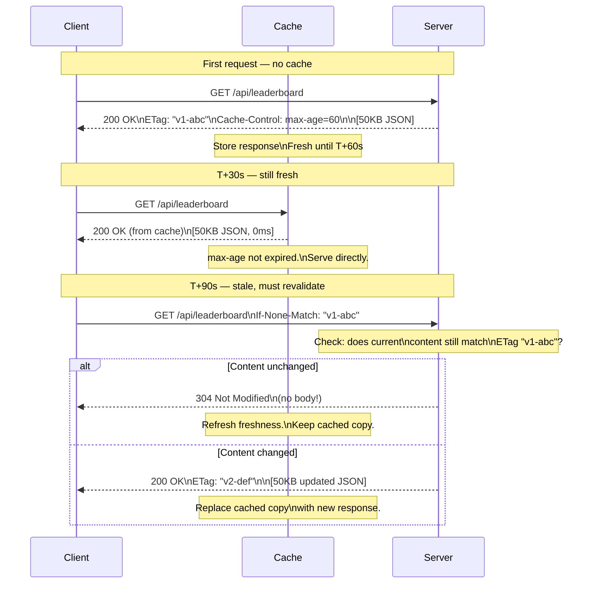
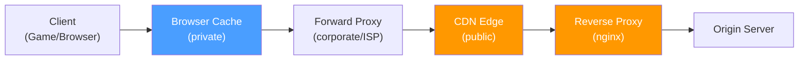

# HTTP Caching

Caching is one of the most powerful features of HTTP. By storing and reusing responses, caches reduce latency, save bandwidth, and decrease server load. REST's cacheability constraint exists precisely because HTTP has a rich caching model built into the protocol.

## Why Caching Matters



Without caching: 2 requests × 100ms = 200ms, 100KB transferred.
With caching: 1 request × 100ms + 1 cache hit × 0ms = 100ms, 50KB transferred.

## Cache-Control

The `Cache-Control` header is the primary mechanism for controlling caching behavior.

### Key Directives

| Directive         | Meaning                                                               |
| ----------------- | --------------------------------------------------------------------- |
| `max-age=N`       | Response is fresh for N seconds from the time of the request          |
| `no-cache`        | Cache may store, but **must revalidate** with the server before using |
| `no-store`        | Cache must **not store** the response at all (sensitive data)         |
| `public`          | Any cache (browser, CDN, proxy) may store this response               |
| `private`         | Only the **browser cache** may store this (user-specific data)        |
| `must-revalidate` | After max-age expires, cache **must** revalidate (no stale serving)   |
| `immutable`       | Resource **never changes** — don't even bother revalidating           |

### Common Patterns

```http
# Static assets (CSS, JS, images) — cache for 1 year, never revalidate
Cache-Control: public, max-age=31536000, immutable

# API response — cache for 60 seconds, anyone can cache
Cache-Control: public, max-age=60

# User-specific data — only browser cache, revalidate after 5 minutes
Cache-Control: private, max-age=300

# Sensitive data — never cache (auth tokens, financial data)
Cache-Control: no-store

# Dynamic content — cache ok, but always check with server first
Cache-Control: no-cache
```

::: warning "`no-cache` does NOT mean don't cache"

`no-cache` means "you can cache this, but you must **validate with the server** before using it." To truly prevent caching, use `no-store`.

:::

## ETags and Conditional Requests

An **ETag** (Entity Tag) is a fingerprint of a resource's content. It enables **conditional requests** — the client asks the server "has this changed?" and the server can respond with just "no" instead of re-sending the full body.

### Cache Hit → Stale → Revalidation Flow



### The Headers

| Request Header            | Response Header       | Purpose                         |
| ------------------------- | --------------------- | ------------------------------- |
| `If-None-Match: "etag"`   | `ETag: "etag"`        | Compare content fingerprints    |
| `If-Modified-Since: date` | `Last-Modified: date` | Compare modification timestamps |

**ETag-based** validation is more precise (content hash) and is preferred over time-based validation.

### Practical Example with curl

```bash
# First request — get the ETag
$ curl -v https://api.example.com/leaderboard
< HTTP/1.1 200 OK
< ETag: "abc123"
< Cache-Control: max-age=60

# Conditional request — send the ETag back
$ curl -v -H 'If-None-Match: "abc123"' https://api.example.com/leaderboard
< HTTP/1.1 304 Not Modified
# No body! Saved 50KB of bandwidth.
```

## Freshness vs Validation Model

HTTP caching has two phases:

```mermaid
flowchart TD
    A["Client wants /resource"] --> B{"Is there a\ncached copy?"}
    B -->|No| C["Send request to server\n(cache MISS)"]
    B -->|Yes| D{"Is it still\nfresh?"}
    D -->|"Yes (max-age\nnot expired)"| E["Use cached copy\n(no network request!)"]
    D -->|"No (max-age\nexpired)"| F{"Does cached copy\nhave ETag or\nLast-Modified?"}
    F -->|Yes| G["Send conditional request\n(If-None-Match / If-Modified-Since)"]
    F -->|No| C
    G --> H{"Server says\n304 Not Modified?"}
    H -->|Yes| I["Use cached copy\n(refresh freshness timer)"]
    H -->|No (200 + new body)| J["Use new response\n(update cache)"]

    style E fill:#4caf50,color:#fff
    style I fill:#4caf50,color:#fff
```

The key insight: **freshness avoids the network entirely**, while **validation avoids re-transferring the body**. Both save resources, but freshness is strictly better when applicable.

## Where Caches Live



| Cache Type            | `Cache-Control`       | Who It Serves            |
| --------------------- | --------------------- | ------------------------ |
| **Browser cache**     | `private` or `public` | Single user              |
| **CDN / Proxy cache** | `public` only         | Many users               |
| **Reverse proxy**     | `public` only         | All users of that origin |

::: danger "Never cache authenticated responses publicly"

If a response contains user-specific data (profile, inventory, session), use `Cache-Control: private` or `no-store`. A `public` cache would serve one user's data to another.

```http
# User-specific — MUST be private
GET /api/players/me/inventory
Cache-Control: private, max-age=30

# Shared data — safe to cache publicly
GET /api/leaderboard
Cache-Control: public, max-age=60
```

:::

## Caching in Game APIs

| Endpoint                        | Cache Strategy                        | Why                                     |
| ------------------------------- | ------------------------------------- | --------------------------------------- |
| `GET /leaderboard`              | `public, max-age=60`                  | Same for everyone, updates infrequently |
| `GET /players/42`               | `public, max-age=10`                  | Public profile, short freshness         |
| `GET /players/me/inventory`     | `private, max-age=30`                 | User-specific, moderate freshness       |
| `POST /matchmaking/queue`       | `no-store`                            | Side effect, never cache                |
| `GET /assets/textures/hero.png` | `public, max-age=31536000, immutable` | Static asset, never changes             |
| `GET /config/game-version`      | `no-cache`                            | Always revalidate to catch updates      |
