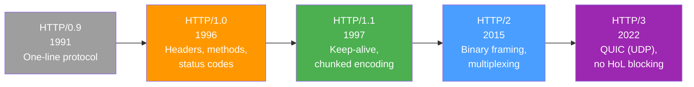
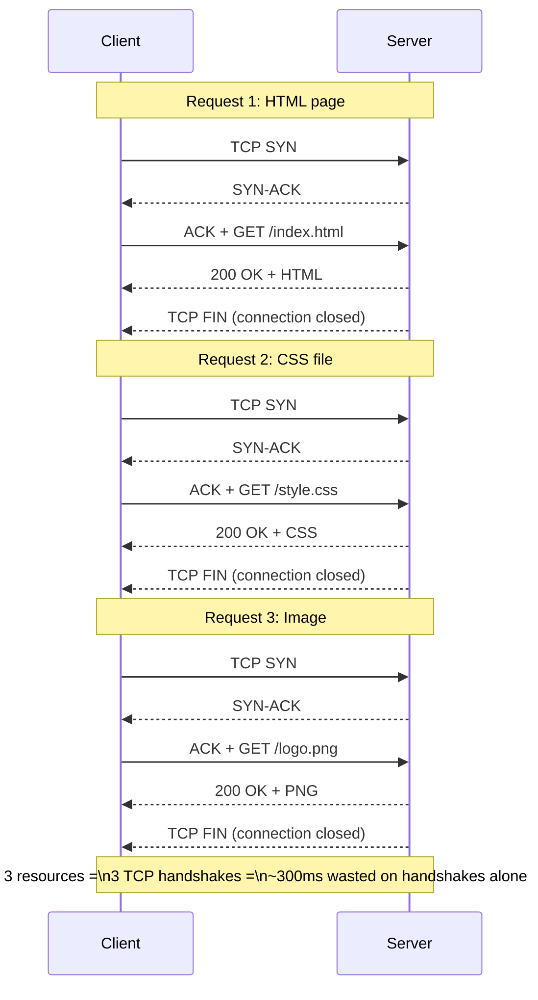
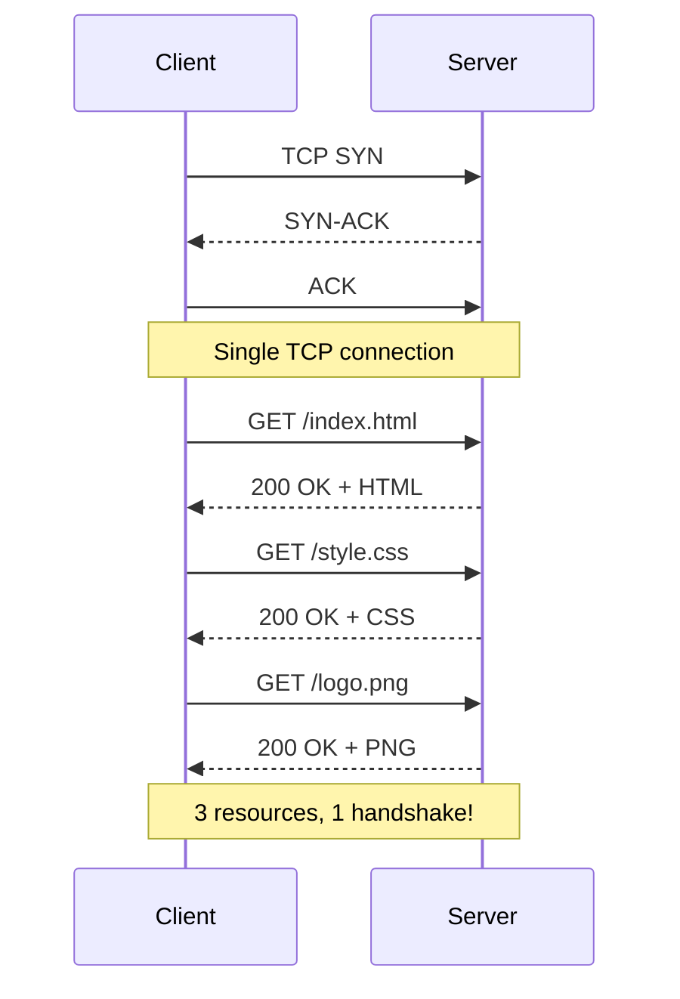
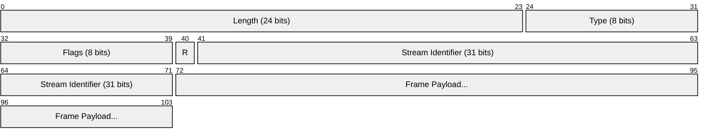
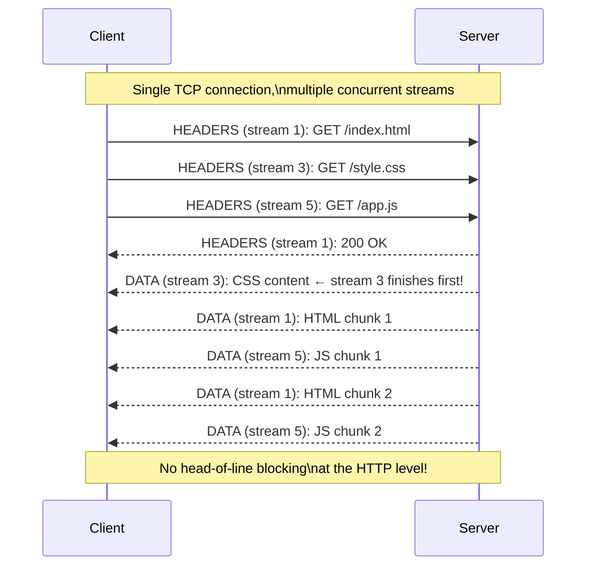
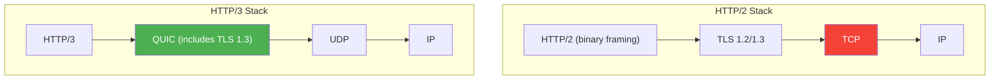
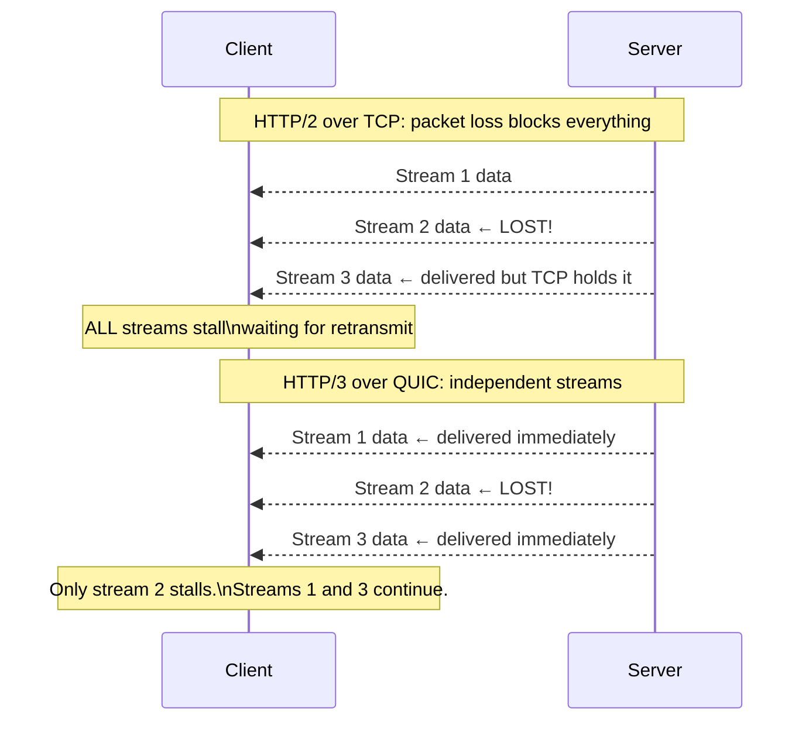
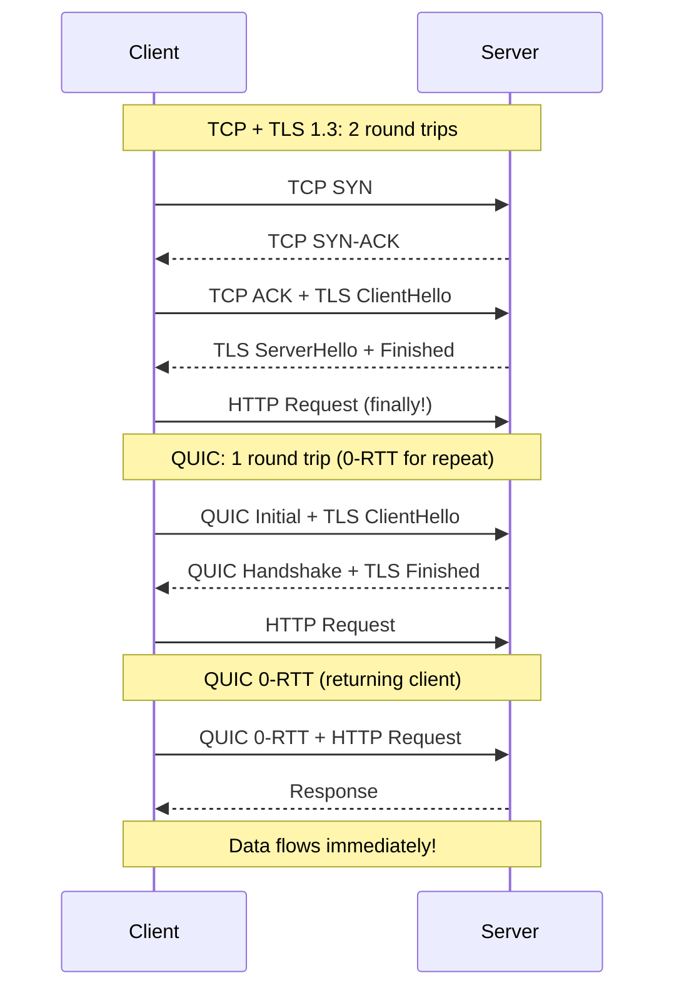

# Evolution of HTTP: 1.0 → 1.1 → 2 → 3

HTTP has evolved through four major versions, each solving performance problems introduced or exposed by the previous one. Understanding this evolution shows how protocol design responds to real-world constraints.

## Timeline



## HTTP/1.0 (1996): The Foundation

HTTP/1.0 introduced the basic request/response model we use today: methods, headers, status codes, and content types.

**The problem**: every request required a **new TCP connection**.



Each TCP handshake costs one round-trip time (RTT). A page with 30 resources = 30 handshakes = massive latency.

## HTTP/1.1 (1997): Keep-Alive and Persistence

HTTP/1.1 solved the connection-per-request problem with **persistent connections** (keep-alive by default).



### Key HTTP/1.1 Features

| Feature                       | Solves                                                      |
| ----------------------------- | ----------------------------------------------------------- |
| **Persistent connections**    | No more connection-per-request overhead                     |
| **`Host` header** (required)  | Virtual hosting — multiple domains on one IP                |
| **Chunked transfer encoding** | Stream responses of unknown length                          |
| **Pipelining**                | Send multiple requests without waiting for responses        |
| **`100 Continue`**            | Client asks "should I send this large body?" before sending |

::: warning "HTTP/1.1 pipelining failed in practice"

Pipelining lets the client send multiple requests without waiting, but the server must respond **in order** (FIFO). A slow response blocks all subsequent ones — this is **Head-of-Line (HoL) blocking**.

```
Client sends:  GET /fast.css  GET /slow-query  GET /tiny.js
Server queue:  [fast.css ✓]  [slow-query ⏳]  [tiny.js ⏸ waiting]
                                                  ↑ blocked!
```

Browsers worked around this by opening 6–8 parallel TCP connections to the same server, but each connection has its own TLS handshake and congestion window. This is inefficient.

:::

## HTTP/2 (2015): Binary Framing and Multiplexing

HTTP/2 kept the same semantics (methods, headers, status codes) but replaced the text-based wire format with a **binary framing layer**.

### Binary Frames



Every piece of data is wrapped in a **frame** with a type:

| Frame Type     | Purpose                                     |
| -------------- | ------------------------------------------- |
| `HEADERS`      | Request/response headers (HPACK compressed) |
| `DATA`         | Request/response body                       |
| `SETTINGS`     | Connection configuration                    |
| `PUSH_PROMISE` | Server push (deprecated)                    |
| `GOAWAY`       | Graceful connection shutdown                |

### Multiplexing: The Key Innovation

Multiple **streams** share a single TCP connection. Each stream carries one request/response pair, and frames from different streams can be interleaved.



### HPACK Header Compression

HTTP/1.1 headers are verbose and repetitive. HPACK compresses them using:

1. **Static table**: 61 common header name-value pairs (`:method: GET`, `:status: 200`)
2. **Dynamic table**: previously seen headers indexed by number
3. **Huffman encoding**: compress header values

Result: headers that were 500–800 bytes in HTTP/1.1 become 20–50 bytes in HTTP/2.

::: tip "HTTP/2 solves HoL blocking at the HTTP level..."

With multiplexing, a slow response on stream 3 doesn't block streams 1 and 5. Each stream is independent.

**...but not at the TCP level.** If a TCP packet is lost, ALL streams on that connection stall until TCP retransmits it. This is TCP-level HoL blocking, and it's what HTTP/3 was designed to fix.

:::

## HTTP/3 (2022): QUIC and UDP

HTTP/3 replaces TCP with **QUIC** — a transport protocol built on UDP that provides reliable, encrypted, multiplexed connections.



### Why QUIC?

| Problem                  | TCP (HTTP/2)                                | QUIC (HTTP/3)                                                 |
| ------------------------ | ------------------------------------------- | ------------------------------------------------------------- |
| **HoL blocking**         | One lost packet blocks **all** streams      | Loss on stream A doesn't affect stream B                      |
| **Handshake latency**    | TCP handshake + TLS handshake = 2–3 RTT     | Combined handshake = **1 RTT** (0-RTT for repeat connections) |
| **Connection migration** | IP change = new connection (mobile roaming) | Connection ID survives IP changes                             |
| **Encryption**           | Optional (TLS is separate)                  | **Always encrypted** (TLS 1.3 built in)                       |

### Eliminating TCP HoL Blocking



### 0-RTT Connection Setup



## Version Comparison

| Feature                  | HTTP/1.0          | HTTP/1.1               | HTTP/2               | HTTP/3               |
| ------------------------ | ----------------- | ---------------------- | -------------------- | -------------------- |
| **Year**                 | 1996              | 1997                   | 2015                 | 2022                 |
| **Transport**            | TCP               | TCP                    | TCP                  | QUIC (UDP)           |
| **Connections per host** | 1 request each    | Keep-alive             | 1 (multiplexed)      | 1 (multiplexed)      |
| **Wire format**          | Text              | Text                   | Binary frames        | Binary frames        |
| **Header compression**   | None              | None                   | HPACK                | QPACK                |
| **Multiplexing**         | No                | No (pipelining broken) | Yes                  | Yes                  |
| **HoL blocking**         | N/A               | HTTP level             | TCP level            | None                 |
| **Encryption**           | Optional          | Optional               | Effectively required | Always (TLS 1.3)     |
| **Handshake RTT**        | 1 (TCP) + 2 (TLS) | 1 + 2                  | 1 + 1 (TLS 1.3)      | 1 (0-RTT for repeat) |

::: tip "What version should you use?"

- **HTTP/1.1**: Still works fine for simple APIs and development
- **HTTP/2**: Best default for production — supported by all modern browsers and servers
- **HTTP/3**: Use when available, especially for mobile clients with unreliable connections

Most servers (nginx, Caddy, Cloudflare) negotiate the best version automatically via ALPN (Application-Layer Protocol Negotiation).

:::
