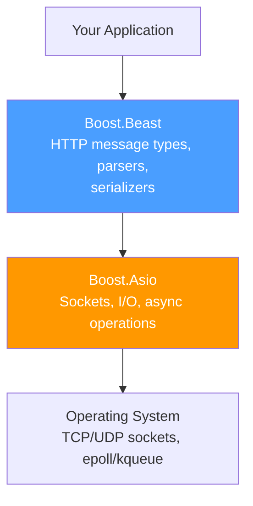

# HTTP in C++ with Boost.Beast

HTTP clients and servers in C++ can be complex. **Boost.Beast** provides HTTP message types and parsers that sit on top of Boost.Asio's networking layer — the same library we've been using for TCP all semester.

## Boost.Beast Architecture



Beast doesn't manage connections — it provides the **HTTP layer** on top of Asio streams. You handle the socket; Beast handles parsing and serializing HTTP messages.

## HTTP Message Types

Beast represents HTTP messages as template types:

```cpp
#include <boost/beast/http.hpp>

namespace http = boost::beast::http;

// Request: http::request<BodyType>
http::request<http::string_body> req;
req.method(http::verb::get);
req.target("/api/players/42");
req.version(11); // HTTP/1.1
req.set(http::field::host, "api.example.com");
req.set(http::field::accept, "application/json");
req.set(http::field::user_agent, "GameClient/1.0");

// Response: http::response<BodyType>
http::response<http::string_body> res;
res.result(http::status::ok);            // 200
res.version(11);
res.set(http::field::content_type, "application/json");
res.body() = R"({"id":42,"name":"Alice"})";
res.prepare_payload(); // Sets Content-Length automatically
```

### Body Types

| Body Type            | Use Case                                          |
| -------------------- | ------------------------------------------------- |
| `http::string_body`  | JSON, text — body is a `std::string`              |
| `http::file_body`    | Serve files from disk without loading into memory |
| `http::empty_body`   | Requests/responses with no body (GET, HEAD, 204)  |
| `http::dynamic_body` | Streaming — body is a `beast::multi_buffer`       |
| `http::buffer_body`  | Manual control — you manage the buffer            |

## Synchronous HTTP Client

A complete HTTP GET client using Beast:

```cpp
#include <boost/beast/core.hpp>
#include <boost/beast/http.hpp>
#include <boost/asio/connect.hpp>
#include <boost/asio/ip/tcp.hpp>
#include <iostream>
#include <string>

namespace beast = boost::beast;
namespace http  = beast::http;
namespace net   = boost::asio;
using tcp       = net::ip::tcp;

int main() {
    // 1. Set up I/O context and resolver
    net::io_context ioc;
    tcp::resolver resolver(ioc);
    beast::tcp_stream stream(ioc);

    // 2. Resolve and connect
    auto const results = resolver.resolve("httpbin.org", "80");
    stream.connect(results);

    // 3. Build the request
    http::request<http::string_body> req{http::verb::get, "/get", 11};
    req.set(http::field::host, "httpbin.org");
    req.set(http::field::user_agent, "BoostBeast/1.0");
    req.set(http::field::accept, "application/json");

    // 4. Send the request
    http::write(stream, req);

    // 5. Read the response
    beast::flat_buffer buffer;
    http::response<http::string_body> res;
    http::read(stream, buffer, res);

    // 6. Use the response
    std::cout << "Status: " << res.result_int() << " "
              << res.reason() << "\n";
    std::cout << "Content-Type: "
              << res[http::field::content_type] << "\n";
    std::cout << "Body:\n" << res.body() << "\n";

    // 7. Graceful shutdown
    beast::error_code ec;
    stream.socket().shutdown(tcp::socket::shutdown_both, ec);
}
```

::: tip "This is the same pattern from earlier weeks"

Compare with our TCP client from Week 4:

1. Create socket → `beast::tcp_stream`
2. Connect → `stream.connect(results)`
3. Send data → `http::write(stream, req)` instead of raw `asio::write`
4. Receive data → `http::read(stream, buffer, res)` instead of raw `asio::read`

Beast adds HTTP parsing on top of the same Asio primitives.

:::

## Synchronous HTTP Server

A minimal HTTP server that handles GET and POST:

```cpp
#include <boost/beast/core.hpp>
#include <boost/beast/http.hpp>
#include <boost/asio/ip/tcp.hpp>
#include <iostream>
#include <string>

namespace beast = boost::beast;
namespace http  = beast::http;
namespace net   = boost::asio;
using tcp       = net::ip::tcp;

// Handle a single HTTP request
http::response<http::string_body>
handle_request(http::request<http::string_body> const& req) {
    // Route: GET /api/players
    if (req.method() == http::verb::get
        && req.target() == "/api/players") {
        http::response<http::string_body> res{http::status::ok, req.version()};
        res.set(http::field::content_type, "application/json");
        res.body() = R"([{"id":1,"name":"Alice"},{"id":2,"name":"Bob"}])";
        res.prepare_payload();
        return res;
    }

    // Route: POST /api/players
    if (req.method() == http::verb::post
        && req.target() == "/api/players") {
        http::response<http::string_body> res{
            http::status::created, req.version()};
        res.set(http::field::content_type, "application/json");
        res.set(http::field::location, "/api/players/3");
        res.body() = R"({"id":3,"name":"Charlie"})";
        res.prepare_payload();
        return res;
    }

    // 404 for everything else
    http::response<http::string_body> res{
        http::status::not_found, req.version()};
    res.set(http::field::content_type, "application/json");
    res.body() = R"({"error":"Not found"})";
    res.prepare_payload();
    return res;
}

int main() {
    net::io_context ioc;
    tcp::acceptor acceptor(ioc, tcp::endpoint(tcp::v4(), 8080));

    std::cout << "Listening on http://localhost:8080\n";

    while (true) {
        // Accept a connection
        tcp::socket socket(ioc);
        acceptor.accept(socket);

        // Read the request
        beast::flat_buffer buffer;
        http::request<http::string_body> req;
        http::read(socket, buffer, req);

        std::cout << req.method_string() << " " << req.target() << "\n";

        // Handle and send response
        auto res = handle_request(req);
        res.set(http::field::server, "BoostBeast/1.0");
        http::write(socket, res);

        // Close the connection
        beast::error_code ec;
        socket.shutdown(tcp::socket::shutdown_send, ec);
    }
}
```

::: warning "This server is single-threaded and blocking"

This server handles one request at a time. For production use, you'd use `boost::asio::co_spawn` with coroutines or `async_accept`/`async_read`/`async_write` to handle concurrent connections. The Boost.Beast examples include async and multi-threaded server patterns.

:::

## Working with Headers

```cpp
// Setting headers
req.set(http::field::host, "api.example.com");
req.set(http::field::authorization, "Bearer eyJ...");
req.set("X-Tenant-Id", "org-123");  // Custom header (string key)

// Reading headers
auto content_type = res[http::field::content_type]; // string_view
auto custom = res["X-Request-Id"];                  // Custom header

// Iterating all headers
for (auto const& field : res) {
    std::cout << field.name_string() << ": "
              << field.value() << "\n";
}

// Check if header exists
if (res.count(http::field::etag) > 0) {
    auto etag = res[http::field::etag];
}
```

## POST with JSON Body

```cpp
// Build a POST request with a JSON body
http::request<http::string_body> req{http::verb::post, "/api/players", 11};
req.set(http::field::host, "api.example.com");
req.set(http::field::content_type, "application/json");

req.body() = R"({
    "name": "Charlie",
    "score": 0
})";

req.prepare_payload(); // Computes and sets Content-Length

// Send it
http::write(stream, req);

// Read the response
beast::flat_buffer buffer;
http::response<http::string_body> res;
http::read(stream, buffer, res);

if (res.result() == http::status::created) {
    std::cout << "Created! Location: "
              << res[http::field::location] << "\n";
}
```

## URL Parsing with Boost.URL

Use Boost.URL to parse and construct URLs programmatically:

```cpp
#include <boost/url.hpp>

// Parse a URL and extract components
auto url = boost::urls::parse_uri(
    "https://api.example.com:8080/players?page=2&sort=score"
).value();

std::string host = url.host();   // "api.example.com"
std::string port = url.port();   // "8080"
std::string path = url.path();   // "/players"

// Parse query parameters
for (auto param : url.params()) {
    std::cout << param.key << " = " << param.value << "\n";
}
// page = 2
// sort = score
```

## cpp-httplib: A Simpler Alternative

For prototyping or simpler projects, [cpp-httplib](https://github.com/yhirose/cpp-httplib) is a **single-header** HTTP library that's much easier to use:

```cpp
#include "httplib.h"

// Server — 10 lines
httplib::Server svr;

svr.Get("/api/players", [](const httplib::Request&, httplib::Response& res) {
    res.set_content(
        R"([{"id":1,"name":"Alice"}])",
        "application/json"
    );
});

svr.Post("/api/players", [](const httplib::Request& req, httplib::Response& res) {
    // req.body contains the POST body
    res.status = 201;
    res.set_header("Location", "/api/players/3");
    res.set_content(R"({"id":3})", "application/json");
});

svr.listen("0.0.0.0", 8080);
```

```cpp
// Client — 5 lines
httplib::Client cli("http://httpbin.org");
auto res = cli.Get("/get");
if (res && res->status == 200) {
    std::cout << res->body << "\n";
}
```

### Beast vs cpp-httplib

| Aspect             | Boost.Beast                               | cpp-httplib                 |
| ------------------ | ----------------------------------------- | --------------------------- |
| **Dependency**     | Boost libraries                           | Single header file          |
| **Async support**  | Full (coroutines, callbacks)              | Threads only                |
| **Performance**    | Production-grade                          | Good for prototyping        |
| **HTTP/2**         | No (HTTP/1.1 only)                        | No (HTTP/1.1 only)          |
| **TLS/HTTPS**      | Via Boost.Asio + OpenSSL                  | Built-in OpenSSL support    |
| **Learning curve** | Steep (Asio knowledge required)           | Minimal                     |
| **Best for**       | Production game servers, high-performance | Homework, prototypes, tools |

::: tip "Which one for your final project?"

Use **cpp-httplib** if you need a quick HTTP endpoint for testing or a simple REST API. Use **Boost.Beast** if your project requires async I/O, integration with Asio's event loop (e.g., combining HTTP + UDP game traffic), or production-level performance.

:::
