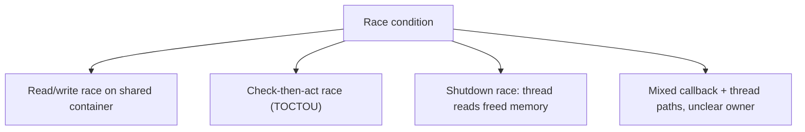
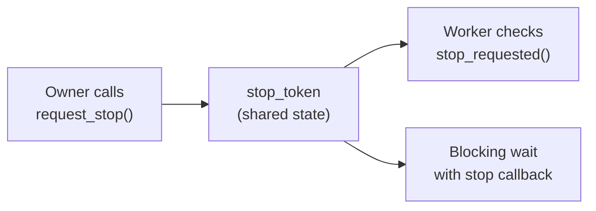
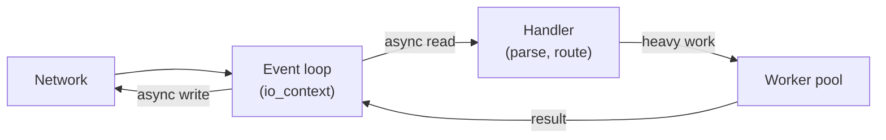
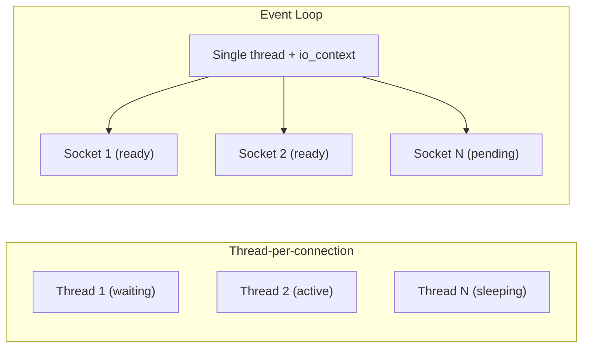
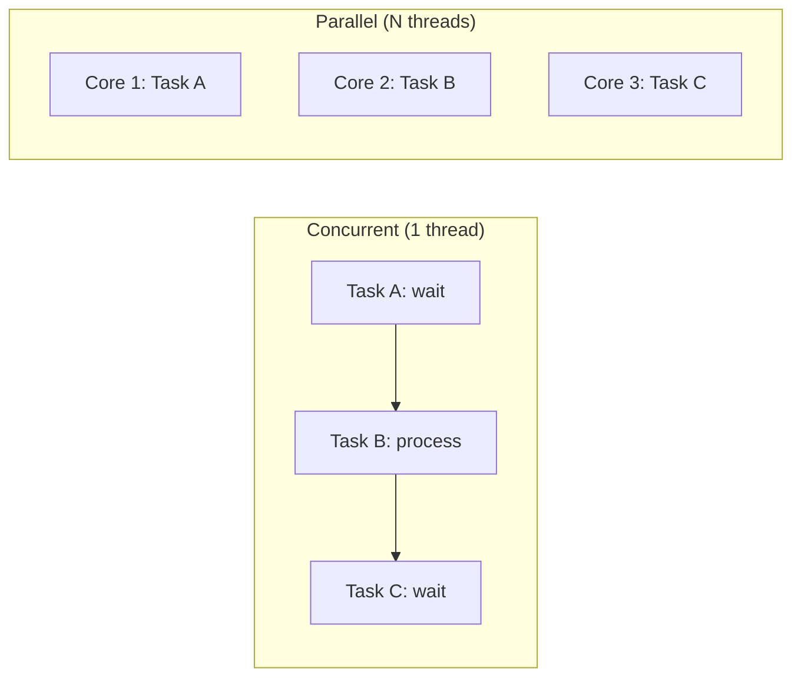
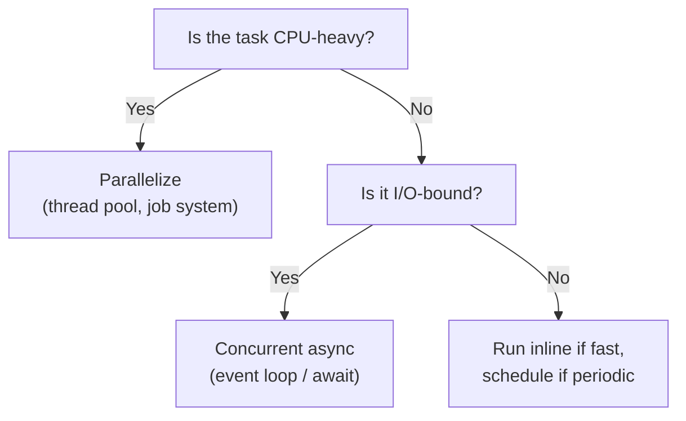
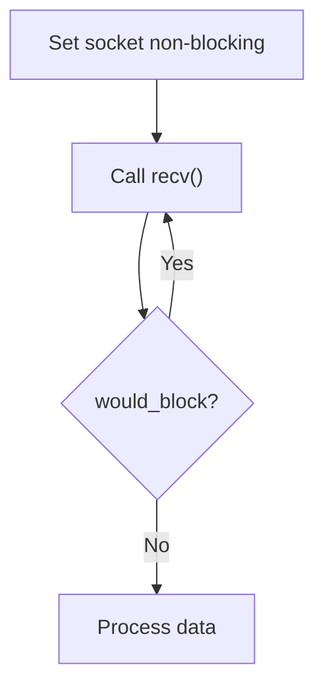
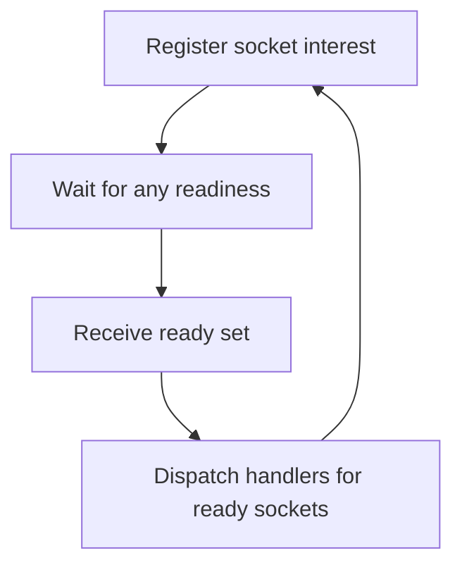
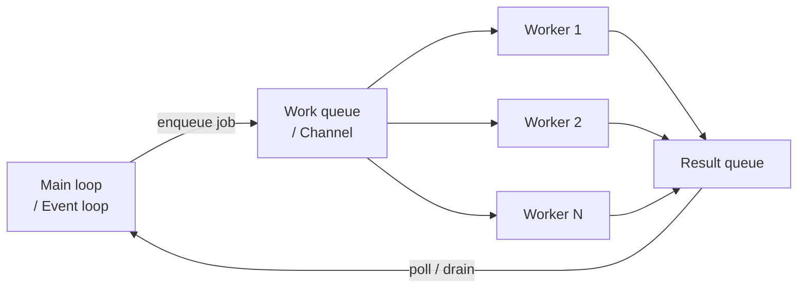

## Ownership-First Strategy

Thread safety is easiest when you don't share mutable state:

1. **Single owner**: one thread owns each mutable object
2. **Message passing**: other threads send requests and receive results
3. **Immutable snapshots**: workers read copies, not live mutable state

---

## When You Must Share

| Mechanism             | Use Case                                   |
| --------------------- | ------------------------------------------ |
| `strand` (serialized) | Multiple handlers share one context        |
| `std::mutex`          | Fine-grained locks — keep sections small   |
| Lock-free queues      | Producer/consumer handoff without blocking |

---

## Common Failure Modes



---

## Code: Serialized Access with `strand` (C++)

```cpp
#include <boost/asio.hpp>

boost::asio::io_context io;
auto strand = boost::asio::make_strand(io);
int shared_counter = 0;

void safe_increment() {
	boost::asio::post(strand, [] {
		++shared_counter; // serialized; no mutex needed
	});
}
```

---

## Code: Mailbox Pattern (C#)

```csharp
using System.Collections.Concurrent;

var mailbox = new ConcurrentQueue<Action>();
int sharedState = 0;

// Worker thread submits mutation request:
mailbox.Enqueue(() => sharedState++);

// Owner thread drains:
while (mailbox.TryDequeue(out var op))
	op(); // only owner thread mutates sharedState
```

---

## Shutdown Order Pattern

```
1. Signal stop  (stop_token.request_stop / CancellationToken.Cancel)
2. Wait for workers to drain queues
3. Join all worker threads
4. Release resources
```

Explicit shutdown order prevents read-after-free races.

---

## CSI ↔ GPR: Thread Safety

| Context | Pattern                                          |
| ------- | ------------------------------------------------ |
| CSI     | Strand-per-connection for async handler safety   |
| GPR     | Mailbox drained during `Update()` by main thread |

---

## Part 7: Modern C++ Concurrency

---

## `std::jthread`

Safer than `std::thread`:

- **Auto-joins** on scope exit (no forgotten `join()` calls)
- Integrates **cooperative cancellation** via `stop_token`
- Reduces shutdown bugs from detached or abandoned threads

---

## Stop Tokens: Cooperative Cancellation



Workers decide when to stop — the OS doesn't kill them abruptly.

---

## Coroutines: Structured Async Flow

`co_await` turns callback chains into linear readable code:

```cpp
// Callback style:
async_read(s, buf, [](ec, n) {
	async_write(s2, buf, [](ec, n) { /* ... */ });
});

// Coroutine style:
co_await async_read(s, buf);
co_await async_write(s2, buf);
```

Coroutines improve readability — they don't remove the need for ownership or backpressure.

---

## Code: `std::jthread` + Stop Token (C++)

```cpp
#include <thread>
#include <chrono>

std::jthread worker([](std::stop_token st) {
	while (!st.stop_requested()) {
		// periodic work
		std::this_thread::sleep_for(std::chrono::milliseconds(5));
	}
	// auto-joins when worker goes out of scope
});

// Graceful shutdown:
worker.request_stop();
```

---

## Code: CancellationToken Async Loop (C#)

```csharp
var cts = new CancellationTokenSource();

var task = Task.Run(async () =>
{
	while (!cts.Token.IsCancellationRequested)
	{
		await Task.Delay(5, cts.Token);
		// periodic async work
	}
}, cts.Token);

cts.Cancel();
await task;
```

---

## Coroutines + `io_context` (C++)

```cpp
#include <boost/asio.hpp>

boost::asio::awaitable<void> echo(boost::asio::ip::tcp::socket socket) {
	char buf[512];
	for (;;) {
		std::size_t n = co_await socket.async_read_some(
			boost::asio::buffer(buf), boost::asio::use_awaitable);
		co_await boost::asio::async_write(
			socket, boost::asio::buffer(buf, n),
			boost::asio::use_awaitable);
	}
}
```

Linear async code running on a non-blocking event loop.

---

## CSI ↔ GPR: Modern C++

| Feature        | CSI Use                            | GPR Use                                    |
| -------------- | ---------------------------------- | ------------------------------------------ |
| `std::jthread` | Worker threads in server daemons   | Background job threads in game engine      |
| Stop tokens    | Graceful service shutdown          | Scene transition / game exit cleanup       |
| Coroutines     | Structured async protocol handlers | Async asset load, sequence-safe operations |

---

## Part 8: CSI vs GPR Architecture Patterns

---

## Same Primitives, Different Priorities

| Primitive          | CSI Priority                    | GPR Priority                            |
| ------------------ | ------------------------------- | --------------------------------------- |
| Event loop/reactor | Scale to many clients           | Keep frame loop responsive per tick     |
| Worker pool        | Throughput + service isolation  | Offload expensive work from main thread |
| Queue handoff      | Reliability and observability   | Deterministic integration per frame     |
| Cancellation       | Service shutdown and resilience | Scene/state transition safety           |

---

## CSI: Event-Driven Service Architecture



One loop handles I/O; workers handle computation. Results flow back via post/channel.

---

## GPR: Game Loop Integration


Background work completes during the frame; main thread applies results at a safe point.

---

## Decision Heuristic

> If a task can **block** or is **CPU-heavy**, it must not run on the orchestrator loop.

Move it to a managed worker path. Reintegrate results through explicit queue handoff.

---

## Code: Worker Offload (C++ / CSI)

```cpp
boost::asio::post(worker_pool, [payload, &io]() {
	auto result = transform(payload);
	boost::asio::post(io, [result]() {
		// write response on event-loop context
	});
});
```

---

## Code: Frame-Safe Result Apply (C# / GPR)

```csharp
ConcurrentQueue<Action> mainThreadApply = new();

// Worker thread:
Task.Run(() =>
{
	var delta = ComputeDelta();
	mainThreadApply.Enqueue(() => ApplyDeltaToGameState(delta));
});

// Game Update():
while (mainThreadApply.TryDequeue(out var apply))
	apply(); // only main thread mutates engine-owned state
```

---

## Summary

| Concept                 | Key Takeaway                                                             |
| ----------------------- | ------------------------------------------------------------------------ |
| Concurrency vs parallel | Concurrency manages many tasks; parallelism executes simultaneously      |
| Blocking socket         | Call waits; simple but stalls responsiveness                             |
| Non-blocking socket     | Returns immediately; needs readiness + retry strategy                    |
| Multiplexing            | One loop watches many sockets, acts only on ready ones                   |
| Reactor pattern         | Register → wait → dispatch → repeat                                      |
| Worker thread manager   | Main loop orchestrates; workers process; queue handoff for results       |
| Thread safety           | Prefer ownership boundaries and serialization over ad-hoc locking        |
| `std::jthread`          | Safer thread lifecycle with cooperative cancellation                     |
| Coroutines              | Structured async flow without blocking the event loop                    |
| CSI vs GPR              | Same primitives; CSI optimizes throughput, GPR optimizes frame stability |

---

## What's Next

Week 12: Putting it all together — complete non-blocking server and game client using patterns from Weeks 1–11.

# Week 11: Non-Blocking I/O, Parallelism, and Concurrency

---

## Today's Agenda

1. Parallelism vs Concurrency Fundamentals
2. Blocking vs Non-Blocking Sockets
3. I/O Multiplexing — select, poll, epoll
4. Event Loops and Reactor Architecture
5. Worker Threads and Thread Managers
6. Thread Safety and Shared-State Ownership
7. Modern C++ — jthread, Stop Tokens, Coroutines
8. CSI vs GPR Architecture Patterns

---

## Recap: HTTP (Week 10)

Last week: HTTP — the application-layer protocol for APIs, auth, matchmaking, and asset delivery.

The server receives requests and sends responses. But what happens when **1,000 clients** connect at once?

- Thread-per-connection: 1,000 threads → memory and context-switch overhead
- Non-blocking I/O + event loops → one thread handles many connections

This week is about building **that second model**.

---

## The Scalability Problem



Event-loop style serves the same clients with far fewer threads.

---

## Part 1: Parallelism vs Concurrency

---

## Two Different Things

| Term            | Definition                                              |
| --------------- | ------------------------------------------------------- |
| **Concurrency** | Structuring a system to manage many in-flight tasks     |
| **Parallelism** | Executing multiple tasks **simultaneously** on hardware |

A single-threaded event loop is highly **concurrent** — but not parallel.
A thread pool is **parallel** — but only concurrent if tasks don't block each other.

---

## Visualizing the Difference



Concurrency interleaves tasks. Parallelism runs them simultaneously.

---

## Where Waiting Dominates

Most networked system work is **waiting**:

- waiting for socket data
- waiting for disk or database
- waiting for game-state from another subsystem

Concurrency turns idle wait time into useful work for other tasks.
Parallelism adds value when the work itself is **CPU-heavy** (compression, pathfinding, serialization batches).

---

## Design Rule



Start with a **concurrent architecture**. Add targeted parallelism where profiling shows CPU pressure.

---

## CSI ↔ GPR: Concurrency vs Parallelism

| Context | Concurrency                              | Parallelism                                   |
| ------- | ---------------------------------------- | --------------------------------------------- |
| CSI     | Serve thousands of clients from one loop | Batch processing, worker pools for transforms |
| GPR     | Keep game loop non-blocking per-tick     | Physics, pathfinding, AI on worker threads    |

---

## Code: Async Concurrency + Parallel CPU (C++)

```cpp
#include <boost/asio.hpp>
#include <future>

boost::asio::awaitable<void> handle_packet(std::vector<uint8_t> packet) {
	// Offload CPU-heavy work to another core
	auto parsed = std::async(std::launch::async, [p = std::move(packet)] {
		return p.size(); // simulate expensive parse
	});
	std::size_t bytes = parsed.get();
	co_return;
}
```

---

## Code: Async Concurrency + Parallel CPU (C#)

```csharp
public static async Task<int> ProcessMessageAsync(byte[] payload)
{
	// Concurrency: caller stays responsive
	await Task.Delay(1);
	// Parallelism: move CPU work to thread pool
	int score = await Task.Run(() => payload.Length * 2);
	return score;
}
```

---

## Part 2: Blocking vs Non-Blocking Sockets

---

## Blocking I/O Contract

With a blocking socket:

1. Call `read()`
2. Thread **pauses** until data arrives
3. Control returns when bytes are available

Simple flow — but **one blocked call can stall everything** behind it.

---

## Non-Blocking I/O Contract

With a non-blocking socket:

1. Call `read()`
2. If data is ready → bytes returned immediately
3. If not ready → `would_block` / `EAGAIN` returned immediately
4. Caller must wait for readiness, then retry

Higher complexity — but **never blocks the orchestrating loop**.

---

## Trade-Offs

| Approach         | Strengths                              | Risks                                                 |
| ---------------- | -------------------------------------- | ----------------------------------------------------- |
| **Blocking**     | Simple control flow, easy to debug     | Poor scalability; one wait stalls the loop            |
| **Non-blocking** | High responsiveness, scalable patterns | More state management, retry strategy, error handling |

---

## The Common Mistake



**Busy-wait loop** — burns CPU waiting for readiness. This is the anti-pattern.

The fix: combine non-blocking sockets with a **readiness notification system** (Part 3).

---

## Code: Non-Blocking Read (C++)

```cpp
#include <boost/asio.hpp>

void try_read_once(boost::asio::ip::tcp::socket& socket) {
	socket.non_blocking(true);
	std::array<char, 1200> buf{};
	boost::system::error_code ec;

	std::size_t n = socket.read_some(boost::asio::buffer(buf), ec);
	if (ec == boost::asio::error::would_block
		|| ec == boost::asio::error::try_again) {
		return; // hand back to event loop
	}
	if (ec) throw boost::system::system_error(ec);
	// process n bytes
}
```

---

## Code: Non-Blocking Socket (C#)

```csharp
static void ReadOnce(Socket socket)
{
	socket.Blocking = false;
	byte[] buffer = new byte[1200];
	try
	{
		int read = socket.Receive(buffer);
		// process read bytes
	}
	catch (SocketException ex)
		when (ex.SocketErrorCode == SocketError.WouldBlock)
	{
		// not ready; select/poll loop will retry
	}
}
```

---

## CSI ↔ GPR: Blocking vs Non-Blocking

| Context | Blocking Use                       | Non-Blocking Use                             |
| ------- | ---------------------------------- | -------------------------------------------- |
| CSI     | Simple scripts, one-shot tools     | Production servers handling many connections |
| GPR     | Startup asset loading (acceptable) | In-game networking reads on update tick      |

---

## Part 3: I/O Multiplexing

---

## The Problem with One Thread Per Socket

If 1,000 clients connect, you need 1,000 blocked reads — or 1,000 threads.

I/O multiplexing solves this:

> **One thread watches many sockets. It acts only when one is ready.**

---

## Readiness Model



Sleep until something is ready. Process only what is ready. Repeat.

---

## select / poll / epoll as Backend Strategies

| API      | Scalability | Notes                                    |
| -------- | ----------- | ---------------------------------------- |
| `select` | ~1024 FDs   | Oldest; portable; limited descriptor set |
| `poll`   | Larger      | Portable; linear scan cost               |
| `epoll`  | Very large  | Linux-specific; O(1) readiness           |
| `kqueue` | Very large  | macOS/BSD equivalent of epoll            |
| `IOCP`   | Very large  | Windows completion-port model            |

Higher-level frameworks (Boost.Asio, .NET) abstract these — your architecture stays portable.

---

## Architecture Impact

The same design applies regardless of which backend is used:

- maintain a set of watched descriptors
- block on the monitoring call (not your logic)
- dispatch ready handlers

Boost.Asio selects the best backend per platform automatically.

---

## Code: Multiplexing via `io_context` (C++)

```cpp
#include <boost/asio.hpp>

int main() {
	boost::asio::io_context io;
	boost::asio::steady_timer t1(io, std::chrono::milliseconds(10));
	boost::asio::steady_timer t2(io, std::chrono::milliseconds(20));

	t1.async_wait([](auto) { /* handler A fires when t1 ready */ });
	t2.async_wait([](auto) { /* handler B fires when t2 ready */ });

	io.run(); // one loop dispatches multiple readiness events
}
```

---

## Code: Poll Multiple Sockets (C#)

```csharp
static void DispatchReady(List<Socket> sockets)
{
	var readList = new List<Socket>(sockets);
	Socket.Select(readList, null, null, microSeconds: 10_000);

	foreach (var s in readList)
	{
		// s is readable now; handle without blocking the loop
	}
}
```

---

## CSI ↔ GPR: Multiplexing

| Context | Use                                                     |
| ------- | ------------------------------------------------------- |
| CSI     | Fan out across many client connections from one thread  |
| GPR     | Check all peer sockets per update tick in the game loop |

Same readiness loop; different connection topology.

---

## Part 4: Event Loops and Reactor Architecture

---

## Reactor Pattern

The reactor pattern is the backbone of non-blocking networking:

1. **Register** interest in events (read / write / timer)
2. **Wait** for readiness (multiplexing call)
3. **Dispatch** associated handlers
4. Return to step 1

---

## Reactor Loop Shape


A well-designed reactor loop never blocks inside a handler. Handlers register the _next_ async step and return.

---

## Boost.Asio Mapping

| Concept              | Boost.Asio Equivalent                 |
| -------------------- | ------------------------------------- |
| Event loop engine    | `io_context`                          |
| Event registration   | `async_read`, `async_accept`, timers  |
| Completion handler   | Lambda or callback passed to async op |
| Serialized execution | `strand<executor>`                    |

---

## Handler Design Rules

- Keep handlers **short** — do minimal work per invocation
- **Never block** inside a handler
- Push expensive work to **worker queues**
- Re-register the async operation at the end to keep the loop alive

---

## Code: Reactor Accept Loop (C++)

```cpp
#include <boost/asio.hpp>
using boost::asio::ip::tcp;

void do_accept(tcp::acceptor& acceptor) {
	acceptor.async_accept([&acceptor](
		boost::system::error_code ec, tcp::socket socket)
	{
		if (!ec) {
			// register read/write handlers for new socket
		}
		do_accept(acceptor); // keep reactor loop alive
	});
}
```

---

## Code: Event Loop Receive (C#)

```csharp
static void StartReceive(Socket socket)
{
	var args = new SocketAsyncEventArgs();
	args.SetBuffer(new byte[2048], 0, 2048);
	args.Completed += (_, e) =>
	{
		if (e.BytesTransferred > 0)
		{
			// handle quickly, then re-arm
			StartReceive((Socket)e.UserToken!);
		}
	};
	args.UserToken = socket;
	if (!socket.ReceiveAsync(args))
	{
		// completed synchronously; same handler applies
	}
}
```

---

## Backpressure and Cancellation

A mature reactor also requires:

| Concern           | Why It Matters                             |
| ----------------- | ------------------------------------------ |
| Bounded queues    | Prevent memory explosion under load spikes |
| Timeout handling  | Drop or error stale connections            |
| Cancellation/stop | Graceful shutdown without leaked resources |

Without these, a non-blocking system can still fail under load.

---

## CSI ↔ GPR: Reactor Pattern

| Context | Application                                        |
| ------- | -------------------------------------------------- |
| CSI     | `io_context` thread pool drives all client I/O     |
| GPR     | Reactor tick integrated into game loop update step |

---

## Part 5: Worker Threads and Thread Managers

---

## Why Worker Threads?

The event loop / main loop must stay **responsive**. Any task that is:

- CPU-heavy (compression, pathfinding, decode)
- Blocking (file I/O, DB query, long computation)

…must move off the main loop to a **worker**.

---

## Reference Architecture



Main loop submits → workers process → main loop collects.

---

## Key Design Rules

1. Workers **never mutate** main-thread-owned state directly
2. Results are **enqueued** back; main loop applies them at a safe point
3. Shutdown is **explicit**: stop signal → drain queues → join workers

---

## Unity/.NET Pattern

- Main thread owns scene objects and engine state
- Workers process pure data snapshots or `NativeArray`
- Main thread polls `JobHandle` completion or drains a result channel

---

## Code: jthread Worker + Result Queue (C++)

```cpp
#include <queue>
#include <mutex>
#include <optional>
#include <thread>

std::queue<int> jobs, results;
std::mutex m;

std::optional<int> try_pop(std::queue<int>& q) {
	std::scoped_lock lock(m);
	if (q.empty()) return std::nullopt;
	int v = q.front(); q.pop();
	return v;
}

void worker_loop(std::stop_token st) {
	while (!st.stop_requested()) {
		if (auto job = try_pop(jobs)) {
			std::scoped_lock lock(m);
			results.push(*job * 2);
		}
	}
}
```

---

## Code: Channel-Based Worker Manager (C#)

```csharp
using System.Threading.Channels;

var jobs    = Channel.CreateUnbounded<int>();
var results = Channel.CreateUnbounded<int>();

_ = Task.Run(async () =>
{
	await foreach (var job in jobs.Reader.ReadAllAsync())
		await results.Writer.WriteAsync(job * 2);
});

// Main loop side:
await jobs.Writer.WriteAsync(21);
if (results.Reader.TryRead(out var value))
	ApplyResult(value); // safe: owner thread only
```

---

## CSI ↔ GPR: Worker Threads

| Concern         | CSI                         | GPR                                   |
| --------------- | --------------------------- | ------------------------------------- |
| Submit work     | `asio::post` to thread pool | Enqueue job before frame work         |
| Collect results | Completion handler / future | Poll result queue during `Update()`   |
| Ownership rule  | Handler context owns state  | Main thread owns engine-visible state |
