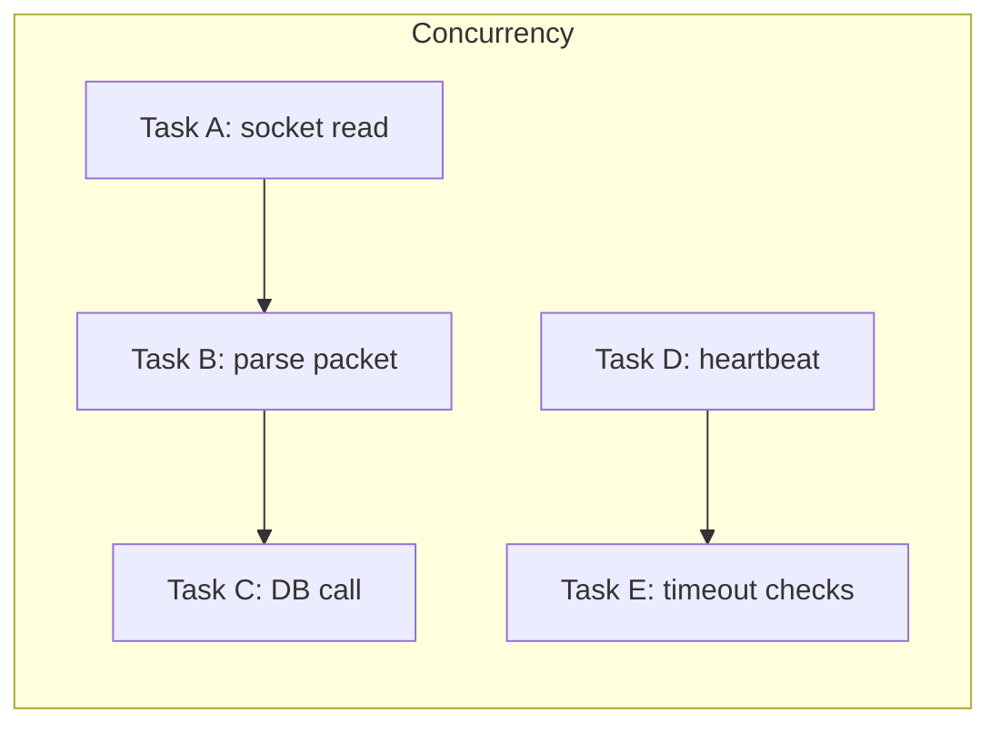

# Parallelism vs Concurrency Fundamentals

Parallelism and concurrency are related, but not the same thing:

- **Concurrency** = structuring a system so multiple tasks can make progress over time
- **Parallelism** = actually executing multiple tasks at the same instant (usually on multiple cores)

A server can be highly concurrent with a single thread (event loop). A threaded system can be parallel but poorly concurrent if it blocks often.

## Why This Matters for Networking

In networked systems, most work is **waiting**:

- waiting for sockets to become readable/writable
- waiting for disk/database/network responses
- waiting for game-state work from another subsystem

Concurrency helps you avoid idle time while waiting. Parallelism helps when CPU work is heavy (compression, pathfinding, simulation chunks, serialization batches).

## Mental Model



Concurrent scheduling interleaves tasks; parallel scheduling runs some at the same time.

## CSI vs GPR Lens

- **CSI**: prioritize predictable throughput and fairness across many clients/tasks
- **GPR**: prioritize frame-time stability; push heavy work off the main loop without introducing race-prone design

## Code Example (C++): Concurrent I/O + Parallel CPU Work

```cpp
#include <boost/asio.hpp>
#include <future>

boost::asio::awaitable<void> handle_packet(std::vector<uint8_t> packet) {
  // Parallelism: CPU-heavy work offloaded to another core.
  auto parsed = std::async(std::launch::async, [p = std::move(packet)] {
    // Simulate heavy parse/validation
    return p.size();
  });

  // Concurrency: async wait without blocking event loop thread.
  std::size_t bytes = parsed.get();
  co_return;
}
```

## Code Example (C#): Async Concurrency + Targeted Parallelism

```csharp
using System.Threading.Tasks;

public static async Task<int> ProcessMessageAsync(byte[] payload)
{
  // Concurrency: async wait keeps caller responsive.
  await Task.Delay(1);

  // Parallelism: move CPU-heavy work to worker thread.
  int score = await Task.Run(() => payload.Length * 2);
  return score;
}
```

## Design Rule

Start with a **concurrent architecture** (event loop + non-blocking I/O), then add **targeted parallelism** where profiling proves CPU pressure.
