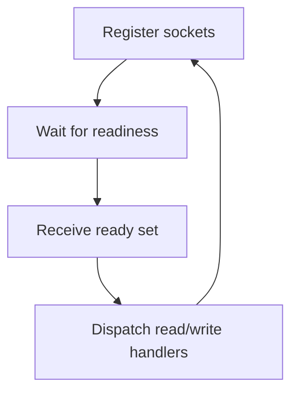

# I/O Multiplexing Concepts: select, poll, epoll

I/O multiplexing means one loop can observe many sockets and react only when each is ready.

## Core Idea

Instead of one thread blocked per connection, maintain a readiness set:

- **Readable**: data can be read now
- **Writable**: data can be written now
- **Exceptional/closed**: connection changed state

Then dispatch work for only the sockets that are ready.



## About `select`, `poll`, `epoll`

Treat these as **backend strategies** for the same architectural idea:

- monitor many descriptors
- sleep until readiness
- process ready descriptors

Higher-level frameworks (like Boost.Asio) abstract these details so your architecture stays portable.

## Code Example (C++): Multiplexing via `io_context`

```cpp
#include <boost/asio.hpp>

int main() {
    boost::asio::io_context io;
    boost::asio::steady_timer t1(io, std::chrono::milliseconds(10));
    boost::asio::steady_timer t2(io, std::chrono::milliseconds(20));

    t1.async_wait([](auto) { /* handler A */ });
    t2.async_wait([](auto) { /* handler B */ });

    // One loop dispatches multiple readiness events.
    io.run();
}
```

## Code Example (C#): Poll Multiple Sockets with `Socket.Select`

```csharp
using System.Collections.Generic;
using System.Net.Sockets;

static void DispatchReady(List<Socket> sockets)
{
    var readList = new List<Socket>(sockets);
    Socket.Select(readList, null, null, microSeconds: 10_000);

    foreach (var s in readList)
    {
        // s is readable now; process without blocking the whole system.
    }
}
```

You don’t need platform-specific APIs to understand the system design.

## CSI vs GPR Lens

- **CSI**: event-driven servers and connection fan-out
- **GPR**: integrate readiness checks into frame-safe update loops
