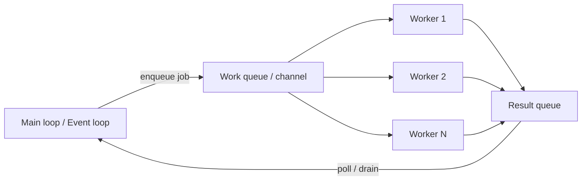

# Worker Threads and Thread Managers

A thread manager coordinates background execution so your main loop/event loop stays responsive.

## Responsibilities

A practical thread manager should define:

- how work is submitted
- where work is executed (worker pool)
- how results return to the owner loop
- how shutdown/cancellation happens safely

## Reference Architecture



## Unity/.NET-Oriented Pattern

- Main thread owns Unity engine objects and scene state
- Worker/jobs process pure data snapshots
- Main thread polls completion (`JobHandle` or queue/channel) and applies results safely

## C++ Oriented Pattern

- `std::jthread` (or pool workers) consume jobs from a synchronized queue
- Results are posted back to the owner thread/event loop
- Cooperative stop token controls graceful shutdown

## Key Rule

Never let background workers mutate shared gameplay/network objects directly without ownership rules. Prefer message passing + ownership boundaries over ad-hoc locks.

## Code Example (C++): `std::jthread` Worker + Result Queue

```cpp
#include <queue>
#include <mutex>
#include <optional>
#include <thread>

std::queue<int> jobs;
std::queue<int> results;
std::mutex m;

std::optional<int> try_pop(std::queue<int>& q) {
    std::scoped_lock lock(m);
    if (q.empty()) return std::nullopt;
    int v = q.front(); q.pop();
    return v;
}

void push_result(int v) {
    std::scoped_lock lock(m);
    results.push(v);
}

void worker_loop(std::stop_token st) {
    while (!st.stop_requested()) {
        if (auto job = try_pop(jobs)) {
            push_result((*job) * 2);
        }
    }
}
```

## Code Example (C#): Channel-Based Worker Manager

```csharp
using System.Threading.Channels;

var jobs = Channel.CreateUnbounded<int>();
var results = Channel.CreateUnbounded<int>();

_ = Task.Run(async () =>
{
    await foreach (var job in jobs.Reader.ReadAllAsync())
    {
        await results.Writer.WriteAsync(job * 2);
    }
});

// Main loop side
await jobs.Writer.WriteAsync(21);
if (results.Reader.TryRead(out var value))
{
    // Apply result safely on owner thread.
}
```
