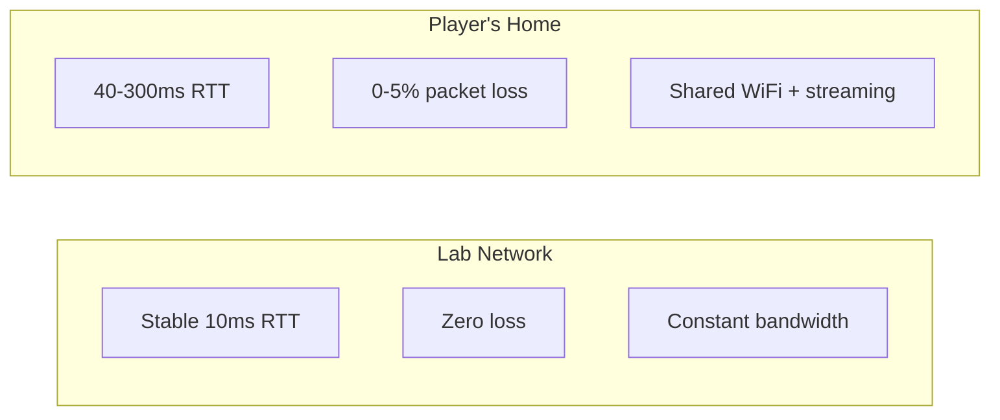
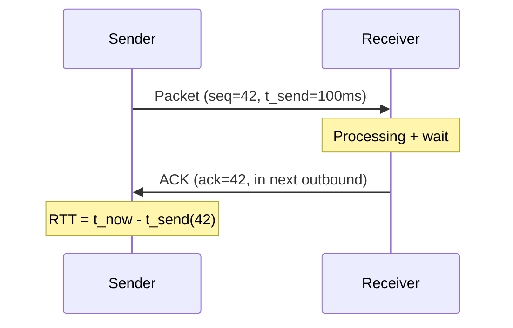
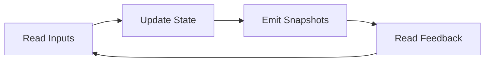
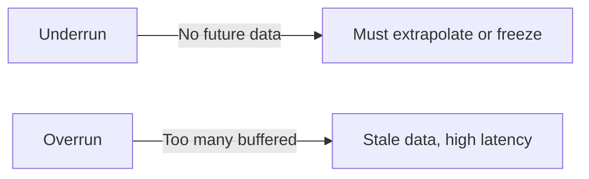
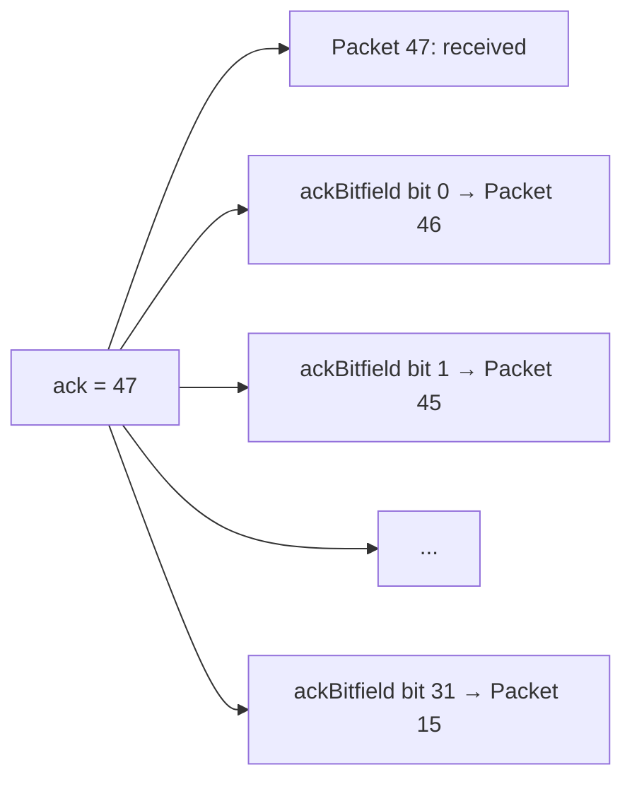
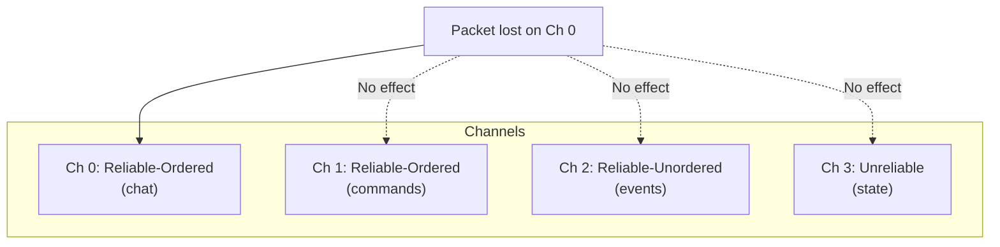
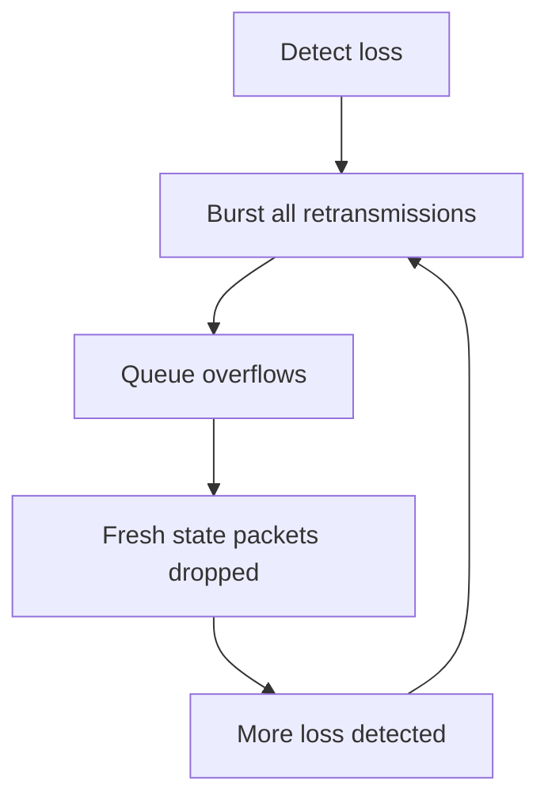
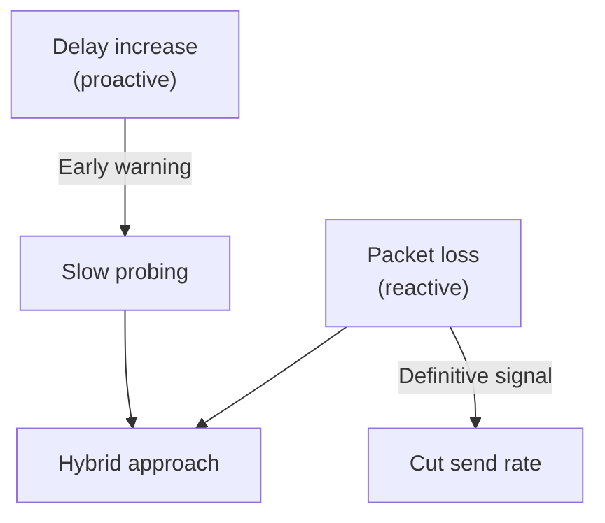
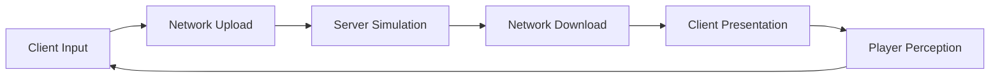
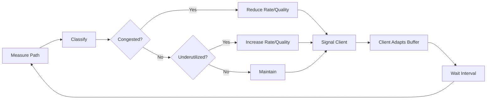

# Week 12: Performance, Reliability, and Packet Budgets

---

## Today's Agenda

1. Measuring the Right Signals: Latency, Jitter, and Packet Loss
2. Tick Rate and Simulation Frequency as Budget Decisions
3. Interpolation, Jitter Buffers, and Player-Visible Smoothness
4. Reliable UDP Fundamentals: Sequence Numbers, ACKs, and Selective Reliability
5. Retransmission and Loss Detection Strategy
6. Congestion, Pacing, and Fairness Under Load
7. Packet Budgets, Prioritization, and Degradation Strategy
8. CSI vs GPR Decision Patterns

---

## Recap: Non-Blocking I/O (Week 11)

Last week: non-blocking I/O, event loops, and concurrency patterns for handling many connections.

Now we have a **scalable server** — but what happens when the network is imperfect?

- Packets arrive late, out of order, or not at all
- Available bandwidth fluctuates
- Players on different connections expect fair treatment

This week: designing systems that stay **responsive under real-world conditions**.

---

## The Real-World Network Problem



Every design decision this week answers: **how do we deliver a good experience over the right-side network?**

---

## Part 1: Measuring the Right Signals

---

## Measurement-First Mindset

Most networking failures are first **measurement failures**.

Teams optimize what they can see — usually average ping.

Players suffer from what they **cannot** see:

- Jitter spikes
- Burst loss
- Tail latency events
- Queue buildup

You can't fix what you don't measure correctly.

---

## Three Metrics — Not Interchangeable

| Metric         | What It Measures                  | What It Does NOT Measure             |
| -------------- | --------------------------------- | ------------------------------------ |
| **Latency**    | Time for a packet to travel A → B | How much data can flow               |
| **RTT**        | Full round trip A → B → A         | One-way delay (paths are asymmetric) |
| **Throughput** | Bytes delivered per second        | How responsive the connection feels  |

A link can deliver **10 Mbit/s throughput** while individual packets experience **200ms of queueing delay**.

---

## One-Way Latency vs RTT

**One-way latency**: how stale is the state the other side sees?

- Requires synchronized clocks (NTP: ±5-20ms accuracy)
- Most directly relevant but hardest to measure

**RTT**: easiest reliable metric — uses one clock.

1. Sender records send timestamp for packet with sequence S
2. Receiver ACKs S in its next outbound packet
3. Sender computes: `RTT = now - send_timestamp(S)`

**Subtlety**: receiver processing delay is baked into RTT. High RTT may be receiver-side scheduling, not network delay.

---

## RTT Measurement



---

## Throughput ≠ Responsiveness

A game can receive all state updates within budget while players feel "laggy."

**Why?** Jitter-induced correction artifacts are invisible to throughput metrics.

Throughput matters for **capacity planning** and **bandwidth budgets**.

It is **not a substitute** for latency and jitter measurement when diagnosing responsiveness problems.

---

## Jitter: Delay Variation, Not "High Ping"

A connection with **100ms stable RTT** and zero jitter can feel **better** than one with **50ms average RTT** and 40ms jitter range.

Jitter directly attacks interpolation and buffering:

- Buffer underruns → extrapolation or freeze
- Rubber-banding → position corrections snap entities
- Uneven input acknowledgment → inconsistent responsiveness
- Correction amplitude spikes → visible teleporting

---

## Measuring Jitter (RFC 3550)

For consecutive packets i and i+1:

$$J_i = |(\text{recv}_{i+1} - \text{recv}_i) - (\text{send}_{i+1} - \text{send}_i)|$$

Where:

- $J_i$ = jitter estimate for interval $i \rightarrow i+1$
- $\text{recv}_i$ = receive timestamp of packet $i$
- $\text{send}_i$ = send timestamp of packet $i$
- $(\text{recv}_{i+1} - \text{recv}_i)$ = observed inter-arrival spacing
- $(\text{send}_{i+1} - \text{send}_i)$ = intended send spacing

So jitter is the absolute spacing mismatch between send cadence and arrival cadence.

If packets are sent every 50ms and received at 50ms intervals → jitter = 0.

If they arrive at 30ms then 70ms intervals → jitter is non-zero despite 50ms average spacing.

**Track both**:

- Short window (16-32 packets): current path behavior, real-time adaptation
- Long window (256-512 packets): session-level character, buffer sizing

---

## Packet Loss: Two Meanings

| Meaning                | What It Tells You                   | Action                           |
| ---------------------- | ----------------------------------- | -------------------------------- |
| **Reliability impact** | Messages need retransmit or discard | Choose reliability class per msg |
| **Path health signal** | Queue overflow, WiFi contention     | Feed congestion/pacing logic     |

**Critical distinction**: random isolated loss vs burst loss.

- 1% random loss: tolerable, interpolation bridges gaps
- 5 consecutive packets dropped: devastating freeze/teleport

---

## Why Averages Lie

Dashboard: "average RTT: 45ms, loss: 0.8%" → looks healthy.

Reality:

- p99 RTT: 350ms (massive delay spike every ~100 packets)
- Loss concentrated in bursts of 3-5 packets every few seconds

Player sees periodic freezing and rubber-banding. Dashboard stays green.

---

## What to Track Instead

| Metric           | What It Shows                  | Why It Matters         |
| ---------------- | ------------------------------ | ---------------------- |
| p50 RTT          | Typical experience             | Baseline feel          |
| p90 RTT          | Degraded-but-common experience | Correction frequency   |
| p99 RTT          | Worst-case tail events         | Teleport/freeze events |
| p50 jitter       | Typical variation              | Buffer sizing baseline |
| p99 jitter       | Worst-case variation           | Buffer underrun risk   |
| Mean loss %      | Long-term path character       | Capacity planning      |
| Max burst length | Worst-case consecutive loss    | Freeze/disconnect risk |

**How to read percentile labels (pXX):**

- **p50** = 50th percentile (median): 50% of samples are below this value
- **p90** = 90th percentile: 90% of samples are below this value, 10% are worse
- **p95** = 95th percentile: only 5% are worse
- **p99** = 99th percentile: only 1% are worse (tail behavior)

So if **p99 RTT = 350ms**, it means 99% of RTT samples are ≤ 350ms, and the worst 1% are above that.

---

## Worked Example: Two Players, Same Average

**Player A**: stable 60ms RTT, 0.5% random loss, 1ms jitter.

**Player B**: avg 40ms RTT, but p99 is 300ms, burst loss every 8 seconds.

Player B has **better average metrics** but **dramatically worse experience**.

Only tail metrics reveal this.

---

## Exponentially Weighted Moving Average (EWMA)

Raw measurements are noisy. Feeding them directly into adaptation logic causes oscillation.

**Exponentially Weighted Moving Average:**

$$\text{smoothed} = \alpha \cdot \text{new_sample} + (1 - \alpha) \cdot \text{smoothed}$$

---

## EWMA: Symbols and Meaning

Where:

- $\text{new\_sample}$ = newest raw measurement (for example, latest RTT)
- $\text{smoothed}$ (right side) = previous smoothed value
- $\alpha$ (alpha) = smoothing factor in the range 0 to 1

Interpretation of $\alpha$:

- larger $\alpha$ (for example 0.3): reacts faster, but noisier
- smaller $\alpha$ (for example 0.05): reacts slower, but more stable

---

## EWMA: Quick Numeric Example

Quick example:

- previous smoothed RTT = 80ms
- new sample = 120ms
- $\alpha = 0.125$

$$\text{smoothed} = 0.125 \cdot 120 + 0.875 \cdot 80 = 85\text{ms}$$

So EWMA softens spikes instead of overreacting.

---

## EWMA in RTT Estimation (RFC 6298)

**Smoothed RTT + Variance (RFC 6298):**

$$\text{SRTT} = (1 - \alpha) \cdot \text{SRTT} + \alpha \cdot R$$
$$\text{RTTVAR} = (1 - \beta) \cdot \text{RTTVAR} + \beta \cdot |\text{SRTT} - R|$$

Standard: $\alpha = 1/8$, $\beta = 1/4$.

Notation legend:

- $R$ = latest RTT sample
- $\text{SRTT}$ = Smoothed RTT
- $\text{RTTVAR}$ = RTT variation estimate
- $\alpha$ = smoothing factor for mean RTT
- $\beta$ = smoothing factor for RTT variation

Why both terms matter:

- $\text{SRTT}$ tracks the center (typical RTT)
- $\text{RTTVAR}$ tracks volatility (how jumpy RTT is)

---

## Clock Rules

- **Always** use monotonic clocks (`steady_clock` in C++, `Stopwatch` in C#)
- Wall-clock time can jump backwards during NTP adjustments
- Record timestamps at **packet boundaries**, not processing time
- Label measurement direction: uplink and downlink behave differently

---

## Code: RTT + Jitter Tracker (C++)

```cpp
struct PathMetrics {
    double srtt = 0.0;      // Smoothed RTT (ms)
    double rttvar = 0.0;    // RTT variation estimate (ms)
    bool srttInit = false;  // True after first sample

    void addRttSample(double rttMs) {
        if (!srttInit) {
            srtt = rttMs;          // Initialize SRTT with first sample
            rttvar = rttMs / 2.0;  // Conservative bootstrap for variation
            srttInit = true;
        } else {
            // Update variation using previous SRTT
            rttvar = 0.75 * rttvar + 0.25 * std::abs(srtt - rttMs);
            // EWMA update for RTT mean
            srtt   = 0.875 * srtt + 0.125 * rttMs;
        }
    }
};
```

---

## Code: RTT + Jitter Tracker (C#)

```csharp
public class PathMetrics
{
    public double Srtt { get; private set; }   // Smoothed RTT (ms)
    public double RttVar { get; private set; } // RTT variation estimate (ms)
    private bool _init;                        // Has first sample been processed?

    public void AddRttSample(double rttMs)
    {
        if (!_init) {
            Srtt = rttMs;          // First sample initializes average
            RttVar = rttMs / 2.0;  // Conservative initial variation
            _init = true;
        } else {
            // Update variation first (uses old Srtt)
            RttVar = 0.75 * RttVar + 0.25 * Math.Abs(Srtt - rttMs);
            // Then update smoothed RTT
            Srtt   = 0.875 * Srtt + 0.125 * rttMs;
        }
    }
}
```

---

## Measurement Anti-Patterns

1. Treating throughput as responsiveness
2. Tuning to average RTT only — misses tail events
3. Triggering congestion logic from tiny sample sets
4. Mixing clock domains (wall time for RTT)
5. No burst-loss tracking
6. Hardcoded thresholds without percentile context

---

## CSI ↔ GPR: Measurement

| Context | Focus                                                             |
| ------- | ----------------------------------------------------------------- |
| CSI     | Statistical validity, EWMA, capacity planning                     |
| GPR     | Player-visible outcomes, correction frequency, perceived fairness |

Same infrastructure. Different optimization targets.

---

## Part 2: Tick Rate and Simulation Frequency

---

## Tick Rate Is a Budget Decision

Not just a quality slider. It controls:

- Cadence of authority updates
- Packet creation pressure on transport
- CPU cost of simulation
- Correction frequency clients must absorb

Changing tick rate without understanding downstream effects → instability.

---

## Freshness vs Send Pressure

**Higher tick rate (60 Hz)**:

- Snapshots every ~16.7ms → clients see recent state
- Smaller corrections → smoother feel
- 60 × 20 clients = 1,200 pkt/s from server

**Lower tick rate (20 Hz)**:

- Snapshots every 50ms → older state, larger corrections
- 20 × 20 clients = 400 pkt/s
- 3× less transport cost

---

## The Non-Linear Cost Curve

Doubling tick rate doesn't simply double cost:

- Queue occupancy can pass a **tipping point** → tail latency spikes
- Consumer routers struggle above ~1,000 small UDP pkt/s
- Serialization CPU competes with simulation CPU

---

## Worked Example: 64-Tick vs 128-Tick FPS

| Metric                         | 64-tick  | 128-tick   |
| ------------------------------ | -------- | ---------- |
| Snapshot interval              | 15.6ms   | 7.8ms      |
| Packets/sec (32 players)       | 2,048    | 4,096      |
| Bytes/sec @ 300B/pkt           | 614 KB/s | 1,229 KB/s |
| Interpolation delay (2 frames) | 31.2ms   | 15.6ms     |
| Correction amplitude           | lower    | even lower |

Halved interpolation delay improves feel — but doubled transport pressure requires compression or higher bandwidth budget.

---

## Lower Rates: Harder Client Work

At 20 Hz:

- Interpolation bridges 50ms gaps (character moves 25cm at 5 m/s)
- Prediction diverges more → larger corrections
- One missed snapshot = 50ms extrapolation (risky)

At 60 Hz:

- 16.7ms gaps → 8.3cm per snapshot
- Missed snapshot = 16.7ms extrapolation (safe)

**Tension**: lower rates save bandwidth but produce larger, more visible corrections.

---

## CSI: Tick Rate as Sampling Interval

The server is a **discrete control system**:



Events faster than 2× tick rate are **aliased or missed** (Nyquist).

### Tick Rate as Resource Contract

- Define CPU budget per tick
- Define bytes/sec per client
- Define packets/sec per client
- Choose tick rate satisfying **all** constraints simultaneously

---

## GPR: Tick Rate as Responsiveness

End-to-end latency budget:

| Component                      | 20 Hz     | 60 Hz    | 128 Hz   |
| ------------------------------ | --------- | -------- | -------- |
| Client input (60fps)           | 16.7ms    | 16.7ms   | 16.7ms   |
| Upload latency                 | 20ms      | 20ms     | 20ms     |
| Server tick wait (avg)         | 25ms      | 8.3ms    | 3.9ms    |
| Download latency               | 20ms      | 20ms     | 20ms     |
| Interpolation delay (2 frames) | 100ms     | 33.3ms   | 15.6ms   |
| **Total**                      | **182ms** | **98ms** | **76ms** |

Players **feel** this difference. Competitive communities demand higher tick rates.

---

## The Three Clocks Must Align

1. **Simulation tick rate**: how often the server advances state
2. **Snapshot send cadence**: how often state is sent (may be ≤ tick rate)
3. **Client interpolation delay**: how far behind "now" the client renders

These are coupled. Changing one without adjusting others → artifacts.

---

## Common Misalignment

**Fast tick, slow send**: server ticks 60 Hz, sends at 20 Hz. Client buffer sized for tick rate (16.7ms) → constant underruns.

**Fix**: size interpolation buffer to **send cadence**, not tick rate.

**Alignment guideline**:

$$T_{\text{interp}} \geq T_{\text{send}} + J_{p90}$$

Where:

- $T_{\text{interp}}$ = interpolation delay (ms)
- $T_{\text{send}}$ = expected send interval (ms)
- $J_{p90}$ = 90th-percentile jitter (ms)

Meaning: leave enough delay to cover one expected update gap plus high (but not extreme) jitter.

---

## Adaptation Under Degraded Conditions

Do NOT "send more" under stress. Additional packets during congestion:

- Increase queue occupancy → higher RTT
- Increase loss probability → more retransmissions
- Create positive feedback loop of degradation

**Instead**: preserve critical data, decimate non-critical, signal clients to adjust buffers.

---

## Fallback Profiles with Hysteresis

| Profile     | Send Rate | Content              | Interp Target |
| ----------- | --------- | -------------------- | ------------- |
| Normal      | 20 Hz     | Full state delta     | 65ms          |
| Constrained | 10 Hz     | Critical + high-prio | 115ms         |
| Severe      | 5 Hz      | Critical only        | 215ms         |

Degrade after ~30 stressed ticks. Recover after ~60 healthy ticks. **Hysteresis prevents oscillation.**

---

## Code: Send Scheduler (C++)

```cpp
struct SendScheduler {
    std::chrono::milliseconds normalInterval{50};    // 20 Hz
    std::chrono::milliseconds degradedInterval{100};  // 10 Hz
    bool degraded = false;

    bool shouldSendNow(Clock::time_point now, Clock::time_point& nextSend) {
        auto interval = degraded ? degradedInterval : normalInterval;
        if (now >= nextSend) {
            nextSend = now + interval;
            return true;
        }
        return false;
    }
};
```

---

## Code: Send Profile Manager (C#)

```csharp
public class SendProfileManager
{
    public PathProfile Current { get; private set; } = PathProfile.Normal;
    private int _degradedTicks, _healthyTicks;

    public void Update(double rttMs, double jitterMs, double lossPct)
    {
        bool stressed = rttMs > 120 || jitterMs > 25 || lossPct > 3.0;
        if (stressed) { _healthyTicks = 0; _degradedTicks++; }
        else { _degradedTicks = 0; _healthyTicks++; }
        // Hysteresis: degrade faster, recover slower
        if (_degradedTicks > 30) StepDown();
        else if (_healthyTicks > 60) StepUp();
    }
}
```

---

## CSI ↔ GPR: Tick Rate

| Context | Priority                                       |
| ------- | ---------------------------------------------- |
| CSI     | Resource efficiency, stability margin, budgets |
| GPR     | Responsiveness, correction amplitude, fairness |

Set by GPR requirement, bounded by CSI constraint.

---

## Part 3: Interpolation and Jitter Buffers

---

## The Core Problem

Server sends at 20 Hz (every 50ms). Arrivals vary:

| Snapshot | Arrival Gap |
| -------- | ----------- |
| S1→S2    | 52ms        |
| S2→S3    | 44ms        |
| S3→S4    | 60ms        |
| S4→S5    | 43ms        |
| S5→S6    | 68ms        |

Rendering on arrival → visible stutter (fast, slow, fast, slow).

The server simulation is perfectly smooth. The **network** makes it choppy.

---

## The Interpolation Buffer

Introduces **deliberate delay**. Client renders behind the latest received data:

```
Real time (server):    ──────────────────────>
Render time (player):  ──────────────>
                       ← buffer delay →
```

At each render frame:

1. `t_render = t_now - buffer_delay`
2. Find snapshots A (before) and B (after) bracketing `t_render`
3. `alpha = (t_render - t_A) / (t_B - t_A)`
4. Lerp between A and B

---

## Buffer Underrun vs Overrun



- **Underrun**: render timestamp passed latest snapshot → visible artifact
- **Overrun**: too much buffered → player sees old state, input feels delayed

A well-tuned buffer avoids both extremes.

---

## Adaptive Buffer Sizing

Static buffers are fragile. Use jitter measurement:

$$T_{\text{buffer}} = T_{\text{send}} + k \cdot J_{\text{measured}}$$

- $T_{\text{send}}$: expected send interval
- $J_{\text{measured}}$: running jitter estimate (EWMA or percentile)
- $k$: safety multiplier (1.5–3.0)

Symbol notes:

- $k$ is unitless (a multiplier, not milliseconds)
- Higher $k$ increases smoothness safety margin but also increases latency

**Example**: 50ms send interval, p90 jitter 12ms, k=2.0:

$$T_{\text{buffer}} = 50 + 2.0 \times 12 = 74\text{ms}$$

---

## The Delay-for-Smoothness Tradeoff

$$T_{\text{total}} = T_{\text{input}} + T_{\text{upload}} + T_{\text{server}} + T_{\text{download}} + T_{\text{buffer}} + T_{\text{render}}$$

Where:

- $T_{\text{input}}$ = input sampling/queue delay
- $T_{\text{upload}}$ = client → server network delay
- $T_{\text{server}}$ = server scheduling + processing delay
- $T_{\text{download}}$ = server → client network delay
- $T_{\text{buffer}}$ = interpolation delay
- $T_{\text{render}}$ = render pipeline delay

| Component                                   | Time              |
| ------------------------------------------- | ----------------- |
| Input + upload + server + download + render | ~99ms             |
| **Buffer at 75ms**                          | → **174ms total** |
| **Buffer at 30ms**                          | → **129ms total** |

Every ms of buffer = 1 ms more insurance against jitter, but 1 ms more delay for the player.

---

## Genre-Dependent Buffer Sizing

| Genre                  | Acceptable Extra Delay | Smoothness Requirement |
| ---------------------- | ---------------------- | ---------------------- |
| Competitive FPS        | 15-30ms                | Moderate               |
| Action RPG             | 50-80ms                | High                   |
| Strategy/MOBA          | 80-120ms               | Very high              |
| MMO with many entities | 100-200ms              | Critical               |

---

## Handling Packet Loss in the Buffer

**Single packet loss** (S3 lost, have S2 and S4):

1. ✅ Interpolate S2→S4 directly (wider span, smooth)
2. ⚠️ Extrapolate from S2 (risky if direction changed)
3. ❌ Hold S2 and snap to S4 (visible hitch)

**Burst loss** (2-3 packets): buffer drains completely.

- Extrapolate with velocity damping → decelerate to stop
- When new data arrives → **blend** to correct position (100-200ms)
- **Never snap** — always smooth the correction

---

## Interpolation vs Extrapolation

| Property      | Interpolation          | Extrapolation                  |
| ------------- | ---------------------- | ------------------------------ |
| Data required | Two known states (A,B) | One state + velocity           |
| Bounded?      | Yes (between A and B)  | No (can diverge)               |
| Safe for      | Always                 | Short windows, straight motion |
| Fails when    | Teleport between A,B   | Direction change, collision    |

---

## Correction Magnitude by Miss Count

Entity at 5 m/s, server at 20 Hz (50ms intervals):

| Missed Snapshots | Extrapolation | Max Error (direction change) |
| ---------------- | ------------- | ---------------------------- |
| 0                | 0ms           | 0cm                          |
| 1                | 50ms          | ~25cm                        |
| 2                | 100ms         | ~50cm                        |
| 3                | 150ms         | ~75cm                        |

75cm correction = clearly visible teleport. Minimize extrapolation, smooth corrections.

---

## Blended Correction

Instead of snapping:

$$P_{visual} = P_{authority} + correction\_offset \cdot decay$$

Where:

- $P_{visual}$ = position currently shown on screen
- $P_{authority}$ = latest server-authoritative position
- $correction\_offset$ = mismatch vector between visual and authoritative positions
- $decay$ = blend factor that shrinks toward 0 over time

`correction_offset` starts at $\Delta$ and decays to zero over 100-300ms.

Entity **visually glides** to correct position rather than teleporting.

---

## Buffer Sizing Decision Matrix

| Send Rate | Network Quality | Formula            | Typical Buffer |
| --------- | --------------- | ------------------ | -------------- |
| 60 Hz     | Good            | $T_s + J_{p75}$    | 20-25ms        |
| 60 Hz     | Fair            | $1.5T_s + J_{p90}$ | 35-45ms        |
| 20 Hz     | Good            | $2T_s + J_{p90}$   | 110-120ms      |
| 20 Hz     | Poor            | $2.5T_s + J_{p95}$ | 150-170ms      |

Notation:

- $T_s$ = send interval (same as $T_{\text{send}}$)
- $J_{p75}$ / $J_{p90}$ / $J_{p95}$ = 75th/90th/95th percentile jitter
- Higher percentile jitter means designing for rarer but larger spikes

---

## Code: Interpolation Buffer (C++)

```cpp
struct Snapshot {
    double serverTime;
    float x, y, z;
};

class InterpolationBuffer {
    std::deque<Snapshot> buffer;
    double bufferDelayMs = 65.0; // Jitter-buffer delay in ms

public:
    void addSnapshot(Snapshot s) { buffer.push_back(s); } // Append newest snapshot

    Snapshot sample(double currentTime) {
        double renderTime = currentTime - bufferDelayMs; // Time we want to render
        // Find bracketing snapshots A and B
        for (size_t i = 0; i + 1 < buffer.size(); i++) {
            if (buffer[i].serverTime <= renderTime &&
                buffer[i+1].serverTime >= renderTime) {
                double alpha = (renderTime - buffer[i].serverTime) /
                    (buffer[i+1].serverTime - buffer[i].serverTime);
                return lerp(buffer[i], buffer[i+1], alpha); // Smoothly blend A -> B
            }
        }
        return buffer.empty() ? Snapshot{} : buffer.back(); // Fallback if no bracket exists
    }
};
```

---

## Code: Interpolation Buffer (C#)

```csharp
public class InterpolationBuffer
{
    private readonly Queue<Snapshot> _buffer = new();
    private double _bufferDelayMs = 65.0; // Jitter-buffer delay in ms

    public void AddSnapshot(Snapshot s) => _buffer.Enqueue(s); // Append newest state

    public Snapshot Sample(double currentTime)
    {
        double renderTime = currentTime - _bufferDelayMs; // Desired simulation timestamp
        var arr = _buffer.ToArray();
        for (int i = 0; i + 1 < arr.Length; i++)
        {
            if (arr[i].ServerTime <= renderTime &&
                arr[i+1].ServerTime >= renderTime)
            {
                double alpha = (renderTime - arr[i].ServerTime) /
                    (arr[i+1].ServerTime - arr[i].ServerTime);
                return Snapshot.Lerp(arr[i], arr[i+1], (float)alpha); // Smooth blend
            }
        }
        return arr.Length > 0 ? arr[^1] : default; // Fallback: latest known state
    }
}
```

---

## CSI ↔ GPR: Interpolation

| Context | Focus                                              |
| ------- | -------------------------------------------------- |
| CSI     | Minimum buffer delay for control-loop stability    |
| GPR     | Smoothness that passes player muster, genre-tuning |

CSI sets the range. GPR tunes within the range.

---

## Part 4: Reliable UDP Fundamentals

---

## Why Not TCP?

TCP gives you: ordering, reliability, congestion control.

TCP also gives you: **head-of-line blocking** and **mandatory retransmission**.

A lost position update **blocks** all subsequent data — even though the next position supersedes the lost one.

Games need **selective** reliability. UDP + custom protocol = only guarantee what matters.

---

## Sequence Numbers: Ordering and Freshness

Each outbound packet gets a monotonically increasing sequence number.

**Freshness check**: "Is this newer than what I have?"

```
// 16-bit wrapping comparison
bool isMoreRecent(uint16_t a, uint16_t b) {
    return (int16_t)(a - b) > 0;
}
```

16-bit wraps at 65,536. At 60 pkt/s → wraps every ~18 min. Signed arithmetic handles wrap correctly.

---

## Two Purposes of Sequence Numbers

| Purpose                  | Used For                    | Receiver Action                       |
| ------------------------ | --------------------------- | ------------------------------------- |
| **Freshness**            | Unreliable state (position) | Discard if seq ≤ highest seen         |
| **Reliability tracking** | Reliable messages (events)  | Track which seqs arrived, report gaps |

Same sequence number, different receiver logic.

---

## Worked Example: Out-of-Order Arrival

Server sends seqs 10, 11, 12, 13. Client receives: 10, 12, 11, 13.

| Arrival | Seq | Unreliable Action           | Reliable Action        |
| ------- | --- | --------------------------- | ---------------------- |
| 1st     | 10  | Process, highest=10         | Record, process        |
| 2nd     | 12  | Process (12>10), highest=12 | Record, note gap at 11 |
| 3rd     | 11  | **Discard** (11<12)         | Record, gap filled     |
| 4th     | 13  | Process (13>12)             | Record, process        |

Unreliable: packet 11 is stale. Reliable: packet 11 still processed.

---

## The ACK + Bitfield Pattern

Every outgoing packet carries:

```
struct PacketHeader {
    uint16_t sequence;     // This packet's sequence
    uint16_t ack;          // Highest remote sequence received
    uint32_t ackBitfield;  // Which of 32 packets before 'ack' were received
};
```

**8 bytes** covers 33 packets of ACK history. Redundant on every packet — lost ACKs don't matter.

---

## How the Bitfield Works



Set bit = received. Clear bit = not (yet) received.

**Why robust**: every outbound packet repeats the full ACK state. Even 30% loss, ACK info gets through.

---

## Packets vs Messages

A **packet** is a UDP datagram — arrives completely or not at all.

A **message** is a logical unit (command, event, state update).

Multiple messages → one packet. ACKs are at the **packet** level. Reliability decisions at the **message** level.

When packet ACK confirms delivery → all messages in that packet delivered. When packet declared lost → reliable messages queued for retransmission.

---

## Four Reliability Classes

| Class                | Retransmit? | Ordered?      | Use Case                |
| -------------------- | ----------- | ------------- | ----------------------- |
| Unreliable           | No          | No            | Position, heartbeats    |
| Unreliable-Sequenced | No          | Discard stale | Voice audio, animation  |
| Reliable-Unordered   | Yes         | No            | Damage, score, spawns   |
| Reliable-Ordered     | Yes         | Yes           | Chat, command sequences |

**Critical**: reliable-ordered creates head-of-line blocking **within its channel** — use separate channels!

---

## Channel Isolation



A lost packet on channel 0 blocks channel 0 only. **Critical difference from TCP.**

---

## FPS Message Classification

| Message           | Class              | Channel | Rationale                         |
| ----------------- | ------------------ | ------- | --------------------------------- |
| Player position   | Unreliable         | 3       | Superseded by next update         |
| Weapon fire       | Reliable-unordered | 2       | Must arrive, order doesn't matter |
| Kill notification | Reliable-unordered | 2       | Must arrive                       |
| Chat text         | Reliable-ordered   | 0       | Conversation order matters        |
| Voice audio       | Unreliable-seq     | 4       | Real-time, discard stale          |

---

## Delta Encoding: Implicit Reliability

Delta-encoded state self-corrects on loss:

1. Server computes delta from client's last ACK'd baseline
2. If delta packet is lost → server detects via ACK bitfield
3. Next delta computed against **same baseline** (client didn't advance)
4. Lost changes naturally included in next delta

**No explicit retransmission needed** for state — elegant and efficient.

---

## Code: ACK Tracker (C++)

```cpp
class AckTracker {
    uint16_t localSequence = 0;
    uint16_t remoteSequence = 0;
    uint32_t receivedBitfield = 0; // History bits of prior received packets

public:
    void onReceive(uint16_t remoteSeq) {
        if (isMoreRecent(remoteSeq, remoteSequence)) {
            int shift = (int16_t)(remoteSeq - remoteSequence); // How far sequence advanced
            receivedBitfield = (shift > 32)
                ? 0 : (receivedBitfield << shift) | (1u << (shift - 1)); // Slide + mark newest prior
            remoteSequence = remoteSeq; // Update highest sequence seen
        } else {
            int offset = (int16_t)(remoteSequence - remoteSeq); // Distance behind current head
            if (offset > 0 && offset <= 32)
                receivedBitfield |= (1u << (offset - 1)); // Mark late packet in history window
        }
    }

    PacketHeader buildHeader(uint16_t seq) const {
        return {seq, remoteSequence, receivedBitfield};
    }
};
```

---

## Code: Reliability Manager (C#)

```csharp
public class ReliabilityManager
{
    private readonly Dictionary<ushort, PendingMessage> _pending = new(); // Reliable messages waiting ACK
    private readonly HashSet<ushort> _receivedIds = new(); // Dedup set

    public void OnMessageSent(GameMessage msg, ushort pktSeq, double now)
    {
        if (msg.Reliability >= ReliabilityClass.ReliableUnordered)
            _pending[msg.Id] = new PendingMessage(msg, pktSeq, now); // Track until delivered
    }

    public void OnPacketAcked(ushort pktSeq)
    {
        foreach (var id in _pending.Where(
            kv => kv.Value.PacketSeq == pktSeq).Select(kv => kv.Key).ToList())
            _pending.Remove(id); // ACK confirms delivery for that packet's messages
    }

    public bool ShouldProcess(ushort messageId)
    {
        if (_receivedIds.Contains(messageId)) return false; // Duplicate replay
        _receivedIds.Add(messageId);
        return true; // First-time message
    }
}
```

---

## CSI ↔ GPR: Reliable UDP

| Context | Priority                                 |
| ------- | ---------------------------------------- |
| CSI     | Protocol correctness, no data corruption |
| GPR     | Events players care about always arrive  |

CSI validates the implementation. GPR classifies which messages need reliability.

---

## Part 5: Retransmission and Loss Detection

---

## The Fundamental Ambiguity

When you send a packet and don't get an ACK:

1. **Packet was lost** → correct to retransmit
2. **ACK was lost** → wasteful but harmless (if dedup works)
3. **Still in transit** → wasteful AND adds congestion

You **cannot distinguish** these in real time. Every retransmission is a bet.

---

## The Cost of Wrong Bets

| Bet Wrong            | Consequence                                                   |
| -------------------- | ------------------------------------------------------------- |
| Retransmit too early | Bandwidth waste, congestion risk, shrinking RTO feedback loop |
| Retransmit too late  | Delayed recovery, head-of-line blocking, player frustration   |

---

## Two Detection Signals

| Signal         | Speed                | False Positive Rate            |
| -------------- | -------------------- | ------------------------------ |
| Timeout (RTO)  | Slow (200-500ms)     | Low (if conservative)          |
| NACK inference | Fast (~50ms at 60Hz) | Moderate (reordering triggers) |

**NACK inference**: ACK bitfield shows packets 20, 22, 23 received but 21 not → strong evidence 21 is lost.

**Practical threshold**: require 3-4 subsequent ACKs before declaring loss. Tolerates mild reordering.

---

## RTT Estimation → RTO

$$\text{RTTVAR} = (1 - \beta) \times \text{RTTVAR} + \beta \times |R - \text{SRTT}|$$
$$\text{SRTT} = (1 - \alpha) \times \text{SRTT} + \alpha \times R$$
$$\text{RTO} = \text{SRTT} + K \times \text{RTTVAR}$$

Standard: $\alpha = 0.125$, $\beta = 0.25$, $K = 4$.

Legend:

- $R$ = newest RTT sample
- $\text{SRTT}$ = smoothed RTT estimate
- $\text{RTTVAR}$ = RTT variation estimate
- $\alpha$ = smoothing for RTT mean
- $\beta$ = smoothing for RTT variation
- $K$ = safety factor for timeout margin
- $\text{RTO}$ = retransmission timeout

Stable 50ms connection → RTO ≈ 60-70ms.
Variable (SRTT=50, RTTVAR=20) → RTO ≈ 130ms.

---

## Worked Example: SRTT Computation

| Sample | R (ms) | SRTT (ms) | RTTVAR (ms) | RTO (ms) |
| ------ | ------ | --------- | ----------- | -------- |
| Init   | —      | 100       | 50          | 300      |
| 1      | 85     | 98.1      | 41.3        | 263      |
| 2      | 90     | 97.1      | 33.7        | 232      |
| 3      | 120    | 100.0     | 31.0        | 224      |
| 4      | 95     | 99.4      | 24.4        | 197      |
| 5      | 200    | 112.0     | 43.5        | 286      |

Sample 5 spikes → RTTVAR jumps → RTO increases. Correct behavior: more conservative after instability.

---

## Karn's Algorithm

**Never** use RTT samples from retransmitted packets.

You don't know if the ACK corresponds to the original or the retransmit. Ambiguous samples → shrinking RTO → more spurious retransmits → feedback loop.

Only measure RTT from packets sent **once** and ACK'd **once**.

---

## Exponential Backoff

When retransmissions fail, **double the wait**:

$$\text{RTO}_n = \text{RTO}_{\text{base}} \times 2^n$$

Where:

- $\text{RTO}_{\text{base}}$ = current base timeout
- $n$ = retransmission attempt number (0, 1, 2, ...)
- $2^n$ = exponential growth term

| Attempt | Wait   | Cumulative |
| ------- | ------ | ---------- |
| 1       | 200ms  | 200ms      |
| 2       | 400ms  | 600ms      |
| 3       | 800ms  | 1.4s       |
| 4       | 1600ms | 3.0s       |
| 5       | 3200ms | 6.2s       |

**Reset** when any fresh ACK arrives (path is working).

---

## Why "Resend Everything" Fails



The **retransmission cascade**: each burst causes more loss, triggering more bursts.

---

## The Correct Approach: Paced Retransmission

**Without pacing**: 5 retransmissions in < 1ms → buffer overflow → 2 dropped → more retransmits.

**With pacing**: 1 retransmission per send interval, spread over 250ms. No overflow. Fresh data interleaved.

Retransmission is a **budget line item**, not an emergency:

$$B_{\text{tick}} = B_{\text{fresh}} + B_{\text{retransmit}} + B_{\text{overhead}}$$

Where:

- $B_{\text{tick}}$ = total bytes available this tick
- $B_{\text{fresh}}$ = bytes for newly generated payload
- $B_{\text{retransmit}}$ = bytes reserved for retries
- $B_{\text{overhead}}$ = bytes used by headers/protocol metadata

---

## Code: Loss Detector (C++)

```cpp
class LossDetector {
    double srtt = 100.0, rttvar = 50.0, rto = 300.0;
    static constexpr int NackThreshold = 3;

    std::vector<LossEvent> detectLosses(
        std::vector<SentPacketRecord>& sent, double now)
    {
        std::vector<LossEvent> losses;
        for (auto& p : sent) {
            if (p.acked || p.lossDetected) continue; // Already resolved
            // NACK: 3+ subsequent packets ACK'd
            if (p.subsequentAcks >= NackThreshold) {
                p.lossDetected = true;
                losses.push_back({p.sequence, p.sendTime}); // Fast loss inference path
            }
            // Timeout: RTO exceeded
            else if ((now - p.sendTime) > rto) {
                p.lossDetected = true;
                losses.push_back({p.sequence, p.sendTime}); // Conservative fallback path
            }
        }
        return losses;
    }
};
```

---

## Code: Retransmission Scheduler (C#)

```csharp
public class RetransmissionScheduler
{
    private double _rto = 300;         // Base timeout in ms
    private const int MaxAttempts = 6; // Safety cap to avoid infinite retries

    public List<(ushort Id, byte[] Data)> GetDueRetransmissions(double now)
    {
        var due = new List<(ushort, byte[])>();
        foreach (var p in _pending)
        {
            if (p.Attempt >= MaxAttempts) { Expire(p); continue; }
            if (now >= p.NextRetransmitTime)
            {
                due.Add((p.MessageId, p.Payload)); // Schedule retransmission
                p.Attempt++; // Track how many retries happened
                p.NextRetransmitTime = now + _rto * Math.Pow(2, p.Attempt); // Exponential backoff
            }
        }
        return due; // Caller paces: one per send interval
    }
}
```

---

## CSI ↔ GPR: Retransmission

| Context | Priority                                        |
| ------- | ----------------------------------------------- |
| CSI     | No spurious retransmits, bounded recovery       |
| GPR     | Fast recovery for gameplay events, player trust |

CSI detects correctly. GPR prioritizes retransmission order.

---

## Part 6: Congestion, Pacing, and Fairness

---

## What Is Congestion?

```
Sender rate > Link capacity → Queue grows → Latency rises → Drops begin
```

TCP has built-in congestion control. **UDP has none.**

A naive UDP protocol can:

- Fill router buffers → spike latency for **all** users on the link
- Trigger ISP throttling
- Make the player's own web browsing and video calls crawl

---

## Core Principles

1. **Don't send faster** than the path can carry
2. **When signals indicate congestion** → reduce
3. **When signals indicate recovery** → increase cautiously
4. **Account for all traffic** — the path is shared

---

## Detecting Congestion

Three signals:

| Signal         | Detection Method   | Reliability |
| -------------- | ------------------ | ----------- |
| Packet loss    | ACK gaps, timeout  | High        |
| Delay increase | RTT above baseline | Moderate    |
| ECN            | IP header bits     | High (rare) |

**Practical**: loss + delay. Use delay as early warning, loss as confirmation.

---

## Delay-Based vs Loss-Based



Most game protocols use **hybrid**: delay warns, loss confirms.

---

## Pacing vs Burst Sending

**Burst**: 3 packets in 2ms, then nothing for 148ms.

- Overflows small router queues
- Spikes latency within the burst
- Interacts badly with WiFi scheduling

**Pacing**: 1 packet per 50ms. Smooth, predictable, minimal queue impact.

---

## Staggering Client Sends

Server with 32 clients at 20 Hz = 640 pkt/s. All 32 at once = 32-packet burst every 50ms.

**Better**: stagger across the tick interval.

$$\text{stagger}(i) = \frac{i \times T_{\text{tick}}}{N_{\text{clients}}}$$

Where:

- $i$ = client index in send order (0-based)
- $T_{\text{tick}}$ = tick duration in milliseconds
- $N_{\text{clients}}$ = number of clients being scheduled this tick
- $\text{stagger}(i)$ = send offset for client $i$

32 clients over 50ms → 1.56ms between sends. No burst effects.

---

## AIMD: Additive Increase, Multiplicative Decrease

$$R_{new} = \begin{cases} R_{old} + \alpha & \text{if no congestion} \\ R_{old} \times \beta & \text{if congestion detected} \end{cases}$$

Where:

- $R_{old}$ = current send rate (packets/s)
- $R_{new}$ = updated send rate
- $\alpha$ = additive increase step
- $\beta$ = multiplicative decrease factor ($0 < \beta < 1$)

With $\alpha = 0.5$ pkt/s, $\beta = 0.7$:

| Second | Event          | Rate (pkt/s) |
| ------ | -------------- | ------------ |
| 0      | Start          | 20.0         |
| 1      | No congestion  | 20.5         |
| 2      | No congestion  | 21.0         |
| 3      | **Congestion** | **14.7**     |
| 4-6    | Recovery       | 15.2→16.2    |
| 7      | **Congestion** | **11.3**     |

Sawtooth finds the sustainable rate.

---

## TCP-Friendliness

On a home connection during congestion:

- **Without game congestion control**: game keeps sending 1 Mbit/s → TCP backs off → video quality drops
- **With congestion control**: game backs off to 0.7 Mbit/s → TCP holds 3.3 Mbit/s → video stays watchable

Game traffic is usually tiny (100-300 KB/s) vs video (5-25 Mbit/s). The challenge is **latency sensitivity**, not throughput.

---

## Bufferbloat: When Buffers Attack

Oversized router buffers absorb bursts (prevent loss) but convert drops into **massive delay**.

Latency jumps from 10ms to 500ms+ during a large download — even for small game packets in the same queue.

From the game's perspective: **worse than loss**. At least with loss, the next packet arrives quickly.

---

## What the Game Can Control

1. **Keep packets small** — fit in fair-queue slots
2. **Pace evenly** — smooth patterns work with all queue algorithms
3. **Back off on delay increase** — reduce rate before loss occurs
4. **DSCP marking** — request low-latency treatment (DSCP 46 = EF)
5. **Minimize total traffic** — less traffic = less queuing for everyone

---

## Code: Congestion Controller (C++)

```cpp
class CongestionController {
    double sendRatePps = 20.0;  // Current pacing rate (packets/second)
    double baselineRtt = -1.0;  // Best/idle RTT reference

public:
    void update(double currentRtt, double lossRate) {
        if (lossRate > 0.02)
            sendRatePps *= 0.7;          // loss: aggressive cut
        else if (baselineRtt > 0 && currentRtt > baselineRtt * 1.5)
            sendRatePps *= 0.9;          // delay: mild cut
        else
            sendRatePps += 0.5;          // additive increase

        sendRatePps = std::clamp(sendRatePps, 5.0, 60.0); // Keep a safe operating range
    }

    double getSendIntervalMs() const { return 1000.0 / sendRatePps; } // Convert rate to interval
};
```

---

## Code: Paced Sender (C#)

```csharp
public class PacedSender
{
    private readonly List<ClientSendState> _clients = new();
    private double _tickIntervalMs; // Duration of one server tick in ms

    public PacedSender(double tickHz) => _tickIntervalMs = 1000.0 / tickHz; // Hz -> ms

    public List<(int ClientId, double OffsetMs)> GetSendSchedule()
    {
        double gap = _tickIntervalMs / _clients.Count; // Uniform stagger gap
        return _clients.Select((c, i) => (c.ClientId, i * gap)).ToList(); // Per-client send offset
    }
}
```

---

## CSI ↔ GPR: Congestion

| Context | Priority                                    |
| ------- | ------------------------------------------- |
| CSI     | TCP-friendliness, shared-path stability     |
| GPR     | Maintaining playable quality under pressure |

CSI ensures fairness. GPR ensures a minimum quality floor.

---

## Part 7: Packet Budgets and Prioritization

---

## The Budget Equation

Every tick, per client:

$$B_{\text{tick}} = \frac{B_{\text{max_bps}}}{R_{\text{send_hz}}} - H_{\text{overhead}}$$

Where:

- $B_{\text{max\_bps}}$ = maximum bytes/sec budget allocated to this client
- $R_{\text{send\_hz}}$ = send frequency (packets per second)
- $H_{\text{overhead}}$ = bytes consumed by headers/protocol metadata per packet
- $B_{\text{tick}}$ = payload bytes available for this tick

**Example**: 50 KB/s cap, 20 Hz, 40B overhead:

$$B_{\text{tick}} = \frac{50{,}000}{20} - 40 = 2{,}460 \text{ bytes}$$

Budget is **not constant** — congestion, loss, and path changes all affect it. Recompute every tick.

---

## MTU Considerations

Standard internet MTU: 1500 bytes. After IP + UDP headers: 1472 bytes.

**Practical guideline**: aim for 1 packet per tick per client. Keep payloads under ~1200 bytes.

If more data needed:

- Increase compression
- Defer low-priority data
- Increase send rate slightly

---

## Budget Accounting Order

```
budget_remaining = budget_per_tick

1. Protocol headers + ACK data        (mandatory)
2. Reliable retransmissions           (highest priority)
3. Fresh reliable events              (important)
4. State updates (fill remaining)     (variable)
```

The order matters: critical data first, state fills the rest.

---

## Seven Priority Classes

| Priority | Class                 | Examples                 | Behavior               |
| -------- | --------------------- | ------------------------ | ---------------------- |
| 0        | Protocol              | ACKs, keepalives         | Always sent            |
| 1        | Critical events       | Inputs, fire, damage     | Reliable, immediate    |
| 2        | Authority corrections | Position corrections     | Every tick if possible |
| 3        | High-freq state       | Nearby entity positions  | Most ticks             |
| 4        | Medium-freq state     | Distant entities, health | Every 2-4 ticks        |
| 5        | Low-freq state        | Score, world events      | Every 5-10 ticks       |
| 6        | Telemetry             | Diagnostics, performance | Only when space allows |

---

## Relevance-Based Priority

Within a class, rank by context:

- **Distance**: closer entities → higher priority
- **Visibility**: in player's FOV → higher priority
- **Interaction**: entities player targets → higher priority
- **Rate of change**: fast-moving → more frequent updates

Two dimensions: **class** (importance) × **relevance** (context).

---

## Priority Accumulation (Anti-Starvation)

Deferred updates gain priority over time:

$$P_{\text{effective}} = P_{\text{base}} + k \times t_{\text{deferred}}$$

Where:

- $P_{\text{base}}$ = initial priority score
- $k$ = aging factor (priority gained per deferred tick)
- $t_{\text{deferred}}$ = how long the update has waited
- $P_{\text{effective}}$ = final score used for scheduling

**Example**: Entity A (nearby, base 100, sent last tick) vs Entity B (distant, base 30, deferred 8 ticks), k=5:

$$P_A = 100 + 5 \times 1 = 105$$
$$P_B = 30 + 5 \times 8 = 70$$

Here:

- $P_A$, $P_B$ = effective priorities of Entity A and B
- 100 and 30 = base priority scores
- 5 = aging factor ($k$)
- 1 and 8 = deferred ticks for A and B

A still wins. But after 15 ticks: $P_B = 30 + 75 = 105$. B catches up — never starved for > 750ms at 20 Hz.

---

## Compression as Budget Multiplier

| Technique                     | Entity Size |
| ----------------------------- | ----------- |
| Raw (float32 everything)      | 48 bytes    |
| Quantized (reduced precision) | 28 bytes    |
| Delta + quantized             | 14 bytes    |
| Delta + quantized + bitpacked | 10 bytes    |

From 48 to 10 bytes = **4.8× compression**. Budget for 25 entities now fits 120.

---

## Quantization Examples

| Data                  | Full Precision | Quantized              | Savings |
| --------------------- | -------------- | ---------------------- | ------- |
| Position (per axis)   | float32 (32b)  | fixed-point 16.8 (24b) | 25%     |
| Velocity (per axis)   | float32 (32b)  | 12-bit scaled int      | 62.5%   |
| Rotation (quaternion) | 4×f32 (128b)   | smallest-three (29b)   | 77%     |
| Health (0-100)        | int32 (32b)    | uint8 (8b)             | 75%     |

**Smallest-three**: store 3 smallest quaternion components (9 bits each + 2 bits for which is largest = 29 bits). Fourth derived from unit constraint.

---

## Graceful Degradation Hierarchy

1. Drop telemetry/debug — no player impact
2. Reduce distant entity update frequency — unlikely to notice
3. Reduce quantization precision for non-critical state — subtle
4. Reduce nearby entity update frequency — visible but tolerable
5. Reduce all state frequency — clearly degraded
6. Drop cosmetic state — functional but ugly
7. Reduce input/event rate — gameplay impaired
8. **Disconnect** — last resort

---

## Network LOD

| Distance | Update Rate    | Components Sent                        |
| -------- | -------------- | -------------------------------------- |
| < 20m    | Every tick     | Position, velocity, rotation, anim, FX |
| 20-50m   | Every 2 ticks  | Position, velocity, rotation           |
| 50-100m  | Every 5 ticks  | Position, rough rotation               |
| > 100m   | Every 10 ticks | Position only                          |

Under budget pressure, all bands shift one level coarser.

---

## Code: Budget Packer (C++)

```cpp
class BudgetPacker {
    int budgetBytes;

public:
    struct PackResult {
        std::vector<const StateUpdate*> included;
        std::vector<const StateUpdate*> deferred;
    };

    PackResult pack(std::vector<StateUpdate>& updates) {
        // Sort by effective priority (class + aging)
        std::sort(updates.begin(), updates.end(),
            [](auto& a, auto& b) { return a.effectivePriority > b.effectivePriority; });

        PackResult result;
        int remaining = budgetBytes - 40; // Reserve bytes for protocol overhead first
        for (auto& u : updates) {
            if (remaining >= u.sizeBytes) {
                result.included.push_back(&u); // Fits now
                remaining -= u.sizeBytes;      // Consume budget
            } else {
                result.deferred.push_back(&u); // Defer to a later tick
            }
        }
        return result;
    }
};
```

---

## Code: Network LOD System (C#)

```csharp
public class NetworkLodSystem
{
    private int _degradationLevel; // 0=normal, 1=constrained, 2=severe

    public bool ShouldSend(float distance, int ticksSinceLastSend)
    {
        int interval = GetInterval(distance) * (1 + _degradationLevel); // Coarsen update rate under stress
        return ticksSinceLastSend >= interval;
    }

    private int GetInterval(float dist) => dist switch
    {
        < 20  => 1,
        < 50  => 2,
        < 100 => 5,
        _     => 10
    };
}
```

---

## CSI ↔ GPR: Budgets

| Context | Priority                                       |
| ------- | ---------------------------------------------- |
| CSI     | Efficient utilization, no waste, MTU awareness |
| GPR     | Gameplay-critical data always delivered first  |

CSI tracks utilization. GPR sets priority classes.

---

## Part 8: CSI vs GPR Decision Patterns

---

## Two Lenses, One System

**CSI** (Computer Systems and Infrastructure): treats the game as a **distributed system**.

- Stability, correctness, efficiency, predictability, measurability

**GPR** (Game Programming): treats the game as an **experience delivery system**.

- Responsiveness, smoothness, fairness, trust, immersion

Good network engineers think through **both** lenses and reconcile them.

---

## CSI: Control-Loop Model



**Gain-delay product** must stay in the stable region:

$$G \times \tau < K_{\text{stability}}$$

- $G$: correction gain (how aggressively errors are corrected)
- $\tau$: loop delay (RTT + processing + buffer)
- $K_{\text{stability}}$: ~0.5-0.8 empirically

Interpretation:

- If $G\tau$ is too high, corrections overshoot and oscillate.
- If $G\tau$ stays below the margin, convergence is stable.

Too much gain → oscillation (rubber-banding). Too much damping → sluggishness.

---

## CSI: Protocol Correctness Checklist

| Condition            | Verification                    |
| -------------------- | ------------------------------- |
| Single packet loss   | State converges within N ticks  |
| Burst loss (3-5)     | No oscillation on recovery      |
| Reordering           | No duplicate processing         |
| Duplicate packets    | Deduplication works             |
| High jitter (±30ms)  | Buffer adapts without underrun  |
| Sustained congestion | Rate adaptation prevents spiral |
| Connection death     | Re-sync from known good state   |

---

## CSI: Metrics Dashboard

| Metric                      | Target             | Alert       |
| --------------------------- | ------------------ | ----------- |
| Server tick time            | < 50% of interval  | > 80%       |
| Outbound bytes/s per client | < bandwidth cap    | > 90% cap   |
| Retransmission rate         | < 5% reliable msgs | > 10%       |
| Interpolation underrun rate | < 1%               | > 5%        |
| Budget utilization          | 60-80%             | > 95%       |
| Correction amplitude        | Trending down      | Trending up |

---

## GPR: What Players Feel

| Quality        | Definition                                     |
| -------------- | ---------------------------------------------- |
| Responsiveness | Inputs → visible results quickly               |
| Smoothness     | Entity motion is fluid, not stuttery           |
| Fairness       | Comparable experience regardless of connection |
| Trust          | "I shot them and it registered"                |
| Immersion      | Network artifacts are invisible                |

---

## GPR: The Latency Pipeline

| Stage                    | Time         | Controllable? |
| ------------------------ | ------------ | ------------- |
| Input device → engine    | 1-8ms        | Client-side   |
| Upload latency           | 10-50ms      | No (physics)  |
| Server queue + tick      | 0-25ms       | Partially     |
| Download latency         | 10-50ms      | No (physics)  |
| **Interpolation buffer** | **30-100ms** | **Yes**       |
| Render pipeline          | 8-16ms       | Client-side   |

Main controllable variables: **tick rate** and **interpolation buffer**. Both trade latency for quality.

---

## GPR: Fairness Under Asymmetric Connections

| Player  | RTT   | Jitter | Loss |
| ------- | ----- | ------ | ---- |
| Alice   | 20ms  | 2ms    | 0.1% |
| Bob     | 80ms  | 15ms   | 2%   |
| Charlie | 150ms | 30ms   | 5%   |

Alice has a significant advantage in hit registration, correction size, and buffer latency.

**Fairness mechanisms**:

1. **Lag compensation**: rewind time for Bob's shots
2. **Adaptive interpolation**: per-client buffer sizing
3. **Input delay equalization**: controversial — degrades good connections
4. **Connection-based matchmaking**: match similar RTT ranges

---

## Hit Registration Error

$$E_{\text{max}} \approx v_{\text{target}} \times (T_{\text{interp}} + \frac{RTT}{2} + T_{\text{tick}})$$

Where:

- $E_{\text{max}}$ = worst-case hit-registration position mismatch
- $v_{\text{target}}$ = target speed
- $T_{\text{interp}}$ = interpolation delay
- $RTT/2$ = one-way delay estimate
- $T_{\text{tick}}$ = server tick interval

Target at 5 m/s, 50ms interp, 40ms half-RTT, 16ms tick:

$$E_{\text{max}} = 5 \times (0.050 + 0.040 + 0.016) = 0.53\text{m}$$

Over half a meter of mismatch. For a 0.2m head hitbox → the server may disagree with the player's perception.

---

## Reliability Classes: CSI vs GPR

| Message         | CSI Need           | GPR Need         | Resolution         |
| --------------- | ------------------ | ---------------- | ------------------ |
| Player position | Unreliable         | Unreliable       | Unreliable         |
| Player input    | Reliable-ordered   | Reliable         | Reliable-ordered   |
| Kill event      | Reliable-unordered | Reliable (trust) | Reliable-unordered |
| Cosmetic effect | Unreliable         | Unreliable       | Unreliable         |
| Score update    | Reliable-unordered | Reliable (UI)    | Reliable-unordered |

Where they agree → clear. Where they conflict → GPR wins for player-facing, CSI wins for protocol.

---

## Tick Rate Selection: Combined

```
desired_rate = genreMinimumRate()
max_rate = computeMaxFromPath(bandwidth, packetSize, overhead)
selected_rate = min(desired_rate, max_rate)

if selected_rate < genre_floor:
    if canReducePayload(): reducePayload(); recalculate()
    else: signalDegradedMode()

verify_stability(selected_rate, rtt, correctionGain)
verify_interp_delay(selected_rate, jitter)
```

Set by GPR game requirement. Bounded by CSI path constraint.

---

## Adaptive Feedback Loop



---

## CSI Guard Rails + GPR Smoothing

**CSI constraints**:

- Max ±20% change per evaluation
- Hysteresis before adapting
- Monotonic degradation until stable
- Fallback guarantee (minimum viable mode)

**GPR constraints**:

- Smooth transitions (1-2 second blend)
- Quality indicator UI (not error — just information)
- Local character always responsive — only remote entities degrade

---

## The CSI-GPR Reconciliation Table

| Topic          | CSI Priority          | GPR Priority              | Reconciliation                         |
| -------------- | --------------------- | ------------------------- | -------------------------------------- |
| Measurement    | Accuracy, confidence  | Percentiles → experience  | Both; CSI for protocol, GPR for tuning |
| Tick Rate      | Efficiency, stability | Responsiveness, feel      | GPR sets, CSI bounds                   |
| Interpolation  | Minimum for stability | Smoothness for players    | CSI range, GPR tunes                   |
| Reliable UDP   | Correctness           | Events players care about | CSI validates, GPR classifies          |
| Retransmission | No spurious, bounded  | Fast gameplay recovery    | CSI detects, GPR prioritizes           |
| Congestion     | Fairness, stability   | Playable quality          | CSI fairness, GPR floor                |
| Budgets        | Efficient utilization | Critical data first       | CSI tracks, GPR prioritizes            |

---

## Code: Adaptive Profile Controller (C++)

```cpp
enum class QualityProfile { Normal, Constrained, Severe };

class AdaptiveProfileController {
    QualityProfile profile = QualityProfile::Normal;
    int degradedTicks = 0, healthyTicks = 0; // Hysteresis counters

public:
    void evaluate(double lossPct, double rttRatio, double underrunRate) {
        bool stressed = lossPct > 3.0 || rttRatio > 1.8 || underrunRate > 0.05; // Degrade candidate
        bool healthy  = lossPct < 1.0 && rttRatio < 1.2 && underrunRate < 0.01; // Recovery candidate

        if (stressed) { healthyTicks = 0; if (++degradedTicks > 30) stepDown(); }   // Degrade faster
        else if (healthy) { degradedTicks = 0; if (++healthyTicks > 60) stepUp(); } // Recover slower
        else { degradedTicks--; healthyTicks--; } // Hold in gray zone
    }

    int sendRateHz() const {
        return profile == QualityProfile::Normal ? 20 :
               profile == QualityProfile::Constrained ? 10 : 5;
    }
};
```

---

## Code: Network Config Resolver (C#)

```csharp
public class NetworkConfigResolver
{
    public record ResolvedConfig(int TickHz, int InterpBufferMs, int MaxPayloadBytes);

    public ResolvedConfig Resolve(double bandwidthBps, double rttMs,
        double jitterMs, int genreMinHz, int genrePreferredHz)
    {
        int csiMaxHz = (int)(bandwidthBps / 440); // Approx. max tick allowed by bandwidth
        int tickHz = Math.Clamp(genrePreferredHz, genreMinHz, csiMaxHz); // Respect gameplay + path constraints

        int csiMinBuffer = (int)(1000.0 / tickHz + 2 * jitterMs); // Interval + jitter safety
        int interpBuffer = Math.Max(csiMinBuffer, 30); // Practical lower bound

        int maxPayload = Math.Min((int)(bandwidthBps / tickHz) - 40, 1200); // MTU-safe payload cap

        return new ResolvedConfig(tickHz, interpBuffer, maxPayload);
    }
}
```

---

## The Decision Framework

1. **Define in CSI terms**: what is the measurable constraint or failure mode?
2. **Define in GPR terms**: what does the player experience?
3. **Find overlap**: where both agree → implement that
4. **Resolve conflicts**:
   - Infrastructure/protocol → CSI wins
   - Player-facing quality → GPR wins
   - Budget allocation → GPR sets priorities, CSI enforces constraints

---

## Summary

| Topic                 | Key Takeaway                                                              |
| --------------------- | ------------------------------------------------------------------------- |
| Measuring signals     | Track percentiles (p50/p90/p99), not just averages; use monotonic clocks  |
| Tick rate             | Budget decision: higher freshness costs bandwidth and CPU                 |
| Interpolation buffers | Deliberate delay absorbs jitter; trade smoothness for responsiveness      |
| Reliable UDP          | Selective reliability; 4 classes; channel isolation prevents HOL blocking |
| Retransmission        | NACK + timeout hybrid; pace retransmissions; never burst                  |
| Congestion/pacing     | Delay-based early warning + loss confirmation; stagger sends; back off    |
| Packet budgets        | Priority classes + aging; delta/quantize/bitpack; degrade gracefully      |
| CSI vs GPR            | CSI ensures correctness; GPR ensures experience; reconcile per-decision   |
