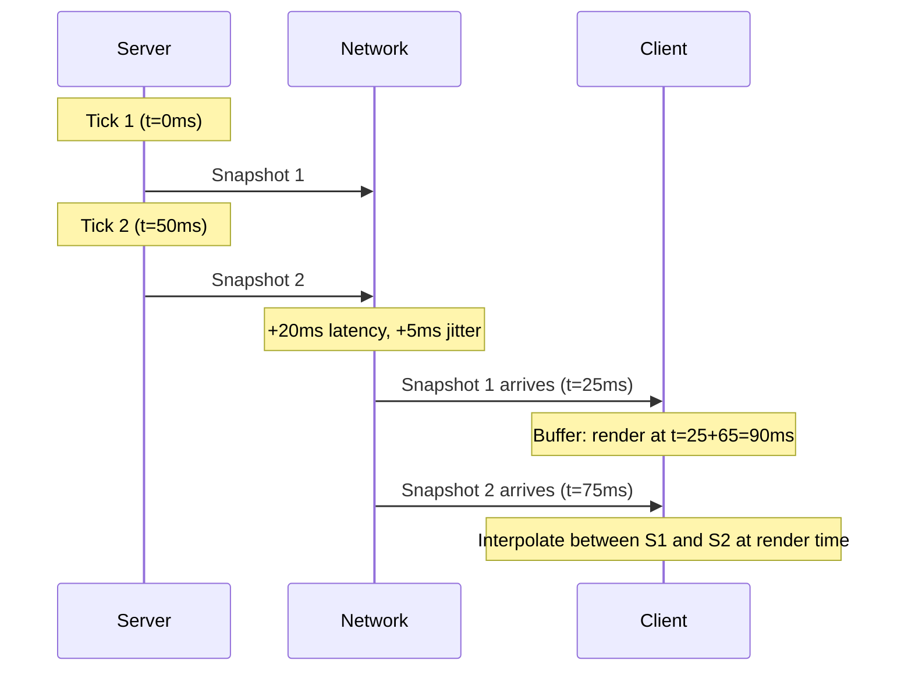

# Tick Rate and Simulation Frequency as Budget Decisions

Tick rate is a **budget decision**, not just a quality slider. It controls the cadence of authority updates, the packet creation pressure on transport, the CPU cost of simulation, and the correction frequency that clients must absorb. Changing tick rate without understanding its downstream effects is one of the most common sources of networked game instability.

---

## 1. Higher Tick Rates Improve Freshness but Increase Send Pressure

### What "Freshness" Means

When the server simulates at 60 Hz, the authoritative world state is updated every ~16.7ms. When it simulates at 20 Hz, updates happen every 50ms. "Freshness" is how recently the latest snapshot was produced relative to the real world.

Higher freshness:

- Clients see more recent positions, velocities, and game events.
- Input-to-outcome latency decreases (player presses button → sees result sooner).
- Hit detection accuracy improves because snapshots are closer to real positions.
- Corrections are smaller because the gap between prediction and authority is narrower.

### What "Send Pressure" Means

Each tick that produces a snapshot creates a packet (or partial packet) that must be sent to every connected client. At 60 Hz with 20 clients:

- 60 × 20 = 1,200 outbound packets/second from the server.
- If each packet is 200 bytes: 240 KB/s = ~1.9 Mbit/s just for state.
- Retransmissions, ACKs, and overhead add 10-30% more.

At 20 Hz with the same setup:

- 20 × 20 = 400 outbound packets/second.
- Same packet size: 80 KB/s = ~640 Kbit/s.

The 3x frequency increase produces a 3x transport cost increase — and the real cost is often worse because higher packet rates cause more queue pressure, more overhead bytes per packet (headers are fixed cost), and more CPU time spent in serialization.

### The Non-Linear Cost Curve

Doubling tick rate does not simply double cost. It can:

- Push queue occupancy past a tipping point where tail latency spikes.
- Exceed the practical packets-per-second budget of cheap network hardware (some consumer routers struggle above ~1000 small UDP packets/sec).
- Consume CPU time in serialization/compression that competes with simulation itself.

### Worked Example: 64-Tick vs 128-Tick

A competitive FPS server considers moving from 64-tick to 128-tick:

| Metric                         | 64-tick  | 128-tick   |
| ------------------------------ | -------- | ---------- |
| Snapshot interval              | 15.6ms   | 7.8ms      |
| Packets/sec (32 players)       | 2,048    | 4,096      |
| Bytes/sec @ 300B/pkt           | 614 KB/s | 1,229 KB/s |
| Interpolation delay (2 frames) | 31.2ms   | 15.6ms     |
| Correction amplitude (typical) | lower    | even lower |

The halved interpolation delay improves feel, but the doubled transport pressure requires either smaller packets (compression) or a higher bandwidth budget.

---

## 2. Lower Rates Reduce Bandwidth but Require Stronger Client Strategies

At lower tick rates, the transport layer relaxes but the client must work harder.

### Interpolation Must Bridge Larger Gaps

At 20 Hz, the client interpolates over 50ms windows. Entity motion over 50ms can be substantial — a character running at 5 m/s moves 25cm between snapshots. The interpolation must smooth this convincingly.

At 60 Hz, the same character moves ~8.3cm between snapshots. Interpolation is less demanding and errors are smaller.

### Prediction Diverges More

If the client predicts locally while waiting for the next server snapshot, longer gaps mean more accumulated prediction error. When the snapshot finally arrives, the correction is larger.

This creates a tension: lower rates save bandwidth but produce larger, more visible corrections. Higher rates cost bandwidth but keep corrections small and invisible.

### Extrapolation Risk Increases

When a snapshot is late (jitter), the client may need to extrapolate. At 60 Hz, one missed snapshot means 16.7ms of extrapolation, which is usually safe. At 20 Hz, one missed snapshot means 50ms of extrapolation — enough for meaningful divergence in fast-moving gameplay.

### Deciding When Lower Rates Are Acceptable

Lower rates work well when:

- Entity motion is slow or predictable (strategy games, turn-based elements).
- Interpolation quality is high and well-tuned.
- The gameplay does not require sub-frame timing precision (unlike competitive shooters).
- Bandwidth is severely constrained (mobile networks, high player counts).

Lower rates are risky when:

- Fast motion or rapid direction changes are common.
- Players expect tight input-to-outcome loop (competitive action games).
- Hit registration must be perceived as fair at high skill levels.

---

## 3. CSI Framing: Update Intervals and Control-Loop Stability

From a CSI perspective, tick rate is a **sampling interval** in a discrete control system.

### Control-Loop Model

The server is a controller that:

1. Reads inputs (client commands)
2. Updates world state (simulation tick)
3. Emits observations (snapshots to clients)
4. Reads feedback (client ACKs and measurements)

The sampling interval (tick period) determines the Nyquist-like frequency limits of what the system can faithfully represent. Events faster than 2× the tick rate are aliased or missed entirely.

### Stability Under Delay

A control loop with delay (network RTT) is sensitive to the ratio of delay to update interval. If RTT is 80ms and tick interval is 50ms (20 Hz), the system is ~1.6 ticks behind. If tick interval is 16.7ms (60 Hz), the system is ~4.8 ticks behind.

More ticks of delay does not necessarily mean worse stability, but it does mean the correction policy (gain, damping) must be tuned differently. Higher tick rates with careless correction gains can cause oscillation.

### Tick Rate as Resource Allocation

CSI framing treats tick rate as a resource contract:

- define CPU budget per tick
- define bytes/sec budget per client
- define packets/sec budget per client
- choose tick rate that satisfies all constraints simultaneously

If any constraint is violated, reduce tick rate or reduce content per tick — not both at once.

### Quantitative Approach

For a system with:

- Max server CPU budget: 60% of a core for simulation
- Max bandwidth per client: 50 KB/s
- Max packet rate per client: 40 pkt/s

If average snapshot payload is 300 bytes (+ 28B header = 328B total):

- Bandwidth limit: 50,000 / 328 ≈ 152 pkt/s → not constraining at 40 Hz
- Packet rate limit: 40 pkt/s → constrains tick rate to ≤ 40 Hz
- CPU per tick: measure empirically, but at 40 Hz you get 25ms per tick — plenty for most simulations

The packet rate constraint dominates. Your max viable tick rate is 40 Hz under these conditions.

---

## 4. GPR Framing: Server Tick Rates, Responsiveness, and Hit-Reg Trust

From a GPR perspective, tick rate directly affects what players feel.

### Responsiveness

The minimum input-to-visible-outcome latency includes:

1. Client input delay (1 frame at client frame rate)
2. Network upload latency
3. Server processing time (≤ 1 tick period)
4. Network download latency
5. Client interpolation/render delay

Steps 3 and 5 are directly controlled by tick rate. At 20 Hz, step 3 alone adds up to 50ms. At 128 Hz, step 3 adds up to 7.8ms. For competitive games where total latency budgets are 50-100ms, this difference is significant.

### Worked Example: End-to-End Latency Budget

| Component                      | 20 Hz server | 60 Hz server | 128 Hz server |
| ------------------------------ | ------------ | ------------ | ------------- |
| Client input (60fps)           | 16.7ms       | 16.7ms       | 16.7ms        |
| Upload latency                 | 20ms         | 20ms         | 20ms          |
| Server tick wait (avg)         | 25ms         | 8.3ms        | 3.9ms         |
| Download latency               | 20ms         | 20ms         | 20ms          |
| Interpolation delay (2 frames) | 100ms        | 33.3ms       | 15.6ms        |
| **Total**                      | **181.7ms**  | **98.3ms**   | **76.2ms**    |

The 20 Hz server has nearly 2× the total latency of the 60 Hz server, primarily from server tick wait and interpolation delay. Players feel this difference directly.

### Hit Registration and Fairness

When a player fires at a moving target, the server evaluates the shot against the world state at the server tick closest to the firing time. Higher tick rates mean:

- The evaluated state is closer to what the player actually saw.
- The temporal interpolation/extrapolation error in hit evaluation is smaller.
- Players perceive hit registration as more "fair" and consistent.

This is why competitive game communities demand higher tick rates — it directly affects perceived skill fidelity.

### Visual Correction Quality

At higher tick rates, corrections are:

- More frequent but smaller in amplitude
- Easier to smooth visually (small deltas blend into motion)
- Less likely to produce visible "teleporting"

At lower tick rates, corrections are:

- Less frequent but larger
- Harder to hide with smoothing
- More likely to produce jarring snaps, especially for fast-moving entities

---

## 5. Aligning Tick, Snapshot Cadence, and Interpolation Delay as One System

This is a critical subtopic that bridges the previous concepts.

### The Three Clocks

A networked game has (at least) three timing parameters that must be coordinated:

1. **Simulation tick rate**: how often the server advances world state.
2. **Snapshot send cadence**: how often the server sends state to clients (may be ≤ tick rate).
3. **Client interpolation delay**: how far behind "now" the client renders, to absorb jitter.

These three parameters are coupled. Changing one without adjusting the others creates artifacts.

### Common Misalignment: Fast Tick, Slow Send

Server ticks at 60 Hz but only sends snapshots at 20 Hz to save bandwidth. The client receives one snapshot every 50ms. If the client's interpolation buffer is sized for the tick rate (16.7ms), it will constantly underrun because data arrives at 50ms intervals.

**Fix**: size the interpolation buffer to the **send cadence**, not the tick rate.

### Common Misalignment: Send Cadence Matches Tick, But Jitter Buffer Is Too Short

Server sends at 20 Hz (50ms interval). Client interpolation delay is set to 50ms (exactly one snapshot interval). Under zero jitter, this barely works — the client just catches each snapshot in time. Under any jitter, the next snapshot arrives late and the buffer underruns.

**Fix**: interpolation delay should be send_interval + jitter_margin. For a 20 Hz send rate with 15ms p99 jitter, set interpolation delay ≈ 65-75ms.

### Common Misalignment: Adaptive Send Rate Without Adaptive Interpolation

Some systems reduce send rate under congestion but do not notify the client to widen its interpolation buffer. Result: the client keeps expecting data on the old schedule and experiences constant underruns during congestion.

**Fix**: when adapting send rate, signal the new cadence to clients so they can adjust buffer sizing.

### The Alignment Equation

A simple guideline for minimum interpolation delay:

$$T_{\text{interp}} \geq T_{\text{send}} + J_{p90}$$

Where:

- $T_{\text{send}}$ is the snapshot send interval
- $J_{p90}$ is the 90th percentile jitter measured at the client

Using p90 rather than p99 is a practical tradeoff: p99 adds too much delay for most gameplay, while p90 covers the common-case jitter adequately. Systems that need to handle p99 can use adaptive buffer expansion during detected burst events.

### Visualization: Timing Alignment



---

## Adaptation Under Degraded Conditions

When the network path degrades (rising RTT, jitter, or loss), the instinct is to push more data faster. This is almost always wrong.

### Why "Send More" Fails Under Stress

Additional packets during congestion:

- Increase queue occupancy → higher RTT
- Increase loss probability → more retransmissions needed
- Reduce remaining budget for new critical data
- Create a positive feedback loop of degradation

### Preferred Adaptation Strategy

1. **Preserve critical update classes**: inputs, authority events, and corrections stay at full rate.
2. **Decimate non-critical updates**: cosmetic state, low-priority deltas are sent at lower frequency.
3. **Maintain interpolation quality**: signal clients to adjust buffer sizing if send cadence changes.
4. **Recover gradually**: when metrics improve, increase fidelity in steps, not all at once.

### Fallback Profiles

Define 2-3 named profiles that the system can switch between:

| Profile     | Send Rate | Content Per Packet       | Interpolation Target |
| ----------- | --------- | ------------------------ | -------------------- |
| Normal      | 20 Hz     | Full state delta         | 65ms                 |
| Constrained | 10 Hz     | Critical + high-priority | 115ms                |
| Severe      | 5 Hz      | Critical only            | 215ms                |

Transitions between profiles should have hysteresis: degrade after sustained stress, upgrade only after sustained improvement. This prevents oscillation between profiles.

### Hysteresis Design

- Degrade: require N consecutive stressed ticks before downgrading (e.g., 30 ticks ≈ 1.5s at 20 Hz).
- Recover: require M consecutive healthy ticks before upgrading (e.g., 60 ticks ≈ 3s at 20 Hz).
- M > N ensures the system is conservative about recovery, preventing flapping.

---

## Practical Checklist

- [ ] Define explicit bytes/sec and packets/sec budgets per client tier.
- [ ] Measure true packet size distribution by message class (not just averages).
- [ ] Test under bursty jitter and loss, not just clean-lab networks.
- [ ] Validate correction frequency and amplitude at each candidate tick rate.
- [ ] Ensure interpolation delay is sized to send cadence + jitter, not tick rate.
- [ ] Define fallback profiles with hysteresis thresholds.
- [ ] Signal send rate changes to clients so they can adapt interpolation.
- [ ] Monitor queue behavior (packet/sec and burst patterns) alongside latency.
- [ ] Verify that the highest tick rate you plan to use stays within CPU budget.

---

## Code Example (C++): Tick-Driven Send Gate with Decimation

```cpp
#include <chrono>
#include <cstdint>

using Clock = std::chrono::steady_clock;

struct SendScheduler {
    Clock::time_point nextSend = Clock::now();
    std::chrono::milliseconds normalInterval{50};    // 20 Hz
    std::chrono::milliseconds degradedInterval{100};  // 10 Hz
    bool degraded = false;

    void setDegraded(bool d) {
        degraded = d;
    }

    bool shouldSendNow() {
        auto now = Clock::now();
        auto interval = degraded ? degradedInterval : normalInterval;
        if (now >= nextSend) {
            nextSend = now + interval;
            return true;
        }
        return false;
    }

    bool shouldSendLowPriority(uint64_t tickNumber) const {
        // Low-priority data sent every 4th tick in normal mode,
        // every 8th tick in degraded mode.
        uint64_t step = degraded ? 8 : 4;
        return (tickNumber % step) == 0;
    }
};
```

## Code Example (C#): Adaptive Send Profile Manager

```csharp
using System;

public enum PathProfile { Normal, Constrained, Severe }

public class SendProfileManager
{
    public PathProfile Current { get; private set; } = PathProfile.Normal;

    private int _degradedTicks;
    private int _healthyTicks;
    private const int DegradeThreshold = 30;  // ~1.5 sec at 20Hz
    private const int RecoverThreshold = 60;  // ~3 sec at 20Hz

    public void Update(double rttMs, double jitterMs, double lossPct)
    {
        bool stressed = rttMs > 120 || jitterMs > 25 || lossPct > 3.0;

        if (stressed)
        {
            _healthyTicks = 0;
            _degradedTicks++;
        }
        else
        {
            _degradedTicks = 0;
            _healthyTicks++;
        }

        // Degrade faster than we recover (hysteresis)
        if (_degradedTicks > DegradeThreshold && Current == PathProfile.Normal)
            Current = PathProfile.Constrained;
        else if (_degradedTicks > DegradeThreshold * 2 && Current == PathProfile.Constrained)
            Current = PathProfile.Severe;
        else if (_healthyTicks > RecoverThreshold && Current == PathProfile.Severe)
            Current = PathProfile.Constrained;
        else if (_healthyTicks > RecoverThreshold && Current == PathProfile.Constrained)
            Current = PathProfile.Normal;
    }

    public int SendIntervalMs => Current switch
    {
        PathProfile.Normal      => 50,   // 20 Hz
        PathProfile.Constrained => 100,  // 10 Hz
        PathProfile.Severe      => 200,  //  5 Hz
        _ => 50
    };

    public int InterpolationTargetMs => Current switch
    {
        PathProfile.Normal      => 65,
        PathProfile.Constrained => 115,
        PathProfile.Severe      => 215,
        _ => 65
    };
}
```

## Code Example (C++): Bandwidth Budget Estimator

```cpp
struct BandwidthBudget {
    int maxBytesPerSecond = 50000;  // 50 KB/s per client
    int headerOverheadPerPacket = 28; // UDP + IP header
    int avgPayloadBytes = 250;

    int maxPacketsPerSecond() const {
        int bytesPerPacket = headerOverheadPerPacket + avgPayloadBytes;
        return maxBytesPerSecond / bytesPerPacket;
    }

    int maxTickRate() const {
        return maxPacketsPerSecond(); // 1 packet per tick as baseline
    }

    // With retransmission overhead
    int effectiveMaxTickRate(double lossRate) const {
        double overheadFactor = 1.0 + lossRate * 1.5; // retransmit + ACK
        return static_cast<int>(maxPacketsPerSecond() / overheadFactor);
    }
};
```
