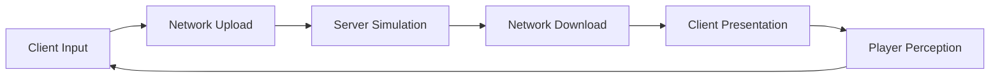
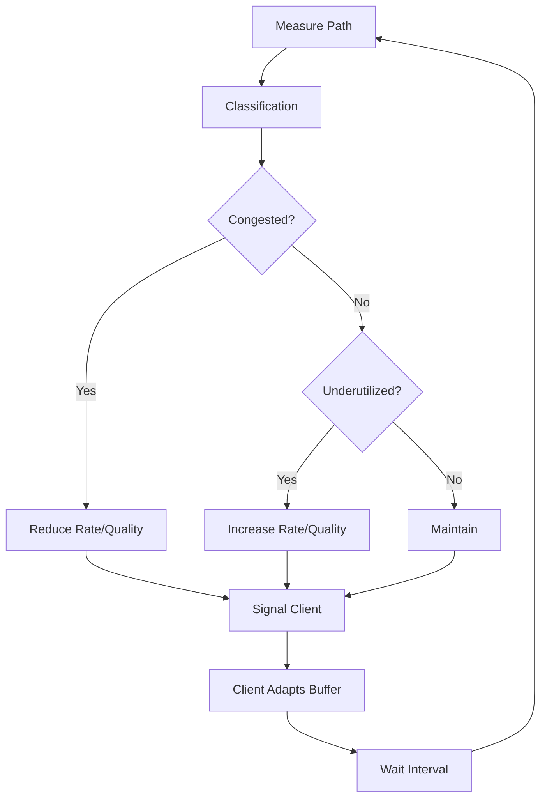

# CSI vs GPR Decision Patterns for Network Performance

This topic ties together everything from the previous seven sections by applying two complementary decision lenses: **CSI (Computer Systems and Infrastructure)** and **GPR (Game Programming)**. The same measurement, the same protocol mechanism, and the same budget constraint look different depending on whether you optimize for system correctness or player experience. Good network engineers think through both lenses and reconcile them.

---

## 1. CSI Targets: Systems Thinking Applied to Networking

### What CSI Cares About

The CSI perspective treats the networked game as a **distributed system** with measurable, optimizable properties:

- **Stability**: the system does not oscillate, diverge, or exhibit runaway behavior under stress.
- **Correctness**: every client eventually sees a consistent view of the authoritative state.
- **Efficiency**: bandwidth, CPU, and memory are used proportionally to their benefit.
- **Predictability**: given known inputs (RTT, jitter, loss), the system behavior is deterministic and bounded.
- **Measurability**: every subsystem emits metrics that can be monitored and alarmed on.

### CSI and Control-Loop Stability

The CSI engineer models the game's networking as a feedback control system:



This loop has:

- **Gain**: how much the system responds to input (tick rate, interpolation sensitivity).
- **Delay**: total round-trip time through the loop (RTT + processing + interpolation).
- **Damping**: how quickly corrections settle (interpolation blending, correction smoothing).

A system with too much gain and too little damping oscillates: corrections overshoot, causing counter-corrections that overshoot again. This manifests as entities vibrating or rubber-banding.

A system with too much damping is sluggish: corrections are smooth but take too long to converge. Players feel like they're controlling through mud.

The CSI approach calculates the **gain-delay product** and ensures it stays within the stable region:

$$G \times \tau < K_{\text{stability}}$$

Where:

- $G$ is the correction gain (how aggressively errors are corrected)
- $\tau$ is the loop delay (total RTT + processing + buffer)
- $K_{\text{stability}}$ is a stability margin (empirically, ~0.5-0.8 for game systems)

### CSI and Protocol Correctness Under Loss

The CSI engineer verifies that the protocol handles every combination of:

| Condition                     | Verification                                    |
| ----------------------------- | ----------------------------------------------- |
| Single packet loss            | State converges within N ticks                  |
| Burst loss (3-5 packets)      | System recovers without oscillation             |
| Reordering                    | No duplicate processing, no stale state applied |
| Duplicate packets             | Deduplication works correctly                   |
| High jitter (±30ms)           | Interpolation buffer adapts without underrun    |
| Sustained congestion          | Rate adaptation prevents spiral                 |
| Connection death and recovery | Re-sync from known good state                   |

For each condition, the CSI approach defines a **recovery time budget**: how many ticks (or milliseconds) the system is allowed to take before returning to nominal operation.

### CSI Metrics Dashboard

A CSI-oriented monitoring system tracks:

| Metric                      | Target                    | Alert Threshold     |
| --------------------------- | ------------------------- | ------------------- |
| Server tick time (ms)       | < 50% of tick interval    | > 80%               |
| Outbound bytes/s per client | < bandwidth cap           | > 90% cap           |
| Retransmission rate         | < 5% of reliable messages | > 10%               |
| ACK round-trip              | SRTT ± 2×RTTVAR           | > 3×RTTVAR          |
| Interpolation underrun rate | < 1%                      | > 5%                |
| Budget utilization          | 60-80%                    | > 95% (no headroom) |
| Mean correction amplitude   | Trending downward         | Trending upward     |

These metrics are objective: they don't tell you what the player feels, but they tell you when the system is operating outside its designed envelope.

---

## 2. GPR Targets: Player Experience Applied to Networking

### What GPR Cares About

The GPR perspective treats the networked game as an **experience delivery system**:

- **Responsiveness**: player inputs produce visible results quickly.
- **Smoothness**: entity motion is fluid, not stuttery or jerky.
- **Fairness**: all players have comparable experiences regardless of connection quality.
- **Trust**: players believe the game accurately reflects their actions (hit registration, scoring).
- **Immersion**: network artifacts are invisible or masked.

### Responsiveness and the Latency Budget

GPR engineers decompose the input-to-outcome pipeline:

| Stage                      | Time         | Controllable?            |
| -------------------------- | ------------ | ------------------------ |
| Input device → game engine | 1-8ms        | Client-side (frame rate) |
| Client processing → packet | 0-1ms        | Yes (optimization)       |
| Upload latency             | 10-50ms      | No (physics)             |
| Server queue + processing  | 0-25ms       | Partially (tick rate)    |
| Server → packet            | 0-1ms        | Yes                      |
| Download latency           | 10-50ms      | No (physics)             |
| Interpolation buffer       | 30-100ms     | Yes (tradeoff)           |
| Render pipeline            | 8-16ms       | Client-side              |
| **Total**                  | **60-250ms** | Partially                |

The GPR engineer identifies that **tick rate** (server queue time) and **interpolation buffer** (presentation delay) are the main controllable variables, and both trade latency for quality:

- Faster tick rate → less server queue time but more expensive.
- Smaller interpolation buffer → less delay but more artifacts.

### Smoothness: The Animation Standard

Players subconsciously compare networked entity motion to local animation quality. Local characters move at render framerate (60-144+ fps) with smooth interpolation. Networked entities move at server tick rate (20-128 Hz) with network jitter on top.

The GPR goal: make networked entity motion **indistinguishable from local animation** to casual observation. This means:

- Interpolation must be smooth (no stutter from jitter).
- Corrections must be invisible (no snapping or rubber-banding).
- Motion must be continuous (no freezing during packet loss).

Achieving this requires careful tuning of all the systems from topics 02a-02g.

### Fairness Under Asymmetric Connections

In a competitive game, players have different connection qualities:

| Player  | RTT   | Jitter | Loss |
| ------- | ----- | ------ | ---- |
| Alice   | 20ms  | 2ms    | 0.1% |
| Bob     | 80ms  | 15ms   | 2%   |
| Charlie | 150ms | 30ms   | 5%   |

If the server gives everyone the same tick rate and interpolation settings, Alice has a significant advantage:

- Her inputs reach the server faster.
- Her corrections are smaller (less prediction divergence).
- Her interpolation buffer can be small (low jitter).
- She sees the game world more "truly" than Bob or Charlie.

The GPR engineer considers **fairness mechanisms**:

1. **Lag compensation**: the server rewinds time when evaluating Bob's shots, checking hits against the world state Bob was seeing at the time of firing.
2. **Adaptive interpolation**: each client uses a buffer appropriate to their connection, not a global value.
3. **Input delay equalization**: adding artificial delay to low-latency players so everyone has similar input-to-outcome timing (controversial — reduces quality for good connections).
4. **Skill-based matchmaking by connection quality**: matching players with similar RTT ranges so fairness is less of an issue.

### Hit Registration and Player Trust

The most common "netcode" complaint in competitive games is: "I shot them and it didn't register." This perception problem has technical roots:

1. **The player fired at where the enemy was on their screen** — which is interpolation-delayed and prediction-subject.
2. **The server evaluates the shot against the authoritative state** — which may have moved since the player's screen was rendered.
3. **Lag compensation rewinds the server to the player's perceived time** — but rewind is imperfect if the enemy was accelerating or changing direction.

The GPR approach quantifies this: at a given RTT and tick rate, what is the maximum positional error between what the player saw and where the server evaluates the shot?

$$E_{\text{max}} \approx v_{\text{target}} \times (T_{\text{interp}} + \frac{RTT}{2} + T_{\text{tick}})$$

For a target moving at 5 m/s, with 50ms interpolation, 40ms half-RTT, 16ms tick:

$$E_{\text{max}} \approx 5 \times (0.050 + 0.040 + 0.016) = 5 \times 0.106 = 0.53\text{m}$$

Over half a meter of potential mismatch. For a headshot on a character with a 0.2m head hitbox, this means the server may disagree with the player's perception even with lag compensation. The GPR engineer decides whether to:

- Use generous hitbox expansion during lag compensation (feels fair to the shooter, unfair to the target).
- Use strict hitboxes (unfair to the shooter, fair to the target).
- Use a hybrid (expand hitboxes proportionally to the shooter's latency, capped at a maximum).

---

## 3. Choosing Reliability Classes Per Message Type

### CSI Perspective: Protocol Correctness

The CSI engineer classifies messages by their **state impact**:

| Impact Type                      | Reliability Needed   | Rationale                     |
| -------------------------------- | -------------------- | ----------------------------- |
| Idempotent overwrites (position) | Unreliable           | Next update corrects any loss |
| Monotonic state (score, level)   | Reliable-unordered   | Must arrive, order irrelevant |
| Sequential state (command log)   | Reliable-ordered     | Mutations must apply in order |
| Ephemeral (voice frame)          | Unreliable-sequenced | Stale frames are useless      |

The CSI verification: "If this message is lost, does the world state eventually converge to the correct value?" If yes → unreliable. If no → reliable.

### GPR Perspective: Player Impact

The GPR engineer classifies messages by their **player-visible effect**:

| Effect                 | Reliability Needed | Rationale                            |
| ---------------------- | ------------------ | ------------------------------------ |
| Entity position        | Unreliable         | Interpolation hides gaps             |
| Damage event           | Reliable-unordered | Player must see their hits land      |
| Kill feed              | Reliable-unordered | Missing kills is confusing           |
| Chat                   | Reliable-ordered   | Missing messages breaks conversation |
| Sound effect trigger   | Unreliable         | Missing one sound is acceptable      |
| Objective state change | Reliable-unordered | Players must know current objective  |

### Reconciling CSI and GPR

Sometimes the two perspectives disagree:

**Sound effects**: CSI says unreliable (ephemeral, doesn't affect state). GPR might want reliability for important sounds (explosion near the player) because missing them breaks immersion.

**Resolution**: use unreliable for ambient sounds, reliable-unordered for gameplay-significant sounds (gunfire, ability activation). The CSI constraint (no state impact) is satisfied by making sound events independent of game state.

**Animation state**: CSI says unreliable (purely visual). GPR might want sequenced delivery so animation transitions don't glitch.

**Resolution**: unreliable-sequenced with fallback — if the animation state diverges too far from expected, the next full state sync corrects it.

### Decision Matrix

For each message type, score both perspectives:

| Message         | CSI Need           | GPR Need                  | Resolution         |
| --------------- | ------------------ | ------------------------- | ------------------ |
| Player position | Unreliable         | Unreliable (interpolated) | Unreliable         |
| Player input    | Reliable-ordered   | Reliable (responsiveness) | Reliable-ordered   |
| Kill event      | Reliable-unordered | Reliable (trust/fairness) | Reliable-unordered |
| Cosmetic effect | Unreliable         | Unreliable (nice-to-have) | Unreliable         |
| Loadout change  | Reliable-ordered   | Reliable-ordered          | Reliable-ordered   |
| Score update    | Reliable-unordered | Reliable (UI accuracy)    | Reliable-unordered |
| Heartbeat       | Unreliable         | Unreliable                | Unreliable         |

Where both perspectives agree, the choice is clear. Where they disagree, the GPR need typically wins for player-facing events and the CSI need wins for protocol-level messages.

---

## 4. Choosing Tick/Update Rates from Path Quality and UX Targets

### Path Quality Determines the Ceiling

The measured path quality sets an upper bound on sustainable tick rate:

$$R_{\text{max}} = \frac{B_{\text{available}}}{S_{\text{packet}} + H_{\text{overhead}}}$$

Where:

- $B_{\text{available}}$ = available bandwidth per client (from congestion controller)
- $S_{\text{packet}}$ = average payload size
- $H_{\text{overhead}}$ = per-packet overhead

Additionally, the packet-rate limit (from hardware or ISP) may further constrain:

$$R_{\text{max}} = \min\left(\frac{B_{\text{available}}}{S + H}, P_{\text{max}}\right)$$

### UX Target Determines the Floor

The game's genre and competitive level set a minimum tick rate below which player experience suffers:

| Genre           | Minimum Acceptable | Preferred | Maximum Useful               |
| --------------- | ------------------ | --------- | ---------------------------- |
| Competitive FPS | 60 Hz              | 128 Hz    | 128 Hz (diminishing returns) |
| Action RPG      | 20 Hz              | 30 Hz     | 60 Hz                        |
| MOBA            | 15 Hz              | 20 Hz     | 30 Hz                        |
| Strategy/RTS    | 5 Hz               | 10 Hz     | 20 Hz                        |
| Social/MMO      | 5 Hz               | 10 Hz     | 20 Hz                        |

If the path can sustain 40 Hz but the game needs 60 Hz minimum, you must either reduce payload size or accept degraded quality.

### CSI Approach: Analytic Rate Selection

1. Measure: $B_{\text{available}}$, $S_{\text{packet}}$, $P_{\text{max}}$, RTT, jitter, loss.
2. Compute: $R_{\text{max}}$ from constraints.
3. Select: $R = \min(R_{\text{max}}, R_{\text{desired}})$.
4. Verify: total latency budget (RTT + tick interval + interp delay) is within stability margin.
5. Monitor: if any constraint changes, recompute.

### GPR Approach: Experience-Driven Rate Selection

1. Define: acceptable correction amplitude (e.g., < 5cm for nearby entities).
2. Estimate: at a given tick rate and RTT, what is the expected correction amplitude?
3. Select: the lowest tick rate where corrections are below the threshold.
4. Playtest: verify that the selected rate "feels right" at various RTT levels.
5. Tune: adjust based on playtester feedback, not just metrics.

### Combined Approach

```
desired_rate = genreMinimumRate()
max_rate = computeMaxFromPath(bandwidth, packetSize, overhead, ppsLimit)
selected_rate = min(desired_rate, max_rate)

if selected_rate < genre_floor:
    // Can't achieve minimum quality
    if canReducePayloadSize():
        reducePayload()
        recalculate()
    else:
        signalDegradedMode()  // Lower-quality experience but still functional

verify_stability(selected_rate, rtt, correctionGain)
verify_interp_delay(selected_rate, jitter)
```

### Worked Example: Rate Selection

Competitive FPS. Desired: 128 Hz. Path: 100 KB/s bandwidth, 400B average payload, 40B overhead, RTT 50ms.

$$R_{\text{max}} = \frac{100{,}000}{400 + 40} = 227 \text{ Hz}$$

Bandwidth allows 227 Hz. Select 128 Hz (desired). Verify:

- Tick interval: 7.8ms. Server queue delay average: 3.9ms.
- Interpolation: 2 frames = 15.6ms.
- Total controllable latency: 3.9 + 15.6 = 19.5ms.
- Plus RTT 50ms: total ~74ms. Acceptable for competitive play.

Same game, degraded path: 30 KB/s bandwidth (mobile), RTT 120ms.

$$R_{\text{max}} = \frac{30{,}000}{400 + 40} = 68 \text{ Hz}$$

Can't reach 128 Hz. Options:

1. Select 60 Hz (meets genre floor). Payload budget per tick: 500B — tight but workable with delta encoding.
2. Reduce payload to 200B via aggressive compression → $R_{\text{max}} = 125$ Hz. Close to desired but requires heavy compression CPU.
3. Accept 60 Hz with slightly degraded experience.

Option 1 (60 Hz with normal payloads) is the pragmatic choice.

---

## 5. Building Feedback Loops That Tune Send Behavior Over Time

### The Adaptive System

A well-designed network stack is not static. It continuously adjusts based on measured conditions:



### Feedback Loop Components

1. **Sensor**: RTT, jitter, loss, ACK rates, throughput, interpolation underruns.
2. **Classifier**: healthy / stressed / degraded / severe.
3. **Actuator**: send rate, content selection, compression level, interest area.
4. **Notification**: signal quality changes to clients.
5. **Cooldown**: don't react to every fluctuation — use windowed statistics.

### CSI Guard Rails

The CSI engineer adds safety constraints to the feedback loop:

- **Rate limits on adaptation**: maximum change of ±20% per evaluation period.
- **Hysteresis**: require sustained change before adapting (as described in tick rate topic).
- **Monotonicity under stress**: when degrading, only move in one direction until stability is achieved. Don't oscillate between profiles.
- **Fallback guarantee**: the system always has a "minimum viable mode" that works on any connection.
- **Timeout on degraded mode**: if the system has been severely degraded for too long (e.g., 30 seconds), consider that the connection is genuinely impaired and stop trying to recover to full quality.

### GPR Smoothing

The GPR engineer adds perceived-quality constraints:

- **Smooth transitions**: when changing quality levels, interpolate over 1-2 seconds rather than switching instantly. Players perceive instant switches as jarring.
- **Notification UI**: if quality is degraded, show a subtle indicator (not an error — just a "connection quality" icon).
- **Predictive adaptation**: if the system detects a pattern (e.g., degradation every evening), pre-emptively start in constrained mode.
- **Maintain critical feel**: even in the most degraded mode, the player's own character should respond to input. Only remote entity quality degrades — local prediction and input handling stay at full quality.

### Practical Feedback Loop Design

Every N evaluation periods (e.g., every 2 seconds):

```
metrics = collectWindowedMetrics()

if metrics.loss_rate > 5% or metrics.rtt_ratio > 2.0:
    if current_profile != SEVERE and degraded_ticks > degrade_threshold:
        stepDown(current_profile)
        degraded_ticks = 0
    else:
        degraded_ticks++
elif metrics.loss_rate < 1% and metrics.rtt_ratio < 1.2:
    if current_profile != NORMAL and healthy_ticks > recover_threshold:
        stepUp(current_profile)
        healthy_ticks = 0
    else:
        healthy_ticks++
else:
    // Intermediate state — maintain current profile
    degraded_ticks = 0
    healthy_ticks = 0
```

Key design points:

- `rtt_ratio = current_rtt / baseline_rtt` (relative to the best observed RTT).
- `degrade_threshold < recover_threshold` (hysteresis: degrade faster, recover slower).
- `stepDown/stepUp` change ONE level, not jumping from NORMAL to SEVERE.

---

## 6. Bringing It All Together

### The CSI-GPR Reconciliation Table

For each Week 12 topic, the CSI and GPR perspectives favor different optimization targets:

| Topic                | CSI Priority                              | GPR Priority                            | Reconciliation                                          |
| -------------------- | ----------------------------------------- | --------------------------------------- | ------------------------------------------------------- |
| Measurement (02a)    | Accuracy, confidence intervals            | Percentiles that map to experience      | Measure both; use CSI for protocol, GPR for tuning      |
| Tick Rate (02b)      | Resource efficiency, stability margin     | Responsiveness, correction amplitude    | Set by GPR requirement, bounded by CSI constraint       |
| Interpolation (02c)  | Minimum delay for stability               | Smoothness that passes player muster    | CSI sets range, GPR tunes within range                  |
| Reliable UDP (02d)   | Protocol correctness, no data corruption  | Events players care about arrive        | CSI validates implementation; GPR classifies messages   |
| Retransmission (02e) | No spurious retransmits, bounded recovery | Fast recovery for gameplay events       | CSI detects correctly; GPR prioritizes retransmit order |
| Congestion (02f)     | TCP-friendliness, shared-path stability   | Maintaining playable quality            | CSI ensures fairness; GPR ensures minimum quality floor |
| Budgets (02g)        | Efficient utilization, no waste           | Gameplay-critical data always delivered | CSI tracks utilization; GPR sets priority classes       |

### The Decision Framework

When making any network performance decision:

1. **Define the problem in CSI terms**: what is the measurable constraint or failure mode?
2. **Define the problem in GPR terms**: what does the player experience or perceive?
3. **Find the overlap**: where both perspectives agree, implement that solution.
4. **Resolve conflicts**: where they disagree, use the context:
   - For infrastructure/protocol decisions → CSI wins.
   - For player-facing quality decisions → GPR wins.
   - For budget allocation → GPR sets priorities, CSI enforces constraints.

### Example: Deciding Interpolation Buffer Size

**CSI analysis**: given send rate 20 Hz, measured jitter p90 = 12ms, stability requires $T_{\text{buffer}} \geq T_{\text{send}} + 2 \times J_{p90} = 50 + 24 = 74$ms.

**GPR analysis**: playtest shows players report "laggy" above 100ms total added delay. Current non-buffer latency is ~60ms. Maximum acceptable buffer: 40ms.

**Conflict**: CSI wants 74ms, GPR wants ≤ 40ms.

**Resolution**:

- Use 50ms buffer (compromise) with adaptive expansion to 74ms during jitter spikes.
- Accept occasional underruns (brief extrapolation) at 50ms baseline.
- Monitor underrun rate — if > 5%, the connection needs a wider buffer and the GPR cost must be accepted.

---

## Code Example (C++): Adaptive Network Profile System

```cpp
#include <cstdint>
#include <algorithm>
#include <cmath>

enum class QualityProfile { Normal, Constrained, Severe };

struct PathMetrics {
    double rttMs;
    double baselineRttMs;
    double jitterMs;
    double lossPct;
    int interpUnderruns;   // in last evaluation window
    int totalFrames;       // in last evaluation window
};

class AdaptiveProfileController {
    QualityProfile profile = QualityProfile::Normal;
    int degradedTicks = 0;
    int healthyTicks = 0;

    static constexpr int DegradeThreshold = 30;   // ticks
    static constexpr int RecoverThreshold = 60;    // ticks (2x for hysteresis)

public:
    QualityProfile getProfile() const { return profile; }

    void evaluate(const PathMetrics& m) {
        double rttRatio = (m.baselineRttMs > 0)
            ? m.rttMs / m.baselineRttMs
            : 1.0;
        double underrunRate = (m.totalFrames > 0)
            ? (double)m.interpUnderruns / m.totalFrames
            : 0.0;

        bool stressed = m.lossPct > 3.0 ||
                        rttRatio > 1.8 ||
                        underrunRate > 0.05;
        bool healthy = m.lossPct < 1.0 &&
                       rttRatio < 1.2 &&
                       underrunRate < 0.01;

        if (stressed) {
            healthyTicks = 0;
            degradedTicks++;
            if (degradedTicks > DegradeThreshold) {
                stepDown();
                degradedTicks = 0;
            }
        } else if (healthy) {
            degradedTicks = 0;
            healthyTicks++;
            if (healthyTicks > RecoverThreshold) {
                stepUp();
                healthyTicks = 0;
            }
        } else {
            // Intermediate — hold position
            degradedTicks = std::max(0, degradedTicks - 1);
            healthyTicks = std::max(0, healthyTicks - 1);
        }
    }

    // Per-profile parameters
    int sendRateHz() const {
        switch (profile) {
            case QualityProfile::Normal:      return 20;
            case QualityProfile::Constrained: return 10;
            case QualityProfile::Severe:      return 5;
        }
        return 20;
    }

    int interpBufferMs() const {
        switch (profile) {
            case QualityProfile::Normal:      return 65;
            case QualityProfile::Constrained: return 115;
            case QualityProfile::Severe:      return 215;
        }
        return 65;
    }

    float interestRadius() const {
        switch (profile) {
            case QualityProfile::Normal:      return 100.0f;
            case QualityProfile::Constrained: return 50.0f;
            case QualityProfile::Severe:      return 20.0f;
        }
        return 100.0f;
    }

private:
    void stepDown() {
        if (profile == QualityProfile::Normal)
            profile = QualityProfile::Constrained;
        else if (profile == QualityProfile::Constrained)
            profile = QualityProfile::Severe;
    }

    void stepUp() {
        if (profile == QualityProfile::Severe)
            profile = QualityProfile::Constrained;
        else if (profile == QualityProfile::Constrained)
            profile = QualityProfile::Normal;
    }
};
```

## Code Example (C#): CSI/GPR Decision Logger

```csharp
using System;
using System.Collections.Generic;

public enum DecisionDomain { CSI, GPR, Both }

public struct NetworkDecision
{
    public string Topic;
    public DecisionDomain Domain;
    public string CsiRationale;
    public string GprRationale;
    public string ChosenValue;
    public string Resolution;
}

/// <summary>
/// Tracks and logs network configuration decisions with both
/// CSI and GPR rationale. Useful for postmortem analysis and
/// tuning documentation.
/// </summary>
public class DecisionLog
{
    private readonly List<NetworkDecision> _decisions = new();

    public void LogDecision(
        string topic,
        string csiWants,
        string gprWants,
        string chosen,
        string resolution)
    {
        DecisionDomain domain;
        if (csiWants == gprWants || chosen == csiWants && chosen == gprWants)
            domain = DecisionDomain.Both;
        else if (chosen == csiWants)
            domain = DecisionDomain.CSI;
        else
            domain = DecisionDomain.GPR;

        _decisions.Add(new NetworkDecision
        {
            Topic = topic,
            Domain = domain,
            CsiRationale = csiWants,
            GprRationale = gprWants,
            ChosenValue = chosen,
            Resolution = resolution
        });
    }

    public void PrintSummary()
    {
        Console.WriteLine("=== Network Decision Summary ===");
        foreach (var d in _decisions)
        {
            Console.WriteLine($"\n[{d.Domain}] {d.Topic}");
            Console.WriteLine($"  CSI wanted: {d.CsiRationale}");
            Console.WriteLine($"  GPR wanted: {d.GprRationale}");
            Console.WriteLine($"  Chosen: {d.ChosenValue}");
            Console.WriteLine($"  Resolution: {d.Resolution}");
        }
    }
}

/// <summary>
/// Example: configuring a game server's network stack using
/// both CSI and GPR inputs.
/// </summary>
public class NetworkConfigResolver
{
    private readonly DecisionLog _log = new();

    public record PathConditions(
        double BandwidthBps,
        double RttMs,
        double JitterMs,
        double LossPct);

    public record GameRequirements(
        string Genre,
        int MinTickHz,
        int PreferredTickHz,
        double MaxAcceptableLatencyMs,
        double MaxCorrectionCm);

    public record ResolvedConfig(
        int TickHz,
        int InterpBufferMs,
        int MaxPayloadBytes);

    public ResolvedConfig Resolve(PathConditions path, GameRequirements game)
    {
        // Ticket rate: CSI computes max from path, GPR sets desired
        int csiMaxHz = (int)(path.BandwidthBps / (400 + 40));
        int gprDesiredHz = game.PreferredTickHz;
        int tickHz = Math.Min(csiMaxHz, gprDesiredHz);
        tickHz = Math.Max(tickHz, game.MinTickHz);

        _log.LogDecision(
            "Tick Rate",
            $"Max {csiMaxHz} Hz (bandwidth)",
            $"Desired {gprDesiredHz} Hz ({game.Genre})",
            $"{tickHz} Hz",
            tickHz == gprDesiredHz
                ? "Path supports desired rate"
                : "Path constrains below desired; using max available");

        // Interpolation buffer: CSI computes minimum, GPR sets maximum
        int csiMinBuffer = (int)(1000.0 / tickHz + 2 * path.JitterMs);
        int gprMaxBuffer = (int)(game.MaxAcceptableLatencyMs -
            path.RttMs - 1000.0 / tickHz / 2 - 16);
        gprMaxBuffer = Math.Max(gprMaxBuffer, 20);
        int interpBuffer = Math.Clamp(csiMinBuffer, 20, gprMaxBuffer);

        _log.LogDecision(
            "Interpolation Buffer",
            $"Min {csiMinBuffer}ms (stability)",
            $"Max {gprMaxBuffer}ms (latency budget)",
            $"{interpBuffer}ms",
            csiMinBuffer <= gprMaxBuffer
                ? "Both satisfied"
                : "Compromise: accepting occasional underruns");

        // Payload size
        int maxPayload = (int)(path.BandwidthBps / tickHz) - 40;
        maxPayload = Math.Min(maxPayload, 1200); // MTU safety

        _log.LogDecision(
            "Max Payload",
            $"{maxPayload} bytes (budget)",
            "As large as possible (more entity data)",
            $"{maxPayload} bytes",
            "Bounded by bandwidth and MTU");

        _log.PrintSummary();

        return new ResolvedConfig(tickHz, interpBuffer, maxPayload);
    }
}
```

---

## Practical Checklist

- [ ] Document every non-trivial network decision with both CSI rationale and GPR rationale.
- [ ] Verify protocol correctness under all loss/reorder/duplicate scenarios (CSI).
- [ ] Playtest at various RTT/loss levels and collect subjective quality feedback (GPR).
- [ ] Choose reliability classes per message type using both state-impact (CSI) and player-impact (GPR) criteria.
- [ ] Set tick rate from GPR minimum requirement, bounded by CSI path constraints.
- [ ] Size interpolation buffer using CSI analysis, tuned by GPR playtesting.
- [ ] Implement adaptive quality profiles with hysteresis.
- [ ] Log adaptation decisions for postmortem analysis.
- [ ] Ensure the minimum viable mode (worst profile) is still playable.
- [ ] Test transitions between profiles — they should be smooth, not jarring.
