# Week 14: Server Architecture and Session Management

---

## Today's Agenda

1. Authority Models: Who Owns the Truth?
2. Dedicated vs Listen Servers
3. Rollback Networking Concepts
4. Session Management and Connection Lifecycle
5. Matchmaking: Finding Fair, Fast, Fun Games
6. Scaling Game Servers
7. Distributed Systems Foundations for Game Networking
8. Architecture Decision Patterns: Putting It All Together

---

## Recap: Prediction and Lag Compensation (Week 13)

Last week: client-side prediction, server reconciliation, lag compensation, and entity interpolation.

Now we have **responsive clients** — but who decides the truth?

- Which machine runs the authoritative simulation?
- What kind of server hosts the game?
- How do players find and join each other?
- How does the infrastructure scale to serve millions?

This week: the **architectural decisions** that shape everything.

---

## The Architecture Decision Space

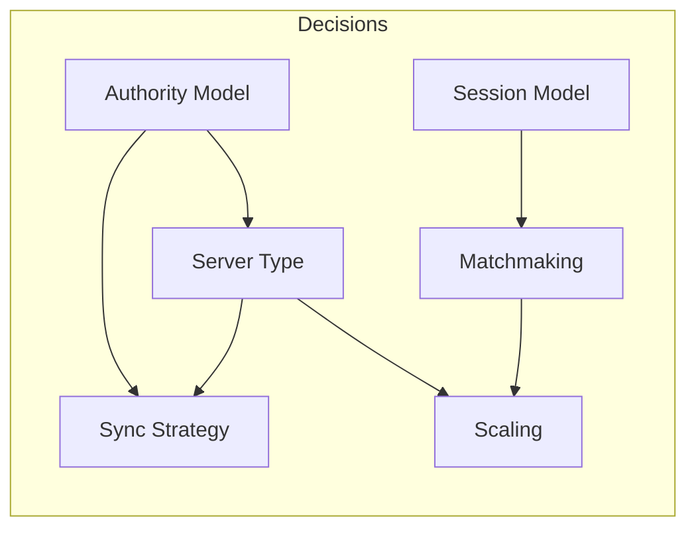

Each decision constrains the next. Choosing client authority implies P2P. Choosing 100 players implies dedicated servers. Choosing competitive implies SBMM.

---

## Part 1: Authority Models

---

## The Authority Problem

In single-player: one machine, one truth, no conflict.

In multiplayer: multiple machines simulate simultaneously, network latency means they cannot agree in real time.

- Player A's machine: "My bullet hit Player B at (10, 5)"
- Player B's machine: "I dodged, I'm at (10, 7)"
- Both are locally correct
- **Someone must be the tiebreaker**

The authority is the machine that produces the **canonical state**.

---

## Authority Is a Spectrum

| Model                         | Who Decides                                 | Latency        | Cheat Resistance | Complexity |
| ----------------------------- | ------------------------------------------- | -------------- | ---------------- | ---------- |
| Full client authority         | Each client trusts itself                   | Zero (local)   | None             | Low        |
| Client authority + validation | Client acts, server validates post-hoc      | Low + rollback | Moderate         | Medium     |
| Server authoritative          | Server decides, clients predict and correct | RTT/2 base     | High             | High       |
| Distributed authority         | Multiple peers share authority by partition | Varies         | Moderate         | Very high  |

Most production games: **server authoritative with client-side prediction**.

---

## Full Client Authority

Each client simulates its own actions. Whatever the client says happened, happened.

```
Client A: "I moved to (10, 5)" → broadcast to all
Client B: "I moved to (3, 8)" → broadcast to all
```

No validation. No correction.

### Where it works

- Cooperative games with trusted players (LAN, friends)
- Low-stakes interactions (chat, emotes, cosmetics)
- Prototyping (validate game feel before investing in authority)

### Why it fails at scale

Any client can lie: teleport, aimbot, inventory hack.

The **trust boundary** is at the client. Since players control their machines, trust is compromised by definition.

---

## Server Authoritative Model

One machine — the **authoritative server** — runs the canonical simulation. Clients send **inputs, not outcomes**.

```
Client → Server:  "I pressed MOVE_RIGHT at tick 42"
Server:           Applies input → simulates → produces new state
Server → Client:  "At tick 42, your position is (10.5, 5.0)"
```

The client never tells the server what happened. The client tells the server what the player _intended_.

---

## Input Authority vs State Authority

A critical distinction:

- **Input authority**: the client controls _what the player pressed_. The server trusts intent, validates timing/rate.
- **State authority**: the server controls _what the press caused_. Movement, collision, damage — all server-decided.

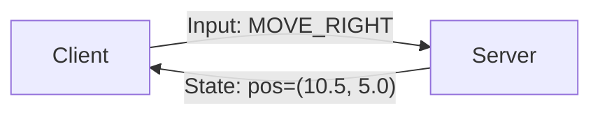

This separation is what makes server authority work.

---

## The Latency Problem

Server authority introduces mandatory latency:

| Step                                 | Time        |
| ------------------------------------ | ----------- |
| Player presses button                | t=0         |
| Input travels to server              | t=RTT/2     |
| Server simulates and produces result | t=RTT/2 + Δ |
| Result travels back to client        | t=RTT       |
| Client renders the result            | t=RTT + Δ   |

At 80ms RTT: **80ms between press and visual confirmation** — if the client does nothing locally.

**Solution**: client-side prediction (Week 13). Client simulates immediately, server confirms or corrects later.

---

## Server-Side Validation

Because the server runs the simulation, it can validate everything:

- **Movement**: is the speed physically possible? Is the path collision-free?
- **Actions**: does the player have resources/cooldowns?
- **Timing**: are inputs arriving at a reasonable rate? (1000 inputs/sec = suspicious)
- **State consistency**: does the client's claimed state match the server's record?

Invalid inputs: silently dropped or flagged. Client corrected by next authoritative update.

---

## Worked Example: Server-Authoritative Hit Detection

Player A fires at Player B:

1. Client A sends: `FIRE angle=45° at tick 100`
2. Server receives at tick 102 (1 tick delay)
3. Server **rewinds** to tick 100 (lag compensation)
4. Server casts ray from A's tick-100 position against B's tick-100 position
5. **Hit** → server applies damage, broadcasts to all clients
6. **Miss** → client A's local hit prediction silently corrected

The server is the **only** machine that decides hits. Client hit markers are speculative.

---

## Distributed Authority (Peer-to-Peer)

Authority is **partitioned** among peers:

- Player A: authoritative over its own character and nearby objects
- Player B: authoritative over its own character and nearby objects
- No single machine sees or validates everything

### When it's used

- Cooperative games (infrequent cross-player state interaction)
- Large open worlds (centralizing all authority too expensive)
- Unity's Distributed Authority topology

---

## Authority Transfer

When two players interact (collision, trade, combat), authority must converge:

| Method          | How It Works                                       | Risk                        |
| --------------- | -------------------------------------------------- | --------------------------- |
| **Handoff**     | One peer yields authority for the interaction      | Race conditions on transfer |
| **Arbitration** | Lightweight coordinator resolves conflicts         | Coordinator is bottleneck   |
| **Merge**       | Both submit views, deterministic rule picks winner | Complex merge logic         |

Authority transfer is the **hardest part** of distributed authority. Race conditions, partitions during transfer, and ownership disagreements are all active failure modes.

---

## Centralized vs Distributed Authority

| Aspect                  | Centralized (Server) | Distributed (P2P)           |
| ----------------------- | -------------------- | --------------------------- |
| Single point of failure | Yes (server)         | No (but partition failures) |
| Cheat resistance        | High                 | Per-partition only          |
| Infrastructure cost     | Server hardware      | Player machines             |
| Latency (peer-to-peer)  | 2× (through server)  | 1× (direct)                 |
| Complexity              | Moderate             | Very high                   |
| Scalability             | Server-limited       | Peer-limited                |

---

## Authority and Genre Fit

| Genre           | Typical Authority Model              | Why                                            |
| --------------- | ------------------------------------ | ---------------------------------------------- |
| Competitive FPS | Server auth + lag compensation       | Cheat resistance and hit-reg fairness critical |
| Fighting games  | Lockstep / rollback (peer authority) | Frame precision; no server in input path       |
| Cooperative PvE | Server or distributed authority      | Lower cheat incentive; some inconsistency OK   |
| MMO             | Server authoritative (sharded)       | Massive scale requires centralized validation  |
| Battle royale   | Server authoritative                 | 100 players + high cheat incentive             |
| Turn-based      | Server authoritative (simple)        | High latency tolerance; simple validation      |
| Racing          | Server auth + prediction             | Physics divergence requires authority          |

---

## Genre-Authority Mismatch Failures

Using the **wrong** authority model for a genre:

- **Client authority in competitive FPS**: rampant cheating → competitive integrity destroyed
- **Full server authority in fighting games**: 80ms input delay → precise combos impossible
- **Distributed authority in MMO**: cross-partition exploits, duplication bugs, broken economy

Match the authority model to the genre's primary requirement.

---

## CSI ↔ GPR: Authority

| Context | Perspective                                                                            |
| ------- | -------------------------------------------------------------------------------------- |
| CSI     | Consistency model: strong (server), eventual (client+correction), causal (distributed) |
| GPR     | Player feel: responsive? Fair? Trustworthy?                                            |

**CAP theorem applies**: network partitions force choosing consistency (server auth) or availability (client auth). Prediction adds availability back through optimistic speculation.

---

## Part 2: Dedicated vs Listen Servers

---

## Dedicated Servers

A headless process on developer-controlled infrastructure runs the authoritative simulation. Players connect as clients.

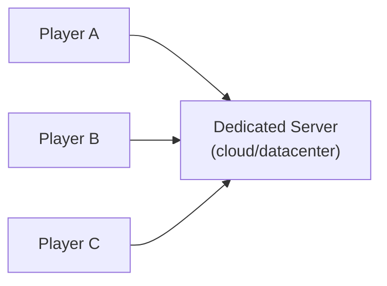

No player "is" the server. The server exists solely to run the game.

---

## Dedicated Server Properties

| Property          | Dedicated Server                                    |
| ----------------- | --------------------------------------------------- |
| Authority         | Server authoritative; no player has special trust   |
| Failure mode      | Server crash ends game for everyone                 |
| Network topology  | Star (all clients → one endpoint)                   |
| Latency symmetry  | All players have similar latency to the same server |
| Cheat resistance  | High (server validates all inputs)                  |
| Cost              | Developer pays for compute                          |
| Scaling           | Add more instances (horizontal scaling)             |
| Player disconnect | Game continues; slot freed or held for reconnect    |

---

## When Dedicated Servers Are Preferred

- **Competitive multiplayer**: ranked, esports, tournaments — fairness and anti-cheat non-negotiable
- **Large player counts**: 64-player shooters, 100+ battle royale, MMO shards
- **Persistent worlds**: state must survive any individual player disconnecting
- **Cross-platform play**: neutral server avoids platform advantage

---

## The Cost Problem

Each active instance consumes CPU, memory, bandwidth on developer infrastructure.

**Worked Example**: 100,000 concurrent players in 4-player matches:

| Metric                 | Value            |
| ---------------------- | ---------------- |
| Active instances       | 25,000           |
| Cost per instance/hour | $0.03 (small VM) |
| Hourly cost            | $750             |
| Daily cost             | $18,000          |
| Monthly cost           | ~$540,000        |

Plus bandwidth, monitoring, matchmaking, and operational overhead. Scales **linearly** with concurrent players.

---

## Stateful vs Stateless: Why Game Servers Are Different

| Property             | Web Server (Stateless)           | Game Server (Stateful)               |
| -------------------- | -------------------------------- | ------------------------------------ |
| Request routing      | Any instance handles any request | Player bound to one instance         |
| Instance termination | Safe at any time                 | Kills a live match                   |
| Load balancing       | Round-robin, least-connections   | Must respect session affinity        |
| Scale-down           | Remove instances freely          | Must wait for matches to end (drain) |
| Health check         | HTTP 200 = healthy               | Depends on match state               |
| State recovery       | Reload from database             | Match state is ephemeral             |

This is why game server orchestration is **fundamentally different** from web server orchestration.

---

## Listen Servers (Player-Hosted)

One player's machine acts as **both client and server**. That player (the "host") runs the authoritative simulation while also playing.

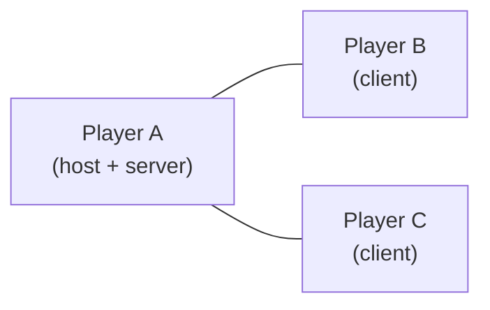

---

## Listen Server Properties

| Property          | Listen Server                                 |
| ----------------- | --------------------------------------------- |
| Authority         | Host player has authoritative control         |
| Failure mode      | Host disconnect ends game (without migration) |
| Network topology  | Star (all connect to host)                    |
| Latency symmetry  | Host: 0ms. Others: RTT to host                |
| Cheat resistance  | Low (host can manipulate simulation)          |
| Cost              | Zero infrastructure cost to developer         |
| Scaling           | Scales with players (each match self-hosts)   |
| Player disconnect | If host: game ends. If other: slot freed      |

---

## When Listen Servers Are Preferred

- **Small sessions**: 2-8 players where a host can handle the simulation
- **Low competitive stakes**: co-op, casual, friend groups
- **Budget constraints**: indie studios, F2P without server revenue
- **LAN play**: host is physically close; latency negligible
- **Platform restrictions**: consoles where custom server infrastructure is difficult

---

## The Host Advantage Problem

The host has **zero network latency** to the authoritative simulation:

- Host's inputs applied instantly. Remote players delayed by RTT.
- Host sees authoritative state with no interpolation delay.
- Host's hit detection is perfectly accurate. Remote players rely on lag compensation.

### Mitigation approaches

| Approach                  | How                                     | Downside                 |
| ------------------------- | --------------------------------------- | ------------------------ |
| Artificial host delay     | Add fake latency to host inputs         | Host experience degrades |
| Local dedicated server    | Host runs server as separate process    | More CPU/memory on host  |
| Host-only cosmetic server | Host uses client connection like others | More processing required |

---

## The Disconnect Problem

If the host disconnects (rage quit, crash, network failure), the game state is **lost**.

Without **host migration**, all players are kicked.

This is the single biggest reliability problem with listen servers.

---

## Host Migration: What It Solves

Transfer the authoritative simulation from the departing host to another player's machine.

### The Algorithm

1. **Detection**: clients detect host disconnection (timeout, heartbeat failure)
2. **Election**: remaining clients agree on a new host (deterministic rule or negotiation)
3. **State Transfer**: new host promotes its local state to authoritative
4. **Reconnection**: clients disconnect from old host, connect to new host
5. **Reconciliation**: new host resolves state discrepancies from transition period

---

## Why Host Migration Is Hard

| Failure Mode       | Problem                                                          |
| ------------------ | ---------------------------------------------------------------- |
| State divergence   | Different clients have different views — which is authoritative? |
| In-flight packets  | Inputs/state in transit when host died are lost                  |
| Election conflicts | Two clients both think they're the new host (partition)          |
| Timing gap         | Migration takes 1-5 seconds — game freezes                       |
| NAT traversal      | New host may not be reachable by all clients                     |

---

## Host Migration Strategies

| Strategy                      | Complexity | Recovery Time | State Accuracy |
| ----------------------------- | ---------- | ------------- | -------------- |
| Full state replication to all | High       | Fast (<1s)    | High           |
| Periodic snapshots from host  | Medium     | Medium (1-3s) | Moderate       |
| No migration (game ends)      | Zero       | N/A           | N/A            |
| Backup host (shadow server)   | Very high  | Very fast     | Very high      |

Most commercial games use **full state replication**: clients already receive enough state from normal sync that the new host can promote its local view.

---

## Hybrid Server Models

### Local Dedicated Server

Player's machine runs a **separate server process**. Player connects as a regular client. Eliminates host advantage. Costs more CPU/memory on host machine.

### Relay + Player Host

Players connect through a **developer-operated relay** that forwards packets but doesn't simulate. One player hosts the authoritative simulation. Relay provides NAT traversal, routing, and host privacy.

### Cloud-Backed Listen Server

Game starts as listen server. If host disconnects, **migrates to a cloud-hosted dedicated server**. Zero-cost normal operation + high reliability at the cost of standby capacity.

---

## Decision Framework: Dedicated vs Listen

| Factor                 | Dedicated Server                | Listen Server               |
| ---------------------- | ------------------------------- | --------------------------- |
| Player count per match | Any (scales with hardware)      | 2-16 (host machine limited) |
| Competitive integrity  | High                            | Low-medium                  |
| Infrastructure budget  | Required                        | Zero                        |
| Reliability            | High (server doesn't rage quit) | Low without migration       |
| Latency fairness       | Equal for all                   | Host has advantage          |
| Deployment complexity  | High (orchestration, scaling)   | Low (clients are servers)   |
| Long-running sessions  | Ideal (persistent worlds)       | Fragile (host may leave)    |

---

## Mixed Strategies

Many games use both:

- **Ranked/competitive** → dedicated servers for fairness
- **Casual/custom** → listen servers to reduce cost
- **LAN/private** → listen servers for simplicity

Halo, Call of Duty, Rocket League all follow this pattern.

---

## CSI ↔ GPR: Server Types

| Context | Focus                                                           |
| ------- | --------------------------------------------------------------- |
| CSI     | Availability, fault tolerance, capacity planning, observability |
| GPR     | Time to play, session continuity, perceived fairness, features  |

Dedicated servers: high CSI score (observable, reliable). Listen servers: high GPR score for casual (instant start, zero cost).

---

## Part 3: Rollback Networking

---

## The Problem Rollback Solves

Server authority introduces latency. At 80ms RTT: 80ms between press and visual confirmation.

Client-side prediction hides this — but prediction is a **guess**. When the server disagrees, the client must correct.

**How does the client correct?**

---

## Correction Approaches Compared

| Approach          | How It Works                                  | Artifact                                |
| ----------------- | --------------------------------------------- | --------------------------------------- |
| Snap correction   | Jump to server state instantly                | Visible teleport, rubber-banding        |
| Smooth correction | Blend toward server state over several frames | Delayed convergence, mushy feel         |
| **Rollback**      | Rewind to server tick, replay inputs forward  | Corrections are small, nearly invisible |

Rollback corrects the **root cause** (wrong state at server tick), not just the **symptom** (wrong position now).

---

## The Core Rollback Algorithm

1. Client receives **authoritative state** for tick $T$ from server
2. Client **compares** predicted state at $T$ to server's state at $T$
3. **If match**: prediction correct. No correction needed.
4. **If mismatch**:

```
   a. Rewind simulation to tick T
   b. Apply server's authoritative state at tick T
   c. Replay all local inputs from T+1 to current tick T+N
   d. Arrive at corrected current state
```

---

## Why Replay Matters

Without replay: client jumps to server's state at tick $T$ (which is in the past). **Visible teleport backward.**

With replay: client fast-forwards from corrected past to corrected present.

```
Server confirms tick 100. Client is at tick 108.

Without rollback:
  Tick 108 → snap to server tick 100 → TELEPORT BACKWARD

With rollback:
  Tick 108 → rewind to 100 (server state)
           → replay 101 (local input)
           → replay 102 (local input)
           → ...
           → replay 108 (local input)
           → corrected tick 108 → MINIMAL VISUAL CHANGE
```

If prediction was close (usually is for local player), the correction is **invisible**.

---

## Requirement 1: Deterministic Simulation

Replaying the same inputs from the same state **must** produce the same output.

Sources of non-determinism to control:

| Source               | Problem                              | Solution                                    |
| -------------------- | ------------------------------------ | ------------------------------------------- |
| Floating-point order | Different addition order → drift     | Fixed-point math or deterministic ordering  |
| Random numbers       | Different seeds → different outcomes | Synchronized seed, deterministic RNG        |
| Physics engine       | Variable-step → drift                | Fixed-step simulation, deterministic solver |
| Hash map iteration   | Platform-dependent order             | Ordered containers                          |
| Thread scheduling    | Non-deterministic interleaving       | Single-threaded simulation                  |

Fighting games (where rollback is most mature) use fixed-point arithmetic and single-threaded, fixed-step simulation.

---

## Requirement 2: Efficient State Save/Restore

The client must:

- **Save** complete simulation state at any tick (rollback target)
- **Restore** a saved state instantly (begin replay)
- **Keep a window** of saved states (RTT / tick_interval deep)

| Approach                 | Speed     | Memory Cost            | Implementation |
| ------------------------ | --------- | ---------------------- | -------------- |
| Full state copy          | Fast      | State × window depth   | Low (memcpy)   |
| Copy-on-write            | Very fast | Only changed data/tick | Medium         |
| Delta snapshots          | Medium    | Low                    | High           |
| Component dirty tracking | Fast      | Only dirty components  | Medium-high    |

Fighting games (small state <10 KB): full copy is practical.

Shooters (large state, hundreds of KB): delta or dirty-tracking necessary.

---

## Requirement 3: Fast Resimulation

Rollback re-simulates N ticks per frame:

$$N_{\text{rollback}} = \lceil \frac{RTT}{T_{\text{tick}}} \rceil$$

At 80ms RTT, 60 Hz: $N = \lceil 80/16.7 \rceil = 5$ ticks of resimulation per frame.

If simulation takes 8ms/tick: rollback adds 40ms → **exceeds** 16.7ms frame budget.

Simulation must be highly optimized, or rollback is impractical for large state.

---

## Requirement 4: Input Buffer

Client maintains all unconfirmed local inputs:

```
Unconfirmed: [tick 103: RIGHT, 104: RIGHT+JUMP, 105: RIGHT, ...]
Last confirmed: tick 102
Current tick: 108
```

When rollback occurs, inputs replayed from confirmed tick forward.

As server confirms ticks, old inputs removed from buffer.

---

## Fighting Games: Pure P2P Rollback

Fighting games are the natural home of rollback:

- **Small state**: 2 players, <10 KB simulation state
- **Frame precision**: 1-frame advantage is competitively significant
- **Determinism achievable**: fixed-point math, simple physics
- **P2P**: both peers run rollback, no server

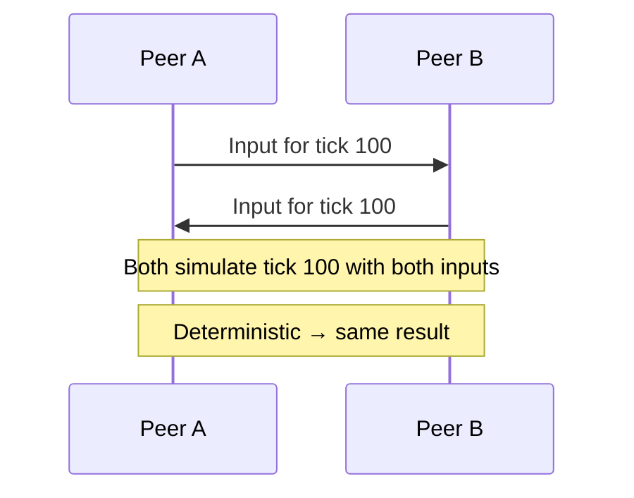

GGPO (Good Game, Peace Out) is the reference library for P2P rollback.

---

## Shooters: Server Auth + Rollback Correction

Shooters use rollback differently:

- **Server authoritative**: server is source of truth
- **Client predicts**: local simulation
- **Server corrects**: client rolls back and replays on mismatch
- **Partial rollback**: typically only local player's state rolls back; other players use smoothing

---

## Fighting vs Shooter Rollback

| Aspect               | Fighting Game Rollback | Shooter Rollback                |
| -------------------- | ---------------------- | ------------------------------- |
| Topology             | P2P (2 peers)          | Client-server                   |
| State size           | Small (< 10 KB)        | Large (hundreds of KB)          |
| Rollback scope       | Full simulation        | Local player only (usually)     |
| Determinism required | Strict                 | For local player's view         |
| Visual correction    | Rare, small            | More frequent, smoothing needed |

---

## Rollback Artifacts

Even well-implemented rollback has visible artifacts under bad conditions:

| Artifact           | Cause                                               | Mitigation                                   |
| ------------------ | --------------------------------------------------- | -------------------------------------------- |
| One-frame teleport | Correction large enough to see in one frame         | Smooth over 2-3 frames                       |
| Hit/hurt desync    | Attack connects locally, rollback reveals it didn't | Defer damage numbers until confirmed         |
| Animation pop      | Animation state jumps to different pose             | Separate visual animation from sim state     |
| Sound replay       | Effect triggers on prediction, rollback replays it  | Defer sounds or accept minor audio artifacts |

---

## The Rollback Window Budget

Maximum rollback depth determines maximum supported RTT:

$$RTT_{\text{max}} = N_{\text{window}} \times T_{\text{tick}}$$

10-frame window at 60 Hz: supports RTT up to **167ms**.

Beyond that: fall back to input delay (wait for remote input before simulating).

GGPO uses hybrid: **rollback up to window limit, then add input delay** for the remainder.

---

## Lockstep: Rollback's Predecessor

All peers wait for all inputs before advancing each tick:

```
Tick 100: Wait for ALL inputs → simulate → advance
Tick 101: Wait for ALL inputs → simulate → advance
```

Guarantees deterministic agreement. But adds latency equal to slowest peer's round-trip.

---

## Why Rollback Replaced Lockstep

| Aspect          | Lockstep                      | Rollback                 |
| --------------- | ----------------------------- | ------------------------ |
| Input delay     | Equal to RTT                  | Zero (predict locally)   |
| Determinism     | Required (same inputs)        | Required (for replay)    |
| Network impact  | One slow peer delays everyone | Each peer independent    |
| Correction cost | None (always correct)         | Resimulation on mismatch |
| Genre fit       | Strategy, turn-based          | Action, fighting, FPS    |

---

## When Lockstep Is Still Used

- **RTS games**: many units, deterministic simulation, slow input cadence
- **Turn-based games**: natural lockstep — each turn waits for all players
- **Deterministic replay**: lockstep logs are compact (only inputs), efficient replay

---

## CSI ↔ GPR: Rollback

| Context | Perspective                                                          |
| ------- | -------------------------------------------------------------------- |
| CSI     | Optimistic replication: speculate, detect conflict, resolve (replay) |
| GPR     | Invisible authority: player should never notice corrections          |

Success metrics: correction frequency <5%, correction magnitude < character width, correction visibility = zero.

---

## Part 4: Session Management

---

## What Is a Session?

A session is the **container** for a multiplayer experience: from grouping to the last player leaving.

### Session as a Resource

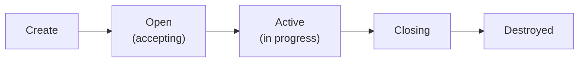

At any point, a session has:

- **Identity**: unique session ID
- **State**: open, active, closing
- **Membership**: connected players and roles (host, player, spectator)
- **Configuration**: mode, map, rules, visibility, max players
- **Metadata**: region, creation time, skill, tags

---

## Session vs Match vs Lobby

| Concept     | Duration          | What Happens                             |
| ----------- | ----------------- | ---------------------------------------- |
| **Lobby**   | Pre-match waiting | Players gather, configure, ready up      |
| **Match**   | Active gameplay   | Game runs with locked/managed player set |
| **Session** | Full lifecycle    | Encompasses lobby + match + post-match   |

A session may contain multiple matches (best-of-3, map rotation) or just one.

---

## Session Creation

Sessions are created by:

| Creator           | Mechanism                                             |
| ----------------- | ----------------------------------------------------- |
| Matchmaker        | Groups players → creates session → assigns server     |
| Player (host)     | Creates custom game → shares join code or publishes   |
| Server allocation | Matchmaker requests server → session created on ready |

Creation involves:

1. Allocate session ID
2. Register in session directory (for discovery)
3. Provision game server (dedicated) or designate host (listen)
4. Set configuration (mode, map, max players, region)

---

## Joining a Session

Players join through different paths:

| Method              | Experience                                      |
| ------------------- | ----------------------------------------------- |
| Matchmaker assigned | "You've been placed in session ABC-123"         |
| Invite / join code  | "Enter code XYZ to join your friend"            |
| Server browser      | Browse list, pick a session                     |
| Quick match         | Matchmaker finds in-progress session with slots |

Join flow:

1. Client contacts session (IP:port or relay)
2. Session validates (room? authorized? still accepting?)
3. Player registered in membership list
4. Server sends current game state (full sync)
5. Client begins simulation

---

## Connection Establishment

After matchmaking, clients must establish actual network connections:

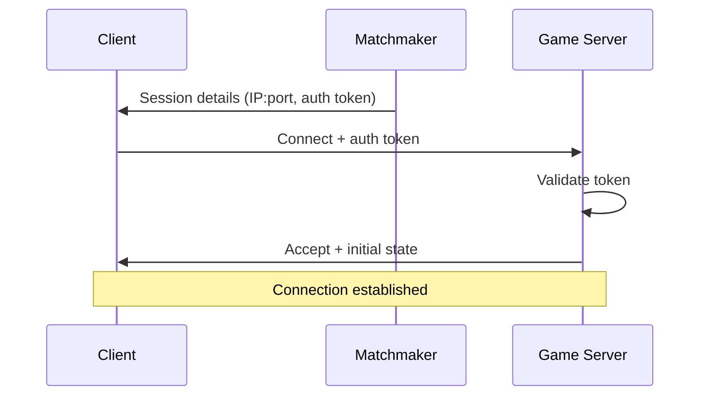

For dedicated servers: straightforward (server has public IP or known relay).

For listen servers: harder (NAT traversal, hole punching, relay).

---

## Disconnection Detection

Players disconnect for many reasons: network failure, crash, rage quit, power outage, mobile backgrounding.

Detection methods:

- **Heartbeat timeout**: no packets within threshold (e.g., 10 seconds)
- **Connection close**: explicit disconnect message
- **Transport failure**: underlying transport reports lost

---

## Reconnection Policies

| Policy             | Behavior                                     | Use Case               |
| ------------------ | -------------------------------------------- | ---------------------- |
| No reconnect       | Player removed immediately; slot freed       | Short fast matches     |
| Grace period       | Slot held for N seconds; player can rejoin   | Competitive matches    |
| Persistent slot    | State preserved indefinitely; rejoin anytime | MMO, persistent worlds |
| Spectator fallback | Reconnected player joins as spectator        | Tournaments, broadcast |

Reconnection requires:

1. Re-authenticate (token may have expired)
2. Check slot still held
3. Receive state snapshot (world changed since disconnect)
4. Fast-forward or receive delta updates

---

## Session Discovery: Server Browser

The classic model: list of active sessions, filterable by map, mode, player count, region, ping.

**Components**:

- **Session directory service**: registry of all active sessions
- **Heartbeat updates**: each session reports status periodically
- **Query interface**: clients filter and receive sorted list

**Pros**: player control, supports niche communities (specific maps, mods)

**Cons**: friction (player must choose), stale data (session full by time you click), uneven distribution

---

## Session Discovery: Matchmaker

Removes player choice: player requests a match, system assigns a session.

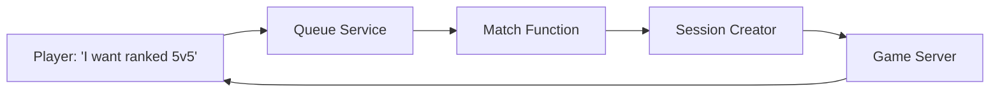

Dominant model for competitive and casual matchmaking.

---

## Hybrid Discovery: Browse + Quick Match

Many games offer both:

| Mode           | Mechanism                        | When                        |
| -------------- | -------------------------------- | --------------------------- |
| Quick Match    | Matchmaker assigns automatically | Speed and fairness priority |
| Server Browser | Player browses and selects       | Community/custom servers    |
| Custom Game    | Player creates and invites       | Friend groups               |

---

## Platform Brokering Services

| Platform    | Service                    | Capabilities                          |
| ----------- | -------------------------- | ------------------------------------- |
| Steam       | Steamworks Networking      | Relay, NAT traversal, matchmaking     |
| Epic        | Epic Online Services (EOS) | Lobbies, sessions, P2P relay          |
| PlayStation | PSN Matching               | Session management, relay             |
| Xbox        | Xbox Live Multiplayer      | Session directory, Smart Match, relay |
| PlayFab     | PlayFab Multiplayer        | Server hosting, matchmaking, party    |

These handle NAT, relay, and auth so the developer focuses on session logic.

---

## CSI ↔ GPR: Sessions

| Context | Perspective                                                           |
| ------- | --------------------------------------------------------------------- |
| CSI     | Distributed resources: consistency, availability, idempotency         |
| GPR     | Player journey: time to play, social continuity, graceful degradation |

---

## Part 5: Matchmaking

---

## Matchmaking: The Optimization Problem

Matchmaking is a **multi-objective optimization** problem: find a group that produces a good game within a time budget.

Not a simple sort-by-skill operation.

---

## Competing Objectives

| Objective      | What It Means                              | Conflicts With                 |
| -------------- | ------------------------------------------ | ------------------------------ |
| Skill fairness | Similar skill levels                       | Queue time (fewer opponents)   |
| Low latency    | Same or nearby region                      | Skill fairness (smaller pool)  |
| Short queue    | Find a match quickly                       | Skill + latency constraints    |
| Party support  | Friends queue together                     | Balanced teams (party vs solo) |
| Pop health     | New players protected; veterans challenged | Strict skill matching          |
| Match quality  | Competitive, fun game                      | Speed of matching              |

---

## Queue Time vs Quality: The Fundamental Tension

- **Strict** (narrow skill, same region): high quality, long queue
- **Loose** (wide skill, cross-region): short queue, lower quality

### Expanding Windows

Start strict, gradually relax:

| Wait Time | Skill Range | Region   | Max Latency |
| --------- | ----------- | -------- | ----------- |
| t=0s      | ±100        | Same     | <50ms       |
| t=30s     | ±200        | Same     | <80ms       |
| t=60s     | ±400        | Adjacent | <120ms      |
| t=120s    | ±800        | Any      | <200ms      |

---

## Elo Rating

Originally designed for chess. After a match:

$$E_A = \frac{1}{1 + 10^{(R_B - R_A)/400}}$$

$$R_A' = R_A + K(S_A - E_A)$$

Where:

- $E_A$ = A's expected score (probability of winning)
- $R_A$, $R_B$ = player ratings
- $S_A$ = actual outcome (1=win, 0=loss)
- $K$ = update sensitivity (higher = faster adjustment)

**Limitation**: designed for 1v1. Team games need adaptations.

---

## Worked Example: Elo Update

Player A (rating 1200) beats Player B (rating 1400). $K = 32$:

$$E_A = \frac{1}{1 + 10^{(1400 - 1200)/400}} = \frac{1}{1 + 10^{0.5}} \approx 0.24$$

$$R_A' = 1200 + 32(1 - 0.24) = 1200 + 24.3 = 1224$$

$$R_B' = 1400 + 32(0 - 0.76) = 1400 - 24.3 = 1376$$

A (underdog) gains 24 points. B (favorite) loses 24 points. **Upset = big rating shift.**

---

## Beyond Elo: Advanced Rating Systems

| System      | Key Innovation                                  | Used In                    |
| ----------- | ----------------------------------------------- | -------------------------- |
| Glicko-2    | Rating deviation (confidence) + volatility      | Lichess, many online games |
| TrueSkill   | Bayesian Gaussian (mean+variance), team support | Halo, Gears of War         |
| TrueSkill 2 | Multi-mode, party skill, account age            | Xbox ecosystem             |
| OpenSkill   | Open-source Bayesian (no patent restrictions)   | Indie + open-source games  |

### Rating Deviation (Glicko)

A player with **high deviation** has uncertain skill:

- New player, returning player, or inconsistent performer
- Matchmaker places them in wider skill range (exploration)
- Match results weighted more heavily (faster calibration)

A player with **low deviation** has stable skill:

- Results weighted less (resistance to noise)
- Matchmaker places them precisely

---

## TrueSkill: Gaussian Skill Model

Each player modeled as a Gaussian distribution:

- **μ** (mu) = estimated skill (mean)
- **σ** (sigma) = uncertainty (standard deviation)

```
New player:      μ=25, σ=8.3  (wide bell curve — uncertain)
Calibrated:      μ=32, σ=1.2  (narrow bell curve — confident)
```

**Conservative skill estimate**: $\mu - 3\sigma$ ensures players aren't overrated due to luck.

Supports teams, free-for-all, and rapid convergence.

---

## Matchmaking Architecture

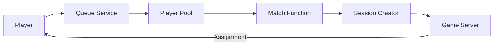

1. **Queue Service**: accepts requests, maintains pool, handles parties
2. **Player Pool**: all waiting players, indexed by skill/region/preferences
3. **Match Function**: the optimization algorithm (all the logic lives here)
4. **Session Creator**: allocates server, creates session
5. **Assignment**: notifies players, provides connection details

---

## Open Match Architecture (Google)

Open-source matchmaking framework separating concerns:

| Component      | Responsibility                                    | Customizable?               |
| -------------- | ------------------------------------------------- | --------------------------- |
| Frontend       | Player tickets (join/leave queue, get assignment) | No (framework)              |
| Director       | Orchestrates match functions, assigns to servers  | Partially                   |
| Match Function | Skill evaluation, constraint checking             | **Yes** (game dev provides) |
| Backend        | Server allocation, session creation               | Partially                   |

Developers customize **only the Match Function** — the part that matters for their game.

---

## Matchmaking Is a Batch Process

Does **not** match one player at a time. Accumulates a pool, runs match function every 1-5 seconds.

Why batch?

- **Better matches**: more players = more options for optimizer
- **Fairness**: simultaneous processing avoids ordering bias
- **Efficiency**: one pass over N players cheaper than N individual searches

---

## Latency Constraints in Matchmaking

A perfectly skill-balanced match where one team has 20ms ping and the other has 200ms is **not fair**.

### Region-Based Matching

Simplest constraint: match within same geographic region.

Player's region determined by:

- Client self-report (pings regional endpoints, reports best)
- IP geolocation (approximate, fallback)
- Historical QoS data

**Problem**: narrows pool → increases queue time. During off-peak, may cross regions.

### Latency Budgets

"Match players such that max RTT between any two is < 100ms."

Allows cross-region when nearby regions have low latency (e.g., US East + US Central).

---

## The Party Problem

A pre-made 5-player party has better coordination than 5 randoms — even at equal individual skill.

| Solution          | Mechanism                                  | Tradeoff                  |
| ----------------- | ------------------------------------------ | ------------------------- |
| Party vs party    | Match parties against similar-size parties | Longer queue for parties  |
| Party skill bonus | Inflate party's effective rating           | Requires careful tuning   |
| Solo/duo queue    | Restrict entry to solo/pairs only          | Parties can't play ranked |

### Team Balancing

| Method              | How                                               | Quality |
| ------------------- | ------------------------------------------------- | ------- |
| Greedy alternating  | Sort by skill, alternate assignment               | Decent  |
| Minimize difference | Find split minimizing total team skill difference | Good    |
| Role-based          | Ensure each team has required role composition    | Best    |

---

## Population Health

### Small Populations (late night, niche mode, new game)

- Expand criteria faster
- Cross-mode matching (similar modes share pool)
- Bot backfill (replace bots when humans join)

### Smurf Detection

| Signal               | Threshold                      | Response                 |
| -------------------- | ------------------------------ | ------------------------ |
| Win rate anomaly     | New account winning 90%+       | Accelerate calibration   |
| Performance metrics  | KDA/accuracy far above rating  | Increase effective skill |
| Hardware fingerprint | Same hardware as existing acct | Flag for review          |

### Queue Abandonment

Long queue → players leave → smaller pool → even longer queue → **death spiral**.

Prevention: estimated wait times, in-queue activities, prioritize players near abandonment threshold.

---

## CSI ↔ GPR: Matchmaking

| Context | Perspective                                                              |
| ------- | ------------------------------------------------------------------------ |
| CSI     | Service discovery, constraint satisfaction, queue theory, load balancing |
| GPR     | First impression, flow state, social glue, perceived fairness            |

---

## Part 6: Scaling Game Servers

---

## Why Scaling Game Servers Is Hard

Web servers: stateless, any request to any instance, kill freely.

Game servers: **stateful**, player bound to one instance, can't kill mid-match.

---

## The Game Server Lifecycle

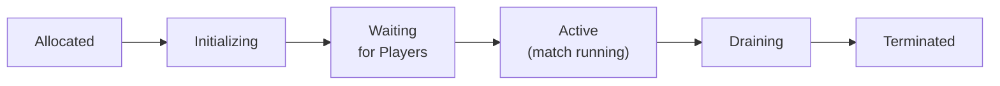

During **Active**: cannot move, replicate, or terminate. Phase lasts 5 minutes to hours.

The scaling system must respect this lifecycle.

---

## Peak vs Average Load

| Pattern      | Variation          | Example                  |
| ------------ | ------------------ | ------------------------ |
| Daily cycle  | 3x-10x peak/trough | Evening peak vs early AM |
| Weekly cycle | 1.5x-2x weekends   | Weekend warriors         |
| Events       | 5x-20x spike       | Launch day, free weekend |

Provision for peak = waste during off-peak.

Provision for average = peak players can't play.

---

## Fleet Management

A **fleet** is a group of identical game server instances:

| Task              | What It Does                                   |
| ----------------- | ---------------------------------------------- |
| Provisioning      | Start new instances when demand increases      |
| Allocation        | Assign incoming matches to available instances |
| Draining          | Mark "no new matches" before termination       |
| Health monitoring | Detect crashed/stuck instances, replace them   |

---

## Allocation Strategies

### Pre-Warmed Pool

Maintain idle instances, ready immediately.

- **Pro**: zero allocation latency
- **Con**: idle servers cost money
- **Tuning**: how many idle to keep?

### On-Demand Allocation

Start new instance when match created.

- **Pro**: no idle cost
- **Con**: startup time (10-60s container, 1-5min VM)
- **Mitigation**: pre-warmed with on-demand overflow

---

## Scheduling: Packed vs Distributed

When placing instances on physical nodes:

| Strategy    | Description                      | Pro             | Con                         |
| ----------- | -------------------------------- | --------------- | --------------------------- |
| Packed      | Fill each node before using next | Max utilization | Node failure = many matches |
| Distributed | Spread evenly across nodes       | High resilience | Lower utilization           |

```yaml
# Agones Fleet scheduling
scheduling: Packed # or Distributed
```

---

## Graceful Scale-Down

Cannot kill servers with active matches:

1. Mark instances as **draining** (no new matches)
2. Wait for active matches to complete naturally
3. Terminate drained instances

If matches take 30 minutes → 30 minutes before freeing resources.

**Significant hysteresis**: system responds slowly to demand decreases.

---

## Vertical Scaling: CPU Budget

Server must complete one tick before the next deadline:

$$T_{\text{tick\_budget}} = \frac{1}{R_{\text{tick\_hz}}}$$

| Tick Rate | Budget |
| --------- | ------ |
| 60 Hz     | 16.7ms |
| 20 Hz     | 50ms   |
| 10 Hz     | 100ms  |

If simulation exceeds budget: delayed updates, jitter, rubber-banding, freezes.

---

## Server Health by Tick Time

| Tick Time / Budget | Status                            |
| ------------------ | --------------------------------- |
| < 50%              | Healthy, headroom for spikes      |
| 50-80%             | Normal, limited headroom          |
| 80-95%             | At risk, spikes may exceed budget |
| > 95%              | Overloaded, visible degradation   |

Monitor this metric continuously.

---

## Kubernetes + Agones

Agones extends Kubernetes for game server workloads:

| Concept         | What It Is                                           |
| --------------- | ---------------------------------------------------- |
| GameServer      | Custom resource = one game server instance           |
| Fleet           | Set of GameServers with desired replica count        |
| FleetAutoscaler | Adjusts Fleet size (buffer count or custom webhook)  |
| Allocation      | Assigns idle GameServer to match (Ready → Allocated) |

### Agones Lifecycle

```
Pod Created → PortAllocated → Creating → Starting → Scheduled →
  RequestReady → Ready → Allocated → (match) → Shutdown → Deleted
```

---

## PlayFab Multiplayer Servers

Microsoft's managed game server hosting:

- **Builds**: upload server builds (container or VM)
- **Regions**: deploy to multiple Azure regions
- **Standby targets**: configure idle server count per region
- **Auto-scaling**: managed based on allocation requests
- **Allocation API**: matchmaker requests server → gets connection details

Abstracts away infrastructure — developer focuses on binary + policy.

---

## Agones vs PlayFab

| Feature                | Agones (self-managed)   | PlayFab (managed)      |
| ---------------------- | ----------------------- | ---------------------- |
| Infrastructure control | Full (your K8s cluster) | Limited (Azure-hosted) |
| Cost model             | Pay for infrastructure  | Pay per server-hour    |
| Customization          | Full                    | Configuration-based    |
| Operational complexity | High (manage K8s)       | Low (managed)          |
| Multi-cloud            | Yes                     | Azure only             |
| Learning curve         | Steep                   | Moderate               |

---

## Multi-Region Fleet Strategies

| Strategy                   | Description                                | Cost   | Complexity |
| -------------------------- | ------------------------------------------ | ------ | ---------- |
| Single region              | All servers in one location                | Lowest | Lowest     |
| Fixed multi-region         | Pre-provisioned per supported region       | High   | Medium     |
| Demand-driven multi-region | Provision where demand exists              | Medium | High       |
| Follow-the-sun             | Shift capacity to regions approaching peak | Medium | Very high  |

---

## Cross-Region Matchmaking

The matchmaker must pick which region's servers to use:

- **Player proximity**: closest region to the matched players
- **Party distribution**: minimize maximum RTT across party members spanning regions
- **Server availability**: prefer regions with idle servers
- **Cost**: some regions more expensive; factor during off-peak

---

## Monitoring Game Server Infrastructure

| Metric                  | What It Tells You                 | Alert Threshold             |
| ----------------------- | --------------------------------- | --------------------------- |
| Active matches          | Current demand                    | Trending toward capacity    |
| Idle server count       | Buffer for new matches            | Below minimum buffer        |
| Allocation latency      | Time from request to server ready | > 5 seconds                 |
| Server tick time (p95)  | Simulation performance            | > 80% of tick budget        |
| Player count per server | Load per instance                 | > max capacity              |
| Crash rate              | Stability                         | > 1% of instances           |
| Queue depth             | Unmet demand                      | Growing faster than matched |

---

## Capacity Planning

| Strategy              | How                                     | When                   |
| --------------------- | --------------------------------------- | ---------------------- |
| Time-series forecast  | Predict from day/time patterns          | Baseline capacity      |
| Event-based pre-scale | Extra capacity before known events      | Patch day, tournaments |
| Reactive scaling      | Scale up when metrics exceed thresholds | Safety net             |

Best approach: **combine all three** — forecast baseline, pre-provision events, reactive safety net.

---

## CSI ↔ GPR: Scaling

| Context | Perspective                                                           |
| ------- | --------------------------------------------------------------------- |
| CSI     | Service discovery, load balancing, fault tolerance, capacity planning |
| GPR     | Queue time, match quality, session continuity, event readiness        |

---

## Part 7: Distributed Systems Foundations

---

## Games Are Distributed Systems

Every concept from distributed systems theory has a direct game networking analog.

---

## The Mapping

| Distributed Systems       | Game Networking                           |
| ------------------------- | ----------------------------------------- |
| Node                      | Game client or server                     |
| Leader                    | Authoritative server or host              |
| Follower / Replica        | Client (replicates server state)          |
| Consensus                 | Authority decision (who is right?)        |
| Leader election           | Host migration (choosing new host)        |
| State machine replication | Game state synchronization                |
| Failure detection         | Disconnect/timeout detection              |
| Partition                 | Disconnected player, lost packets         |
| Eventual consistency      | Client prediction (temporarily wrong)     |
| Optimistic replication    | Rollback (speculate, correct on conflict) |

---

## Why This Framing Matters

Understanding distributed systems foundations lets you:

- **Predict failure modes**: single-leader replication → leader failure causes availability gap
- **Apply proven solutions**: host migration **is** leader election — same algorithms, same failure cases
- **Reason about tradeoffs**: CAP theorem tells you the fundamental constraints

---

## Single-Leader Consensus = Server Authority

One node (server) is the **leader**. Decides unilaterally. All clients accept.

Equivalent to **single-leader replication** in databases:

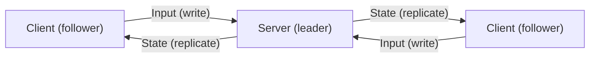

- Writes go to leader (client inputs → server)
- Leader produces new state
- Leader replicates to followers (server → clients)
- Followers are read-only replicas

**Failure mode**: leader dies → system stops (server crash = game ends).

---

## Multi-Leader Consensus = P2P Rollback

Both peers run simulation, must agree on outcome:

- Same inputs (exchanged over network)
- Same deterministic simulation
- Same resulting state

If one peer has different inputs (lost packet) → temporary disagreement → **rollback resolves**.

This is **state machine replication**: same inputs → same state.

---

## Connection to Raft

The Raft consensus algorithm solves leader election + log replication:

| Raft Concept    | Game Networking Analog                    |
| --------------- | ----------------------------------------- |
| Leader election | Host migration (choosing new host)        |
| Log replication | Input/state distribution to followers     |
| Commit          | State confirmed by server, client applies |
| Term            | Session epoch (changes on host migration) |
| Heartbeat       | Keep-alive packets                        |

---

## Failure Detection: The Fundamental Uncertainty

You can **never** be 100% certain a remote node received your message.

Applies to every game networking interaction:

- Server sends state update — did client receive it?
- Client sends input — did server process it?
- Host seems disconnected — actually down, or temporary hiccup?

---

## Timeout-Based Detection

| Stage          | Typical Timeout | Action                               |
| -------------- | --------------- | ------------------------------------ |
| Suspected      | 3-5s            | Notify others, prepare for migration |
| Confirmed dead | 10-15s          | Remove from session, free slot       |

Balance:

- **Too short**: false positives → unnecessary disconnects
- **Too long**: slow detection → wasted slots, delayed backfill

---

## Heartbeats vs Data as Liveness

If the remote side is actively sending game data → **no separate heartbeat needed**. Data packets serve as liveness signals.

Heartbeats only needed when data flow may pause:

- Spectators
- Idle players
- Pre-match lobby

---

## CAP Theorem Applied to Games

In the presence of a network **Partition**, choose between **Consistency** and **Availability**.

- **Consistency** = all players see the same game state
- **Availability** = all players can continue playing without waiting
- **Partition** = latency, packet loss, disconnection

---

## CAP Tradeoffs by Authority Model

| Model                    | CAP Choice                      | During Partition                       |
| ------------------------ | ------------------------------- | -------------------------------------- |
| Pure server authority    | Consistency over availability   | Client waits (input delay)             |
| Server auth + prediction | Consistency + optimistic avail. | Client speculates, corrects later      |
| Pure client authority    | Availability over consistency   | Clients diverge, no correction         |
| P2P lockstep             | Consistency (blocks)            | Game pauses until all inputs arrive    |
| P2P rollback             | Consistency + optimistic avail. | Peers speculate, roll back on conflict |

**Prediction and rollback**: techniques for achieving **both** consistency and availability — with the caveat that availability is optimistic (may need correction).

---

## Eventual Consistency in Games

Client prediction is **eventual consistency**:

- Client state temporarily different from server's
- Will converge when authoritative update arrives
- Convergence mechanism: rollback, smooth correction, or snap correction

Same as eventual consistency in distributed databases — replicas lag behind leader but converge.

---

## Replication Strategies in Games

| Strategy            | How It Works                          | Bandwidth | Consistency          |
| ------------------- | ------------------------------------- | --------- | -------------------- |
| Full snapshot       | Entire game state every tick          | Very high | Strong               |
| Delta compression   | Only changes since last ACK'd state   | Low       | Strong               |
| Interest management | Only entities relevant to each client | Low       | Eventual             |
| Event-based         | Send events, client computes state    | Very low  | Requires determinism |

Same tradeoffs as distributed database replication — consistency vs bandwidth.

---

## Coordination Avoidance

Jeff Hodges' insight: **coordination is expensive. Avoid it when possible.**

In games, coordination = waiting for agreement before proceeding:

| Approach              | Coordination Level | Latency Impact                  |
| --------------------- | ------------------ | ------------------------------- |
| Lockstep              | Maximum            | Wait for all peers every tick   |
| Server auth + predict | Reduced            | Client proceeds without waiting |
| Interest management   | Avoided            | Unrelated entities skip sync    |

---

## Practical Coordination Avoidance

- **Partition the world**: entities in different zones don't need mutual consistency
- **Defer non-critical updates**: cosmetic state (particles, weather) can be inconsistent — nobody cares
- **Batch confirmations**: confirm groups via ACK bitfields (Week 12), not individual inputs

---

## CSI ↔ GPR: Distributed Systems

| Context | Perspective                                                                |
| ------- | -------------------------------------------------------------------------- |
| CSI     | Linearizability, causal ordering, liveness, safety, FLP impossibility      |
| GPR     | Consensus invisible, failure fast, replication real-time, graceful degrade |

---

## Part 8: Architecture Decision Patterns

---

## Tying It All Together

The core question: **given your game's requirements, which architecture produces the best player experience at acceptable cost and complexity?**

---

## The Decision Space

| Decision            | Options                                              |
| ------------------- | ---------------------------------------------------- |
| Authority model     | Server, client, distributed                          |
| Server type         | Dedicated, listen, pure P2P, hybrid                  |
| State sync          | Snapshots, delta, events, lockstep, rollback         |
| Session model       | Match-based, persistent, drop-in/drop-out            |
| Matchmaking         | Skill-based, quick-play, server browser, invite-only |
| Scaling             | Fixed fleet, auto-scaled, player-hosted, serverless  |
| Tick rate           | 10-128 Hz depending on genre                         |
| Players per session | 2, 4-10, 16-64, 100+, thousands                      |

These decisions are **not independent**. Each constrains others.

---

## Genre: Fighting Games (2 players)

| Decision      | Choice                   | Why                                   |
| ------------- | ------------------------ | ------------------------------------- |
| Authority     | Distributed (both equal) | No server = no server latency         |
| Server type   | Pure P2P                 | Only 2 players, minimize hops         |
| Sync strategy | Rollback                 | Frame-perfect responsiveness required |
| Session model | Match-based (60-180s)    | Short matches                         |
| Matchmaking   | Skill-based (ranked)     | 1v1 = precise skill matching matters  |
| Scaling       | No game servers needed   | P2P; only matchmaker scales           |
| Tick rate     | 60 Hz (frame-locked)     | Run at display refresh                |

**Critical tradeoff**: P2P rollback = zero input latency but requires determinism, limits to 2-4 players.

---

## Genre: Competitive FPS (5v5 to 6v6)

| Decision      | Choice                    | Why                                     |
| ------------- | ------------------------- | --------------------------------------- |
| Authority     | Server authoritative      | Anti-cheat, consistent hit registration |
| Server type   | Dedicated server          | No host advantage, stable performance   |
| Sync strategy | Server-reconciled predict | Instant feedback for shooting           |
| Session model | Match-based (competitive) | Structured rounds, clear outcomes       |
| Matchmaking   | Skill-based with ranking  | Competitive integrity paramount         |
| Scaling       | Auto-scaled fleet         | Global player base, regional servers    |
| Tick rate     | 64-128 Hz                 | High precision for hit detection        |

**Critical tradeoff**: dedicated servers cost money but provide fair, cheat-resistant gameplay.

---

## Genre: Battle Royale (60-100 players)

| Decision      | Choice                      | Why                                  |
| ------------- | --------------------------- | ------------------------------------ |
| Authority     | Server authoritative        | Anti-cheat at scale, consistency     |
| Server type   | Dedicated server            | 100 players can't be P2P             |
| Sync strategy | Interest mgmt + delta       | Too many entities for full broadcast |
| Session model | Match-based, drop-in start  | Fixed lifecycle with elimination     |
| Matchmaking   | Quick-play ± SBMM           | Fill 100-player lobbies fast         |
| Scaling       | Pre-warmed, aggressive auto | Each match = full server             |
| Tick rate     | 20-30 Hz                    | Lower to handle entity count         |

**Critical tradeoff**: 100 players = aggressive interest management. Tick rate drops for bandwidth/CPU.

---

## Genre: MMO (thousands, persistent world)

| Decision      | Choice                         | Why                                 |
| ------------- | ------------------------------ | ----------------------------------- |
| Authority     | Server auth (sharded)          | Economy integrity, persistent state |
| Server type   | Dedicated cluster              | Multiple servers per world          |
| Sync strategy | Interest mgmt + zones          | Each server handles a world region  |
| Session model | Persistent (hours-long)        | Players connect and stay            |
| Matchmaking   | Server/world selection         | Players choose "realm"              |
| Scaling       | Sharding, instancing, layering | Overflow to new shard/layer         |
| Tick rate     | 10-20 Hz                       | Lower rate, higher player count     |

**Critical tradeoff**: sharding trades global consistency for scalability.

---

## Genre: Co-op PvE (4 players, casual)

| Decision      | Choice               | Why                                   |
| ------------- | -------------------- | ------------------------------------- |
| Authority     | Host authoritative   | Simple, cheap, no infrastructure      |
| Server type   | Listen server        | Small group, friends playing together |
| Sync strategy | State replication    | Host simulates, replicates to guests  |
| Session model | Invite, drop-in/out  | Friends join and leave freely         |
| Matchmaking   | Invite/lobby ± quick | Social group formation                |
| Scaling       | Player-hosted (free) | Players provide compute               |
| Tick rate     | 30-60 Hz             | Moderate precision                    |

**Critical tradeoff**: host advantage + host disconnect accepted because social dynamic reduces impact.

---

## Decision Flow: Step 1 — Player Count

| Players per Session | Viable Options                                   |
| ------------------- | ------------------------------------------------ |
| 2                   | P2P viable. Consider rollback for action.        |
| 2-8                 | Listen server viable. Dedicated if competitive.  |
| 8-64                | Dedicated strongly preferred. Interest mgmt >20. |
| 64+                 | Dedicated required. Aggressive interest mgmt.    |

---

## Decision Flow: Step 2 — Competitive or Cooperative?

| Mode        | Implications                                                                                        |
| ----------- | --------------------------------------------------------------------------------------------------- |
| Competitive | Cheating matters → server auth. Fairness → dedicated + SBMM. Integrity → higher tick rate.          |
| Cooperative | Cheating less critical → host auth OK. Social matters → invite/lobby. Cost matters → player-hosted. |
| Mixed       | Competitive modes → dedicated. Co-op modes → listen. Many games support both.                       |

---

## Decision Flow: Step 3 — Latency Sensitivity

| Core Mechanic     | Requirement                                                |
| ----------------- | ---------------------------------------------------------- |
| Frame-precise     | Rollback or lockstep. No server in input path.             |
| Twitch-precise    | Server auth + prediction + lag compensation.               |
| Turn-based / slow | Server auth without prediction is fine. Higher latency OK. |

---

## Decision Flow: Step 4 — Budget and Scale

| Scale                    | Approach                                                |
| ------------------------ | ------------------------------------------------------- |
| Indie, small player base | Listen servers, P2P, minimal dedicated fleet            |
| Mid-tier, growing        | Managed services (PlayFab, GameLift), auto-scaling      |
| AAA, global              | Custom infra, Agones on K8s, multi-region, full observ. |

---

## Common Mistake 1: Over-Engineering for Scale

Building Kubernetes-orchestrated, multi-region, auto-scaling fleet for 200 concurrent players.

Operational cost of infrastructure **exceeds** cost of running 10 fixed servers.

**Fix**: start simple, scale when needed.

---

## Common Mistake 2: Wrong Authority for Genre

Server authority with no prediction for fast-paced action → 100ms+ input delay.

Client authority for competitive → trivial cheating.

**Fix**: match authority to genre (see decision flow steps).

---

## Common Mistake 3: No Host Migration

Listen servers without host migration. Host disconnects → entire session lost.

**Fix**: implement migration, or use dedicated servers if session continuity matters.

---

## Common Mistake 4: Matchmaking Without Population Awareness

Strict SBMM with small population → 10+ minute waits → players leave → smaller pool → **death spiral**.

**Fix**: adaptive expansion, population-aware matching, cross-mode pooling.

---

## Common Mistake 5: Not Planning for Launch Day

10x expected players show up. Fixed fleet overwhelmed. First impressions ruined.

**Fix**: pre-provision burst capacity, aggressive auto-scale, load test before launch.

---

## Cost Estimation: Dedicated Servers

$$C_{\text{monthly}} = N_{\text{peak}} \times C_{\text{instance}} \times H_{\text{hours}} \times \frac{1}{F_{\text{util}}}$$

Where:

- $N_{\text{peak}}$ = peak concurrent match count
- $C_{\text{instance}}$ = cost per server-hour
- $H_{\text{hours}}$ = hours/month service operates
- $F_{\text{util}}$ = utilization factor (typically 0.3-0.7)

---

## Worked Example: Cost Estimation

1,000 peak concurrent matches, $0.05/server-hour, 730 hours/month, 50% utilization:

$$C = 1000 \times 0.05 \times 730 \times \frac{1}{0.5} = \$73{,}000/\text{month}$$

Compare to listen server: **$0 compute cost**. Only matchmaking + relay infrastructure.

---

## Listen Server Cost Model

Player-hosted compute is free. Infrastructure cost:

| Service                   | Role                                     | Cost Driver      |
| ------------------------- | ---------------------------------------- | ---------------- |
| Matchmaking/lobby service | Handles connections (1000x per instance) | Low              |
| STUN/TURN relay           | NAT traversal for unreachable hosts      | Bandwidth (TURN) |
| Authentication            | Token validation                         | Low              |

TURN bandwidth is the main cost. Most connections succeed with STUN (free).

---

## CSI vs GPR Summary Table

| Topic               | CSI Framing                                         | GPR Framing                                    |
| ------------------- | --------------------------------------------------- | ---------------------------------------------- |
| Authority models    | Consistency model (single/multi-leader)             | Who controls the feel? (responsive vs correct) |
| Dedicated vs listen | Infrastructure architecture (managed vs unmanaged)  | Host advantage, fairness, session stability    |
| Rollback            | Optimistic replication with conflict resolution     | Invisible latency hiding for action games      |
| Session management  | Distributed resource lifecycle (states/transitions) | Player journey (find, join, stay in games)     |
| Matchmaking         | Constraint optimization, queue theory               | Fairness perception, flow state, retention     |
| Scaling             | Fleet management, auto-scaling, capacity planning   | "Can I play?" (availability at peak/launch)    |
| Distributed systems | CAP theorem, consensus, replication theory          | Why the game "just works" (or doesn't)         |

---

## The Unifying Insight

CSI and GPR are **not opposing** — they are complementary perspectives on the same problems:

- **CSI provides theory**: why architectures fail, fundamental limits, formal tradeoff analysis
- **GPR provides requirements**: what the player needs to feel, what "good enough" looks like

A well-architected game network: use CSI to understand what is possible, GPR to decide what matters.

---

## The Decision Framework

1. **Define in CSI terms**: measurable constraint or failure mode?
2. **Define in GPR terms**: what does the player experience?
3. **Find overlap**: where both agree → implement that
4. **Resolve conflicts**:
   - Infrastructure/protocol → CSI wins
   - Player-facing quality → GPR wins
   - Budget allocation → GPR sets priorities, CSI enforces constraints

---

## Code: Architecture Config Resolver (C++)

```cpp
enum class AuthorityModel { ServerAuth, ClientAuth, Distributed, P2PRollback };
enum class ServerType { Dedicated, Listen, PureP2P, Hybrid };

struct ArchConfig {
    AuthorityModel authority;
    ServerType serverType;
    int tickRateHz;
    int maxPlayersPerSession;
    bool requiresDeterminism;
};

ArchConfig resolveForGenre(Genre genre) {
    switch (genre) {
        case Genre::FightingGame:
            return {AuthorityModel::P2PRollback, ServerType::PureP2P,
                    60, 2, true};
        case Genre::CompetitiveFPS:
            return {AuthorityModel::ServerAuth, ServerType::Dedicated,
                    128, 10, false};
        case Genre::BattleRoyale:
            return {AuthorityModel::ServerAuth, ServerType::Dedicated,
                    20, 100, false};
        case Genre::MMO:
            return {AuthorityModel::ServerAuth, ServerType::Dedicated,
                    15, 5000, false};
        case Genre::CoopPvE:
            return {AuthorityModel::ServerAuth, ServerType::Listen,
                    30, 4, false};
        default:
            return {AuthorityModel::ServerAuth, ServerType::Dedicated,
                    30, 16, false};
    }
}
```

---

## Code: Architecture Config Resolver (C#)

```csharp
public enum AuthorityModel { ServerAuth, ClientAuth, Distributed, P2PRollback }
public enum ServerType { Dedicated, Listen, PureP2P, Hybrid }

public record ArchConfig(
    AuthorityModel Authority,
    ServerType Server,
    int TickRateHz,
    int MaxPlayers,
    bool RequiresDeterminism);

public static class ArchResolver
{
    public static ArchConfig ResolveForGenre(Genre genre) => genre switch
    {
        Genre.FightingGame => new(AuthorityModel.P2PRollback,
            ServerType.PureP2P, 60, 2, true),
        Genre.CompetitiveFPS => new(AuthorityModel.ServerAuth,
            ServerType.Dedicated, 128, 10, false),
        Genre.BattleRoyale => new(AuthorityModel.ServerAuth,
            ServerType.Dedicated, 20, 100, false),
        Genre.MMO => new(AuthorityModel.ServerAuth,
            ServerType.Dedicated, 15, 5000, false),
        Genre.CoopPvE => new(AuthorityModel.ServerAuth,
            ServerType.Listen, 30, 4, false),
        _ => new(AuthorityModel.ServerAuth,
            ServerType.Dedicated, 30, 16, false),
    };
}
```

---

## Code: Matchmaking Window Expander (C++)

```cpp
struct MatchCriteria {
    double skillRange;
    double maxLatencyMs;
    bool crossRegion;
};

class WindowExpander {
    double waitTimeSeconds = 0;

public:
    MatchCriteria getCriteria(double baseSkillRange, double dt) {
        waitTimeSeconds += dt;

        double expansion = 1.0 + (waitTimeSeconds / 30.0); // Expand every 30s
        expansion = std::min(expansion, 8.0);               // Cap at 8x

        return {
            .skillRange = baseSkillRange * expansion,
            .maxLatencyMs = 50.0 + waitTimeSeconds * 1.25,  // 50ms base, grows 1.25ms/s
            .crossRegion = waitTimeSeconds > 60.0            // Cross-region after 60s
        };
    }
};
```

---

## Code: Matchmaking Window Expander (C#)

```csharp
public record MatchCriteria(double SkillRange, double MaxLatencyMs, bool CrossRegion);

public class WindowExpander
{
    private double _waitTimeSeconds;

    public MatchCriteria GetCriteria(double baseSkillRange, double dt)
    {
        _waitTimeSeconds += dt;

        double expansion = Math.Min(1.0 + _waitTimeSeconds / 30.0, 8.0); // Expand, cap at 8x

        return new(
            SkillRange: baseSkillRange * expansion,
            MaxLatencyMs: 50.0 + _waitTimeSeconds * 1.25,  // Grows 1.25ms/s from 50ms base
            CrossRegion: _waitTimeSeconds > 60.0             // After 60s, go cross-region
        );
    }
}
```

---

## Code: Simple Elo Calculator (C++)

```cpp
struct EloResult {
    double newRatingA;
    double newRatingB;
};

EloResult computeElo(double ratingA, double ratingB, double scoreA, double K = 32.0) {
    double expectedA = 1.0 / (1.0 + std::pow(10.0, (ratingB - ratingA) / 400.0));
    double expectedB = 1.0 - expectedA;
    double scoreB = 1.0 - scoreA;

    return {
        ratingA + K * (scoreA - expectedA),  // Winner gains, loser loses
        ratingB + K * (scoreB - expectedB)
    };
}
```

---

## Code: Simple Elo Calculator (C#)

```csharp
public record EloResult(double NewRatingA, double NewRatingB);

public static class EloCalculator
{
    public static EloResult Compute(double ratingA, double ratingB,
        double scoreA, double k = 32.0)
    {
        double expectedA = 1.0 / (1.0 + Math.Pow(10.0, (ratingB - ratingA) / 400.0));
        double expectedB = 1.0 - expectedA;
        double scoreB = 1.0 - scoreA;

        return new(
            ratingA + k * (scoreA - expectedA),
            ratingB + k * (scoreB - expectedB));
    }
}
```

---

## Code: Host Migration State (C++)

```cpp
enum class MigrationPhase { None, Detecting, Electing, Transferring, Reconciling, Complete };

struct HostMigrationState {
    MigrationPhase phase = MigrationPhase::None;
    uint32_t oldHostId = 0;
    uint32_t newHostId = 0;
    double migrationStartTime = 0;
    double maxMigrationTimeMs = 5000; // 5 second timeout

    bool isTimedOut(double now) const {
        return phase != MigrationPhase::None &&
               phase != MigrationPhase::Complete &&
               (now - migrationStartTime) > maxMigrationTimeMs;
    }

    void beginMigration(uint32_t failedHost, double now) {
        oldHostId = failedHost;
        migrationStartTime = now;
        phase = MigrationPhase::Detecting;
    }

    void electHost(uint32_t elected) {
        newHostId = elected;
        phase = MigrationPhase::Electing;
    }
};
```

---

## Code: Host Migration State (C#)

```csharp
public enum MigrationPhase { None, Detecting, Electing, Transferring, Reconciling, Complete }

public class HostMigrationState
{
    public MigrationPhase Phase { get; private set; } = MigrationPhase.None;
    public uint OldHostId { get; private set; }
    public uint NewHostId { get; private set; }
    private double _startTime;
    private const double MaxMigrationMs = 5000; // 5 second timeout

    public bool IsTimedOut(double now) =>
        Phase is not MigrationPhase.None and not MigrationPhase.Complete &&
        (now - _startTime) > MaxMigrationMs;

    public void BeginMigration(uint failedHost, double now)
    {
        OldHostId = failedHost;
        _startTime = now;
        Phase = MigrationPhase.Detecting;
    }

    public void ElectHost(uint elected)
    {
        NewHostId = elected;
        Phase = MigrationPhase.Electing;
    }
}
```

---

## Code: Rollback State Manager (C++)

```cpp
struct RollbackManager {
    static constexpr int MaxWindow = 10; // Max rollback depth in frames
    std::array<GameState, MaxWindow> stateRing;
    std::array<InputFrame, MaxWindow> inputRing;
    int writeIndex = 0;
    int confirmedTick = 0;
    int currentTick = 0;

    void saveState(const GameState& state, const InputFrame& input) {
        int idx = currentTick % MaxWindow;
        stateRing[idx] = state;       // Save full state at this tick
        inputRing[idx] = input;       // Save input for replay
        currentTick++;
    }

    GameState rollbackAndReplay(int serverTick, const GameState& serverState) {
        confirmedTick = serverTick;
        GameState current = serverState; // Start from authoritative state

        for (int t = serverTick + 1; t <= currentTick; t++) {
            int idx = t % MaxWindow;
            current = simulate(current, inputRing[idx]); // Replay each input
        }
        return current; // Corrected present state
    }
};
```

---

## Code: Rollback State Manager (C#)

```csharp
public class RollbackManager
{
    private const int MaxWindow = 10;
    private readonly GameState[] _states = new GameState[MaxWindow];
    private readonly InputFrame[] _inputs = new InputFrame[MaxWindow];
    private int _confirmedTick;
    private int _currentTick;

    public void SaveState(GameState state, InputFrame input)
    {
        int idx = _currentTick % MaxWindow;
        _states[idx] = state;
        _inputs[idx] = input;
        _currentTick++;
    }

    public GameState RollbackAndReplay(int serverTick, GameState serverState)
    {
        _confirmedTick = serverTick;
        var current = serverState;

        for (int t = serverTick + 1; t <= _currentTick; t++)
        {
            int idx = t % MaxWindow;
            current = Simulate(current, _inputs[idx]);
        }
        return current;
    }
}
```

---

## Code: Fleet Scaler (C++)

```cpp
struct FleetMetrics {
    int activeMatches;
    int idleServers;
    int queueDepth;
    double avgAllocationLatencyMs;
};

struct ScaleDecision {
    int targetReplicas;
    bool urgent; // Scale immediately vs gradual
};

class FleetScaler {
    int minBuffer = 5;      // Minimum idle servers
    int maxBuffer = 50;
    int currentReplicas = 10;

public:
    ScaleDecision evaluate(const FleetMetrics& m) {
        int needed = m.activeMatches + std::max(minBuffer, m.queueDepth);
        needed = std::clamp(needed, currentReplicas - 5, currentReplicas + 20); // Max ±20 change

        bool urgent = m.idleServers == 0 || m.avgAllocationLatencyMs > 5000;
        currentReplicas = needed;
        return {needed, urgent};
    }
};
```

---

## Code: Fleet Scaler (C#)

```csharp
public record FleetMetrics(int ActiveMatches, int IdleServers,
    int QueueDepth, double AvgAllocationLatencyMs);
public record ScaleDecision(int TargetReplicas, bool Urgent);

public class FleetScaler
{
    private int _minBuffer = 5;
    private int _currentReplicas = 10;

    public ScaleDecision Evaluate(FleetMetrics m)
    {
        int needed = m.ActiveMatches + Math.Max(_minBuffer, m.QueueDepth);
        needed = Math.Clamp(needed, _currentReplicas - 5, _currentReplicas + 20);

        bool urgent = m.IdleServers == 0 || m.AvgAllocationLatencyMs > 5000;
        _currentReplicas = needed;
        return new(needed, urgent);
    }
}
```

---

## Summary

| Topic                  | Key Takeaway                                                                     |
| ---------------------- | -------------------------------------------------------------------------------- |
| Authority models       | Server auth = consistency; client auth = responsiveness; prediction bridges both |
| Dedicated vs listen    | Dedicated = fair, reliable, costly; listen = free, fragile, host advantage       |
| Rollback networking    | Rewind + replay hides authority latency; requires determinism                    |
| Session management     | Sessions are distributed resources with create/join/play/leave lifecycle         |
| Matchmaking            | Multi-objective optimization: skill × latency × queue time × party               |
| Scaling                | Stateful servers need lifecycle-aware orchestration                              |
| Distributed systems    | Every game concept maps to a distributed systems fundamental                     |
| Architecture decisions | Genre drives authority, server type, sync strategy, and scale approach           |
| CSI framing            | Formal properties: consistency, availability, consensus, replication             |
| GPR framing            | Player experience: responsiveness, fairness, stability, perceived quality        |
