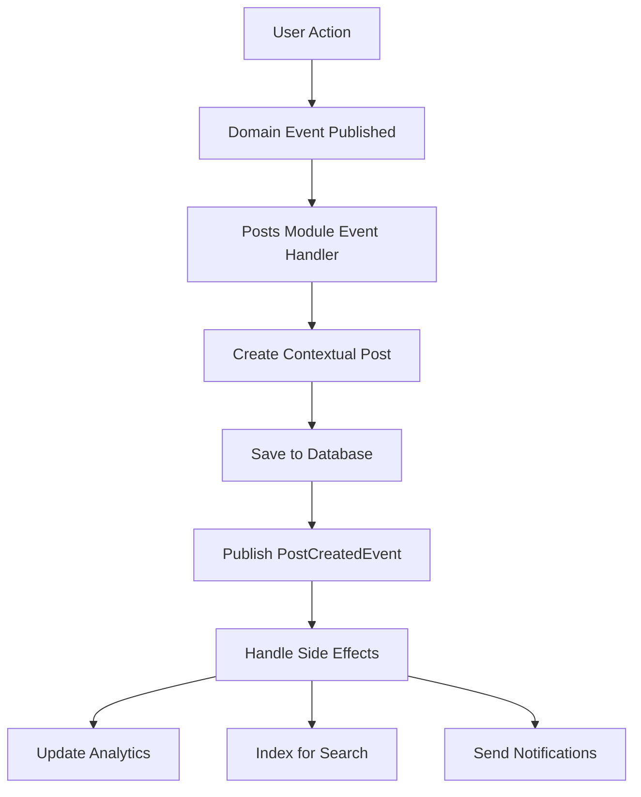

# Posts Module Implementation Summary

## What Was Fixed and Implemented

### 1. Module Registration
- ✅ Created `PostsModule.cs` with proper service registration
- ✅ Added Posts module to the main DI container in `DependencyInjection.cs`
- ✅ Updated `ServiceCollectionExtensions.cs` to register Posts services
- ✅ Added necessary using statements for Posts namespace

### 2. Domain Event Handlers Created

#### UserProfileDomainEventHandler
- Listens to `UserProfileCreatedEvent` → Creates welcome posts
- Listens to `UserProfileUpdatedEvent` → Creates activity posts for significant changes
- Handles errors gracefully without breaking the main operations

#### UserDomainEventHandler  
- Listens to `UserCreatedEvent` → Creates registration announcement posts
- Listens to `UserActivatedEvent` → Creates activation announcement posts
- Listens to `UserDeactivatedEvent` → Creates farewell posts

### 3. Enhanced Existing Event Handlers

#### PostCreatedEventHandler (Enhanced)
- Handles different post types with specific logic
- Updates user statistics and analytics
- Placeholder integrations for search indexing and real-time notifications
- Comprehensive side-effect management

#### PostLikedEventHandler (Enhanced)
- Notifies post owners (except self-likes)
- Updates user reputation systems
- Tracks engagement analytics  
- Checks for milestone achievements
- Updates trending calculations

#### PostDeletedEventHandler (Enhanced)
- Removes posts from search indexes
- Cleans up related data for hard deletes
- Updates deletion analytics
- Archives content for compliance
- Notifies moderators for system deletions

### 4. Business Services

#### PostAnnouncementService
- `CreateSystemAnnouncementAsync()` - Creates official announcements
- `CreateMilestoneCelebrationAsync()` - Creates celebration posts
- `CreateCommunityUpdateAsync()` - Creates community updates

### 5. API Enhancements

#### New Controller Endpoints
- `POST /api/posts/announcements` - Create system announcements (admin)
- `POST /api/posts/milestones` - Create milestone celebrations

#### New DTOs
- `CreateAnnouncementDto` - For system announcements
- `CreateMilestoneDto` - For milestone celebrations

### 6. Documentation
- ✅ Comprehensive documentation in `POSTS_MODULE_DOCUMENTATION.md`
- ✅ Usage examples and API documentation
- ✅ Architecture explanation and event flow diagrams

## How the System Now Works

### Automatic Post Creation Flow



### Example Flows

#### 1. New User Registration
```
UserService.CreateUser() 
→ UserCreatedEvent published
→ UserDomainEventHandler.Handle()
→ Creates "New member joined: John Doe" post
→ PostCreatedEvent published
→ Updates registration statistics
```

#### 2. Profile Update
```
UserProfileService.UpdateProfile()
→ UserProfileUpdatedEvent published  
→ UserProfileDomainEventHandler.Handle()
→ Creates "John updated their profile" post
→ Describes what was changed
```

#### 3. System Announcement
```
Admin calls POST /api/posts/announcements
→ PostAnnouncementService.CreateSystemAnnouncementAsync()
→ Creates pinned announcement post
→ PostCreatedEvent published
→ All users see the announcement
```

## Benefits Achieved

### 1. Event-Driven Architecture
- ✅ Modules are loosely coupled
- ✅ Posts module responds to events from other modules
- ✅ No direct dependencies between modules
- ✅ Easy to extend with new event types

### 2. Rich Social Features
- ✅ Automatic welcome posts for new users
- ✅ Activity posts for profile updates
- ✅ System announcements for important news
- ✅ Milestone celebrations for achievements

### 3. Comprehensive Error Handling
- ✅ Event handlers never break main operations
- ✅ Detailed error logging for debugging
- ✅ Graceful degradation on failures

### 4. Extensible Design
- ✅ Easy to add new event handlers
- ✅ Simple to add new post types
- ✅ Ready for future enhancements

## Testing the Implementation

### 1. Test Domain Event Flow
```csharp
// Create a user profile to trigger welcome post
var userProfile = new UserProfile { 
    UserId = userId, 
    DisplayName = "John Doe" 
};

// This should automatically create a welcome post
await userProfileService.CreateAsync(userProfile);

// Check that a post was created
var posts = await postService.GetPostsByUserIdAsync(userId);
Assert.Contains(posts, p => p.PostType == "user_signup");
```

### 2. Test System Announcements
```csharp
// Test the announcement API
var announcement = new CreateAnnouncementDto {
    Title = "New Feature Released",
    Description = "Check out our latest feature!"
};

var response = await client.PostAsync("/api/posts/announcements", announcement);
Assert.Equal(HttpStatusCode.Created, response.StatusCode);
```

### 3. Test Event Handler Logic
```csharp
// Test that profile updates create activity posts
var updateEvent = new UserProfileUpdatedEvent(
    userProfileId, userId, 
    new Dictionary<string, object> { ["DisplayName"] = "New Name" },
    DateTime.UtcNow, tenantId
);

await handler.Handle(updateEvent, CancellationToken.None);

// Verify activity post was created
var activityPosts = await context.Posts
    .Where(p => p.PostType == "profile_update")
    .ToListAsync();
    
Assert.NotEmpty(activityPosts);
```

## Next Steps for Further Enhancement

### 1. Real-time Notifications
- Integrate SignalR for live post updates
- Push notifications for mobile apps
- Email notifications for important announcements

### 2. Advanced Analytics
- Track user engagement metrics
- Generate insights reports
- A/B test different post formats

### 3. Content Moderation
- Automatic spam detection
- Inappropriate content filtering
- Admin moderation tools

### 4. Search Integration
- Full-text search with Elasticsearch
- Tag-based filtering
- Advanced search queries

### 5. Rich Content Support
- Image and video uploads
- Rich text formatting
- Embedded media support

## Summary

The Posts module is now a fully functional, event-driven system that:

- ✅ **Listens to domain events** from other modules
- ✅ **Automatically creates contextual posts** about user activities  
- ✅ **Provides business services** for manual post creation
- ✅ **Handles comprehensive side effects** for all post operations
- ✅ **Includes proper error handling** and logging
- ✅ **Follows clean architecture** principles
- ✅ **Is fully documented** with usage examples

The implementation demonstrates how to build a modern, scalable, event-driven system that creates a rich social experience while maintaining loose coupling between modules.
