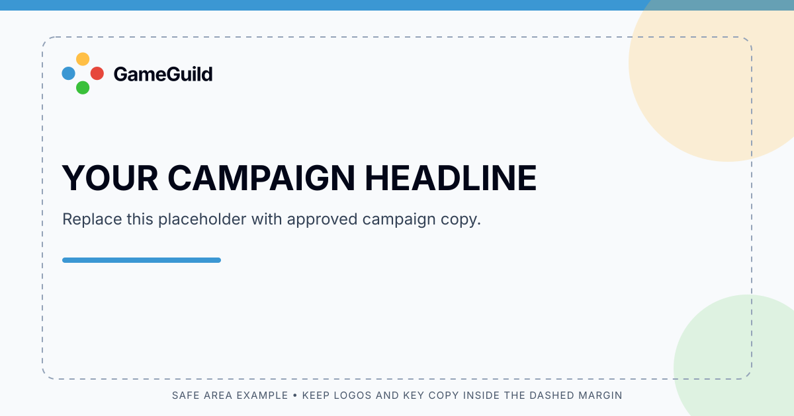
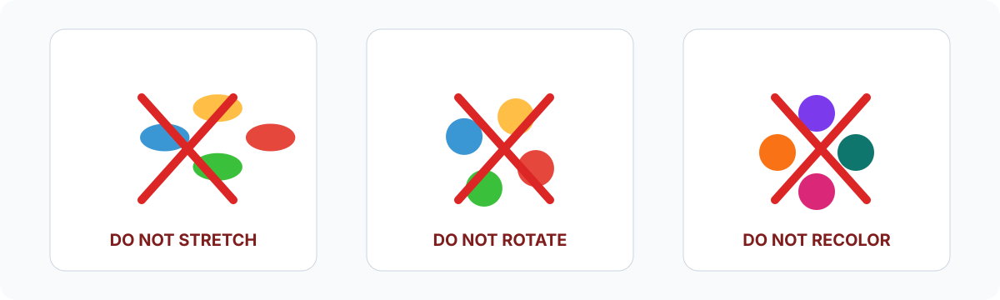

# GameGuild visual identity

**Version:** 1.0 (proposed from repository assets) | **Updated:** 2026-10-03

This guide turns the existing four-color GameGuild mark into a consistent, editable logo set for product and campaign material. The naming service and possible domain change mentioned in the original issue have no approved decision attached in the repository; these files retain **GameGuild** as the current header wordmark. The product also uses “Game Guild” in locale metadata and public copy, so the naming service still needs to settle the official spelling before a broad marketing rollout. Revisit the wordmark if that decision changes.

## Identity

Use the four-circle mark already present in `apps/web/public/assets/images/logo-icon.png` as the starting point. The vector source keeps its four positions and color order, removes raster shading, and adds primary, stacked, reversed, and monochrome lockups. “Friendly, energetic, and community-oriented” is a design interpretation of the existing multi-color mark and the product description, not an approved brand tagline. No tagline is defined here.

The supplied header lockup follows the current **GameGuild** spelling: one word, capital G in each part. In body copy, follow the spelling approved by the naming service; the repository currently also uses “Game Guild”. Do not add a domain suffix to either mark.

## Logo files

| File | Use |
| --- | --- |
| [`gameguild-mark.svg`](../../apps/web/public/assets/brand/gameguild-mark.svg) | Full-color symbol for avatars, compact placements, and favicons. |
| [`gameguild-logo-horizontal.svg`](../../apps/web/public/assets/brand/gameguild-logo-horizontal.svg) | Primary logo on light backgrounds. |
| [`gameguild-logo-stacked.svg`](../../apps/web/public/assets/brand/gameguild-logo-stacked.svg) | Square or centered placements. |
| [`gameguild-logo-reversed.svg`](../../apps/web/public/assets/brand/gameguild-logo-reversed.svg) | Full-color mark with a white wordmark on dark backgrounds. |
| [`gameguild-logo-monochrome.svg`](../../apps/web/public/assets/brand/gameguild-logo-monochrome.svg) | One-color logo for single-ink printing and constrained uses. |

Keep the four circles in this order: amber at top, blue at left, coral at right, green at bottom. Prefer the horizontal logo when there is room. Use the mark alone only where the GameGuild name is already visible or the placement is too small for the wordmark.

### Clear space and sizing

- Keep clear space around the visible logo equal to at least one circle radius (22 units in the 144-unit mark source).
- Keep the complete horizontal lockup at least 160 CSS pixels wide. Below that, use the mark alone at 24 pixels or larger.
- Do not crop the four-circle mark. Preserve the source aspect ratio and all four circles.
- The mark geometry is centered on a square 144-unit artboard. For campaign layouts, use an 8-pixel spacing scale (8, 16, 24, 32, 48, 64) and keep the logo and essential text inside the safe margin.

## Color palette

The four accent colors are sampled from the existing repository logo PNGs and normalized to flat vector fills. They are brand accents, not a replacement for the product's light/dark UI theme tokens.

| Name | Hex | Role |
| --- | --- | --- |
| Blue | `#3B97D3` | Left circle; links and cool accent areas. |
| Coral | `#E6473C` | Right circle; warm alert or emphasis accent. |
| Green | `#3AC03A` | Bottom circle; positive accent. |
| Amber | `#FFBF46` | Top circle; highlight accent. |
| Ink | `#020617` | Wordmark and text on light backgrounds. |
| White | `#FFFFFF` | Wordmark on dark backgrounds and reversed use. |

Use the four accent colors together in the logo. For backgrounds and larger areas, use one accent with white or ink. Do not use the bright accent colors for small body text; check text contrast against the actual background. The monochrome logo is the approved one-color alternative.

## Typography

- Use a system sans-serif stack: `system-ui, -apple-system, BlinkMacSystemFont, "Segoe UI", sans-serif`.
- Set campaign headlines in a bold weight (700); use regular or medium (400–500) for supporting copy.
- Keep the wordmark in title case and semibold (650 in the SVG source). Do not typeset “GameGuild” in all caps or add decorative effects.
- Do not claim Geist or another named typeface as a brand font until that font is explicitly loaded and approved by the product.

## Layout and usage

The social post example demonstrates logo placement and a safe area. Its campaign headline is a placeholder, not official copy.

Use the light logo on light backgrounds and the reversed logo on dark backgrounds. Keep enough contrast for the wordmark, give the logo visual breathing room, and align it to the same layout grid as the main copy. Use the monochrome file where color reproduction is unavailable.

### Do

- Use one of the supplied SVG lockups without changing its proportions or circle order.
- Keep the full-color logo on a clean light or dark field with enough contrast for the wordmark.
- Use the stacked lockup for square placements and the horizontal lockup for headers and wide banners.
- Keep sample campaign copy replaceable and get product copy approved separately.

### Do not

- Stretch, rotate, crop, outline, bevel, or add a drop shadow to the logo.
- Recolor or rearrange individual circles. Use the supplied monochrome logo for one-color work.
- Put the ink wordmark on a dark field or the white wordmark on a light field.
- Do not invent a tagline, product name, or domain treatment from this guide.

## Rollout note

The shared authentication logo and site favicon now use the repository-owned four-color mark. The older PNGs remain in place as historical source material. Campaign teams can use the supplied full-color, stacked, reversed, and monochrome SVGs directly; the naming or domain decision can replace the wordmark later without changing the mark geometry.
