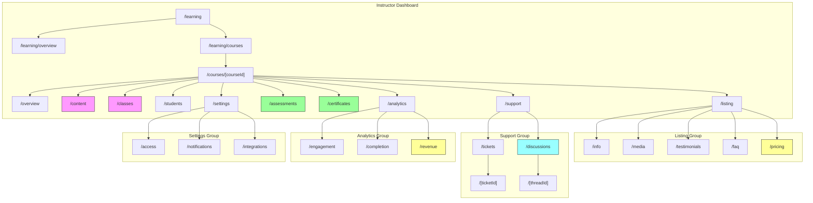
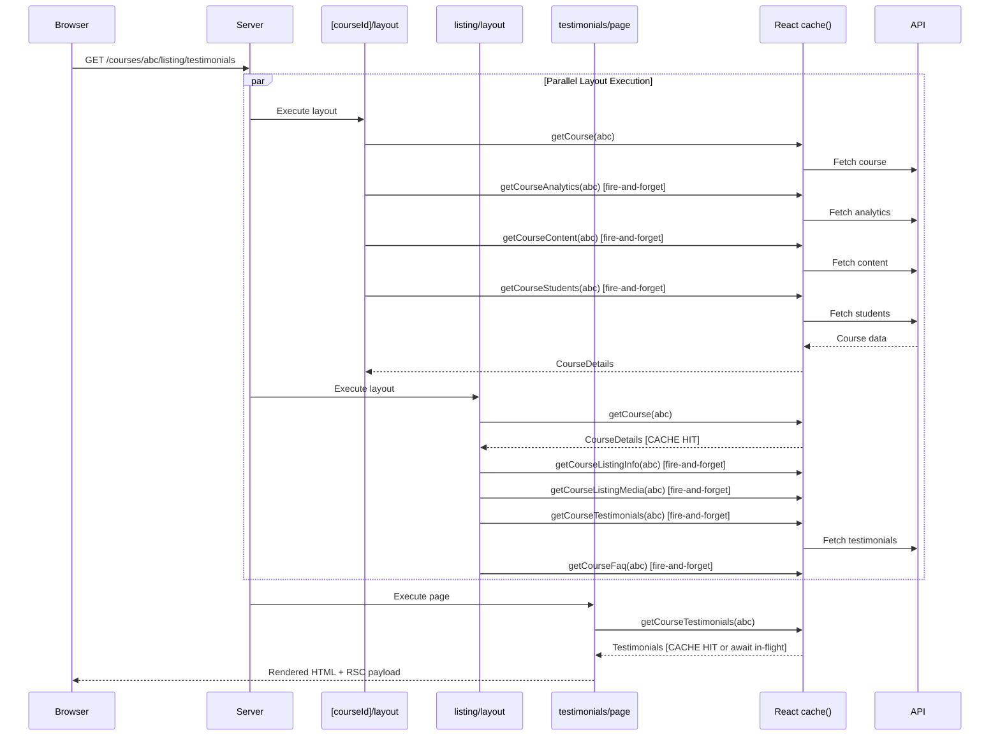
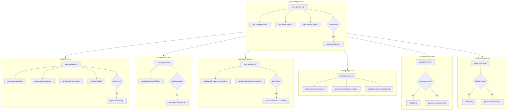

# Learning Management System - Route Architecture

This document describes the complete route architecture, data fetching patterns, and caching strategies for the Learning Management System (LMS) instructor dashboard.

## Table of Contents

1. [Overview](#overview)
2. [Architecture Principles](#architecture-principles)
3. [Route Structure](#route-structure)
4. [Data Flow Diagrams](#data-flow-diagrams)
5. [Prefetch Hierarchy](#prefetch-hierarchy)
6. [Course Types & Conditional Routes](#course-types--conditional-routes)
7. [Data Layer](#data-layer)
8. [Caching Strategy](#caching-strategy)
9. [Error Handling](#error-handling)

---

## Overview

The LMS instructor dashboard provides comprehensive course management capabilities. Built on Next.js 16+ App Router, it leverages:

- **Nested layouts** for hierarchical data prefetching
- **React `cache()`** for request deduplication
- **Parallel Data Preload Pattern** for optimal performance
- **Feature flags** for conditional route access based on course type

---

## Architecture Principles

### 1. Parallel Data Preload Pattern

Layouts fire all relevant fetches immediately (fire-and-forget), then await only what they need for UI. Child pages hit warm cache.

```typescript
// Layout fires all fetches
const coursePromise = getCourse(courseId);  // Will await
getCourseAnalytics(courseId);               // Fire-and-forget
getCourseContent(courseId);                 // Fire-and-forget

const course = await coursePromise;         // Await for nav UI

// Page later calls same function - instant cache hit
const analytics = await getCourseAnalytics(courseId);
```

### 2. Request Deduplication

All fetch functions are wrapped with React's `cache()`:

```typescript
export const getCourse = cache(async (courseId: string) => {
  // Even if called 10 times in one request, only 1 network call
});
```

### 3. Conditional Route Access

Routes are gated by `course.features` flags. Invalid access returns `forbidden()` (403).

### 4. Nested Layout Prefetching

Each layout prefetches data for its child routes. Layouts execute in parallel during SSR.

---

## Route Structure

```
/[locale]/dashboard/learning/
├── page.tsx                          # Redirect → /overview
├── overview/
│   └── page.tsx                      # Instructor dashboard
├── courses/
│   ├── page.tsx                      # Course list
│   └── [courseId]/
│       ├── layout.tsx                # L1: Core prefetch
│       ├── page.tsx                  # Redirect → /overview
│       ├── overview/
│       │   └── page.tsx              # Course dashboard
│       ├── content/                  # Condition: hasOnDemandContent
│       │   ├── page.tsx              # Content sequence editor
│       │   └── [contentId]/
│       │       └── page.tsx          # Content item editor
│       ├── classes/                  # Condition: hasClasses
│       │   ├── page.tsx              # Schedule/calendar
│       │   └── [classId]/
│       │       └── page.tsx          # Class detail
│       ├── students/
│       │   └── page.tsx              # Enrolled students
│       ├── listing/
│       │   ├── layout.tsx            # L2: Listing prefetch
│       │   ├── page.tsx              # Redirect → /info
│       │   ├── info/
│       │   │   └── page.tsx          # Course info editor
│       │   ├── media/
│       │   │   └── page.tsx          # Cover, video, gallery
│       │   ├── testimonials/
│       │   │   └── page.tsx          # Reviews management
│       │   ├── faq/
│       │   │   └── page.tsx          # FAQ editor
│       │   └── pricing/              # Condition: hasPricing
│       │       └── page.tsx          # Pricing tiers
│       ├── assessments/              # Condition: hasAssessments
│       │   ├── layout.tsx            # L2: Guard + prefetch
│       │   ├── page.tsx              # Assessment list
│       │   └── [assessmentId]/
│       │       └── page.tsx          # Assessment editor
│       ├── certificates/             # Condition: hasCertificate
│       │   ├── layout.tsx            # L2: Guard + prefetch
│       │   ├── page.tsx              # Template list
│       │   └── [templateId]/
│       │       └── page.tsx          # Template editor
│       ├── support/
│       │   ├── layout.tsx            # L2: Support prefetch
│       │   ├── page.tsx              # Redirect → /tickets
│       │   ├── tickets/
│       │   │   ├── page.tsx          # Ticket list
│       │   │   └── [ticketId]/
│       │   │       └── page.tsx      # Ticket detail
│       │   └── discussions/          # Condition: hasDiscussions
│       │       ├── page.tsx          # Forum threads
│       │       └── [threadId]/
│       │           └── page.tsx      # Thread detail
│       ├── analytics/
│       │   ├── layout.tsx            # L2: Analytics prefetch
│       │   ├── page.tsx              # Redirect → /engagement
│       │   ├── engagement/
│       │   │   └── page.tsx          # Activity metrics
│       │   ├── completion/
│       │   │   └── page.tsx          # Completion funnel
│       │   └── revenue/              # Condition: hasPricing
│       │       └── page.tsx          # Revenue metrics
│       └── settings/
│           ├── layout.tsx            # L2: Settings prefetch
│           ├── page.tsx              # Redirect → /access
│           ├── access/
│           │   └── page.tsx          # Visibility, enrollment
│           ├── notifications/
│           │   └── page.tsx          # Email templates
│           └── integrations/
│               └── page.tsx          # Third-party connections
```

---

## Data Flow Diagrams

### Navigation Flow



**Legend:**
- 🟪 Pink: `hasClasses` / `hasOnDemandContent`
- 🟨 Yellow: `hasPricing`
- 🟩 Green: `hasAssessments` / `hasCertificate`
- 🟦 Cyan: `hasDiscussions`

### Request Lifecycle



### Prefetch Hierarchy



---

## Course Types & Conditional Routes

### Delivery Modes

| Mode | Description | `hasClasses` | `hasOnDemandContent` |
|------|-------------|:------------:|:--------------------:|
| `on-demand` | Self-paced, no live sessions | ❌ | ✅ |
| `live` | Scheduled virtual sessions | ✅ | ❌ |
| `presential` | In-person classes | ✅ | ❌ |
| `hybrid` | Mix of live + on-demand | ✅ | ✅ |

### Pricing Models

| Model | Description | `hasPricing` |
|-------|-------------|:------------:|
| `free` | No payment required | ❌ |
| `paid` | One-time purchase | ✅ |
| `subscription` | Access via subscription | ✅ |
| `freemium` | Free with paid upgrades | ✅ |

### Feature Flags → Route Access

| Feature Flag | Gated Routes | Guard Type |
|-------------|--------------|------------|
| `hasOnDemandContent` | `/content/**` | Soft (hide in nav) |
| `hasClasses` | `/classes/**` | `forbidden()` |
| `hasPricing` | `/listing/pricing`, `/analytics/revenue` | `forbidden()` |
| `hasAssessments` | `/assessments/**` | `forbidden()` (layout) |
| `hasCertificate` | `/certificates/**` | `forbidden()` (layout) |
| `hasDiscussions` | `/support/discussions/**` | `forbidden()` |

### Route Availability Matrix

```
Route                    on-demand  live  presential  hybrid
─────────────────────────────────────────────────────────────
/overview                   ✅       ✅       ✅        ✅
/content                    ✅       ⚪       ⚪        ✅
/classes                    ❌       ✅       ✅        ✅
/students                   ✅       ✅       ✅        ✅
/listing/*                  ✅       ✅       ✅        ✅
/listing/pricing            💰       💰       💰        💰
/assessments                ⚙️       ⚙️       ⚙️        ⚙️
/certificates               ⚙️       ⚙️       ⚙️        ⚙️
/support/tickets            ✅       ✅       ✅        ✅
/support/discussions        ⚙️       ⚙️       ⚙️        ⚙️
/analytics/*                ✅       ✅       ✅        ✅
/analytics/revenue          💰       💰       💰        💰
/settings/*                 ✅       ✅       ✅        ✅

Legend: ✅ Always | ❌ Never | ⚪ Optional | 💰 hasPricing | ⚙️ Configurable
```

---

## Data Layer

### Query Files

| File | Domain | Functions |
|------|--------|-----------|
| `instructor.ts` | Dashboard | `getInstructorStats()`, `getRecentActivity()` |
| `courses.ts` | Course List | `getCourses()` |
| `course.ts` | Course Core | `getCourse()`, `getCourseAnalytics()`, `getCourseContent()`, `getContentItem()`, `getCourseStudents()`, `getCourseClasses()`, `getCourseClass()` |
| `listing.ts` | Store Config | `getCourseListingInfo()`, `getCourseListingMedia()`, `getCourseTestimonials()`, `getCourseFaq()`, `getCoursePricing()` |
| `support.ts` | Support | `getCourseSupportTickets()`, `getSupportTicket()`, `getCourseDiscussions()`, `getDiscussionThread()` |
| `analytics.ts` | Analytics | `getCourseEngagementAnalytics()`, `getCourseCompletionAnalytics()`, `getCourseRevenueAnalytics()` |
| `settings.ts` | Settings | `getCourseAccessSettings()`, `getCourseNotificationSettings()`, `getCourseIntegrationSettings()` |
| `assessments.ts` | Assessments | `getCourseAssessments()`, `getAssessment()`, `getCourseCertificates()`, `getCertificateTemplate()` |

### Key Types

```typescript
// Course configuration
type CourseDeliveryMode = 'on-demand' | 'live' | 'presential' | 'hybrid';
type CoursePricingModel = 'free' | 'paid' | 'subscription' | 'freemium';

interface CourseFeatures {
  hasClasses: boolean;
  hasRecordings: boolean;
  hasSchedule: boolean;
  hasOnDemandContent: boolean;
  hasPricing: boolean;
  hasCertificate: boolean;
  hasAssessments: boolean;
  hasDiscussions: boolean;
}

// Flexible content hierarchy
type ContentItemType = 'module' | 'chapter' | 'section' | 'lesson' | 
                       'video' | 'article' | 'quiz' | 'assessment' | 
                       'assignment' | 'resource' | 'discussion';

interface ContentItem {
  id: string;
  parentId: string | null;  // Enables any depth tree
  order: number;
  type: ContentItemType;
  title: string;
  // ...
}
```

---

## Caching Strategy

### Revalidation Tiers

| Tier | Revalidate | Use Case |
|------|-----------|----------|
| **Volatile** | 30-60s | Tickets, live class status |
| **Moderate** | 120s | Course details, content, analytics |
| **Stable** | 300s | Settings, listing info, certificates |

### Function → Cache Mapping

```typescript
// Volatile (30-60s)
getCourseSupportTickets()      // 30s
getCourseClasses()             // 60s
getCourseStudents()            // 60s

// Moderate (120s)
getCourse()
getCourseAnalytics()
getCourseContent()
getContentItem()
getCourseTestimonials()
getCoursePricing()
getCourseAssessments()

// Stable (300s)
getCourseListingInfo()
getCourseListingMedia()
getCourseFaq()
getCourseAccessSettings()
getCourseNotificationSettings()
getCourseIntegrationSettings()
getCourseCertificates()
getCourseEngagementAnalytics()  // Computed, expensive
getCourseCompletionAnalytics()
getCourseRevenueAnalytics()
```

---

## Error Handling

### Error Boundary Files

Each route segment can have:

| File | HTTP Status | Purpose |
|------|-------------|---------|
| `error.tsx` | 500 | Runtime errors, fetch failures |
| `loading.tsx` | - | Suspense fallback during streaming |
| `not-found.tsx` | 404 | Resource doesn't exist |
| `forbidden.tsx` | 403 | Feature not available for course type |
| `unauthorized.tsx` | 401 | User not authenticated |

### Error Pattern in Pages

```typescript
export default async function Page({ params }) {
  const { courseId } = await params;
  
  const course = await getCourse(courseId);
  if (!course) {
    notFound();  // → not-found.tsx (404)
  }
  
  if (!course.features.hasClasses) {
    forbidden(); // → forbidden.tsx (403)
  }
  
  // Continue with page...
}
```

### Error Pattern in Layouts (Guards)

```typescript
// assessments/layout.tsx
export default async function Layout({ children, params }) {
  const course = await getCourse(courseId);
  
  if (!course) notFound();
  if (!course.features.hasAssessments) forbidden();
  
  getCourseAssessments(courseId); // Preload for children
  
  return <>{children}</>;
}
```

---

## File Structure Summary

```
apps/web/src/
├── lib/learning/
│   ├── index.ts                    # Barrel export
│   └── queries/
│       ├── index.ts                # Queries barrel
│       ├── instructor.ts           # Dashboard data
│       ├── courses.ts              # Course list
│       ├── course.ts               # Core course data
│       ├── listing.ts              # Store listing data
│       ├── support.ts              # Tickets & discussions
│       ├── analytics.ts            # Detailed analytics
│       ├── settings.ts             # Configuration
│       └── assessments.ts          # Assessments & certs
│
└── app/[locale]/(dashboard)/dashboard/(learning)/
    ├── page.tsx                    # Redirect
    ├── overview/page.tsx           # Instructor dashboard
    ├── courses/
    │   ├── page.tsx                # Course list
    │   └── [courseId]/
    │       ├── layout.tsx          # L1: Core prefetch
    │       ├── page.tsx            # Redirect
    │       ├── error.tsx
    │       ├── loading.tsx
    │       ├── not-found.tsx
    │       ├── forbidden.tsx
    │       ├── unauthorized.tsx
    │       ├── overview/page.tsx
    │       ├── content/
    │       ├── classes/
    │       ├── students/
    │       ├── listing/            # L2 layout
    │       ├── assessments/        # L2 layout (guard)
    │       ├── certificates/       # L2 layout (guard)
    │       ├── support/            # L2 layout
    │       ├── analytics/          # L2 layout
    │       └── settings/           # L2 layout
```

---

## Next Steps

1. **Implement actual API calls** - Replace stub returns with real fetch logic
2. **Add mutations** - Create/update/delete operations with revalidation
3. **Build UI components** - Connect data to actual UI
4. **Add search params** - Pagination, filtering, date ranges
5. **Implement optimistic updates** - For better UX on mutations
