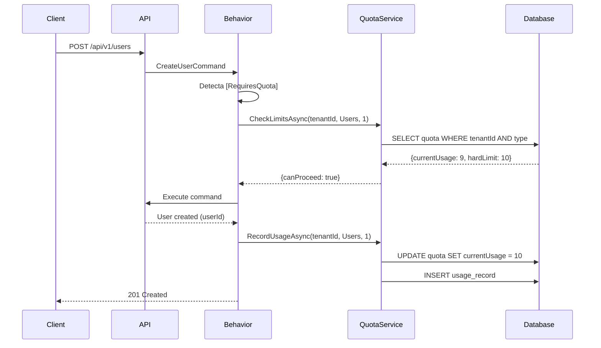

# Resource Quota System - Guia Completo

## 📖 Índice

- [Visão Geral](#visão-geral)
- [Arquitetura](#arquitetura)
- [Como Usar](#como-usar)
- [Configuração](#configuração)
- [Exemplos Práticos](#exemplos-práticos)
- [API Reference](#api-reference)
- [Troubleshooting](#troubleshooting)
- [Boas Práticas](#boas-práticas)

---

## 🎯 Visão Geral

O **Resource Quota System** é um sistema de gerenciamento e controle de recursos para tenants multi-tenant. Ele permite:

- **Limitar recursos** por tenant (usuários, projetos, storage, API calls)
- **Rastreamento automático** de uso de recursos
- **Validação em tempo de execução** usando pipeline behaviors
- **Alertas configuráveis** quando limites são aproximados
- **Reset automático** de quotas por período (diário, mensal, etc.)

### Recursos Suportados

```csharp
public enum ResourceUsageType {
    Users = 1,      // Número de usuários
    Projects = 2,   // Número de projetos
    Storage = 3,    // Armazenamento em bytes
    ApiCalls = 4    // Chamadas de API
}
```

---

## 🏗️ Arquitetura

### Componentes Principais

```
┌─────────────────────────────────────────────────────────────┐
│                        Command                               │
│              [RequiresQuota(Users, 1)]                      │
│              CreateUserCommand                               │
└─────────────────┬───────────────────────────────────────────┘
                  │
                  ▼
┌─────────────────────────────────────────────────────────────┐
│              ResourceQuotaBehavior                           │
│  1. Detecta atributo [RequiresQuota]                        │
│  2. Verifica tenant context                                  │
│  3. Consulta IResourceQuotaService                          │
│  4. Valida limites (soft/hard)                              │
│  5. Executa comando se permitido                             │
│  6. Registra uso após sucesso                                │
└─────────────────┬───────────────────────────────────────────┘
                  │
                  ▼
┌─────────────────────────────────────────────────────────────┐
│           IResourceQuotaService                              │
│  - CheckLimitsAsync()                                        │
│  - RecordUsageAsync()                                        │
│  - GetCurrentUsageAsync()                                    │
│  - TryConsumeResourceAsync()                                 │
└─────────────────┬───────────────────────────────────────────┘
                  │
                  ▼
┌─────────────────────────────────────────────────────────────┐
│              Database (PostgreSQL)                           │
│  - ResourceQuotas (configurações)                           │
│  - UsageRecords (histórico de uso)                          │
└─────────────────────────────────────────────────────────────┘
```

### Fluxo de Validação



---

## 🚀 Como Usar

### Passo 1: Marcar Comando com [RequiresQuota]

```csharp
using GameGuild.CQRS;
using GameGuild.Resources.Attributes;
using GameGuild.Resources.Models;

namespace GameGuild.Users.Commands;

/// <summary>
/// Command to create a new user
/// </summary>
[RequiresQuota(ResourceUsageType.Users, 1, Source = "CreateUser")]
public record CreateUserCommand(
    string Email, 
    string Name, 
    string? PhoneNumber = null
) : ICommand<UserDto>;
```

### Passo 2: Configurar Quota via API

```http
PUT /api/v1/tenants/550e8400-e29b-41d4-a716-446655440000/quotas/Users
Content-Type: application/json
Authorization: Bearer {token}

{
  "softLimit": 80,      // Aviso em 80%
  "hardLimit": 100,     // Bloqueio em 100
  "period": "Monthly",  // Reset mensal
  "isActive": true,
  "resetDayOfMonth": 1  // Reset no dia 1 de cada mês
}
```

### Passo 3: Testar o Comportamento

```csharp
// ✅ Sucesso - Dentro da quota
var command = new CreateUserCommand("user@example.com", "John Doe");
var result = await sender.Send(command); // 201 Created

// ❌ Erro - Quota excedida
// Se currentUsage >= hardLimit
var result = await sender.Send(command); 
// Lança QuotaExceededException
// Retorna 400/409 Bad Request
```

---

## ⚙️ Configuração

### Atributo [RequiresQuota] - Opções

```csharp
[RequiresQuota(
    resourceType: ResourceUsageType.Storage,  // OBRIGATÓRIO: Tipo de recurso
    amount: 1024,                             // OBRIGATÓRIO: Quantidade (padrão: 1)
    Source = "UploadFile",                    // Opcional: Identificador da fonte
    RecordUsage = true,                       // Opcional: Registrar uso (padrão: true)
    EnforceHardLimit = true                   // Opcional: Bloquear se exceder (padrão: true)
)]
public record UploadFileCommand(...) : ICommand<FileDto>;
```

### ResourceQuota - Estrutura

```csharp
public class ResourceQuota {
    public ResourceUsageType Type { get; set; }
    
    // Limites
    public long? SoftLimit { get; set; }      // Aviso
    public long? HardLimit { get; set; }      // Bloqueio
    public long CurrentUsage { get; set; }    // Uso atual
    
    // Período de reset
    public ResourceQuotaPeriod Period { get; set; }  // Daily, Weekly, Monthly, etc.
    public DateTime? LastReset { get; set; }
    public TimeSpan? ResetTime { get; set; }
    public int? ResetDayOfMonth { get; set; }
    
    // Notificações
    public bool NotificationsEnabled { get; set; }
    public string? NotificationThresholds { get; set; }  // "75,90,100"
    
    // Estado
    public bool IsActive { get; set; }
}
```

### Períodos de Reset

```csharp
public enum ResourceQuotaPeriod {
    Daily = 1,       // Reset diário
    Weekly = 2,      // Reset semanal
    Monthly = 3,     // Reset mensal
    Quarterly = 4,   // Reset trimestral
    Yearly = 5,      // Reset anual
    Unlimited = 6    // Sem reset automático
}
```

---

## 💡 Exemplos Práticos

### Exemplo 1: Limitar Usuários por Tenant

```csharp
// 1. Marcar comando
[RequiresQuota(ResourceUsageType.Users, 1, Source = "CreateUser")]
public record CreateUserCommand(...) : ICommand<UserDto>;

// 2. Configurar quota
PUT /api/v1/tenants/{tenantId}/quotas/Users
{
  "softLimit": 45,
  "hardLimit": 50,
  "period": "Monthly"
}

// 3. Criar usuários
// Usuários 1-44: ✅ Sucesso
// Usuário 45: ⚠️ Warning (soft limit), mas permite
// Usuário 46-50: ✅ Sucesso
// Usuário 51+: ❌ QuotaExceededException
```

### Exemplo 2: Limitar Storage por Tenant

```csharp
// 1. Marcar comando com tamanho dinâmico
[RequiresQuota(ResourceUsageType.Storage, Source = "UploadFile")]
public record UploadFileCommand(
    IFormFile File,
    string Path
) : ICommand<FileDto>;

// 2. Handler calcula o tamanho
public class UploadFileCommandHandler : ICommandHandler<UploadFileCommand, FileDto> {
    public async Task<FileDto> Handle(UploadFileCommand request, CancellationToken ct) {
        // ResourceQuotaBehavior já validou automaticamente!
        // O atributo usa amount = 1 por padrão
        // Para tamanhos dinâmicos, use TryConsumeResourceAsync no handler
        
        var fileSize = request.File.Length;
        
        // Validação manual adicional se necessário
        var canUpload = await _quotaService.CheckLimitsAsync(
            _tenantContext.TenantId.Value,
            ResourceUsageType.Storage,
            fileSize,
            ct
        );
        
        if (!canUpload.CanProceed) {
            throw new QuotaExceededException(...);
        }
        
        // Upload file...
        await _quotaService.RecordUsageAsync(
            _tenantContext.TenantId.Value,
            ResourceUsageType.Storage,
            fileSize,
            ct
        );
        
        return fileDto;
    }
}

// 3. Configurar quota (10GB)
PUT /api/v1/tenants/{tenantId}/quotas/Storage
{
  "softLimit": 9663676416,    // 9GB
  "hardLimit": 10737418240,   // 10GB
  "period": "Monthly"
}
```

### Exemplo 3: Rate Limiting de API Calls

```csharp
// 1. Marcar comando sem bloquear (apenas log)
[RequiresQuota(
    ResourceUsageType.ApiCalls, 
    1, 
    EnforceHardLimit = false,  // ⚠️ Não bloqueia, apenas alerta
    Source = "ExternalApiCall"
)]
public record CallExternalApiCommand(...) : ICommand<ApiResponse>;

// 2. Configurar quota
PUT /api/v1/tenants/{tenantId}/quotas/ApiCalls
{
  "softLimit": 9000,
  "hardLimit": 10000,
  "period": "Daily",
  "resetTime": "00:00:00"
}

// 3. Comportamento
// Calls 1-9000: ✅ Sucesso sem warnings
// Calls 9001-10000: ⚠️ Warning logged
// Calls 10001+: ⚠️ Warning logged (não bloqueia porque EnforceHardLimit = false)
```

### Exemplo 4: Verificação Manual em Handlers

```csharp
public class BulkCreateUsersCommandHandler : ICommandHandler<BulkCreateUsersCommand, List<UserDto>> {
    private readonly IResourceQuotaService _quotaService;
    private readonly ITenantContext _tenantContext;
    
    public async Task<List<UserDto>> Handle(BulkCreateUsersCommand request, CancellationToken ct) {
        var tenantId = _tenantContext.TenantId!.Value;
        var userCount = request.Users.Count;
        
        // Verificar se pode criar todos os usuários
        var limitCheck = await _quotaService.CheckLimitsAsync(
            tenantId,
            ResourceUsageType.Users,
            userCount,
            ct
        );
        
        if (!limitCheck.CanProceed) {
            throw new QuotaExceededException(
                $"Cannot create {userCount} users. " +
                $"Current: {limitCheck.CurrentUsage}, " +
                $"Limit: {limitCheck.HardLimit}, " +
                $"Available: {limitCheck.HardLimit - limitCheck.CurrentUsage}",
                ResourceUsageType.Users,
                limitCheck.CurrentUsage,
                limitCheck.HardLimit ?? 0,
                tenantId
            );
        }
        
        // Criar usuários...
        var createdUsers = new List<UserDto>();
        foreach (var userData in request.Users) {
            var user = await _userRepository.CreateAsync(userData, ct);
            createdUsers.Add(user.ToDto());
        }
        
        // Registrar uso em batch
        await _quotaService.RecordUsageAsync(
            tenantId,
            ResourceUsageType.Users,
            userCount,
            userId: null,
            source: "BulkCreateUsers",
            ct
        );
        
        return createdUsers;
    }
}
```

---

## 📚 API Reference

### QuotaController Endpoints

#### GET /api/v1/tenants/{tenantId}/quotas
Lista todas as quotas de um tenant
```http
GET /api/v1/tenants/550e8400-e29b-41d4-a716-446655440000/quotas
Authorization: Bearer {token}

Response 200:
[
  {
    "type": "Users",
    "softLimit": 45,
    "hardLimit": 50,
    "currentUsage": 23,
    "period": "Monthly",
    "isActive": true,
    "usagePercentage": 46.0
  },
  {
    "type": "Projects",
    "softLimit": 90,
    "hardLimit": 100,
    "currentUsage": 67,
    "period": "Monthly",
    "isActive": true,
    "usagePercentage": 67.0
  }
]
```

#### GET /api/v1/tenants/{tenantId}/quotas/{type}
Obtém quota específica
```http
GET /api/v1/tenants/550e8400-e29b-41d4-a716-446655440000/quotas/Users

Response 200:
{
  "type": "Users",
  "softLimit": 45,
  "hardLimit": 50,
  "currentUsage": 23,
  "period": "Monthly",
  "lastReset": "2025-11-01T00:00:00Z",
  "nextReset": "2025-12-01T00:00:00Z",
  "isActive": true,
  "notificationsEnabled": true,
  "notificationThresholds": "75,90,100"
}
```

#### PUT /api/v1/tenants/{tenantId}/quotas/{type}
Criar ou atualizar quota
```http
PUT /api/v1/tenants/550e8400-e29b-41d4-a716-446655440000/quotas/Users
Content-Type: application/json

{
  "softLimit": 80,
  "hardLimit": 100,
  "period": "Monthly",
  "isActive": true,
  "resetDayOfMonth": 1,
  "notificationsEnabled": true,
  "notificationThresholds": "75,90,100"
}

Response 204 No Content
```

#### POST /api/v1/tenants/{tenantId}/quotas/{type}/reset
Resetar quota manualmente
```http
POST /api/v1/tenants/550e8400-e29b-41d4-a716-446655440000/quotas/Users/reset

Response 204 No Content
```

#### POST /api/v1/tenants/{tenantId}/quotas/{type}/check
Verificar se pode consumir recurso
```http
POST /api/v1/tenants/550e8400-e29b-41d4-a716-446655440000/quotas/Users/check
Content-Type: application/json

{
  "amount": 5
}

Response 200:
{
  "type": "Users",
  "canProceed": true,
  "currentUsage": 23,
  "softLimit": 45,
  "hardLimit": 50,
  "remainingQuota": 27,
  "wouldExceedSoftLimit": false,
  "wouldExceedHardLimit": false
}
```

#### DELETE /api/v1/tenants/{tenantId}/quotas/{type}
Deletar quota
```http
DELETE /api/v1/tenants/550e8400-e29b-41d4-a716-446655440000/quotas/Users

Response 204 No Content
```

### IResourceQuotaService Methods

```csharp
public interface IResourceQuotaService {
    // Quota Management
    Task<ResourceQuota> SetQuotaAsync(Guid tenantId, ResourceUsageType type, 
        long? softLimit, long? hardLimit, ResourceQuotaPeriod period);
    Task<ResourceQuota?> GetQuotaAsync(Guid tenantId, ResourceUsageType type);
    Task<IEnumerable<ResourceQuota>> GetTenantQuotasAsync(Guid tenantId);
    Task<bool> DeleteQuotaAsync(Guid tenantId, ResourceUsageType type);
    
    // Usage Tracking
    Task<bool> RecordUsageAsync(Guid tenantId, ResourceUsageType type, 
        long amount = 1, Guid? userId = null, string? source = null);
    Task<long> GetCurrentUsageAsync(Guid tenantId, ResourceUsageType type);
    Task<IEnumerable<UsageRecord>> GetUsageHistoryAsync(Guid tenantId, 
        ResourceUsageType type, DateTime? fromDate = null, DateTime? toDate = null);
    
    // Limit Checking
    Task<ResourceLimitCheckResponse> CheckLimitsAsync(Guid tenantId, 
        ResourceUsageType type, long requestedAmount = 1);
    Task<ResourceLimitCheckResponse> TryConsumeResourceAsync(Guid tenantId, 
        ResourceUsageType type, long amount = 1, Guid? userId = null, string? source = null);
    
    // Analytics
    Task<ResourceUsageResponse> GetResourceUsageDetailsAsync(Guid tenantId, 
        ResourceUsageType type, int historyDays = 30);
    Task<IEnumerable<Guid>> GetTenantsExceedingLimitsAsync(
        ResourceUsageType? type = null, bool hardLimitOnly = false);
    
    // Maintenance
    Task<int> ResetExpiredQuotasAsync();
    Task<int> CleanupOldUsageRecordsAsync(DateTime olderThan);
    Task<bool> RecalculateUsageAsync(Guid tenantId, ResourceUsageType type);
}
```

---

## 🔧 Troubleshooting

### Problema: Quota não está sendo validada

**Sintomas:** Comandos são executados mesmo com quota excedida

**Soluções:**
1. Verificar se o atributo `[RequiresQuota]` está presente no comando
2. Verificar se o `ResourceQuotaBehavior` está registrado no DI
3. Verificar se existe um `TenantContext` válido na requisição
4. Verificar logs para ver se o behavior está sendo executado

```bash
# Verificar logs
grep "ResourceQuotaBehavior" /var/log/gameguild-api.log

# Verificar se behavior está registrado
dotnet list package | grep GameGuild.Resources
```

### Problema: QuotaExceededException mesmo com quota disponível

**Sintomas:** Erro de quota excedida quando ainda há espaço

**Soluções:**
1. Verificar se a quota foi configurada corretamente
```http
GET /api/v1/tenants/{tenantId}/quotas/{type}
```

2. Verificar se a quota precisa de reset
```csharp
// Resetar manualmente via API
POST /api/v1/tenants/{tenantId}/quotas/{type}/reset
```

3. Recalcular o uso atual
```csharp
await _quotaService.RecalculateUsageAsync(tenantId, ResourceUsageType.Users);
```

### Problema: Uso não está sendo registrado

**Sintomas:** `currentUsage` não aumenta após comandos

**Soluções:**
1. Verificar se `RecordUsage = true` no atributo
2. Verificar logs para erros no `RecordUsageAsync`
3. Verificar se o comando está falhando antes de registrar o uso

```csharp
// Debug logging
_logger.LogInformation(
    "Recording usage: Tenant={TenantId}, Type={Type}, Amount={Amount}",
    tenantId, resourceType, amount
);
```

### Problema: Performance degradado

**Sintomas:** Latência alta em comandos com quota

**Soluções:**
1. Adicionar índices no banco de dados
```sql
CREATE INDEX idx_resource_quotas_tenant_type 
ON resource_quotas (tenant_id, type);

CREATE INDEX idx_usage_records_tenant_type_date 
ON usage_records (tenant_id, type, recorded_at);
```

2. Habilitar cache para quotas
```csharp
// TODO: Implementar cache de quotas
services.AddMemoryCache();
services.AddDistributedCache();
```

3. Usar batch operations para múltiplos recursos
```csharp
var checks = await _quotaService.CheckMultipleLimitsAsync(
    tenantId,
    new Dictionary<ResourceUsageType, long> {
        { ResourceUsageType.Users, 5 },
        { ResourceUsageType.Storage, 1024 }
    }
);
```

---

## ✅ Boas Práticas

### 1. Sempre Configure Soft Limits

```csharp
// ✅ BOM: Soft limit em 80-90% do hard limit
{
  "softLimit": 45,   // 90% de 50
  "hardLimit": 50
}

// ❌ RUIM: Sem soft limit
{
  "softLimit": null,
  "hardLimit": 50
}
```

### 2. Use Source Descriptivo

```csharp
// ✅ BOM: Source descritivo
[RequiresQuota(ResourceUsageType.Users, 1, Source = "CreateUser")]
[RequiresQuota(ResourceUsageType.Users, 1, Source = "ImportFromCsv")]

// ❌ RUIM: Source genérico ou sem source
[RequiresQuota(ResourceUsageType.Users, 1)]
```

### 3. Configure Notificações

```csharp
// ✅ BOM: Notificações em múltiplos thresholds
{
  "notificationsEnabled": true,
  "notificationThresholds": "75,90,95,100"
}

// ❌ RUIM: Sem notificações
{
  "notificationsEnabled": false
}
```

### 4. Use EnforceHardLimit Apropriadamente

```csharp
// ✅ BOM: Enforce em operações críticas
[RequiresQuota(ResourceUsageType.Users, 1, EnforceHardLimit = true)]
public record CreateUserCommand(...);

// ✅ BOM: Não enforce em métricas/analytics
[RequiresQuota(ResourceUsageType.ApiCalls, 1, EnforceHardLimit = false)]
public record TrackAnalyticsCommand(...);
```

### 5. Monitore Tenants Próximos ao Limite

```csharp
// Job agendado para monitorar quotas
public class QuotaMonitoringJob : IScheduledJob {
    public async Task ExecuteAsync(CancellationToken ct) {
        var tenantsNearLimit = await _quotaService.GetTenantsExceedingLimitsAsync(
            type: null,
            hardLimitOnly: false  // Incluir soft limits
        );
        
        foreach (var tenantId in tenantsNearLimit) {
            // Enviar notificação ao tenant
            await _notificationService.NotifyQuotaWarningAsync(tenantId);
        }
    }
}
```

### 6. Implemente Retry Logic

```csharp
// ✅ BOM: Retry com backoff para falhas temporárias de quota
public async Task<UserDto> CreateUserWithRetryAsync(CreateUserCommand command) {
    var retries = 3;
    var delay = TimeSpan.FromSeconds(1);
    
    for (int i = 0; i < retries; i++) {
        try {
            return await _sender.Send(command);
        }
        catch (QuotaExceededException) when (i < retries - 1) {
            // Aguardar possível reset de quota
            await Task.Delay(delay);
            delay *= 2; // Exponential backoff
        }
    }
    
    throw new Exception("Failed to create user after retries");
}
```

### 7. Documente Limites

```csharp
/// <summary>
/// Creates a new user.
/// 
/// **Quota Requirements:**
/// - Resource: Users
/// - Amount: 1 user per request
/// - Enforcement: Hard limit enforced
/// - Typical limits: 50-1000 users per tenant (depends on plan)
/// </summary>
[RequiresQuota(ResourceUsageType.Users, 1)]
public record CreateUserCommand(...);
```

---

## 📊 Monitoramento e Métricas

### Queries Úteis

```sql
-- Top 10 tenants por uso de recurso
SELECT 
    tenant_id,
    type,
    current_usage,
    hard_limit,
    (current_usage::float / hard_limit * 100) as usage_percentage
FROM resource_quotas
WHERE hard_limit IS NOT NULL
ORDER BY usage_percentage DESC
LIMIT 10;

-- Tenants que excederam soft limit
SELECT 
    tenant_id,
    type,
    current_usage,
    soft_limit,
    hard_limit
FROM resource_quotas
WHERE soft_limit IS NOT NULL 
AND current_usage > soft_limit
AND is_active = true;

-- Histórico de uso por dia (últimos 30 dias)
SELECT 
    DATE(recorded_at) as date,
    type,
    SUM(usage_amount) as total_usage
FROM usage_records
WHERE tenant_id = '550e8400-e29b-41d4-a716-446655440000'
AND recorded_at >= NOW() - INTERVAL '30 days'
GROUP BY DATE(recorded_at), type
ORDER BY date DESC;
```

### Grafana Dashboard

```json
{
  "panels": [
    {
      "title": "Quota Usage by Tenant",
      "targets": [
        {
          "query": "SELECT tenant_id, type, current_usage, hard_limit FROM resource_quotas"
        }
      ]
    },
    {
      "title": "Quota Exceeded Events",
      "targets": [
        {
          "query": "SELECT COUNT(*) FROM logs WHERE message LIKE '%QuotaExceededException%'"
        }
      ]
    }
  ]
}
```

---

## 🔐 Segurança

### Validação de Permissões

```csharp
// Sempre validar que usuário tem permissão para modificar quotas
[Authorize(Policy = "ManageQuotas")]
[HttpPut("{tenantId}/quotas/{type}")]
public async Task<IActionResult> SetQuota(Guid tenantId, ResourceUsageType type, ...) {
    // Verificar se usuário pertence ao tenant
    if (_tenantContext.TenantId != tenantId) {
        return Forbid();
    }
    
    // Continuar...
}
```

### Prevenção de Bypass

```csharp
// ❌ RUIM: Permitir bypass de quota via flag
public record CreateUserCommand(string Email, bool BypassQuota) : ICommand<UserDto>;

// ✅ BOM: Quota sempre validada, exceto para admins do sistema
[RequiresQuota(ResourceUsageType.Users, 1)]
[Authorize(Policy = "CreateUser")]  // Policy verifica se é admin ou dentro de quota
public record CreateUserCommand(string Email) : ICommand<UserDto>;
```

---

## 🚀 Roadmap Futuro

### Features Planejadas

- [ ] Cache distribuído de quotas (Redis)
- [ ] Webhooks para eventos de quota
- [ ] Dashboard em tempo real de quotas
- [ ] Alertas por email/SMS
- [ ] Quotas dinâmicas baseadas em plano de subscription
- [ ] Burst allowance (permitir exceder temporariamente)
- [ ] Quotas por usuário individual (além de tenant)
- [ ] Rollover de quota não utilizada
- [ ] Compra de quota adicional via API

---

## 📞 Suporte

Para dúvidas ou problemas:

1. Consulte este guia
2. Verifique os logs da aplicação
3. Consulte a documentação da API (Swagger)
4. Abra uma issue no repositório

---

## 📝 Changelog

### v1.0.0 (2025-11-15)
- ✨ Implementação inicial do sistema de quotas
- ✨ Pipeline behavior automático com [RequiresQuota]
- ✨ API REST completa para gerenciamento
- ✨ Suporte a soft/hard limits
- ✨ Reset automático por período
- ✨ Tracking de uso histórico
- 📚 Documentação completa

---

**Desenvolvido com ❤️ pela equipe GameGuild**
