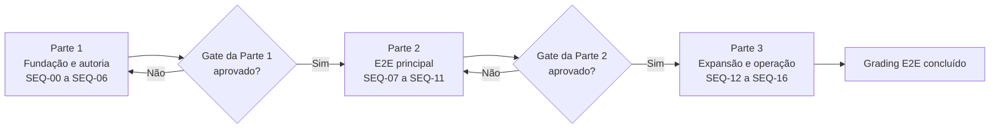

# 08. Sequência canônica de implementação

## Objetivo

Transformar as especificações temáticas deste diretório em três partes
executáveis, ordenadas pelas dependências reais entre domínio, contratos,
persistência, API, interfaces e efeitos acadêmicos.

Este documento é o índice e o contrato global de execução. Os documentos `00`
a `06` continuam sendo as especificações de cada área, e o documento `07`
concentra a estratégia transversal de testes. A numeração desses documentos
não representa a ordem em que seus conteúdos devem ser codificados.

## Partes executáveis

| Parte | Marcos | Entrega verificável | Documento |
| --- | --- | --- | --- |
| 1 | `SEQ-00` a `SEQ-06` | fundação, autoria, segurança e publicação fail-closed | [Fundação e autoria](./implementation-sequence/01-foundation-and-authoring.md) |
| 2 | `SEQ-07` a `SEQ-11` | test run e E2E oficial individual e coletivo | [E2E principal](./implementation-sequence/02-core-grading-e2e.md) |
| 3 | `SEQ-12` a `SEQ-16` | reviews adicionais, operação e auditoria final | [Expansão e operação](./implementation-sequence/03-review-expansion-and-operations.md) |

A Parte 2 não começa até a Parte 1 estar concluída e testada. A Parte 3 não
começa até a Parte 2 estar concluída e testada. Cada documento possui
pré-requisitos, definição de pronto, acompanhamento e gate de passagem
próprios.

## Ordem global



Dentro de cada parte, os marcos continuam estritamente sequenciais. Dividir o
plano não autoriza executar marcos em paralelo nem antecipar schema ou
capabilities de uma parte posterior.

## Como executar

1. Executar somente uma parte por vez.
2. Dentro da parte ativa, executar os marcos na ordem apresentada.
3. Não iniciar um marco antes de satisfazer o gate do marco anterior.
4. Abrir PRs menores dentro de um marco quando necessário, sem atravessar o
   gate do marco seguinte.
5. Atualizar primeiro contrato e testes, depois domínio API, persistência
   aprovada, endpoints, web e E2E da mesma fatia.
6. Encerrar a parte com sua suíte acumulada e uma revisão explícita das
   evidências antes de liberar a parte seguinte. Suíte acumulada significa os
   testes da parte atual mais todos os contratos, testes e E2Es aprovados nas
   partes anteriores.
7. Não introduzir compatibilidade legacy, aliases, dual-read, dual-write,
   backfill ou migração de dados.
8. Não criar migration incremental. A API possui um único
   `ApplicationDbContext`; portanto, o baseline EF é global e sua recriação é
   uma operação coordenada de toda a API. Depois do reset aprovado, esse mesmo
   baseline é editado diretamente a cada fatia de schema e os bancos
   descartáveis afetados são recriados.
9. Interromper a execução em todo `SCHEMA-GATE` para apresentar o impacto e
   obter aprovação explícita antes de editar entidades EF, configurações,
   baseline ou tabelas.
10. Não manter dois caminhos autoritativos após uma substituição. O caminho
    anterior é removido na mesma fatia em que seu substituto passa no E2E.
11. `SEQ-16` é auditoria final, não depósito para limpezas conhecidas que
    poderiam ter sido feitas nos marcos anteriores.
12. Depois de toda edição aprovada do baseline, recriar o banco do zero,
    executar o diff global de modelo e repetir a suíte acumulada. Um gate de
    schema não está concluído enquanto uma parte anterior regredir.
13. A revisão imutável fixa definição e versões executáveis; cada
    `GradingExecution` fixa separadamente a entrega concreta apresentada ao
    sujeito. A entrega possui `itemOrder` explícito e JSON canônico textual;
    resume ou retry nunca regeneram challenge.
14. A Parte 2 remove produtores diretos antigos e emite os eventos canônicos,
    mas mantém notificações externas e passback desligados. Esses consumers só
    entram em `SEQ-15`.
15. Regrade permanece na revisão, manifest, entrega e respostas originais da
    execução. Avaliar outra definição cria nova submission e nova execução, não
    uma rodada da execução anterior.
16. Projeção interna pode consumir resultado finalizado; toda projeção learner
    consome apenas resultado liberado e não pode expor agregados que permitam
    inferir contribuição retida.
17. Cada evento acadêmico possui confirmação durável por consumer obrigatório;
    uma falha não apaga receipts concluídos nem marca o fan-out inteiro como
    entregue.
18. O reset do baseline preserva todo artefato SQL ativo aprovado fora do
    `IModel`. Snapshot EF e diff de tabelas não substituem o inventário e os
    testes de funções, procedures, triggers, policies, grants, views, extensões
    e índices especiais.
19. `Assessment.DefinitionPayload` e seu setter genérico são removidos. Fonte
    mutável de policy só existe com contrato tipado, nome próprio, ownership
    exclusivo e aprovação no `SCHEMA-GATE`.
20. Release persiste somente `GradeRoundId` único; a submission é derivada pelo
    owner da `GradingExecution` e validada no comando.
21. Conclusão dependente de aprovação é `on-release-and-pass`; nenhum sinal
    learner-visible pode revelar `Passed` antes do release.
22. Unpublish remove somente o ponteiro ativo, bloqueia novos starts e preserva
    revisões e execuções já iniciadas.
23. Grupo e peso alteram somente a projeção auditada do gradebook. Assessment
    sem grupo tem resultado sem colocação; a mudança não cria grading novo.
24. Release agendado usa comandos idempotentes e o mesmo
    `ReleaseGradeResult`; worker nunca escreve `Released` diretamente.
25. `@game-guild/grading` permanece independente de tipos de assessment.
    Integrações específicas são packages de borda, começando por
    `@game-guild/grading-adapter-quiz`, com dependência simultânea das APIs
    públicas de grading e quiz e sem dependência reversa.
26. A mesma fronteira existe no servidor: o core expõe portas genéricas
    resolvidas pelo manifest, enquanto implementações C# de quiz ficam em um
    adapter registrado no composition root e nunca são importadas pelo core.
27. O gradebook usa uma única fórmula: selecionar a contribuição efetiva de cada
    assessment, somar score e `MaxScore` dentro do grupo, multiplicar a razão
    pelo peso do grupo e somar as contribuições dos grupos, sem renormalização
    implícita. Grupos positivos precisam totalizar `100%` antes de produzir
    resultado global oficial do curso.
28. Capability `OfficialSubmission` nova é exercitada primeiro numa composição
    controlada de E2E. Produção recebe somente as mesmas chaves, versões e
    implementações depois da aprovação desse gate.
29. Policy de release imediato persiste uma solicitação idempotente na mesma
    transação da finalização. Um worker chama `ReleaseGradeResult`; finalização e
    liberação continuam transições e eventos distintos.

## Política de schema pré-lançamento

O plano não congela antecipadamente tabelas de funcionalidades ainda não
implementadas. Ele também não autoriza mudanças estruturais silenciosas. Como
o contexto EF é compartilhado por todos os módulos, o primeiro gate inclui uma
auditoria global do modelo e do histórico atual; somente o delta de grading
aprovado pode mudar o modelo produzido.

Cada fatia que prevê impacto relacional começa por um `SCHEMA-GATE`:

```text
desenhar somente o necessário para a fatia
  -> apresentar tabelas, colunas, constraints, índices e remoções
    -> obter aprovação explícita
      -> editar o mesmo baseline global inicial
        -> recriar bancos descartáveis
          -> provar criação do zero e constraints
```

Isso permite aprender com as fatias verticais sem criar migrations
incrementais. Ao final, o repositório continua contendo apenas o baseline
global limpo que cria diretamente o schema final de toda a API. Cada
regeneração deve comparar o modelo completo e rejeitar drift fora do delta
aprovado.

O diff possui duas dimensões obrigatórias: `IModel`/snapshot EF e catálogo
PostgreSQL. Antes de apagar a cadeia atual, inventariar todo SQL ativo fora do
modelo, com arquivo de origem, owner, dependências, ordem de instalação e teste
funcional. O baseline limpo materializa diretamente o estado final aprovado;
não precisa manter as migrations históricas, mas não pode perder o comportamento
de banco que elas instalaram.

Para cada alteração proposta, o gate deve informar:

```text
nome proposto
owner do dado
motivo da persistência
operações de leitura e escrita
cardinalidade e lifecycle
constraints e índices
política de retenção
efeito de concorrência
alternativa rejeitada
artefatos SQL fora do IModel afetados e seus testes
```

## Matriz dos marcos

| Parte | Marco | Entrega principal | Depende de | Schema |
| --- | --- | --- | --- | --- |
| 1 | `SEQ-00` | ADRs e decisões fechadas | nenhuma | não |
| 1 | `SEQ-01` | contratos, adapter de quiz, workflows e autorização | `SEQ-00` | não |
| 1 | `SEQ-02` | schema do núcleo e reset global aprovados | `SEQ-01` | somente desenho |
| 1 | `SEQ-03` | baseline global, núcleo e entrega por execução | aprovação de `SEQ-02` | sim, global |
| 1 | `SEQ-04` | autoria transacional no servidor | `SEQ-03` | não previsto |
| 1 | `SEQ-05` | projeção segura, corte learner e capabilities | `SEQ-04` | não previsto |
| 1 | `SEQ-06` | revisão imutável, publish/unpublish preparados e UX autoral | `SEQ-05` | não previsto |
| 2 | `SEQ-07` | runtime e test run isolado com handler controlado | Parte 1 aprovada | não previsto |
| 2 | `SEQ-08` | `InstructorReview` no test run | `SEQ-07` | não previsto |
| 2 | `SEQ-09` | `AutomatedReview` no test run | `SEQ-08` | não previsto |
| 2 | `SEQ-10` | tentativa oficial, progresso, release e gradebook mínimos | `SEQ-09` | `SCHEMA-GATE` |
| 2 | `SEQ-11` | tentativa oficial coletiva | `SEQ-10` | `SCHEMA-GATE` |
| 3 | `SEQ-12` | `SelfReview` em teste e oficial | Parte 2 aprovada | `SCHEMA-GATE` |
| 3 | `SEQ-13` | `PeerReview` em teste e oficial | `SEQ-12` | `SCHEMA-GATE` |
| 3 | `SEQ-14` | porta durável de `AIReview` | `SEQ-13` | `SCHEMA-GATE` condicional |
| 3 | `SEQ-15` | release agendado, integração global e operação avançados | `SEQ-14` | `SCHEMA-GATE` condicional |
| 3 | `SEQ-16` | auditoria e fechamento | `SEQ-15` | não |

`Não previsto` significa que o marco deve usar o schema já aprovado. Se a
implementação demonstrar que falta uma coluna, constraint, índice ou entidade,
o marco para, abre um `SCHEMA-GATE` e somente continua após nova aprovação.

## Organização dos PRs

Um marco pode ser dividido em vários PRs, seguindo esta ordem interna:

```text
contrato e testes
  -> domínio puro
    -> aplicação e autorização
      -> SCHEMA-GATE, quando necessário
        -> persistência aprovada
          -> endpoints
            -> web
              -> integração e E2E
                -> remoção do caminho substituído
```

Cada PR deve declarar:

- parte, marco e subentrega atendidos;
- contrato alterado;
- efeito em schema: `nenhum` ou referência ao `SCHEMA-GATE` aprovado;
- invariantes e linhas da matriz de autorização cobertas;
- testes executados;
- caminho anterior removido na fatia;
- confirmação de que não existe segunda autoridade para o mesmo dado.

Não misturar no mesmo PR:

- alteração do baseline e redesign amplo de UI;
- novo review handler e reescrita do lifecycle;
- mudança de contrato sem atualizar produtores e consumidores;
- remoção antes do E2E substituto;
- manutenção do caminho anterior depois do E2E substituto;
- trabalho pertencente a partes diferentes.

## Condições de parada

A implementação deve parar e retornar ao planejamento quando:

1. surgir necessidade de tabela, coluna, índice ou constraint sem
   `SCHEMA-GATE` aprovado;
2. um mesmo dado passar a ter dois owners mutáveis;
3. a UI se tornar responsável exclusiva por autorização ou validade;
4. um review precisar fabricar score para prosseguir;
5. uma chamada externa entrar na transação acadêmica;
6. test run produzir qualquer efeito acadêmico;
7. tentativa coletiva começar a executar grading por participante;
8. finalização e liberação precisarem compartilhar o mesmo evento;
9. um PR exigir migration incremental, backfill ou compatibilidade legacy;
10. score, peso ou percentual acadêmico exigir `decimal`, `float` ou `double`
    persistido;
11. um caminho substituído continuar autoritativo depois do gate E2E;
12. persona simulada for tratada como ator autenticado ou sujeito oficial;
13. evento acadêmico durável continuar sendo publicado diretamente em processo
    em vez de ser gravado na outbox transacional;
14. regenerar o baseline produzir drift não aprovado em outro módulo da API;
15. rota learner/public ainda puder retornar DTO autoral ou answer key;
16. capability `AuthorTest` for usada para autorizar publish ou execução
    `OfficialSubmission`;
17. gradebook aceitar múltiplas tentativas sem política canônica de
    contribuição;
18. test run emitir `GradeResultFinalized` ou `GradeResultReleased`;
19. liberação manual alterar estado sem passar pelo comando idempotente e
    autorizado `ReleaseGradeResult`;
20. uma parte seguinte começar antes da definição de pronto e dos testes da
    parte atual terem sido aprovados;
21. revisão ou execução depender da versão mais recente do deploy em vez do
    `AssessmentExecutionManifestV1` fixado;
22. comando idempotente aceitar a mesma chave com request hash divergente;
23. SpeedGrader, endpoint ou service anterior continuar capaz de atribuir score
    fora do stage/round canônico;
24. um artefato alcançar tráfego sem que o preflight tenha comprovado todas as
    versões exigidas por revisões ativas, revisões retidas elegíveis a regrade
    e execuções não terminais;
25. um `SCHEMA-GATE` terminar sem recriação do banco, diff global e suíte
    acumulada das partes já aprovadas;
26. publish, start ou regrade reconstruir o manifest, trocar seus bytes ou
    alterar o `ExecutionSnapshotHash` da revisão preparada;
27. `AssessmentSubmission.Passed` consultar `Program.PassingScore` em vez do
    `Assessment.PassingScore` absoluto da revisão;
28. rota genérica de `ProgramContent` ou `ContentInteraction` aceitar resposta,
    produzir progresso acadêmico ou criar nota para quiz avaliado;
29. save de draft coletivo de tentativa ou evidência ficar fora do envelope
    idempotente ou duplicar auditoria em replay;
30. fila, tarefa ou SpeedGrader representar grupo por `CanonicalRow` ou
    submissions irmãs depois de `SEQ-11`;
31. start, resume ou retry regenerar valores, prompts públicos, ordenações ou
    outro challenge em vez de reutilizar `AssessmentExecutionDeliveryV1` e seu
    `DeliveryHash` persistidos;
32. o browser puder enviar variáveis, seed, ordem inicial ou outro campo capaz
    de substituir a entrega concreta da execução;
33. rota genérica de complete/update progress ou escrita de `ActivityGrade`
    decidir conclusão ou nota de quiz ligado a assessment;
34. notificação ou passback for conectado antes de `SEQ-15` ou consumir comando
    e service de grading em vez dos eventos canônicos;
35. regrade trocar revisão, manifest, entrega, respostas ou bytes canônicos da
    `GradingExecution` original;
36. `AssessmentExecutionDeliveryV1` depender da ordem de propriedades de
    `items`, não persistir `itemOrder` ou depender de answer key privada aleatória
    não derivável da revisão e da entrega concreta;
37. dashboard, workspace, DTO, client ou agregado learner expor ou permitir
    inferir score de rodada `Withheld` ou `Scheduled`;
38. release de nova rodada apagar a evidência de release da rodada anterior ou
    regrade ocultar implicitamente a última rodada já liberada;
39. evidência insuficiente de `PeerReview` ultrapassar o prazo sem transição para
    `AwaitingInstructorResolution` e sem comando terminal auditável;
40. uma mensagem de outbox for marcada como concluída antes da confirmação
    durável de todos os `ConsumerKey` obrigatórios capturados para ela;
41. o baseline limpo omitir artefato SQL ativo apenas porque ele não aparece no
    `IModel`, ou o gate não possuir teste funcional desse artefato;
42. `Assessment.DefinitionPayload` ou outro payload genérico continuar como
    segunda fonte mutável da definição;
43. uma linha de release persistir `AssessmentSubmissionId` redundante ou puder
    referenciar rodada pertencente a outra submission ou a um `AuthorTest`;
44. policy dependente de aprovação projetar conclusão, pré-requisito,
    certificado ou outro sinal learner-visible antes do release;
45. unpublish apagar revisão/execução existente ou permitir novo start pela
    revisão despublicada;
46. mudança de grupo ou peso criar round, regrade, release ou evidência, ou
    assessment sem grupo entrar no gradebook;
47. scheduler alterar release diretamente, usar relógio não injetável ou emitir
    mais de um `GradeResultReleased` para a mesma rodada;
48. core C# de assessments/grading importar DTO, parser, entidade ou namespace do
    adapter de quiz, ou resolver quiz por branch específico fora do registry;
49. produção registrar capability `OfficialSubmission` antes de seu E2E
    controlado, ou promover chave, versão ou implementação diferente da
    exercitada;
50. consumer de gradebook usar média de percentuais, renormalizar pesos, fazer
    aritmética SQL ou divergir da fórmula canônica por pontos;
51. policy `immediate` depender de chamada em memória depois do commit, sem
    solicitação durável capaz de sobreviver a queda e retry.

## Acompanhamento global

| Parte | Status | Gate de conclusão |
| --- | --- | --- |
| 1. Fundação e autoria | pendente | base contratual, relacional, segura e autoral aprovada |
| 2. E2E principal | bloqueada pela Parte 1 | test run e fluxo oficial individual/coletivo aprovados |
| 3. Expansão e operação | bloqueada pela Parte 2 | reviews adicionais, operação e auditoria aprovados |

O detalhe de cada marco é atualizado somente no documento da parte
correspondente. Este índice registra apenas a passagem entre as três entregas.
