# Quiz grading end-to-end

Status: proposto.

Data: 2026-08-21.

## Objetivo

Este diretório é a fonte canônica do plano para fechar o fluxo de grading de
quiz, desde a autoria pelo professor até a publicação do resultado ao aluno e
sua participação no gradebook.

O documento anterior
[`quiz-assessment-end-to-end-grading-flow.md`](../quiz-assessment-end-to-end-grading-flow.md)
permanece como diagnóstico detalhado do estado encontrado. Em caso de conflito,
as decisões e a ordem de execução deste diretório prevalecem.

## Decisões canônicas

`Assessment.GradingMethods` continua sendo um enum `[Flags]` persistido na
coluna inteira já existente. O modelo-alvo é:

```text
None               0
PeerReview         1
AIGraded           2
AutoGraded         4
InstructorGraded   8
SelfGraded        16
```

Semântica:

- `PeerReview`: pares avaliam;
- `AIGraded`: IA avalia;
- `AutoGraded`: o sistema aplica correção determinística;
- `SelfGraded`: o aluno realiza autoavaliação;
- `InstructorGraded`: o instrutor avalia integralmente ou revisa por último.

Somente um método primário pode ser escolhido. `InstructorGraded` pode aparecer
sozinho ou como segunda e última etapa. As combinações publicáveis são:

```text
PeerReview
AIGraded
AutoGraded
SelfGraded
InstructorGraded
PeerReview,InstructorGraded
AIGraded,InstructorGraded
AutoGraded,InstructorGraded
SelfGraded,InstructorGraded
```

Grupo e peso não selecionam nem restringem o workflow. Eles controlam apenas a
participação do resultado final no gradebook.

## Fluxo end-to-end proposto

O diagrama abaixo representa o estado que este plano pretende alcançar. O
`Assessment Test Run` do professor e a tentativa oficial do aluno entram no
mesmo pipeline de grading, mas somente a tentativa oficial pode produzir
efeitos acadêmicos.

```mermaid
flowchart TD
    subgraph AUTHORING["Autoria pelo professor"]
        CONTENT["Criar e editar o quiz<br/>Content"]
        ASSESSMENT["Configurar o assessment<br/>grupo, peso, pontuação e disponibilidade"]
        WORKFLOW["Definir o workflow de grading<br/>um avaliador primário"]
        REVIEW_CHOICE{"Exigir revisão final<br/>do instrutor?"}
        PUBLISH["Validar e publicar<br/>revisão imutável"]

        CONTENT --> ASSESSMENT --> WORKFLOW --> REVIEW_CHOICE --> PUBLISH
    end

    PUBLISH --> ENTRY{"Como executar?"}

    subgraph PROFESSOR_TEST["Validação pelo professor"]
        TEST_RUN["Assessment Test Run<br/>modo de teste"]
        TEST_ANSWER["Professor responde<br/>na persona de aluno"]
        TEST_RUN --> TEST_ANSWER
    end

    subgraph LEARNER_RUN["Jornada acadêmica oficial"]
        OFFICIAL_ATTEMPT["Aluno inicia tentativa oficial<br/>com a mesma revisão"]
        LEARNER_ANSWER["Aluno responde e envia"]
        OFFICIAL_ATTEMPT --> LEARNER_ANSWER
    end

    ENTRY -->|"Testar antes de disponibilizar"| TEST_RUN
    ENTRY -->|"Executar no curso"| OFFICIAL_ATTEMPT
    TEST_ANSWER --> ORCHESTRATOR
    LEARNER_ANSWER --> ORCHESTRATOR

    subgraph SHARED_PIPELINE["Pipeline compartilhado no servidor"]
        ORCHESTRATOR["Orquestrador de grading<br/>workflow e contexto imutáveis"]
        PRIMARY{"Avaliador primário"}
        PEER["PeerReview<br/>pares"]
        AI["AIGraded<br/>IA"]
        AUTO["AutoGraded<br/>correção determinística"]
        SELF["SelfGraded<br/>autoavaliação"]
        INSTRUCTOR["InstructorGraded<br/>avaliação integral"]
        PRIMARY_RESULT["Resultado primário<br/>por item e total"]
        NEEDS_REVIEW{"Workflow inclui<br/>revisão do instrutor?"}
        INSTRUCTOR_REVIEW["Instrutor revisa<br/>aprova ou altera"]
        FINAL_RESULT["Resultado final<br/>auditável"]

        ORCHESTRATOR --> PRIMARY
        PRIMARY -->|"PeerReview"| PEER
        PRIMARY -->|"AIGraded"| AI
        PRIMARY -->|"AutoGraded"| AUTO
        PRIMARY -->|"SelfGraded"| SELF
        PRIMARY -->|"InstructorGraded"| INSTRUCTOR
        PEER --> PRIMARY_RESULT
        AI --> PRIMARY_RESULT
        AUTO --> PRIMARY_RESULT
        SELF --> PRIMARY_RESULT
        INSTRUCTOR --> PRIMARY_RESULT
        PRIMARY_RESULT --> NEEDS_REVIEW
        NEEDS_REVIEW -->|"Sim"| INSTRUCTOR_REVIEW
        INSTRUCTOR_REVIEW --> FINAL_RESULT
        NEEDS_REVIEW -->|"Não"| FINAL_RESULT
    end

    FINAL_RESULT --> CONTEXT{"Contexto da execução"}

    subgraph TEST_OUTCOME["Saída do test run"]
        TEST_RESULT["Professor inspeciona<br/>resultado, etapas e diagnósticos"]
        NO_EFFECTS["Sem enrollment, progresso,<br/>gradebook ou notificação acadêmica"]
        TEST_RESULT --> NO_EFFECTS
    end

    subgraph OFFICIAL_OUTCOME["Saída acadêmica oficial"]
        PUBLISH_RESULT["Publicar resultado conforme política"]
        LEARNER_RESULT["Aluno vê nota e feedback permitidos"]
        GRADEBOOK{"Peso do grupo<br/>é maior que zero?"}
        APPLY_GRADE["Consolidar no gradebook"]
        PRACTICE["Manter como atividade prática<br/>sem contribuição na nota final"]

        PUBLISH_RESULT --> LEARNER_RESULT
        PUBLISH_RESULT --> GRADEBOOK
        GRADEBOOK -->|"Sim"| APPLY_GRADE
        GRADEBOOK -->|"Não"| PRACTICE
    end

    CONTEXT -->|"AuthorTest"| TEST_RESULT
    CONTEXT -->|"OfficialSubmission"| PUBLISH_RESULT
```



Leitura central do fluxo:

- content define o que será respondido;
- assessment define como, quando e por quem o conteúdo será avaliado;
- test run e tentativa oficial reutilizam revisão, projeção segura,
  orquestrador e avaliadores;
- `InstructorGraded` é avaliador primário quando usado sozinho e revisor final
  quando combinado com outro método;
- grupo e peso são aplicados somente depois que o pipeline produz um resultado
  final;
- o contexto de execução determina se o resultado é apenas diagnóstico ou se
  pode gerar efeitos acadêmicos.

## Documentos

| Documento | Área | Resultado esperado |
| --- | --- | --- |
| [00-domain-and-workflows.md](./00-domain-and-workflows.md) | domínio e UX | vocabulário, combinações, precedência e estados fechados |
| [01-contracts-and-persistence.md](./01-contracts-and-persistence.md) | contratos e dados | schemas versionados, migrations mínimas e auditoria coerente |
| [02-authoring-and-publication.md](./02-authoring-and-publication.md) | professor | quiz, grading e assessment salvos atomicamente |
| [03-author-assessment-test-runs.md](./03-author-assessment-test-runs.md) | professor | execução completa do assessment sem efeitos acadêmicos |
| [04-graders-and-instructor-review.md](./04-graders-and-instructor-review.md) | executores | cinco métodos executáveis e revisão docente opcional |
| [05-learner-attempts-and-results.md](./05-learner-attempts-and-results.md) | aluno | tentativa oficial, payload seguro e resultado completo |
| [06-gradebook-audit-and-operations.md](./06-gradebook-audit-and-operations.md) | consolidação | nota final, pesos, auditoria, filas e notificações |
| [07-delivery-roadmap-and-tests.md](./07-delivery-roadmap-and-tests.md) | entrega | ordem de PRs, gates e matriz E2E |

## Dependências

```text
domínio e workflows
  -> contratos e persistência
     -> autoria e publicação atômicas
        -> test run do professor
           -> InstructorGraded end-to-end
           -> AutoGraded
           -> SelfGraded
           -> PeerReview
           -> AIGraded
              -> combinações com revisão do instrutor
                 -> tentativa oficial do aluno
                    -> gradebook, resultado, auditoria e operação
```

`InstructorGraded` deve fechar primeiro o caminho vertical porque a API já
possui a infraestrutura genérica mais próxima desse fluxo. Os demais métodos
reutilizam resultado por item, finalização e auditoria. Todos são exercitados
primeiro no test run do professor; depois, a tentativa oficial conecta o aluno
ao pipeline já validado.

## Fronteiras de ownership

- `@game-guild/quiz`: questões e respostas de quiz;
- `@game-guild/quiz-content`: documento autoral persistido;
- `@game-guild/quiz-surface`: autoria, execução e visualização;
- `@game-guild/grading`: contratos e algoritmos puros de grading;
- módulo API `Learning.Assessments`: workflow confiável, autorização,
  persistência e nota oficial;
- web Learning: composição das superfícies e chamadas da API;
- gradebook: consumo de resultados finalizados, sem executar avaliadores.

O JSON autoral não deve carregar estado operacional de tentativa. O package de
grading não deve decidir grupo, peso, autorização, fila ou publicação.

## Regras de execução do plano

- nenhuma migration será criada sem uma decisão explícita de ownership e
  consulta que justifique o dado;
- não haverá compatibilidade legacy, dual-read ou migração de documentos, pois
  o produto não foi lançado;
- valores persistidos existentes não serão renumerados;
- cada fase deve entregar uma fatia vertical testável;
- a UI nunca será a única responsável por validar combinação, precedência ou
  autorização;
- o browser nunca produz resultado oficial de `AutoGraded` ou `AIGraded`;
- em `SelfGraded`, o aluno envia uma avaliação pelo contrato específico, e a
  API valida e finaliza o estágio.

## Definição global de pronto

O sistema somente estará completo quando:

- professor cria e publica um quiz avaliável sem divergência entre content e
  assessment;
- professor exercita os nove workflows no test run sem efeitos acadêmicos;
- aluno recebe uma definição sem answer key e envia respostas estruturadas;
- cada um dos cinco métodos pode ser o avaliador único;
- os quatro métodos não docentes podem ser seguidos de revisão do instrutor;
- `InstructorGraded` combinado sempre executa por último;
- cada tentativa referencia uma revisão imutável;
- resultados por item, atores, versões, overrides e regrades são auditáveis;
- aluno vê estado, nota e feedback conforme a política;
- gradebook considera somente pipelines finalizados e aplica o peso do grupo;
- os nove workflows possuem testes E2E e de autorização.
