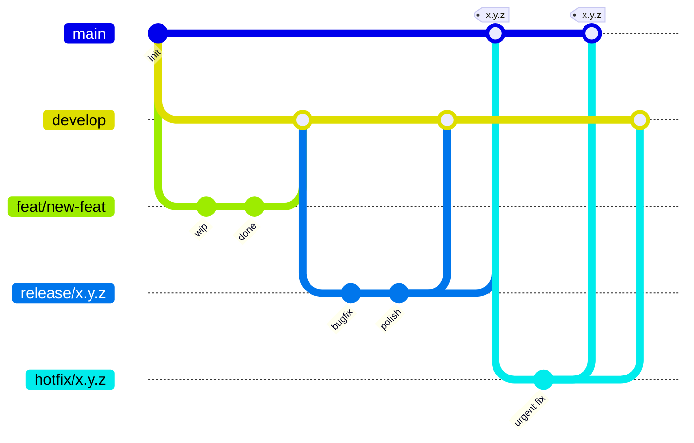
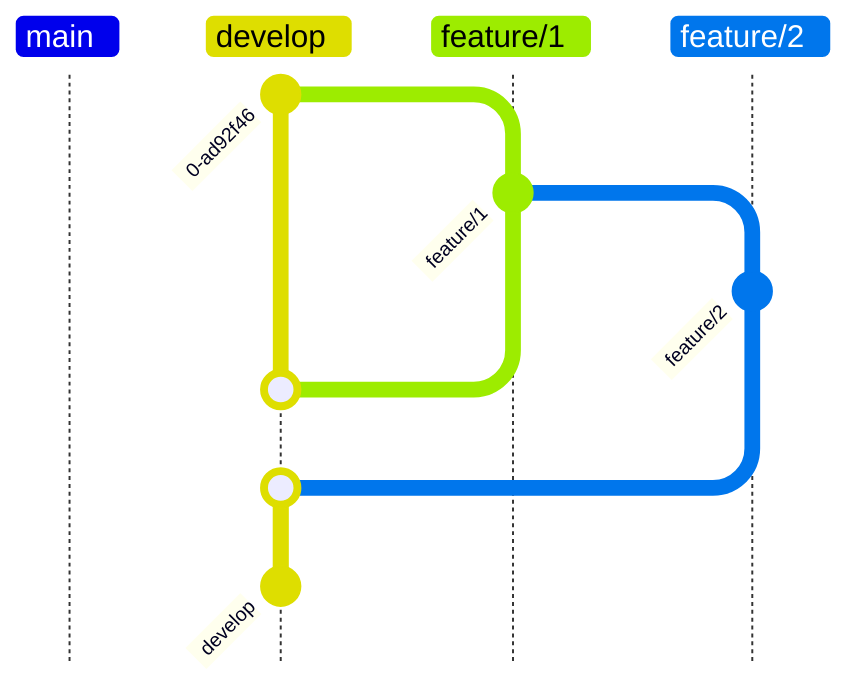
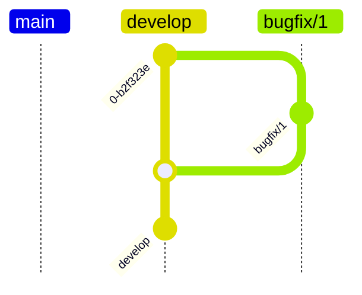
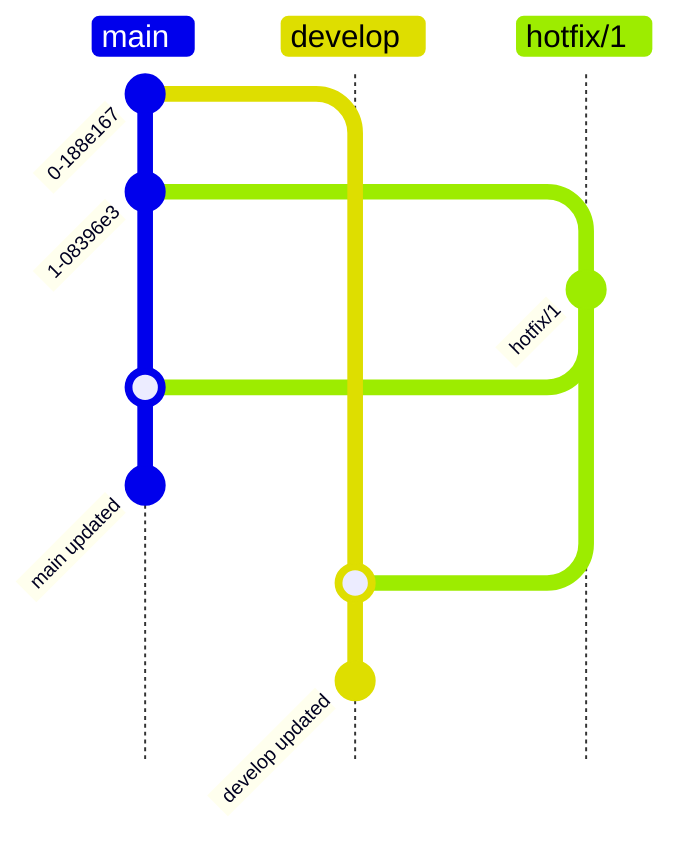
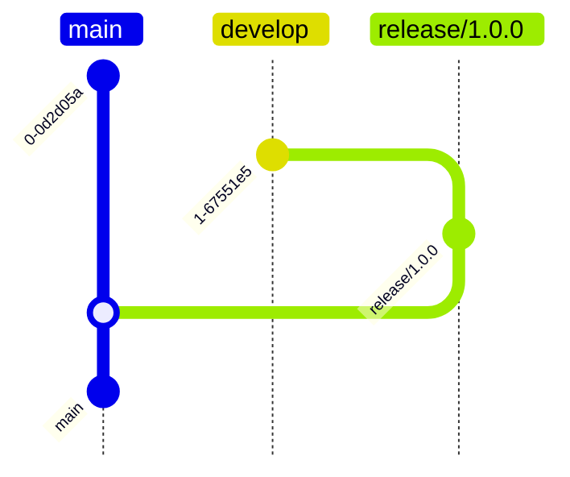

# Git Workflow

## Overview

The full lifecycle: feature flows into `develop`, `develop` flows into `release`, `release` flows into both `main` (tagged) and `develop`, and `hotfix` branches from `main` flow back into both `main` (tagged) and `develop`.

## Branches

- **main** - the main branch, where the production code is stored. 
    - the ci/cd pipeline publishes the code to the **production** environment;
    - if the ci/cd doesnt compile or the tests fail, the commit should be reverted automatically, so the error should never be propagated forward.
    - this branch should be merged from **releases/** branches or **hotfix/** branches;
- **develop** - the development branch, where new features are integrated. 
    - the ci/cd pipeline publishes the code to the **dev** environment.
- **releases/** - release branches, where the code is ready to be released
    - it is originated from the **develop** branch;
- **feature/** - feature branches, where new features are developed
    - it can be originated from either the **develop** branch or any other feature branch;
- **bugfix/** - bugfix branches, where bugs are fixed
    - it is originated from the **develop** branch;
- **hotfix/** - hotfix branches, where urgent fixes are applied
    - it is originated from the **main** branch;

## Creating and merging feature branches

You can create a feature branch from the **develop** branch or any other feature branch.

## Bugfix branches

You can create a bugfix branch from the **develop** branch.

## Hotfix branches

You can create a hotfix branch from the **main** branch, and merge it back to the **main** branch, and optionally apply the fix to the **develop** branch as well.

## Releases branches

You can create a release branch from the **develop** branch.

## Branch deletion

- **feature/** branches should be deleted after merging to **develop**
- **bugfix/** branches should be deleted after merging to **develop**
- **hotfix/** branches should be deleted after merging to **main** and **develop**
- **release/** branches should be deleted after merging to **main** (and **develop** if applicable)