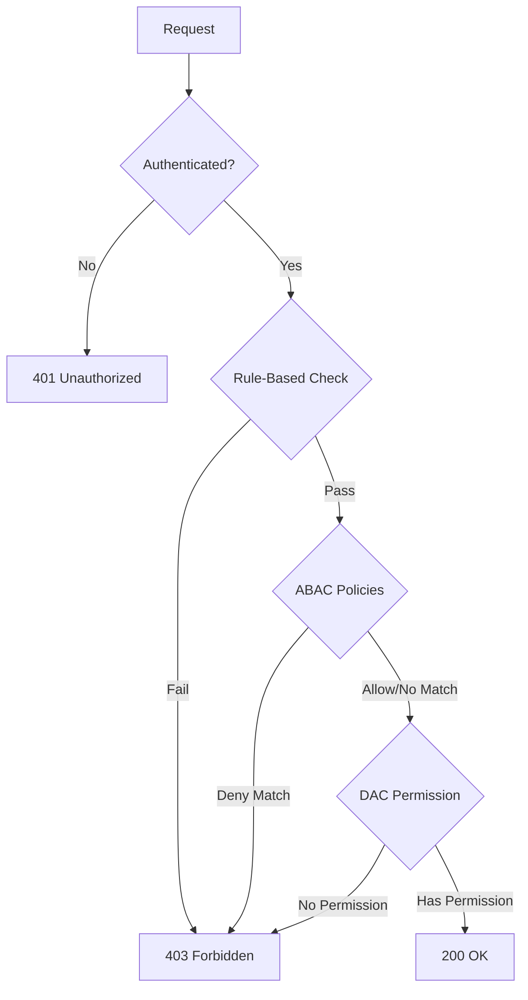

# Permission Evaluation Policy

**Date**: January 12, 2026  
**Version**: 1.1  
**Status**: ✅ DOCUMENTED

This document defines the official permission evaluation policy for the GameGuild authorization system, including conflict resolution rules, layer precedence, and the rationale behind design decisions.

> **Terminology Note**: "Direct" permissions in some documentation refers to **DAC (Discretionary Access Control)** - explicit user-to-resource permission grants. This is sometimes also called ACL (Access Control List) style permissions. The `TenantPermission` entity implements this pattern.

---

## Table of Contents

1. [Executive Summary](#executive-summary)
2. [Authorization Layers](#authorization-layers)
3. [Permission Evaluation Flow](#permission-evaluation-flow)
4. [Conflict Resolution Policy](#conflict-resolution-policy)
5. [Layer-Specific Behavior](#layer-specific-behavior)
6. [Implementation Details](#implementation-details)
7. [Examples](#examples)
8. [Security Considerations](#security-considerations)

---

## Executive Summary

The GameGuild authorization system uses a **multi-layered permission evaluation** architecture with clear conflict resolution rules:

| Layer | Policy Type | Conflict Resolution |
|-------|-------------|---------------------|
| **Rule-Based (RBAC)** | AND-logic rules | First failure stops evaluation |
| **ABAC Policies** | Attribute-based | **Deny-wins** with priority ordering |
| **DAC Permissions** | Discretionary grants | **Allow-wins** (additive) |

**Key Principle**: Higher-level policies (Rules, ABAC) act as **gates** that must pass before DAC permissions are evaluated. Within DAC, permissions are **additive** (allow-wins).

---

## Authorization Layers

The system evaluates authorization through four conceptual layers, processed in order:

```
┌──────────────────────────────────────────────────────────────────┐
│ Layer 1: Authentication Validation                               │
│ • JWT token validation                                           │
│ • Token expiry check                                             │
│ • User existence verification                                    │
│ Result: DENY if unauthenticated (401) → next layer if valid      │
├──────────────────────────────────────────────────────────────────┤
│ Layer 2: Rule-Based Authorization (RBAC)                         │
│ • PolicyRuleset evaluation                                       │
│ • Rules: TenantMatch, RequireAllPermissions, RequireMfa, etc.   │
│ Result: DENY if any enabled rule fails (403) → next if pass     │
├──────────────────────────────────────────────────────────────────┤
│ Layer 3: ABAC Policy Evaluation (Attribute-Based)                │
│ • Conditional policies (time-based, IP-based, attributes)       │
│ • Deny policies evaluated first (deny-wins)                     │
│ Result: DENY if any deny-policy matches (403) → next if pass    │
├──────────────────────────────────────────────────────────────────┤
│ Layer 4: DAC Permission Check (Discretionary)                    │
│ • Global defaults → Tenant defaults → Direct grants             │
│ • Additive permission merging (allow-wins)                       │
│ Result: ALLOW if effective permissions include required → DENY  │
└──────────────────────────────────────────────────────────────────┘
```

---

## Permission Evaluation Flow

### High-Level Flow



### Detailed Evaluation Order

1. **Authentication**: Validate JWT, check token expiry
2. **ActorContext Hydration**: Build security context from claims
3. **Rule-Based Evaluation**: Process all enabled rules (AND logic)
4. **ABAC Evaluation**: Check attribute-based policies (deny-wins)
5. **DAC Evaluation**: Check discretionary permissions (allow-wins)

---

## Conflict Resolution Policy

### Layer Conflicts (Inter-Layer)

When layers produce different results, the **stricter layer wins**:

| Scenario | Rule Layer | ABAC Layer | DAC Layer | Result |
|----------|------------|------------|-----------|--------|
| All pass | ✅ Pass | ✅ Pass | ✅ Has permission | ✅ ALLOW |
| Rule fails | ❌ Fail | - | - | ❌ DENY |
| ABAC deny | ✅ Pass | ❌ Deny | - | ❌ DENY |
| No DAC permission | ✅ Pass | ✅ Pass | ❌ No permission | ❌ DENY |

**Principle**: Authorization layers are **gates** - all gates must open for access.

### ABAC Policy Conflicts (Intra-Layer)

When multiple ABAC policies match the same request:

1. **Deny policies always win** over allow policies
2. Among deny policies, **highest priority** is evaluated first
3. Among allow policies, **any match** grants access

```csharp
// Priority ordering: higher number = higher priority
denyPolicy.Priority = 100;   // Evaluated first among denies
allowPolicy.Priority = 10;   // Lower priority, but deny still wins

// If user matches BOTH:
// Result = DENY (because deny-wins regardless of priority)
```

### DAC Permission Conflicts (Intra-Layer)

DAC permissions use **allow-wins (additive)** logic:

1. **Global defaults** provide base permissions (userId=null, tenantId=null)
2. **Tenant defaults** add tenant-specific permissions (userId=null, tenantId=X)
3. **Direct grants** add user-specific permissions (userId=Y, tenantId=X)
4. **All permissions are merged** using `Distinct()`

```csharp
// PermissionService.GetEffectivePermissionsAsync()
var allPermissions = new List<string>();

// Layer 1: Global defaults
allPermissions.AddRange(globalDefaults);

// Layer 2: Tenant defaults  
allPermissions.AddRange(tenantDefaults);

// Layer 3: Direct user grants
allPermissions.AddRange(directPermissions);

// Merge: Union of all (allow-wins)
return allPermissions.Distinct().ToList();
```

**No Explicit Deny in DAC**: The current DAC system does not support explicit deny permissions. Revoking a permission removes the grant; it does not create a deny entry.

---

## Layer-Specific Behavior

### Layer 1: Authentication

| Check | Failure Response |
|-------|------------------|
| No token | 401 Unauthorized |
| Expired token | 401 Unauthorized |
| Invalid signature | 401 Unauthorized |
| User deleted | 401 Unauthorized |

### Layer 2: Rule-Based Authorization

**Evaluation Logic**: AND (all rules must pass)

| Rule Type | Failure Behavior |
|-----------|------------------|
| `TenantMatch` | Fail if tenant mismatch |
| `RequireAllPermissions` | Fail if missing any permission |
| `RequireAnyPermission` | Fail if missing all permissions |
| `SelfOrPermission` | Fail if not self AND missing permission |
| `OwnerOrAcl` | Fail if not owner AND no ACL entry |
| `RequireIpAllowList` | Fail if IP not in allowlist |
| `RequireTimeWindow` | Fail if outside time window |
| `RequireMfa` | Fail if MFA not verified |

**Short-Circuit**: First rule failure stops evaluation.

### Layer 3: ABAC Policies

**Evaluation Logic**: Deny-wins with priority ordering

```csharp
public enum AbacPolicyEffect
{
    None = 0,
    Allow = 1,
    Deny = 2    // ← Always wins if matched
}
```

**Priority Processing**:
1. Collect all matching policies
2. If ANY deny policy matches → DENY
3. If ANY allow policy matches → ALLOW (proceed to DAC)
4. If no policies match → Use default (typically proceed to DAC)

### Layer 4: DAC Permissions

**Evaluation Logic**: Allow-wins (additive)

**Permission Sources** (evaluated in order, all merged):

1. **Global Defaults** (`UserId = null`, `TenantId = null`)
   - System-wide baseline permissions
   - Example: "Everyone can read public content"

2. **Tenant Defaults** (`UserId = null`, `TenantId = X`)
   - Tenant-specific baseline permissions
   - Example: "All tenant members can view internal projects"

3. **Direct User Grants** (`UserId = Y`, `TenantId = X`)
   - Explicit user permissions within tenant
   - Example: "User Y can edit Project Z"

**Effective Permission Calculation**:
```
EffectivePermissions = GlobalDefaults ∪ TenantDefaults ∪ DirectGrants
```

**Expiration Handling**: Expired permissions are excluded before merging.

---

## Implementation Details

### Key Classes

| Class | Responsibility | Location |
|-------|---------------|----------|
| `RulesetAuthorizationHandler` | Rule-based evaluation | `Authorization/Rules/` |
| `AbacPolicyMiddleware` | ABAC policy evaluation | `Authentication/` |
| `PermissionService` | DAC permission calculation | `Authorization/Services/` |
| `ActorContext` | Immutable security context | `Authorization/Security/` |

### PermissionService.GetEffectivePermissionsAsync()

```csharp
public async Task<List<string>> GetEffectivePermissionsAsync(
    Guid userId, 
    TenantId tenantId,
    CancellationToken cancellationToken = default)
{
    var allPermissions = new List<string>();

    // 1. Global defaults (base permissions for all users)
    var globalDefaults = await GetGlobalDefaultPermissionsAsync(cancellationToken);
    allPermissions.AddRange(globalDefaults);

    // 2. Tenant defaults (permissions for all tenant members)
    var tenantDefaults = await GetTenantDefaultPermissionsAsync(tenantId, cancellationToken);
    allPermissions.AddRange(tenantDefaults);

    // 3. Direct user permissions (explicit grants, excluding expired)
    var directPermissions = await _dbContext.TenantPermissions
        .Where(p => p.UserId == userId)
        .Where(p => p.TenantId == tenantId || p.TenantId == null)
        .Where(p => p.ExpiresAt == null || p.ExpiresAt > DateTime.UtcNow)
        .Select(p => p.Permission)
        .ToListAsync(cancellationToken);
    allPermissions.AddRange(directPermissions);

    // Merge: distinct permissions (allow-wins)
    return allPermissions.Distinct().ToList();
}
```

### RulesetAuthorizationHandler (Rule Layer)

```csharp
protected override async Task HandleRequirementAsync(
    AuthorizationHandlerContext context,
    RulesetRequirement requirement)
{
    // Validate authentication first
    if (requirement.Ruleset.RequireAuthentication && 
        !context.User.Identity?.IsAuthenticated == true)
    {
        context.Fail();
        return;
    }

    // Evaluate ALL enabled rules (AND logic)
    foreach (var rule in requirement.Ruleset.Rules.Where(r => r.Enabled))
    {
        var evaluator = _evaluatorFactory.GetEvaluator(rule.Type);
        var result = await evaluator.EvaluateAsync(context, rule);

        if (!result.IsSuccess && !result.IsSkipped)
        {
            // First failure = DENY (short-circuit)
            context.Fail();
            return;
        }
    }

    context.Succeed(requirement);
}
```

---

## Examples

### Example 1: Standard User Access

**Scenario**: User requests access to a document.

```
User: alice@tenant1.com
Request: GET /api/documents/123
Required Permission: Document.123.Read

Evaluation:
1. ✅ Authentication: Valid JWT for Alice
2. ✅ Rules: TenantMatch passes (Alice is in Tenant1)
3. ✅ ABAC: No deny policies match
4. DAC Check:
   - Global defaults: []
   - Tenant defaults: ["Document.*.Read"]
   - Direct grants: []
   - Effective: ["Document.*.Read"]
   - ✅ Wildcard matches Document.123.Read

Result: 200 OK
```

### Example 2: Denied by ABAC Policy

**Scenario**: Suspended user attempts access.

```
User: bob@tenant1.com (status: suspended)
Request: GET /api/documents/123

Evaluation:
1. ✅ Authentication: Valid JWT for Bob
2. ✅ Rules: TenantMatch passes
3. ABAC Check:
   - Allow Policy: "Department=Engineering can access documents" → MATCHES
   - Deny Policy: "Suspended users denied all access" → MATCHES
   - ❌ Deny-wins: Deny policy matches

Result: 403 Forbidden (ABAC deny policy)
```

### Example 3: Additive DAC Permissions

**Scenario**: User has permissions from multiple sources.

```
User: charlie@tenant1.com
Request: DELETE /api/projects/456
Required Permission: Project.456.Delete

Evaluation:
1. ✅ Authentication: Valid
2. ✅ Rules: Pass
3. ✅ ABAC: No deny policies
4. DAC Check:
   - Global defaults: ["Project.*.Read"]
   - Tenant defaults: ["Project.*.Read", "Project.*.Create"]
   - Direct grants: ["Project.456.Delete", "Project.456.Update"]
   - Effective: ["Project.*.Read", "Project.*.Create", 
                 "Project.456.Delete", "Project.456.Update"]
   - ✅ Has Project.456.Delete

Result: 200 OK
```

### Example 4: Rule Layer Failure

**Scenario**: User attempts access outside allowed time window.

```
User: dave@tenant1.com
Request: POST /api/financial-reports
Time: 2:00 AM UTC (outside 9AM-5PM window)

Evaluation:
1. ✅ Authentication: Valid
2. Rules:
   - TenantMatch: ✅ Pass
   - RequireTimeWindow (9AM-5PM): ❌ FAIL
   - (short-circuit: remaining rules not evaluated)

Result: 403 Forbidden (RequireTimeWindow rule failed)
```

---

## Security Considerations

### Why Different Policies for Different Layers?

| Layer | Policy | Rationale |
|-------|--------|-----------|
| Rules | AND (all must pass) | Security rules are constraints that ALL must be satisfied |
| ABAC | Deny-wins | Attribute-based denials should override attribute-based allows |
| DAC | Allow-wins | Discretionary grants are additive capabilities |

### Potential Future Enhancements

1. **Explicit DAC Deny**: Add `DenyPermission` entity for explicit denials
2. **Permission Inheritance**: Resource hierarchies with cascading permissions
3. **Time-scoped Permissions**: Built-in expiration at DAC layer (already supported)
4. **Conditional DAC**: DAC permissions with attribute conditions

### Audit Trail

All permission evaluations are logged with:
- User ID
- Requested resource
- Required permission
- Evaluation result per layer
- Final decision

See: `Authorization/Middleware/RequestContextLoggingMiddleware.cs`

---

## Summary

| Question | Answer |
|----------|--------|
| What happens when layers conflict? | Stricter layer wins (deny from any layer = overall deny) |
| What happens when ABAC policies conflict? | **Deny-wins** with priority ordering |
| What happens when DAC permissions conflict? | **Allow-wins** (additive merge) |
| Can I explicitly deny a DAC permission? | Not currently; revoke the grant instead |
| Are expired permissions considered? | No; excluded before evaluation |

---

## Related Documentation

- [DAC Strategy](DAC-STRATEGY.md) - Discretionary Access Control design
- [Permissions DAC](permissions-dac.md) - DAC hierarchy and attributes
- [Authorization Validation Report](../../apps/api/AUTHORIZATION_VALIDATION_REPORT.md) - Implementation status

---

**Document Owner**: Security Team  
**Last Updated**: 2026-01-11  
**Review Cycle**: Quarterly
